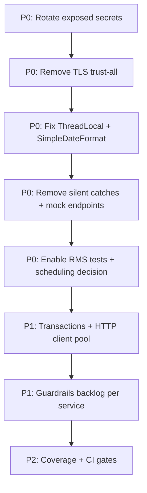

# E4H Digital Platform — Backend Production Readiness Review

**Review date:** July 8, 2026  
**Reviewer role:** Senior Java Engineer  
**Scope:** `backend/` (`core-services/` + `e4h-services/`)  
**Assumption:** System is production-bound or already running in production  
**Reference standards:** `Z_Docs/Z_guardrails/C2 Selco_E4H_Design_Guardrails_v1.txt`, `Z_Docs/Z_guardrails/E4H_*_Guardrails_Compliance_Assessment.md`  
**Method:** Static analysis — grep, file inspection, CI workflow review, test inventory (`find … | wc -l`)

> **Note on BeeHyv Engineering Principles:** `BeeHyv_Engineering_Principles.pdf` was not found in the repository root. This review applies applicable SELCO E4H Design Guardrails (§5–§11, §18–§21) and standard production-readiness criteria from the review prompt.

---

## Executive Summary

**Status: Needs Changes**

The E4H backend is a multi-tenant microservice suite for equipment installation tracking, health-facility/anganwadi registry, incident (issue-ticket) management, vendor resolution workflows, RMS telemetry alerting, and analytics. Services follow DIGIT/Spring Boot conventions with per-service Docker CI on `develop`/`staging`/tags.

**Production blockers and high-severity risks identified:**

| Category | Count | Examples |
|----------|-------|---------|
| TLS trust bypass (JVM-wide and per-call) | 6+ services | `SSLContext.setDefault()`, `restTemplateAcceptingAllCerts()` |
| Hardcoded secrets in source/config | 15+ files | SMS, ES, DB, default user passwords, 20+ vendor passwords in Flyway migration |
| Silent failure / swallowed exceptions | 4 runtime paths | `FacilityService`, `WorkflowService`, `WeeklyReportService`, RMS empty-list fallback |
| Concurrency defects | 4 classes | Static `SimpleDateFormat`; ThreadLocal without `.remove()` |
| Disabled automation | RMS | `@EnableScheduling` commented; all cron jobs off |
| Test enforcement gap | CI-wide | `mvn package` only; RMS `skipTests=true`; ~9% test-to-main ratio |

The platform has a **sound macro-architecture** but is **not production-ready without P0 remediation**. Hold promotion of `rms-service`, `im-services-analytics`, `health-facility-registry`, and `im-services` until security and reliability fixes are verified in staging.

---

## Critical Bug Report

| # | Severity | Location | Issue | Impact |
|---|----------|----------|-------|--------|
| 1 | **BLOCKER** | `rms-service/.../RestTemplateSslUtils.java`, `DataCollectorService.java` (7 call sites), `CenterIdMappingService.java`, `DashboardApiClient.java` | `restTemplateAcceptingAllCerts()` disables TLS cert/hostname validation; **new `RestTemplate` per API call** | MITM on RMS `Access-Token`; no HTTP connection reuse; alert pipeline compromised |
| 2 | **BLOCKER** | `im-services-analytics/.../Main.java`, `inbox/.../InboxApplication.java`, `egov-workflow-v2/.../Main.java`, `health-facility-registry/.../Main.java` | `SSLContext.setDefault()` + trust-all `X509TrustManager` + `HostnameVerifier` → `true` at startup | **JVM-wide** TLS bypass for every HTTPS client in the process |
| 3 | **BLOCKER** | `egov-notification-sms/.../BaseSMSService.java` | `NoopHostnameVerifier` on SMS provider SSL socket factory | TLS hostname validation disabled for outbound SMS API |
| 4 | **BLOCKER** | Multiple `application.properties` | Hardcoded secrets: `sms.provider.password=tarun@123`, `egov.es.password=8fwbD6HbJh6HU0oddsHm8TEI`, `spring.datasource.password=postgres/egov/passer123`, `user.default.password=Beehyv@123`, `Health@2026` | Credential exposure via repo, images, config maps |
| 5 | **BLOCKER** | `im-services/.../V20251120123000__update_migrated_user_passwords.java` | 20+ vendor usernames mapped to plaintext production passwords in committed source | Permanent secret in git history; compliance violation |
| 6 | **HIGH** | `egov-notification-sms/.../RequestContext.java`, `SmsNotificationListener.java` | `ThreadLocal` set in Kafka listener; **no `remove()` / `MDC.clear()` in `finally`** | Stale correlation IDs on reused consumer threads; potential ClassLoader leak in redeploys |
| 7 | **HIGH** | `im-services-analytics/.../WeeklyReportService.java`, `DynamicEmailTemplateService.java`, `WeeklyReportEmailService.java` | `private static final SimpleDateFormat` shared across `@Service` beans | Not thread-safe; concurrent report generation can corrupt dates or throw |
| 8 | **HIGH** | `health-facility-registry/.../FacilityService.java` (lines ~266, ~812), `egov-workflow-v2/.../WorkflowService.java` (line ~155) | Empty `catch (Exception e) {}` blocks | Silent failures: unencrypted POC phone persisted; workflow migration search enrichment skipped |
| 9 | **HIGH** | `im-services-analytics/.../WeeklyReportService.java` (line ~132) | `catch (Exception ignored) {}` on date parsing | Malformed date strings silently skipped in weekly reports |
| 10 | **HIGH** | `rms-service/.../DataCollectorService.java` | 8 `catch` blocks return `new ArrayList<>()` on collection failure | Rule engine runs on empty data; **missed RMS alerts** with only error logs |
| 11 | **HIGH** | `im-services/.../MockController.java` | `/mock/*` endpoints active; `finally { mockDataFile.close(); }` when `mockDataFile` may be `null` | Test surface in prod builds; secondary NPE masks root error |
| 12 | **HIGH** | `rms-service/.../RMSApplication.java`, `RMSScheduler.java`, `MappingScheduler.java` | `@EnableScheduling` commented out; all `@Scheduled` jobs commented | Documented 15-min rule engine and daily solar jobs **do not run** |
| 13 | **HIGH** | `rms-service/pom.xml` | `<skipTests>true</skipTests>` in Surefire | Unit tests never executed in RMS build/CI |
| 14 | **MEDIUM** | Backend-wide | No `SecurityFilterChain`, `@PreAuthorize`, or `spring-boot-starter-security` | Defense-in-depth absent; relies entirely on API gateway |
| 15 | **MEDIUM** | `im-services/.../FFMpegExecutor.java`, `processor-services/.../FFMpegExecutor.java` | `Runtime.getRuntime().exec(command)` with unsanitized string | Command injection if caller input reaches `command` |
| 16 | **MEDIUM** | `rms-service` (entire module) | No `@Transactional` annotations | Partial alert/ticket/dedup failures may leave inconsistent `active_alerts` state |
| 17 | **MEDIUM** | `health-facility-registry`, `asset-registry`, `processor-services` `application.properties` | `management.endpoints.web.exposure.include=*` | Full actuator surface exposed if deployed without network restriction |
| 18 | **MEDIUM** | `health-facility-registry/.../application.properties` | `is.workflow.enabled=false` | Facility lifecycle bypasses workflow v2; audit/state transitions inconsistent with IM |

---

## Checklist Scorecard

| Area | Rating | Score | Notes |
|------|--------|-------|-------|
| Product intent & architecture fit | Partial | 6/10 | Domain boundaries clear per service README; root README is one line; E4H adaptations break DIGIT persister pattern in boundary/facility services |
| Git discipline & engineering maturity | Partial | 6/10 | `develop`/`staging`/tag branching in CI; guardrails assessments maintained; large migration commits with embedded secrets |
| Code health & implementation | Needs work | 5/10 | Swallowed exceptions, silent fallbacks, god-classes (`EscalationController` 1270 LOC, `FacilityService` 2011 LOC, `DataCollectorService` 1206 LOC) |
| Resource management & memory safety | Needs work | 5/10 | Good try-with-resources in Flyway migrations/FFmpeg; MockController NPE risk; ThreadLocal leak; per-call RestTemplate |
| Concurrency & thread safety | Needs work | 4/10 | Static `SimpleDateFormat`; Kafka consumer ThreadLocal; no scheduler locking (when enabled) |
| Failure handling & defensive design | Needs work | 4/10 | RMS returns empty on failure; multiple empty catches; retry in RMS HTTP only |
| Runtime observability | Partial | 6/10 | SLF4J + egov-tracer; correlation ID partial (SMS only); actuator over-exposure in 3 services |
| Data access & persistence safety | Partial | 7/10 | Spring JDBC + parameterized queries; HikariCP via Spring Boot; no raw `DriverManager` in request paths; Flyway used |
| Configuration & secret hygiene | **Fail** | 2/10 | Hardcoded passwords in properties and Java migrations |
| Testing strategy & confidence | **Fail** | 3/10 | 131 test / 1,424 main Java files (~9%); RMS tests skipped; CI = `mvn package` only |
| Performance & scale readiness | Partial | 6/10 | Kafka async; RMS pagination; blocking HTTP in schedulers; ES bulk in analytics |
| Dependency & supply-chain health | Partial | 7/10 | Spring Boot 3.4.x (rms); pinned parent POMs; SonarCloud on `main`/`develop` |
| Project structure & formatting | Good | 8/10 | Standard DIGIT layout: config, service, repository, web, validator |

**Overall weighted assessment: 5.2 / 10 — Needs Changes**

---

## Detailed Findings

### 1. Product Intent & Architecture

**Strengths**
- Service READMEs (e.g. `rms-service`, `im-services`) document purpose, dependencies, Kafka topics, APIs, and rule-engine behaviour.
- RMS pipeline is well-decomposed: `DataCollectorService` → `RuleEngineService` → `DeduplicationManager` → `PayloadGenerator` → `SauraEmitraConnector`.
- Existing guardrails assessments (`Z_Docs/Z_guardrails/`) provide a maintained compliance baseline per service.

**Gaps**
- Root `README.md` is one line; onboarding relies on per-service docs and `Z_Docs/`.
- `boundary-service`: Kafka persister write path changed during E4H adaptation (documented P0 in guardrails assessment).
- `health-facility-registry`: workflow disabled, mixed JDBC + Kafka writes, non-standard audit field names, direct boundary JDBC.
- `MockController` (`/mock/requests/_create`, `_search`, `_update`) ships in production IM artifact without profile gating.

**Guardrails violations**
- §5 Service Design: inconsistent write paths (facility registry direct JDBC).
- §8 Extensibility: mock controller and hardcoded migration logic increase operational risk.
- §9 Security Engineering: secrets in source, TLS bypass (see §5 below).

---

### 2. Resource Management & Memory Safety

**Good patterns observed**
- Flyway Java migrations consistently use try-with-resources for `Connection`, `PreparedStatement`, `ResultSet`, `PrintWriter`.
- `FFMpegExecutor` (im-services, processor-services) uses try-with-resources for stream readers and `process.destroy()` in `finally`.
- `MinioRepository`, `ServiceRequestRepository` use try-with-resources for file streams.
- No `DriverManager.getConnection` in application request paths; Spring Boot datasource defaults to HikariCP.

**Problems**

```java
// MockController.java — NPE if getInputStream() fails before assignment
} finally {
    mockDataFile.close();  // mockDataFile may be null
}
```

```java
// RequestContext.java — no clear/remove API
private static final ThreadLocal<String> id = new ThreadLocal<>();
// SmsNotificationListener sets but never clears
RequestContext.setId(UUID.randomUUID().toString());
```

```java
// DataCollectorService.java — new trust-all client per API invocation (7 sites)
RestTemplate rt = restTemplateAcceptingAllCerts();
```

```java
// DataCollectorService.java — duplicate import (copy-paste smell)
import org.egov.rms.service.CenterIdMappingService;
import org.egov.rms.service.CenterIdMappingService;
```

---

### 3. Concurrency & Thread Safety

| Pattern | Verdict |
|---------|---------|
| `ThreadLocal` in `RequestContext` | Static final ✓ — but **missing `.remove()`** ✗ |
| `static SimpleDateFormat` in analytics services | **Not thread-safe** ✗ |
| `VideoQualityFactory.dynamicQualities` | Static `HashMap`, populated once at `@PostConstruct` — bounded ✓ |
| `@Async` in filestore, vendor-registry | Present; executor config should be verified per service |
| RMS schedulers | Disabled — no concurrent run risk today, but also no automation |

---

### 4. Failure Handling

**Silent failure anti-patterns**

```java
// WorkflowService.searchProcessInstanceMigration (~line 155)
try {
    enrichmentService.enrichUsersFromSearch(requestInfo, processInstances);
} catch (Exception e) {}  // users never enriched; no log
```

```java
// FacilityService — POC phone encryption (~lines 266, 812)
catch (Exception e){}  // may persist plaintext mobile numbers
```

```java
// DataCollectorService.collectPanelData (and 7 similar paths)
} catch (Exception e) {
    log.error("Error collecting panel data", e);
    return new ArrayList<>();  // downstream treats as "no issues"
}
```

```java
// WeeklyReportService (~line 132)
} catch (Exception ignored) {}  // date parse failures silently dropped
```

**Retry**
- RMS HTTP calls implement exponential backoff — good.
- Not consistently applied across inter-service `RestTemplate` usage.
- SMS listener routes failures to backup/error Kafka topics — good pattern, but missing ThreadLocal cleanup.

---

### 5. Security & Secret Hygiene

**Hardcoded credentials (verified sample)**

| File | Secret type |
|------|-------------|
| `egov-notification-sms/.../application.properties` | `sms.provider.password=tarun@123` |
| `inbox/.../application.properties` | `egov.es.password=8fwbD6HbJh6HU0oddsHm8TEI` |
| `vendor-registry/.../application.properties` | `user.default.password = Beehyv@123` |
| `field-planner/`, `amc-scheduler-service/.../application.properties` | `email.activity.assignment.default.password = Beehyv@123` |
| `health-facility-registry/.../application.properties` | `user.default.password=Health@2026` |
| `field-planner-activity/.../application.properties` | `spring.datasource.password=passer123` |
| `V20251120123000__update_migrated_user_passwords.java` | 20+ vendor passwords (`Energy@123`, `Mediwave@134#`, …) |

**TLS bypass inventory**

| Service | Mechanism |
|---------|-----------|
| `rms-service` | `RestTemplateSslUtils.restTemplateAcceptingAllCerts()` — per-call |
| `im-services-analytics`, `inbox`, `egov-workflow-v2`, `health-facility-registry` | `SSLContext.setDefault()` + trust-all at startup |
| `egov-notification-sms` | `NoopHostnameVerifier` in `BaseSMSService` |
| `im-services` Flyway migrations | `TrustAllStrategy` — acceptable for one-off ops scripts only |

**Application security**
- No Spring Security layer detected in backend services.
- Acceptable only if API gateway enforces auth consistently; must be documented and contract-tested.

**Guardrails violations**
- §9 Security Engineering: secrets in source, TLS bypass.
- §11 Observability: risk of PII in logs when encryption silently fails.

---

### 6. Testing & CI/CD

| Metric | Value |
|--------|-------|
| Main Java sources | 1,424 |
| Test Java sources | 131 (~9.2%) |
| RMS Surefire | `skipTests=true` |
| GitHub Actions (per service, e.g. `rms-service.yaml`) | `mvn -B package` → Docker push; **no `mvn test`** |
| SonarCloud (`.github/workflows/sonarcloud.yml`) | Runs on `main`/`develop`; not evident as merge gate |

Services with meaningful tests: `project`, `vendor-registry`, `egov-workflow-v2`, `egov-filestore`, `boundary-service`. Critical paths (`rms-service`, `im-services-analytics`, `health-facility-registry`, `im-services`) are under-tested relative to business risk.

---

### 7. Operational Readiness

**RMS service**
- README documents cron schedules (`0 */15 * * * *` rule engine, daily solar); code has scheduling **disabled**.
- Manual trigger `POST /rms-service/v1/trigger` exists — operational workaround only.
- Alert deduplication and ticket creation logic cannot be trusted in unattended production.

**Observability**
- Structured logging via SLF4J across services.
- Correlation ID partial (SMS consumer only; no global servlet filter cleanup).
- Actuator: `health-facility-registry`, `asset-registry`, `processor-services` expose `management.endpoints.web.exposure.include=*`.

**CI/CD**
- Per-service workflows on `develop`/`staging`/tags — good isolation.
- DB migration images built alongside app images — good for Flyway.
- `Workflow_Trigger` job dispatches DevOps deploy on `develop` push — no automated test stage before deploy.

---

### 8. Data Access

- Query builders use parameterized JDBC (`?` placeholders) — SQL injection risk low in reviewed paths.
- `rms-service` has **no `@Transactional`** — partial alert/ticket failures may leave inconsistent `active_alerts` state.
- `AlertRepository` performs multi-step read-check-write for dedup without explicit transaction boundary.
- Elasticsearch index migrations in `im-services` use `TrustAllStrategy` — acceptable only as one-off ops scripts.

---

### 9. BeeHyv / SELCO Guardrails Compliance (Summary)

| Guardrail | Status |
|-----------|--------|
| §5 Service boundaries & persister pattern | Partial — boundary-service, facility-registry gaps |
| §9 Security (secrets, TLS) | **Not followed** |
| §11 Observability & audit | Partial — correlation ID incomplete |
| §18 Layering (controller/service/repository) | Mostly followed |
| §19 Error handling | **Not followed** — empty catches |
| §20 Input validation | Partial — Jakarta validation on some controllers |
| §21 Data contracts | Good — shared egov contracts |

Refer to `Z_Docs/Z_guardrails/E4H_Core_Services_Guardrails_Compliance_Assessment.md` and `E4H_Design_Guardrails_Compliance_Assessment.md` for per-service gap tracking.

---

## Refactoring Suggestions

### P0 — Before production (blockers)

1. **Remove TLS bypass from runtime paths**
   - Delete `RestTemplateSslUtils.restTemplateAcceptingAllCerts()` from production code paths.
   - Remove `trustSelfSignedSSL()` / `SSLContext.setDefault()` from all `Main` classes.
   - Replace `NoopHostnameVerifier` in `BaseSMSService` with proper truststore configuration.
   - Configure truststore with proper CA certs; use a single injected, pooled `RestTemplate` or `WebClient` bean.

2. **Externalize all secrets**
   - Replace hardcoded `application.properties` credentials with `${ENV_VAR}` only (no defaults for secrets).
   - Rotate all exposed credentials (SMS, ES, DB, default passwords, vendor passwords).
   - Remove password maps from Flyway Java migrations; use secure vault + one-time ops runbook.

3. **Fix ThreadLocal lifecycle**
   - Add `RequestContext.clear()` calling `id.remove()` and `MDC.remove(CORRELATION_ID)`.
   - Invoke in Kafka listener `finally` and HTTP filter `finally`.

4. **Replace static `SimpleDateFormat`**
   - Use `DateTimeFormatter` (immutable) or `ThreadLocal<SimpleDateFormat>` with cleanup in analytics services.

5. **Eliminate silent catches**
   - Log at WARN/ERROR with context in `FacilityService`, `WorkflowService`, `WeeklyReportService`.
   - Change `DataCollectorService` to propagate failures or return a result type with explicit error state.

6. **Re-enable or explicitly document RMS scheduling**
   - Uncomment `@EnableScheduling` and cron jobs, or remove manual-only assumption from README and ops runbooks.

7. **Remove or gate `MockController`**
   - `@Profile("local")` or delete from production artifact.

8. **Enable RMS tests in CI**
   - Set `skipTests=false`; add `mvn test` step to all service workflows.

### P1 — Near-term hardening

9. **Add Spring Security resource server** (or document gateway-only model with contract tests).

10. **Transactional boundaries in RMS** around alert create + ticket create + dedup update.

11. **HTTP client consolidation** — one configured `RestTemplate`/`WebClient` with timeouts, retries, connection pool.

12. **Restore boundary-service Kafka persister** per guardrails P0.

13. **health-facility-registry** — enable workflow (`is.workflow.enabled=true`), standardize audit fields, remove direct JDBC boundary writes.

14. **Split large classes** — `EscalationController`, `FacilityService`, `DataCollectorService`.

15. **Restrict actuator exposure** — replace `include=*` with explicit endpoint list; protect with network policy.

### P2 — Engineering excellence

16. **Raise test coverage target** to ≥40% on critical services with integration tests for Kafka + DB paths.

17. **CI test gate** — fail build on test failure; enforce SonarCloud quality gate.

18. **Command execution** — replace `Runtime.exec(String)` with `ProcessBuilder` and argument list; validate inputs.

19. **Correlation ID filter** — global servlet filter + Kafka producer interceptor.

20. **Document architecture** — expand root README with service map, deployment diagram, and auth model.

---

## Service-Level Risk Heatmap

| Service | Production risk | Primary concerns |
|---------|----------------|------------------|
| `rms-service` | **Critical** | TLS bypass, silent empty returns, scheduling off, tests skipped, no transactions |
| `im-services-analytics` | **High** | Global SSL bypass, static SimpleDateFormat, 1270-line controller |
| `health-facility-registry` | **High** | Empty catches, SSL bypass, workflow disabled, guardrails gaps, 2011-line service |
| `im-services` | **High** | Mock endpoints, migration secrets, `Runtime.exec` for video |
| `inbox` | **Medium** | SSL bypass, hardcoded ES password |
| `egov-notification-sms` | **Medium** | ThreadLocal leak, hardcoded SMS password, NoopHostnameVerifier |
| `egov-workflow-v2` | **Medium** | SSL bypass, empty catch in migration search |
| `processor-services` | **Medium** | `Runtime.exec`, actuator `include=*` |
| `vendor-registry` | **Medium** | Default password in config |
| `core-services` (others) | **Low–Medium** | Mostly DIGIT upstream patterns; secret defaults in properties |

---

## Recommended Remediation Sequence



---

## Conclusion

The E4H backend has a **sound macro-architecture** aligned with DIGIT microservice conventions and meaningful domain documentation for key services. Production deployment today carries **unacceptable security exposure** (TLS bypass, secrets in repo) and **reliability gaps** (silent failures, disabled RMS automation, skipped tests).

**Recommendation:** Hold production promotion of `rms-service`, `im-services-analytics`, `health-facility-registry`, and `im-services` until P0 items are resolved and verified in staging. Other services may proceed only after a credential rotation and SSL hardening pass.

---

*Generated from static analysis of `/backend` on July 8, 2026. Runtime verification (load tests, penetration test, staging soak) is advised before final sign-off.*
