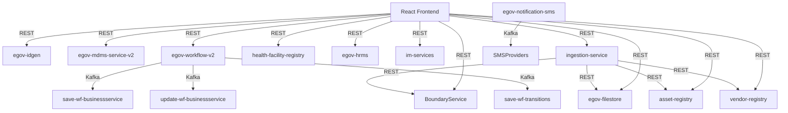

# E4H Digital Platform – Project Lead Deep Dive Documentation

## Table of Contents
1. Project Overview
2. System Architecture
3. Service Inventory & Responsibilities
4. Backend Services Deep Dive
    - Core Services
    - E4H Services
5. Frontend Deep Dive
6. Data Models & Relationships
7. Integration & Data Flow
8. Kafka Topics & Messaging
9. Build, Deployment & Environments
10. Development Standards & Best Practices
11. Onboarding & Troubleshooting
12. Glossary
13. Appendix: Diagrams & References

---

## 1. Project Overview

E4H Digital Platform is a modular, microservices-based system for health facility and asset management. The platform is designed for extensibility, rapid onboarding, and robust integration with external systems.

---

## 2. System Architecture

- Backend: Java (Spring Boot), Python (FastAPI)
- Frontend: React (micro-ui)
- Data Storage: PostgreSQL, MongoDB
- Inter-service Communication: REST APIs, Kafka
- DevOps: Docker, Jenkins
- Authentication/Authorization: JWT

### Architecture Diagram


---

## 3. Service Inventory & Responsibilities

| Service                  | Language | Purpose/Responsibility                                      | Key Dependencies         |
|--------------------------|----------|------------------------------------------------------------|--------------------------|
| boundary-service         | Java     | Manage administrative boundaries, hierarchies               | DB                       |
| egov-filestore           | Java     | File upload, storage, and retrieval                         | Storage backend, DB      |
| egov-idgen               | Java     | Generate unique IDs based on formats                        | egov-mdms-service        |
| egov-mdms-service-v2     | Java     | Master data management service                              | DB                       |
| egov-notification-sms    | Java     | SMS notification via Kafka consumers                        | Kafka, SMS providers     |
| egov-workflow-v2         | Java     | Workflow engine for state transitions                       | egov-mdms, egov-user     |
| health-facility-registry | Java     | Registry for health facilities                              | DB                       |
| ingestion-service        | Python   | Data ingestion (Excel), validation, and integration         | All registry services    |
| asset-registry           | Java     | Asset management                                            | DB                       |
| vendor-registry          | Java     | Vendor/organization management                              | DB                       |
| egov-hrms                | Java     | Human Resource Management                                   | DB                       |
| im-services              | Java     | Incident management                                         | DB                       |

---

## 4. Backend Services Deep Dive

### Core Services Architecture

#### 1. Boundary Service (`backend/core-services/boundary-service/`)

**Purpose**: Manages geographical boundaries and administrative hierarchies for the E4H platform.

**Technology Stack**:
- **Framework**: Spring Boot 3.x with Spring JDBC
- **Database**: PostgreSQL with JdbcTemplate
- **Messaging**: Apache Kafka for async processing
- **Validation**: Jakarta Validation API
- **Serialization**: Jackson ObjectMapper

**Key Components**:

**Service Layer**:
```java
@Service
public class BoundaryService {
    private final BoundaryEntityValidator boundaryEntityValidator;
    private final ResponseUtil responseUtil;
    private final BoundaryRepositoryImpl repository;
    
    // Core operations: create, search, update boundaries
    public BoundaryResponse createBoundary(BoundaryRequest boundaryRequest)
    public BoundaryResponse searchBoundary(BoundarySearchCriteria criteria, RequestInfo requestInfo)
    public BoundaryResponse updateBoundary(BoundaryRequest boundaryRequest)
}
```

**Repository Layer**:
```java
@Repository
public class BoundaryRepositoryImpl implements BoundaryRepository {
    private final JdbcTemplate jdbcTemplate;
    private final BoundaryEntityRowMapper boundaryEntityRowMapper;
    private final BoundaryEntityQueryBuilder boundaryEntityQueryBuilder;
    private final Producer producer;
    
    // Kafka-based persistence with async processing
    public void create(BoundaryRequest boundaryRequest) {
        producer.push(applicationProperties.getCreateBoundaryTopic(), boundaryRequest);
    }
}
```

**Data Models**:
```java
@Data
@Builder
public class Boundary {
    private String id;
    private String tenantId;
    @NotNull private String code;
    private JsonNode geometry;
    private AuditDetails auditDetails;
    private JsonNode additionalDetails;
}
```

**Configuration Properties**:
```java
@Component
public class ApplicationProperties {
    // External service endpoints
    @Value("${egov.user.host}") private String userHost;
    @Value("${egov.idgen.host}") private String idGenHost;
    @Value("${egov.workflow.host}") private String wfHost;
    @Value("${egov.mdms.host}") private String mdmsHost;
    
    // Kafka topics
    @Value("${kafka.topics.create.boundary}") private String createBoundaryTopic;
    @Value("${kafka.topics.update.boundary}") private String updateBoundaryTopic;
    @Value("${kafka.topics.create.boundary.hierarchy}") private String createBoundaryHierarchyTopic;
}
```

**Key Features**:
- Hierarchical boundary management (Country → State → District → Block)
- Geometry support for spatial data
- Multi-tenant architecture
- Async processing via Kafka
- Comprehensive validation and enrichment

#### 2. File Store Service (`backend/core-services/egov-filestore/`)

**Purpose**: Centralized file storage and management with support for multiple cloud providers.

**Technology Stack**:
- **Framework**: Spring Boot with Spring Data JPA
- **Storage**: MinIO, Azure Blob Storage, Local File System
- **Database**: PostgreSQL for metadata
- **Video Processing**: FFmpeg for HLS streaming

**Key Components**:

**Storage Service**:
```java
@Service
public class StorageService {
    private final CloudFilesManager cloudFilesManager;
    private final ArtifactRepository artifactRepository;
    private final ArtifactMapper artifactMapper;
    
    // File operations with cloud storage integration
    public List<String> save(List<MultipartFile> files, String module, String tag, String tenantId, RequestInfo requestInfo)
    public List<FileInfo> retrieveByTag(String tag, String tenantId)
    public Map<String, String> getUrls(String tenantId, List<String> fileStoreIds)
    public Resource retrieve(String fileStoreId, String tenantId) throws IOException
}
```

**Cloud Storage Implementations**:
```java
@Service
public class MinioRepository implements CloudFilesManager {
    // MinIO S3-compatible storage implementation
}

@Service
public class AzureBlobStorageImpl implements CloudFilesManager {
    // Azure Blob Storage implementation
}
```

**HLS Video Processing**:
```java
@Service
public class HLSStorageService {
    // HLS (HTTP Live Streaming) video processing and storage
    public Resource retrieve(String fileStoreId, String quality, String fileName, String tenantId)
}
```

**Key Features**:
- Multi-cloud storage support (MinIO, Azure, Local)
- HLS video streaming capabilities
- File metadata management
- Tenant-based file isolation
- URL generation and access control

#### 3. Workflow Service V2 (`backend/core-services/egov-workflow-v2/`)

**Purpose**: Advanced workflow management with state transitions, SLA monitoring, and escalation handling.

**Technology Stack**:
- **Framework**: Spring Boot with Spring Data JPA
- **Database**: PostgreSQL
- **Messaging**: Apache Kafka
- **SLA Monitoring**: Custom implementation with escalation

**Key Components**:

**Workflow Service**:
```java
@Service
public class WorkflowService {
    private final TransitionService transitionService;
    private final EnrichmentService enrichmentService;
    private final WorkflowValidator workflowValidator;
    private final StatusUpdateService statusUpdateService;
    private final WorKflowRepository workflowRepository;
    
    // Core workflow operations
    public List<ProcessInstance> transition(ProcessInstanceRequest request)
    public List<ProcessInstance> search(RequestInfo requestInfo, ProcessInstanceSearchCriteria criteria)
    public Integer count(RequestInfo requestInfo, ProcessInstanceSearchCriteria criteria)
    public List statusCount(RequestInfo requestInfo, ProcessInstanceSearchCriteria criteria)
}
```

**Transition Service**:
```java
@Service
public class TransitionService {
    // Handles state transitions and business logic validation
    public List<ProcessStateAndAction> getProcessStateAndActions(List<ProcessInstance> processInstances, boolean isTransition)
}
```

**SLA and Escalation**:
```java
@Service
public class EscalationService {
    // SLA monitoring and escalation handling
}

@Service
public class StatusUpdateService {
    // Status updates and workflow progression
}
```

**Key Features**:
- Configurable business workflows
- SLA monitoring and escalation
- Role-based access control
- State transition validation
- Audit trail and history tracking

#### 4. ID Generation Service (`backend/core-services/egov-idgen/`)

**Purpose**: Centralized ID generation for all services with configurable patterns.

**Technology Stack**:
- **Framework**: Spring Boot
- **Database**: PostgreSQL with sequence management
- **Integration**: MDMS for configuration

**Key Components**:

**ID Generation Service**:
```java
@Service
public class IdGenerationService {
    // Generates unique IDs based on configured patterns
    public List<String> getIdList(RequestInfo requestInfo, String tenantId, String idKey, String idformat, Integer count)
}
```

**MDMS Integration**:
```java
@Service
public class MdmsService {
    // Master Data Management System integration for ID patterns
}
```

#### 5. SMS Notification Service (`backend/core-services/egov-notification-sms/`)

**Purpose**: SMS notification delivery with multiple provider support.

**Technology Stack**:
- **Framework**: Spring Boot
- **Messaging**: Apache Kafka
- **SMS Providers**: Generic, MSDG, Console implementations

**Key Components**:

**SMS Service Implementations**:
```java
@Service
public class GenericSMSServiceImpl implements SMSService {
    // Generic SMS provider implementation
}

@Service
public class MSDGSMSServiceImpl implements SMSService {
    // MSDG SMS provider implementation
}

@Service
public class ConsoleSMSServiceImpl implements SMSService {
    // Console-based SMS for development/testing
}
```

**Kafka Integration**:
```java
@Service
public class SmsNotificationListener {
    // Kafka consumer for SMS notification requests
}
```

#### 6. MDMS Service V2 (`backend/core-services/egov-mdms-service-v2/`)

**Purpose**: Master Data Management System for centralized configuration and reference data.

**Technology Stack**:
- **Framework**: Spring Boot with Spring Data JPA
- **Database**: PostgreSQL
- **Schema Management**: JSON Schema validation

**Key Components**:

**MDMS Service**:
```java
@Service
public class MDMSServiceV2 {
    // Master data management operations
}

@Service
public class SchemaDefinitionService {
    // JSON schema definition and validation
}
```

### E4H Business Services

#### 1. Ingestion Service (`backend/e4h-services/ingestion-service/`)

**Purpose**: Excel-based data ingestion for bulk operations across multiple services.

**Technology Stack**:
- **Framework**: FastAPI (Python)
- **Data Processing**: Pandas, OpenPyXL
- **Validation**: Custom validators with MDMS integration
- **File Processing**: Excel file handling

**Key Components**:

**FastAPI Application**:
```python
app = FastAPI()
app.add_middleware(CORSMiddleware, allow_origins=["*"])
app.include_router(api_router)
```

**API Endpoints**:
```python
@router.post('/vendors')
async def upload_vendors_excel_sheet(
    vendor_file: UploadFile,
    vendor_sheet_name: str = Form(default="Vendor Input"),
    boundary_sheet_name: str = Form(default="Boundary Code"),
    request_info: str = Form(default="")
)

@router.post('/boundaries')
async def upload_boundaries_excel_sheet(
    boundary_file: UploadFile,
    boundary_sheet_name: str = Form(default="Boundary Data"),
    request_info: str = Form(default="")
)

@router.post('/facilities')
async def upload_facilities_excel_sheet(
    facility_file: UploadFile,
    facility_sheet_name: str = Form(default="FacilityIngestionTemplate"),
    request_info: str = Form(default="")
)

@router.post('/projects')
async def upload_projects_excel_sheet(
    project_file: UploadFile,
    project_sheet_name: str = Form(default="Project Data"),
    request_info: str = Form(default="")
)
```

**Data Processors**:
```python
class VendorDataProcessorFactory:
    @staticmethod
    def create_processor(file_path, vendor_sheet, boundary_sheet, mdms_url, request_info):
        # Factory pattern for vendor data processing

class BoundaryDataProcessorFactory:
    @staticmethod
    def create_processor(file_path, boundary_sheet, mdms_url, request_info):
        # Factory pattern for boundary data processing
```

**Service Clients**:
```python
class OrganizationServiceClient:
    # Integration with vendor registry service
    
class FacilityServiceClient:
    # Integration with health facility registry
    
class ProjectServiceClient:
    # Integration with project service
    
class HRMSServiceClient:
    # Integration with HRMS service
```

**Key Features**:
- Excel file validation and processing
- Multi-service data ingestion
- Real-time validation against MDMS
- Error reporting and status tracking
- RBAC validation for secure operations

#### 2. HRMS Service (`backend/e4h-services/egov-hrms/`)

**Purpose**: Human Resource Management System for employee lifecycle management.

**Technology Stack**:
- **Framework**: Spring Boot with Spring Data JPA
- **Database**: PostgreSQL
- **Messaging**: Apache Kafka
- **Integration**: User service, ID generation, notifications

**Key Components**:

**Employee Service**:
```java
@Service
public class EmployeeService {
    @Autowired private UserService userService;
    @Autowired private IdGenService idGenService;
    @Autowired private HRMSProducer hrmsProducer;
    @Autowired private EmployeeRepository repository;
    @Autowired private NotificationService notificationService;
    
    // Employee lifecycle management
    public EmployeeResponse create(EmployeeRequest employeeRequest)
    public EmployeeResponse search(EmployeeSearchCriteria criteria, RequestInfo requestInfo)
    public EmployeeResponse update(EmployeeRequest employeeRequest)
}
```

**User Integration**:
```java
@Service
public class UserService {
    // Integration with egov-user service for user management
    public UserResponse getUser(RequestInfo requestInfo, Map<String, Object> userSearchCriteria)
}
```

**Repository Layer**:
```java
@Repository
public class EmployeeRepository {
    // Employee data persistence with JdbcTemplate
}

@Repository
public class EmployeeQueryBuilder {
    // Dynamic query building for employee search
}
```

**Key Features**:
- Employee creation and management
- Role-based access control
- User account integration
- Notification system
- Multi-tenant support

#### 3. IM Services (`backend/e4h-services/im-services/`)

**Purpose**: Incident Management with video processing and storage capabilities.

**Technology Stack**:
- **Framework**: Spring Boot
- **Video Processing**: FFmpeg
- **Storage**: Multi-provider support
- **Messaging**: Apache Kafka

**Key Components**:

**Video Service**:
```java
@Service
public class VideoService {
    private final VideoUtil videoUtil;
    private final FFmpegService fFmpegService;
    private final DirectoryUtil directoryUtil;
    private final StorageUtil storageUtil;
    private final VideoUploaderService uploaderService;
    
    public StorageResponse processVideo(File inputFile, ProcessingContext context)
}
```

**FFmpeg Integration**:
```java
@Service
public class FFMpegExecutor {
    // FFmpeg command execution for video processing
}
```

**Storage Service**:
```java
@Service
public class StorageService {
    // File storage with multiple provider support
}
```

**Key Features**:
- Video upload and processing
- HLS streaming support
- Quality-based video encoding
- Multi-format support
- Progress tracking

#### 4. Vendor Registry (`backend/e4h-services/vendor-registry/`)

**Purpose**: Organization and vendor management with workflow integration.

**Technology Stack**:
- **Framework**: Spring Boot with Spring Data JPA
- **Database**: PostgreSQL
- **Messaging**: Apache Kafka
- **Encryption**: Data encryption for sensitive information

**Key Components**:

**Organization Service**:
```java
@Service
public class OrganisationService {
    private final OrganisationServiceValidator organisationServiceValidator;
    private final OrganisationRepository organisationRepository;
    private final OrganisationEnrichmentService organisationEnrichmentService;
    private final OrganizationProducer organizationProducer;
    private final EncryptionService encryptionService;
    
    public OrgRequest createOrganisationWithoutWorkFlow(OrgRequest orgRequest)
    public OrgRequest updateOrganisationWithoutWorkFlow(OrgRequest orgRequest)
    public List<Organisation> searchOrganisation(OrgSearchRequest orgSearchRequest)
}
```

**Individual Service**:
```java
@Service
public class IndividualService {
    // Individual person management within organizations
}
```

**Encryption Service**:
```java
@Service
public class EncryptionService {
    // Data encryption for sensitive organization information
}
```

**Repository Layer**:
```java
@Repository
public class OrganisationRepository {
    // Organization data persistence
}

@Repository
public class ServiceRequestRepository {
    // Service request handling
}
```

**Key Features**:
- Organization creation and management
- Individual person management
- Data encryption
- Workflow integration
- Document management

#### 5. Project Service (`backend/e4h-services/project/`)

**Purpose**: Project lifecycle management with hierarchical project structures.

**Technology Stack**:
- **Framework**: Spring Boot with Spring Data JPA
- **Database**: PostgreSQL
- **Messaging**: Apache Kafka
- **Validation**: Comprehensive business validation

**Key Components**:

**Project Service**:
```java
@Service
public class ProjectService {
    private final ProjectRepository projectRepository;
    private final ProjectValidator projectValidator;
    private final ProjectEnrichment projectEnrichment;
    private final ProjectConfiguration projectConfiguration;
    private final Producer producer;
    
    public ProjectRequest createProject(ProjectRequest projectRequest)
    public List<Project> searchProject(ProjectRequest project, Integer limit, Integer offset, String tenantId, ...)
    public ProjectRequest updateProject(ProjectRequest request)
}
```

**Enrichment Services**:
```java
@Service
public class ProjectEnrichment {
    // Project data enrichment on creation
}

@Service
public class ProjectTaskEnrichmentService {
    // Task enrichment within projects
}

@Service
public class ProjectStaffEnrichmentService {
    // Staff assignment enrichment
}
```

**Repository Layer**:
```java
@Repository
public class ProjectRepository {
    // Project data persistence
}

@Repository
public class ProjectTaskRepository {
    // Task management within projects
}

@Repository
public class ProjectStaffRepository {
    // Staff assignment management
}
```

**Key Features**:
- Hierarchical project management
- Task and milestone tracking
- Staff assignment and management
- Resource allocation
- Timeline management

#### 6. Asset Registry (`backend/e4h-services/asset-registry/`)

**Purpose**: Asset management with facility integration and document handling.

**Technology Stack**:
- **Framework**: Spring Boot with Spring JDBC
- **Database**: PostgreSQL
- **Integration**: Facility registry, document management

**Key Components**:

**Asset Service**:
```java
@Service
public class AssetService {
    private final JdbcTemplate jdbcTemplate;
    private final AssetRowMapper assetRowMapper;
    private final DocumentRowMapper documentRowMapper;
    private final IdgenUtil idgenUtil;
    private final AssetRepository assetRepository;
    
    public AssetCreateResponse createAsset(AssetCreateRequest request)
    public List<Asset> fetchAssetsWithDocuments(Asset request, int limit, int offset)
    public List<Asset> searchAssets(Asset asset, int limit, int offset)
}
```

**Repository Layer**:
```java
@Repository
public class AssetRepository {
    // Asset data persistence
}

@Repository
public class ServiceRequestRepository {
    // Service request handling
}
```

**Key Features**:
- Asset creation and management
- Document attachment support
- Facility integration
- Search and filtering
- Audit trail

#### 7. Inbox Service (`backend/e4h-services/inbox/`)

**Purpose**: Unified inbox for workflow items across all services with advanced filtering.

**Technology Stack**:
- **Framework**: Spring Boot
- **Integration**: Multiple service integrations
- **Search**: Elasticsearch integration
- **Workflow**: Workflow service integration

**Key Components**:

**Inbox Service**:
```java
@Service
public class InboxService {
    private final InboxConfiguration config;
    private final ServiceRequestRepository serviceRequestRepository;
    private final WorkflowService workflowService;
    private final ElasticSearchRepository elasticSearchRepository;
    
    public InboxResponse fetchInboxData(InboxSearchCriteria criteria, RequestInfo requestInfo)
    public List<String> fetchVehicleStateMap(List<String> inputStatuses, RequestInfo requestInfo, String tenantId, Integer limit, Integer offSet)
}
```

**Filter Services**:
```java
@Service
public class PtInboxFilterService {
    // Property Tax inbox filtering
}

@Service
public class TLInboxFilterService {
    // Trade License inbox filtering
}

@Service
public class BPAInboxFilterService {
    // Building Plan Approval inbox filtering
}

@Service
public class FSMInboxFilterService {
    // FSM inbox filtering
}
```

**Key Features**:
- Unified workflow inbox
- Service-specific filtering
- SLA monitoring
- Status tracking
- Advanced search capabilities

#### 8. Health Facility Registry (`backend/core-services/health-facility-registry/`)

**Purpose**: Health facility management with comprehensive facility information.

**Technology Stack**:
- **Framework**: Spring Boot with Spring JDBC
- **Database**: PostgreSQL
- **Integration**: Boundary service, workflow

**Key Components**:

**Facility Service**:
```java
@Service
public class FacilityService {
    // Health facility management operations
}

@Service
public class FacilityRowMapper {
    // Database row mapping for facilities
}
```

**Repository Layer**:
```java
@Repository
public class FacilityRepository {
    // Facility data persistence
}

@Repository
public class ServiceRequestRepository {
    // Service request handling
}
```

#### 9. Processor Services (`backend/e4h-services/processor-services/`)

**Purpose**: Video and media processing with FFmpeg integration.

**Technology Stack**:
- **Framework**: Spring Boot
- **Video Processing**: FFmpeg
- **Storage**: Multi-provider support

**Key Components**:

**Video Processing Services**:
```java
@Service
public class VideoQualityProcessorImpl {
    // Video quality processing
}

@Service
public class VideoServiceImpl {
    // Video service implementation
}

@Service
public class VideoUploaderServiceImpl {
    // Video upload handling
}

@Service
public class StorageServiceImpl {
    // Storage service implementation
}
```

**FFmpeg Integration**:
```java
@Service
public class FFMpegExecutor {
    // FFmpeg command execution
}
```

#### 10. IM Services Analytics (`backend/e4h-services/im-services-analytics/`)

**Purpose**: Analytics and reporting for incident management.

**Technology Stack**:
- **Framework**: Spring Boot
- **Analytics**: Custom analytics implementation
- **Messaging**: Apache Kafka

**Key Components**:

**Analytics Services**:
```java
@Service
public class UpdateService {
    // Analytics update service
}

@Service
public class PrioritySLAService {
    // Priority-based SLA management
}
```

**Kafka Integration**:
```java
@Service
public class EventListener {
    // Kafka event listener for analytics
}
```

### Database Architecture

**Primary Database**: PostgreSQL
- **Connection Pooling**: HikariCP
- **ORM**: Spring Data JPA with JdbcTemplate
- **Migration**: Flyway (implied by structure)

**Key Database Patterns**:
1. **Multi-tenancy**: Tenant-based data isolation
2. **Audit Trail**: Comprehensive audit details tracking
3. **Soft Deletes**: Logical deletion with active/inactive flags
4. **JSON Storage**: Additional details as JSONB for flexibility

### Messaging Architecture

**Apache Kafka Integration**:
- **Producer Pattern**: Async persistence via Kafka topics
- **Consumer Pattern**: Background processing for data persistence
- **Topic Management**: Service-specific topics for different operations

**Key Kafka Topics**:
- Boundary operations: `create-boundary`, `update-boundary`
- Workflow operations: `workflow-transition`, `workflow-escalation`
- Notification: `sms-notification`
- HRMS: `hrms-create`, `hrms-update`
- Project: `project-create`, `project-update`
- Vendor: `org-create`, `org-update`

### Security Architecture

**Authentication & Authorization**:
- **User Service Integration**: Centralized user management
- **Role-Based Access Control**: Service-specific role validation
- **Tenant Isolation**: Multi-tenant data security
- **Request Validation**: Comprehensive input validation

**Data Security**:
- **Encryption**: Sensitive data encryption (vendor registry)
- **Audit Logging**: Comprehensive audit trails
- **Input Sanitization**: Jakarta Validation API
- **SQL Injection Prevention**: Prepared statements with JdbcTemplate

### Integration Patterns

**Service-to-Service Communication**:
1. **Synchronous**: REST API calls for real-time operations
2. **Asynchronous**: Kafka messaging for background processing
3. **Event-Driven**: Kafka-based event sourcing

**External Service Integration**:
- **MDMS**: Master data management
- **User Service**: User management and authentication
- **ID Generation**: Centralized ID generation
- **Workflow**: State management and transitions
- **File Store**: Document and media storage

### Performance Considerations

**Database Optimization**:
- **Indexing**: Strategic database indexing
- **Query Optimization**: Efficient SQL queries with JdbcTemplate
- **Connection Pooling**: HikariCP for connection management
- **Pagination**: Offset-based pagination for large datasets

**Caching Strategy**:
- **Application-Level**: In-memory caching for frequently accessed data
- **Database-Level**: Query result caching
- **External**: Redis integration (implied by architecture)

**Scalability Patterns**:
- **Horizontal Scaling**: Stateless service design
- **Load Balancing**: Service mesh ready architecture
- **Async Processing**: Kafka-based background processing
- **Microservices**: Independent service deployment

---

## 5. Frontend Deep Dive

The frontend is a modular, extensible React-based UI for all platform features.

**Key Files:**
- src/App.js: Main entry, module loading, and routing
- ComponentRegistry.js: Registers and manages React components
- Customisations/: UI customizations and overrides
- micro-ui-internals/: Shared libraries, components, and modules

**Component Structure:**
- Each domain (e.g., HRMS, Workbench) is a separate module/package
- Custom pages/components in Customisations/
- Uses DigitUI for state management, routing, and module orchestration

**Customization:**
Override or extend UI by adding to Customisations/ or creating new modules

---

## 6. Data Models & Relationships

- Boundary: Represents an administrative unit (district, block, etc.)
- Asset: Represents a physical or digital asset
- Vendor/Organization: Represents a service provider or organization
- Employee: Represents a staff member (HRMS)
- Incident: Represents an incident or ticket (IM services)
- File: Represents uploaded files with metadata and thumbnails
- Workflow: Represents business process state transitions

---

## 7. Integration & Data Flow

- Frontend → Backend Services (direct REST calls)
- ingestion-service → Registry Services (via REST)
- egov-filestore used by multiple services for file management
- egov-notification-sms → SMS Providers (via Kafka)
- egov-workflow-v2 → Kafka topics for workflow state management

**Sequence Example:**
1. User uploads Excel via frontend
2. Frontend calls ingestion-service directly
3. ingestion-service validates and processes data
4. ingestion-service calls registry services to persist data
5. Results returned to user

---

## 8. Kafka Topics & Messaging

The platform uses Kafka for asynchronous messaging between services. Below is a comprehensive list of all Kafka topics:

### SMS & Notification Topics
| Topic | Purpose | Producer | Consumer |
|-------|---------|----------|----------|
| `egov.core.notification.sms` | Main SMS notification topic | Multiple services | egov-notification-sms |
| `egov.core.sms.expiry` | Expired SMS messages | egov-notification-sms | - |
| `egov.core.sms.error` | SMS error messages | egov-notification-sms | - |
| `egov.core.notification.sms.bounce` | SMS bounce notifications | - | egov-notification-sms |

### Workflow Topics
| Topic | Purpose | Producer | Consumer |
|-------|---------|----------|----------|
| `save-wf-businessservice` | Save new business service | egov-workflow-v2 | - |
| `update-wf-businessservice` | Update existing business service | egov-workflow-v2 | - |
| `save-wf-transitions` | Save workflow transitions | egov-workflow-v2 | - |

### Boundary Service Topics
| Topic | Purpose | Producer | Consumer |
|-------|---------|----------|----------|
| `create-boundary-entity` | Create boundary entities | boundary-service | - |
| `update-boundary-entity` | Update boundary entities | boundary-service | - |
| `save-boundary-hierarchy-definition` | Save hierarchy definitions | boundary-service | - |
| `update-boundary-hierarchy-definition` | Update hierarchy definitions | boundary-service | - |
| `save-boundary-relationship` | Save boundary relationships | boundary-service | - |
| `update-boundary-relationship` | Update boundary relationships | boundary-service | - |

### HRMS Topics
| Topic | Purpose | Producer | Consumer |
|-------|---------|----------|----------|
| `save-hrms-employee` | Save employee data | egov-hrms | im-services-analytics |
| `update-hrms-employee` | Update employee data | egov-hrms | - |
| `egov-hrms-update` | HRMS update notifications | egov-hrms | egov-hrms |
| `hr-employee.nominee.save` | Save employee nominee | egov-hrms | - |
| `hr-employee.nominee.update` | Update employee nominee | egov-hrms | - |
| `hr-employee.assignment.update` | Update employee assignment | egov-hrms | - |

### Project Service Topics
| Topic | Purpose | Producer | Consumer |
|-------|---------|----------|----------|
| `project-consumer-topic` | Project consumer topic | - | project |
| `project.task.consumer.bulk.create` | Bulk create project tasks | - | project |
| `project.task.consumer.bulk.update` | Bulk update project tasks | - | project |
| `project.task.consumer.bulk.delete` | Bulk delete project tasks | - | project |
| `project.user.action.consumer.bulk.create` | Bulk create user actions | - | project |
| `project.user.action.consumer.bulk.update` | Bulk update user actions | - | project |
| `project.location.capture.consumer.bulk.create` | Bulk create location captures | - | project |
| `project.staff.consumer.bulk.create` | Bulk create project staff | - | project |
| `project.staff.consumer.bulk.update` | Bulk update project staff | - | project |
| `project.staff.consumer.bulk.delete` | Bulk delete project staff | - | project |
| `project.resource.consumer.bulk.create` | Bulk create project resources | - | project |
| `project.resource.consumer.bulk.update` | Bulk update project resources | - | project |
| `project.resource.consumer.bulk.delete` | Bulk delete project resources | - | project |
| `project.facility.consumer.bulk.create` | Bulk create project facilities | - | project |
| `project.facility.consumer.bulk.update` | Bulk update project facilities | - | project |
| `project.facility.consumer.bulk.delete` | Bulk delete project facilities | - | project |
| `project.beneficiary.consumer.bulk.create` | Bulk create project beneficiaries | - | project |
| `project.beneficiary.consumer.bulk.update` | Bulk update project beneficiaries | - | project |
| `project.beneficiary.consumer.bulk.delete` | Bulk delete project beneficiaries | - | project |

### IM Services Topics
| Topic | Purpose | Producer | Consumer |
|-------|---------|----------|----------|
| `im.kafka.create.topic` | Create incident | - | im-services |
| `im.kafka.update.topic` | Update incident | - | im-services |
| `im.kafka.migration.topic` | Incident migration | - | im-services |
| `im.kafka.process.video.topic` | Process video | - | processor-services |
| `persister.auto.escalation.topic` | Auto escalation | - | im-services |

### Asset Registry Topics
| Topic | Purpose | Producer | Consumer |
|-------|---------|----------|----------|
| `service-consumer-topic` | Asset service consumer | - | asset-registry |

### Health Facility Registry Topics
| Topic | Purpose | Producer | Consumer |
|-------|---------|----------|----------|
| `facility-service-consumer` | Facility service consumer | - | health-facility-registry |

### Payment & Receipt Topics
| Topic | Purpose | Producer | Consumer |
|-------|---------|----------|----------|
| `dss-collection` | Payment collection | Multiple services | Multiple services |

### Kafka Configuration
- **Consumer Groups:** Each service has its own consumer group for topic partitioning
- **Message Format:** JSON payloads with service-specific schemas
- **Error Handling:** Dead letter queues and retry mechanisms
- **Monitoring:** Kafka metrics and health checks

---

## 9. Build, Deployment & Environments

- Java: Maven build, Dockerized, Jenkins CI/CD
- Python: pip/requirements.txt, Uvicorn, Docker, Jenkins
- Frontend: npm, Docker, Jenkins
- Environments: Dev, QA, Staging, Production
- Secrets: Managed via environment variables or secret managers

---

## 10. Development Standards & Best Practices

- Code Style: Checkstyle (Java), flake8/black (Python), ESLint/Prettier (JS)
- Branching: Feature branches, PRs to staging/main, code review required
- Testing: Unit, integration, and end-to-end tests required for all new code
- Documentation: Update this document and service-specific READMEs for all changes
- Security: No secrets in code, regular dependency updates, static analysis

---

## 11. Onboarding & Troubleshooting

**Onboarding Steps:**
1. Clone repo and install prerequisites (Java, Python, Node, Docker, Maven)
2. Build and run backend services (mvn clean install, mvn spring-boot:run)
3. Build and run frontend (npm install, npm start)
4. Run ingestion-service (pip install -r requirements.txt, uvicorn main:app --reload)
5. Run tests for each service

**Troubleshooting:**
- Check logs in each service's log directory or console
- Use Postman collections for API testing
- Common issues: Port conflicts, missing environment variables, DB connection errors

---

## 12. Glossary

- Boundary: Administrative unit (district, block, etc.)
- Asset: Managed resource (equipment, facility, etc.)
- Vendor: Service provider or organization
- Incident: Reported issue or ticket
- MDMS: Master Data Management Service
- Workflow: Business process state management
- DigitUI: React-based UI framework

---

## 13. Appendix: Diagrams & References

- Architecture Diagram: See above
- API Docs: Swagger/OpenAPI for Java services, FastAPI docs for Python
- References: Links to external documentation, standards, and libraries

--- 