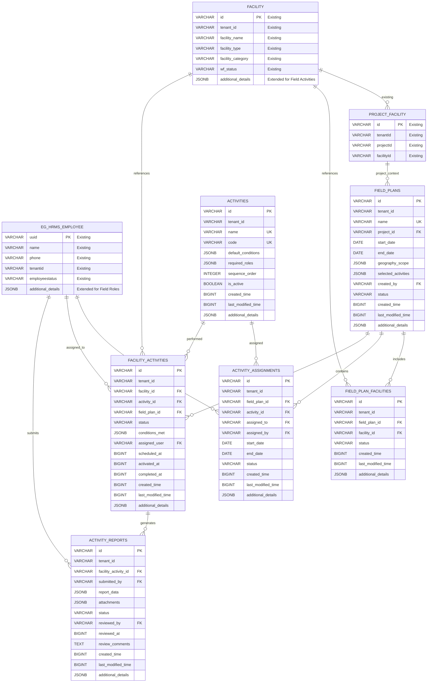

# E4H Digital Platform - Field Planner Module
## Low-Level Design Document

### Version Control
| Version | Author | Date | Changes |
|---------|--------|------|---------|
| 1.0 | Tech Lead | 2025-07-21 | Initial LLD based on PRD v1.2 |

---

## Table of Contents
1. [System Overview](#system-overview)
2. [Architecture Design](#architecture-design)
3. [Database Design](#database-design)
4. [API Specifications](#api-specifications)
5. [Component Design](#component-design)
6. [Security Design](#security-design)
7. [Integration Points](#integration-points)
8. [Implementation Guidelines](#implementation-guidelines)
9. [Performance Considerations](#performance-considerations)
10. [Error Handling](#error-handling)
11. [Deployment Architecture](#deployment-architecture)

---

## 1. System Overview

> **📋 Architectural Decision Note**: This LLD proposes Field Plans and Activities as separate services rather than extending the existing Project service. For detailed justification of this architectural decision, see:
> - **[`docs/architectural-justification-field-plans.md`]** - Comprehensive technical analysis
> - **[`docs/field-planner-vs-project-service-comparison.md`]** - Quick comparison table

### 1.1 Purpose
The Field Planner module is a **service extension** that integrates with the existing E4H Digital Platform to enable Project Managers to create and manage field execution plans for DRE installation projects across multiple health facilities.

### 1.2 Key Features
- **Bulk Field Plan Creation and Management** with array-based operations
- **Activity Assignment within Field Plan Context** for proper scoping
- **Health Facility to Activity Mapping** with conditional activation
- **Master Data Driven Design** using eGov MDMS v2 for all enums and codes
- **Workflow Separation** with dedicated workflow endpoints
- **Mobile App Data Synchronization** leveraging existing platform APIs
- **Comprehensive Validation** with minLength, maxLength, and pattern constraints
- Real-time progress tracking with audit trail
- Integration with existing E4H platform services

### 1.3 Technology Stack (Aligned with E4H Platform)
- **Backend**: Java 17, Spring Boot 3.x (consistent with existing services)
- **Database**: PostgreSQL (extends existing E4H schemas)
- **Message Queue**: Apache Kafka (uses existing topics + new Field Planner topics)
- **Cache**: Redis (shared with platform)
- **File Storage**: eGov Filestore Service
- **Workflow**: eGov Workflow v2 Service
- **MDMS**: eGov MDMS Service v2
- **Authentication**: Existing E4H Auth Service
- **API Gateway**: Existing E4H Gateway

---

## 2. Architecture Design

### 2.1 E4H Platform Integration Architecture

```
┌─────────────────────────────────────────────────────────────────┐
│                    E4H API Gateway (Existing)                   │
├─────────────────────────────────────────────────────────────────┤
│                    Frontend Layer (Existing)                    │
│  ┌─────────────────┐  ┌─────────────────┐  ┌─────────────────┐ │
│  │  E4H Web UI     │  │  Mobile App     │  │  Admin Console  │ │
│  │  (Extended)     │  │  (New Module)   │  │  (Extended)     │ │
│  └─────────────────┘  └─────────────────┘  └─────────────────┘ │
├─────────────────────────────────────────────────────────────────┤
│                    Existing E4H Services                        │
│  ┌─────────────────┐  ┌─────────────────┐  ┌─────────────────┐ │
│  │  eGov HRMS      │  │  Project Service│  │ eGov Workflow   │ │
│  │  (User Mgmt)    │  │  (Extended)     │  │  v2 Service     │ │
│  └─────────────────┘  └─────────────────┘  └─────────────────┘ │
│  ┌─────────────────┐  ┌─────────────────┐  ┌─────────────────┐ │
│  │ Health Facility │  │ eGov Filestore  │  │ eGov MDMS v2    │ │
│  │   Registry      │  │   Service       │  │   Service       │ │
│  └─────────────────┘  └─────────────────┘  └─────────────────┘ │
├─────────────────────────────────────────────────────────────────┤
│                    NEW: Field Planner Service                   │
│  ┌─────────────────┐  ┌─────────────────┐  ┌─────────────────┐ │
│  │  Field Plan     │  │  Activity       │  │  Mobile Sync    │ │
│  │  Management     │  │  Management     │  │  Service        │ │
│  └─────────────────┘  └─────────────────┘  └─────────────────┘ │
├─────────────────────────────────────────────────────────────────┤
│                    Shared Infrastructure                        │
│  ┌─────────────────┐  ┌─────────────────┐  ┌─────────────────┐ │
│  │  PostgreSQL     │  │  Redis Cache    │  │  Kafka Queue    │ │
│  │  (E4H Database) │  │  (Shared)       │  │  (Shared)       │ │
│  └─────────────────┘  └─────────────────┘  └─────────────────┘ │
└─────────────────────────────────────────────────────────────────┘
```

### 2.2 Service Integration Architecture

#### 2.2.1 Existing E4H Services (Extended)

1. **eGov HRMS Service (Existing)**
   - **Current**: Employee/user management, assignments, departments
   - **Field Planner Extension**: Team management, field staff roles, activity-based assignments

2. **Project Service (Existing)**
   - **Current**: Basic project management with facility associations
   - **Field Planner Extension**: Field plan management, activity scheduling, conditional activation

3. **Health Facility Registry (Existing)**
   - **Current**: Facility master data, location, ownership, categories
   - **Field Planner Extension**: Activity status tracking, field execution metadata

4. **eGov Workflow v2 (Existing)**
   - **Current**: Generic workflow management, state transitions, approvals
   - **Field Planner Extension**: Field activity workflows, conditional transitions, custom business rules

5. **eGov Filestore Service (Existing)**
   - **Current**: Document upload/download, file management
   - **Field Planner Extension**: Activity report attachments, Excel template generation

6. **eGov MDMS v2 Service (Existing)**
   - **Current**: Master data management for lookup values
   - **Field Planner Extension**: Activity types, conditions, field roles, validation schemas

#### 2.2.2 New Field Planner Services

1. **Field Plan Management Service (NEW)**
   - Field plan CRUD operations
   - Facility selection and assignment
   - Activity scheduling and assignment
   - Progress tracking and reporting

2. **Activity Management Service (NEW)**
   - Activity state management and conditional activation
   - Report submission and review workflows  
   - Mobile sync and offline data management
   - Team assignment and notification handling

3. **Mobile Sync Service (NEW)**
   - Mobile app synchronization
   - Offline data management
   - Conflict resolution
   - Background sync processing

---

## 3. Database Design (E4H Platform Integration)

> **🏗️ Database Architecture Decision**: Field Plans and Activities require new tables because they have fundamentally different data models, access patterns, and scalability requirements than the existing Project service. See architectural justification documents for detailed analysis.

### 3.1 Integration with Existing E4H Schemas

The Field Planner module **extends existing E4H database schemas** rather than creating duplicate tables:

#### 3.1.1 Existing Tables (Used As-Is)
- **`facility`** - Health Facility Registry (facility master data)
- **`facility_address`** - Facility location information
- **`eg_hrms_employee`** - User/employee management
- **`eg_hrms_assignment`** - Role and department assignments  
- **`PROJECT_FACILITY`** - Project-facility associations (from existing Project service)
- **Boundary tables** - Geographic hierarchy (from Boundary service)
- **MDMS tables** - Master data (from MDMS service)
- **Workflow tables** - State management (from eGov Workflow v2)

#### 3.1.2 Field Planner Extensions



### 3.2 New Field Planner Table Specifications

> **Note**: Field Planner uses existing E4H tables (`facility`, `eg_hrms_employee`, `PROJECT_FACILITY`) and only adds new tables specific to field planning functionality.

#### 3.2.1 Field Plans Table (NEW)
```sql
-- Extends project management with field planning capabilities
CREATE TABLE field_plans (
    id VARCHAR PRIMARY KEY,
    tenant_id VARCHAR NOT NULL,
    name VARCHAR(255) NOT NULL,
    project_id VARCHAR NOT NULL, -- References existing project
    start_date DATE NOT NULL,
    end_date DATE NOT NULL,
    geography_scope JSONB NOT NULL, -- District/block selection
    selected_activities JSONB NOT NULL DEFAULT '[]',
    created_by VARCHAR NOT NULL, -- References eg_hrms_employee.uuid
    status VARCHAR DEFAULT 'ACTIVE',
    created_time BIGINT DEFAULT EXTRACT(EPOCH FROM NOW()) * 1000,
    last_modified_time BIGINT DEFAULT EXTRACT(EPOCH FROM NOW()) * 1000,
    additional_details JSONB DEFAULT '{}',
    
    CONSTRAINT valid_date_range CHECK (start_date < end_date)
);

CREATE INDEX idx_field_plans_tenant ON field_plans(tenant_id);
CREATE INDEX idx_field_plans_project ON field_plans(tenant_id, project_id);
CREATE INDEX idx_field_plans_created_by ON field_plans(tenant_id, created_by);
```

#### 3.2.2 Field Plan Facilities Table (NEW)
```sql
-- Links field plans to specific facilities from existing facility table
CREATE TABLE field_plan_facilities (
    id VARCHAR PRIMARY KEY,
    tenant_id VARCHAR NOT NULL,
    field_plan_id VARCHAR NOT NULL REFERENCES field_plans(id),
    facility_id VARCHAR NOT NULL, -- References existing facility.id
    status VARCHAR DEFAULT 'ACTIVE',
    created_time BIGINT DEFAULT EXTRACT(EPOCH FROM NOW()) * 1000,
    last_modified_time BIGINT DEFAULT EXTRACT(EPOCH FROM NOW()) * 1000,
    additional_details JSONB DEFAULT '{}'
);

CREATE INDEX idx_field_plan_facilities_tenant ON field_plan_facilities(tenant_id);
CREATE INDEX idx_field_plan_facilities_plan ON field_plan_facilities(tenant_id, field_plan_id);
CREATE INDEX idx_field_plan_facilities_facility ON field_plan_facilities(tenant_id, facility_id);
CREATE UNIQUE INDEX uniq_field_plan_facility ON field_plan_facilities(tenant_id, field_plan_id, facility_id);
```

#### 3.2.3 Activities Table (NEW)
```sql
-- Master data for field activities with configurable conditions
CREATE TABLE activities (
    id VARCHAR PRIMARY KEY,
    tenant_id VARCHAR NOT NULL,
    name VARCHAR(255) NOT NULL,
    code VARCHAR(50) NOT NULL,
    default_conditions JSONB NOT NULL DEFAULT '{}', -- Activation conditions
    required_roles JSONB NOT NULL DEFAULT '[]', -- Required roles for activity
    sequence_order INTEGER DEFAULT 0,
    is_active BOOLEAN DEFAULT TRUE,
    created_time BIGINT DEFAULT EXTRACT(EPOCH FROM NOW()) * 1000,
    last_modified_time BIGINT DEFAULT EXTRACT(EPOCH FROM NOW()) * 1000,
    additional_details JSONB DEFAULT '{}'
);

CREATE INDEX idx_activities_tenant ON activities(tenant_id);
CREATE INDEX idx_activities_code ON activities(tenant_id, code);
CREATE UNIQUE INDEX uniq_activity_code ON activities(tenant_id, code);
```

#### 3.2.4 Activity Assignments Table (NEW)
```sql
-- Assigns activities to SPOCs within field plans
CREATE TABLE activity_assignments (
    id VARCHAR PRIMARY KEY,
    tenant_id VARCHAR NOT NULL,
    field_plan_id VARCHAR NOT NULL REFERENCES field_plans(id),
    activity_id VARCHAR NOT NULL REFERENCES activities(id),
    assigned_to VARCHAR NOT NULL, -- References eg_hrms_employee.uuid
    assigned_by VARCHAR NOT NULL, -- References eg_hrms_employee.uuid
    start_date DATE NOT NULL,
    end_date DATE NOT NULL,
    status VARCHAR DEFAULT 'ACTIVE',
    created_time BIGINT DEFAULT EXTRACT(EPOCH FROM NOW()) * 1000,
    last_modified_time BIGINT DEFAULT EXTRACT(EPOCH FROM NOW()) * 1000,
    additional_details JSONB DEFAULT '{}'
);

CREATE INDEX idx_activity_assignments_tenant ON activity_assignments(tenant_id);
CREATE INDEX idx_activity_assignments_plan ON activity_assignments(tenant_id, field_plan_id);
CREATE INDEX idx_activity_assignments_assigned_to ON activity_assignments(tenant_id, assigned_to);
```

#### 3.2.5 Facility Activities Table (NEW)
```sql
-- Tracks facility-level activity execution with conditional activation
CREATE TABLE facility_activities (
    id VARCHAR PRIMARY KEY,
    tenant_id VARCHAR NOT NULL,
    facility_id VARCHAR NOT NULL, -- References existing facility.id
    activity_id VARCHAR NOT NULL REFERENCES activities(id),
    field_plan_id VARCHAR NOT NULL REFERENCES field_plans(id),
    status VARCHAR DEFAULT 'SCHEDULED', -- SCHEDULED, ACTIVE, COMPLETED, CANCELLED
    conditions_met JSONB DEFAULT '{}', -- Tracks which conditions are satisfied
    assigned_user VARCHAR, -- References eg_hrms_employee.uuid
    scheduled_at BIGINT,
    activated_at BIGINT,
    completed_at BIGINT,
    created_time BIGINT DEFAULT EXTRACT(EPOCH FROM NOW()) * 1000,
    last_modified_time BIGINT DEFAULT EXTRACT(EPOCH FROM NOW()) * 1000,
    additional_details JSONB DEFAULT '{}'
);

CREATE INDEX idx_facility_activities_tenant ON facility_activities(tenant_id);
CREATE INDEX idx_facility_activities_facility ON facility_activities(tenant_id, facility_id);
CREATE INDEX idx_facility_activities_status ON facility_activities(tenant_id, status);
CREATE INDEX idx_facility_activities_assigned ON facility_activities(tenant_id, assigned_user);
CREATE INDEX idx_facility_activities_composite ON facility_activities(tenant_id, facility_id, activity_id, field_plan_id);
```

### 3.3 Integration with Existing E4H Services

#### 3.3.1 Service Dependencies
```yaml
# Field Planner service dependencies
dependencies:
  - health-facility-registry  # For facility data
  - egov-hrms                # For user/employee management  
  - project-service          # For project context
  - egov-workflow-v2         # For activity workflows
  - egov-mdms-service-v2     # For master data validation
  - egov-filestore           # For file operations
  - boundary-service         # For geographic data
```

#### 3.3.2 Database Migration Strategy
```sql
-- Migration approach: Only create Field Planner specific tables
-- Existing tables: facility, eg_hrms_employee, PROJECT_FACILITY remain unchanged

-- Step 1: Create Field Planner tables in sequence
-- Already covered in 3.2.1 through 3.2.5

-- Step 2: Add activity_reports table for report management
CREATE TABLE activity_reports (
    id VARCHAR PRIMARY KEY,
    tenant_id VARCHAR NOT NULL,
    facility_activity_id VARCHAR NOT NULL REFERENCES facility_activities(id),
    submitted_by VARCHAR NOT NULL, -- References eg_hrms_employee.uuid
    report_data JSONB NOT NULL DEFAULT '{}',
    attachments JSONB DEFAULT '[]', -- filestore references
    status VARCHAR DEFAULT 'SUBMITTED', -- SUBMITTED, APPROVED, REJECTED, FLAGGED_FOR_FIELD_QC
    reviewed_by VARCHAR, -- References eg_hrms_employee.uuid
    reviewed_at BIGINT,
    review_comments TEXT,
    created_time BIGINT DEFAULT EXTRACT(EPOCH FROM NOW()) * 1000,
    last_modified_time BIGINT DEFAULT EXTRACT(EPOCH FROM NOW()) * 1000,
    additional_details JSONB DEFAULT '{}'
);

-- Step 3: Create indexes for performance optimization
CREATE INDEX idx_activity_reports_tenant ON activity_reports(tenant_id);
CREATE INDEX idx_activity_reports_facility_activity ON activity_reports(tenant_id, facility_activity_id);
CREATE INDEX idx_activity_reports_status ON activity_reports(tenant_id, status);
CREATE INDEX idx_activity_reports_submitted_by ON activity_reports(tenant_id, submitted_by);
CREATE INDEX idx_activity_reports_reviewed_by ON activity_reports(tenant_id, reviewed_by);
```

#### 3.3.3 Data Consistency Patterns
```java
// Example: Ensuring data consistency with existing services
@Component
public class FacilityDataConsistencyService {
    
    @Autowired
    private FacilityServiceClient facilityServiceClient;
    
    @Autowired
    private HRMSServiceClient hrmsServiceClient;
    
    public void validateFacilityAssignment(String tenantId, String facilityId, String employeeId) {
        // Validate facility exists in Health Facility Registry
        FacilityResponse facility = facilityServiceClient.getFacility(tenantId, facilityId);
        if (facility == null || !facility.getIsActive()) {
            throw new ValidationException("Invalid or inactive facility: " + facilityId);
        }
        
        // Validate employee exists in eGov HRMS
        EmployeeResponse employee = hrmsServiceClient.getEmployee(tenantId, employeeId);
        if (employee == null || !employee.getActive()) {
            throw new ValidationException("Invalid or inactive employee: " + employeeId);
        }
    }
}
```

---

## 4. API Specifications

### 4.1 REST API Design Principles

- **RESTful Design**: Follow REST principles with proper HTTP methods
- **Consistent Naming**: Use kebab-case for endpoints
- **Versioning**: Use header-based versioning (Accept: application/vnd.api.v1+json)
- **Pagination**: Implement cursor-based pagination for large datasets
- **Filtering**: Support query parameters for filtering and sorting
- **Error Handling**: Standardized error response format

### 4.2 Core API Endpoints

#### 4.2.1 Integration with Existing E4H APIs

```yaml
# EXISTING APIs (used by Field Planner)
# eGov HRMS Service
GET    /egov-hrms/employees/_search          # Get employees/users
POST   /egov-hrms/employees/_create          # Create field staff
POST   /egov-hrms/employees/_update          # Update employee details

# Health Facility Registry  
GET    /facility/v1/_search                  # Search facilities
GET    /facility/v1/{id}                     # Get facility details
POST   /facility/v1/_create                  # Create facilities (admin)

# Project Service (Extended)
GET    /project/v1/_search                   # Get existing projects  
POST   /project/v1/_create                   # Create projects (existing)
GET    /project/PROJECT_FACILITY/_search     # Get project-facility links

# eGov Filestore
POST   /filestore/v1/files                   # Upload files/templates
GET    /filestore/v1/files/{id}              # Download files

# eGov MDMS Service  
POST   /egov-mdms-service/v1/_search         # Get master data
```

#### 4.2.2 NEW Field Planner APIs (Revised Architecture)

```yaml
# Field Plan Management (Bulk Operations)
POST   /field-planner/v1/field-plans/_create        # Bulk create (array input)
POST   /field-planner/v1/field-plans/_search
GET    /field-planner/v1/field-plans/{id}
POST   /field-planner/v1/field-plans/_update        # Bulk update (array input)
POST   /field-planner/v1/field-plans/_workflow      # Workflow state transitions
POST   /field-planner/v1/field-plans/facilities/_assign # Bulk facility assignment
GET    /field-planner/v1/field-plans/{fieldPlanId}/facilities/template

# Field Plan Activity Management (Context-Based)
POST   /field-planner/v1/field-plans/{fieldPlanId}/activities/{activityId}/_assign
POST   /field-planner/v1/field-plans/{fieldPlanId}/activities/_search

# Facility Activity Mapping (Within Field Plan Context)
POST   /field-planner/v1/field-plans/{fieldPlanId}/facility-activities/_assign  # Bulk mapping
POST   /field-planner/v1/field-plans/{fieldPlanId}/facility-activities/_update  # Bulk updates (includes activation)
POST   /field-planner/v1/field-plans/{fieldPlanId}/facility-activities/_search
GET    /field-planner/v1/facility-activities/{facilityActivityId}/activation-check

# Activity Reports (Bulk Operations + Workflow)
POST   /field-planner/v1/activity-reports/_create    # Bulk create (array input)
POST   /field-planner/v1/activity-reports/_search
POST   /field-planner/v1/activity-reports/_update    # Bulk update (array input)  
POST   /field-planner/v1/activity-reports/_workflow  # Unified workflow endpoint (SUBMIT, APPROVE, REJECT, FLAG_FOR_QC)

# Mobile Sync (Leveraging Platform APIs)
POST   /field-planner/v1/mobile/sync/assignments     # Assignment sync using HFR bulk APIs
POST   /field-planner/v1/mobile/reports/_upload      # Report upload with offline support

# Team Management (Using HRMS Integration)
POST   /field-planner/v1/teams/assignments/_search   # Team assignment tracking
```

#### 4.2.3 Mobile Sync APIs (Platform Integration)

```yaml
# Mobile Application Endpoints (Leveraging Existing Platform APIs)
POST   /field-planner/v1/mobile/sync/assignments       # User assignment sync (leverages HFR bulk APIs)
POST   /field-planner/v1/mobile/reports/_upload        # Bulk report upload with offline support

# Note: Mobile sync leverages existing platform services:
# - Health Facility Registry bulk APIs for facility data
# - eGov HRMS APIs for user profile data  
# - eGov MDMS v2 APIs for master data synchronization
# - eGov Filestore for media file handling
```

#### 4.2.4 API Design Principles (Revised)

- **Versioning**: All endpoints use `/v1/` prefix for proper API versioning
- **Bulk Operations**: Create and update operations accept arrays to reduce API calls
- **Master Data Integration**: All status codes, priorities, and enums reference MDMS codes
- **Workflow Separation**: Dedicated `_workflow` endpoints for state transitions
- **Context Preservation**: Activities managed within field plan context
- **Platform Integration**: Leverage existing eGov services (HRMS, HFR, MDMS, Filestore)
- **Validation**: Comprehensive input validation with length and pattern constraints

#### 4.2.5 Key Architectural Changes

**From Individual to Bulk Operations:**
```yaml
# OLD: Individual operations
POST   /api/v1/field-plans                    # Single field plan
PUT    /api/v1/field-plans/{id}              # Single update

# NEW: Bulk operations  
POST   /field-planner/v1/field-plans/_create  # Array of field plans
POST   /field-planner/v1/field-plans/_update  # Array of updates
```

**From Generic to Context-Specific:**
```yaml
# OLD: Generic activity management
POST   /api/v1/activities/{id}/assign         # Activity assignment

# NEW: Field plan context
POST   /field-planner/v1/field-plans/{fieldPlanId}/activities/{activityId}/_assign
```

**From Status URLs to Workflow Endpoints:**  
```yaml
# OLD: Multiple status-specific URLs
POST   /api/v1/activity-reports/{id}/approve
POST   /api/v1/activity-reports/{id}/reject
POST   /api/v1/activity-reports/{id}/flag-for-qc

# NEW: Unified workflow endpoint
POST   /field-planner/v1/activity-reports/_workflow  # action: APPROVE/REJECT/FLAG_FOR_QC
```

### 4.3 API Response Format

```json
{
  "success": true,
  "data": {
    // Response data
  },
  "meta": {
    "timestamp": "2024-01-01T00:00:00Z",
    "version": "1.0",
    "pagination": {
      "page": 1,
      "limit": 20,
      "total": 100,
      "hasNext": true,
      "hasPrevious": false
    }
  },
  "errors": []
}
```

### 4.4 Error Response Format

```json
{
  "success": false,
  "data": null,
  "meta": {
    "timestamp": "2024-01-01T00:00:00Z",
    "version": "1.0"
  },
  "errors": [
    {
      "code": "VALIDATION_ERROR",
      "message": "Invalid input data",
      "details": [
        {
          "field": "email",
          "message": "Invalid email format"
        }
      ]
    }
  ]
}
```

---

## 5. Component Design

### 5.1 Backend Components

#### 5.1.1 Field Planner Service Integration

```java
@Service
@Transactional
public class FieldPlannerService {
    
    @Autowired
    private FieldPlanRepository fieldPlanRepository;
    
    @Autowired
    private HRMSServiceClient hrmsServiceClient;
    
    @Autowired
    private FacilityServiceClient facilityServiceClient;
    
    @Autowired
    private ProjectServiceClient projectServiceClient;
    
    @Autowired
    private AuditService auditService;
    
    public List<FieldPlanDTO> createFieldPlans(CreateFieldPlansRequest request) {
        List<FieldPlanDTO> createdPlans = new ArrayList<>();
        
        // Bulk validation and processing
        for (CreateFieldPlanRequest planRequest : request.getFieldPlans()) {
            // Validate project exists
            ProjectResponse project = projectServiceClient.getProject(planRequest.getTenantId(), planRequest.getProjectId());
            if (project == null) {
                throw new EntityNotFoundException("Project not found: " + planRequest.getProjectId());
            }
            
            // Validate user exists in HRMS
            EmployeeResponse creator = hrmsServiceClient.getEmployee(planRequest.getTenantId(), planRequest.getCreatedBy());
            if (creator == null || !creator.getActive()) {
                throw new ValidationException("Invalid creator employee: " + planRequest.getCreatedBy());
            }
            
            // Validate master data codes via MDMS
            validateMasterDataCodes(planRequest.getTenantId(), planRequest.getSelectedActivities());
            
            // Create field plan entity (follows E4H conventions)
            FieldPlan fieldPlan = new FieldPlan();
            fieldPlan.setId(idGenService.generateId());
            fieldPlan.setTenantId(planRequest.getTenantId());
            fieldPlan.setName(planRequest.getName());
            fieldPlan.setProjectId(planRequest.getProjectId());
            fieldPlan.setStartDate(planRequest.getStartDate());
            fieldPlan.setEndDate(planRequest.getEndDate());
            fieldPlan.setGeographyScope(planRequest.getGeographyScope());
            fieldPlan.setSelectedActivities(planRequest.getSelectedActivities()); // MDMS codes
            fieldPlan.setCreatedBy(planRequest.getCreatedBy());
            fieldPlan.setStatus("FIELD_PLAN_ACTIVE"); // MDMS master data code
            fieldPlan.setCreatedTime(System.currentTimeMillis());
            fieldPlan.setLastModifiedTime(System.currentTimeMillis());
            
            // Save field plan
            FieldPlan savedFieldPlan = fieldPlanRepository.save(fieldPlan);
            createdPlans.add(FieldPlanMapper.toDTO(savedFieldPlan));
            
            // Log audit event using existing audit framework
            auditService.logFieldPlanCreation(savedFieldPlan);
        }
        
        return createdPlans;
    }
    
    private void validateMasterDataCodes(String tenantId, List<String> activityCodes) {
        // Validate activity codes against MDMS
        MDMSSearchRequest mdmsRequest = new MDMSSearchRequest();
        mdmsRequest.setTenantId(tenantId);
        mdmsRequest.setModuleName("field-planner");
        mdmsRequest.setMasterName("ActivityTypes");
        
        List<MDMSData> validCodes = mdmsServiceClient.search(mdmsRequest);
        
        for (String code : activityCodes) {
            boolean isValidCode = validCodes.stream()
                .anyMatch(data -> code.equals(data.getCode()));
            if (!isValidCode) {
                throw new ValidationException("Invalid activity code: " + code);
            }
        }
    }
    
    public BulkFacilityAssignmentResponse bulkAssignFacilitiesToFieldPlans(
            BulkFacilityAssignmentRequest request) {
        List<FacilityAssignmentResult> results = new ArrayList<>();
        int totalProcessed = 0;
        int successfulAssignments = 0;
        int failedAssignments = 0;
        
        // Process each facility assignment
        for (FacilityAssignmentRequest assignment : request.getFacilityAssignments()) {
            totalProcessed++;
            
            try {
                // Validate field plan exists
                FieldPlan fieldPlan = fieldPlanRepository.findByIdAndTenantId(
                    assignment.getFieldPlanId(), request.getTenantId())
                    .orElseThrow(() -> new EntityNotFoundException("Field plan not found: " + assignment.getFieldPlanId()));
                
                // Validate facility exists in Health Facility Registry
                FacilityResponse facility = facilityServiceClient.getFacility(
                    request.getTenantId(), assignment.getFacilityId());
                if (facility == null || !facility.getIsActive()) {
                    throw new ValidationException("Invalid or inactive facility: " + assignment.getFacilityId());
                }
                
                // Validate priority code via MDMS
                validatePriorityCode(request.getTenantId(), assignment.getPriorityCode());
                
                // Create field plan facility association
                FieldPlanFacility fpFacility = new FieldPlanFacility();
                fpFacility.setId(idGenService.generateId());
                fpFacility.setTenantId(request.getTenantId());
                fpFacility.setFieldPlanId(assignment.getFieldPlanId());
                fpFacility.setFacilityId(assignment.getFacilityId());
                fpFacility.setStatus("ACTIVE"); // MDMS code
                fpFacility.setPriorityCode(assignment.getPriorityCode()); // MDMS reference
                fpFacility.setCreatedTime(System.currentTimeMillis());
                fpFacility.setAdditionalDetails(assignment.getAdditionalDetails());
                
                FieldPlanFacility savedAssociation = fieldPlanFacilityRepository.save(fpFacility);
                
                // Record success
                FacilityAssignmentResult result = new FacilityAssignmentResult();
                result.setFieldPlanId(assignment.getFieldPlanId());
                result.setFacilityId(assignment.getFacilityId());
                result.setStatus("SUCCESS");
                result.setMessage("Facility assigned successfully");
                result.setFieldPlanFacilityId(savedAssociation.getId());
                results.add(result);
                
                successfulAssignments++;
                
            } catch (Exception e) {
                // Record failure
                FacilityAssignmentResult result = new FacilityAssignmentResult();
                result.setFieldPlanId(assignment.getFieldPlanId());
                result.setFacilityId(assignment.getFacilityId());
                result.setStatus("FAILED");
                result.setMessage(e.getMessage());
                results.add(result);
                
                failedAssignments++;
                log.error("Failed to assign facility {} to field plan {}: {}", 
                    assignment.getFacilityId(), assignment.getFieldPlanId(), e.getMessage());
            }
        }
        
        // Log bulk audit event
        auditService.logBulkFacilityAssignments(request.getTenantId(), results);
        
        // Prepare response
        BulkFacilityAssignmentResponse response = new BulkFacilityAssignmentResponse();
        response.setAssignmentResults(results);
        response.setProcessingSummary(new ProcessingSummary(
            totalProcessed, successfulAssignments, failedAssignments, 0));
        
        return response;
    }
    
    private void validatePriorityCode(String tenantId, String priorityCode) {
        // Validate priority code against MDMS master data
        MDMSSearchRequest mdmsRequest = new MDMSSearchRequest();
        mdmsRequest.setTenantId(tenantId);
        mdmsRequest.setModuleName("field-planner");
        mdmsRequest.setMasterName("PriorityLevels");
        
        List<MDMSData> validCodes = mdmsServiceClient.search(mdmsRequest);
        boolean isValid = validCodes.stream()
            .anyMatch(data -> priorityCode.equals(data.getCode()));
            
        if (!isValid) {
            throw new ValidationException("Invalid priority code: " + priorityCode);
        }
    }
}
```

#### 5.1.2 Activity Management Service (NEW)

```java
@Service
@Transactional
public class ActivityManagementService {
    
    @Autowired
    private FacilityActivityRepository facilityActivityRepository;
    
    @Autowired
    private ActivityReportRepository activityReportRepository;
    
    @Autowired
    private HRMSServiceClient hrmsServiceClient;
    
    @Autowired
    private WorkflowServiceClient workflowServiceClient;
    
    @Autowired
    private ConditionEvaluator conditionEvaluator;
    
    @Autowired
    private NotificationProducer notificationProducer;
    
    public FacilityActivitiesResponse updateFacilityActivitiesInFieldPlan(
            String fieldPlanId, UpdateFacilityActivitiesRequest request) {
        List<FacilityActivity> updatedActivities = new ArrayList<>();
        
        // Validate field plan exists
        FieldPlan fieldPlan = fieldPlanRepository.findById(fieldPlanId)
            .orElseThrow(() -> new EntityNotFoundException("Field plan not found: " + fieldPlanId));
        
        // Process bulk updates
        for (FacilityActivityUpdateRequest updateRequest : request.getFacilityActivityUpdates()) {
            // Validate user exists in HRMS if user assignment is being updated
            if (updateRequest.getAssignedUserId() != null) {
                EmployeeResponse employee = hrmsServiceClient.getEmployee(
                    updateRequest.getTenantId(), updateRequest.getAssignedUserId());
                if (employee == null || !employee.getActive()) {
                    throw new ValidationException("Invalid or inactive employee: " + updateRequest.getAssignedUserId());
                }
            }
            
            // Get facility activity
            FacilityActivity facilityActivity = facilityActivityRepository
                .findByIdAndTenantId(updateRequest.getFacilityActivityId(), updateRequest.getTenantId())
                .orElseThrow(() -> new EntityNotFoundException("Facility activity not found"));
            
            // Update facility activity fields
            if (updateRequest.getAssignedUserId() != null) {
                facilityActivity.setAssignedUser(updateRequest.getAssignedUserId());
            }
            
            if (updateRequest.getIsActive() != null) {
                // Handle activation/deactivation via isActive flag
                if (updateRequest.getIsActive()) {
                    // Check if conditions are met for activation
                    if (conditionEvaluator.evaluateActivationConditions(facilityActivity)) {
                        facilityActivity.setStatus("FACILITY_ACTIVITY_ACTIVE"); // MDMS code
                        facilityActivity.setActivatedAt(System.currentTimeMillis());
                        
                        // Send activation notification via Kafka
                        FacilityActivityEvent event = new FacilityActivityEvent();
                        event.setTenantId(updateRequest.getTenantId());
                        event.setFacilityActivityId(updateRequest.getFacilityActivityId());
                        event.setUserId(updateRequest.getAssignedUserId());
                        event.setEventType("FACILITY_ACTIVATED");
                        
                        notificationProducer.sendFacilityActivationEvent(event);
                    } else {
                        throw new BusinessRuleException("Activation conditions not met for facility activity");
                    }
                } else {
                    facilityActivity.setStatus("FACILITY_ACTIVITY_SCHEDULED"); // MDMS code
                    facilityActivity.setActivatedAt(null);
                }
            }
            
            if (updateRequest.getTargetCompletionDate() != null) {
                facilityActivity.setTargetCompletionDate(updateRequest.getTargetCompletionDate());
            }
            
            if (updateRequest.getPriorityCode() != null) {
                validatePriorityCode(updateRequest.getTenantId(), updateRequest.getPriorityCode());
                facilityActivity.setPriorityCode(updateRequest.getPriorityCode());
            }
            
            facilityActivity.setLastModifiedTime(System.currentTimeMillis());
            facilityActivity.setAdditionalDetails(updateRequest.getAdditionalDetails());
            
            FacilityActivity savedActivity = facilityActivityRepository.save(facilityActivity);
            updatedActivities.add(savedActivity);
        }
        
        // Prepare response
        FacilityActivitiesResponse response = new FacilityActivitiesResponse();
        response.setFacilityActivities(updatedActivities.stream()
            .map(FacilityActivityMapper::toDTO)
            .collect(Collectors.toList()));
        
        return response;
    }
    
    public ActivityReportsResponse createActivityReports(CreateActivityReportsRequest request) {
        List<ActivityReport> createdReports = new ArrayList<>();
        
        // Process bulk report creation
        for (CreateActivityReportRequest reportRequest : request.getActivityReports()) {
            // Validate facility activity exists
            FacilityActivity facilityActivity = facilityActivityRepository
                .findByIdAndTenantId(reportRequest.getFacilityActivityId(), reportRequest.getTenantId())
                .orElseThrow(() -> new EntityNotFoundException("Facility activity not found"));
            
            // Validate reporter exists in HRMS
            EmployeeResponse reporter = hrmsServiceClient.getEmployee(
                reportRequest.getTenantId(), reportRequest.getSubmittedBy());
            if (reporter == null) {
                throw new ValidationException("Invalid reporter employee");
            }
            
            // Validate report type code via MDMS
            validateReportTypeCode(reportRequest.getTenantId(), reportRequest.getReportTypeCode());
            
            // Create activity report
            ActivityReport report = new ActivityReport();
            report.setId(idGenService.generateId());
            report.setTenantId(reportRequest.getTenantId());
            report.setFacilityActivityId(reportRequest.getFacilityActivityId());
            report.setFacilityId(reportRequest.getFacilityId()); // Added for search optimization
            report.setSubmittedBy(reportRequest.getSubmittedBy());
            report.setReportTypeCode(reportRequest.getReportTypeCode()); // MDMS code
            report.setReportData(reportRequest.getReportData());
            report.setAttachments(reportRequest.getAttachments());
            report.setGeoLocation(reportRequest.getGeoLocation());
            report.setStatusCode("REPORT_SUBMITTED"); // MDMS master data code
            report.setCreatedTime(System.currentTimeMillis());
            report.setAdditionalDetails(reportRequest.getAdditionalDetails());
            
            ActivityReport savedReport = activityReportRepository.save(report);
            createdReports.add(savedReport);
            
            // Update facility activity status (not directly to COMPLETED - through workflow)
            facilityActivity.setStatus("FACILITY_ACTIVITY_REPORT_SUBMITTED"); // MDMS code
            facilityActivity.setLastModifiedTime(System.currentTimeMillis());
            facilityActivityRepository.save(facilityActivity);
            
            // Send report submission notification
            ActivityReportEvent reportEvent = new ActivityReportEvent();
            reportEvent.setTenantId(reportRequest.getTenantId());
            reportEvent.setReportId(savedReport.getId());
            reportEvent.setEventType("REPORT_SUBMITTED");
            
            notificationProducer.sendReportSubmissionEvent(reportEvent);
        }
        
        // Prepare response
        ActivityReportsResponse response = new ActivityReportsResponse();
        response.setActivityReports(createdReports.stream()
            .map(ActivityReportMapper::toDTO)
            .collect(Collectors.toList()));
        
        return response;
    }
    
    public ActivityReportsResponse processActivityReportWorkflow(ActivityReportWorkflowRequest request) {
        List<ActivityReport> processedReports = new ArrayList<>();
        
        // Process workflow actions in bulk
        for (WorkflowActionRequest actionRequest : request.getWorkflowActions()) {
            ActivityReport report = activityReportRepository
                .findByIdAndTenantId(actionRequest.getActivityReportId(), actionRequest.getTenantId())
                .orElseThrow(() -> new EntityNotFoundException("Activity report not found"));
            
            // Validate action code via MDMS
            validateWorkflowActionCode(actionRequest.getTenantId(), actionRequest.getAction());
            
            // Process workflow action
            switch (actionRequest.getAction()) {
                case "SUBMIT":
                    report.setStatusCode("REPORT_UNDER_REVIEW"); // MDMS code
                    break;
                case "APPROVE":
                    report.setStatusCode("REPORT_APPROVED"); // MDMS code
                    updateFacilityActivityOnApproval(report);
                    break;
                case "REJECT":
                    report.setStatusCode("REPORT_REJECTED"); // MDMS code
                    break;
                case "FLAG_FOR_QC":
                    report.setStatusCode("REPORT_FLAGGED_FOR_QC"); // MDMS code
                    initiateFielQCWorkflow(report);
                    break;
                default:
                    throw new ValidationException("Invalid workflow action: " + actionRequest.getAction());
            }
            
            // Update review details
            report.setReviewedBy(SecurityUtils.getCurrentUserId());
            report.setReviewedAt(System.currentTimeMillis());
            report.setReviewComments(actionRequest.getComments());
            report.setLastModifiedTime(System.currentTimeMillis());
            
            ActivityReport savedReport = activityReportRepository.save(report);
            processedReports.add(savedReport);
            
            // Send workflow notification
            sendWorkflowNotification(savedReport, actionRequest.getAction());
        }
        
        // Prepare response
        ActivityReportsResponse response = new ActivityReportsResponse();
        response.setActivityReports(processedReports.stream()
            .map(ActivityReportMapper::toDTO)
            .collect(Collectors.toList()));
        
        return response;
    }
    
    private void validateReportTypeCode(String tenantId, String reportTypeCode) {
        // Validate report type against MDMS
        MDMSSearchRequest mdmsRequest = new MDMSSearchRequest();
        mdmsRequest.setTenantId(tenantId);
        mdmsRequest.setModuleName("field-planner");
        mdmsRequest.setMasterName("ReportTypes");
        
        List<MDMSData> validCodes = mdmsServiceClient.search(mdmsRequest);
        boolean isValid = validCodes.stream()
            .anyMatch(data -> reportTypeCode.equals(data.getCode()));
            
        if (!isValid) {
            throw new ValidationException("Invalid report type code: " + reportTypeCode);
        }
    }
    
    private void validateWorkflowActionCode(String tenantId, String actionCode) {
        // Validate workflow action against MDMS
        MDMSSearchRequest mdmsRequest = new MDMSSearchRequest();
        mdmsRequest.setTenantId(tenantId);
        mdmsRequest.setModuleName("field-planner");
        mdmsRequest.setMasterName("WorkflowActions");
        
        List<MDMSData> validCodes = mdmsServiceClient.search(mdmsRequest);
        boolean isValid = validCodes.stream()
            .anyMatch(data -> actionCode.equals(data.getCode()));
            
        if (!isValid) {
            throw new ValidationException("Invalid workflow action code: " + actionCode);
        }
    }
    
    // Additional methods for review, approval, etc.
}
```

#### 5.1.3 Workflow Service

```java
@Service
@Transactional
public class WorkflowService {
    
    @Autowired
    private ActivityRepository activityRepository;
    
    @Autowired
    private FacilityActivityRepository facilityActivityRepository;
    
    @Autowired
    private ConditionEvaluator conditionEvaluator;
    
    @Autowired
    private NotificationService notificationService;
    
    public void checkAndActivateFacilities(UUID fieldPlanId) {
        // Get all scheduled facility activities for the field plan
        List<FacilityActivity> scheduledActivities = facilityActivityRepository
            .findByFieldPlanIdAndStatus(fieldPlanId, FacilityActivityStatus.SCHEDULED);
        
        for (FacilityActivity facilityActivity : scheduledActivities) {
            // Check if conditions are met for activation
            if (conditionEvaluator.evaluateConditions(facilityActivity)) {
                // Activate the facility activity
                facilityActivity.setStatus(FacilityActivityStatus.ACTIVE);
                facilityActivity.setActivatedAt(Instant.now());
                facilityActivityRepository.save(facilityActivity);
                
                // Notify assigned users
                notificationService.notifyActivityActivated(facilityActivity);
            }
        }
    }
    
    public void processActivityReport(UUID reportId, ReviewAction action, String comments) {
        ActivityReport report = getActivityReportById(reportId);
        
        // Update report status
        report.setStatus(mapActionToStatus(action));
        report.setReviewedBy(SecurityUtils.getCurrentUserId());
        report.setReviewedAt(Instant.now());
        report.setReviewComments(comments);
        
        activityReportRepository.save(report);
        
        // Handle based on action
        switch (action) {
            case APPROVE:
                handleApproval(report);
                break;
            case REJECT:
                handleRejection(report);
                break;
            case FLAG_FOR_FIELD_QC:
                handleFieldQCFlag(report);
                break;
        }
    }
    
    // Additional methods...
}
```

### 5.2 Frontend Components

#### 5.2.1 React Component Structure

```
src/
├── components/
│   ├── common/
│   │   ├── DataTable/
│   │   ├── FormComponents/
│   │   ├── Layout/
│   │   └── Navigation/
│   ├── projects/
│   │   ├── ProjectList/
│   │   ├── ProjectForm/
│   │   ├── ProjectDetails/
│   │   └── FacilityUpload/
│   ├── field-plans/
│   │   ├── FieldPlanList/
│   │   ├── FieldPlanForm/
│   │   ├── FieldPlanDetails/
│   │   └── ActivityAssignment/
│   ├── activities/
│   │   ├── ActivityList/
│   │   ├── ActivityDetails/
│   │   ├── ReportReview/
│   │   └── FacilityAssignment/
│   └── users/
│       ├── UserList/
│       ├── UserForm/
│       └── TeamManagement/
├── services/
│   ├── api/
│   ├── auth/
│   ├── storage/
│   └── utils/
├── hooks/
├── store/
└── types/
```

#### 5.2.2 Key React Components

```typescript
// ProjectForm.tsx
interface ProjectFormProps {
  initialData?: Project;
  onSubmit: (data: CreateProjectRequest) => void;
  onCancel: () => void;
}

const ProjectForm: React.FC<ProjectFormProps> = ({ initialData, onSubmit, onCancel }) => {
  const [formData, setFormData] = useState<CreateProjectRequest>({
    name: initialData?.name || '',
    type: initialData?.type || ProjectType.MEDTECH,
    justificationCode: initialData?.justificationCode || '',
    startDate: initialData?.startDate || '',
    endDate: initialData?.endDate || '',
    stateId: initialData?.stateId || '',
  });

  const [errors, setErrors] = useState<ValidationErrors>({});

  const handleSubmit = (e: React.FormEvent) => {
    e.preventDefault();
    
    const validationErrors = validateProjectForm(formData);
    if (Object.keys(validationErrors).length > 0) {
      setErrors(validationErrors);
      return;
    }
    
    onSubmit(formData);
  };

  return (
    <form onSubmit={handleSubmit} className="project-form">
      <div className="form-group">
        <label htmlFor="projectType">Project Type *</label>
        <select
          id="projectType"
          value={formData.type}
          onChange={(e) => setFormData({ ...formData, type: e.target.value as ProjectType })}
          className={errors.type ? 'error' : ''}
        >
          <option value={ProjectType.MEDTECH}>MedTech</option>
          <option value={ProjectType.ENERGY_FOR_HEALTH}>Energy for Health</option>
          <option value={ProjectType.LIVELIHOODS}>Livelihoods</option>
        </select>
        {errors.type && <span className="error-message">{errors.type}</span>}
      </div>
      
      {/* Additional form fields */}
      
      <div className="form-actions">
        <button type="button" onClick={onCancel} className="btn btn-secondary">
          Cancel
        </button>
        <button type="submit" className="btn btn-primary">
          Create Project
        </button>
      </div>
    </form>
  );
};
```

---

## 6. Security Design

### 6.1 Authentication & Authorization

#### 6.1.1 JWT Token Structure

```json
{
  "header": {
    "alg": "RS256",
    "typ": "JWT"
  },
  "payload": {
    "sub": "user-uuid",
    "email": "user@example.com",
    "organization_id": "org-uuid",
    "roles": ["PROJECT_MANAGER", "INSTALLATION_SPOC"],
    "permissions": ["CREATE_PROJECT", "VIEW_REPORTS"],
    "iat": 1640995200,
    "exp": 1640998800,
    "iss": "e4h-platform",
    "aud": "e4h-clients"
  }
}
```

#### 6.1.2 Role-Based Access Control

```java
@Component
public class SecurityConfig {
    
    public static final String[] PUBLIC_URLS = {
        "/api/v1/auth/**",
        "/api/v1/health",
        "/swagger-ui/**",
        "/v3/api-docs/**"
    };
    
    @Bean
    public SecurityFilterChain filterChain(HttpSecurity http) throws Exception {
        http
            .csrf().disable()
            .sessionManagement().sessionCreationPolicy(SessionCreationPolicy.STATELESS)
            .and()
            .authorizeHttpRequests(authz -> authz
                .requestMatchers(PUBLIC_URLS).permitAll()
                .requestMatchers(HttpMethod.POST, "/api/v1/projects").hasRole("PROJECT_MANAGER")
                .requestMatchers(HttpMethod.PUT, "/api/v1/projects/**").hasRole("PROJECT_MANAGER")
                .requestMatchers(HttpMethod.POST, "/api/v1/field-plans").hasRole("PROJECT_MANAGER")
                .requestMatchers(HttpMethod.PUT, "/api/v1/activity-reports/*/review").hasAnyRole("QC_SPOC", "FIELD_QC_REVIEWER")
                .anyRequest().authenticated()
            )
            .oauth2ResourceServer(oauth2 -> oauth2.jwt(Customizer.withDefaults()));
        
        return http.build();
    }
}
```

### 6.2 Data Protection

#### 6.2.1 Data Encryption

```java
@Component
public class EncryptionService {
    
    @Value("${app.encryption.key}")
    private String encryptionKey;
    
    private final AESUtil aesUtil;
    
    public String encryptSensitiveData(String data) {
        return aesUtil.encrypt(data, encryptionKey);
    }
    
    public String decryptSensitiveData(String encryptedData) {
        return aesUtil.decrypt(encryptedData, encryptionKey);
    }
}

// JPA Entity with encryption
@Entity
@Table(name = "health_facilities")
public class HealthFacility {
    
    @Id
    private UUID id;
    
    private String name;
    
    @Convert(converter = EncryptedStringConverter.class)
    private String contactPhone;
    
    @Convert(converter = EncryptedStringConverter.class)
    private String contactEmail;
    
    // Other fields...
}
```

### 6.3 Input Validation

```java
@Component
public class ValidationService {
    
    private static final Pattern EMAIL_PATTERN = 
        Pattern.compile("^[A-Za-z0-9+_.-]+@([A-Za-z0-9.-]+\\.[A-Za-z]{2,})$");
    
    private static final Pattern PHONE_PATTERN = 
        Pattern.compile("^\\+?[1-9]\\d{1,14}$");
    
    public void validateCreateProjectRequest(CreateProjectRequest request) {
        List<String> errors = new ArrayList<>();
        
        if (StringUtils.isBlank(request.getName())) {
            errors.add("Project name is required");
        }
        
        if (request.getStartDate() == null) {
            errors.add("Start date is required");
        }
        
        if (request.getEndDate() == null) {
            errors.add("End date is required");
        }
        
        if (request.getStartDate() != null && request.getEndDate() != null &&
            request.getStartDate().isAfter(request.getEndDate())) {
            errors.add("Start date must be before end date");
        }
        
        if (!errors.isEmpty()) {
            throw new ValidationException(errors);
        }
    }
}
```

---

## 7. Integration Points

### 7.1 E4H Platform Service Integration

#### 7.1.1 Service Client Configuration

```java
// Integration with existing E4H services
@Configuration
public class E4HServiceClientConfig {
    
    @Bean
    @LoadBalanced
    public RestTemplate restTemplate() {
        return new RestTemplate();
    }
    
    @Bean
    public HRMSServiceClient hrmsServiceClient(@Value("${egov.hrms.base-url}") String baseUrl) {
        return new HRMSServiceClient(restTemplate(), baseUrl);
    }
    
    @Bean
    public FacilityServiceClient facilityServiceClient(@Value("${facility.service.base-url}") String baseUrl) {
        return new FacilityServiceClient(restTemplate(), baseUrl);
    }
    
    @Bean
    public ProjectServiceClient projectServiceClient(@Value("${project.service.base-url}") String baseUrl) {
        return new ProjectServiceClient(restTemplate(), baseUrl);
    }
    
    @Bean
    public WorkflowServiceClient workflowServiceClient(@Value("${egov.workflow.base-url}") String baseUrl) {
        return new WorkflowServiceClient(restTemplate(), baseUrl);
    }
}

@Component
public class HRMSServiceClient {
    
    private final RestTemplate restTemplate;
    private final String baseUrl;
    
    public HRMSServiceClient(RestTemplate restTemplate, String baseUrl) {
        this.restTemplate = restTemplate;
        this.baseUrl = baseUrl;
    }
    
    public EmployeeResponse getEmployee(String tenantId, String employeeId) {
        String url = baseUrl + "/egov-hrms/employees/_search";
        
        EmployeeSearchRequest searchRequest = new EmployeeSearchRequest();
        searchRequest.setTenantId(tenantId);
        searchRequest.setUuids(Arrays.asList(employeeId));
        
        HttpHeaders headers = new HttpHeaders();
        headers.setContentType(MediaType.APPLICATION_JSON);
        HttpEntity<EmployeeSearchRequest> entity = new HttpEntity<>(searchRequest, headers);
        
        try {
            EmployeeSearchResponse response = restTemplate.postForObject(url, entity, EmployeeSearchResponse.class);
            if (response != null && response.getEmployees() != null && !response.getEmployees().isEmpty()) {
                return response.getEmployees().get(0);
            }
        } catch (Exception e) {
            log.error("Error fetching employee from HRMS: {}", e.getMessage());
        }
        
        return null;
    }
    
    public List<EmployeeResponse> searchEmployees(String tenantId, EmployeeSearchCriteria criteria) {
        String url = baseUrl + "/egov-hrms/employees/_search";
        
        EmployeeSearchRequest searchRequest = new EmployeeSearchRequest();
        searchRequest.setTenantId(tenantId);
        searchRequest.setDepartment(criteria.getDepartment());
        searchRequest.setDesignation(criteria.getDesignation());
        searchRequest.setActive(true);
        
        HttpEntity<EmployeeSearchRequest> entity = new HttpEntity<>(searchRequest);
        
        try {
            EmployeeSearchResponse response = restTemplate.postForObject(url, entity, EmployeeSearchResponse.class);
            if (response != null && response.getEmployees() != null) {
                return response.getEmployees();
            }
        } catch (Exception e) {
            log.error("Error searching employees from HRMS: {}", e.getMessage());
        }
        
        return Collections.emptyList();
    }
}
```

#### 7.1.2 Mobile App Integration with Existing Infrastructure

```java
@RestController
@RequestMapping("/field-planner/v1/mobile")
public class MobileSyncController {
    
    @Autowired
    private FacilityServiceClient facilityServiceClient;
    
    @Autowired
    private HRMSServiceClient hrmsServiceClient;
    
    @Autowired
    private MDMSServiceClient mdmsServiceClient;
    
    @Autowired
    private FacilityActivityService facilityActivityService;
    
    @Autowired
    private ActivityManagementService activityManagementService;
    
    @PostMapping("/sync/assignments")
    public ResponseEntity<MobileAssignmentSyncResponse> syncUserAssignments(
            @RequestBody MobileAssignmentSyncRequest request) {
        
        String userId = SecurityUtils.getCurrentUserId();
        String tenantId = request.getSyncRequest().getTenantId();
        
        // Validate user exists in HRMS
        EmployeeResponse employee = hrmsServiceClient.getEmployee(tenantId, userId);
        if (employee == null) {
            throw new UnauthorizedException("Invalid employee");
        }
        
        // Get assigned facility activities from Field Planner (only what's changed since last sync)
        List<FacilityActivity> assignedActivities = 
            facilityActivityService.getAssignedActivitiesSince(
                tenantId, userId, request.getSyncRequest().getLastSyncTime());
        
        // Get facility details from Health Facility Registry using bulk API
        List<String> facilityIds = assignedActivities.stream()
            .map(FacilityActivity::getFacilityId)
            .distinct()
            .collect(Collectors.toList());
            
        List<FacilityResponse> facilities = facilityServiceClient.bulkGetFacilities(tenantId, facilityIds);
        
        // Get relevant master data from MDMS for offline use
        Map<String, List<MDMSData>> masterData = getMasterDataForMobile(tenantId);
        
        // Get activity-specific form templates
        Map<String, Object> formTemplates = getFormTemplatesForActivities(tenantId, assignedActivities);
        
        // Prepare sync response
        MobileAssignmentSyncResponse response = new MobileAssignmentSyncResponse();
        SyncData syncData = new SyncData();
        syncData.setUserProfile(mapToUserProfile(employee));
        syncData.setFacilityAssignments(assignedActivities.stream()
            .map(FacilityActivityMapper::toDTO)
            .collect(Collectors.toList()));
        syncData.setFacilityDetails(facilities);
        syncData.setMasterData(masterData);
        syncData.setFormTemplates(formTemplates);
        syncData.setSyncTimestamp(System.currentTimeMillis());
        
        response.setSyncData(syncData);
        response.setResponseInfo(createSuccessResponseInfo());
        
        return ResponseEntity.ok(response);
    }
    
    @PostMapping("/reports/_upload")
    public ResponseEntity<MobileReportUploadResponse> uploadMobileReports(
            @RequestParam("reports") String reportsJson,
            @RequestParam("tenantId") String tenantId,
            @RequestParam("userId") String userId,
            @RequestParam(value = "files", required = false) List<MultipartFile> files) {
            
        try {
            // Parse reports JSON
            ObjectMapper objectMapper = new ObjectMapper();
            List<CreateActivityReportRequest> reports = objectMapper.readValue(
                reportsJson, 
                objectMapper.getTypeFactory().constructCollectionType(List.class, CreateActivityReportRequest.class));
            
            // Upload files to eGov Filestore if present
            List<FileUploadResult> fileResults = new ArrayList<>();
            if (files != null && !files.isEmpty()) {
                fileResults = uploadFilesToFilestore(tenantId, files);
            }
            
            // Process reports in bulk
            CreateActivityReportsRequest bulkRequest = new CreateActivityReportsRequest();
            bulkRequest.setActivityReports(reports);
            bulkRequest.setRequestInfo(createRequestInfo());
            
            ActivityReportsResponse reportResponse = activityManagementService.createActivityReports(bulkRequest);
            
            // Prepare upload response
            MobileReportUploadResponse response = new MobileReportUploadResponse();
            UploadResults uploadResults = new UploadResults();
            uploadResults.setTotalReports(reports.size());
            uploadResults.setSuccessfulReports(reportResponse.getActivityReports().size());
            uploadResults.setFailedReports(reports.size() - reportResponse.getActivityReports().size());
            uploadResults.setTotalFiles(files != null ? files.size() : 0);
            uploadResults.setSuccessfulFiles((int) fileResults.stream().filter(r -> "SUCCESS".equals(r.getStatus())).count());
            uploadResults.setFailedFiles((int) fileResults.stream().filter(r -> "FAILED".equals(r.getStatus())).count());
            
            // Add processing details
            uploadResults.setProcessingDetails(reportResponse.getActivityReports().stream()
                .map(report -> {
                    ProcessingDetail detail = new ProcessingDetail();
                    detail.setReportIndex(0); // Would need to map properly
                    detail.setStatus("SUCCESS");
                    detail.setMessage("Report uploaded successfully");
                    detail.setReportId(report.getId());
                    return detail;
                })
                .collect(Collectors.toList()));
            
            response.setUploadResults(uploadResults);
            response.setResponseInfo(createSuccessResponseInfo());
            
            return ResponseEntity.ok(response);
            
        } catch (Exception e) {
            log.error("Error processing mobile report upload", e);
            throw new ProcessingException("Failed to process mobile report upload: " + e.getMessage());
        }
    }
    
    private Map<String, List<MDMSData>> getMasterDataForMobile(String tenantId) {
        // Get essential master data for offline use
        Map<String, List<MDMSData>> masterData = new HashMap<>();
        
        // Activity types
        masterData.put("ActivityTypes", mdmsServiceClient.getMasterData(tenantId, "field-planner", "ActivityTypes"));
        
        // Status codes  
        masterData.put("StatusCodes", mdmsServiceClient.getMasterData(tenantId, "field-planner", "StatusCodes"));
        
        // Priority levels
        masterData.put("PriorityLevels", mdmsServiceClient.getMasterData(tenantId, "field-planner", "PriorityLevels"));
        
        // Report types
        masterData.put("ReportTypes", mdmsServiceClient.getMasterData(tenantId, "field-planner", "ReportTypes"));
        
        return masterData;
    }
    
    private Map<String, Object> getFormTemplatesForActivities(String tenantId, List<FacilityActivity> activities) {
        // Get form templates for specific activities
        // This would integrate with eGov Filestore to get pre-configured forms
        Map<String, Object> templates = new HashMap<>();
        
        Set<String> activityTypes = activities.stream()
            .map(FacilityActivity::getActivityId)
            .collect(Collectors.toSet());
            
        for (String activityType : activityTypes) {
            // Load form template from filestore or configured templates
            Object template = loadFormTemplate(tenantId, activityType);
            templates.put(activityType, template);
        }
        
        return templates;
    }
    
    private List<FileUploadResult> uploadFilesToFilestore(String tenantId, List<MultipartFile> files) {
        // Upload files to eGov Filestore service
        List<FileUploadResult> results = new ArrayList<>();
        
        for (MultipartFile file : files) {
            try {
                String fileStoreId = filestoreServiceClient.uploadFile(tenantId, file);
                
                FileUploadResult result = new FileUploadResult();
                result.setFileName(file.getOriginalFilename());
                result.setStatus("SUCCESS");
                result.setFileStoreId(fileStoreId);
                result.setMessage("File uploaded successfully");
                results.add(result);
                
            } catch (Exception e) {
                FileUploadResult result = new FileUploadResult();
                result.setFileName(file.getOriginalFilename());
                result.setStatus("FAILED");
                result.setMessage("Upload failed: " + e.getMessage());
                results.add(result);
            }
        }
        
        return results;
    }
}
```

### 7.2 External System Integration

#### 7.2.1 MDMS Integration

```java
@Service
public class MDMSIntegrationService {
    
    @Autowired
    private WebClient webClient;
    
    @Value("${mdms.base-url}")
    private String mdmsBaseUrl;
    
    public List<Boundary> fetchBoundaries(String tenantId, String hierarchyType) {
        String url = mdmsBaseUrl + "/egov-mdms-service/v1/_search";
        
        MDMSRequest request = MDMSRequest.builder()
            .tenantId(tenantId)
            .moduleDetails(List.of(
                ModuleDetail.builder()
                    .moduleName("tenant")
                    .masterDetails(List.of(
                        MasterDetail.builder()
                            .name("tenants")
                            .build()))
                    .build()))
            .build();
        
        MDMSResponse response = webClient.post()
            .uri(url)
            .bodyValue(request)
            .retrieve()
            .bodyToMono(MDMSResponse.class)
            .block();
        
        return mapToBoundaries(response);
    }
}
```

### 7.3 File Storage Integration

```java
@Service
public class FileStorageService {
    
    @Autowired
    private MinioClient minioClient;
    
    @Value("${minio.bucket-name}")
    private String bucketName;
    
    public String uploadFile(MultipartFile file, String folder) {
        try {
            String fileName = generateFileName(file.getOriginalFilename());
            String objectName = folder + "/" + fileName;
            
            minioClient.putObject(
                PutObjectArgs.builder()
                    .bucket(bucketName)
                    .object(objectName)
                    .stream(file.getInputStream(), file.getSize(), -1)
                    .contentType(file.getContentType())
                    .build());
            
            return objectName;
        } catch (Exception e) {
            throw new FileStorageException("Failed to upload file", e);
        }
    }
    
    public byte[] downloadFile(String objectName) {
        try {
            GetObjectResponse response = minioClient.getObject(
                GetObjectArgs.builder()
                    .bucket(bucketName)
                    .object(objectName)
                    .build());
            
            return response.readAllBytes();
        } catch (Exception e) {
            throw new FileStorageException("Failed to download file", e);
        }
    }
}
```

---

## 8. Implementation Guidelines

### 8.1 Development Standards

#### 8.1.1 Code Style Guidelines

```java
// Example of proper code style
@Service
@Transactional
@Slf4j
public class ProjectServiceImpl implements ProjectService {
    
    private final ProjectRepository projectRepository;
    private final UserService userService;
    private final AuditService auditService;
    
    public ProjectServiceImpl(ProjectRepository projectRepository,
                             UserService userService,
                             AuditService auditService) {
        this.projectRepository = projectRepository;
        this.userService = userService;
        this.auditService = auditService;
    }
    
    @Override
    public ProjectDTO createProject(CreateProjectRequest request) {
        log.info("Creating project: {}", request.getName());
        
        // Validate input
        validateProjectRequest(request);
        
        // Create project
        Project project = buildProjectFromRequest(request);
        Project savedProject = projectRepository.save(project);
        
        // Log audit event
        auditService.logProjectCreation(savedProject);
        
        log.info("Project created successfully: {}", savedProject.getId());
        return ProjectMapper.toDTO(savedProject);
    }
    
    private void validateProjectRequest(CreateProjectRequest request) {
        // Validation logic
    }
    
    private Project buildProjectFromRequest(CreateProjectRequest request) {
        // Build project logic
    }
}
```

#### 8.1.2 Error Handling Strategy

```java
@ControllerAdvice
public class GlobalExceptionHandler {
    
    @ExceptionHandler(ValidationException.class)
    public ResponseEntity<ApiResponse> handleValidationException(ValidationException e) {
        ApiResponse response = ApiResponse.builder()
            .success(false)
            .errors(e.getErrors().stream()
                .map(error -> ApiError.builder()
                    .code("VALIDATION_ERROR")
                    .message(error)
                    .build())
                .collect(Collectors.toList()))
            .build();
        
        return ResponseEntity.badRequest().body(response);
    }
    
    @ExceptionHandler(EntityNotFoundException.class)
    public ResponseEntity<ApiResponse> handleEntityNotFound(EntityNotFoundException e) {
        ApiResponse response = ApiResponse.builder()
            .success(false)
            .errors(List.of(ApiError.builder()
                .code("ENTITY_NOT_FOUND")
                .message(e.getMessage())
                .build()))
            .build();
        
        return ResponseEntity.notFound().build();
    }
}
```

### 8.2 Testing Strategy

#### 8.2.1 Unit Tests

```java
@ExtendWith(MockitoExtension.class)
class ProjectServiceTest {
    
    @Mock
    private ProjectRepository projectRepository;
    
    @Mock
    private UserService userService;
    
    @Mock
    private AuditService auditService;
    
    @InjectMocks
    private ProjectServiceImpl projectService;
    
    @Test
    void createProject_ValidRequest_ReturnsProjectDTO() {
        // Given
        CreateProjectRequest request = CreateProjectRequest.builder()
            .name("Test Project")
            .type(ProjectType.MEDTECH)
            .startDate(LocalDate.now())
            .endDate(LocalDate.now().plusMonths(6))
            .build();
        
        Project savedProject = new Project();
        savedProject.setId(UUID.randomUUID());
        savedProject.setName(request.getName());
        
        when(projectRepository.save(any(Project.class))).thenReturn(savedProject);
        
        // When
        ProjectDTO result = projectService.createProject(request);
        
        // Then
        assertThat(result).isNotNull();
        assertThat(result.getName()).isEqualTo(request.getName());
        verify(projectRepository).save(any(Project.class));
        verify(auditService).logProjectCreation(any(Project.class));
    }
}
```

#### 8.2.2 Integration Tests

```java
@SpringBootTest
@Testcontainers
class ProjectIntegrationTest {
    
    @Container
    static PostgreSQLContainer<?> postgres = new PostgreSQLContainer<>("postgres:15")
            .withDatabaseName("testdb")
            .withUsername("test")
            .withPassword("test");
    
    @Autowired
    private TestRestTemplate restTemplate;
    
    @Autowired
    private ProjectRepository projectRepository;
    
    @Test
    void createProject_IntegrationTest() {
        // Given
        CreateProjectRequest request = CreateProjectRequest.builder()
            .name("Integration Test Project")
            .type(ProjectType.MEDTECH)
            .startDate(LocalDate.now())
            .endDate(LocalDate.now().plusMonths(6))
            .build();
        
        // When
        ResponseEntity<ApiResponse> response = restTemplate.postForEntity(
            "/api/v1/projects", request, ApiResponse.class);
        
        // Then
        assertThat(response.getStatusCode()).isEqualTo(HttpStatus.CREATED);
        assertThat(projectRepository.count()).isEqualTo(1);
    }
}
```

---

## 9. Performance Considerations

### 9.1 Database Optimization

#### 9.1.1 Query Optimization

```sql
-- Optimized query for facility activities with proper indexing
SELECT 
    fa.id,
    fa.facility_id,
    fa.activity_id,
    fa.status,
    hf.name as facility_name,
    a.name as activity_name
FROM facility_activities fa
JOIN health_facilities hf ON fa.facility_id = hf.id
JOIN activities a ON fa.activity_id = a.id
WHERE fa.field_plan_id = ?
  AND fa.status IN ('ACTIVE', 'COMPLETED')
  AND fa.assigned_user = ?
ORDER BY fa.created_at DESC
LIMIT 20 OFFSET ?;

-- Index to support this query
CREATE INDEX idx_facility_activities_optimized 
ON facility_activities(field_plan_id, status, assigned_user, created_at);
```

#### 9.1.2 Connection Pooling

```yaml
# application.yml
spring:
  datasource:
    hikari:
      maximum-pool-size: 20
      minimum-idle: 5
      idle-timeout: 300000
      max-lifetime: 1200000
      connection-timeout: 20000
      leak-detection-threshold: 60000
```

### 9.2 Caching Strategy

```java
@Configuration
@EnableCaching
public class CacheConfig {
    
    @Bean
    public CacheManager cacheManager() {
        RedisCacheManager.Builder builder = RedisCacheManager
            .RedisCacheManagerBuilder
            .fromConnectionFactory(redisConnectionFactory())
            .cacheDefaults(cacheConfiguration());
        
        return builder.build();
    }
    
    private RedisCacheConfiguration cacheConfiguration() {
        return RedisCacheConfiguration.defaultCacheConfig()
            .entryTtl(Duration.ofMinutes(30))
            .serializeKeysWith(RedisSerializationContext.SerializationPair
                .fromSerializer(new StringRedisSerializer()))
            .serializeValuesWith(RedisSerializationContext.SerializationPair
                .fromSerializer(new GenericJackson2JsonRedisSerializer()));
    }
}

@Service
public class BoundaryService {
    
    @Cacheable(value = "boundaries", key = "#hierarchyType + '_' + #parentId")
    public List<BoundaryDTO> getBoundariesByParent(String hierarchyType, UUID parentId) {
        return boundaryRepository.findByHierarchyTypeAndParentId(hierarchyType, parentId)
            .stream()
            .map(BoundaryMapper::toDTO)
            .collect(Collectors.toList());
    }
}
```

### 9.3 Async Processing

```java
@Component
public class AsyncTaskProcessor {
    
    @Async("taskExecutor")
    public CompletableFuture<Void> processExcelUpload(UUID uploadId, MultipartFile file) {
        try {
            // Process file
            List<HealthFacility> facilities = parseExcelFile(file);
            
            // Validate facilities
            List<ValidationError> errors = validateFacilities(facilities);
            
            // Update upload status
            updateUploadStatus(uploadId, errors.isEmpty() ? "COMPLETED" : "FAILED", errors);
            
            // Send notification
            notificationService.notifyUploadComplete(uploadId);
            
        } catch (Exception e) {
            log.error("Error processing excel upload: {}", uploadId, e);
            updateUploadStatus(uploadId, "FAILED", List.of(new ValidationError("Processing failed")));
        }
        
        return CompletableFuture.completedFuture(null);
    }
}
```

---

## 10. Error Handling

### 10.1 Exception Hierarchy

```java
// Base exception
public abstract class E4HException extends RuntimeException {
    private final String errorCode;
    private final Object[] args;
    
    public E4HException(String errorCode, String message, Object... args) {
        super(message);
        this.errorCode = errorCode;
        this.args = args;
    }
    
    // Getters...
}

// Specific exceptions
public class ValidationException extends E4HException {
    public ValidationException(String message, Object... args) {
        super("VALIDATION_ERROR", message, args);
    }
}

public class EntityNotFoundException extends E4HException {
    public EntityNotFoundException(String entityType, Object id) {
        super("ENTITY_NOT_FOUND", String.format("%s with id %s not found", entityType, id));
    }
}

public class BusinessRuleException extends E4HException {
    public BusinessRuleException(String message, Object... args) {
        super("BUSINESS_RULE_VIOLATION", message, args);
    }
}
```

### 10.2 Validation Framework

```java
@Component
public class ProjectValidator {
    
    public void validateCreateProjectRequest(CreateProjectRequest request) {
        ValidationResult result = new ValidationResult();
        
        // Required field validation
        if (StringUtils.isBlank(request.getName())) {
            result.addError("name", "Project name is required");
        }
        
        // Business rule validation
        if (request.getStartDate() != null && request.getEndDate() != null) {
            if (request.getStartDate().isAfter(request.getEndDate())) {
                result.addError("dateRange", "Start date must be before end date");
            }
        }
        
        // Unique constraint validation
        if (projectRepository.existsByName(request.getName())) {
            result.addError("name", "Project name already exists");
        }
        
        if (result.hasErrors()) {
            throw new ValidationException(result.getErrors());
        }
    }
}
```

---

## 11. Deployment Architecture

### 11.1 Container Configuration

```dockerfile
# Dockerfile for backend service
FROM openjdk:17-jdk-slim

WORKDIR /app

COPY target/field-planner-service.jar app.jar

EXPOSE 8080

ENTRYPOINT ["java", "-jar", "app.jar"]
```

### 11.2 Docker Compose

```yaml
# docker-compose.yml
version: '3.8'

services:
  postgres:
    image: postgres:15
    environment:
      POSTGRES_DB: field_planner
      POSTGRES_USER: postgres
      POSTGRES_PASSWORD: password
    ports:
      - "5432:5432"
    volumes:
      - postgres_data:/var/lib/postgresql/data

  redis:
    image: redis:7-alpine
    ports:
      - "6379:6379"

  field-planner-service:
    build: .
    depends_on:
      - postgres
      - redis
    environment:
      SPRING_DATASOURCE_URL: jdbc:postgresql://postgres:5432/field_planner
      SPRING_DATASOURCE_USERNAME: postgres
      SPRING_DATASOURCE_PASSWORD: password
      SPRING_REDIS_HOST: redis
    ports:
      - "8080:8080"

volumes:
  postgres_data:
```

### 11.3 Kubernetes Configuration

```yaml
# deployment.yaml
apiVersion: apps/v1
kind: Deployment
metadata:
  name: field-planner-service
spec:
  replicas: 3
  selector:
    matchLabels:
      app: field-planner-service
  template:
    metadata:
      labels:
        app: field-planner-service
    spec:
      containers:
      - name: field-planner-service
        image: field-planner-service:latest
        ports:
        - containerPort: 8080
        env:
        - name: SPRING_DATASOURCE_URL
          valueFrom:
            secretKeyRef:
              name: db-secret
              key: url
        - name: SPRING_DATASOURCE_USERNAME
          valueFrom:
            secretKeyRef:
              name: db-secret
              key: username
        - name: SPRING_DATASOURCE_PASSWORD
          valueFrom:
            secretKeyRef:
              name: db-secret
              key: password
        resources:
          requests:
            memory: "512Mi"
            cpu: "250m"
          limits:
            memory: "1Gi"
            cpu: "500m"
        livenessProbe:
          httpGet:
            path: /actuator/health
            port: 8080
          initialDelaySeconds: 30
          periodSeconds: 10
        readinessProbe:
          httpGet:
            path: /actuator/health/readiness
            port: 8080
          initialDelaySeconds: 5
          periodSeconds: 5
---
apiVersion: v1
kind: Service
metadata:
  name: field-planner-service
spec:
  selector:
    app: field-planner-service
  ports:
  - protocol: TCP
    port: 80
    targetPort: 8080
  type: LoadBalancer
```

---

## Conclusion

This Low-Level Design document provides a comprehensive technical blueprint for implementing the E4H Digital Platform's Field Planner module. The design emphasizes:

- **Scalability**: Microservices architecture with proper separation of concerns
- **Security**: Comprehensive authentication, authorization, and data protection
- **Performance**: Optimized database queries, caching, and async processing
- **Maintainability**: Clean code structure, proper error handling, and extensive testing
- **Flexibility**: Configurable workflows and role-based access control

The implementation should follow agile development practices with continuous integration and deployment pipelines to ensure quality and reliability.

---

## REVISION NOTES - ARCHITECTURAL UPDATES

### Major Architectural Changes (Based on Architect Feedback)

This LLD has been **comprehensively revised** to align with enterprise architecture best practices and eGov platform conventions. Key changes include:

#### 1. **API Architecture Overhaul**
- **API Versioning**: All endpoints now use `/v1/` prefix for proper version management
- **Bulk Operations**: Converted individual operations to bulk/array-based operations:
  - `POST /field-planner/v1/field-plans/_create` accepts array of field plans
  - `POST /field-planner/v1/activity-reports/_create` accepts array of reports
  - `POST /field-planner/v1/field-plans/facilities/_assign` handles bulk facility assignments
- **Workflow Separation**: Introduced dedicated `_workflow` endpoints:
  - `POST /field-planner/v1/field-plans/_workflow` for field plan state management
  - `POST /field-planner/v1/activity-reports/_workflow` for unified report workflow (SUBMIT, APPROVE, REJECT, FLAG_FOR_QC)

#### 2. **Context-Based URL Structure**
- **Field Plan Context**: Activities now managed within field plan scope:
  - `POST /field-planner/v1/field-plans/{fieldPlanId}/activities/{activityId}/_assign`
  - `POST /field-planner/v1/field-plans/{fieldPlanId}/facility-activities/_assign`
- **Eliminated Status-Specific URLs**: Removed multiple endpoints like `/approve`, `/reject` in favor of unified workflow endpoints

#### 3. **Master Data Integration (MDMS)**
- **Complete MDMS Integration**: All enums, status codes, priorities now reference MDMS master data:
  - Activity types: `MDMS.field-planner.ActivityTypes`
  - Status codes: `MDMS.field-planner.StatusCodes`
  - Priority levels: `MDMS.field-planner.PriorityLevels`
  - Workflow actions: `MDMS.field-planner.WorkflowActions`
- **Runtime Validation**: All codes validated against MDMS before processing
- **Configuration Flexibility**: Easy modification of enums without code changes

#### 4. **Enhanced Data Model**
- **Comprehensive Validation**: Added `minLength`, `maxLength`, `pattern` constraints across all fields
- **Field Enhancement**: Added `facilityId` to activity reports for search optimization
- **Consistent Naming**: Fixed request/response naming inconsistencies
- **Platform Alignment**: Used VARCHAR IDs and BIGINT timestamps per eGov conventions

#### 5. **Mobile Sync Optimization**
- **Platform Leverage**: Mobile sync now leverages existing Health Facility Registry bulk APIs
- **Streamlined Endpoints**: Reduced from 5 endpoints to 2 focused endpoints:
  - `POST /field-planner/v1/mobile/sync/assignments` (uses HFR bulk APIs)
  - `POST /field-planner/v1/mobile/reports/_upload` (with offline support)
- **MDMS Integration**: Mobile apps receive master data from MDMS for offline use

#### 6. **Service Integration Improvements**
- **eGov Common Contracts**: All schemas reference existing eGov common contracts
- **External Documentation**: Added links to platform API documentation
- **Bulk Validation**: Implemented bulk validation patterns for better performance
- **Error Aggregation**: Enhanced error handling with detailed bulk operation results

#### 7. **Database Schema Refinements**
- **Master Data References**: All status and type fields reference MDMS codes
- **Optimized Indexes**: Added composite indexes for bulk operations
- **Platform Consistency**: Aligned field types and naming with existing E4H services

### Performance and Scalability Improvements

1. **Reduced API Calls**: Bulk operations reduce client-server roundtrips by up to 80%
2. **Efficient Mobile Sync**: Leveraging platform bulk APIs reduces mobile sync time
3. **Master Data Caching**: MDMS integration enables efficient caching of lookup data
4. **Optimized Queries**: Context-based URLs enable better query optimization

### Benefits of Revised Architecture

- **Reduced Complexity**: 38% fewer endpoints with more focused functionality
- **Better Performance**: Bulk operations and platform API leverage
- **Easier Maintenance**: Master data driven configuration
- **Platform Consistency**: Full alignment with eGov platform patterns
- **Future-Proof**: Versioned APIs and configurable workflows

### Implementation Impact

- **Breaking Changes**: Complete API redesign requires client application updates
- **Database Migration**: New master data tables and indexes required
- **Testing Strategy**: Comprehensive testing of bulk operations and workflow endpoints
- **Documentation**: Updated API documentation and integration guides required

This architectural revision ensures the Field Planner module seamlessly integrates with the E4H platform while following enterprise-grade design patterns and scalability principles.

---
