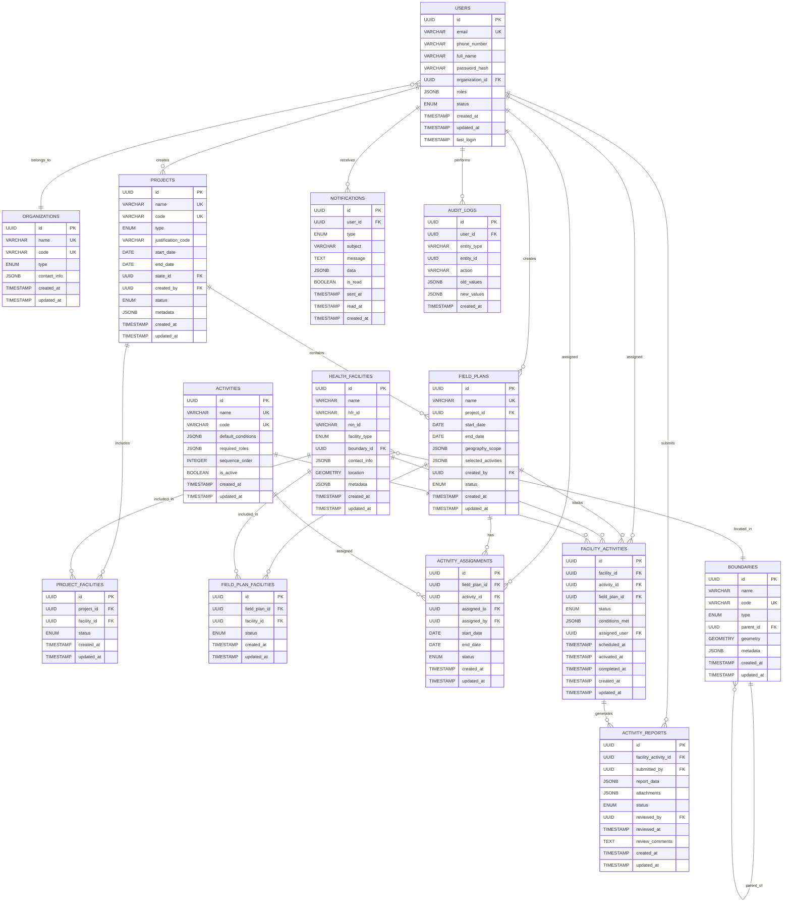

# E4H Digital Platform - Field Planner Module
## Low-Level Design Document

### Version Control
| Version | Author | Date | Changes |
|---------|--------|------|---------|
| 1.0 | Tech Lead | 2024-01-XX | Initial LLD based on PRD v1.2 |

---

## Table of Contents
1. [System Overview](#system-overview)
2. [Architecture Design](#architecture-design)
3. [Database Design](#database-design)
4. [API Specifications](#api-specifications)
5. [Component Design](#component-design)
6. [Security Design](#security-design)
7. [Integration Points](#integration-points)
8. [Implementation Guidelines](#implementation-guidelines)
9. [Performance Considerations](#performance-considerations)
10. [Error Handling](#error-handling)
11. [Deployment Architecture](#deployment-architecture)

---

## 1. System Overview

### 1.1 Purpose
The Field Planner module enables Project Managers to create and manage field execution plans for DRE installation projects across multiple health facilities, with role-based access control and workflow management.

### 1.2 Key Features
- Multi-tenant project and field plan management
- Role-based access control (RBAC)
- Workflow-driven activity execution
- Conditional health facility activation
- Real-time progress tracking
- Mobile app integration
- Notification system
- Audit trail

### 1.3 Technology Stack
- **Backend**: Java 17, Spring Boot 3.x, Spring Security, Spring Data JPA
- **Database**: PostgreSQL 15+
- **Message Queue**: Apache Kafka
- **Cache**: Redis
- **Search**: Elasticsearch
- **File Storage**: MinIO/S3
- **API Gateway**: Spring Cloud Gateway
- **Documentation**: OpenAPI 3.0

---

## 2. Architecture Design

### 2.1 High-Level Architecture

```
┌─────────────────────────────────────────────────────────────────┐
│                        API Gateway                              │
├─────────────────────────────────────────────────────────────────┤
│  Load Balancer (NGINX/HAProxy)                                 │
├─────────────────────────────────────────────────────────────────┤
│                    Frontend Layer                               │
│  ┌─────────────────┐  ┌─────────────────┐  ┌─────────────────┐ │
│  │  Web App        │  │  Mobile App     │  │  Admin Console  │ │
│  │  (React/Vue)    │  │  (React Native) │  │  (React)        │ │
│  └─────────────────┘  └─────────────────┘  └─────────────────┘ │
├─────────────────────────────────────────────────────────────────┤
│                    Microservices Layer                          │
│  ┌─────────────────┐  ┌─────────────────┐  ┌─────────────────┐ │
│  │  User Service   │  │  Project Service│  │  Workflow Svc   │ │
│  └─────────────────┘  └─────────────────┘  └─────────────────┘ │
│  ┌─────────────────┐  ┌─────────────────┐  ┌─────────────────┐ │
│  │  Notification   │  │  File Service   │  │  Audit Service  │ │
│  │  Service        │  │                 │  │                 │ │
│  └─────────────────┘  └─────────────────┘  └─────────────────┘ │
├─────────────────────────────────────────────────────────────────┤
│                    Infrastructure Layer                         │
│  ┌─────────────────┐  ┌─────────────────┐  ┌─────────────────┐ │
│  │  PostgreSQL     │  │  Redis Cache    │  │  Kafka Queue    │ │
│  └─────────────────┘  └─────────────────┘  └─────────────────┘ │
│  ┌─────────────────┐  ┌─────────────────┐                      │
│  │  Elasticsearch  │  │  MinIO/S3       │                      │
│  └─────────────────┘  └─────────────────┘                      │
└─────────────────────────────────────────────────────────────────┘
```

### 2.2 Microservices Architecture

#### 2.2.1 Core Services

1. **User Management Service**
   - User authentication and authorization
   - Role and permission management
   - Organization management
   - Team management

2. **Project Management Service**
   - Project CRUD operations
   - Field plan management
   - Health facility management
   - Activity management

3. **Workflow Service**
   - Activity state management
   - Conditional activation logic
   - Approval workflows
   - Status transitions

4. **Notification Service**
   - Email notifications
   - In-app notifications
   - SMS notifications (future)
   - Push notifications

5. **File Management Service**
   - File upload/download
   - Template management
   - Document storage
   - Image processing

6. **Audit Service**
   - Activity logging
   - Change tracking
   - Compliance reporting
   - Data retention

---

## 3. Database Design

### 3.1 Entity Relationship Diagram



### 3.2 Key Tables Specifications

#### 3.2.1 Users Table
```sql
CREATE TABLE users (
    id UUID PRIMARY KEY DEFAULT gen_random_uuid(),
    email VARCHAR(255) UNIQUE NOT NULL,
    phone_number VARCHAR(20),
    full_name VARCHAR(255) NOT NULL,
    password_hash VARCHAR(255),
    organization_id UUID REFERENCES organizations(id),
    roles JSONB NOT NULL DEFAULT '[]',
    status user_status DEFAULT 'PENDING_VERIFICATION',
    created_at TIMESTAMP DEFAULT CURRENT_TIMESTAMP,
    updated_at TIMESTAMP DEFAULT CURRENT_TIMESTAMP,
    last_login TIMESTAMP,
    
    CONSTRAINT valid_email CHECK (email ~* '^[A-Za-z0-9._%+-]+@[A-Za-z0-9.-]+\.[A-Za-z]{2,}$'),
    CONSTRAINT valid_phone CHECK (phone_number ~ '^\+?[1-9]\d{1,14}$')
);

CREATE TYPE user_status AS ENUM (
    'PENDING_VERIFICATION',
    'ACTIVE',
    'INACTIVE',
    'ARCHIVED'
);
```

#### 3.2.2 Projects Table
```sql
CREATE TABLE projects (
    id UUID PRIMARY KEY DEFAULT gen_random_uuid(),
    name VARCHAR(255) UNIQUE NOT NULL,
    code VARCHAR(50) UNIQUE NOT NULL,
    type project_type NOT NULL,
    justification_code VARCHAR(255),
    start_date DATE NOT NULL,
    end_date DATE NOT NULL,
    state_id UUID REFERENCES boundaries(id),
    created_by UUID REFERENCES users(id),
    status project_status DEFAULT 'ACTIVE',
    metadata JSONB DEFAULT '{}',
    created_at TIMESTAMP DEFAULT CURRENT_TIMESTAMP,
    updated_at TIMESTAMP DEFAULT CURRENT_TIMESTAMP,
    
    CONSTRAINT valid_date_range CHECK (start_date < end_date)
);

CREATE TYPE project_type AS ENUM (
    'MEDTECH',
    'ENERGY_FOR_HEALTH',
    'LIVELIHOODS'
);

CREATE TYPE project_status AS ENUM (
    'ACTIVE',
    'COMPLETED',
    'CANCELLED',
    'ON_HOLD'
);
```

#### 3.2.3 Field Plans Table
```sql
CREATE TABLE field_plans (
    id UUID PRIMARY KEY DEFAULT gen_random_uuid(),
    name VARCHAR(255) UNIQUE NOT NULL,
    project_id UUID REFERENCES projects(id) ON DELETE CASCADE,
    start_date DATE NOT NULL,
    end_date DATE NOT NULL,
    geography_scope JSONB NOT NULL,
    selected_activities JSONB NOT NULL DEFAULT '[]',
    created_by UUID REFERENCES users(id),
    status field_plan_status DEFAULT 'ACTIVE',
    created_at TIMESTAMP DEFAULT CURRENT_TIMESTAMP,
    updated_at TIMESTAMP DEFAULT CURRENT_TIMESTAMP,
    
    CONSTRAINT valid_date_range CHECK (start_date < end_date)
);

CREATE TYPE field_plan_status AS ENUM (
    'ACTIVE',
    'COMPLETED',
    'CANCELLED'
);
```

#### 3.2.4 Health Facilities Table
```sql
CREATE TABLE health_facilities (
    id UUID PRIMARY KEY DEFAULT gen_random_uuid(),
    name VARCHAR(255) NOT NULL,
    hfr_id VARCHAR(100),
    nin_id VARCHAR(100),
    facility_type facility_type NOT NULL,
    boundary_id UUID REFERENCES boundaries(id),
    contact_info JSONB NOT NULL DEFAULT '{}',
    location GEOMETRY(POINT, 4326),
    metadata JSONB DEFAULT '{}',
    created_at TIMESTAMP DEFAULT CURRENT_TIMESTAMP,
    updated_at TIMESTAMP DEFAULT CURRENT_TIMESTAMP,
    
    CONSTRAINT at_least_one_id CHECK (hfr_id IS NOT NULL OR nin_id IS NOT NULL)
);

CREATE TYPE facility_type AS ENUM (
    'SC',
    'PHC',
    'CHC',
    'HWC',
    'DISTRICT_HOSPITAL',
    'MEDICAL_COLLEGE'
);
```

### 3.3 Indexes and Performance Optimization

```sql
-- Performance indexes
CREATE INDEX idx_users_email ON users(email);
CREATE INDEX idx_users_organization ON users(organization_id);
CREATE INDEX idx_projects_created_by ON projects(created_by);
CREATE INDEX idx_projects_state ON projects(state_id);
CREATE INDEX idx_field_plans_project ON field_plans(project_id);
CREATE INDEX idx_health_facilities_boundary ON health_facilities(boundary_id);
CREATE INDEX idx_facility_activities_status ON facility_activities(status);
CREATE INDEX idx_activity_reports_status ON activity_reports(status);
CREATE INDEX idx_notifications_user_unread ON notifications(user_id, is_read);
CREATE INDEX idx_audit_logs_entity ON audit_logs(entity_type, entity_id);

-- Spatial index for location queries
CREATE INDEX idx_health_facilities_location ON health_facilities USING GIST(location);

-- Composite indexes for common queries
CREATE INDEX idx_facility_activities_composite ON facility_activities(facility_id, activity_id, field_plan_id);
CREATE INDEX idx_activity_assignments_composite ON activity_assignments(field_plan_id, activity_id, assigned_to);
```

---

## 4. API Specifications

### 4.1 REST API Design Principles

- **RESTful Design**: Follow REST principles with proper HTTP methods
- **Consistent Naming**: Use kebab-case for endpoints
- **Versioning**: Use header-based versioning (Accept: application/vnd.api.v1+json)
- **Pagination**: Implement cursor-based pagination for large datasets
- **Filtering**: Support query parameters for filtering and sorting
- **Error Handling**: Standardized error response format

### 4.2 Core API Endpoints

#### 4.2.1 Authentication & Authorization

```yaml
# Authentication endpoints
POST /api/v1/auth/login
POST /api/v1/auth/logout
POST /api/v1/auth/refresh
POST /api/v1/auth/forgot-password
POST /api/v1/auth/reset-password
GET  /api/v1/auth/verify-email/{token}
```

#### 4.2.2 User Management

```yaml
# User management endpoints
GET    /api/v1/users
POST   /api/v1/users
GET    /api/v1/users/{id}
PUT    /api/v1/users/{id}
DELETE /api/v1/users/{id}
POST   /api/v1/users/bulk-create
GET    /api/v1/users/search
PUT    /api/v1/users/{id}/roles
```

#### 4.2.3 Project Management

```yaml
# Project endpoints
GET    /api/v1/projects
POST   /api/v1/projects
GET    /api/v1/projects/{id}
PUT    /api/v1/projects/{id}
DELETE /api/v1/projects/{id}
POST   /api/v1/projects/{id}/facilities
PUT    /api/v1/projects/{id}/facilities
GET    /api/v1/projects/{id}/facilities/template
POST   /api/v1/projects/{id}/facilities/upload
```

#### 4.2.4 Field Plan Management

```yaml
# Field plan endpoints
GET    /api/v1/field-plans
POST   /api/v1/field-plans
GET    /api/v1/field-plans/{id}
PUT    /api/v1/field-plans/{id}
DELETE /api/v1/field-plans/{id}
POST   /api/v1/field-plans/{id}/facilities
GET    /api/v1/field-plans/{id}/facilities/template
POST   /api/v1/field-plans/{id}/facilities/upload
POST   /api/v1/field-plans/{id}/assign-activities
```

#### 4.2.5 Activity Management

```yaml
# Activity endpoints
GET    /api/v1/activities
POST   /api/v1/activities
GET    /api/v1/activities/{id}
PUT    /api/v1/activities/{id}
POST   /api/v1/activities/{id}/assign
GET    /api/v1/facility-activities
PUT    /api/v1/facility-activities/{id}/status
POST   /api/v1/facility-activities/{id}/reports
GET    /api/v1/activity-reports/{id}
PUT    /api/v1/activity-reports/{id}/review
```

### 4.3 API Response Format

```json
{
  "success": true,
  "data": {
    // Response data
  },
  "meta": {
    "timestamp": "2024-01-01T00:00:00Z",
    "version": "1.0",
    "pagination": {
      "page": 1,
      "limit": 20,
      "total": 100,
      "hasNext": true,
      "hasPrevious": false
    }
  },
  "errors": []
}
```

### 4.4 Error Response Format

```json
{
  "success": false,
  "data": null,
  "meta": {
    "timestamp": "2024-01-01T00:00:00Z",
    "version": "1.0"
  },
  "errors": [
    {
      "code": "VALIDATION_ERROR",
      "message": "Invalid input data",
      "details": [
        {
          "field": "email",
          "message": "Invalid email format"
        }
      ]
    }
  ]
}
```

---

## 5. Component Design

### 5.1 Backend Components

#### 5.1.1 User Management Service

```java
@Service
@Transactional
public class UserService {
    
    @Autowired
    private UserRepository userRepository;
    
    @Autowired
    private PasswordEncoder passwordEncoder;
    
    @Autowired
    private NotificationService notificationService;
    
    public UserDTO createUser(CreateUserRequest request) {
        // Validate input
        validateUserRequest(request);
        
        // Check for duplicates
        if (userRepository.existsByEmail(request.getEmail())) {
            throw new UserAlreadyExistsException("User with email already exists");
        }
        
        // Create user entity
        User user = new User();
        user.setEmail(request.getEmail());
        user.setFullName(request.getFullName());
        user.setPhoneNumber(request.getPhoneNumber());
        user.setOrganizationId(request.getOrganizationId());
        user.setRoles(request.getRoles());
        user.setStatus(UserStatus.PENDING_VERIFICATION);
        
        // Hash password if provided
        if (request.getPassword() != null) {
            user.setPasswordHash(passwordEncoder.encode(request.getPassword()));
        }
        
        // Save user
        User savedUser = userRepository.save(user);
        
        // Send verification email
        notificationService.sendVerificationEmail(savedUser);
        
        return UserMapper.toDTO(savedUser);
    }
    
    // Additional methods...
}
```

#### 5.1.2 Project Management Service

```java
@Service
@Transactional
public class ProjectService {
    
    @Autowired
    private ProjectRepository projectRepository;
    
    @Autowired
    private HealthFacilityService facilityService;
    
    @Autowired
    private FileService fileService;
    
    @Autowired
    private AuditService auditService;
    
    public ProjectDTO createProject(CreateProjectRequest request) {
        // Validate project data
        validateProjectRequest(request);
        
        // Generate unique project code
        String projectCode = generateProjectCode(request);
        
        // Create project entity
        Project project = new Project();
        project.setName(request.getName());
        project.setCode(projectCode);
        project.setType(request.getType());
        project.setJustificationCode(request.getJustificationCode());
        project.setStartDate(request.getStartDate());
        project.setEndDate(request.getEndDate());
        project.setStateId(request.getStateId());
        project.setCreatedBy(SecurityUtils.getCurrentUserId());
        project.setStatus(ProjectStatus.ACTIVE);
        
        // Save project
        Project savedProject = projectRepository.save(project);
        
        // Log audit event
        auditService.logProjectCreation(savedProject);
        
        return ProjectMapper.toDTO(savedProject);
    }
    
    public void addFacilitiesToProject(UUID projectId, List<HealthFacilityDTO> facilities) {
        Project project = getProjectById(projectId);
        
        // Validate facilities
        List<HealthFacility> validatedFacilities = facilityService.validateFacilities(facilities);
        
        // Add facilities to project
        for (HealthFacility facility : validatedFacilities) {
            ProjectFacility projectFacility = new ProjectFacility();
            projectFacility.setProjectId(projectId);
            projectFacility.setFacilityId(facility.getId());
            projectFacility.setStatus(ProjectFacilityStatus.ACTIVE);
            
            projectFacilityRepository.save(projectFacility);
        }
        
        // Log audit event
        auditService.logFacilitiesAdded(projectId, validatedFacilities);
    }
    
    // Additional methods...
}
```

#### 5.1.3 Workflow Service

```java
@Service
@Transactional
public class WorkflowService {
    
    @Autowired
    private ActivityRepository activityRepository;
    
    @Autowired
    private FacilityActivityRepository facilityActivityRepository;
    
    @Autowired
    private ConditionEvaluator conditionEvaluator;
    
    @Autowired
    private NotificationService notificationService;
    
    public void checkAndActivateFacilities(UUID fieldPlanId) {
        // Get all scheduled facility activities for the field plan
        List<FacilityActivity> scheduledActivities = facilityActivityRepository
            .findByFieldPlanIdAndStatus(fieldPlanId, FacilityActivityStatus.SCHEDULED);
        
        for (FacilityActivity facilityActivity : scheduledActivities) {
            // Check if conditions are met for activation
            if (conditionEvaluator.evaluateConditions(facilityActivity)) {
                // Activate the facility activity
                facilityActivity.setStatus(FacilityActivityStatus.ACTIVE);
                facilityActivity.setActivatedAt(Instant.now());
                facilityActivityRepository.save(facilityActivity);
                
                // Notify assigned users
                notificationService.notifyActivityActivated(facilityActivity);
            }
        }
    }
    
    public void processActivityReport(UUID reportId, ReviewAction action, String comments) {
        ActivityReport report = getActivityReportById(reportId);
        
        // Update report status
        report.setStatus(mapActionToStatus(action));
        report.setReviewedBy(SecurityUtils.getCurrentUserId());
        report.setReviewedAt(Instant.now());
        report.setReviewComments(comments);
        
        activityReportRepository.save(report);
        
        // Handle based on action
        switch (action) {
            case APPROVE:
                handleApproval(report);
                break;
            case REJECT:
                handleRejection(report);
                break;
            case FLAG_FOR_FIELD_QC:
                handleFieldQCFlag(report);
                break;
        }
    }
    
    // Additional methods...
}
```

### 5.2 Frontend Components

#### 5.2.1 React Component Structure

```
src/
├── components/
│   ├── common/
│   │   ├── DataTable/
│   │   ├── FormComponents/
│   │   ├── Layout/
│   │   └── Navigation/
│   ├── projects/
│   │   ├── ProjectList/
│   │   ├── ProjectForm/
│   │   ├── ProjectDetails/
│   │   └── FacilityUpload/
│   ├── field-plans/
│   │   ├── FieldPlanList/
│   │   ├── FieldPlanForm/
│   │   ├── FieldPlanDetails/
│   │   └── ActivityAssignment/
│   ├── activities/
│   │   ├── ActivityList/
│   │   ├── ActivityDetails/
│   │   ├── ReportReview/
│   │   └── FacilityAssignment/
│   └── users/
│       ├── UserList/
│       ├── UserForm/
│       └── TeamManagement/
├── services/
│   ├── api/
│   ├── auth/
│   ├── storage/
│   └── utils/
├── hooks/
├── store/
└── types/
```

#### 5.2.2 Key React Components

```typescript
// ProjectForm.tsx
interface ProjectFormProps {
  initialData?: Project;
  onSubmit: (data: CreateProjectRequest) => void;
  onCancel: () => void;
}

const ProjectForm: React.FC<ProjectFormProps> = ({ initialData, onSubmit, onCancel }) => {
  const [formData, setFormData] = useState<CreateProjectRequest>({
    name: initialData?.name || '',
    type: initialData?.type || ProjectType.MEDTECH,
    justificationCode: initialData?.justificationCode || '',
    startDate: initialData?.startDate || '',
    endDate: initialData?.endDate || '',
    stateId: initialData?.stateId || '',
  });

  const [errors, setErrors] = useState<ValidationErrors>({});

  const handleSubmit = (e: React.FormEvent) => {
    e.preventDefault();
    
    const validationErrors = validateProjectForm(formData);
    if (Object.keys(validationErrors).length > 0) {
      setErrors(validationErrors);
      return;
    }
    
    onSubmit(formData);
  };

  return (
    <form onSubmit={handleSubmit} className="project-form">
      <div className="form-group">
        <label htmlFor="projectType">Project Type *</label>
        <select
          id="projectType"
          value={formData.type}
          onChange={(e) => setFormData({ ...formData, type: e.target.value as ProjectType })}
          className={errors.type ? 'error' : ''}
        >
          <option value={ProjectType.MEDTECH}>MedTech</option>
          <option value={ProjectType.ENERGY_FOR_HEALTH}>Energy for Health</option>
          <option value={ProjectType.LIVELIHOODS}>Livelihoods</option>
        </select>
        {errors.type && <span className="error-message">{errors.type}</span>}
      </div>
      
      {/* Additional form fields */}
      
      <div className="form-actions">
        <button type="button" onClick={onCancel} className="btn btn-secondary">
          Cancel
        </button>
        <button type="submit" className="btn btn-primary">
          Create Project
        </button>
      </div>
    </form>
  );
};
```

---

## 6. Security Design

### 6.1 Authentication & Authorization

#### 6.1.1 JWT Token Structure

```json
{
  "header": {
    "alg": "RS256",
    "typ": "JWT"
  },
  "payload": {
    "sub": "user-uuid",
    "email": "user@example.com",
    "organization_id": "org-uuid",
    "roles": ["PROJECT_MANAGER", "INSTALLATION_SPOC"],
    "permissions": ["CREATE_PROJECT", "VIEW_REPORTS"],
    "iat": 1640995200,
    "exp": 1640998800,
    "iss": "e4h-platform",
    "aud": "e4h-clients"
  }
}
```

#### 6.1.2 Role-Based Access Control

```java
@Component
public class SecurityConfig {
    
    public static final String[] PUBLIC_URLS = {
        "/api/v1/auth/**",
        "/api/v1/health",
        "/swagger-ui/**",
        "/v3/api-docs/**"
    };
    
    @Bean
    public SecurityFilterChain filterChain(HttpSecurity http) throws Exception {
        http
            .csrf().disable()
            .sessionManagement().sessionCreationPolicy(SessionCreationPolicy.STATELESS)
            .and()
            .authorizeHttpRequests(authz -> authz
                .requestMatchers(PUBLIC_URLS).permitAll()
                .requestMatchers(HttpMethod.POST, "/api/v1/projects").hasRole("PROJECT_MANAGER")
                .requestMatchers(HttpMethod.PUT, "/api/v1/projects/**").hasRole("PROJECT_MANAGER")
                .requestMatchers(HttpMethod.POST, "/api/v1/field-plans").hasRole("PROJECT_MANAGER")
                .requestMatchers(HttpMethod.PUT, "/api/v1/activity-reports/*/review").hasAnyRole("QC_SPOC", "FIELD_QC_REVIEWER")
                .anyRequest().authenticated()
            )
            .oauth2ResourceServer(oauth2 -> oauth2.jwt(Customizer.withDefaults()));
        
        return http.build();
    }
}
```

### 6.2 Data Protection

#### 6.2.1 Data Encryption

```java
@Component
public class EncryptionService {
    
    @Value("${app.encryption.key}")
    private String encryptionKey;
    
    private final AESUtil aesUtil;
    
    public String encryptSensitiveData(String data) {
        return aesUtil.encrypt(data, encryptionKey);
    }
    
    public String decryptSensitiveData(String encryptedData) {
        return aesUtil.decrypt(encryptedData, encryptionKey);
    }
}

// JPA Entity with encryption
@Entity
@Table(name = "health_facilities")
public class HealthFacility {
    
    @Id
    private UUID id;
    
    private String name;
    
    @Convert(converter = EncryptedStringConverter.class)
    private String contactPhone;
    
    @Convert(converter = EncryptedStringConverter.class)
    private String contactEmail;
    
    // Other fields...
}
```

### 6.3 Input Validation

```java
@Component
public class ValidationService {
    
    private static final Pattern EMAIL_PATTERN = 
        Pattern.compile("^[A-Za-z0-9+_.-]+@([A-Za-z0-9.-]+\\.[A-Za-z]{2,})$");
    
    private static final Pattern PHONE_PATTERN = 
        Pattern.compile("^\\+?[1-9]\\d{1,14}$");
    
    public void validateCreateProjectRequest(CreateProjectRequest request) {
        List<String> errors = new ArrayList<>();
        
        if (StringUtils.isBlank(request.getName())) {
            errors.add("Project name is required");
        }
        
        if (request.getStartDate() == null) {
            errors.add("Start date is required");
        }
        
        if (request.getEndDate() == null) {
            errors.add("End date is required");
        }
        
        if (request.getStartDate() != null && request.getEndDate() != null &&
            request.getStartDate().isAfter(request.getEndDate())) {
            errors.add("Start date must be before end date");
        }
        
        if (!errors.isEmpty()) {
            throw new ValidationException(errors);
        }
    }
}
```

---

## 7. Integration Points

### 7.1 Mobile App Integration

#### 7.1.1 Sync Strategy

```java
@RestController
@RequestMapping("/api/v1/mobile/sync")
public class MobileSyncController {
    
    @PostMapping("/facilities")
    public ResponseEntity<SyncResponse> syncFacilities(
            @RequestBody SyncRequest request,
            @RequestHeader("User-Agent") String userAgent) {
        
        UUID userId = SecurityUtils.getCurrentUserId();
        
        // Get assigned facilities for the user
        List<FacilityActivity> assignedActivities = 
            facilityActivityService.getAssignedActivities(userId);
        
        // Get facilities modified since last sync
        List<HealthFacility> modifiedFacilities = 
            facilityService.getModifiedSince(request.getLastSyncTime());
        
        // Prepare sync response
        SyncResponse response = new SyncResponse();
        response.setFacilities(modifiedFacilities);
        response.setActivities(assignedActivities);
        response.setServerTime(Instant.now());
        
        return ResponseEntity.ok(response);
    }
    
    @PostMapping("/reports")
    public ResponseEntity<Void> uploadReports(@RequestBody List<ActivityReportDTO> reports) {
        UUID userId = SecurityUtils.getCurrentUserId();
        
        for (ActivityReportDTO report : reports) {
            // Validate report
            validateActivityReport(report);
            
            // Process report
            activityReportService.processReport(report, userId);
        }
        
        return ResponseEntity.ok().build();
    }
}
```

### 7.2 External System Integration

#### 7.2.1 MDMS Integration

```java
@Service
public class MDMSIntegrationService {
    
    @Autowired
    private WebClient webClient;
    
    @Value("${mdms.base-url}")
    private String mdmsBaseUrl;
    
    public List<Boundary> fetchBoundaries(String tenantId, String hierarchyType) {
        String url = mdmsBaseUrl + "/egov-mdms-service/v1/_search";
        
        MDMSRequest request = MDMSRequest.builder()
            .tenantId(tenantId)
            .moduleDetails(List.of(
                ModuleDetail.builder()
                    .moduleName("tenant")
                    .masterDetails(List.of(
                        MasterDetail.builder()
                            .name("tenants")
                            .build()))
                    .build()))
            .build();
        
        MDMSResponse response = webClient.post()
            .uri(url)
            .bodyValue(request)
            .retrieve()
            .bodyToMono(MDMSResponse.class)
            .block();
        
        return mapToBoundaries(response);
    }
}
```

### 7.3 File Storage Integration

```java
@Service
public class FileStorageService {
    
    @Autowired
    private MinioClient minioClient;
    
    @Value("${minio.bucket-name}")
    private String bucketName;
    
    public String uploadFile(MultipartFile file, String folder) {
        try {
            String fileName = generateFileName(file.getOriginalFilename());
            String objectName = folder + "/" + fileName;
            
            minioClient.putObject(
                PutObjectArgs.builder()
                    .bucket(bucketName)
                    .object(objectName)
                    .stream(file.getInputStream(), file.getSize(), -1)
                    .contentType(file.getContentType())
                    .build());
            
            return objectName;
        } catch (Exception e) {
            throw new FileStorageException("Failed to upload file", e);
        }
    }
    
    public byte[] downloadFile(String objectName) {
        try {
            GetObjectResponse response = minioClient.getObject(
                GetObjectArgs.builder()
                    .bucket(bucketName)
                    .object(objectName)
                    .build());
            
            return response.readAllBytes();
        } catch (Exception e) {
            throw new FileStorageException("Failed to download file", e);
        }
    }
}
```

---

## 8. Implementation Guidelines

### 8.1 Development Standards

#### 8.1.1 Code Style Guidelines

```java
// Example of proper code style
@Service
@Transactional
@Slf4j
public class ProjectServiceImpl implements ProjectService {
    
    private final ProjectRepository projectRepository;
    private final UserService userService;
    private final AuditService auditService;
    
    public ProjectServiceImpl(ProjectRepository projectRepository,
                             UserService userService,
                             AuditService auditService) {
        this.projectRepository = projectRepository;
        this.userService = userService;
        this.auditService = auditService;
    }
    
    @Override
    public ProjectDTO createProject(CreateProjectRequest request) {
        log.info("Creating project: {}", request.getName());
        
        // Validate input
        validateProjectRequest(request);
        
        // Create project
        Project project = buildProjectFromRequest(request);
        Project savedProject = projectRepository.save(project);
        
        // Log audit event
        auditService.logProjectCreation(savedProject);
        
        log.info("Project created successfully: {}", savedProject.getId());
        return ProjectMapper.toDTO(savedProject);
    }
    
    private void validateProjectRequest(CreateProjectRequest request) {
        // Validation logic
    }
    
    private Project buildProjectFromRequest(CreateProjectRequest request) {
        // Build project logic
    }
}
```

#### 8.1.2 Error Handling Strategy

```java
@ControllerAdvice
public class GlobalExceptionHandler {
    
    @ExceptionHandler(ValidationException.class)
    public ResponseEntity<ApiResponse> handleValidationException(ValidationException e) {
        ApiResponse response = ApiResponse.builder()
            .success(false)
            .errors(e.getErrors().stream()
                .map(error -> ApiError.builder()
                    .code("VALIDATION_ERROR")
                    .message(error)
                    .build())
                .collect(Collectors.toList()))
            .build();
        
        return ResponseEntity.badRequest().body(response);
    }
    
    @ExceptionHandler(EntityNotFoundException.class)
    public ResponseEntity<ApiResponse> handleEntityNotFound(EntityNotFoundException e) {
        ApiResponse response = ApiResponse.builder()
            .success(false)
            .errors(List.of(ApiError.builder()
                .code("ENTITY_NOT_FOUND")
                .message(e.getMessage())
                .build()))
            .build();
        
        return ResponseEntity.notFound().build();
    }
}
```

### 8.2 Testing Strategy

#### 8.2.1 Unit Tests

```java
@ExtendWith(MockitoExtension.class)
class ProjectServiceTest {
    
    @Mock
    private ProjectRepository projectRepository;
    
    @Mock
    private UserService userService;
    
    @Mock
    private AuditService auditService;
    
    @InjectMocks
    private ProjectServiceImpl projectService;
    
    @Test
    void createProject_ValidRequest_ReturnsProjectDTO() {
        // Given
        CreateProjectRequest request = CreateProjectRequest.builder()
            .name("Test Project")
            .type(ProjectType.MEDTECH)
            .startDate(LocalDate.now())
            .endDate(LocalDate.now().plusMonths(6))
            .build();
        
        Project savedProject = new Project();
        savedProject.setId(UUID.randomUUID());
        savedProject.setName(request.getName());
        
        when(projectRepository.save(any(Project.class))).thenReturn(savedProject);
        
        // When
        ProjectDTO result = projectService.createProject(request);
        
        // Then
        assertThat(result).isNotNull();
        assertThat(result.getName()).isEqualTo(request.getName());
        verify(projectRepository).save(any(Project.class));
        verify(auditService).logProjectCreation(any(Project.class));
    }
}
```

#### 8.2.2 Integration Tests

```java
@SpringBootTest
@Testcontainers
class ProjectIntegrationTest {
    
    @Container
    static PostgreSQLContainer<?> postgres = new PostgreSQLContainer<>("postgres:15")
            .withDatabaseName("testdb")
            .withUsername("test")
            .withPassword("test");
    
    @Autowired
    private TestRestTemplate restTemplate;
    
    @Autowired
    private ProjectRepository projectRepository;
    
    @Test
    void createProject_IntegrationTest() {
        // Given
        CreateProjectRequest request = CreateProjectRequest.builder()
            .name("Integration Test Project")
            .type(ProjectType.MEDTECH)
            .startDate(LocalDate.now())
            .endDate(LocalDate.now().plusMonths(6))
            .build();
        
        // When
        ResponseEntity<ApiResponse> response = restTemplate.postForEntity(
            "/api/v1/projects", request, ApiResponse.class);
        
        // Then
        assertThat(response.getStatusCode()).isEqualTo(HttpStatus.CREATED);
        assertThat(projectRepository.count()).isEqualTo(1);
    }
}
```

---

## 9. Performance Considerations

### 9.1 Database Optimization

#### 9.1.1 Query Optimization

```sql
-- Optimized query for facility activities with proper indexing
SELECT 
    fa.id,
    fa.facility_id,
    fa.activity_id,
    fa.status,
    hf.name as facility_name,
    a.name as activity_name
FROM facility_activities fa
JOIN health_facilities hf ON fa.facility_id = hf.id
JOIN activities a ON fa.activity_id = a.id
WHERE fa.field_plan_id = ?
  AND fa.status IN ('ACTIVE', 'COMPLETED')
  AND fa.assigned_user = ?
ORDER BY fa.created_at DESC
LIMIT 20 OFFSET ?;

-- Index to support this query
CREATE INDEX idx_facility_activities_optimized 
ON facility_activities(field_plan_id, status, assigned_user, created_at);
```

#### 9.1.2 Connection Pooling

```yaml
# application.yml
spring:
  datasource:
    hikari:
      maximum-pool-size: 20
      minimum-idle: 5
      idle-timeout: 300000
      max-lifetime: 1200000
      connection-timeout: 20000
      leak-detection-threshold: 60000
```

### 9.2 Caching Strategy

```java
@Configuration
@EnableCaching
public class CacheConfig {
    
    @Bean
    public CacheManager cacheManager() {
        RedisCacheManager.Builder builder = RedisCacheManager
            .RedisCacheManagerBuilder
            .fromConnectionFactory(redisConnectionFactory())
            .cacheDefaults(cacheConfiguration());
        
        return builder.build();
    }
    
    private RedisCacheConfiguration cacheConfiguration() {
        return RedisCacheConfiguration.defaultCacheConfig()
            .entryTtl(Duration.ofMinutes(30))
            .serializeKeysWith(RedisSerializationContext.SerializationPair
                .fromSerializer(new StringRedisSerializer()))
            .serializeValuesWith(RedisSerializationContext.SerializationPair
                .fromSerializer(new GenericJackson2JsonRedisSerializer()));
    }
}

@Service
public class BoundaryService {
    
    @Cacheable(value = "boundaries", key = "#hierarchyType + '_' + #parentId")
    public List<BoundaryDTO> getBoundariesByParent(String hierarchyType, UUID parentId) {
        return boundaryRepository.findByHierarchyTypeAndParentId(hierarchyType, parentId)
            .stream()
            .map(BoundaryMapper::toDTO)
            .collect(Collectors.toList());
    }
}
```

### 9.3 Async Processing

```java
@Component
public class AsyncTaskProcessor {
    
    @Async("taskExecutor")
    public CompletableFuture<Void> processExcelUpload(UUID uploadId, MultipartFile file) {
        try {
            // Process file
            List<HealthFacility> facilities = parseExcelFile(file);
            
            // Validate facilities
            List<ValidationError> errors = validateFacilities(facilities);
            
            // Update upload status
            updateUploadStatus(uploadId, errors.isEmpty() ? "COMPLETED" : "FAILED", errors);
            
            // Send notification
            notificationService.notifyUploadComplete(uploadId);
            
        } catch (Exception e) {
            log.error("Error processing excel upload: {}", uploadId, e);
            updateUploadStatus(uploadId, "FAILED", List.of(new ValidationError("Processing failed")));
        }
        
        return CompletableFuture.completedFuture(null);
    }
}
```

---

## 10. Error Handling

### 10.1 Exception Hierarchy

```java
// Base exception
public abstract class E4HException extends RuntimeException {
    private final String errorCode;
    private final Object[] args;
    
    public E4HException(String errorCode, String message, Object... args) {
        super(message);
        this.errorCode = errorCode;
        this.args = args;
    }
    
    // Getters...
}

// Specific exceptions
public class ValidationException extends E4HException {
    public ValidationException(String message, Object... args) {
        super("VALIDATION_ERROR", message, args);
    }
}

public class EntityNotFoundException extends E4HException {
    public EntityNotFoundException(String entityType, Object id) {
        super("ENTITY_NOT_FOUND", String.format("%s with id %s not found", entityType, id));
    }
}

public class BusinessRuleException extends E4HException {
    public BusinessRuleException(String message, Object... args) {
        super("BUSINESS_RULE_VIOLATION", message, args);
    }
}
```

### 10.2 Validation Framework

```java
@Component
public class ProjectValidator {
    
    public void validateCreateProjectRequest(CreateProjectRequest request) {
        ValidationResult result = new ValidationResult();
        
        // Required field validation
        if (StringUtils.isBlank(request.getName())) {
            result.addError("name", "Project name is required");
        }
        
        // Business rule validation
        if (request.getStartDate() != null && request.getEndDate() != null) {
            if (request.getStartDate().isAfter(request.getEndDate())) {
                result.addError("dateRange", "Start date must be before end date");
            }
        }
        
        // Unique constraint validation
        if (projectRepository.existsByName(request.getName())) {
            result.addError("name", "Project name already exists");
        }
        
        if (result.hasErrors()) {
            throw new ValidationException(result.getErrors());
        }
    }
}
```

---

## 11. Deployment Architecture

### 11.1 Container Configuration

```dockerfile
# Dockerfile for backend service
FROM openjdk:17-jdk-slim

WORKDIR /app

COPY target/field-planner-service.jar app.jar

EXPOSE 8080

ENTRYPOINT ["java", "-jar", "app.jar"]
```

### 11.2 Docker Compose

```yaml
# docker-compose.yml
version: '3.8'

services:
  postgres:
    image: postgres:15
    environment:
      POSTGRES_DB: field_planner
      POSTGRES_USER: postgres
      POSTGRES_PASSWORD: password
    ports:
      - "5432:5432"
    volumes:
      - postgres_data:/var/lib/postgresql/data

  redis:
    image: redis:7-alpine
    ports:
      - "6379:6379"

  field-planner-service:
    build: .
    depends_on:
      - postgres
      - redis
    environment:
      SPRING_DATASOURCE_URL: jdbc:postgresql://postgres:5432/field_planner
      SPRING_DATASOURCE_USERNAME: postgres
      SPRING_DATASOURCE_PASSWORD: password
      SPRING_REDIS_HOST: redis
    ports:
      - "8080:8080"

volumes:
  postgres_data:
```

### 11.3 Kubernetes Configuration

```yaml
# deployment.yaml
apiVersion: apps/v1
kind: Deployment
metadata:
  name: field-planner-service
spec:
  replicas: 3
  selector:
    matchLabels:
      app: field-planner-service
  template:
    metadata:
      labels:
        app: field-planner-service
    spec:
      containers:
      - name: field-planner-service
        image: field-planner-service:latest
        ports:
        - containerPort: 8080
        env:
        - name: SPRING_DATASOURCE_URL
          valueFrom:
            secretKeyRef:
              name: db-secret
              key: url
        - name: SPRING_DATASOURCE_USERNAME
          valueFrom:
            secretKeyRef:
              name: db-secret
              key: username
        - name: SPRING_DATASOURCE_PASSWORD
          valueFrom:
            secretKeyRef:
              name: db-secret
              key: password
        resources:
          requests:
            memory: "512Mi"
            cpu: "250m"
          limits:
            memory: "1Gi"
            cpu: "500m"
        livenessProbe:
          httpGet:
            path: /actuator/health
            port: 8080
          initialDelaySeconds: 30
          periodSeconds: 10
        readinessProbe:
          httpGet:
            path: /actuator/health/readiness
            port: 8080
          initialDelaySeconds: 5
          periodSeconds: 5
---
apiVersion: v1
kind: Service
metadata:
  name: field-planner-service
spec:
  selector:
    app: field-planner-service
  ports:
  - protocol: TCP
    port: 80
    targetPort: 8080
  type: LoadBalancer
```

---

## Conclusion

This Low-Level Design document provides a comprehensive technical blueprint for implementing the E4H Digital Platform's Field Planner module. The design emphasizes:

- **Scalability**: Microservices architecture with proper separation of concerns
- **Security**: Comprehensive authentication, authorization, and data protection
- **Performance**: Optimized database queries, caching, and async processing
- **Maintainability**: Clean code structure, proper error handling, and extensive testing
- **Flexibility**: Configurable workflows and role-based access control

The implementation should follow agile development practices with continuous integration and deployment pipelines to ensure quality and reliability. 