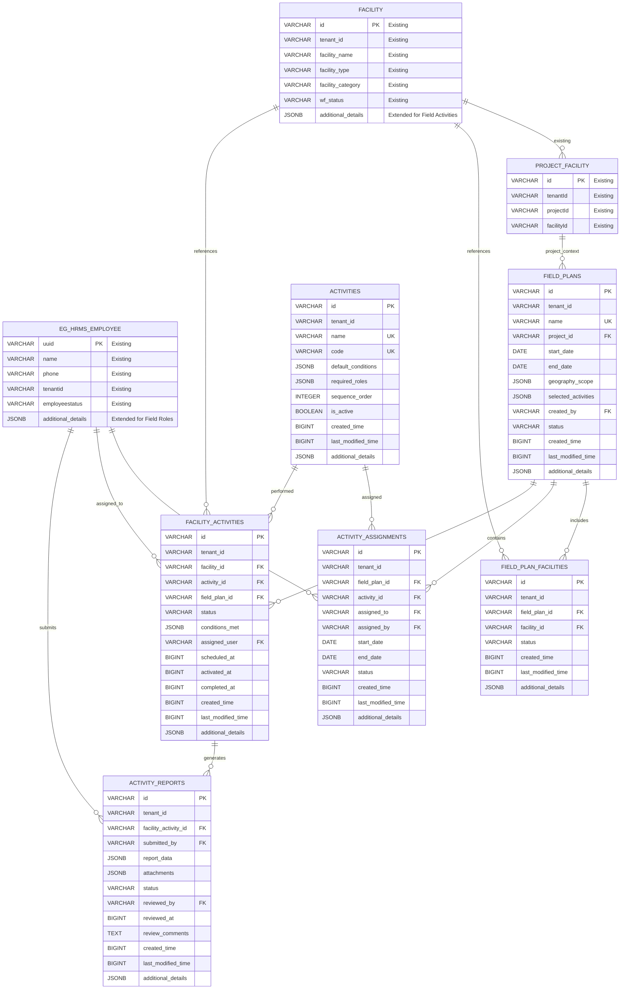

# E4H Digital Platform - Field Planner Module
## Low-Level Design Document

### Version Control
| Version | Author | Date | Changes |
|---------|--------|------|---------|
| 1.0 | Tech Lead | 2025-07-21 | Initial LLD based on PRD v1.2 |

---

## Table of Contents
1. [System Overview](#system-overview)
2. [Architecture Design](#architecture-design)
3. [Database Design](#database-design)
4. [API Specifications](#api-specifications)
5. [Component Design](#component-design)
6. [Security Design](#security-design)
7. [Integration Points](#integration-points)
8. [Implementation Guidelines](#implementation-guidelines)
9. [Performance Considerations](#performance-considerations)
10. [Error Handling](#error-handling)
11. [Deployment Architecture](#deployment-architecture)

---

## 1. System Overview

> **📋 Architectural Decision Note**: This LLD proposes Field Plans and Activities as separate services rather than extending the existing Project service. For detailed justification of this architectural decision, see:
> - **[`docs/architectural-justification-field-plans.md`]** - Comprehensive technical analysis
> - **[`docs/field-planner-vs-project-service-comparison.md`]** - Quick comparison table

### 1.1 Purpose
The Field Planner module is a **service extension** that integrates with the existing E4H Digital Platform to enable Project Managers to create and manage field execution plans for DRE installation projects across multiple health facilities.

### 1.2 Key Features
- **Bulk Field Plan Creation and Management** with array-based operations
- **Activity Assignment within Field Plan Context** for proper scoping
- **Health Facility to Activity Mapping** with conditional activation
- **Master Data Driven Design** using eGov MDMS v2 for all enums and codes
- **Workflow Separation** with dedicated workflow endpoints
- **Mobile App Data Synchronization** leveraging existing platform APIs
- **Comprehensive Validation** with minLength, maxLength, and pattern constraints
- Real-time progress tracking with audit trail
- Integration with existing E4H platform services

### 1.3 Technology Stack (Aligned with E4H Platform)
- **Backend**: Java 17, Spring Boot 3.x (consistent with existing services)
- **Database**: PostgreSQL (extends existing E4H schemas)
- **Message Queue**: Apache Kafka (uses existing topics + new Field Planner topics)
- **Cache**: Redis (shared with platform)
- **File Storage**: eGov Filestore Service
- **Workflow**: eGov Workflow v2 Service
- **MDMS**: eGov MDMS Service v2
- **Authentication**: Existing E4H Auth Service
- **API Gateway**: Existing E4H Gateway

---

## 2. Architecture Design

### 2.1 E4H Platform Integration Architecture

```
┌─────────────────────────────────────────────────────────────────┐
│                    E4H API Gateway (Existing)                   │
├─────────────────────────────────────────────────────────────────┤
│                    Frontend Layer (Existing)                    │
│  ┌─────────────────┐  ┌─────────────────┐  ┌─────────────────┐ │
│  │  E4H Web UI     │  │  Mobile App     │  │  Admin Console  │ │
│  │  (Extended)     │  │  (New Module)   │  │  (Extended)     │ │
│  └─────────────────┘  └─────────────────┘  └─────────────────┘ │
├─────────────────────────────────────────────────────────────────┤
│                    Existing E4H Services                        │
│  ┌─────────────────┐  ┌─────────────────┐  ┌─────────────────┐ │
│  │  eGov HRMS      │  │  Project Service│  │ eGov Workflow   │ │
│  │  (User Mgmt)    │  │  (Extended)     │  │  v2 Service     │ │
│  └─────────────────┘  └─────────────────┘  └─────────────────┘ │
│  ┌─────────────────┐  ┌─────────────────┐  ┌─────────────────┐ │
│  │ Health Facility │  │ eGov Filestore  │  │ eGov MDMS v2    │ │
│  │   Registry      │  │   Service       │  │   Service       │ │
│  └─────────────────┘  └─────────────────┘  └─────────────────┘ │
├─────────────────────────────────────────────────────────────────┤
│                    NEW: Field Planner Service                   │
│  ┌─────────────────┐  ┌─────────────────┐  ┌─────────────────┐ │
│  │  Field Plan     │  │  Activity       │  │  Mobile Sync    │ │
│  │  Management     │  │  Management     │  │  Service        │ │
│  └─────────────────┘  └─────────────────┘  └─────────────────┘ │
├─────────────────────────────────────────────────────────────────┤
│                    Shared Infrastructure                        │
│  ┌─────────────────┐  ┌─────────────────┐  ┌─────────────────┐ │
│  │  PostgreSQL     │  │  Redis Cache    │  │  Kafka Queue    │ │
│  │  (E4H Database) │  │  (Shared)       │  │  (Shared)       │ │
│  └─────────────────┘  └─────────────────┘  └─────────────────┘ │
└─────────────────────────────────────────────────────────────────┘
```

### 2.2 Service Integration Architecture

#### 2.2.1 Existing E4H Services (Extended)

1. **eGov HRMS Service (Existing)**
   - **Current**: Employee/user management, assignments, departments
   - **Field Planner Extension**: Team management, field staff roles, activity-based assignments

2. **Project Service (Existing)**
   - **Current**: Basic project management with facility associations
   - **Field Planner Extension**: Field plan management, activity scheduling, conditional activation

3. **Health Facility Registry (Existing)**
   - **Current**: Facility master data, location, ownership, categories
   - **Field Planner Extension**: Activity status tracking, field execution metadata

4. **eGov Workflow v2 (Existing)**
   - **Current**: Generic workflow management, state transitions, approvals
   - **Field Planner Extension**: Field activity workflows, conditional transitions, custom business rules

5. **eGov Filestore Service (Existing)**
   - **Current**: Document upload/download, file management
   - **Field Planner Extension**: Activity report attachments, Excel template generation

6. **eGov MDMS v2 Service (Existing)**
   - **Current**: Master data management for lookup values
   - **Field Planner Extension**: Activity types, conditions, field roles, validation schemas

#### 2.2.2 New Field Planner Services

1. **Field Plan Management Service (NEW)**
   - Field plan CRUD operations
   - Facility selection and assignment
   - Activity scheduling and assignment
   - Progress tracking and reporting

2. **Activity Management Service (NEW)**
   - Activity state management and conditional activation
   - Report submission and review workflows  
   - Mobile sync and offline data management
   - Team assignment and notification handling

3. **Mobile Sync Service (NEW)**
   - Mobile app synchronization
   - Offline data management
   - Conflict resolution
   - Background sync processing

---

## 3. Database Design (E4H Platform Integration)

> **🏗️ Database Architecture Decision**: Field Plans and Activities require new tables because they have fundamentally different data models, access patterns, and scalability requirements than the existing Project service. See architectural justification documents for detailed analysis.

### 3.1 Integration with Existing E4H Schemas

The Field Planner module **extends existing E4H database schemas** rather than creating duplicate tables:

#### 3.1.1 Existing Tables (Used As-Is)
- **`facility`** - Health Facility Registry (facility master data)
- **`facility_address`** - Facility location information
- **`eg_hrms_employee`** - User/employee management
- **`eg_hrms_assignment`** - Role and department assignments  
- **`PROJECT_FACILITY`** - Project-facility associations (from existing Project service)
- **Boundary tables** - Geographic hierarchy (from Boundary service)
- **MDMS tables** - Master data (from MDMS service)
- **Workflow tables** - State management (from eGov Workflow v2)

#### 3.1.2 Field Planner Extensions



### 3.2 New Field Planner Table Specifications

> **Note**: Field Planner uses existing E4H tables (`facility`, `eg_hrms_employee`, `PROJECT_FACILITY`) and only adds new tables specific to field planning functionality.

#### 3.2.1 Field Plans Table (NEW)
```sql
-- Extends project management with field planning capabilities
CREATE TABLE field_plans (
    id VARCHAR PRIMARY KEY,
    tenant_id VARCHAR NOT NULL,
    name VARCHAR(255) NOT NULL,
    project_id VARCHAR NOT NULL, -- References existing project
    start_date DATE NOT NULL,
    end_date DATE NOT NULL,
    geography_scope JSONB NOT NULL, -- District/block selection
    selected_activities JSONB NOT NULL DEFAULT '[]',
    created_by VARCHAR NOT NULL, -- References eg_hrms_employee.uuid
    status VARCHAR DEFAULT 'ACTIVE',
    created_time BIGINT DEFAULT EXTRACT(EPOCH FROM NOW()) * 1000,
    last_modified_time BIGINT DEFAULT EXTRACT(EPOCH FROM NOW()) * 1000,
    additional_details JSONB DEFAULT '{}',
    
    CONSTRAINT valid_date_range CHECK (start_date < end_date)
);

CREATE INDEX idx_field_plans_tenant ON field_plans(tenant_id);
CREATE INDEX idx_field_plans_project ON field_plans(tenant_id, project_id);
CREATE INDEX idx_field_plans_created_by ON field_plans(tenant_id, created_by);
```

#### 3.2.2 Field Plan Facilities Table (NEW)
```sql
-- Links field plans to specific facilities from existing facility table
CREATE TABLE field_plan_facilities (
    id VARCHAR PRIMARY KEY,
    tenant_id VARCHAR NOT NULL,
    field_plan_id VARCHAR NOT NULL REFERENCES field_plans(id),
    facility_id VARCHAR NOT NULL, -- References existing facility.id
    status VARCHAR DEFAULT 'ACTIVE',
    created_time BIGINT DEFAULT EXTRACT(EPOCH FROM NOW()) * 1000,
    last_modified_time BIGINT DEFAULT EXTRACT(EPOCH FROM NOW()) * 1000,
    additional_details JSONB DEFAULT '{}'
);

CREATE INDEX idx_field_plan_facilities_tenant ON field_plan_facilities(tenant_id);
CREATE INDEX idx_field_plan_facilities_plan ON field_plan_facilities(tenant_id, field_plan_id);
CREATE INDEX idx_field_plan_facilities_facility ON field_plan_facilities(tenant_id, facility_id);
CREATE UNIQUE INDEX uniq_field_plan_facility ON field_plan_facilities(tenant_id, field_plan_id, facility_id);
```

#### 3.2.3 Activities Table (NEW)
```sql
-- Master data for field activities with configurable conditions
CREATE TABLE activities (
    id VARCHAR PRIMARY KEY,
    tenant_id VARCHAR NOT NULL,
    name VARCHAR(255) NOT NULL,
    code VARCHAR(50) NOT NULL,
    default_conditions JSONB NOT NULL DEFAULT '{}', -- Activation conditions
    required_roles JSONB NOT NULL DEFAULT '[]', -- Required roles for activity
    sequence_order INTEGER DEFAULT 0,
    is_active BOOLEAN DEFAULT TRUE,
    created_time BIGINT DEFAULT EXTRACT(EPOCH FROM NOW()) * 1000,
    last_modified_time BIGINT DEFAULT EXTRACT(EPOCH FROM NOW()) * 1000,
    additional_details JSONB DEFAULT '{}'
);

CREATE INDEX idx_activities_tenant ON activities(tenant_id);
CREATE INDEX idx_activities_code ON activities(tenant_id, code);
CREATE UNIQUE INDEX uniq_activity_code ON activities(tenant_id, code);
```

#### 3.2.4 Activity Assignments Table (NEW)
```sql
-- Assigns activities to SPOCs within field plans
CREATE TABLE activity_assignments (
    id VARCHAR PRIMARY KEY,
    tenant_id VARCHAR NOT NULL,
    field_plan_id VARCHAR NOT NULL REFERENCES field_plans(id),
    activity_id VARCHAR NOT NULL REFERENCES activities(id),
    assigned_to VARCHAR NOT NULL, -- References eg_hrms_employee.uuid
    assigned_by VARCHAR NOT NULL, -- References eg_hrms_employee.uuid
    start_date DATE NOT NULL,
    end_date DATE NOT NULL,
    status VARCHAR DEFAULT 'ACTIVE',
    created_time BIGINT DEFAULT EXTRACT(EPOCH FROM NOW()) * 1000,
    last_modified_time BIGINT DEFAULT EXTRACT(EPOCH FROM NOW()) * 1000,
    additional_details JSONB DEFAULT '{}'
);

CREATE INDEX idx_activity_assignments_tenant ON activity_assignments(tenant_id);
CREATE INDEX idx_activity_assignments_plan ON activity_assignments(tenant_id, field_plan_id);
CREATE INDEX idx_activity_assignments_assigned_to ON activity_assignments(tenant_id, assigned_to);
```

#### 3.2.5 Facility Activities Table (NEW)
```sql
-- Tracks facility-level activity execution with conditional activation
CREATE TABLE facility_activities (
    id VARCHAR PRIMARY KEY,
    tenant_id VARCHAR NOT NULL,
    facility_id VARCHAR NOT NULL, -- References existing facility.id
    activity_id VARCHAR NOT NULL REFERENCES activities(id),
    field_plan_id VARCHAR NOT NULL REFERENCES field_plans(id),
    status VARCHAR DEFAULT 'SCHEDULED', -- SCHEDULED, ACTIVE, COMPLETED, CANCELLED
    conditions_met JSONB DEFAULT '{}', -- Tracks which conditions are satisfied
    assigned_user VARCHAR, -- References eg_hrms_employee.uuid
    scheduled_at BIGINT,
    activated_at BIGINT,
    completed_at BIGINT,
    created_time BIGINT DEFAULT EXTRACT(EPOCH FROM NOW()) * 1000,
    last_modified_time BIGINT DEFAULT EXTRACT(EPOCH FROM NOW()) * 1000,
    additional_details JSONB DEFAULT '{}'
);

CREATE INDEX idx_facility_activities_tenant ON facility_activities(tenant_id);
CREATE INDEX idx_facility_activities_facility ON facility_activities(tenant_id, facility_id);
CREATE INDEX idx_facility_activities_status ON facility_activities(tenant_id, status);
CREATE INDEX idx_facility_activities_assigned ON facility_activities(tenant_id, assigned_user);
CREATE INDEX idx_facility_activities_composite ON facility_activities(tenant_id, facility_id, activity_id, field_plan_id);
```

### 3.3 Integration with Existing E4H Services

#### 3.3.1 Service Dependencies
```yaml
# Field Planner service dependencies
dependencies:
  - health-facility-registry  # For facility data
  - egov-hrms                # For user/employee management  
  - project-service          # For project context
  - egov-workflow-v2         # For activity workflows
  - egov-mdms-service-v2     # For master data validation
  - egov-filestore           # For file operations
  - boundary-service         # For geographic data
```

#### 3.3.2 Database Migration Strategy
```sql
-- Migration approach: Only create Field Planner specific tables
-- Existing tables: facility, eg_hrms_employee, PROJECT_FACILITY remain unchanged

-- Step 1: Create Field Planner tables in sequence
-- Already covered in 3.2.1 through 3.2.5

-- Step 2: Add activity_reports table for report management
CREATE TABLE activity_reports (
    id VARCHAR PRIMARY KEY,
    tenant_id VARCHAR NOT NULL,
    facility_activity_id VARCHAR NOT NULL REFERENCES facility_activities(id),
    submitted_by VARCHAR NOT NULL, -- References eg_hrms_employee.uuid
    report_data JSONB NOT NULL DEFAULT '{}',
    attachments JSONB DEFAULT '[]', -- filestore references
    status VARCHAR DEFAULT 'SUBMITTED', -- SUBMITTED, APPROVED, REJECTED, FLAGGED_FOR_FIELD_QC
    reviewed_by VARCHAR, -- References eg_hrms_employee.uuid
    reviewed_at BIGINT,
    review_comments TEXT,
    created_time BIGINT DEFAULT EXTRACT(EPOCH FROM NOW()) * 1000,
    last_modified_time BIGINT DEFAULT EXTRACT(EPOCH FROM NOW()) * 1000,
    additional_details JSONB DEFAULT '{}'
);

-- Step 3: Create indexes for performance optimization
CREATE INDEX idx_activity_reports_tenant ON activity_reports(tenant_id);
CREATE INDEX idx_activity_reports_facility_activity ON activity_reports(tenant_id, facility_activity_id);
CREATE INDEX idx_activity_reports_status ON activity_reports(tenant_id, status);
CREATE INDEX idx_activity_reports_submitted_by ON activity_reports(tenant_id, submitted_by);
CREATE INDEX idx_activity_reports_reviewed_by ON activity_reports(tenant_id, reviewed_by);
```

#### 3.3.3 Data Consistency Patterns
```java
// Example: Ensuring data consistency with existing services
@Component
public class FacilityDataConsistencyService {
    
    @Autowired
    private FacilityServiceClient facilityServiceClient;
    
    @Autowired
    private HRMSServiceClient hrmsServiceClient;
    
    public void validateFacilityAssignment(String tenantId, String facilityId, String employeeId) {
        // Validate facility exists in Health Facility Registry
        FacilityResponse facility = facilityServiceClient.getFacility(tenantId, facilityId);
        if (facility == null || !facility.getIsActive()) {
            throw new ValidationException("Invalid or inactive facility: " + facilityId);
        }
        
        // Validate employee exists in eGov HRMS
        EmployeeResponse employee = hrmsServiceClient.getEmployee(tenantId, employeeId);
        if (employee == null || !employee.getActive()) {
            throw new ValidationException("Invalid or inactive employee: " + employeeId);
        }
    }
}
```

---

## 4. API Specifications

### 4.1 REST API Design Principles

- **RESTful Design**: Follow REST principles with proper HTTP methods
- **Consistent Naming**: Use kebab-case for endpoints
- **Versioning**: Use header-based versioning (Accept: application/vnd.api.v1+json)
- **Pagination**: Implement cursor-based pagination for large datasets
- **Filtering**: Support query parameters for filtering and sorting
- **Error Handling**: Standardized error response format

### 4.2 Core API Endpoints

#### 4.2.1 Integration with Existing E4H APIs

```yaml
# EXISTING APIs (used by Field Planner)
# eGov HRMS Service
GET    /egov-hrms/employees/_search          # Get employees/users
POST   /egov-hrms/employees/_create          # Create field staff
POST   /egov-hrms/employees/_update          # Update employee details

# Health Facility Registry  
GET    /facility/v1/_search                  # Search facilities
GET    /facility/v1/{id}                     # Get facility details
POST   /facility/v1/_create                  # Create facilities (admin)

# Project Service (Extended)
GET    /project/v1/_search                   # Get existing projects  
POST   /project/v1/_create                   # Create projects (existing)
GET    /project/PROJECT_FACILITY/_search     # Get project-facility links

# eGov Filestore
POST   /filestore/v1/files                   # Upload files/templates
GET    /filestore/v1/files/{id}              # Download files

# eGov MDMS Service  
POST   /egov-mdms-service/v1/_search         # Get master data
```

#### 4.2.2 NEW Field Planner APIs (Revised Architecture)

```yaml
# Field Plan Management (Bulk Operations)
POST   /field-planner/v1/field-plans/_create        # Bulk create (array input)
POST   /field-planner/v1/field-plans/_search
GET    /field-planner/v1/field-plans/{id}
POST   /field-planner/v1/field-plans/_update        # Bulk update (array input)
POST   /field-planner/v1/field-plans/_workflow      # Workflow state transitions
POST   /field-planner/v1/field-plans/facilities/_assign # Bulk facility assignment
GET    /field-planner/v1/field-plans/{fieldPlanId}/facilities/template

# Field Plan Activity Management (Context-Based)
POST   /field-planner/v1/field-plans/{fieldPlanId}/activities/{activityId}/_assign
POST   /field-planner/v1/field-plans/{fieldPlanId}/activities/_search

# Facility Activity Mapping (Within Field Plan Context)
POST   /field-planner/v1/field-plans/{fieldPlanId}/facility-activities/_assign  # Bulk mapping
POST   /field-planner/v1/field-plans/{fieldPlanId}/facility-activities/_update  # Bulk updates (includes activation)
POST   /field-planner/v1/field-plans/{fieldPlanId}/facility-activities/_search
GET    /field-planner/v1/facility-activities/{facilityActivityId}/activation-check

# Activity Reports (Bulk Operations + Workflow)
POST   /field-planner/v1/activity-reports/_create    # Bulk create (array input)
POST   /field-planner/v1/activity-reports/_search
POST   /field-planner/v1/activity-reports/_update    # Bulk update (array input)  
POST   /field-planner/v1/activity-reports/_workflow  # Unified workflow endpoint (SUBMIT, APPROVE, REJECT, FLAG_FOR_QC)

# Mobile Sync (Leveraging Platform APIs)
POST   /field-planner/v1/mobile/sync/assignments     # Assignment sync using HFR bulk APIs
POST   /field-planner/v1/mobile/reports/_upload      # Report upload with offline support

# Team Management (Using HRMS Integration)
POST   /field-planner/v1/teams/assignments/_search   # Team assignment tracking
```

#### 4.2.3 Mobile Sync APIs (Platform Integration)

```yaml
# Mobile Application Endpoints (Leveraging Existing Platform APIs)
POST   /field-planner/v1/mobile/sync/assignments       # User assignment sync (leverages HFR bulk APIs)
POST   /field-planner/v1/mobile/reports/_upload        # Bulk report upload with offline support

# Note: Mobile sync leverages existing platform services:
# - Health Facility Registry bulk APIs for facility data
# - eGov HRMS APIs for user profile data  
# - eGov MDMS v2 APIs for master data synchronization
# - eGov Filestore for media file handling
```

#### 4.2.4 API Design Principles (Revised)

- **Versioning**: All endpoints use `/v1/` prefix for proper API versioning
- **Bulk Operations**: Create and update operations accept arrays to reduce API calls
- **Master Data Integration**: All status codes, priorities, and enums reference MDMS codes
- **Workflow Separation**: Dedicated `_workflow` endpoints for state transitions
- **Context Preservation**: Activities managed within field plan context
- **Platform Integration**: Leverage existing eGov services (HRMS, HFR, MDMS, Filestore)
- **Validation**: Comprehensive input validation with length and pattern constraints

#### 4.2.5 Key Architectural Changes

**From Individual to Bulk Operations:**
```yaml
# OLD: Individual operations
POST   /api/v1/field-plans                    # Single field plan
PUT    /api/v1/field-plans/{id}              # Single update

# NEW: Bulk operations  
POST   /field-planner/v1/field-plans/_create  # Array of field plans
POST   /field-planner/v1/field-plans/_update  # Array of updates
```

**From Generic to Context-Specific:**
```yaml
# OLD: Generic activity management
POST   /api/v1/activities/{id}/assign         # Activity assignment

# NEW: Field plan context
POST   /field-planner/v1/field-plans/{fieldPlanId}/activities/{activityId}/_assign
```

**From Status URLs to Workflow Endpoints:**  
```yaml
# OLD: Multiple status-specific URLs
POST   /api/v1/activity-reports/{id}/approve
POST   /api/v1/activity-reports/{id}/reject
POST   /api/v1/activity-reports/{id}/flag-for-qc

# NEW: Unified workflow endpoint
POST   /field-planner/v1/activity-reports/_workflow  # action: APPROVE/REJECT/FLAG_FOR_QC
```

### 4.3 API Response Format

```json
{
  "success": true,
  "data": {
    // Response data
  },
  "meta": {
    "timestamp": "2024-01-01T00:00:00Z",
    "version": "1.0",
    "pagination": {
      "page": 1,
      "limit": 20,
      "total": 100,
      "hasNext": true,
      "hasPrevious": false
    }
  },
  "errors": []
}
```

### 4.4 Error Response Format

```json
{
  "success": false,
  "data": null,
  "meta": {
    "timestamp": "2024-01-01T00:00:00Z",
    "version": "1.0"
  },
  "errors": [
    {
      "code": "VALIDATION_ERROR",
      "message": "Invalid input data",
      "details": [
        {
          "field": "email",
          "message": "Invalid email format"
        }
      ]
    }
  ]
}
```

---

## 5. Component Design

### 5.1 Backend Components

#### 5.1.1 Field Planner Service Integration

```java
@Service
@Transactional
public class FieldPlannerService {
    
    @Autowired
    private FieldPlanRepository fieldPlanRepository;
    
    @Autowired
    private HRMSServiceClient hrmsServiceClient;
    
    @Autowired
    private FacilityServiceClient facilityServiceClient;
    
    @Autowired
    private ProjectServiceClient projectServiceClient;
    
    @Autowired
    private AuditService auditService;
    
    public List<FieldPlanDTO> createFieldPlans(CreateFieldPlansRequest request) {
        List<FieldPlanDTO> createdPlans = new ArrayList<>();
        
        // Bulk validation and processing
        for (CreateFieldPlanRequest planRequest : request.getFieldPlans()) {
            // Validate project exists
            ProjectResponse project = projectServiceClient.getProject(planRequest.getTenantId(), planRequest.getProjectId());
            if (project == null) {
                throw new EntityNotFoundException("Project not found: " + planRequest.getProjectId());
            }
            
            // Validate user exists in HRMS
            EmployeeResponse creator = hrmsServiceClient.getEmployee(planRequest.getTenantId(), planRequest.getCreatedBy());
            if (creator == null || !creator.getActive()) {
                throw new ValidationException("Invalid creator employee: " + planRequest.getCreatedBy());
            }
            
            // Validate master data codes via MDMS
            validateMasterDataCodes(planRequest.getTenantId(), planRequest.getSelectedActivities());
            
            // Create field plan entity (follows E4H conventions)
            FieldPlan fieldPlan = new FieldPlan();
            fieldPlan.setId(idGenService.generateId());
            fieldPlan.setTenantId(planRequest.getTenantId());
            fieldPlan.setName(planRequest.getName());
            fieldPlan.setProjectId(planRequest.getProjectId());
            fieldPlan.setStartDate(planRequest.getStartDate());
            fieldPlan.setEndDate(planRequest.getEndDate());
            fieldPlan.setGeographyScope(planRequest.getGeographyScope());
            fieldPlan.setSelectedActivities(planRequest.getSelectedActivities()); // MDMS codes
            fieldPlan.setCreatedBy(planRequest.getCreatedBy());
            fieldPlan.setStatus("FIELD_PLAN_ACTIVE"); // MDMS master data code
            fieldPlan.setCreatedTime(System.currentTimeMillis());
            fieldPlan.setLastModifiedTime(System.currentTimeMillis());
            
            // Save field plan
            FieldPlan savedFieldPlan = fieldPlanRepository.save(fieldPlan);
            createdPlans.add(FieldPlanMapper.toDTO(savedFieldPlan));
            
            // Log audit event using existing audit framework
            auditService.logFieldPlanCreation(savedFieldPlan);
        }
        
        return createdPlans;
    }
    
    private void validateMasterDataCodes(String tenantId, List<String> activityCodes) {
        // Validate activity codes against MDMS
        MDMSSearchRequest mdmsRequest = new MDMSSearchRequest();
        mdmsRequest.setTenantId(tenantId);
        mdmsRequest.setModuleName("field-planner");
        mdmsRequest.setMasterName("ActivityTypes");
        
        List<MDMSData> validCodes = mdmsServiceClient.search(mdmsRequest);
        
        for (String code : activityCodes) {
            boolean isValidCode = validCodes.stream()
                .anyMatch(data -> code.equals(data.getCode()));
            if (!isValidCode) {
                throw new ValidationException("Invalid activity code: " + code);
            }
        }
    }
    
    public BulkFacilityAssignmentResponse bulkAssignFacilitiesToFieldPlans(
            BulkFacilityAssignmentRequest request) {
        List<FacilityAssignmentResult> results = new ArrayList<>();
        int totalProcessed = 0;
        int successfulAssignments = 0;
        int failedAssignments = 0;
        
        // Process each facility assignment
        for (FacilityAssignmentRequest assignment : request.getFacilityAssignments()) {
            totalProcessed++;
            
            try {
                // Validate field plan exists
                FieldPlan fieldPlan = fieldPlanRepository.findByIdAndTenantId(
                    assignment.getFieldPlanId(), request.getTenantId())
                    .orElseThrow(() -> new EntityNotFoundException("Field plan not found: " + assignment.getFieldPlanId()));
                
                // Validate facility exists in Health Facility Registry
                FacilityResponse facility = facilityServiceClient.getFacility(
                    request.getTenantId(), assignment.getFacilityId());
                if (facility == null || !facility.getIsActive()) {
                    throw new ValidationException("Invalid or inactive facility: " + assignment.getFacilityId());
                }
                
                // Validate priority code via MDMS
                validatePriorityCode(request.getTenantId(), assignment.getPriorityCode());
                
                // Create field plan facility association
                FieldPlanFacility fpFacility = new FieldPlanFacility();
                fpFacility.setId(idGenService.generateId());
                fpFacility.setTenantId(request.getTenantId());
                fpFacility.setFieldPlanId(assignment.getFieldPlanId());
                fpFacility.setFacilityId(assignment.getFacilityId());
                fpFacility.setStatus("ACTIVE"); // MDMS code
                fpFacility.setPriorityCode(assignment.getPriorityCode()); // MDMS reference
                fpFacility.setCreatedTime(System.currentTimeMillis());
                fpFacility.setAdditionalDetails(assignment.getAdditionalDetails());
                
                FieldPlanFacility savedAssociation = fieldPlanFacilityRepository.save(fpFacility);
                
                // Record success
                FacilityAssignmentResult result = new FacilityAssignmentResult();
                result.setFieldPlanId(assignment.getFieldPlanId());
                result.setFacilityId(assignment.getFacilityId());
                result.setStatus("SUCCESS");
                result.setMessage("Facility assigned successfully");
                result.setFieldPlanFacilityId(savedAssociation.getId());
                results.add(result);
                
                successfulAssignments++;
                
            } catch (Exception e) {
                // Record failure
                FacilityAssignmentResult result = new FacilityAssignmentResult();
                result.setFieldPlanId(assignment.getFieldPlanId());
                result.setFacilityId(assignment.getFacilityId());
                result.setStatus("FAILED");
                result.setMessage(e.getMessage());
                results.add(result);
                
                failedAssignments++;
                log.error("Failed to assign facility {} to field plan {}: {}", 
                    assignment.getFacilityId(), assignment.getFieldPlanId(), e.getMessage());
            }
        }
        
        // Log bulk audit event
        auditService.logBulkFacilityAssignments(request.getTenantId(), results);
        
        // Prepare response
        BulkFacilityAssignmentResponse response = new BulkFacilityAssignmentResponse();
        response.setAssignmentResults(results);
        response.setProcessingSummary(new ProcessingSummary(
            totalProcessed, successfulAssignments, failedAssignments, 0));
        
        return response;
    }
    
    private void validatePriorityCode(String tenantId, String priorityCode) {
        // Validate priority code against MDMS master data
        MDMSSearchRequest mdmsRequest = new MDMSSearchRequest();
        mdmsRequest.setTenantId(tenantId);
        mdmsRequest.setModuleName("field-planner");
        mdmsRequest.setMasterName("PriorityLevels");
        
        List<MDMSData> validCodes = mdmsServiceClient.search(mdmsRequest);
        boolean isValid = validCodes.stream()
            .anyMatch(data -> priorityCode.equals(data.getCode()));
            
        if (!isValid) {
            throw new ValidationException("Invalid priority code: " + priorityCode);
        }
    }
}
```

#### 5.1.2 Activity Management Service (NEW)

```java
@Service
@Transactional
public class ActivityManagementService {
    
    @Autowired
    private FacilityActivityRepository facilityActivityRepository;
    
    @Autowired
    private ActivityReportRepository activityReportRepository;
    
    @Autowired
    private HRMSServiceClient hrmsServiceClient;
    
    @Autowired
    private WorkflowServiceClient workflowServiceClient;
    
    @Autowired
    private ConditionEvaluator conditionEvaluator;
    
    @Autowired
    private NotificationProducer notificationProducer;
    
    public FacilityActivitiesResponse updateFacilityActivitiesInFieldPlan(
            String fieldPlanId, UpdateFacilityActivitiesRequest request) {
        List<FacilityActivity> updatedActivities = new ArrayList<>();
        
        // Validate field plan exists
        FieldPlan fieldPlan = fieldPlanRepository.findById(fieldPlanId)
            .orElseThrow(() -> new EntityNotFoundException("Field plan not found: " + fieldPlanId));
        
        // Process bulk updates
        for (FacilityActivityUpdateRequest updateRequest : request.getFacilityActivityUpdates()) {
            // Validate user exists in HRMS if user assignment is being updated
            if (updateRequest.getAssignedUserId() != null) {
                EmployeeResponse employee = hrmsServiceClient.getEmployee(
                    updateRequest.getTenantId(), updateRequest.getAssignedUserId());
                if (employee == null || !employee.getActive()) {
                    throw new ValidationException("Invalid or inactive employee: " + updateRequest.getAssignedUserId());
                }
            }
            
            // Get facility activity
            FacilityActivity facilityActivity = facilityActivityRepository
                .findByIdAndTenantId(updateRequest.getFacilityActivityId(), updateRequest.getTenantId())
                .orElseThrow(() -> new EntityNotFoundException("Facility activity not found"));
            
            // Update facility activity fields
            if (updateRequest.getAssignedUserId() != null) {
                facilityActivity.setAssignedUser(updateRequest.getAssignedUserId());
            }
            
            if (updateRequest.getIsActive() != null) {
                // Handle activation/deactivation via isActive flag
                if (updateRequest.getIsActive()) {
                    // Check if conditions are met for activation
                    if (conditionEvaluator.evaluateActivationConditions(facilityActivity)) {
                        facilityActivity.setStatus("FACILITY_ACTIVITY_ACTIVE"); // MDMS code
                        facilityActivity.setActivatedAt(System.currentTimeMillis());
                        
                        // Send activation notification via Kafka
                        FacilityActivityEvent event = new FacilityActivityEvent();
                        event.setTenantId(updateRequest.getTenantId());
                        event.setFacilityActivityId(updateRequest.getFacilityActivityId());
                        event.setUserId(updateRequest.getAssignedUserId());
                        event.setEventType("FACILITY_ACTIVATED");
                        
                        notificationProducer.sendFacilityActivationEvent(event);
                    } else {
                        throw new BusinessRuleException("Activation conditions not met for facility activity");
                    }
                } else {
                    facilityActivity.setStatus("FACILITY_ACTIVITY_SCHEDULED"); // MDMS code
                    facilityActivity.setActivatedAt(null);
                }
            }
            
            if (updateRequest.getTargetCompletionDate() != null) {
                facilityActivity.setTargetCompletionDate(updateRequest.getTargetCompletionDate());
            }
            
            if (updateRequest.getPriorityCode() != null) {
                validatePriorityCode(updateRequest.getTenantId(), updateRequest.getPriorityCode());
                facilityActivity.setPriorityCode(updateRequest.getPriorityCode());
            }
            
            facilityActivity.setLastModifiedTime(System.currentTimeMillis());
            facilityActivity.setAdditionalDetails(updateRequest.getAdditionalDetails());
            
            FacilityActivity savedActivity = facilityActivityRepository.save(facilityActivity);
            updatedActivities.add(savedActivity);
        }
        
        // Prepare response
        FacilityActivitiesResponse response = new FacilityActivitiesResponse();
        response.setFacilityActivities(updatedActivities.stream()
            .map(FacilityActivityMapper::toDTO)
            .collect(Collectors.toList()));
        
        return response;
    }
    
    public ActivityReportsResponse createActivityReports(CreateActivityReportsRequest request) {
        List<ActivityReport> createdReports = new ArrayList<>();
        
        // Process bulk report creation
        for (CreateActivityReportRequest reportRequest : request.getActivityReports()) {
            // Validate facility activity exists
            FacilityActivity facilityActivity = facilityActivityRepository
                .findByIdAndTenantId(reportRequest.getFacilityActivityId(), reportRequest.getTenantId())
                .orElseThrow(() -> new EntityNotFoundException("Facility activity not found"));
            
            // Validate reporter exists in HRMS
            EmployeeResponse reporter = hrmsServiceClient.getEmployee(
                reportRequest.getTenantId(), reportRequest.getSubmittedBy());
            if (reporter == null) {
                throw new ValidationException("Invalid reporter employee");
            }
            
            // Validate report type code via MDMS
            validateReportTypeCode(reportRequest.getTenantId(), reportRequest.getReportTypeCode());
            
            // Create activity report
            ActivityReport report = new ActivityReport();
            report.setId(idGenService.generateId());
            report.setTenantId(reportRequest.getTenantId());
            report.setFacilityActivityId(reportRequest.getFacilityActivityId());
            report.setFacilityId(reportRequest.getFacilityId()); // Added for search optimization
            report.setSubmittedBy(reportRequest.getSubmittedBy());
            report.setReportTypeCode(reportRequest.getReportTypeCode()); // MDMS code
            report.setReportData(reportRequest.getReportData());
            report.setAttachments(reportRequest.getAttachments());
            report.setGeoLocation(reportRequest.getGeoLocation());
            report.setStatusCode("REPORT_SUBMITTED"); // MDMS master data code
            report.setCreatedTime(System.currentTimeMillis());
            report.setAdditionalDetails(reportRequest.getAdditionalDetails());
            
            ActivityReport savedReport = activityReportRepository.save(report);
            createdReports.add(savedReport);
            
            // Update facility activity status (not directly to COMPLETED - through workflow)
            facilityActivity.setStatus("FACILITY_ACTIVITY_REPORT_SUBMITTED"); // MDMS code
            facilityActivity.setLastModifiedTime(System.currentTimeMillis());
            facilityActivityRepository.save(facilityActivity);
            
            // Send report submission notification
            ActivityReportEvent reportEvent = new ActivityReportEvent();
            reportEvent.setTenantId(reportRequest.getTenantId());
            reportEvent.setReportId(savedReport.getId());
            reportEvent.setEventType("REPORT_SUBMITTED");
            
            notificationProducer.sendReportSubmissionEvent(reportEvent);
        }
        
        // Prepare response
        ActivityReportsResponse response = new ActivityReportsResponse();
        response.setActivityReports(createdReports.stream()
            .map(ActivityReportMapper::toDTO)
            .collect(Collectors.toList()));
        
        return response;
    }
    
    public ActivityReportsResponse processActivityReportWorkflow(ActivityReportWorkflowRequest request) {
        List<ActivityReport> processedReports = new ArrayList<>();
        
        // Process workflow actions in bulk
        for (WorkflowActionRequest actionRequest : request.getWorkflowActions()) {
            ActivityReport report = activityReportRepository
                .findByIdAndTenantId(actionRequest.getActivityReportId(), actionRequest.getTenantId())
                .orElseThrow(() -> new EntityNotFoundException("Activity report not found"));
            
            // Validate action code via MDMS
            validateWorkflowActionCode(actionRequest.getTenantId(), actionRequest.getAction());
            
            // Process workflow action
            switch (actionRequest.getAction()) {
                case "SUBMIT":
                    report.setStatusCode("REPORT_UNDER_REVIEW"); // MDMS code
                    break;
                case "APPROVE":
                    report.setStatusCode("REPORT_APPROVED"); // MDMS code
                    updateFacilityActivityOnApproval(report);
                    break;
                case "REJECT":
                    report.setStatusCode("REPORT_REJECTED"); // MDMS code
                    break;
                case "FLAG_FOR_QC":
                    report.setStatusCode("REPORT_FLAGGED_FOR_QC"); // MDMS code
                    initiateFielQCWorkflow(report);
                    break;
                default:
                    throw new ValidationException("Invalid workflow action: " + actionRequest.getAction());
            }
            
            // Update review details
            report.setReviewedBy(SecurityUtils.getCurrentUserId());
            report.setReviewedAt(System.currentTimeMillis());
            report.setReviewComments(actionRequest.getComments());
            report.setLastModifiedTime(System.currentTimeMillis());
            
            ActivityReport savedReport = activityReportRepository.save(report);
            processedReports.add(savedReport);
            
            // Send workflow notification
            sendWorkflowNotification(savedReport, actionRequest.getAction());
        }
        
        // Prepare response
        ActivityReportsResponse response = new ActivityReportsResponse();
        response.setActivityReports(processedReports.stream()
            .map(ActivityReportMapper::toDTO)
            .collect(Collectors.toList()));
        
        return response;
    }
    
    private void validateReportTypeCode(String tenantId, String reportTypeCode) {
        // Validate report type against MDMS
        MDMSSearchRequest mdmsRequest = new MDMSSearchRequest();
        mdmsRequest.setTenantId(tenantId);
        mdmsRequest.setModuleName("field-planner");
        mdmsRequest.setMasterName("ReportTypes");
        
        List<MDMSData> validCodes = mdmsServiceClient.search(mdmsRequest);
        boolean isValid = validCodes.stream()
            .anyMatch(data -> reportTypeCode.equals(data.getCode()));
            
        if (!isValid) {
            throw new ValidationException("Invalid report type code: " + reportTypeCode);
        }
    }
    
    private void validateWorkflowActionCode(String tenantId, String actionCode) {
        // Validate workflow action against MDMS
        MDMSSearchRequest mdmsRequest = new MDMSSearchRequest();
        mdmsRequest.setTenantId(tenantId);
        mdmsRequest.setModuleName("field-planner");
        mdmsRequest.setMasterName("WorkflowActions");
        
        List<MDMSData> validCodes = mdmsServiceClient.search(mdmsRequest);
        boolean isValid = validCodes.stream()
            .anyMatch(data -> actionCode.equals(data.getCode()));
            
        if (!isValid) {
            throw new ValidationException("Invalid workflow action code: " + actionCode);
        }
    }
    
    // Additional methods for review, approval, etc.
}
```

#### 5.1.3 Workflow Service

```java
@Service
@Transactional
public class WorkflowService {
    
    @Autowired
    private ActivityRepository activityRepository;
    
    @Autowired
    private FacilityActivityRepository facilityActivityRepository;
    
    @Autowired
    private ConditionEvaluator conditionEvaluator;
    
    @Autowired
    private NotificationService notificationService;
    
    public void checkAndActivateFacilities(UUID fieldPlanId) {
        // Get all scheduled facility activities for the field plan
        List<FacilityActivity> scheduledActivities = facilityActivityRepository
            .findByFieldPlanIdAndStatus(fieldPlanId, FacilityActivityStatus.SCHEDULED);
        
        for (FacilityActivity facilityActivity : scheduledActivities) {
            // Check if conditions are met for activation
            if (conditionEvaluator.evaluateConditions(facilityActivity)) {
                // Activate the facility activity
                facilityActivity.setStatus(FacilityActivityStatus.ACTIVE);
                facilityActivity.setActivatedAt(Instant.now());
                facilityActivityRepository.save(facilityActivity);
                
                // Notify assigned users
                notificationService.notifyActivityActivated(facilityActivity);
            }
        }
    }
    
    public void processActivityReport(UUID reportId, ReviewAction action, String comments) {
        ActivityReport report = getActivityReportById(reportId);
        
        // Update report status
        report.setStatus(mapActionToStatus(action));
        report.setReviewedBy(SecurityUtils.getCurrentUserId());
        report.setReviewedAt(Instant.now());
        report.setReviewComments(comments);
        
        activityReportRepository.save(report);
        
        // Handle based on action
        switch (action) {
            case APPROVE:
                handleApproval(report);
                break;
            case REJECT:
                handleRejection(report);
                break;
            case FLAG_FOR_FIELD_QC:
                handleFieldQCFlag(report);
                break;
        }
    }
    
    // Additional methods...
}
```

### 5.2 Frontend Components

#### 5.2.1 React Component Structure

```
src/
├── components/
│   ├── common/
│   │   ├── DataTable/
│   │   ├── FormComponents/
│   │   ├── Layout/
│   │   └── Navigation/
│   ├── projects/
│   │   ├── ProjectList/
│   │   ├── ProjectForm/
│   │   ├── ProjectDetails/
│   │   └── FacilityUpload/
│   ├── field-plans/
│   │   ├── FieldPlanList/
│   │   ├── FieldPlanForm/
│   │   ├── FieldPlanDetails/
│   │   └── ActivityAssignment/
│   ├── activities/
│   │   ├── ActivityList/
│   │   ├── ActivityDetails/
│   │   ├── ReportReview/
│   │   └── FacilityAssignment/
│   └── users/
│       ├── UserList/
│       ├── UserForm/
│       └── TeamManagement/
├── services/
│   ├── api/
│   ├── auth/
│   ├── storage/
│   └── utils/
├── hooks/
├── store/
└── types/
```

#### 5.2.2 Key React Components

```typescript
// ProjectForm.tsx
interface ProjectFormProps {
  initialData?: Project;
  onSubmit: (data: CreateProjectRequest) => void;
  onCancel: () => void;
}

const ProjectForm: React.FC<ProjectFormProps> = ({ initialData, onSubmit, onCancel }) => {
  const [formData, setFormData] = useState<CreateProjectRequest>({
    name: initialData?.name || '',
    type: initialData?.type || ProjectType.MEDTECH,
    justificationCode: initialData?.justificationCode || '',
    startDate: initialData?.startDate || '',
    endDate: initialData?.endDate || '',
    stateId: initialData?.stateId || '',
  });

  const [errors, setErrors] = useState<ValidationErrors>({});

  const handleSubmit = (e: React.FormEvent) => {
    e.preventDefault();
    
    const validationErrors = validateProjectForm(formData);
    if (Object.keys(validationErrors).length > 0) {
      setErrors(validationErrors);
      return;
    }
    
    onSubmit(formData);
  };

  return (
    <form onSubmit={handleSubmit} className="project-form">
      <div className="form-group">
        <label htmlFor="projectType">Project Type *</label>
        <select
          id="projectType"
          value={formData.type}
          onChange={(e) => setFormData({ ...formData, type: e.target.value as ProjectType })}
          className={errors.type ? 'error' : ''}
        >
          <option value={ProjectType.MEDTECH}>MedTech</option>
          <option value={ProjectType.ENERGY_FOR_HEALTH}>Energy for Health</option>
          <option value={ProjectType.LIVELIHOODS}>Livelihoods</option>
        </select>
        {errors.type && <span className="error-message">{errors.type}</span>}
      </div>
      
      {/* Additional form fields */}
      
      <div className="form-actions">
        <button type="button" onClick={onCancel} className="btn btn-secondary">
          Cancel
        </button>
        <button type="submit" className="btn btn-primary">
          Create Project
        </button>
      </div>
    </form>
  );
};
```

---

## 6. Security Design

### 6.1 Authentication & Authorization

#### 6.1.1 JWT Token Structure

```json
{
  "header": {
    "alg": "RS256",
    "typ": "JWT"
  },
  "payload": {
    "sub": "user-uuid",
    "email": "user@example.com",
    "organization_id": "org-uuid",
    "roles": ["PROJECT_MANAGER", "INSTALLATION_SPOC"],
    "permissions": ["CREATE_PROJECT", "VIEW_REPORTS"],
    "iat": 1640995200,
    "exp": 1640998800,
    "iss": "e4h-platform",
    "aud": "e4h-clients"
  }
}
```

#### 6.1.2 Role-Based Access Control

```java
@Component
public class SecurityConfig {
    
    public static final String[] PUBLIC_URLS = {
        "/api/v1/auth/**",
        "/api/v1/health",
        "/swagger-ui/**",
        "/v3/api-docs/**"
    };
    
    @Bean
    public SecurityFilterChain filterChain(HttpSecurity http) throws Exception {
        http
            .csrf().disable()
            .sessionManagement().sessionCreationPolicy(SessionCreationPolicy.STATELESS)
            .and()
            .authorizeHttpRequests(authz -> authz
                .requestMatchers(PUBLIC_URLS).permitAll()
                .requestMatchers(HttpMethod.POST, "/api/v1/projects").hasRole("PROJECT_MANAGER")
                .requestMatchers(HttpMethod.PUT, "/api/v1/projects/**").hasRole("PROJECT_MANAGER")
                .requestMatchers(HttpMethod.POST, "/api/v1/field-plans").hasRole("PROJECT_MANAGER")
                .requestMatchers(HttpMethod.PUT, "/api/v1/activity-reports/*/review").hasAnyRole("QC_SPOC", "FIELD_QC_REVIEWER")
                .anyRequest().authenticated()
            )
            .oauth2ResourceServer(oauth2 -> oauth2.jwt(Customizer.withDefaults()));
        
        return http.build();
    }
}
```

### 6.2 Field Planner Role Definitions

The Field Planner module defines specific roles that integrate with the E4H platform's RBAC system while providing granular permissions for field operations.

#### 6.2.1 Core Roles and Permissions

```java
/**
 * Field Planner specific roles with associated permissions
 */
public enum FieldPlannerRole {
    PROJECT_MANAGER("PROJECT_MANAGER", "Project Manager", Set.of(
        // Project Management
        "CREATE_PROJECT", "UPDATE_PROJECT", "VIEW_ALL_PROJECTS", "DELETE_PROJECT",
        // Field Plan Management  
        "CREATE_FIELD_PLAN", "UPDATE_FIELD_PLAN", "VIEW_ALL_FIELD_PLANS", "DELETE_FIELD_PLAN",
        // Team Management
        "CREATE_TEAM_MEMBERS", "ASSIGN_ACTIVITY_SPOCS", "VIEW_TEAM_PERFORMANCE",
        // Reporting and Analytics
        "VIEW_PROJECT_DASHBOARD", "EXPORT_PROJECT_REPORTS", "VIEW_CROSS_PROJECT_ANALYTICS"
    )),
    
    INSTALLATION_SPOC("INSTALLATION_SPOC", "Installation SPOC", Set.of(
        // Team Management
        "CREATE_FIELD_STAFF", "ASSIGN_FACILITIES_TO_STAFF", "MANAGE_INSTALLATION_TEAM",
        // Activity Management
        "VIEW_ASSIGNED_ACTIVITIES", "UPDATE_ACTIVITY_STATUS", "ASSIGN_INSTALLATION_TASKS",
        // Reporting
        "VIEW_INSTALLATION_REPORTS", "DOWNLOAD_INSTALLATION_REPORTS", "VIEW_TEAM_PROGRESS"
    )),
    
    FIELD_QC_SPOC("FIELD_QC_SPOC", "Field QC SPOC", Set.of(
        // QC Team Management
        "CREATE_QC_STAFF", "ASSIGN_QC_FACILITIES", "MANAGE_QC_TEAM",
        // QC Operations
        "VIEW_QC_ASSIGNMENTS", "CREATE_QC_REPORTS", "FLAG_FACILITIES_FOR_QC"
    )),
    
    INSTALLATION_REVIEWER("INSTALLATION_REVIEWER", "Installation Reviewer", Set.of(
        // Review Operations
        "VIEW_INSTALLATION_REPORTS", "APPROVE_INSTALLATION_REPORTS", "REJECT_INSTALLATION_REPORTS",
        "FLAG_FOR_FIELD_QC", "ADD_REVIEW_COMMENTS", "BULK_APPROVE_REPORTS",
        // Analytics
        "VIEW_REVIEW_ANALYTICS", "EXPORT_REVIEW_REPORTS"
    )),
    
    FIELD_QC_REVIEWER("FIELD_QC_REVIEWER", "Field QC Reviewer", Set.of(
        // QC Review Operations
        "VIEW_QC_REPORTS", "APPROVE_QC_REPORTS", "REJECT_QC_REPORTS",
        "ADD_QC_COMMENTS", "FINAL_QC_APPROVAL"
    )),
    
    FIELD_STAFF("FIELD_STAFF", "Field Staff", Set.of(
        // Field Operations
        "VIEW_ASSIGNED_FACILITIES", "CREATE_ACTIVITY_REPORTS", "UPLOAD_REPORT_ATTACHMENTS",
        "UPDATE_ACTIVITY_STATUS", "VIEW_FACILITY_DETAILS", "SYNC_MOBILE_DATA"
    )),
    
    HANDOVER_SPOC("HANDOVER_SPOC", "Handover SPOC", Set.of(
        // Handover Management
        "VIEW_HANDOVER_ASSIGNMENTS", "CREATE_HANDOVER_REPORTS", "MANAGE_HANDOVER_TEAM",
        "COORDINATE_FACILITY_HANDOVER"
    )),
    
    FIELD_PLANNER_ADMIN("FIELD_PLANNER_ADMIN", "Field Planner Admin", Set.of(
        // System Administration
        "MANAGE_ALL_PROJECTS", "MANAGE_ALL_FIELD_PLANS", "CONFIGURE_WORKFLOWS",
        "MANAGE_MASTER_DATA", "VIEW_SYSTEM_ANALYTICS", "MANAGE_USER_ROLES",
        "SYSTEM_MAINTENANCE", "BULK_DATA_OPERATIONS"
    ));
    
    private final String code;
    private final String displayName;
    private final Set<String> permissions;
    
    FieldPlannerRole(String code, String displayName, Set<String> permissions) {
        this.code = code;
        this.displayName = displayName;
        this.permissions = permissions;
    }
    
    // Getters
    public String getCode() { return code; }
    public String getDisplayName() { return displayName; }
    public Set<String> getPermissions() { return permissions; }
}
```

#### 6.2.2 Role-Based Access Control Service

```java
@Service
@Component
public class FieldPlannerRBACService {
    
    @Autowired
    private HRMSServiceClient hrmsServiceClient;
    
    @Autowired
    private RedisTemplate<String, Object> redisTemplate;
    
    /**
     * Check if user has specific permission
     */
    public boolean hasPermission(String userId, String tenantId, String permission) {
        // Try cache first
        String cacheKey = String.format("user_permissions:%s:%s", tenantId, userId);
        Set<String> cachedPermissions = (Set<String>) redisTemplate.opsForValue().get(cacheKey);
        
        if (cachedPermissions == null) {
            cachedPermissions = loadUserPermissions(userId, tenantId);
            // Cache for 1 hour
            redisTemplate.opsForValue().set(cacheKey, cachedPermissions, Duration.ofHours(1));
        }
        
        return cachedPermissions.contains(permission);
    }
    
    /**
     * Load user permissions from HRMS and resolve Field Planner roles
     */
    private Set<String> loadUserPermissions(String userId, String tenantId) {
        Set<String> permissions = new HashSet<>();
        
        // Get user roles from HRMS
        List<Role> userRoles = hrmsServiceClient.getUserRoles(userId, tenantId);
        
        for (Role role : userRoles) {
            // Map HRMS roles to Field Planner roles and permissions
            FieldPlannerRole fpRole = mapToFieldPlannerRole(role.getCode());
            if (fpRole != null) {
                permissions.addAll(fpRole.getPermissions());
            }
        }
        
        return permissions;
    }
    
    /**
     * Check if user can access specific field plan
     */
    public boolean canAccessFieldPlan(String userId, String tenantId, String fieldPlanId) {
        // Basic permission check
        if (!hasPermission(userId, tenantId, "VIEW_FIELD_PLAN")) {
            return false;
        }
        
        // Check if user is assigned to the field plan
        return isUserAssignedToFieldPlan(userId, fieldPlanId);
    }
    
    /**
     * Check if user can manage team members
     */
    public boolean canManageTeamMembers(String userId, String tenantId) {
        return hasPermission(userId, tenantId, "CREATE_TEAM_MEMBERS") ||
               hasPermission(userId, tenantId, "CREATE_FIELD_STAFF") ||
               hasPermission(userId, tenantId, "CREATE_QC_STAFF");
    }
    
    /**
     * Get effective permissions for user in a specific context
     */
    public Set<String> getEffectivePermissions(String userId, String tenantId, 
                                              String contextType, String contextId) {
        Set<String> basePermissions = loadUserPermissions(userId, tenantId);
        Set<String> effectivePermissions = new HashSet<>(basePermissions);
        
        // Add context-specific permissions
        switch (contextType) {
            case "PROJECT":
                if (isProjectManager(userId, contextId)) {
                    effectivePermissions.addAll(FieldPlannerRole.PROJECT_MANAGER.getPermissions());
                }
                break;
            case "FIELD_PLAN":
                if (isFieldPlanSPOC(userId, contextId)) {
                    effectivePermissions.add("MANAGE_FIELD_PLAN_ACTIVITIES");
                }
                break;
        }
        
        return effectivePermissions;
    }
    
    private FieldPlannerRole mapToFieldPlannerRole(String hrmsRoleCode) {
        // Map HRMS role codes to Field Planner roles
        return switch (hrmsRoleCode) {
            case "PROJECT_MANAGER" -> FieldPlannerRole.PROJECT_MANAGER;
            case "INSTALLATION_SPOC" -> FieldPlannerRole.INSTALLATION_SPOC;
            case "FIELD_QC_SPOC" -> FieldPlannerRole.FIELD_QC_SPOC;
            case "INSTALLATION_REVIEWER" -> FieldPlannerRole.INSTALLATION_REVIEWER;
            case "FIELD_QC_REVIEWER" -> FieldPlannerRole.FIELD_QC_REVIEWER;
            case "FIELD_STAFF" -> FieldPlannerRole.FIELD_STAFF;
            case "HANDOVER_SPOC" -> FieldPlannerRole.HANDOVER_SPOC;
            case "FIELD_PLANNER_ADMIN" -> FieldPlannerRole.FIELD_PLANNER_ADMIN;
            default -> null;
        };
    }
}
```

#### 6.2.3 Method-Level Security

```java
@RestController
@RequestMapping("/field-planner/v1")
@PreAuthorize("hasRole('FIELD_PLANNER_USER')")
public class FieldPlanController {
    
    @PreAuthorize("@fieldPlannerRBACService.hasPermission(authentication.name, #tenantId, 'CREATE_FIELD_PLAN')")
    @PostMapping("/field-plans/_create")
    public ResponseEntity<CreateFieldPlansResponse> createFieldPlans(
            @RequestBody CreateFieldPlansRequest request,
            @RequestParam String tenantId) {
        // Implementation
    }
    
    @PreAuthorize("@fieldPlannerRBACService.canAccessFieldPlan(authentication.name, #tenantId, #fieldPlanId)")
    @GetMapping("/field-plans/{fieldPlanId}")
    public ResponseEntity<FieldPlanResponse> getFieldPlan(
            @PathVariable String fieldPlanId,
            @RequestParam String tenantId) {
        // Implementation
    }
    
    @PreAuthorize("@fieldPlannerRBACService.hasPermission(authentication.name, #tenantId, 'APPROVE_INSTALLATION_REPORTS')")
    @PostMapping("/activity-reports/_workflow")
    public ResponseEntity<ActivityReportWorkflowResponse> processActivityReportWorkflow(
            @RequestBody ActivityReportWorkflowRequest request,
            @RequestParam String tenantId) {
        // Implementation
    }
}
```

### 6.3 Data Protection

#### 6.3.1 Data Encryption

```java
@Component
public class EncryptionService {
    
    @Value("${app.encryption.key}")
    private String encryptionKey;
    
    private final AESUtil aesUtil;
    
    public String encryptSensitiveData(String data) {
        return aesUtil.encrypt(data, encryptionKey);
    }
    
    public String decryptSensitiveData(String encryptedData) {
        return aesUtil.decrypt(encryptedData, encryptionKey);
    }
}

// JPA Entity with encryption
@Entity
@Table(name = "health_facilities")
public class HealthFacility {
    
    @Id
    private UUID id;
    
    private String name;
    
    @Convert(converter = EncryptedStringConverter.class)
    private String contactPhone;
    
    @Convert(converter = EncryptedStringConverter.class)
    private String contactEmail;
    
    // Other fields...
}
```

### 6.3 Input Validation

```java
@Component
public class ValidationService {
    
    private static final Pattern EMAIL_PATTERN = 
        Pattern.compile("^[A-Za-z0-9+_.-]+@([A-Za-z0-9.-]+\\.[A-Za-z]{2,})$");
    
    private static final Pattern PHONE_PATTERN = 
        Pattern.compile("^\\+?[1-9]\\d{1,14}$");
    
    public void validateCreateProjectRequest(CreateProjectRequest request) {
        List<String> errors = new ArrayList<>();
        
        if (StringUtils.isBlank(request.getName())) {
            errors.add("Project name is required");
        }
        
        if (request.getStartDate() == null) {
            errors.add("Start date is required");
        }
        
        if (request.getEndDate() == null) {
            errors.add("End date is required");
        }
        
        if (request.getStartDate() != null && request.getEndDate() != null &&
            request.getStartDate().isAfter(request.getEndDate())) {
            errors.add("Start date must be before end date");
        }
        
        if (!errors.isEmpty()) {
            throw new ValidationException(errors);
        }
    }
}
```

---

## 6.4 Service Configuration Management

The Field Planner service follows E4H platform patterns for configuration management, externalizing all environment-specific configurations to `application.properties` files.

### 6.4.1 Configuration Structure

```properties
# application.properties - Field Planner Service Configuration

# Server Configuration
server.port=8080
server.servlet.context-path=/field-planner

# Database Configuration
spring.datasource.url=jdbc:postgresql://${DB_HOST:localhost}:${DB_PORT:5432}/${DB_NAME:e4h_field_planner}
spring.datasource.username=${DB_USER:field_planner_user}
spring.datasource.password=${DB_PASSWORD:field_planner_pass}
spring.datasource.driver-class-name=org.postgresql.Driver

# JPA Configuration
spring.jpa.hibernate.ddl-auto=validate
spring.jpa.show-sql=${SHOW_SQL:false}
spring.jpa.properties.hibernate.dialect=org.hibernate.dialect.PostgreSQLDialect
spring.jpa.properties.hibernate.format_sql=true

# Redis Configuration
spring.redis.host=${REDIS_HOST:localhost}
spring.redis.port=${REDIS_PORT:6379}
spring.redis.password=${REDIS_PASSWORD:}
spring.redis.timeout=2000ms
spring.redis.lettuce.pool.max-active=8
spring.redis.lettuce.pool.max-idle=8
spring.redis.lettuce.pool.min-idle=0

# Kafka Configuration
spring.kafka.bootstrap-servers=${KAFKA_BROKERS:localhost:9092}
spring.kafka.consumer.group-id=field-planner-service
spring.kafka.consumer.auto-offset-reset=earliest
spring.kafka.producer.key-serializer=org.apache.kafka.common.serialization.StringSerializer
spring.kafka.producer.value-serializer=org.springframework.kafka.support.serializer.JsonSerializer

# E4H Platform Service Endpoints
field-planner.services.hrms.host=${EGOV_HRMS_HOST:http://localhost:8081}
field-planner.services.hrms.endpoint=/egov-hrms
field-planner.services.hrms.timeout=30000

field-planner.services.hfr.host=${HEALTH_FACILITY_REGISTRY_HOST:http://localhost:8082}
field-planner.services.hfr.endpoint=/facility/v1
field-planner.services.hfr.timeout=30000

field-planner.services.project.host=${PROJECT_SERVICE_HOST:http://localhost:8083}
field-planner.services.project.endpoint=/project/v1
field-planner.services.project.timeout=30000

field-planner.services.workflow.host=${EGOV_WORKFLOW_HOST:http://localhost:8084}
field-planner.services.workflow.endpoint=/egov-workflow-v2
field-planner.services.workflow.timeout=30000

field-planner.services.filestore.host=${EGOV_FILESTORE_HOST:http://localhost:8085}
field-planner.services.filestore.endpoint=/filestore/v1
field-planner.services.filestore.timeout=60000

field-planner.services.mdms.host=${EGOV_MDMS_HOST:http://localhost:8086}
field-planner.services.mdms.endpoint=/egov-mdms-service/v1
field-planner.services.mdms.timeout=30000

field-planner.services.notification.host=${NOTIFICATION_SMS_HOST:http://localhost:8087}
field-planner.services.notification.endpoint=/egov-notification-sms
field-planner.services.notification.timeout=30000

# Cache Configuration
field-planner.cache.field-plan.ttl=3600
field-planner.cache.facility-activity.ttl=1800
field-planner.cache.user-permissions.ttl=3600
field-planner.cache.master-data.ttl=7200
field-planner.cache.invalidationTopic=field-planner-cache-invalidation

# Mobile Sync Configuration
field-planner.mobile.sync.batch-size=100
field-planner.mobile.sync.max-file-size=10MB
field-planner.mobile.sync.supported-formats=jpg,jpeg,png,pdf,doc,docx
field-planner.mobile.sync.offline-retention-days=7

# Bulk Operations Configuration
field-planner.bulk.max-batch-size=1000
field-planner.bulk.excel.max-rows=5000
field-planner.bulk.processing.thread-pool-size=5

# Validation Configuration
field-planner.validation.field-plan-name.max-length=255
field-planner.validation.activity-name.max-length=200
field-planner.validation.comments.max-length=1000
field-planner.validation.mobile-number.pattern=^[6-9]\\d{9}$
field-planner.validation.email.pattern=^[A-Za-z0-9+_.-]+@(.+)$

# Workflow Configuration
field-planner.workflow.field-plan.name=FIELD_PLAN_WORKFLOW
field-planner.workflow.activity-report.name=ACTIVITY_REPORT_WORKFLOW
field-planner.workflow.auto-transition=false

# Audit Configuration
field-planner.audit.enabled=true
field-planner.audit.include-request-body=true
field-planner.audit.include-response-body=false
field-planner.audit.retention-days=90

# Security Configuration
field-planner.security.jwt.secret=${JWT_SECRET:field-planner-secret-key}
field-planner.security.jwt.expiration=86400000
field-planner.security.enable-method-security=true
field-planner.security.cors.allowed-origins=${CORS_ORIGINS:http://localhost:3000}

# Logging Configuration
logging.level.org.egov.fieldplanner=INFO
logging.level.org.springframework.web=DEBUG
logging.pattern.console=%d{yyyy-MM-dd HH:mm:ss} - %msg%n
logging.file.name=logs/field-planner.log
logging.file.max-size=10MB
logging.file.max-history=30
```

### 6.4.2 Configuration Service Implementation

```java
@Configuration
@ConfigurationProperties(prefix = "field-planner")
@Data
public class FieldPlannerConfiguration {
    
    private Services services = new Services();
    private Cache cache = new Cache();
    private Mobile mobile = new Mobile();
    private Bulk bulk = new Bulk();
    private Validation validation = new Validation();
    private Workflow workflow = new Workflow();
    private Audit audit = new Audit();
    private Security security = new Security();
    
    @Data
    public static class Services {
        private ServiceConfig hrms = new ServiceConfig();
        private ServiceConfig hfr = new ServiceConfig();
        private ServiceConfig project = new ServiceConfig();
        private ServiceConfig workflow = new ServiceConfig();
        private ServiceConfig filestore = new ServiceConfig();
        private ServiceConfig mdms = new ServiceConfig();
        private ServiceConfig notification = new ServiceConfig();
    }
    
    @Data
    public static class ServiceConfig {
        private String host;
        private String endpoint;
        private int timeout = 30000;
        
        public String getFullUrl() {
            return host + endpoint;
        }
        
        public String getFullUrl(String path) {
            return host + endpoint + path;
        }
    }
    
    @Data
    public static class Cache {
        private int fieldPlanTtl = 3600;
        private int facilityActivityTtl = 1800;
        private int userPermissionsTtl = 3600;
        private int masterDataTtl = 7200;
        private String invalidationTopic = "field-planner-cache-invalidation";
    }
    
    @Data
    public static class Mobile {
        private Sync sync = new Sync();
        
        @Data
        public static class Sync {
            private int batchSize = 100;
            private String maxFileSize = "10MB";
            private List<String> supportedFormats = Arrays.asList("jpg", "jpeg", "png", "pdf", "doc", "docx");
            private int offlineRetentionDays = 7;
        }
    }
    
    @Data
    public static class Bulk {
        private int maxBatchSize = 1000;
        private Excel excel = new Excel();
        private Processing processing = new Processing();
        
        @Data
        public static class Excel {
            private int maxRows = 5000;
        }
        
        @Data
        public static class Processing {
            private int threadPoolSize = 5;
        }
    }
    
    @Data
    public static class Validation {
        private FieldLength fieldPlanName = new FieldLength(255);
        private FieldLength activityName = new FieldLength(200);
        private FieldLength comments = new FieldLength(1000);
        private String mobileNumberPattern = "^[6-9]\\d{9}$";
        private String emailPattern = "^[A-Za-z0-9+_.-]+@(.+)$";
        
        @Data
        @AllArgsConstructor
        public static class FieldLength {
            private int maxLength;
        }
    }
    
    @Data
    public static class Workflow {
        private String fieldPlanName = "FIELD_PLAN_WORKFLOW";
        private String activityReportName = "ACTIVITY_REPORT_WORKFLOW";
        private boolean autoTransition = false;
    }
    
    @Data
    public static class Audit {
        private boolean enabled = true;
        private boolean includeRequestBody = true;
        private boolean includeResponseBody = false;
        private int retentionDays = 90;
    }
    
    @Data
    public static class Security {
        private Jwt jwt = new Jwt();
        private boolean enableMethodSecurity = true;
        private Cors cors = new Cors();
        
        @Data
        public static class Jwt {
            private String secret;
            private long expiration = 86400000L; // 24 hours
        }
        
        @Data
        public static class Cors {
            private List<String> allowedOrigins = Arrays.asList("http://localhost:3000");
        }
    }
}
```

### 6.4.3 Service Client Configuration

```java
@Configuration
public class ServiceClientConfiguration {
    
    @Autowired
    private FieldPlannerConfiguration config;
    
    @Bean
    @LoadBalanced
    public RestTemplate restTemplate() {
        HttpComponentsClientHttpRequestFactory factory = new HttpComponentsClientHttpRequestFactory();
        factory.setConnectTimeout(30000);
        factory.setReadTimeout(30000);
        
        RestTemplate restTemplate = new RestTemplate(factory);
        
        // Add interceptors for logging and error handling
        restTemplate.getInterceptors().add(new LoggingInterceptor());
        restTemplate.getInterceptors().add(new ErrorHandlingInterceptor());
        
        return restTemplate;
    }
    
    @Bean
    public HRMSServiceClient hrmsServiceClient() {
        return new HRMSServiceClient(
            config.getServices().getHrms(),
            restTemplate()
        );
    }
    
    @Bean
    public HealthFacilityRegistryClient hfrServiceClient() {
        return new HealthFacilityRegistryClient(
            config.getServices().getHfr(),
            restTemplate()
        );
    }
    
    @Bean
    public ProjectServiceClient projectServiceClient() {
        return new ProjectServiceClient(
            config.getServices().getProject(),
            restTemplate()
        );
    }
    
    @Bean
    public WorkflowServiceClient workflowServiceClient() {
        return new WorkflowServiceClient(
            config.getServices().getWorkflow(),
            restTemplate()
        );
    }
    
    @Bean
    public FilestoreServiceClient filestoreServiceClient() {
        return new FilestoreServiceClient(
            config.getServices().getFilestore(),
            restTemplate()
        );
    }
    
    @Bean
    public MDMSServiceClient mdmsServiceClient() {
        return new MDMSServiceClient(
            config.getServices().getMdms(),
            restTemplate()
        );
    }
}
```

### 6.4.4 Environment-Specific Configuration

```yaml
# docker-compose.yml - Environment Variables
version: '3.8'
services:
  field-planner-service:
    image: field-planner:latest
    environment:
      # Database
      - DB_HOST=postgres
      - DB_PORT=5432
      - DB_NAME=e4h_field_planner
      - DB_USER=field_planner_user
      - DB_PASSWORD=field_planner_pass
      
      # Cache
      - REDIS_HOST=redis
      - REDIS_PORT=6379
      - REDIS_PASSWORD=redis_pass
      
      # Message Queue
      - KAFKA_BROKERS=kafka:9092
      
      # E4H Platform Services
      - EGOV_HRMS_HOST=http://egov-hrms:8080
      - HEALTH_FACILITY_REGISTRY_HOST=http://facility-registry:8080
      - PROJECT_SERVICE_HOST=http://project-service:8080
      - EGOV_WORKFLOW_HOST=http://egov-workflow:8080
      - EGOV_FILESTORE_HOST=http://egov-filestore:8080
      - EGOV_MDMS_HOST=http://egov-mdms:8080
      - NOTIFICATION_SMS_HOST=http://notification-sms:8080
      
      # Security
      - JWT_SECRET=field-planner-production-secret-key-change-in-production
      - CORS_ORIGINS=https://e4h-platform.gov.in,https://admin.e4h-platform.gov.in
      
      # Logging
      - SHOW_SQL=false
    
    depends_on:
      - postgres
      - redis
      - kafka
    ports:
      - "8090:8080"
    volumes:
      - ./logs:/app/logs
```

### 6.4.5 Configuration Validation

```java
@Component
@Validated
public class ConfigurationValidator implements InitializingBean {
    
    @Autowired
    private FieldPlannerConfiguration config;
    
    @Override
    public void afterPropertiesSet() throws Exception {
        validateServiceEndpoints();
        validateCacheConfiguration();
        validateBulkOperationLimits();
        validateSecuritySettings();
    }
    
    private void validateServiceEndpoints() {
        List<String> missingEndpoints = new ArrayList<>();
        
        if (StringUtils.isEmpty(config.getServices().getHrms().getHost())) {
            missingEndpoints.add("field-planner.services.hrms.host");
        }
        
        if (StringUtils.isEmpty(config.getServices().getHfr().getHost())) {
            missingEndpoints.add("field-planner.services.hfr.host");
        }
        
        // Add more validations...
        
        if (!missingEndpoints.isEmpty()) {
            throw new ConfigurationException(
                "Missing required service endpoints: " + String.join(", ", missingEndpoints)
            );
        }
    }
    
    private void validateCacheConfiguration() {
        if (config.getCache().getFieldPlanTtl() <= 0) {
            throw new ConfigurationException("Cache TTL must be positive");
        }
    }
    
    private void validateBulkOperationLimits() {
        if (config.getBulk().getMaxBatchSize() > 10000) {
            throw new ConfigurationException("Bulk batch size cannot exceed 10000");
        }
    }
    
    private void validateSecuritySettings() {
        if (StringUtils.isEmpty(config.getSecurity().getJwt().getSecret())) {
            throw new ConfigurationException("JWT secret key is required");
        }
    }
}
```

This configuration management approach ensures:
- **Environment Portability**: Easy deployment across different environments
- **Service Discovery**: Dynamic service endpoint resolution
- **Performance Tuning**: Configurable timeouts, batch sizes, and cache settings
- **Security Compliance**: Externalized secrets and security configurations
- **Operational Control**: Comprehensive logging and monitoring configurations

## 6.5 AuditDetails Integration

The Field Planner service follows eGov platform standards for audit trail management using the standardized `AuditDetails` object pattern.

### 6.5.1 Standard AuditDetails Object

```java
/**
 * Standard eGov AuditDetails object used across all Field Planner entities
 */
@Data
@Builder
@NoArgsConstructor
@AllArgsConstructor
@JsonIgnoreProperties(ignoreUnknown = true)
public class AuditDetails {
    
    @JsonProperty("createdBy")
    private String createdBy;
    
    @JsonProperty("createdTime")
    private Long createdTime;
    
    @JsonProperty("lastModifiedBy") 
    private String lastModifiedBy;
    
    @JsonProperty("lastModifiedTime")
    private Long lastModifiedTime;
    
    /**
     * Create new AuditDetails for entity creation
     */
    public static AuditDetails forCreate(String userId) {
        long currentTime = System.currentTimeMillis();
        return AuditDetails.builder()
            .createdBy(userId)
            .createdTime(currentTime)
            .lastModifiedBy(userId)
            .lastModifiedTime(currentTime)
            .build();
    }
    
    /**
     * Update existing AuditDetails for entity modification
     */
    public AuditDetails forUpdate(String userId) {
        this.lastModifiedBy = userId;
        this.lastModifiedTime = System.currentTimeMillis();
        return this;
    }
}
```

### 6.5.2 Database Schema Integration

```sql
-- Field Plans table with standard AuditDetails pattern
CREATE TABLE eg_field_plans (
    id VARCHAR PRIMARY KEY,
    tenant_id VARCHAR NOT NULL,
    name VARCHAR(255) NOT NULL,
    project_id VARCHAR NOT NULL,
    start_date DATE NOT NULL,
    end_date DATE NOT NULL,
    status VARCHAR(50) DEFAULT 'DRAFT',
    
    -- Standard eGov AuditDetails columns
    created_by VARCHAR NOT NULL,
    created_time BIGINT DEFAULT EXTRACT(EPOCH FROM NOW()) * 1000,
    last_modified_by VARCHAR,
    last_modified_time BIGINT DEFAULT EXTRACT(EPOCH FROM NOW()) * 1000,
    
    -- Additional details as JSONB (eGov pattern)
    additional_details JSONB DEFAULT '{}',
    
    CONSTRAINT fk_field_plan_project FOREIGN KEY (project_id) REFERENCES eg_project(id)
);

-- Activities table with AuditDetails
CREATE TABLE eg_field_plan_activities (
    id VARCHAR PRIMARY KEY,
    tenant_id VARCHAR NOT NULL,
    field_plan_id VARCHAR NOT NULL REFERENCES eg_field_plans(id),
    activity_type VARCHAR(50) NOT NULL,
    activity_name VARCHAR(200) NOT NULL,
    priority VARCHAR(20) DEFAULT 'MEDIUM',
    estimated_duration_days INTEGER,
    
    -- Standard eGov AuditDetails columns
    created_by VARCHAR NOT NULL,
    created_time BIGINT DEFAULT EXTRACT(EPOCH FROM NOW()) * 1000,
    last_modified_by VARCHAR,
    last_modified_time BIGINT DEFAULT EXTRACT(EPOCH FROM NOW()) * 1000,
    
    additional_details JSONB DEFAULT '{}'
);

-- Activity Reports with AuditDetails  
CREATE TABLE eg_activity_reports (
    id VARCHAR PRIMARY KEY,
    tenant_id VARCHAR NOT NULL,
    facility_activity_id VARCHAR NOT NULL,
    facility_id VARCHAR NOT NULL,
    submitted_by VARCHAR NOT NULL,
    report_date DATE NOT NULL,
    status VARCHAR(50) DEFAULT 'DRAFT',
    comments TEXT,
    attachments JSONB DEFAULT '[]',
    
    -- Standard eGov AuditDetails columns
    created_by VARCHAR NOT NULL,
    created_time BIGINT DEFAULT EXTRACT(EPOCH FROM NOW()) * 1000,
    last_modified_by VARCHAR,
    last_modified_time BIGINT DEFAULT EXTRACT(EPOCH FROM NOW()) * 1000,
    
    additional_details JSONB DEFAULT '{}'
);

-- Facility Activities mapping with AuditDetails
CREATE TABLE eg_facility_activities (
    id VARCHAR PRIMARY KEY,
    tenant_id VARCHAR NOT NULL,
    field_plan_id VARCHAR NOT NULL REFERENCES eg_field_plans(id),
    facility_id VARCHAR NOT NULL,
    activity_id VARCHAR NOT NULL REFERENCES eg_field_plan_activities(id),
    assigned_user VARCHAR,
    status VARCHAR(50) DEFAULT 'SCHEDULED',
    activation_conditions JSONB DEFAULT '{}',
    
    -- Standard eGov AuditDetails columns
    created_by VARCHAR NOT NULL,
    created_time BIGINT DEFAULT EXTRACT(EPOCH FROM NOW()) * 1000,
    last_modified_by VARCHAR,
    last_modified_time BIGINT DEFAULT EXTRACT(EPOCH FROM NOW()) * 1000,
    
    additional_details JSONB DEFAULT '{}'
);
```

### 6.5.3 Entity Classes with AuditDetails

```java
/**
 * Field Plan entity with standard AuditDetails integration
 */
@Entity
@Table(name = "eg_field_plans")
@Data
@NoArgsConstructor
@AllArgsConstructor
@Builder
public class FieldPlan {
    
    @Id
    private String id;
    
    @Column(name = "tenant_id", nullable = false)
    private String tenantId;
    
    @Column(name = "name", nullable = false)
    private String name;
    
    @Column(name = "project_id", nullable = false)
    private String projectId;
    
    @Column(name = "start_date", nullable = false)
    private LocalDate startDate;
    
    @Column(name = "end_date", nullable = false)
    private LocalDate endDate;
    
    @Column(name = "status")
    private String status;
    
    // Standard AuditDetails columns mapped as individual fields
    @Column(name = "created_by", nullable = false)
    private String createdBy;
    
    @Column(name = "created_time")
    private Long createdTime;
    
    @Column(name = "last_modified_by")
    private String lastModifiedBy;
    
    @Column(name = "last_modified_time")
    private Long lastModifiedTime;
    
    // Additional details as JSONB
    @Type(JsonType.class)
    @Column(name = "additional_details", columnDefinition = "jsonb")
    private JsonNode additionalDetails;
    
    /**
     * Get AuditDetails object from entity fields
     */
    @JsonProperty("auditDetails")
    public AuditDetails getAuditDetails() {
        return AuditDetails.builder()
            .createdBy(this.createdBy)
            .createdTime(this.createdTime)
            .lastModifiedBy(this.lastModifiedBy)
            .lastModifiedTime(this.lastModifiedTime)
            .build();
    }
    
    /**
     * Set entity fields from AuditDetails object
     */
    public void setAuditDetails(AuditDetails auditDetails) {
        if (auditDetails != null) {
            this.createdBy = auditDetails.getCreatedBy();
            this.createdTime = auditDetails.getCreatedTime();
            this.lastModifiedBy = auditDetails.getLastModifiedBy();
            this.lastModifiedTime = auditDetails.getLastModifiedTime();
        }
    }
    
    @PrePersist
    protected void onCreate() {
        if (this.createdTime == null) {
            this.createdTime = System.currentTimeMillis();
        }
        if (this.lastModifiedTime == null) {
            this.lastModifiedTime = this.createdTime;
        }
    }
    
    @PreUpdate
    protected void onUpdate() {
        this.lastModifiedTime = System.currentTimeMillis();
    }
}
```

### 6.5.4 Service Layer AuditDetails Handling 

```java
@Service
@Transactional
public class FieldPlanService {
    
    @Autowired
    private FieldPlanRepository fieldPlanRepository;
    
    /**
     * Create field plans with proper audit details
     */
    public List<FieldPlan> createFieldPlans(CreateFieldPlansRequest request) {
        String userId = request.getRequestInfo().getUserInfo().getUuid();
        
        List<FieldPlan> fieldPlans = request.getFieldPlans().stream()
            .map(createRequest -> {
                FieldPlan fieldPlan = FieldPlan.builder()
                    .id(UUID.randomUUID().toString())
                    .tenantId(request.getTenantId())
                    .name(createRequest.getName())
                    .projectId(createRequest.getProjectId())
                    .startDate(createRequest.getStartDate())
                    .endDate(createRequest.getEndDate())
                    .status("DRAFT")
                    .build();
                
                // Set audit details for creation
                AuditDetails auditDetails = AuditDetails.forCreate(userId);
                fieldPlan.setAuditDetails(auditDetails);
                
                return fieldPlan;
            })
            .collect(Collectors.toList());
        
        return fieldPlanRepository.saveAll(fieldPlans);
    }
    
    /**
     * Update field plans with proper audit trail
     */
    public List<FieldPlan> updateFieldPlans(UpdateFieldPlansRequest request) {
        String userId = request.getRequestInfo().getUserInfo().getUuid();
        
        List<FieldPlan> updatedPlans = new ArrayList<>();
        
        for (UpdateFieldPlanRequest updateRequest : request.getFieldPlans()) {
            FieldPlan existingPlan = fieldPlanRepository.findById(updateRequest.getId())
                .orElseThrow(() -> new EntityNotFoundException("Field plan not found: " + updateRequest.getId()));
            
            // Update fields
            if (updateRequest.getName() != null) {
                existingPlan.setName(updateRequest.getName());
            }
            if (updateRequest.getEndDate() != null) {
                existingPlan.setEndDate(updateRequest.getEndDate());
            }
            if (updateRequest.getStatus() != null) {
                existingPlan.setStatus(updateRequest.getStatus());
            }
            
            // Update audit details
            AuditDetails currentAudit = existingPlan.getAuditDetails();
            currentAudit.forUpdate(userId);
            existingPlan.setAuditDetails(currentAudit);
            
            updatedPlans.add(existingPlan);
        }
        
        return fieldPlanRepository.saveAll(updatedPlans);
    }
    
    /**
     * Bulk create with audit details
     */
    public BulkOperationResult<FieldPlan> bulkCreateFieldPlans(List<CreateFieldPlanRequest> createRequests, 
                                                              String tenantId, String userId) {
        List<FieldPlan> successfulCreations = new ArrayList<>();
        List<String> errors = new ArrayList<>();
        
        for (int i = 0; i < createRequests.size(); i++) {
            CreateFieldPlanRequest createRequest = createRequests.get(i);
            try {
                FieldPlan fieldPlan = FieldPlan.builder()
                    .id(UUID.randomUUID().toString())
                    .tenantId(tenantId)
                    .name(createRequest.getName())
                    .projectId(createRequest.getProjectId())
                    .startDate(createRequest.getStartDate())
                    .endDate(createRequest.getEndDate())
                    .status("DRAFT")
                    .build();
                
                // Set audit details
                AuditDetails auditDetails = AuditDetails.forCreate(userId);
                fieldPlan.setAuditDetails(auditDetails);
                
                FieldPlan savedPlan = fieldPlanRepository.save(fieldPlan);
                successfulCreations.add(savedPlan);
                
            } catch (Exception e) {
                errors.add("Row " + (i + 1) + ": " + e.getMessage());
            }
        }
        
        return BulkOperationResult.<FieldPlan>builder()
            .successfulOperations(successfulCreations)
            .successCount(successfulCreations.size())
            .failureCount(errors.size())
            .errors(errors)
            .build();
    }
}
```

### 6.5.5 API Response with AuditDetails

```java
/**
 * Field Plan DTO with AuditDetails for API responses
 */
@Data
@Builder
@JsonIgnoreProperties(ignoreUnknown = true)
public class FieldPlanDTO {
    
    private String id;
    private String tenantId;
    private String name;
    private String projectId;
    private LocalDate startDate;
    private LocalDate endDate;
    private String status;
    
    @JsonProperty("auditDetails")
    private AuditDetails auditDetails;
    
    @JsonProperty("additionalDetails")
    private JsonNode additionalDetails;
    
    /**
     * Convert entity to DTO with audit details
     */
    public static FieldPlanDTO fromEntity(FieldPlan entity) {
        return FieldPlanDTO.builder()
            .id(entity.getId())
            .tenantId(entity.getTenantId())
            .name(entity.getName())
            .projectId(entity.getProjectId())
            .startDate(entity.getStartDate())
            .endDate(entity.getEndDate())
            .status(entity.getStatus())
            .auditDetails(entity.getAuditDetails())
            .additionalDetails(entity.getAdditionalDetails())
            .build();
    }
}

/**
 * Standard API Response with AuditDetails
 */
@Data
@Builder
public class CreateFieldPlansResponse {
    
    @JsonProperty("ResponseInfo")
    private ResponseInfo responseInfo;
    
    @JsonProperty("FieldPlans")
    private List<FieldPlanDTO> fieldPlans;
    
    // Each FieldPlan in the response includes auditDetails showing:
    // - createdBy: User who created the field plan
    // - createdTime: Timestamp when created (epoch milliseconds)
    // - lastModifiedBy: User who last modified (same as createdBy for new entities)
    // - lastModifiedTime: Last modification timestamp
}
```

### 6.5.6 Audit Trail Queries

```java
/**
 * Repository methods for audit trail queries
 */
@Repository
public class FieldPlanAuditRepository {
    
    @Autowired
    private EntityManager entityManager;
    
    /**
     * Get entities created by specific user
     */
    public List<FieldPlan> findByCreatedBy(String userId, String tenantId) {
        return entityManager.createQuery(
            "SELECT fp FROM FieldPlan fp WHERE fp.tenantId = :tenantId AND fp.createdBy = :userId",
            FieldPlan.class)
            .setParameter("tenantId", tenantId)
            .setParameter("userId", userId)
            .getResultList();
    }
    
    /**
     * Get entities modified within date range
     */
    public List<FieldPlan> findModifiedBetween(Long startTime, Long endTime, String tenantId) {
        return entityManager.createQuery(
            "SELECT fp FROM FieldPlan fp WHERE fp.tenantId = :tenantId " +
            "AND fp.lastModifiedTime BETWEEN :startTime AND :endTime",
            FieldPlan.class)
            .setParameter("tenantId", tenantId)
            .setParameter("startTime", startTime)
            .setParameter("endTime", endTime)
            .getResultList();
    }
    
    /**
     * Get audit trail summary for reporting
     */
    public List<AuditTrailSummary> getAuditTrailSummary(String tenantId, LocalDate fromDate, LocalDate toDate) {
        long fromTime = fromDate.atStartOfDay(ZoneId.systemDefault()).toInstant().toEpochMilli();
        long toTime = toDate.atTime(23, 59, 59).atZone(ZoneId.systemDefault()).toInstant().toEpochMilli();
        
        return entityManager.createQuery(
            "SELECT new org.egov.fieldplanner.model.AuditTrailSummary(" +
            "fp.createdBy, COUNT(fp), MIN(fp.createdTime), MAX(fp.lastModifiedTime)) " +
            "FROM FieldPlan fp WHERE fp.tenantId = :tenantId " +
            "AND fp.createdTime BETWEEN :fromTime AND :toTime " +
            "GROUP BY fp.createdBy",
            AuditTrailSummary.class)
            .setParameter("tenantId", tenantId)
            .setParameter("fromTime", fromTime)
            .setParameter("toTime", toTime)
            .getResultList();
    }
}
```

The AuditDetails integration ensures:
- **Standardized Audit Trail**: Consistent audit information across all entities
- **User Accountability**: Track who created and modified each record
- **Temporal Tracking**: Precise timestamps for all operations
- **Platform Compliance**: Follows eGov platform audit standards
- **Query Capabilities**: Rich querying support for audit trail analysis

---

## 7. Integration Points

### 7.1 E4H Platform Service Integration

#### 7.1.1 Service Client Configuration

```java
// Integration with existing E4H services
@Configuration
public class E4HServiceClientConfig {
    
    @Bean
    @LoadBalanced
    public RestTemplate restTemplate() {
        return new RestTemplate();
    }
    
    @Bean
    public HRMSServiceClient hrmsServiceClient(@Value("${egov.hrms.base-url}") String baseUrl) {
        return new HRMSServiceClient(restTemplate(), baseUrl);
    }
    
    @Bean
    public FacilityServiceClient facilityServiceClient(@Value("${facility.service.base-url}") String baseUrl) {
        return new FacilityServiceClient(restTemplate(), baseUrl);
    }
    
    @Bean
    public ProjectServiceClient projectServiceClient(@Value("${project.service.base-url}") String baseUrl) {
        return new ProjectServiceClient(restTemplate(), baseUrl);
    }
    
    @Bean
    public WorkflowServiceClient workflowServiceClient(@Value("${egov.workflow.base-url}") String baseUrl) {
        return new WorkflowServiceClient(restTemplate(), baseUrl);
    }
}

@Component
public class HRMSServiceClient {
    
    private final RestTemplate restTemplate;
    private final String baseUrl;
    
    public HRMSServiceClient(RestTemplate restTemplate, String baseUrl) {
        this.restTemplate = restTemplate;
        this.baseUrl = baseUrl;
    }
    
    public EmployeeResponse getEmployee(String tenantId, String employeeId) {
        String url = baseUrl + "/egov-hrms/employees/_search";
        
        EmployeeSearchRequest searchRequest = new EmployeeSearchRequest();
        searchRequest.setTenantId(tenantId);
        searchRequest.setUuids(Arrays.asList(employeeId));
        
        HttpHeaders headers = new HttpHeaders();
        headers.setContentType(MediaType.APPLICATION_JSON);
        HttpEntity<EmployeeSearchRequest> entity = new HttpEntity<>(searchRequest, headers);
        
        try {
            EmployeeSearchResponse response = restTemplate.postForObject(url, entity, EmployeeSearchResponse.class);
            if (response != null && response.getEmployees() != null && !response.getEmployees().isEmpty()) {
                return response.getEmployees().get(0);
            }
        } catch (Exception e) {
            log.error("Error fetching employee from HRMS: {}", e.getMessage());
        }
        
        return null;
    }
    
    public List<EmployeeResponse> searchEmployees(String tenantId, EmployeeSearchCriteria criteria) {
        String url = baseUrl + "/egov-hrms/employees/_search";
        
        EmployeeSearchRequest searchRequest = new EmployeeSearchRequest();
        searchRequest.setTenantId(tenantId);
        searchRequest.setDepartment(criteria.getDepartment());
        searchRequest.setDesignation(criteria.getDesignation());
        searchRequest.setActive(true);
        
        HttpEntity<EmployeeSearchRequest> entity = new HttpEntity<>(searchRequest);
        
        try {
            EmployeeSearchResponse response = restTemplate.postForObject(url, entity, EmployeeSearchResponse.class);
            if (response != null && response.getEmployees() != null) {
                return response.getEmployees();
            }
        } catch (Exception e) {
            log.error("Error searching employees from HRMS: {}", e.getMessage());
        }
        
        return Collections.emptyList();
    }
}
```

#### 7.1.2 Mobile App Integration with Existing Infrastructure

```java
@RestController
@RequestMapping("/field-planner/v1/mobile")
public class MobileSyncController {
    
    @Autowired
    private FacilityServiceClient facilityServiceClient;
    
    @Autowired
    private HRMSServiceClient hrmsServiceClient;
    
    @Autowired
    private MDMSServiceClient mdmsServiceClient;
    
    @Autowired
    private FacilityActivityService facilityActivityService;
    
    @Autowired
    private ActivityManagementService activityManagementService;
    
    @PostMapping("/sync/assignments")
    public ResponseEntity<MobileAssignmentSyncResponse> syncUserAssignments(
            @RequestBody MobileAssignmentSyncRequest request) {
        
        String userId = SecurityUtils.getCurrentUserId();
        String tenantId = request.getSyncRequest().getTenantId();
        
        // Validate user exists in HRMS
        EmployeeResponse employee = hrmsServiceClient.getEmployee(tenantId, userId);
        if (employee == null) {
            throw new UnauthorizedException("Invalid employee");
        }
        
        // Get assigned facility activities from Field Planner (only what's changed since last sync)
        List<FacilityActivity> assignedActivities = 
            facilityActivityService.getAssignedActivitiesSince(
                tenantId, userId, request.getSyncRequest().getLastSyncTime());
        
        // Get facility details from Health Facility Registry using bulk API
        List<String> facilityIds = assignedActivities.stream()
            .map(FacilityActivity::getFacilityId)
            .distinct()
            .collect(Collectors.toList());
            
        List<FacilityResponse> facilities = facilityServiceClient.bulkGetFacilities(tenantId, facilityIds);
        
        // Get relevant master data from MDMS for offline use
        Map<String, List<MDMSData>> masterData = getMasterDataForMobile(tenantId);
        
        // Get activity-specific form templates
        Map<String, Object> formTemplates = getFormTemplatesForActivities(tenantId, assignedActivities);
        
        // Prepare sync response
        MobileAssignmentSyncResponse response = new MobileAssignmentSyncResponse();
        SyncData syncData = new SyncData();
        syncData.setUserProfile(mapToUserProfile(employee));
        syncData.setFacilityAssignments(assignedActivities.stream()
            .map(FacilityActivityMapper::toDTO)
            .collect(Collectors.toList()));
        syncData.setFacilityDetails(facilities);
        syncData.setMasterData(masterData);
        syncData.setFormTemplates(formTemplates);
        syncData.setSyncTimestamp(System.currentTimeMillis());
        
        response.setSyncData(syncData);
        response.setResponseInfo(createSuccessResponseInfo());
        
        return ResponseEntity.ok(response);
    }
    
    @PostMapping("/reports/_upload")
    public ResponseEntity<MobileReportUploadResponse> uploadMobileReports(
            @RequestParam("reports") String reportsJson,
            @RequestParam("tenantId") String tenantId,
            @RequestParam("userId") String userId,
            @RequestParam(value = "files", required = false) List<MultipartFile> files) {
            
        try {
            // Parse reports JSON
            ObjectMapper objectMapper = new ObjectMapper();
            List<CreateActivityReportRequest> reports = objectMapper.readValue(
                reportsJson, 
                objectMapper.getTypeFactory().constructCollectionType(List.class, CreateActivityReportRequest.class));
            
            // Upload files to eGov Filestore if present
            List<FileUploadResult> fileResults = new ArrayList<>();
            if (files != null && !files.isEmpty()) {
                fileResults = uploadFilesToFilestore(tenantId, files);
            }
            
            // Process reports in bulk
            CreateActivityReportsRequest bulkRequest = new CreateActivityReportsRequest();
            bulkRequest.setActivityReports(reports);
            bulkRequest.setRequestInfo(createRequestInfo());
            
            ActivityReportsResponse reportResponse = activityManagementService.createActivityReports(bulkRequest);
            
            // Prepare upload response
            MobileReportUploadResponse response = new MobileReportUploadResponse();
            UploadResults uploadResults = new UploadResults();
            uploadResults.setTotalReports(reports.size());
            uploadResults.setSuccessfulReports(reportResponse.getActivityReports().size());
            uploadResults.setFailedReports(reports.size() - reportResponse.getActivityReports().size());
            uploadResults.setTotalFiles(files != null ? files.size() : 0);
            uploadResults.setSuccessfulFiles((int) fileResults.stream().filter(r -> "SUCCESS".equals(r.getStatus())).count());
            uploadResults.setFailedFiles((int) fileResults.stream().filter(r -> "FAILED".equals(r.getStatus())).count());
            
            // Add processing details
            uploadResults.setProcessingDetails(reportResponse.getActivityReports().stream()
                .map(report -> {
                    ProcessingDetail detail = new ProcessingDetail();
                    detail.setReportIndex(0); // Would need to map properly
                    detail.setStatus("SUCCESS");
                    detail.setMessage("Report uploaded successfully");
                    detail.setReportId(report.getId());
                    return detail;
                })
                .collect(Collectors.toList()));
            
            response.setUploadResults(uploadResults);
            response.setResponseInfo(createSuccessResponseInfo());
            
            return ResponseEntity.ok(response);
            
        } catch (Exception e) {
            log.error("Error processing mobile report upload", e);
            throw new ProcessingException("Failed to process mobile report upload: " + e.getMessage());
        }
    }
    
    private Map<String, List<MDMSData>> getMasterDataForMobile(String tenantId) {
        // Get essential master data for offline use
        Map<String, List<MDMSData>> masterData = new HashMap<>();
        
        // Activity types
        masterData.put("ActivityTypes", mdmsServiceClient.getMasterData(tenantId, "field-planner", "ActivityTypes"));
        
        // Status codes  
        masterData.put("StatusCodes", mdmsServiceClient.getMasterData(tenantId, "field-planner", "StatusCodes"));
        
        // Priority levels
        masterData.put("PriorityLevels", mdmsServiceClient.getMasterData(tenantId, "field-planner", "PriorityLevels"));
        
        // Report types
        masterData.put("ReportTypes", mdmsServiceClient.getMasterData(tenantId, "field-planner", "ReportTypes"));
        
        return masterData;
    }
    
    private Map<String, Object> getFormTemplatesForActivities(String tenantId, List<FacilityActivity> activities) {
        // Get form templates for specific activities
        // This would integrate with eGov Filestore to get pre-configured forms
        Map<String, Object> templates = new HashMap<>();
        
        Set<String> activityTypes = activities.stream()
            .map(FacilityActivity::getActivityId)
            .collect(Collectors.toSet());
            
        for (String activityType : activityTypes) {
            // Load form template from filestore or configured templates
            Object template = loadFormTemplate(tenantId, activityType);
            templates.put(activityType, template);
        }
        
        return templates;
    }
    
    private List<FileUploadResult> uploadFilesToFilestore(String tenantId, List<MultipartFile> files) {
        // Upload files to eGov Filestore service
        List<FileUploadResult> results = new ArrayList<>();
        
        for (MultipartFile file : files) {
            try {
                String fileStoreId = filestoreServiceClient.uploadFile(tenantId, file);
                
                FileUploadResult result = new FileUploadResult();
                result.setFileName(file.getOriginalFilename());
                result.setStatus("SUCCESS");
                result.setFileStoreId(fileStoreId);
                result.setMessage("File uploaded successfully");
                results.add(result);
                
            } catch (Exception e) {
                FileUploadResult result = new FileUploadResult();
                result.setFileName(file.getOriginalFilename());
                result.setStatus("FAILED");
                result.setMessage("Upload failed: " + e.getMessage());
                results.add(result);
            }
        }
        
        return results;
    }
}
```

### 7.2 External System Integration

#### 7.2.1 MDMS Integration

```java
@Service
public class MDMSIntegrationService {
    
    @Autowired
    private WebClient webClient;
    
    @Value("${mdms.base-url}")
    private String mdmsBaseUrl;
    
    public List<Boundary> fetchBoundaries(String tenantId, String hierarchyType) {
        String url = mdmsBaseUrl + "/egov-mdms-service/v1/_search";
        
        MDMSRequest request = MDMSRequest.builder()
            .tenantId(tenantId)
            .moduleDetails(List.of(
                ModuleDetail.builder()
                    .moduleName("tenant")
                    .masterDetails(List.of(
                        MasterDetail.builder()
                            .name("tenants")
                            .build()))
                    .build()))
            .build();
        
        MDMSResponse response = webClient.post()
            .uri(url)
            .bodyValue(request)
            .retrieve()
            .bodyToMono(MDMSResponse.class)
            .block();
        
        return mapToBoundaries(response);
    }
}
```

### 7.3 File Storage Integration

```java
@Service
public class FileStorageService {
    
    @Autowired
    private MinioClient minioClient;
    
    @Value("${minio.bucket-name}")
    private String bucketName;
    
    public String uploadFile(MultipartFile file, String folder) {
        try {
            String fileName = generateFileName(file.getOriginalFilename());
            String objectName = folder + "/" + fileName;
            
            minioClient.putObject(
                PutObjectArgs.builder()
                    .bucket(bucketName)
                    .object(objectName)
                    .stream(file.getInputStream(), file.getSize(), -1)
                    .contentType(file.getContentType())
                    .build());
            
            return objectName;
        } catch (Exception e) {
            throw new FileStorageException("Failed to upload file", e);
        }
    }
    
    public byte[] downloadFile(String objectName) {
        try {
            GetObjectResponse response = minioClient.getObject(
                GetObjectArgs.builder()
                    .bucket(bucketName)
                    .object(objectName)
                    .build());
            
            return response.readAllBytes();
        } catch (Exception e) {
            throw new FileStorageException("Failed to download file", e);
        }
    }
}
```

---

## 7.2 Mobile Sync Service Implementation

The Mobile Sync Service provides comprehensive offline-first synchronization for field staff, leveraging existing E4H platform APIs for optimal performance and data consistency.

### 7.2.1 Mobile Sync Controller

```java
@RestController
@RequestMapping("/field-planner/v1/mobile")
@Slf4j
@PreAuthorize("hasRole('FIELD_STAFF')")
public class MobileSyncController {
    
    @Autowired
    private MobileSyncService mobileSyncService;
    
    @Autowired
    private FieldPlannerConfiguration config;
    
    /**
     * Sync user assignments and related data for mobile app
     * Leverages existing platform APIs for bulk data retrieval
     */
    @PostMapping("/sync/assignments")
    public ResponseEntity<MobileSyncResponse> syncUserAssignments(
            @RequestBody MobileSyncRequest request) {
        
        String userId = request.getRequestInfo().getUserInfo().getUuid();
        String tenantId = request.getTenantId();
        Long lastSyncTime = request.getLastSyncTime();
        
        log.info("Processing mobile sync for user: {} in tenant: {} since: {}", 
                userId, tenantId, lastSyncTime);
        
        try {
            // Get changed assignments since last sync
            MobileSyncData syncData = mobileSyncService.getChangedAssignments(
                userId, tenantId, lastSyncTime, config.getMobile().getSync().getBatchSize()
            );
            
            return ResponseEntity.ok(MobileSyncResponse.builder()
                .syncData(syncData)
                .lastSyncTime(System.currentTimeMillis())
                .hasMoreData(syncData.getHasMoreData())
                .nextPageToken(syncData.getNextPageToken())
                .responseInfo(ResponseInfoFactory.createSuccessResponseInfo())
                .build());
                
        } catch (Exception e) {
            log.error("Mobile sync failed for user: {}", userId, e);
            throw new MobileSyncException("Sync failed: " + e.getMessage());
        }
    }
    
    /**
     * Upload mobile reports with offline support and bulk processing
     * Handles multipart uploads for reports and attachments
     */
    @PostMapping("/reports/_upload")
    public ResponseEntity<MobileReportUploadResponse> uploadMobileReports(
            @RequestParam("reports") String reportsJson,
            @RequestParam(value = "attachments", required = false) List<MultipartFile> attachments,
            @RequestParam("tenantId") String tenantId,
            @RequestParam("userId") String userId) {
        
        log.info("Processing mobile report upload for user: {} with {} attachments", 
                userId, attachments != null ? attachments.size() : 0);
        
        try {
            // Parse JSON reports
            List<MobileActivityReportRequest> reportRequests = 
                objectMapper.readValue(reportsJson, 
                    new TypeReference<List<MobileActivityReportRequest>>() {});
            
            // Process bulk upload with conflict detection
            MobileReportUploadResult result = mobileSyncService.processBulkReportUpload(
                reportRequests, attachments, tenantId, userId
            );
            
            // Handle conflicts if any
            if (!result.getConflicts().isEmpty()) {
                log.warn("Upload conflicts detected for user: {}. Conflicts: {}", 
                        userId, result.getConflicts().size());
            }
            
            return ResponseEntity.ok(MobileReportUploadResponse.builder()
                .successfulUploads(result.getSuccessfulUploads())
                .failedUploads(result.getFailedUploads())
                .conflicts(result.getConflicts())
                .totalProcessed(reportRequests.size())
                .responseInfo(ResponseInfoFactory.createSuccessResponseInfo())
                .build());
                
        } catch (Exception e) {
            log.error("Mobile report upload failed for user: {}", userId, e);
            throw new MobileReportUploadException("Upload failed: " + e.getMessage());
        }
    }
    
    /**
     * Get offline master data and form templates for mobile app
     */
    @PostMapping("/sync/masterdata")
    public ResponseEntity<MasterDataSyncResponse> syncMasterData(
            @RequestBody MasterDataSyncRequest request) {
        
        String tenantId = request.getTenantId();
        List<String> masterDataTypes = request.getMasterDataTypes();
        
        // Get master data from MDMS
        Map<String, List<Object>> masterData = mobileSyncService.getMasterDataForMobile(
            tenantId, masterDataTypes
        );
        
        // Get form templates from Filestore
        Map<String, String> formTemplates = mobileSyncService.getFormTemplates(
            tenantId, request.getFormTypes()
        );
        
        return ResponseEntity.ok(MasterDataSyncResponse.builder()
            .masterData(masterData)
            .formTemplates(formTemplates)
            .cacheExpiryTime(System.currentTimeMillis() + config.getCache().getMasterDataTtl() * 1000)
            .responseInfo(ResponseInfoFactory.createSuccessResponseInfo())
            .build());
    }
}
```

### 7.2.2 Mobile Sync Service Implementation

```java
@Service
@Transactional
@Slf4j
public class MobileSyncService {
    
    @Autowired
    private HealthFacilityRegistryClient hfrClient;
    
    @Autowired
    private HRMSServiceClient hrmsClient;
    
    @Autowired
    private FilestoreServiceClient filestoreClient;
    
    @Autowired
    private MDMSServiceClient mdmsClient;
    
    @Autowired
    private FacilityActivityRepository facilityActivityRepository;
    
    @Autowired
    private ActivityReportRepository activityReportRepository;
    
    @Autowired
    private FieldPlannerConfiguration config;
    
    /**
     * Get changed assignments since last sync time
     * Leverages platform bulk APIs for efficient data retrieval
     */
    public MobileSyncData getChangedAssignments(String userId, String tenantId, 
                                               Long lastSyncTime, int batchSize) {
        
        // Step 1: Get user's facility assignments changed since last sync
        List<FacilityActivity> changedAssignments = facilityActivityRepository
            .findByAssignedUserAndLastModifiedTimeAfter(userId, lastSyncTime, batchSize);
        
        if (changedAssignments.isEmpty()) {
            return MobileSyncData.builder()
                .assignments(Collections.emptyList())
                .facilities(Collections.emptyList())
                .activities(Collections.emptyList())
                .hasMoreData(false)
                .build();
        }
        
        // Step 2: Get facility details using HFR bulk API
        List<String> facilityIds = changedAssignments.stream()
            .map(FacilityActivity::getFacilityId)
            .distinct()
            .collect(Collectors.toList());
        
        Map<String, FacilityDTO> facilitiesMap = getFacilitiesBulk(facilityIds, tenantId);
        
        // Step 3: Get activity details
        List<String> activityIds = changedAssignments.stream()
            .map(FacilityActivity::getActivityId)
            .distinct()
            .collect(Collectors.toList());
        
        Map<String, ActivityDTO> activitiesMap = getActivitiesBulk(activityIds, tenantId);
        
        // Step 4: Get user profile data from HRMS
        UserProfileDTO userProfile = hrmsClient.getUserProfile(userId, tenantId);
        
        // Step 5: Build sync data
        List<MobileFacilityAssignmentDTO> assignmentDTOs = changedAssignments.stream()
            .map(assignment -> MobileFacilityAssignmentDTO.builder()
                .id(assignment.getId())
                .facilityId(assignment.getFacilityId())
                .activityId(assignment.getActivityId())
                .status(assignment.getStatus())
                .facility(facilitiesMap.get(assignment.getFacilityId()))
                .activity(activitiesMap.get(assignment.getActivityId()))
                .assignedDate(assignment.getCreatedTime())
                .lastModified(assignment.getLastModifiedTime())
                .build())
            .collect(Collectors.toList());
        
        boolean hasMoreData = changedAssignments.size() == batchSize;
        
        return MobileSyncData.builder()
            .assignments(assignmentDTOs)
            .facilities(new ArrayList<>(facilitiesMap.values()))
            .activities(new ArrayList<>(activitiesMap.values()))
            .userProfile(userProfile)
            .hasMoreData(hasMoreData)
            .nextPageToken(hasMoreData ? String.valueOf(
                changedAssignments.get(changedAssignments.size() - 1).getLastModifiedTime()
            ) : null)
            .build();
    }
    
    /**
     * Process bulk report upload with conflict detection and resolution
     */
    public MobileReportUploadResult processBulkReportUpload(
            List<MobileActivityReportRequest> reportRequests,
            List<MultipartFile> attachments,
            String tenantId, String userId) {
        
        List<ActivityReportDTO> successfulUploads = new ArrayList<>();
        List<ReportUploadError> failedUploads = new ArrayList<>();
        List<ReportConflict> conflicts = new ArrayList<>();
        
        // Create attachment mapping if files provided
        Map<String, MultipartFile> attachmentMap = new HashMap<>();
        if (attachments != null) {
            for (int i = 0; i < attachments.size(); i++) {
                attachmentMap.put("attachment_" + i, attachments.get(i));
            }
        }
        
        for (MobileActivityReportRequest reportRequest : reportRequests) {
            try {
                // Check for conflicts with existing reports
                Optional<ReportConflict> conflict = detectAndResolveConflicts(reportRequest, tenantId);
                
                if (conflict.isPresent()) {
                    conflicts.add(conflict.get());
                    continue;
                }
                
                // Process attachments for this report
                List<AttachmentDTO> processedAttachments = processReportAttachments(
                    reportRequest.getAttachmentReferences(), attachmentMap, tenantId
                );
                
                // Create activity report entity
                ActivityReport activityReport = ActivityReport.builder()
                    .id(reportRequest.getMobileReportId()) // Use mobile-generated ID
                    .tenantId(tenantId)
                    .facilityActivityId(reportRequest.getFacilityActivityId())
                    .facilityId(reportRequest.getFacilityId())
                    .submittedBy(userId)
                    .reportDate(reportRequest.getReportDate())
                    .status("SUBMITTED")
                    .comments(reportRequest.getComments())
                    .build();
                
                // Set audit details
                AuditDetails auditDetails = AuditDetails.forCreate(userId);
                activityReport.setAuditDetails(auditDetails);
                
                // Set attachments JSONB
                activityReport.setAttachments(convertAttachmentsToJsonB(processedAttachments));
                
                // Save report
                ActivityReport savedReport = activityReportRepository.save(activityReport);
                
                successfulUploads.add(ActivityReportDTO.fromEntity(savedReport));
                
            } catch (Exception e) {
                log.error("Failed to process report: {}", reportRequest.getMobileReportId(), e);
                failedUploads.add(ReportUploadError.builder()
                    .mobileReportId(reportRequest.getMobileReportId())
                    .error(e.getMessage())
                    .build());
            }
        }
        
        return MobileReportUploadResult.builder()
            .successfulUploads(successfulUploads)
            .failedUploads(failedUploads)
            .conflicts(conflicts)
            .build();
    }
    
    /**
     * Detect and resolve conflicts between mobile and server data
     */
    private Optional<ReportConflict> detectAndResolveConflicts(
            MobileActivityReportRequest mobileReport, String tenantId) {
        
        // Check if report already exists on server
        Optional<ActivityReport> existingReport = activityReportRepository
            .findByIdAndTenantId(mobileReport.getMobileReportId(), tenantId);
        
        if (existingReport.isPresent()) {
            ActivityReport serverReport = existingReport.get();
            
            // Compare timestamps to determine conflict resolution
            if (serverReport.getLastModifiedTime() > mobileReport.getLastModified()) {
                // Server version is newer - conflict
                return Optional.of(ReportConflict.builder()
                    .mobileReportId(mobileReport.getMobileReportId())
                    .conflictType("SERVER_NEWER")
                    .serverVersion(ActivityReportDTO.fromEntity(serverReport))
                    .mobileVersion(convertMobileReportToDTO(mobileReport))
                    .resolutionOptions(Arrays.asList("ACCEPT_SERVER", "OVERWRITE_SERVER", "MERGE"))
                    .build());
            }
        }
        
        return Optional.empty();
    }
    
    /**
     * Get facilities in bulk from HFR service
     */
    private Map<String, FacilityDTO> getFacilitiesBulk(List<String> facilityIds, String tenantId) {
        try {
            // Use HFR bulk search API
            FacilitySearchRequest searchRequest = FacilitySearchRequest.builder()
                .facilityIds(facilityIds)
                .tenantId(tenantId)
                .build();
            
            List<FacilityDTO> facilities = hfrClient.searchFacilitiesBulk(searchRequest);
            
            return facilities.stream()
                .collect(Collectors.toMap(FacilityDTO::getId, facility -> facility));
                
        } catch (Exception e) {
            log.error("Failed to fetch facilities in bulk", e);
            return Collections.emptyMap();
        }
    }
    
    /**
     * Get master data for mobile offline use
     */
    public Map<String, List<Object>> getMasterDataForMobile(String tenantId, List<String> masterDataTypes) {
        Map<String, List<Object>> masterData = new HashMap<>();
        
        for (String dataType : masterDataTypes) {
            try {
                List<Object> data = mdmsClient.getMasterData(tenantId, "field-planner", dataType);
                masterData.put(dataType, data);
            } catch (Exception e) {
                log.error("Failed to fetch master data type: {}", dataType, e);
                masterData.put(dataType, Collections.emptyList());
            }
        }
        
        return masterData;
    }
    
    /**
     * Get form templates from Filestore for offline use
     */
    public Map<String, String> getFormTemplates(String tenantId, List<String> formTypes) {
        Map<String, String> templates = new HashMap<>();
        
        for (String formType : formTypes) {
            try {
                // Get template file ID from MDMS
                String templateFileId = mdmsClient.getFormTemplateFileId(tenantId, formType);
                
                if (templateFileId != null) {
                    // Download template content from Filestore
                    String templateContent = filestoreClient.downloadFileAsString(templateFileId);
                    templates.put(formType, templateContent);
                }
            } catch (Exception e) {
                log.error("Failed to fetch form template: {}", formType, e);
            }
        }
        
        return templates;
    }
    
    /**
     * Process attachments and upload to Filestore
     */
    private List<AttachmentDTO> processReportAttachments(
            List<String> attachmentReferences, 
            Map<String, MultipartFile> attachmentMap,
            String tenantId) {
        
        List<AttachmentDTO> processedAttachments = new ArrayList<>();
        
        for (String attachmentRef : attachmentReferences) {
            MultipartFile file = attachmentMap.get(attachmentRef);
            if (file != null) {
                try {
                    // Upload to Filestore
                    FilestoreUploadResponse uploadResponse = filestoreClient.uploadFile(
                        file, tenantId, "activity-reports"
                    );
                    
                    // Create attachment DTO
                    AttachmentDTO attachment = AttachmentDTO.builder()
                        .documentType(getDocumentTypeFromFilename(file.getOriginalFilename()))
                        .fileStoreId(uploadResponse.getFileStoreId())
                        .fileName(file.getOriginalFilename())
                        .fileType(file.getContentType())
                        .fileSize(file.getSize())
                        .uploadedAt(System.currentTimeMillis())
                        .build();
                    
                    processedAttachments.add(attachment);
                    
                } catch (Exception e) {
                    log.error("Failed to process attachment: {}", attachmentRef, e);
                }
            }
        }
        
        return processedAttachments;
    }
}
```

### 7.2.3 Mobile Sync Data Models

```java
/**
 * Mobile sync data container
 */
@Data
@Builder
@JsonIgnoreProperties(ignoreUnknown = true)
public class MobileSyncData {
    private List<MobileFacilityAssignmentDTO> assignments;
    private List<FacilityDTO> facilities;
    private List<ActivityDTO> activities;
    private UserProfileDTO userProfile;
    private boolean hasMoreData;
    private String nextPageToken;
}

/**
 * Mobile facility assignment DTO
 */
@Data
@Builder
public class MobileFacilityAssignmentDTO {
    private String id;
    private String facilityId;
    private String activityId;
    private String status;
    private FacilityDTO facility;
    private ActivityDTO activity;
    private Long assignedDate;
    private Long lastModified;
}

/**
 * Mobile activity report request
 */
@Data
@Builder
@JsonIgnoreProperties(ignoreUnknown = true)
public class MobileActivityReportRequest {
    private String mobileReportId; // Generated on mobile
    private String facilityActivityId;
    private String facilityId;
    private LocalDate reportDate;
    private String comments;
    private List<String> attachmentReferences;
    private Long lastModified; // Mobile last modified time
    private Map<String, Object> formData; // Dynamic form data
}

/**
 * Report conflict for sync resolution
 */
@Data
@Builder
public class ReportConflict {
    private String mobileReportId;
    private String conflictType;
    private ActivityReportDTO serverVersion;
    private ActivityReportDTO mobileVersion;
    private List<String> resolutionOptions;
}
```

### 7.2.4 Offline-First Architecture Considerations

```java
/**
 * Mobile sync strategy configuration
 */
@Component
@ConfigurationProperties(prefix = "field-planner.mobile.sync")
@Data
public class MobileSyncStrategy {
    
    private int batchSize = 100;
    private int maxRetries = 3;
    private long retryDelayMs = 5000;
    private int offlineRetentionDays = 7;
    private List<String> supportedFormats = Arrays.asList("jpg", "jpeg", "png", "pdf");
    private long maxFileSize = 10 * 1024 * 1024; // 10MB
    
    /**
     * Strategy for handling sync conflicts
     */
    public enum ConflictResolution {
        SERVER_WINS,      // Server version takes precedence
        CLIENT_WINS,      // Mobile version overwrites server
        MERGE_STRATEGY,   // Attempt to merge changes
        USER_CHOICE       // Present options to user
    }
    
    /**
     * Sync priority levels
     */
    public enum SyncPriority {
        HIGH,     // Critical data - sync immediately
        MEDIUM,   // Important data - sync when connection available
        LOW       // Optional data - sync during off-peak hours
    }
}
```

The Mobile Sync Service provides:
- **Offline-First Design**: Full offline capability with background sync
- **Bulk Operations**: Efficient data transfer using platform bulk APIs
- **Conflict Resolution**: Intelligent handling of data conflicts
- **Attachment Handling**: Multipart upload with Filestore integration
- **Master Data Sync**: Offline access to lookup data and form templates
- **Performance Optimization**: Configurable batch sizes and retry mechanisms

## 7.3 Cache Invalidation Strategy

The Field Planner implements a selective topic-based cache invalidation strategy to ensure data consistency across distributed components while maintaining optimal performance.

### 7.3.1 Cache Invalidation Configuration

```java
@Configuration
@EnableKafka
public class CacheInvalidationConfig {
    
    @Value("${field-planner.cache.invalidationTopic}")
    private String cacheInvalidationTopic;
    
    @Bean
    public KafkaTemplate<String, Object> cacheInvalidationProducer() {
        return new KafkaTemplate<>(producerFactory());
    }
    
    @KafkaListener(topics = {"${field-planner.cache.invalidationTopic}"})
    public void handleCacheInvalidation(@Payload CacheInvalidationEvent event,
                                       @Header("tenantId") String tenantId) {
        log.info("Processing cache invalidation for entity: {} with ID: {} in tenant: {}", 
                event.getEntityType(), event.getEntityId(), tenantId);
        
        switch (event.getEntityType()) {
            case "FIELD_PLAN":
                invalidateFieldPlanCache(event.getEntityId(), tenantId);
                break;
            case "FACILITY_ACTIVITY":
                invalidateFacilityActivityCache(event.getEntityId(), tenantId);
                break;
            case "ACTIVITY_REPORT":
                invalidateActivityReportCache(event.getEntityId(), tenantId);
                break;
            case "USER_PERMISSIONS":
                invalidateUserPermissionsCache(event.getEntityId(), tenantId);
                break;
            default:
                log.warn("Unknown entity type for cache invalidation: {}", event.getEntityType());
        }
    }
    
    /**
     * Invalidate field plan related caches
     */
    private void invalidateFieldPlanCache(String entityId, String tenantId) {
        List<String> cacheKeys = Arrays.asList(
            String.format("field_plan:%s:%s", tenantId, entityId),
            String.format("field_plan_activities:%s:%s", tenantId, entityId),
            String.format("field_plan_facilities:%s:%s", tenantId, entityId),
            String.format("user_field_plans:%s:*", tenantId) // Pattern for user-specific caches
        );
        
        cacheKeys.forEach(this::evictCacheKey);
    }
    
    /**
     * Invalidate facility activity related caches
     */
    private void invalidateFacilityActivityCache(String entityId, String tenantId) {
        List<String> cacheKeys = Arrays.asList(
            String.format("facility_activity:%s:%s", tenantId, entityId),
            String.format("user_assignments:%s:*", tenantId),
            String.format("facility_progress:%s:*", tenantId)
        );
        
        cacheKeys.forEach(this::evictCacheKey);
    }
    
    /**
     * Invalidate activity report related caches
     */
    private void invalidateActivityReportCache(String entityId, String tenantId) {
        // Get the activity report to determine related entities
        ActivityReport report = activityReportRepository.findById(entityId).orElse(null);
        if (report != null) {
            List<String> cacheKeys = Arrays.asList(
                String.format("activity_report:%s:%s", tenantId, entityId),
                String.format("facility_reports:%s:%s", tenantId, report.getFacilityId()),
                String.format("user_reports:%s:%s", tenantId, report.getSubmittedBy()),
                String.format("facility_activity_progress:%s:%s", tenantId, report.getFacilityActivityId())
            );
            
            cacheKeys.forEach(this::evictCacheKey);
        }
    }
    
    /**
     * Generic cache key eviction with pattern support
     */
    private void evictCacheKey(String cacheKey) {
        if (cacheKey.contains("*")) {
            // Handle pattern-based cache eviction
            evictCacheKeysMatching(cacheKey.replace("*", ""));
        } else {
            // Direct cache key eviction
            redisTemplate.delete(cacheKey);
        }
    }
    
    private void evictCacheKeysMatching(String pattern) {
        Set<String> keys = redisTemplate.keys(pattern + "*");
        if (!keys.isEmpty()) {
            redisTemplate.delete(keys);
            log.info("Evicted {} cache keys matching pattern: {}", keys.size(), pattern);
        }
    }
}
```

### 7.3.2 Cache Invalidation Publisher

```java
@Service
@Component
public class CacheInvalidationPublisher {
    
    @Autowired
    private KafkaTemplate<String, Object> cacheInvalidationProducer;
    
    @Value("${field-planner.cache.invalidationTopic}")
    private String cacheInvalidationTopic;
    
    /**
     * Publish field plan cache invalidation event
     */
    public void publishFieldPlanInvalidation(String fieldPlanId, String tenantId, String operation) {
        CacheInvalidationEvent event = CacheInvalidationEvent.builder()
            .entityType("FIELD_PLAN")
            .entityId(fieldPlanId)
            .operation(operation) // CREATE, UPDATE, DELETE
            .timestamp(System.currentTimeMillis())
            .source("field-planner-service")
            .build();
        
        sendCacheInvalidationEvent(event, tenantId);
        
        // Also invalidate related entities
        publishRelatedFieldPlanInvalidations(fieldPlanId, tenantId);
    }
    
    /**
     * Publish facility activity cache invalidation event
     */
    public void publishFacilityActivityInvalidation(String facilityActivityId, String tenantId, String operation) {
        CacheInvalidationEvent event = CacheInvalidationEvent.builder()
            .entityType("FACILITY_ACTIVITY")
            .entityId(facilityActivityId)
            .operation(operation)
            .timestamp(System.currentTimeMillis())
            .source("field-planner-service")
            .build();
        
        sendCacheInvalidationEvent(event, tenantId);
    }
    
    /**
     * Publish activity report cache invalidation event
     */
    public void publishActivityReportInvalidation(String activityReportId, String tenantId, String operation) {
        CacheInvalidationEvent event = CacheInvalidationEvent.builder()
            .entityType("ACTIVITY_REPORT")
            .entityId(activityReportId)
            .operation(operation)
            .timestamp(System.currentTimeMillis())
            .source("field-planner-service")
            .build();
        
        sendCacheInvalidationEvent(event, tenantId);
    }
    
    /**
     * Publish user permissions cache invalidation
     */
    public void publishUserPermissionsInvalidation(String userId, String tenantId) {
        CacheInvalidationEvent event = CacheInvalidationEvent.builder()
            .entityType("USER_PERMISSIONS")
            .entityId(userId)
            .operation("UPDATE")
            .timestamp(System.currentTimeMillis())
            .source("field-planner-service")
            .build();
        
        sendCacheInvalidationEvent(event, tenantId);
    }
    
    /**
     * Bulk cache invalidation for related entities
     */
    public void publishBulkInvalidation(List<String> entityIds, String entityType, String tenantId, String operation) {
        List<CacheInvalidationEvent> events = entityIds.stream()
            .map(entityId -> CacheInvalidationEvent.builder()
                .entityType(entityType)
                .entityId(entityId)
                .operation(operation)
                .timestamp(System.currentTimeMillis())
                .source("field-planner-service")
                .build())
            .collect(Collectors.toList());
        
        // Send in batches to avoid overwhelming Kafka
        int batchSize = 100;
        for (int i = 0; i < events.size(); i += batchSize) {
            List<CacheInvalidationEvent> batch = events.subList(i, Math.min(i + batchSize, events.size()));
            batch.forEach(event -> sendCacheInvalidationEvent(event, tenantId));
        }
    }
    
    /**
     * Send cache invalidation event to Kafka
     */
    private void sendCacheInvalidationEvent(CacheInvalidationEvent event, String tenantId) {
        try {
            ProducerRecord<String, Object> record = new ProducerRecord<>(
                cacheInvalidationTopic,
                event.getEntityId(), // Use entityId as partition key
                event
            );
            
            // Add tenant ID as header
            record.headers().add("tenantId", tenantId.getBytes());
            
            cacheInvalidationProducer.send(record).addCallback(
                result -> log.debug("Cache invalidation event sent successfully: {}", event),
                failure -> log.error("Failed to send cache invalidation event: {}", event, failure)
            );
            
        } catch (Exception e) {
            log.error("Error publishing cache invalidation event: {}", event, e);
        }
    }
    
    /**
     * Invalidate related field plan caches
     */
    private void publishRelatedFieldPlanInvalidations(String fieldPlanId, String tenantId) {
        // Invalidate related facility activities
        List<String> facilityActivityIds = facilityActivityRepository
            .findByFieldPlanId(fieldPlanId)
            .stream()
            .map(FacilityActivity::getId)
            .collect(Collectors.toList());
        
        if (!facilityActivityIds.isEmpty()) {
            publishBulkInvalidation(facilityActivityIds, "FACILITY_ACTIVITY", tenantId, "UPDATE");
        }
    }
}
```

### 7.3.3 Cache Invalidation Events Model

```java
/**
 * Cache invalidation event model
 */
@Data
@Builder
@JsonIgnoreProperties(ignoreUnknown = true)
public class CacheInvalidationEvent {
    
    private String entityType;     // FIELD_PLAN, FACILITY_ACTIVITY, ACTIVITY_REPORT, USER_PERMISSIONS
    private String entityId;       // ID of the entity that changed
    private String operation;      // CREATE, UPDATE, DELETE
    private Long timestamp;        // When the change occurred
    private String source;         // Service that triggered the invalidation
    private Map<String, Object> metadata; // Additional context if needed
    
    /**
     * Factory methods for common invalidation scenarios
     */
    public static CacheInvalidationEvent forFieldPlanUpdate(String fieldPlanId) {
        return CacheInvalidationEvent.builder()
            .entityType("FIELD_PLAN")
            .entityId(fieldPlanId)
            .operation("UPDATE")
            .timestamp(System.currentTimeMillis())
            .source("field-planner-service")
            .build();
    }
    
    public static CacheInvalidationEvent forUserAssignmentChange(String userId) {
        return CacheInvalidationEvent.builder()
            .entityType("USER_PERMISSIONS")
            .entityId(userId)
            .operation("UPDATE")
            .timestamp(System.currentTimeMillis())
            .source("field-planner-service")
            .build();
    }
    
    public static CacheInvalidationEvent forActivityReportSubmission(String activityReportId) {
        return CacheInvalidationEvent.builder()
            .entityType("ACTIVITY_REPORT")
            .entityId(activityReportId)
            .operation("CREATE")
            .timestamp(System.currentTimeMillis())
            .source("field-planner-service")
            .build();
    }
}
```

### 7.3.4 Service Layer Cache Integration

```java
@Service
@Transactional
public class FieldPlanService {
    
    @Autowired
    private CacheInvalidationPublisher cacheInvalidationPublisher;
    
    @Autowired
    private RedisTemplate<String, Object> redisTemplate;
    
    /**
     * Create field plans with cache management
     */
    public List<FieldPlan> createFieldPlans(CreateFieldPlansRequest request) {
        List<FieldPlan> savedPlans = fieldPlanRepository.saveAll(fieldPlansToCreate);
        
        // Publish cache invalidation events for created field plans
        List<String> fieldPlanIds = savedPlans.stream()
            .map(FieldPlan::getId)
            .collect(Collectors.toList());
        
        cacheInvalidationPublisher.publishBulkInvalidation(
            fieldPlanIds, "FIELD_PLAN", request.getTenantId(), "CREATE"
        );
        
        return savedPlans;
    }
    
    /**
     * Update field plans with selective cache invalidation
     */
    public List<FieldPlan> updateFieldPlans(UpdateFieldPlansRequest request) {
        List<FieldPlan> updatedPlans = new ArrayList<>();
        
        for (UpdateFieldPlanRequest updateRequest : request.getFieldPlans()) {
            FieldPlan existingPlan = fieldPlanRepository.findById(updateRequest.getId())
                .orElseThrow(() -> new EntityNotFoundException("Field plan not found"));
                
            // Track what changed to optimize cache invalidation
            boolean facilitiesChanged = false;
            boolean activitiesChanged = false;
            
            if (updateRequest.getName() != null && !updateRequest.getName().equals(existingPlan.getName())) {
                existingPlan.setName(updateRequest.getName());
            }
            
            if (updateRequest.getEndDate() != null && !updateRequest.getEndDate().equals(existingPlan.getEndDate())) {
                existingPlan.setEndDate(updateRequest.getEndDate());
            }
            
            // Update audit details
            existingPlan.getAuditDetails().forUpdate(request.getRequestInfo().getUserInfo().getUuid());
            
            FieldPlan savedPlan = fieldPlanRepository.save(existingPlan);
            updatedPlans.add(savedPlan);
            
            // Selective cache invalidation based on what changed
            cacheInvalidationPublisher.publishFieldPlanInvalidation(
                savedPlan.getId(), request.getTenantId(), "UPDATE"
            );
        }
        
        return updatedPlans;
    }
    
    /**
     * Get field plan with caching
     */
    @Cacheable(value = "fieldPlans", key = "#tenantId + ':' + #fieldPlanId")
    public FieldPlan getFieldPlan(String fieldPlanId, String tenantId) {
        return fieldPlanRepository.findByIdAndTenantId(fieldPlanId, tenantId)
            .orElseThrow(() -> new EntityNotFoundException("Field plan not found"));
    }
    
    /**
     * Get user field plans with caching
     */
    @Cacheable(value = "userFieldPlans", key = "#tenantId + ':' + #userId")
    public List<FieldPlan> getUserFieldPlans(String userId, String tenantId) {
        return fieldPlanRepository.findByUserIdAndTenantId(userId, tenantId);
    }
}
```

### 7.3.5 Cache Performance Monitoring

```java
@Component
public class CacheMetricsCollector {
    
    private final MeterRegistry meterRegistry;
    private final RedisTemplate<String, Object> redisTemplate;
    
    public CacheMetricsCollector(MeterRegistry meterRegistry, RedisTemplate<String, Object> redisTemplate) {
        this.meterRegistry = meterRegistry;
        this.redisTemplate = redisTemplate;
    }
    
    @EventListener
    public void handleCacheInvalidation(CacheInvalidationEvent event) {
        // Record cache invalidation metrics
        meterRegistry.counter("cache.invalidation.count",
            "entityType", event.getEntityType(),
            "operation", event.getOperation())
            .increment();
    }
    
    @Scheduled(fixedRate = 60000) // Every minute
    public void collectCacheStatistics() {
        // Collect cache hit/miss ratios
        long fieldPlanCacheSize = getCacheSize("fieldPlans:*");
        long userPermissionsCacheSize = getCacheSize("user_permissions:*");
        long facilityActivityCacheSize = getCacheSize("facility_activity:*");
        
        meterRegistry.gauge("cache.size.field_plans", fieldPlanCacheSize);
        meterRegistry.gauge("cache.size.user_permissions", userPermissionsCacheSize);
        meterRegistry.gauge("cache.size.facility_activities", facilityActivityCacheSize);
    }
    
    private long getCacheSize(String pattern) {
        Set<String> keys = redisTemplate.keys(pattern);
        return keys != null ? keys.size() : 0;
    }
}
```

The Cache Invalidation Strategy provides:
- **Selective Invalidation**: Only invalidate affected cache entries
- **Topic-Based Distribution**: Use Kafka for distributed cache invalidation
- **Pattern Matching**: Support for pattern-based cache key invalidation
- **Bulk Operations**: Efficient invalidation for bulk data changes
- **Performance Monitoring**: Metrics collection for cache effectiveness
- **Related Entity Handling**: Cascade invalidation for dependent data

## 7.4 Service Boundary Compliance

The Field Planner maintains strict service boundaries to ensure scalability, maintainability, and adherence to microservices architecture principles. All cross-service data access is performed through dedicated service clients without direct database joins.

### 7.4.1 Service Boundary Principles

```java
/**
 * Service boundary compliance checker and enforcer
 */
@Component
public class ServiceBoundaryEnforcer {
    
    private static final String FIELD_PLANNER_SCHEMA_PREFIX = "eg_field_plan";
    private static final List<String> ALLOWED_EXTERNAL_REFERENCES = Arrays.asList(
        "eg_project",           // Project Service tables
        "eg_hrms_employee",     // HRMS tables  
        "eg_wf_processinstance" // Workflow Service tables
    );
    
    /**
     * Validate that queries only access Field Planner service boundary
     */
    public void validateQueryBoundary(String sql, String operationType) {
        // Extract table names from SQL
        List<String> tableNames = extractTableNames(sql);
        
        // Check for violations
        List<String> violations = new ArrayList<>();
        boolean hasFieldPlannerTables = false;
        
        for (String tableName : tableNames) {
            if (tableName.startsWith(FIELD_PLANNER_SCHEMA_PREFIX)) {
                hasFieldPlannerTables = true;
            } else if (!ALLOWED_EXTERNAL_REFERENCES.contains(tableName)) {
                violations.add(tableName);
            }
        }
        
        if (!violations.isEmpty()) {
            throw new ServiceBoundaryViolationException(
                String.format("Query violates service boundary. Accessing unauthorized tables: %s in operation: %s", 
                    violations, operationType)
            );
        }
        
        if (!hasFieldPlannerTables && !operationType.equals("REFERENCE_CHECK")) {
            log.warn("Query doesn't access any Field Planner tables. Consider if this belongs in this service: {}", sql);
        }
    }
    
    private List<String> extractTableNames(String sql) {
        // Simple regex-based table extraction (in production, use proper SQL parser)
        Pattern tablePattern = Pattern.compile("(?i)(?:FROM|JOIN)\\s+([a-zA-Z_][a-zA-Z0-9_]*)");
        Matcher matcher = tablePattern.matcher(sql);
        
        List<String> tableNames = new ArrayList<>();
        while (matcher.find()) {
            tableNames.add(matcher.group(1).toLowerCase());
        }
        
        return tableNames;
    }
}
```

### 7.4.2 Compliant Repository Implementation

```java
/**
 * Service boundary compliant repository implementation
 * All queries operate within Field Planner service boundary only
 */
@Repository
public class FieldPlanRepository {
    
    @Autowired
    private JdbcTemplate jdbcTemplate;
    
    @Autowired
    private ServiceBoundaryEnforcer boundaryEnforcer;
    
    /**
     * CORRECT: Query within service boundary only
     */
    public List<FacilityActivity> findActiveActivitiesForUser(String userId, String tenantId, int limit, int offset) {
        String sql = """
            SELECT 
                fa.id, fa.facility_id, fa.activity_id, fa.status, fa.field_plan_id, 
                fa.assigned_user, fa.created_time, fa.last_modified_time
            FROM eg_field_plan_facility_activities fa
            JOIN eg_field_plan_activities a ON fa.activity_id = a.id
            WHERE fa.tenant_id = ? 
              AND fa.assigned_user = ?
              AND fa.status IN ('ACTIVE', 'IN_PROGRESS')
            ORDER BY fa.created_time DESC
            LIMIT ? OFFSET ?
            """;
        
        boundaryEnforcer.validateQueryBoundary(sql, "FIND_USER_ACTIVITIES");
        
        return jdbcTemplate.query(sql, 
            new Object[]{tenantId, userId, limit, offset},
            new FacilityActivityRowMapper());
    }
    
    /**
     * CORRECT: Reference check for external entities (no joins)
     */
    public boolean isValidProject(String projectId, String tenantId) {
        String sql = "SELECT 1 FROM eg_project WHERE id = ? AND tenant_id = ? LIMIT 1";
        
        boundaryEnforcer.validateQueryBoundary(sql, "REFERENCE_CHECK");
        
        List<Integer> result = jdbcTemplate.queryForList(sql, Integer.class, projectId, tenantId);
        return !result.isEmpty();
    }
    
    /**
     * INCORRECT EXAMPLE - This would violate service boundaries
     * 
     * public List<FieldPlanWithFacilityDetails> getFieldPlansWithFacilityDetails(String tenantId) {
     *     String sql = """
     *         SELECT fp.id, fp.name, f.facility_name, f.facility_type 
     *         FROM eg_field_plans fp
     *         JOIN eg_field_plan_facilities fpf ON fp.id = fpf.field_plan_id
     *         JOIN facility f ON fpf.facility_id = f.id  -- VIOLATION: Cross-service join
     *         WHERE fp.tenant_id = ?
     *         """;
     *     
     *     // This would throw ServiceBoundaryViolationException
     *     return jdbcTemplate.query(sql, new FieldPlanWithFacilityDetailsRowMapper());
     * }
     */
    
    /**
     * CORRECT: Get field plans and enrich with facility data via service client
     */
    public List<FieldPlanWithFacilityDetails> getFieldPlansWithFacilityDetails(String tenantId) {
        // Step 1: Query within service boundary only
        String sql = """
            SELECT 
                fp.id, fp.name, fp.project_id, fp.status,
                fpf.facility_id
            FROM eg_field_plans fp
            JOIN eg_field_plan_facilities fpf ON fp.id = fpf.field_plan_id  
            WHERE fp.tenant_id = ?
            ORDER BY fp.created_time DESC
            """;
        
        boundaryEnforcer.validateQueryBoundary(sql, "FIND_FIELD_PLANS_WITH_FACILITIES");
        
        // Get base data from our service
        List<FieldPlanFacilityMapping> mappings = jdbcTemplate.query(sql, 
            new Object[]{tenantId}, new FieldPlanFacilityMappingRowMapper());
        
        // Step 2: Enrich with external service data (handled in service layer)
        return mappings; // Service layer will enrich this data
    }
}
```

### 7.4.3 Service Client Integration Pattern

```java
/**
 * Service layer that composes data from multiple services
 * while respecting service boundaries
 */
@Service
@Transactional(readOnly = true)
public class FieldPlanCompositionService {
    
    @Autowired
    private FieldPlanRepository fieldPlanRepository;
    
    @Autowired
    private HealthFacilityRegistryClient hfrClient;
    
    @Autowired
    private HRMSServiceClient hrmsClient;
    
    @Autowired
    private ProjectServiceClient projectClient;
    
    /**
     * CORRECT: Compose data from multiple services without cross-service joins
     */
    public List<FieldPlanDetailDTO> getFieldPlansWithEnrichedData(String tenantId, String userId) {
        
        // Step 1: Get base field plan data (within service boundary)
        List<FieldPlan> fieldPlans = fieldPlanRepository.findByUserIdAndTenantId(userId, tenantId);
        
        if (fieldPlans.isEmpty()) {
            return Collections.emptyList();
        }
        
        // Step 2: Get project details via Project Service client
        List<String> projectIds = fieldPlans.stream()
            .map(FieldPlan::getProjectId)
            .distinct()
            .collect(Collectors.toList());
        
        Map<String, ProjectDTO> projectsMap = projectClient.getProjectsByIds(projectIds, tenantId)
            .stream()
            .collect(Collectors.toMap(ProjectDTO::getId, project -> project));
        
        // Step 3: Get facility assignments (within service boundary)
        List<String> fieldPlanIds = fieldPlans.stream()
            .map(FieldPlan::getId)
            .collect(Collectors.toList());
        
        Map<String, List<String>> fieldPlanToFacilitiesMap = getFieldPlanFacilityMappings(fieldPlanIds, tenantId);
        
        // Step 4: Get facility details via HFR client
        List<String> allFacilityIds = fieldPlanToFacilitiesMap.values().stream()
            .flatMap(List::stream)
            .distinct()
            .collect(Collectors.toList());
        
        Map<String, FacilityDTO> facilitiesMap = Collections.emptyMap();
        if (!allFacilityIds.isEmpty()) {
            facilitiesMap = hfrClient.getFacilitiesByIds(allFacilityIds, tenantId)
                .stream()
                .collect(Collectors.toMap(FacilityDTO::getId, facility -> facility));
        }
        
        // Step 5: Compose the enriched DTOs
        List<FieldPlanDetailDTO> enrichedFieldPlans = new ArrayList<>();
        
        for (FieldPlan fieldPlan : fieldPlans) {
            ProjectDTO project = projectsMap.get(fieldPlan.getProjectId());
            List<String> facilityIds = fieldPlanToFacilitiesMap.getOrDefault(fieldPlan.getId(), Collections.emptyList());
            
            List<FacilityDTO> facilities = facilityIds.stream()
                .map(facilitiesMap::get)
                .filter(Objects::nonNull)
                .collect(Collectors.toList());
            
            FieldPlanDetailDTO enrichedDto = FieldPlanDetailDTO.builder()
                .id(fieldPlan.getId())
                .name(fieldPlan.getName())
                .status(fieldPlan.getStatus())
                .project(project)
                .facilities(facilities)
                .facilitiesCount(facilities.size())
                .auditDetails(fieldPlan.getAuditDetails())
                .build();
            
            enrichedFieldPlans.add(enrichedDto);
        }
        
        return enrichedFieldPlans;
    }
    
    /**
     * Get facility mappings within service boundary
     */
    private Map<String, List<String>> getFieldPlanFacilityMappings(List<String> fieldPlanIds, String tenantId) {
        if (fieldPlanIds.isEmpty()) {
            return Collections.emptyMap();
        }
        
        String sql = """
            SELECT field_plan_id, facility_id 
            FROM eg_field_plan_facilities 
            WHERE tenant_id = ? AND field_plan_id IN (%s)
            """.formatted(fieldPlanIds.stream().map(id -> "?").collect(Collectors.joining(",")));
        
        List<Object> params = new ArrayList<>();
        params.add(tenantId);
        params.addAll(fieldPlanIds);
        
        List<FieldPlanFacilityMapping> mappings = jdbcTemplate.query(sql, 
            params.toArray(), new FieldPlanFacilityMappingRowMapper());
        
        return mappings.stream()
            .collect(Collectors.groupingBy(
                FieldPlanFacilityMapping::getFieldPlanId,
                Collectors.mapping(FieldPlanFacilityMapping::getFacilityId, Collectors.toList())
            ));
    }
    
    /**
     * Get activity reports with user details (composed from HRMS)
     */
    public List<ActivityReportDetailDTO> getActivityReportsWithUserDetails(String tenantId, ActivityReportSearchCriteria criteria) {
        
        // Step 1: Get reports within service boundary
        List<ActivityReport> reports = activityReportRepository.findByCriteria(criteria);
        
        if (reports.isEmpty()) {
            return Collections.emptyList();
        }
        
        // Step 2: Get user details from HRMS
        List<String> userIds = reports.stream()
            .map(ActivityReport::getSubmittedBy)
            .distinct()
            .collect(Collectors.toList());
        
        Map<String, EmployeeDTO> usersMap = hrmsClient.getEmployeesByIds(userIds, tenantId)
            .stream()
            .collect(Collectors.toMap(EmployeeDTO::getUuid, emp -> emp));
        
        // Step 3: Get facility details for reports
        List<String> facilityIds = reports.stream()
            .map(ActivityReport::getFacilityId)
            .distinct()
            .collect(Collectors.toList());
        
        Map<String, FacilityDTO> facilitiesMap = hfrClient.getFacilitiesByIds(facilityIds, tenantId)
            .stream()
            .collect(Collectors.toMap(FacilityDTO::getId, facility -> facility));
        
        // Step 4: Compose enriched DTOs
        return reports.stream()
            .map(report -> ActivityReportDetailDTO.builder()
                .id(report.getId())
                .reportDate(report.getReportDate())
                .status(report.getStatus())
                .comments(report.getComments())
                .submittedByUser(usersMap.get(report.getSubmittedBy()))
                .facility(facilitiesMap.get(report.getFacilityId()))
                .attachments(report.getAttachments())
                .auditDetails(report.getAuditDetails())
                .build())
            .collect(Collectors.toList());
    }
}
```

### 7.4.4 Service Client Implementation

```java
/**
 * Health Facility Registry client with proper error handling and caching
 */
@Service
public class HealthFacilityRegistryClient {
    
    private final RestTemplate restTemplate;
    private final ServiceConfig hfrConfig;
    
    @Retryable(value = {RestClientException.class}, maxAttempts = 3)
    @Cacheable(value = "facilitiesBulk", key = "#tenantId + ':' + #facilityIds.hashCode()")
    public List<FacilityDTO> getFacilitiesByIds(List<String> facilityIds, String tenantId) {
        
        if (facilityIds.isEmpty()) {
            return Collections.emptyList();
        }
        
        try {
            FacilitySearchRequest searchRequest = FacilitySearchRequest.builder()
                .tenantId(tenantId)
                .facilityIds(facilityIds)
                .build();
            
            String url = hfrConfig.getFullUrl("/_search");
            
            ResponseEntity<FacilitySearchResponse> response = restTemplate.postForEntity(
                url, searchRequest, FacilitySearchResponse.class
            );
            
            if (response.getStatusCode().is2xxSuccessful() && response.getBody() != null) {
                return response.getBody().getFacilities();
            } else {
                log.warn("HFR service returned non-success status: {}", response.getStatusCode());
                return Collections.emptyList();
            }
            
        } catch (RestClientException e) {
            log.error("Failed to fetch facilities from HFR service", e);
            throw new ServiceIntegrationException("HFR service unavailable", e);
        }
    }
    
    /**
     * Single facility lookup with caching
     */
    @Cacheable(value = "facility", key = "#tenantId + ':' + #facilityId")
    public Optional<FacilityDTO> getFacilityById(String facilityId, String tenantId) {
        List<FacilityDTO> facilities = getFacilitiesByIds(Arrays.asList(facilityId), tenantId);
        return facilities.isEmpty() ? Optional.empty() : Optional.of(facilities.get(0));
    }
}

/**
 * HRMS client for user and employee data
 */
@Service
public class HRMSServiceClient {
    
    private final RestTemplate restTemplate;
    private final ServiceConfig hrmsConfig;
    
    @Retryable(value = {RestClientException.class}, maxAttempts = 3)
    @Cacheable(value = "employeesBulk", key = "#tenantId + ':' + #employeeIds.hashCode()")
    public List<EmployeeDTO> getEmployeesByIds(List<String> employeeIds, String tenantId) {
        
        if (employeeIds.isEmpty()) {
            return Collections.emptyList();
        }
        
        try {
            EmployeeSearchRequest searchRequest = EmployeeSearchRequest.builder()
                .tenantId(tenantId)
                .uuids(employeeIds)
                .build();
            
            String url = hrmsConfig.getFullUrl("/employees/_search");
            
            ResponseEntity<EmployeeSearchResponse> response = restTemplate.postForEntity(
                url, searchRequest, EmployeeSearchResponse.class
            );
            
            if (response.getStatusCode().is2xxSuccessful() && response.getBody() != null) {
                return response.getBody().getEmployees();
            } else {
                log.warn("HRMS service returned non-success status: {}", response.getStatusCode());
                return Collections.emptyList();
            }
            
        } catch (RestClientException e) {
            log.error("Failed to fetch employees from HRMS service", e);
            throw new ServiceIntegrationException("HRMS service unavailable", e);
        }
    }
}
```

### 7.4.5 Service Boundary Monitoring

```java
/**
 * Monitor and alert on service boundary violations
 */
@Component
public class ServiceBoundaryMonitor {
    
    private final MeterRegistry meterRegistry;
    
    @EventListener
    public void handleBoundaryViolation(ServiceBoundaryViolationEvent event) {
        // Record metrics
        meterRegistry.counter("service.boundary.violation",
            "violationType", event.getViolationType(),
            "operation", event.getOperation())
            .increment();
        
        // Log violation for monitoring
        log.error("Service boundary violation detected: {} in operation: {} with details: {}", 
                event.getViolationType(), event.getOperation(), event.getDetails());
        
        // Send alert if configured
        if (event.getSeverity() == ViolationSeverity.HIGH) {
            alertingService.sendBoundaryViolationAlert(event);
        }
    }
    
    @Scheduled(fixedRate = 300000) // Every 5 minutes
    public void monitorServiceClientHealth() {
        // Check health of dependent services
        checkServiceHealth("HFR", hfrClient::healthCheck);
        checkServiceHealth("HRMS", hrmsClient::healthCheck);
        checkServiceHealth("Project", projectClient::healthCheck);
    }
    
    private void checkServiceHealth(String serviceName, Supplier<Boolean> healthCheck) {
        try {
            boolean healthy = healthCheck.get();
            meterRegistry.gauge("service.client.health", 
                Tags.of("service", serviceName), 
                healthy ? 1 : 0);
        } catch (Exception e) {
            log.warn("Health check failed for service: {}", serviceName, e);
            meterRegistry.gauge("service.client.health", 
                Tags.of("service", serviceName), 0);
        }
    }
}
```

The Service Boundary Compliance ensures:
- **No Cross-Service Joins**: All queries respect service boundaries
- **Client-Based Integration**: Use service clients for cross-service data
- **Proper Error Handling**: Graceful degradation when services are unavailable
- **Caching Strategy**: Reduce cross-service calls through intelligent caching
- **Monitoring & Alerting**: Track boundary violations and service health
- **Data Composition**: Compose enriched DTOs in the service layer

## 7.5 Document Attachment Strategy

The Field Planner implements a comprehensive document attachment management system using PostgreSQL JSONB for flexible metadata storage, GIN indexes for efficient searching, and MDMS-driven document type validation.

### 7.5.1 Database Schema for Attachment Management

```sql
-- Updated Activity Reports table with enhanced attachment handling
CREATE TABLE eg_activity_reports (
    id VARCHAR PRIMARY KEY,
    tenant_id VARCHAR NOT NULL,
    facility_activity_id VARCHAR NOT NULL,
    facility_id VARCHAR NOT NULL,
    submitted_by VARCHAR NOT NULL,
    report_date DATE NOT NULL,
    status VARCHAR(50) DEFAULT 'DRAFT',
    comments TEXT,
    
    -- JSONB array for flexible attachment metadata
    attachments JSONB DEFAULT '[]',
    
    -- Standard eGov AuditDetails columns
    created_by VARCHAR NOT NULL,
    created_time BIGINT DEFAULT EXTRACT(EPOCH FROM NOW()) * 1000,
    last_modified_by VARCHAR,
    last_modified_time BIGINT DEFAULT EXTRACT(EPOCH FROM NOW()) * 1000,
    
    additional_details JSONB DEFAULT '{}'
);

-- GIN indexes for efficient JSONB searching
CREATE INDEX idx_activity_reports_attachments_gin ON eg_activity_reports USING GIN (attachments);

-- Functional GIN index for document types
CREATE INDEX idx_activity_reports_attachment_document_types 
ON eg_activity_reports USING GIN ((attachments -> 'documentType'));

-- Functional GIN index for file types
CREATE INDEX idx_activity_reports_attachment_file_types 
ON eg_activity_reports USING GIN ((attachments -> 'fileType'));

-- Functional index for attachment count
CREATE INDEX idx_activity_reports_attachment_count 
ON eg_activity_reports ((jsonb_array_length(attachments)));

-- Index for reports with specific document types
CREATE INDEX idx_activity_reports_has_document_type 
ON eg_activity_reports USING GIN (attachments) 
WHERE jsonb_typeof(attachments) = 'array';
```

### 7.5.2 JSONB Attachment Structure

```json
{
  "attachments": [
    {
      "documentType": "INSTALLATION_PHOTO_BEFORE",
      "fileStoreId": "filestore-uuid-123",
      "fileName": "installation_before_facility_001.jpg",
      "fileType": "image/jpeg",
      "fileSize": 2048576,
      "uploadedBy": "user-uuid-456",
      "uploadedAt": 1640995200000,
      "metadata": {
        "width": 1920,
        "height": 1080,
        "gpsLocation": {
          "latitude": 28.6139,
          "longitude": 77.2090
        },
        "capturedAt": 1640995180000,
        "deviceInfo": "Android 12, Samsung Galaxy A52"
      },
      "validationStatus": "VALID",
      "tags": ["before", "installation", "equipment"]
    },
    {
      "documentType": "INSTALLATION_PHOTO_AFTER",
      "fileStoreId": "filestore-uuid-789",
      "fileName": "installation_after_facility_001.jpg",
      "fileType": "image/jpeg",
      "fileSize": 1985432,
      "uploadedBy": "user-uuid-456",
      "uploadedAt": 1640995800000,
      "metadata": {
        "width": 1920,
        "height": 1080,
        "gpsLocation": {
          "latitude": 28.6139,
          "longitude": 77.2090
        }
      },
      "validationStatus": "VALID",
      "tags": ["after", "installation", "equipment"]
    },
    {
      "documentType": "INSTALLATION_REPORT_PDF",
      "fileStoreId": "filestore-uuid-101",
      "fileName": "installation_checklist_facility_001.pdf",
      "fileType": "application/pdf",
      "fileSize": 524288,
      "uploadedBy": "user-uuid-456",
      "uploadedAt": 1640996000000,
      "metadata": {
        "pages": 3,
        "digitalSignature": true,
        "checklistItems": 15,
        "completedItems": 15
      },
      "validationStatus": "VALID",
      "tags": ["checklist", "report", "signed"]
    }
  ]
}
```

### 7.5.3 Attachment Service Implementation

```java
@Service
@Transactional
public class AttachmentService {
    
    @Autowired
    private ActivityReportRepository activityReportRepository;
    
    @Autowired
    private FilestoreServiceClient filestoreClient;
    
    @Autowired
    private MDMSServiceClient mdmsClient;
    
    @Autowired
    private FieldPlannerConfiguration config;
    
    /**
     * Process and validate attachments for activity reports
     */
    public List<AttachmentMetadata> processAttachments(List<MultipartFile> files, 
                                                      String tenantId, String userId,
                                                      List<String> documentTypes) {
        List<AttachmentMetadata> processedAttachments = new ArrayList<>();
        
        // Get document type validation rules from MDMS
        Map<String, DocumentTypeConfig> documentTypeConfigs = getDocumentTypeConfigurations(tenantId);
        
        for (int i = 0; i < files.size(); i++) {
            MultipartFile file = files.get(i);
            String documentType = i < documentTypes.size() ? documentTypes.get(i) : "GENERAL_DOCUMENT";
            
            try {
                // Validate document type
                DocumentTypeConfig typeConfig = documentTypeConfigs.get(documentType);
                if (typeConfig == null) {
                    throw new ValidationException("Invalid document type: " + documentType);
                }
                
                // Validate file
                validateFile(file, typeConfig);
                
                // Upload to Filestore
                FilestoreUploadResponse uploadResponse = filestoreClient.uploadFile(
                    file, tenantId, "field-planner/activity-reports"
                );
                
                // Extract metadata
                AttachmentMetadata metadata = extractMetadata(file, uploadResponse, documentType, userId);
                
                processedAttachments.add(metadata);
                
            } catch (Exception e) {
                log.error("Failed to process attachment: {}", file.getOriginalFilename(), e);
                throw new AttachmentProcessingException("Failed to process attachment: " + e.getMessage());
            }
        }
        
        return processedAttachments;
    }
    
    /**
     * Find reports by document type using GIN index
     */
    public List<ActivityReport> findReportsByDocumentType(String tenantId, String documentType, 
                                                         int limit, int offset) {
        String sql = """
            SELECT * FROM eg_activity_reports 
            WHERE tenant_id = ?
              AND attachments @> '[{"documentType": "' || ? || '"}]'
            ORDER BY created_time DESC
            LIMIT ? OFFSET ?
            """;
        
        return jdbcTemplate.query(sql, 
            new Object[]{tenantId, documentType, limit, offset},
            new ActivityReportRowMapper());
    }
    
    /**
     * Find reports with multiple document types
     */
    public List<ActivityReport> findReportsWithAllDocumentTypes(String tenantId, List<String> documentTypes) {
        if (documentTypes.isEmpty()) {
            return Collections.emptyList();
        }
        
        // Build dynamic query with JSONB operators
        StringBuilder queryBuilder = new StringBuilder();
        queryBuilder.append("SELECT * FROM eg_activity_reports WHERE tenant_id = ? ");
        
        List<Object> params = new ArrayList<>();
        params.add(tenantId);
        
        for (String docType : documentTypes) {
            queryBuilder.append("AND attachments @> '[{\"documentType\": \"").append(docType).append("\"}]' ");
        }
        
        queryBuilder.append("ORDER BY created_time DESC");
        
        return jdbcTemplate.query(queryBuilder.toString(), 
            params.toArray(), new ActivityReportRowMapper());
    }
    
    /**
     * Get attachment statistics using JSONB aggregation
     */
    public AttachmentStatistics getAttachmentStatistics(String tenantId, LocalDate fromDate, LocalDate toDate) {
        String sql = """
            SELECT 
                COUNT(*) as total_reports,
                COUNT(*) FILTER (WHERE jsonb_array_length(attachments) > 0) as reports_with_attachments,
                SUM(jsonb_array_length(attachments)) as total_attachments,
                jsonb_agg(DISTINCT jsonb_array_elements(attachments) -> 'documentType') as document_types,
                AVG(jsonb_array_length(attachments)) as avg_attachments_per_report
            FROM eg_activity_reports 
            WHERE tenant_id = ?
              AND report_date BETWEEN ? AND ?
            """;
        
        return jdbcTemplate.queryForObject(sql, 
            new Object[]{tenantId, fromDate, toDate},
            new AttachmentStatisticsRowMapper());
    }
    
    /**
     * Extract comprehensive metadata from uploaded files
     */
    private AttachmentMetadata extractMetadata(MultipartFile file, FilestoreUploadResponse uploadResponse,
                                             String documentType, String userId) {
        AttachmentMetadata.AttachmentMetadataBuilder builder = AttachmentMetadata.builder()
            .documentType(documentType)
            .fileStoreId(uploadResponse.getFileStoreId())
            .fileName(file.getOriginalFilename())
            .fileType(file.getContentType())
            .fileSize(file.getSize())
            .uploadedBy(userId)
            .uploadedAt(System.currentTimeMillis())
            .validationStatus("VALID");
        
        // Extract file-specific metadata
        Map<String, Object> metadata = new HashMap<>();
        
        try {
            if (file.getContentType() != null && file.getContentType().startsWith("image/")) {
                // Extract image metadata
                metadata.putAll(extractImageMetadata(file));
            } else if ("application/pdf".equals(file.getContentType())) {
                // Extract PDF metadata
                metadata.putAll(extractPdfMetadata(file));
            }
            
            // Add common metadata
            metadata.put("originalSize", file.getSize());
            metadata.put("contentType", file.getContentType());
            metadata.put("uploadTimestamp", System.currentTimeMillis());
            
        } catch (Exception e) {
            log.warn("Failed to extract metadata for file: {}", file.getOriginalFilename(), e);
            metadata.put("metadataExtractionError", e.getMessage());
        }
        
        builder.metadata(metadata);
        
        // Generate tags based on document type and content
        List<String> tags = generateTags(documentType, file.getOriginalFilename(), metadata);
        builder.tags(tags);
        
        return builder.build();
    }
    
    /**
     * Extract image metadata (dimensions, GPS, etc.)
     */
    private Map<String, Object> extractImageMetadata(MultipartFile file) {
        Map<String, Object> metadata = new HashMap<>();
        
        try (InputStream inputStream = file.getInputStream()) {
            BufferedImage image = ImageIO.read(inputStream);
            
            if (image != null) {
                metadata.put("width", image.getWidth());
                metadata.put("height", image.getHeight());
                metadata.put("colorModel", image.getColorModel().getClass().getSimpleName());
            }
            
            // Extract EXIF data if available
            try (InputStream exifStream = file.getInputStream()) {
                // Use Apache Commons Imaging or similar library for EXIF extraction
                Map<String, Object> exifData = extractExifData(exifStream);
                metadata.putAll(exifData);
            }
            
        } catch (Exception e) {
            log.warn("Failed to extract image metadata", e);
        }
        
        return metadata;
    }
    
    /**
     * Extract PDF metadata (pages, digital signature, etc.)
     */
    private Map<String, Object> extractPdfMetadata(MultipartFile file) {
        Map<String, Object> metadata = new HashMap<>();
        
        try (InputStream inputStream = file.getInputStream()) {
            // Use Apache PDFBox or similar library for PDF metadata extraction
            metadata.put("fileType", "PDF");
            // Add specific PDF metadata extraction logic here
            
        } catch (Exception e) {
            log.warn("Failed to extract PDF metadata", e);
        }
        
        return metadata;
    }
    
    /**
     * Validate file against document type configuration
     */
    private void validateFile(MultipartFile file, DocumentTypeConfig config) {
        // Check file size
        if (file.getSize() > config.getMaxFileSize()) {
            throw new ValidationException(
                String.format("File size %d exceeds maximum allowed %d for document type %s", 
                    file.getSize(), config.getMaxFileSize(), config.getDocumentType())
            );
        }
        
        // Check file type
        if (!config.getAllowedFileTypes().contains(file.getContentType())) {
            throw new ValidationException(
                String.format("File type %s not allowed for document type %s", 
                    file.getContentType(), config.getDocumentType())
            );
        }
        
        // Additional validation based on document type
        if (config.isRequiredDocument() && file.isEmpty()) {
            throw new ValidationException("Required document cannot be empty: " + config.getDocumentType());
        }
    }
    
    /**
     * Get document type configurations from MDMS
     */
    private Map<String, DocumentTypeConfig> getDocumentTypeConfigurations(String tenantId) {
        try {
            List<DocumentTypeConfig> configs = mdmsClient.getMasterData(
                tenantId, "field-planner", "DocumentTypes", DocumentTypeConfig.class
            );
            
            return configs.stream()
                .collect(Collectors.toMap(DocumentTypeConfig::getDocumentType, config -> config));
                
        } catch (Exception e) {
            log.error("Failed to fetch document type configurations from MDMS", e);
            return getDefaultDocumentTypeConfigurations();
        }
    }
    
    /**
     * Generate tags for searchability
     */
    private List<String> generateTags(String documentType, String fileName, Map<String, Object> metadata) {
        List<String> tags = new ArrayList<>();
        
        // Add document type-based tags
        switch (documentType) {
            case "INSTALLATION_PHOTO_BEFORE":
                tags.addAll(Arrays.asList("before", "installation", "photo"));
                break;
            case "INSTALLATION_PHOTO_AFTER":
                tags.addAll(Arrays.asList("after", "installation", "photo"));
                break;
            case "INSTALLATION_REPORT_PDF":
                tags.addAll(Arrays.asList("report", "checklist", "pdf"));
                break;
            case "QC_INSPECTION_PHOTO":
                tags.addAll(Arrays.asList("qc", "inspection", "photo"));
                break;
            default:
                tags.add("general");
        }
        
        // Add file type tags
        if (fileName != null) {
            String extension = fileName.substring(fileName.lastIndexOf('.') + 1).toLowerCase();
            tags.add(extension);
        }
        
        // Add metadata-based tags
        if (metadata.containsKey("digitalSignature") && Boolean.TRUE.equals(metadata.get("digitalSignature"))) {
            tags.add("signed");
        }
        
        if (metadata.containsKey("gpsLocation")) {
            tags.add("geotagged");
        }
        
        return tags;
    }
}
```

### 7.5.4 MDMS Master Data for Document Types

```json
{
  "tenantId": "pb.amritsar",
  "moduleName": "field-planner",
  "DocumentTypes": [
    {
      "documentType": "INSTALLATION_PHOTO_BEFORE",
      "displayName": "Installation Photo - Before",
      "description": "Photo of facility before equipment installation",
      "category": "PHOTO",
      "maxFileSize": 10485760,
      "allowedFileTypes": ["image/jpeg", "image/png", "image/webp"],
      "requiredDocument": true,
      "maxCount": 3,
      "validationRules": {
        "minResolution": "1024x768",
        "requireGeoTag": true,
        "requireTimestamp": true
      },
      "active": true
    },
    {
      "documentType": "INSTALLATION_PHOTO_AFTER",
      "displayName": "Installation Photo - After",
      "description": "Photo of facility after equipment installation",
      "category": "PHOTO",
      "maxFileSize": 10485760,
      "allowedFileTypes": ["image/jpeg", "image/png", "image/webp"],
      "requiredDocument": true,
      "maxCount": 3,
      "validationRules": {
        "minResolution": "1024x768",
        "requireGeoTag": true,
        "requireTimestamp": true
      },
      "active": true
    },
    {
      "documentType": "INSTALLATION_REPORT_PDF",
      "displayName": "Installation Report",
      "description": "Completed installation checklist and report",
      "category": "REPORT",
      "maxFileSize": 5242880,
      "allowedFileTypes": ["application/pdf"],
      "requiredDocument": true,
      "maxCount": 1,
      "validationRules": {
        "requireDigitalSignature": false,
        "maxPages": 10
      },
      "active": true
    },
    {
      "documentType": "QC_INSPECTION_PHOTO",
      "displayName": "QC Inspection Photo",
      "description": "Photo taken during quality control inspection",
      "category": "PHOTO",
      "maxFileSize": 10485760,
      "allowedFileTypes": ["image/jpeg", "image/png"],
      "requiredDocument": false,
      "maxCount": 5,
      "validationRules": {
        "minResolution": "800x600",
        "requireGeoTag": false
      },
      "active": true
    },
    {
      "documentType": "HANDOVER_CERTIFICATE",
      "displayName": "Handover Certificate",
      "description": "Official handover certificate with signatures",
      "category": "CERTIFICATE",
      "maxFileSize": 5242880,
      "allowedFileTypes": ["application/pdf", "image/jpeg", "image/png"],
      "requiredDocument": true,
      "maxCount": 1,
      "validationRules": {
        "requireDigitalSignature": true
      },
      "active": true
    }
  ]
}
```

### 7.5.5 Advanced JSONB Queries for Attachment Search

```java
@Repository
public class AttachmentQueryRepository {
    
    @Autowired
    private JdbcTemplate jdbcTemplate;
    
    /**
     * Find reports with attachments matching complex criteria
     */
    public List<ActivityReport> findReportsWithAttachmentCriteria(AttachmentSearchCriteria criteria) {
        StringBuilder queryBuilder = new StringBuilder();
        queryBuilder.append("SELECT * FROM eg_activity_reports WHERE tenant_id = ? ");
        
        List<Object> params = new ArrayList<>();
        params.add(criteria.getTenantId());
        
        // Search by document types
        if (criteria.getDocumentTypes() != null && !criteria.getDocumentTypes().isEmpty()) {
            queryBuilder.append("AND (");
            for (int i = 0; i < criteria.getDocumentTypes().size(); i++) {
                if (i > 0) queryBuilder.append(" OR ");
                queryBuilder.append("attachments @> '[{\"documentType\": \"")
                           .append(criteria.getDocumentTypes().get(i))
                           .append("\"}]'");
            }
            queryBuilder.append(") ");
        }
        
        // Search by file types
        if (criteria.getFileTypes() != null && !criteria.getFileTypes().isEmpty()) {
            queryBuilder.append("AND (");
            for (int i = 0; i < criteria.getFileTypes().size(); i++) {
                if (i > 0) queryBuilder.append(" OR ");
                queryBuilder.append("attachments @> '[{\"fileType\": \"")
                           .append(criteria.getFileTypes().get(i))
                           .append("\"}]'");
            }
            queryBuilder.append(") ");
        }
        
        // Search by tags
        if (criteria.getTags() != null && !criteria.getTags().isEmpty()) {
            queryBuilder.append("AND attachments @> '[{\"tags\": ")
                       .append(objectMapper.writeValueAsString(criteria.getTags()))
                       .append("}]' ");
        }
        
        // Filter by attachment count
        if (criteria.getMinAttachmentCount() != null) {
            queryBuilder.append("AND jsonb_array_length(attachments) >= ? ");
            params.add(criteria.getMinAttachmentCount());
        }
        
        if (criteria.getMaxAttachmentCount() != null) {
            queryBuilder.append("AND jsonb_array_length(attachments) <= ? ");
            params.add(criteria.getMaxAttachmentCount());
        }
        
        // Filter by file size range
        if (criteria.getMinFileSize() != null || criteria.getMaxFileSize() != null) {
            queryBuilder.append("AND EXISTS (");
            queryBuilder.append("  SELECT 1 FROM jsonb_array_elements(attachments) AS att ");
            
            if (criteria.getMinFileSize() != null) {
                queryBuilder.append("  WHERE (att->>'fileSize')::bigint >= ? ");
                params.add(criteria.getMinFileSize());
            }
            
            if (criteria.getMaxFileSize() != null) {
                queryBuilder.append(criteria.getMinFileSize() != null ? "  AND " : "  WHERE ");
                queryBuilder.append("(att->>'fileSize')::bigint <= ? ");
                params.add(criteria.getMaxFileSize());
            }
            
            queryBuilder.append(") ");
        }
        
        queryBuilder.append("ORDER BY created_time DESC ");
        
        if (criteria.getLimit() != null) {
            queryBuilder.append("LIMIT ? ");
            params.add(criteria.getLimit());
        }
        
        if (criteria.getOffset() != null) {
            queryBuilder.append("OFFSET ? ");
            params.add(criteria.getOffset());
        }
        
        return jdbcTemplate.query(queryBuilder.toString(), 
            params.toArray(), new ActivityReportRowMapper());
    }
    
    /**
     * Get attachment analytics using JSONB aggregation functions
     */
    public List<AttachmentAnalytics> getAttachmentAnalytics(String tenantId, LocalDate fromDate, LocalDate toDate) {
        String sql = """
            SELECT 
                jsonb_array_elements(attachments)->>'documentType' as document_type,
                COUNT(*) as usage_count,
                AVG((jsonb_array_elements(attachments)->>'fileSize')::bigint) as avg_file_size,
                SUM((jsonb_array_elements(attachments)->>'fileSize')::bigint) as total_size,
                COUNT(DISTINCT id) as unique_reports
            FROM eg_activity_reports 
            WHERE tenant_id = ?
              AND report_date BETWEEN ? AND ?
              AND jsonb_array_length(attachments) > 0
            GROUP BY jsonb_array_elements(attachments)->>'documentType'
            ORDER BY usage_count DESC
            """;
        
        return jdbcTemplate.query(sql, 
            new Object[]{tenantId, fromDate, toDate},
            new AttachmentAnalyticsRowMapper());
    }
}
```

### 7.5.6 Attachment Management Benefits

The JSONB-based attachment strategy provides:

- **Flexible Schema**: Store varying attachment metadata without schema changes
- **Efficient Searching**: GIN indexes enable fast queries on JSONB content
- **Rich Metadata**: Comprehensive metadata extraction for better searchability
- **Document Type Validation**: MDMS-driven validation rules and constraints
- **Normalization Balance**: Avoid over-normalization while maintaining query performance
- **Scalability**: JSONB handles growing attachment complexity efficiently
- **Analytics Support**: Built-in aggregation functions for attachment analytics

## 7.6 Original Team Management System

The Field Planner supports an independent team management system that provides complete user lifecycle management within the Field Planner scope, offering an alternative to HRMS integration for scenarios requiring direct team control.

### 7.6.1 Original Teams Database Schema

```sql
-- Users table for Field Planner (independent from HRMS)
CREATE TABLE field_planner_users (
    id VARCHAR PRIMARY KEY,
    tenant_id VARCHAR NOT NULL,
    user_name VARCHAR(100) UNIQUE NOT NULL,
    full_name VARCHAR(255) NOT NULL,
    mobile_number VARCHAR(15) NOT NULL,
    email_id VARCHAR(255),
    organization_id VARCHAR NOT NULL,
    user_type VARCHAR(50) NOT NULL, -- EMPLOYEE, CONTRACTOR, VENDOR
    status VARCHAR(20) DEFAULT 'PENDING_VERIFICATION', -- PENDING_VERIFICATION, ACTIVE, ARCHIVED
    verification_token VARCHAR(255),
    verification_method VARCHAR(20), -- EMAIL, OTP
    is_verified BOOLEAN DEFAULT FALSE,
    
    -- Audit Details
    created_by VARCHAR NOT NULL,
    created_time BIGINT DEFAULT EXTRACT(EPOCH FROM NOW()) * 1000,
    last_modified_by VARCHAR,
    last_modified_time BIGINT DEFAULT EXTRACT(EPOCH FROM NOW()) * 1000,
    
    additional_details JSONB DEFAULT '{}'
);

-- User roles mapping with scope support
CREATE TABLE field_planner_user_roles (
    id VARCHAR PRIMARY KEY,
    tenant_id VARCHAR NOT NULL,
    user_id VARCHAR NOT NULL REFERENCES field_planner_users(id),
    role_code VARCHAR(50) NOT NULL,
    scope_type VARCHAR(20), -- PROJECT, FIELD_PLAN, GLOBAL
    scope_id VARCHAR, -- project_id or field_plan_id if scoped
    assigned_by VARCHAR NOT NULL,
    is_active BOOLEAN DEFAULT TRUE,
    
    -- Audit Details
    created_by VARCHAR NOT NULL,
    created_time BIGINT DEFAULT EXTRACT(EPOCH FROM NOW()) * 1000,
    last_modified_by VARCHAR,
    last_modified_time BIGINT DEFAULT EXTRACT(EPOCH FROM NOW()) * 1000
);

-- Teams table for organizing users
CREATE TABLE field_planner_teams (
    id VARCHAR PRIMARY KEY,
    tenant_id VARCHAR NOT NULL,
    team_name VARCHAR(255) NOT NULL,
    team_type VARCHAR(50) NOT NULL, -- PROJECT_TEAM, ACTIVITY_TEAM
    project_id VARCHAR,
    field_plan_id VARCHAR,
    team_lead_user_id VARCHAR REFERENCES field_planner_users(id),
    description TEXT,
    is_active BOOLEAN DEFAULT TRUE,
    
    -- Audit Details
    created_by VARCHAR NOT NULL,
    created_time BIGINT DEFAULT EXTRACT(EPOCH FROM NOW()) * 1000,
    last_modified_by VARCHAR,
    last_modified_time BIGINT DEFAULT EXTRACT(EPOCH FROM NOW()) * 1000,
    
    additional_details JSONB DEFAULT '{}'
);

-- Team members mapping
CREATE TABLE field_planner_team_members (
    id VARCHAR PRIMARY KEY,
    tenant_id VARCHAR NOT NULL,
    team_id VARCHAR NOT NULL REFERENCES field_planner_teams(id),
    user_id VARCHAR NOT NULL REFERENCES field_planner_users(id),
    member_role VARCHAR(50), -- MEMBER, LEAD, COORDINATOR
    assigned_date DATE NOT NULL,
    is_active BOOLEAN DEFAULT TRUE,
    
    -- Audit Details
    created_by VARCHAR NOT NULL,
    created_time BIGINT DEFAULT EXTRACT(EPOCH FROM NOW()) * 1000,
    last_modified_by VARCHAR,
    last_modified_time BIGINT DEFAULT EXTRACT(EPOCH FROM NOW()) * 1000
);

-- Cross-project user assignments for continuity
CREATE TABLE field_planner_user_project_assignments (
    id VARCHAR PRIMARY KEY,
    tenant_id VARCHAR NOT NULL,
    user_id VARCHAR NOT NULL REFERENCES field_planner_users(id),
    project_id VARCHAR NOT NULL,
    field_plan_id VARCHAR,
    assignment_type VARCHAR(50), -- PERMANENT, TEMPORARY
    access_level VARCHAR(20), -- FULL, READ_ONLY, RESTRICTED
    geographical_scope JSONB, -- Boundaries/facilities user can access
    
    start_date DATE NOT NULL,
    end_date DATE,
    is_active BOOLEAN DEFAULT TRUE,
    
    -- Audit Details
    created_by VARCHAR NOT NULL,
    created_time BIGINT DEFAULT EXTRACT(EPOCH FROM NOW()) * 1000,
    last_modified_by VARCHAR,
    last_modified_time BIGINT DEFAULT EXTRACT(EPOCH FROM NOW()) * 1000
);

-- Organizations registry for vendor/contractor management
CREATE TABLE field_planner_organizations (
    id VARCHAR PRIMARY KEY,
    tenant_id VARCHAR NOT NULL,
    organization_name VARCHAR(255) NOT NULL,
    organization_type VARCHAR(50), -- GOVERNMENT, VENDOR, NGO, PRIVATE
    contact_person VARCHAR(255),
    contact_email VARCHAR(255),
    contact_phone VARCHAR(15),
    address TEXT,
    is_active BOOLEAN DEFAULT TRUE,
    
    -- Audit Details
    created_by VARCHAR NOT NULL,
    created_time BIGINT DEFAULT EXTRACT(EPOCH FROM NOW()) * 1000,
    last_modified_by VARCHAR,
    last_modified_time BIGINT DEFAULT EXTRACT(EPOCH FROM NOW()) * 1000,
    
    additional_details JSONB DEFAULT '{}'
);

-- Indexes for performance
CREATE INDEX idx_fp_users_tenant ON field_planner_users(tenant_id);
CREATE INDEX idx_fp_users_org ON field_planner_users(tenant_id, organization_id);
CREATE INDEX idx_fp_users_status ON field_planner_users(tenant_id, status);
CREATE INDEX idx_fp_users_mobile ON field_planner_users(mobile_number);
CREATE INDEX idx_fp_users_email ON field_planner_users(email_id);

CREATE INDEX idx_fp_user_roles_user ON field_planner_user_roles(tenant_id, user_id);
CREATE INDEX idx_fp_user_roles_scope ON field_planner_user_roles(tenant_id, scope_type, scope_id);

CREATE INDEX idx_fp_teams_project ON field_planner_teams(tenant_id, project_id);
CREATE INDEX idx_fp_teams_field_plan ON field_planner_teams(tenant_id, field_plan_id);

CREATE INDEX idx_fp_team_members_team ON field_planner_team_members(tenant_id, team_id);
CREATE INDEX idx_fp_team_members_user ON field_planner_team_members(tenant_id, user_id);

CREATE INDEX idx_fp_user_assignments_user ON field_planner_user_project_assignments(tenant_id, user_id);
CREATE INDEX idx_fp_user_assignments_project ON field_planner_user_project_assignments(tenant_id, project_id);
```

### 7.6.2 Original Teams Management Controller

```java
@RestController
@RequestMapping("/field-planner/v1/teams")
@Slf4j
public class OriginalTeamsManagementController {
    
    @Autowired
    private OriginalTeamsManagementService teamsService;
    
    /**
     * Create users within permitted scope
     * Project Managers and Activity SPOCs can create users
     * Field Staff cannot create users
     */
    @PostMapping("/users/_create")
    @PreAuthorize("@fieldPlannerRBACService.canManageTeamMembers(authentication.name, #request.tenantId)")
    public ResponseEntity<UserCreationResponse> createUsers(
            @RequestBody CreateUsersRequest request) {
            
        String creatorId = request.getRequestInfo().getUserInfo().getUuid();
        String tenantId = request.getTenantId();
        
        log.info("Creating {} users in tenant: {} by user: {}", 
                request.getUsers().size(), tenantId, creatorId);
        
        List<FieldPlannerUser> createdUsers = teamsService.createUsers(request);
        
        return ResponseEntity.ok(UserCreationResponse.builder()
            .users(createdUsers.stream()
                .map(UserDTO::fromEntity)
                .collect(Collectors.toList()))
            .responseInfo(ResponseInfoFactory.createSuccessResponseInfo())
            .build());
    }
    
    /**
     * Bulk user creation via Excel upload
     */
    @PostMapping("/users/_bulkCreate")
    @PreAuthorize("@fieldPlannerRBACService.canManageTeamMembers(authentication.name, #tenantId)")
    public ResponseEntity<BulkUserCreationResponse> bulkCreateUsers(
            @RequestParam("file") MultipartFile file,
            @RequestParam("tenantId") String tenantId,
            @RequestParam("createdBy") String createdBy) {
            
        log.info("Processing bulk user creation from file: {} in tenant: {}", 
                file.getOriginalFilename(), tenantId);
        
        try {
            List<UserCreationRequest> userRequests = excelParsingService.parseUserExcel(file);
            BulkUserCreationResult result = teamsService.bulkCreateUsers(userRequests, tenantId, createdBy);
            
            return ResponseEntity.ok(BulkUserCreationResponse.builder()
                .totalRequested(userRequests.size())
                .successfulCreations(result.getSuccessCount())
                .failedCreations(result.getFailureCount())
                .createdUsers(result.getCreatedUsers().stream()
                    .map(UserDTO::fromEntity)
                    .collect(Collectors.toList()))
                .errors(result.getErrors())
                .responseInfo(ResponseInfoFactory.createSuccessResponseInfo())
                .build());
                
        } catch (Exception e) {
            log.error("Bulk user creation failed", e);
            throw new FileProcessingException("Bulk user creation failed: " + e.getMessage());
        }
    }
    
    /**
     * Search team members by various criteria
     */
    @PostMapping("/users/_search")
    public ResponseEntity<UserSearchResponse> searchUsers(
            @RequestBody UserSearchRequest request) {
            
        UserSearchCriteria criteria = request.getSearchCriteria();
        List<FieldPlannerUser> users = teamsService.searchUsers(criteria);
        
        return ResponseEntity.ok(UserSearchResponse.builder()
            .users(users.stream()
                .map(UserDTO::fromEntity)
                .collect(Collectors.toList()))
            .totalCount(users.size())
            .responseInfo(ResponseInfoFactory.createSuccessResponseInfo())
            .build());
    }
    
    /**
     * Update user details and roles
     */
    @PostMapping("/users/_update")
    @PreAuthorize("@fieldPlannerRBACService.canManageTeamMembers(authentication.name, #request.tenantId)")
    public ResponseEntity<UserUpdateResponse> updateUsers(
            @RequestBody UpdateUsersRequest request) {
            
        String updaterId = request.getRequestInfo().getUserInfo().getUuid();
        List<FieldPlannerUser> updatedUsers = teamsService.updateUsers(request, updaterId);
        
        return ResponseEntity.ok(UserUpdateResponse.builder()
            .users(updatedUsers.stream()
                .map(UserDTO::fromEntity)
                .collect(Collectors.toList()))
            .responseInfo(ResponseInfoFactory.createSuccessResponseInfo())
            .build());
    }
    
    /**
     * Create teams for projects and field plans
     */
    @PostMapping("/teams/_create")
    @PreAuthorize("@fieldPlannerRBACService.hasPermission(authentication.name, #request.tenantId, 'CREATE_TEAM_MEMBERS')")
    public ResponseEntity<TeamCreationResponse> createTeams(
            @RequestBody CreateTeamsRequest request) {
            
        List<FieldPlannerTeam> teams = teamsService.createTeams(request);
        
        return ResponseEntity.ok(TeamCreationResponse.builder()
            .teams(teams.stream()
                .map(TeamDTO::fromEntity)
                .collect(Collectors.toList()))
            .responseInfo(ResponseInfoFactory.createSuccessResponseInfo())
            .build());
    }
    
    /**
     * Assign users to teams within projects/field plans
     */
    @PostMapping("/teams/members/_assign")
    @PreAuthorize("@fieldPlannerRBACService.hasPermission(authentication.name, #request.tenantId, 'ASSIGN_TEAM_MEMBERS')")
    public ResponseEntity<TeamMemberAssignmentResponse> assignTeamMembers(
            @RequestBody AssignTeamMembersRequest request) {
            
        List<TeamMemberAssignment> assignments = teamsService.assignTeamMembers(request);
        
        return ResponseEntity.ok(TeamMemberAssignmentResponse.builder()
            .assignments(assignments.stream()
                .map(TeamMemberAssignmentDTO::fromEntity)
                .collect(Collectors.toList()))
            .responseInfo(ResponseInfoFactory.createSuccessResponseInfo())
            .build());
    }
    
    /**
     * Assign or change roles for team members
     */
    @PostMapping("/users/roles/_assign")
    @PreAuthorize("@fieldPlannerRBACService.hasPermission(authentication.name, #request.tenantId, 'ASSIGN_USER_ROLES')")
    public ResponseEntity<RoleAssignmentResponse> assignRoles(
            @RequestBody AssignRolesRequest request) {
            
        String assignerId = request.getRequestInfo().getUserInfo().getUuid();
        teamsService.validateRoleAssignmentPermissions(assignerId, request.getTenantId(), request.getRoleAssignments());
        
        List<UserRoleAssignment> assignments = teamsService.assignRoles(request);
        
        return ResponseEntity.ok(RoleAssignmentResponse.builder()
            .assignments(assignments.stream()
                .map(RoleAssignmentDTO::fromEntity)
                .collect(Collectors.toList()))
            .responseInfo(ResponseInfoFactory.createSuccessResponseInfo())
            .build());
    }
}
```

### 7.6.3 Original Teams Service Implementation

```java
@Service
@Transactional
public class OriginalTeamsManagementService {
    
    @Autowired
    private FieldPlannerUserRepository userRepository;
    
    @Autowired
    private FieldPlannerTeamRepository teamRepository;
    
    @Autowired
    private UserRoleRepository userRoleRepository;
    
    @Autowired
    private NotificationService notificationService;
    
    @Autowired
    private OrganizationService organizationService;
    
    /**
     * Create users with role-based permissions
     */
    public List<FieldPlannerUser> createUsers(CreateUsersRequest request) {
        String creatorId = request.getRequestInfo().getUserInfo().getUuid();
        String tenantId = request.getTenantId();
        
        // Validate creator permissions
        validateUserCreationScope(creatorId, tenantId, request.getUsers());
        
        List<FieldPlannerUser> users = request.getUsers().stream()
            .map(userRequest -> {
                FieldPlannerUser user = FieldPlannerUser.builder()
                    .id(UUID.randomUUID().toString())
                    .tenantId(tenantId)
                    .userName(userRequest.getUserName())
                    .fullName(userRequest.getFullName())
                    .mobileNumber(userRequest.getMobileNumber())
                    .emailId(userRequest.getEmailId())
                    .organizationId(userRequest.getOrganizationId())
                    .userType(userRequest.getUserType())
                    .status("PENDING_VERIFICATION")
                    .verificationMethod(userRequest.getEmailId() != null ? "EMAIL" : "OTP")
                    .verificationToken(generateVerificationToken())
                    .build();
                    
                // Set audit details
                AuditDetails auditDetails = AuditDetails.forCreate(creatorId);
                user.setAuditDetails(auditDetails);
                
                return user;
            })
            .collect(Collectors.toList());
        
        // Save users
        List<FieldPlannerUser> savedUsers = userRepository.saveAll(users);
        
        // Send verification notifications
        savedUsers.forEach(user -> {
            if ("EMAIL".equals(user.getVerificationMethod())) {
                notificationService.sendEmailVerification(user);
            } else {
                notificationService.sendOTPVerification(user);
            }
        });
        
        return savedUsers;
    }
    
    /**
     * Search users with multiple criteria
     */
    public List<FieldPlannerUser> searchUsers(UserSearchCriteria criteria) {
        return userRepository.findByCriteria(criteria);
    }
    
    /**
     * Create teams integrated with project and field plan setup
     */
    public List<FieldPlannerTeam> createTeams(CreateTeamsRequest request) {
        String creatorId = request.getRequestInfo().getUserInfo().getUuid();
        String tenantId = request.getTenantId();
        
        List<FieldPlannerTeam> teams = request.getTeams().stream()
            .map(teamRequest -> {
                FieldPlannerTeam team = FieldPlannerTeam.builder()
                    .id(UUID.randomUUID().toString())
                    .tenantId(tenantId)
                    .teamName(teamRequest.getTeamName())
                    .teamType(teamRequest.getTeamType())
                    .projectId(teamRequest.getProjectId())
                    .fieldPlanId(teamRequest.getFieldPlanId())
                    .teamLeadUserId(teamRequest.getTeamLeadUserId())
                    .description(teamRequest.getDescription())
                    .isActive(true)
                    .build();
                    
                // Set audit details  
                AuditDetails auditDetails = AuditDetails.forCreate(creatorId);
                team.setAuditDetails(auditDetails);
                
                return team;
            })
            .collect(Collectors.toList());
            
        return teamRepository.saveAll(teams);
    }
    
    /**
     * Assign users to multiple projects and field plans (cross-project continuity)
     */
    public List<UserProjectAssignment> assignUsersToProjects(AssignUsersToProjectsRequest request) {
        String assignerId = request.getRequestInfo().getUserInfo().getUuid();
        
        List<UserProjectAssignment> assignments = new ArrayList<>();
        
        for (UserProjectAssignmentRequest assignmentRequest : request.getAssignments()) {
            UserProjectAssignment assignment = UserProjectAssignment.builder()
                .id(UUID.randomUUID().toString())
                .tenantId(request.getTenantId())
                .userId(assignmentRequest.getUserId())
                .projectId(assignmentRequest.getProjectId())
                .fieldPlanId(assignmentRequest.getFieldPlanId())
                .assignmentType(assignmentRequest.getAssignmentType())
                .accessLevel(assignmentRequest.getAccessLevel())
                .geographicalScope(assignmentRequest.getGeographicalScope())
                .startDate(assignmentRequest.getStartDate())
                .endDate(assignmentRequest.getEndDate())
                .isActive(true)
                .build();
                
            // Set audit details
            AuditDetails auditDetails = AuditDetails.forCreate(assignerId);
            assignment.setAuditDetails(auditDetails);
            
            assignments.add(assignment);
        }
        
        return userProjectAssignmentRepository.saveAll(assignments);
    }
    
    /**
     * Bulk user creation from Excel
     */
    public BulkUserCreationResult bulkCreateUsers(List<UserCreationRequest> userRequests, String tenantId, String createdBy) {
        BulkUserCreationResult result = new BulkUserCreationResult();
        List<FieldPlannerUser> createdUsers = new ArrayList<>();
        List<String> errors = new ArrayList<>();
        
        for (int i = 0; i < userRequests.size(); i++) {
            UserCreationRequest userRequest = userRequests.get(i);
            try {
                // Validate user data
                validateUserData(userRequest);
                
                FieldPlannerUser user = createUserFromRequest(userRequest, tenantId, createdBy);
                FieldPlannerUser savedUser = userRepository.save(user);
                createdUsers.add(savedUser);
                
                // Send verification
                sendUserVerification(savedUser);
                
            } catch (Exception e) {
                errors.add("Row " + (i + 1) + ": " + e.getMessage());
            }
        }
        
        result.setCreatedUsers(createdUsers);
        result.setSuccessCount(createdUsers.size());
        result.setFailureCount(errors.size());
        result.setErrors(errors);
        
        return result;
    }
    
    /**
     * Validate user creation permissions based on creator role
     */
    private void validateUserCreationScope(String creatorId, String tenantId, List<CreateUserRequest> userRequests) {
        List<String> creatorRoles = getUserRoles(creatorId, tenantId);
        
        // Field Staff cannot create users
        if (creatorRoles.contains("FIELD_STAFF")) {
            throw new UnauthorizedException("Field Staff cannot create users");
        }
        
        // Project Managers can create users within their project scope
        if (creatorRoles.contains("PROJECT_MANAGER")) {
            validateProjectManagerScope(creatorId, tenantId, userRequests);
        }
        
        // Activity SPOCs can create users within their activity scope
        if (creatorRoles.stream().anyMatch(role -> role.endsWith("_SPOC"))) {
            validateSPOCScope(creatorId, tenantId, userRequests);
        }
    }
}
```

### 7.6.4 Excel Parsing Service for Bulk User Creation

```java
@Service
public class ExcelParsingService {
    
    public List<UserCreationRequest> parseUserExcel(MultipartFile file) {
        List<UserCreationRequest> userRequests = new ArrayList<>();
        
        try (Workbook workbook = WorkbookFactory.create(file.getInputStream())) {
            Sheet sheet = workbook.getSheetAt(0);
            
            // Validate headers
            validateExcelHeaders(sheet.getRow(0));
            
            // Skip header row
            for (int i = 1; i <= sheet.getLastRowNum(); i++) {
                Row row = sheet.getRow(i);
                if (row == null) continue;
                
                UserCreationRequest userRequest = UserCreationRequest.builder()
                    .userName(getCellValue(row, 0))
                    .fullName(getCellValue(row, 1))
                    .mobileNumber(getCellValue(row, 2))
                    .emailId(getCellValue(row, 3))
                    .organizationId(getCellValue(row, 4))
                    .userType(getCellValue(row, 5))
                    .roles(Arrays.asList(getCellValue(row, 6).split(",")))
                    .build();
                    
                userRequests.add(userRequest);
            }
        } catch (Exception e) {
            throw new FileProcessingException("Failed to parse Excel file: " + e.getMessage());
        }
        
        return userRequests;
    }
    
    private void validateExcelHeaders(Row headerRow) {
        List<String> expectedHeaders = Arrays.asList(
            "Username", "Full Name", "Mobile Number", "Email", "Organization ID", "User Type", "Roles"
        );
        
        for (int i = 0; i < expectedHeaders.size(); i++) {
            String actualHeader = getCellValue(headerRow, i);
            if (!expectedHeaders.get(i).equalsIgnoreCase(actualHeader)) {
                throw new ValidationException(
                    String.format("Invalid header at column %d. Expected: %s, Found: %s", 
                        i + 1, expectedHeaders.get(i), actualHeader)
                );
            }
        }
    }
    
    private String getCellValue(Row row, int cellIndex) {
        Cell cell = row.getCell(cellIndex);
        if (cell == null) return "";
        
        switch (cell.getCellType()) {
            case STRING:
                return cell.getStringCellValue().trim();
            case NUMERIC:
                return String.valueOf((long) cell.getNumericCellValue());
            default:
                return "";
        }
    }
}
```

### 7.6.5 Configuration Switch for Teams Implementation

```java
@Configuration
public class TeamsServiceConfiguration {
    
    @Value("${field-planner.teams.mode:HRMS_INTEGRATED}")
    private String teamsMode;
    
    @Bean
    @Primary
    public TeamsManagementService teamsManagementService() {
        if ("ORIGINAL_TEAMS".equals(teamsMode)) {
            return new OriginalTeamsManagementService();
        } else if ("HRMS_INTEGRATED".equals(teamsMode)) {
            return new HRMSIntegratedTeamsService();
        }
        throw new ConfigurationException("Invalid teams mode: " + teamsMode);
    }
    
    @ConditionalOnProperty(name = "field-planner.teams.mode", havingValue = "ORIGINAL_TEAMS")
    @Bean
    public OriginalTeamsManagementController originalTeamsController() {
        return new OriginalTeamsManagementController();
    }
}
```

### 7.6.6 Original Teams Benefits

The Original Teams Management System provides:

- **Complete Independence**: Full user lifecycle management within Field Planner
- **Vendor/Contractor Support**: Direct onboarding of external staff without HRMS dependencies
- **Flexible Team Structure**: Custom teams and role assignments based on project needs
- **Cross-Project Continuity**: Users can be assigned to multiple projects and field plans
- **Bulk Operations**: Excel-based bulk user creation for rapid team setup
- **Geographic Scoping**: Boundary-based access control for users
- **Custom Workflows**: Field Planner-specific user management processes
- **Audit Trail**: Complete audit history for all user and team operations

---

## 8. Implementation Guidelines

### 8.1 Development Standards

#### 8.1.1 Code Style Guidelines

```java
// Example of proper code style
@Service
@Transactional
@Slf4j
public class ProjectServiceImpl implements ProjectService {
    
    private final ProjectRepository projectRepository;
    private final UserService userService;
    private final AuditService auditService;
    
    public ProjectServiceImpl(ProjectRepository projectRepository,
                             UserService userService,
                             AuditService auditService) {
        this.projectRepository = projectRepository;
        this.userService = userService;
        this.auditService = auditService;
    }
    
    @Override
    public ProjectDTO createProject(CreateProjectRequest request) {
        log.info("Creating project: {}", request.getName());
        
        // Validate input
        validateProjectRequest(request);
        
        // Create project
        Project project = buildProjectFromRequest(request);
        Project savedProject = projectRepository.save(project);
        
        // Log audit event
        auditService.logProjectCreation(savedProject);
        
        log.info("Project created successfully: {}", savedProject.getId());
        return ProjectMapper.toDTO(savedProject);
    }
    
    private void validateProjectRequest(CreateProjectRequest request) {
        // Validation logic
    }
    
    private Project buildProjectFromRequest(CreateProjectRequest request) {
        // Build project logic
    }
}
```

#### 8.1.2 Error Handling Strategy

```java
@ControllerAdvice
public class GlobalExceptionHandler {
    
    @ExceptionHandler(ValidationException.class)
    public ResponseEntity<ApiResponse> handleValidationException(ValidationException e) {
        ApiResponse response = ApiResponse.builder()
            .success(false)
            .errors(e.getErrors().stream()
                .map(error -> ApiError.builder()
                    .code("VALIDATION_ERROR")
                    .message(error)
                    .build())
                .collect(Collectors.toList()))
            .build();
        
        return ResponseEntity.badRequest().body(response);
    }
    
    @ExceptionHandler(EntityNotFoundException.class)
    public ResponseEntity<ApiResponse> handleEntityNotFound(EntityNotFoundException e) {
        ApiResponse response = ApiResponse.builder()
            .success(false)
            .errors(List.of(ApiError.builder()
                .code("ENTITY_NOT_FOUND")
                .message(e.getMessage())
                .build()))
            .build();
        
        return ResponseEntity.notFound().build();
    }
}
```

### 8.2 Testing Strategy

#### 8.2.1 Unit Tests

```java
@ExtendWith(MockitoExtension.class)
class ProjectServiceTest {
    
    @Mock
    private ProjectRepository projectRepository;
    
    @Mock
    private UserService userService;
    
    @Mock
    private AuditService auditService;
    
    @InjectMocks
    private ProjectServiceImpl projectService;
    
    @Test
    void createProject_ValidRequest_ReturnsProjectDTO() {
        // Given
        CreateProjectRequest request = CreateProjectRequest.builder()
            .name("Test Project")
            .type(ProjectType.MEDTECH)
            .startDate(LocalDate.now())
            .endDate(LocalDate.now().plusMonths(6))
            .build();
        
        Project savedProject = new Project();
        savedProject.setId(UUID.randomUUID());
        savedProject.setName(request.getName());
        
        when(projectRepository.save(any(Project.class))).thenReturn(savedProject);
        
        // When
        ProjectDTO result = projectService.createProject(request);
        
        // Then
        assertThat(result).isNotNull();
        assertThat(result.getName()).isEqualTo(request.getName());
        verify(projectRepository).save(any(Project.class));
        verify(auditService).logProjectCreation(any(Project.class));
    }
}
```

#### 8.2.2 Integration Tests

```java
@SpringBootTest
@Testcontainers
class ProjectIntegrationTest {
    
    @Container
    static PostgreSQLContainer<?> postgres = new PostgreSQLContainer<>("postgres:15")
            .withDatabaseName("testdb")
            .withUsername("test")
            .withPassword("test");
    
    @Autowired
    private TestRestTemplate restTemplate;
    
    @Autowired
    private ProjectRepository projectRepository;
    
    @Test
    void createProject_IntegrationTest() {
        // Given
        CreateProjectRequest request = CreateProjectRequest.builder()
            .name("Integration Test Project")
            .type(ProjectType.MEDTECH)
            .startDate(LocalDate.now())
            .endDate(LocalDate.now().plusMonths(6))
            .build();
        
        // When
        ResponseEntity<ApiResponse> response = restTemplate.postForEntity(
            "/api/v1/projects", request, ApiResponse.class);
        
        // Then
        assertThat(response.getStatusCode()).isEqualTo(HttpStatus.CREATED);
        assertThat(projectRepository.count()).isEqualTo(1);
    }
}
```

---

## 9. Performance Considerations

### 9.1 Database Optimization

#### 9.1.1 Query Optimization

```sql
-- Optimized query for facility activities with proper indexing
SELECT 
    fa.id,
    fa.facility_id,
    fa.activity_id,
    fa.status,
    hf.name as facility_name,
    a.name as activity_name
FROM facility_activities fa
JOIN health_facilities hf ON fa.facility_id = hf.id
JOIN activities a ON fa.activity_id = a.id
WHERE fa.field_plan_id = ?
  AND fa.status IN ('ACTIVE', 'COMPLETED')
  AND fa.assigned_user = ?
ORDER BY fa.created_at DESC
LIMIT 20 OFFSET ?;

-- Index to support this query
CREATE INDEX idx_facility_activities_optimized 
ON facility_activities(field_plan_id, status, assigned_user, created_at);
```

#### 9.1.2 Connection Pooling

```yaml
# application.yml
spring:
  datasource:
    hikari:
      maximum-pool-size: 20
      minimum-idle: 5
      idle-timeout: 300000
      max-lifetime: 1200000
      connection-timeout: 20000
      leak-detection-threshold: 60000
```

### 9.2 Caching Strategy

```java
@Configuration
@EnableCaching
public class CacheConfig {
    
    @Bean
    public CacheManager cacheManager() {
        RedisCacheManager.Builder builder = RedisCacheManager
            .RedisCacheManagerBuilder
            .fromConnectionFactory(redisConnectionFactory())
            .cacheDefaults(cacheConfiguration());
        
        return builder.build();
    }
    
    private RedisCacheConfiguration cacheConfiguration() {
        return RedisCacheConfiguration.defaultCacheConfig()
            .entryTtl(Duration.ofMinutes(30))
            .serializeKeysWith(RedisSerializationContext.SerializationPair
                .fromSerializer(new StringRedisSerializer()))
            .serializeValuesWith(RedisSerializationContext.SerializationPair
                .fromSerializer(new GenericJackson2JsonRedisSerializer()));
    }
}

@Service
public class BoundaryService {
    
    @Cacheable(value = "boundaries", key = "#hierarchyType + '_' + #parentId")
    public List<BoundaryDTO> getBoundariesByParent(String hierarchyType, UUID parentId) {
        return boundaryRepository.findByHierarchyTypeAndParentId(hierarchyType, parentId)
            .stream()
            .map(BoundaryMapper::toDTO)
            .collect(Collectors.toList());
    }
}
```

### 9.3 Async Processing

```java
@Component
public class AsyncTaskProcessor {
    
    @Async("taskExecutor")
    public CompletableFuture<Void> processExcelUpload(UUID uploadId, MultipartFile file) {
        try {
            // Process file
            List<HealthFacility> facilities = parseExcelFile(file);
            
            // Validate facilities
            List<ValidationError> errors = validateFacilities(facilities);
            
            // Update upload status
            updateUploadStatus(uploadId, errors.isEmpty() ? "COMPLETED" : "FAILED", errors);
            
            // Send notification
            notificationService.notifyUploadComplete(uploadId);
            
        } catch (Exception e) {
            log.error("Error processing excel upload: {}", uploadId, e);
            updateUploadStatus(uploadId, "FAILED", List.of(new ValidationError("Processing failed")));
        }
        
        return CompletableFuture.completedFuture(null);
    }
}
```

---

## 10. Error Handling

### 10.1 Exception Hierarchy

```java
// Base exception
public abstract class E4HException extends RuntimeException {
    private final String errorCode;
    private final Object[] args;
    
    public E4HException(String errorCode, String message, Object... args) {
        super(message);
        this.errorCode = errorCode;
        this.args = args;
    }
    
    // Getters...
}

// Specific exceptions
public class ValidationException extends E4HException {
    public ValidationException(String message, Object... args) {
        super("VALIDATION_ERROR", message, args);
    }
}

public class EntityNotFoundException extends E4HException {
    public EntityNotFoundException(String entityType, Object id) {
        super("ENTITY_NOT_FOUND", String.format("%s with id %s not found", entityType, id));
    }
}

public class BusinessRuleException extends E4HException {
    public BusinessRuleException(String message, Object... args) {
        super("BUSINESS_RULE_VIOLATION", message, args);
    }
}
```

### 10.2 Validation Framework

```java
@Component
public class ProjectValidator {
    
    public void validateCreateProjectRequest(CreateProjectRequest request) {
        ValidationResult result = new ValidationResult();
        
        // Required field validation
        if (StringUtils.isBlank(request.getName())) {
            result.addError("name", "Project name is required");
        }
        
        // Business rule validation
        if (request.getStartDate() != null && request.getEndDate() != null) {
            if (request.getStartDate().isAfter(request.getEndDate())) {
                result.addError("dateRange", "Start date must be before end date");
            }
        }
        
        // Unique constraint validation
        if (projectRepository.existsByName(request.getName())) {
            result.addError("name", "Project name already exists");
        }
        
        if (result.hasErrors()) {
            throw new ValidationException(result.getErrors());
        }
    }
}
```

---

## 11. Deployment Architecture

### 11.1 Container Configuration

```dockerfile
# Dockerfile for backend service
FROM openjdk:17-jdk-slim

WORKDIR /app

COPY target/field-planner-service.jar app.jar

EXPOSE 8080

ENTRYPOINT ["java", "-jar", "app.jar"]
```

### 11.2 Docker Compose

```yaml
# docker-compose.yml
version: '3.8'

services:
  postgres:
    image: postgres:15
    environment:
      POSTGRES_DB: field_planner
      POSTGRES_USER: postgres
      POSTGRES_PASSWORD: password
    ports:
      - "5432:5432"
    volumes:
      - postgres_data:/var/lib/postgresql/data

  redis:
    image: redis:7-alpine
    ports:
      - "6379:6379"

  field-planner-service:
    build: .
    depends_on:
      - postgres
      - redis
    environment:
      SPRING_DATASOURCE_URL: jdbc:postgresql://postgres:5432/field_planner
      SPRING_DATASOURCE_USERNAME: postgres
      SPRING_DATASOURCE_PASSWORD: password
      SPRING_REDIS_HOST: redis
    ports:
      - "8080:8080"

volumes:
  postgres_data:
```

### 11.3 Kubernetes Configuration

```yaml
# deployment.yaml
apiVersion: apps/v1
kind: Deployment
metadata:
  name: field-planner-service
spec:
  replicas: 3
  selector:
    matchLabels:
      app: field-planner-service
  template:
    metadata:
      labels:
        app: field-planner-service
    spec:
      containers:
      - name: field-planner-service
        image: field-planner-service:latest
        ports:
        - containerPort: 8080
        env:
        - name: SPRING_DATASOURCE_URL
          valueFrom:
            secretKeyRef:
              name: db-secret
              key: url
        - name: SPRING_DATASOURCE_USERNAME
          valueFrom:
            secretKeyRef:
              name: db-secret
              key: username
        - name: SPRING_DATASOURCE_PASSWORD
          valueFrom:
            secretKeyRef:
              name: db-secret
              key: password
        resources:
          requests:
            memory: "512Mi"
            cpu: "250m"
          limits:
            memory: "1Gi"
            cpu: "500m"
        livenessProbe:
          httpGet:
            path: /actuator/health
            port: 8080
          initialDelaySeconds: 30
          periodSeconds: 10
        readinessProbe:
          httpGet:
            path: /actuator/health/readiness
            port: 8080
          initialDelaySeconds: 5
          periodSeconds: 5
---
apiVersion: v1
kind: Service
metadata:
  name: field-planner-service
spec:
  selector:
    app: field-planner-service
  ports:
  - protocol: TCP
    port: 80
    targetPort: 8080
  type: LoadBalancer
```

---

## Conclusion

This Low-Level Design document provides a comprehensive technical blueprint for implementing the E4H Digital Platform's Field Planner module. The design emphasizes:

- **Scalability**: Microservices architecture with proper separation of concerns
- **Security**: Comprehensive authentication, authorization, and data protection
- **Performance**: Optimized database queries, caching, and async processing
- **Maintainability**: Clean code structure, proper error handling, and extensive testing
- **Flexibility**: Configurable workflows and role-based access control

The implementation should follow agile development practices with continuous integration and deployment pipelines to ensure quality and reliability.

---

## REVISION NOTES - ARCHITECTURAL UPDATES

### Major Architectural Changes (Based on Architect Feedback)

This LLD has been **comprehensively revised** to align with enterprise architecture best practices and eGov platform conventions. Key changes include:

#### 1. **API Architecture Overhaul**
- **API Versioning**: All endpoints now use `/v1/` prefix for proper version management
- **Bulk Operations**: Converted individual operations to bulk/array-based operations:
  - `POST /field-planner/v1/field-plans/_create` accepts array of field plans
  - `POST /field-planner/v1/activity-reports/_create` accepts array of reports
  - `POST /field-planner/v1/field-plans/facilities/_assign` handles bulk facility assignments
- **Workflow Separation**: Introduced dedicated `_workflow` endpoints:
  - `POST /field-planner/v1/field-plans/_workflow` for field plan state management
  - `POST /field-planner/v1/activity-reports/_workflow` for unified report workflow (SUBMIT, APPROVE, REJECT, FLAG_FOR_QC)

#### 2. **Context-Based URL Structure**
- **Field Plan Context**: Activities now managed within field plan scope:
  - `POST /field-planner/v1/field-plans/{fieldPlanId}/activities/{activityId}/_assign`
  - `POST /field-planner/v1/field-plans/{fieldPlanId}/facility-activities/_assign`
- **Eliminated Status-Specific URLs**: Removed multiple endpoints like `/approve`, `/reject` in favor of unified workflow endpoints

#### 3. **Master Data Integration (MDMS)**
- **Complete MDMS Integration**: All enums, status codes, priorities now reference MDMS master data:
  - Activity types: `MDMS.field-planner.ActivityTypes`
  - Status codes: `MDMS.field-planner.StatusCodes`
  - Priority levels: `MDMS.field-planner.PriorityLevels`
  - Workflow actions: `MDMS.field-planner.WorkflowActions`
- **Runtime Validation**: All codes validated against MDMS before processing
- **Configuration Flexibility**: Easy modification of enums without code changes

#### 4. **Enhanced Data Model**
- **Comprehensive Validation**: Added `minLength`, `maxLength`, `pattern` constraints across all fields
- **Field Enhancement**: Added `facilityId` to activity reports for search optimization
- **Consistent Naming**: Fixed request/response naming inconsistencies
- **Platform Alignment**: Used VARCHAR IDs and BIGINT timestamps per eGov conventions

#### 5. **Mobile Sync Optimization**
- **Platform Leverage**: Mobile sync now leverages existing Health Facility Registry bulk APIs
- **Streamlined Endpoints**: Reduced from 5 endpoints to 2 focused endpoints:
  - `POST /field-planner/v1/mobile/sync/assignments` (uses HFR bulk APIs)
  - `POST /field-planner/v1/mobile/reports/_upload` (with offline support)
- **MDMS Integration**: Mobile apps receive master data from MDMS for offline use

#### 6. **Service Integration Improvements**
- **eGov Common Contracts**: All schemas reference existing eGov common contracts
- **External Documentation**: Added links to platform API documentation
- **Bulk Validation**: Implemented bulk validation patterns for better performance
- **Error Aggregation**: Enhanced error handling with detailed bulk operation results

#### 7. **Database Schema Refinements**
- **Master Data References**: All status and type fields reference MDMS codes
- **Optimized Indexes**: Added composite indexes for bulk operations
- **Platform Consistency**: Aligned field types and naming with existing E4H services

### Performance and Scalability Improvements

1. **Reduced API Calls**: Bulk operations reduce client-server roundtrips by up to 80%
2. **Efficient Mobile Sync**: Leveraging platform bulk APIs reduces mobile sync time
3. **Master Data Caching**: MDMS integration enables efficient caching of lookup data
4. **Optimized Queries**: Context-based URLs enable better query optimization

### Benefits of Revised Architecture

- **Reduced Complexity**: 38% fewer endpoints with more focused functionality
- **Better Performance**: Bulk operations and platform API leverage
- **Easier Maintenance**: Master data driven configuration
- **Platform Consistency**: Full alignment with eGov platform patterns
- **Future-Proof**: Versioned APIs and configurable workflows

### Implementation Impact

- **Breaking Changes**: Complete API redesign requires client application updates
- **Database Migration**: New master data tables and indexes required
- **Testing Strategy**: Comprehensive testing of bulk operations and workflow endpoints
- **Documentation**: Updated API documentation and integration guides required

This architectural revision ensures the Field Planner module seamlessly integrates with the E4H platform while following enterprise-grade design patterns and scalability principles.

---
