# Entity-Relationship Diagram

This is a consolidated, cross-service Entity-Relationship Diagram for the E4H Digital Platform. Each backend service in [backend/core-services](backend/core-services) and [backend/e4h-services](backend/e4h-services) owns its own database/schema — there is no shared physical database — so the relationships drawn here are **logical**, based on shared ID columns (`facilityId`, `hfrId`, `assetId`, `vendorId`/`accountId`, `projectId`, `staffId`/`uuid`), not real foreign-key constraints across service boundaries. Within a single service, relationships are real FKs.

Column names and tables below are taken directly from each service's Flyway migrations (`src/main/resources/db/migration/...`), reconciled to their current final shape (later `ALTER TABLE` migrations applied). Audit columns (`createdBy`, `createdTime`, `lastModifiedBy`, `lastModifiedTime`, `tenantId` unless it's the only scoping column) are omitted from the diagram for readability; this is a high-level map, not a full schema dump.

```mermaid
erDiagram
    BOUNDARY {
        varchar code PK
        varchar tenantId
        varchar parent FK
        varchar boundaryType
        jsonb geometry
    }

    FACILITY {
        varchar id PK
        varchar tenant_id
        varchar facility_name
        varchar facility_category
        varchar facility_type
        varchar facility_status
        varchar hfr_id
        varchar nin_id
        varchar boundary_code FK
        varchar addressId FK
        boolean is_onm_ready
    }

    ASSET {
        varchar asset_id PK
        varchar tenant_id
        varchar facility_id FK
        varchar asset_type_id
        varchar serial_number
        varchar model_number
        varchar wf_status
        boolean is_operational
    }

    AMC_CONFIGURATION {
        varchar id PK
        varchar tenant_id
        varchar vendor_id FK
        varchar facility_id FK
        varchar project_id FK
        jsonb asset_types
        int duration_months
        varchar status
    }

    ASSET_AMC {
        varchar id PK
        varchar asset_id FK
        varchar amc_configuration_id FK
        date amc_start_date
        date amc_end_date
        varchar status
    }

    SCHEDULED_VISIT {
        varchar id PK
        varchar amc_configuration_id FK
        varchar facility_id FK
        int visit_number
        date scheduled_date
        varchar status
    }

    VENDOR_ORG {
        varchar id PK
        varchar tenant_id
        varchar application_number
        varchar name
        varchar org_type
        varchar org_subtype
        varchar org_status
    }

    ORG_USER {
        varchar id PK
        varchar organizationid FK
        varchar userid FK
    }

    EMPLOYEE {
        varchar uuid PK
        varchar code
        varchar tenantid
        varchar employeestatus
        varchar employeetype
        boolean active
    }

    PROJECT {
        varchar id PK
        varchar tenantId
        varchar projectNumber
        varchar name
        varchar parent FK
        varchar status
    }

    PROJECT_STAFF {
        varchar id PK
        varchar projectId FK
        varchar staffId FK
        date startDate
        date endDate
    }

    PROJECT_FACILITY {
        varchar id PK
        varchar projectId FK
        varchar facilityId FK
    }

    FIELD_PLAN {
        varchar id PK
        varchar tenant_id
        varchar name
        varchar project_id FK
        varchar created_by FK
        varchar status
    }

    FIELD_PLAN_FACILITY {
        varchar id PK
        varchar field_plan_id FK
        varchar facility_id FK
        varchar status
    }

    ACTIVITY {
        varchar id PK
        varchar tenant_id
        varchar name
        varchar code
        int sequence_order
        boolean is_active
    }

    ACTIVITY_ASSIGNMENT {
        varchar id PK
        varchar field_plan_id FK
        varchar activity_id FK
        varchar assigned_to FK
        varchar assigned_by FK
        varchar status
    }

    FACILITY_ACTIVITY {
        varchar id PK
        varchar facility_id FK
        varchar activity_id FK
        varchar field_plan_id FK
        varchar assigned_user FK
        varchar status
    }

    BOM {
        varchar id PK
        varchar name
        varchar assign_user FK
        varchar facility_id FK
        varchar activity_facility_id FK
        jsonb data
        boolean is_active
    }

    INCIDENT {
        varchar id PK
        varchar tenantId
        varchar incidentId
        varchar incidentType
        varchar incidentsubtype
        varchar applicationStatus
        varchar reportertype
        varchar facilityid FK
        varchar accountid FK
        varchar warranty_status
    }

    RMS_ALERT {
        varchar id PK
        varchar facility_id
        varchar hfr_id FK
        varchar alert_type
        varchar alert_sub_type
        varchar status
        varchar ticket_id FK
        timestamp detected_at
    }

    RMS_CENTER_MAPPING {
        varchar id PK
        varchar center_id
        varchar device_id
        varchar hfr_id FK
        boolean is_active
    }

    RMS_TICKET_PAUSE {
        varchar id PK
        varchar facility_id FK
        timestamp paused_until
        varchar reason
        boolean is_active
    }

    BOUNDARY ||--o{ BOUNDARY : "parent (self-referencing hierarchy)"
    BOUNDARY ||--o{ FACILITY : "boundary_code"

    FACILITY ||--o{ ASSET : "facility_id"
    FACILITY ||--o{ AMC_CONFIGURATION : "facility_id"
    FACILITY ||--o{ SCHEDULED_VISIT : "facility_id"
    FACILITY ||--o{ PROJECT_FACILITY : "facilityId"
    FACILITY ||--o{ FIELD_PLAN_FACILITY : "facility_id"
    FACILITY ||--o{ FACILITY_ACTIVITY : "facility_id"
    FACILITY ||--o{ BOM : "facility_id"
    FACILITY ||--o{ INCIDENT : "facilityid"
    FACILITY ||--o{ RMS_ALERT : "hfr_id"
    FACILITY ||--o{ RMS_CENTER_MAPPING : "hfr_id"
    FACILITY ||--|| RMS_TICKET_PAUSE : "facility_id"

    VENDOR_ORG ||--o{ ORG_USER : "organizationid"
    VENDOR_ORG ||--o{ AMC_CONFIGURATION : "vendor_id"
    VENDOR_ORG ||--o{ INCIDENT : "accountid"
    ORG_USER }o--|| EMPLOYEE : "userid = uuid (shared identity)"

    EMPLOYEE ||--o{ PROJECT_STAFF : "staffId"
    EMPLOYEE ||--o{ ACTIVITY_ASSIGNMENT : "assigned_to / assigned_by"
    EMPLOYEE ||--o{ FACILITY_ACTIVITY : "assigned_user"
    EMPLOYEE ||--o{ BOM : "assign_user"
    EMPLOYEE ||--o{ FIELD_PLAN : "created_by"

    PROJECT ||--o{ PROJECT_STAFF : "projectId"
    PROJECT ||--o{ PROJECT_FACILITY : "projectId"
    PROJECT ||--o{ FIELD_PLAN : "project_id"
    PROJECT ||--o{ AMC_CONFIGURATION : "project_id"

    FIELD_PLAN ||--o{ FIELD_PLAN_FACILITY : "field_plan_id"
    FIELD_PLAN ||--o{ ACTIVITY_ASSIGNMENT : "field_plan_id"
    FIELD_PLAN ||--o{ FACILITY_ACTIVITY : "field_plan_id"

    ACTIVITY ||--o{ ACTIVITY_ASSIGNMENT : "activity_id"
    ACTIVITY ||--o{ FACILITY_ACTIVITY : "activity_id"
    FACILITY_ACTIVITY ||--o{ BOM : "activity_facility_id"

    ASSET ||--o{ ASSET_AMC : "asset_id"
    AMC_CONFIGURATION ||--o{ ASSET_AMC : "amc_configuration_id"
    AMC_CONFIGURATION ||--o{ SCHEDULED_VISIT : "amc_configuration_id"

    INCIDENT ||--o{ RMS_ALERT : "ticket_id"
```

## What this covers, by service

| Entity | Owning service |
|---|---|
| `BOUNDARY` | [boundary-service](backend/core-services/boundary-service) |
| `FACILITY` | [health-facility-registry](backend/core-services/health-facility-registry) |
| `ASSET` | [asset-registry](backend/e4h-services/asset-registry) |
| `AMC_CONFIGURATION`, `ASSET_AMC`, `SCHEDULED_VISIT` | [amc-scheduler-service](backend/e4h-services/amc-scheduler-service) |
| `VENDOR_ORG`, `ORG_USER` | [vendor-registry](backend/e4h-services/vendor-registry) |
| `EMPLOYEE` | [egov-hrms](backend/e4h-services/egov-hrms) |
| `PROJECT`, `PROJECT_STAFF`, `PROJECT_FACILITY` | [project](backend/e4h-services/project) |
| `FIELD_PLAN`, `FIELD_PLAN_FACILITY`, `ACTIVITY`, `ACTIVITY_ASSIGNMENT`, `FACILITY_ACTIVITY` | [field-planner](backend/e4h-services/field-planner) |
| `BOM` | [field-planner-activity](backend/e4h-services/field-planner-activity) |
| `INCIDENT` | [im-services](backend/e4h-services/im-services) |
| `RMS_ALERT`, `RMS_CENTER_MAPPING`, `RMS_TICKET_PAUSE` | [rms-service](backend/e4h-services/rms-service) |

## Simplifications and omissions

To keep this diagram readable at a glance, the following were deliberately left out or merged — see each service's own schema (Flyway migrations under `src/main/resources/db/migration`) for the full, exact detail:

- **Boundary hierarchy**: the real schema has three tables (`boundary`, `boundary_hierarchy`, `boundary_relationship`); this diagram merges them into one `BOUNDARY` node with a self-referencing `parent` link.
- **`egov-workflow-v2`** is not shown as an entity — nearly every workflow-driven entity above (`FACILITY`, `ASSET`, `INCIDENT`, project/field-plan/AMC records) has a `status`/`wf_status`/`applicationStatus` column driven by workflow-v2's own `eg_wf_processinstance_v2` table, referenced by ID only, not a DB-level FK.
- **Attachments/documents** (`asset_documents`, `bom_document`, `eg_incident_address_v2`, and equivalents) and **egov-filestore**'s `eg_filestoremap` are omitted as child/attachment tables.
- **`project_beneficiary`, `project_task`, `project_resource`** (children of `PROJECT`) and **`alert_history`** (audit trail of `RMS_ALERT`) are real tables but don't cross service boundaries, so they're omitted here for focus.
- **`egov-idgen`, `egov-filestore`, `egov-mdms-service-v2`, `egov-notification-sms`, `zuul`** are platform infrastructure (ID generation, file storage, master data config, SMS dispatch, API gateway) rather than domain entities, so they aren't part of this ERD.
- **`inbox`, `ingestion-service`, `processor-services`, `im-services-analytics`** have no schema of their own (event-driven, stateless, or read-only over other services' data/indices), so they don't appear here.
- **`RMS_TICKET_PAUSE`** is drawn `||--||` (one-to-one) with `FACILITY` because `facility_id` is unique in that table — at most one active pause config per facility.
