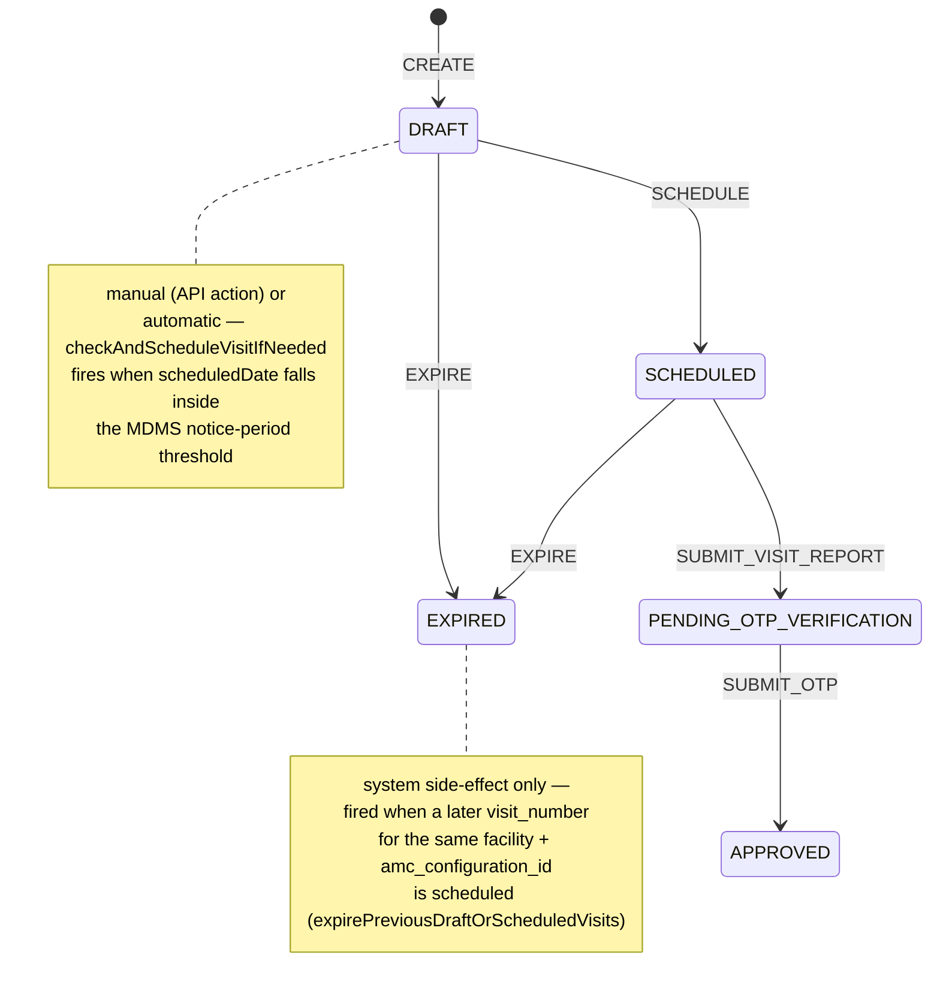
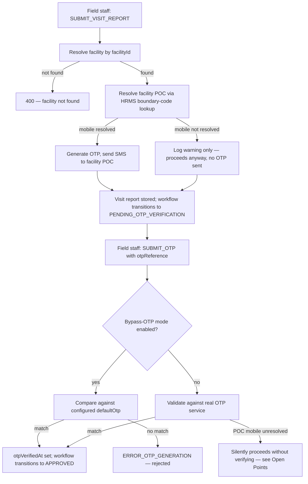

# AMC Module — Business Service (`AMC_VISIT`)

> **Purpose:** Workflow definition for the AMC maintenance-visit lifecycle (`scheduled_visits`) in `egov-workflow-v2`.
>
> **Why this doc exists now:** `LLD_Multiple_AMC_Per_Facility.md` makes a facility's AMC landscape more complex — one facility can now have several sibling `amc_configuration` rows (different projects/vendors), each running its own independent visit stream. §2.6 of that LLD shows today's gap (an asset can end up on two configs at once) cascades into **duplicate, parallel `scheduled_visits` schedules for the same asset** — i.e. the same `AMC_VISIT` state machine running twice for one physical asset with no way to tell which is authoritative. The LLD's Requirement 3 fix (§3.1–§3.4) removes the duplication at the `asset_amc` linking layer; it does **not** change the `AMC_VISIT` state machine itself. This document formalizes that state machine so the "one visit stream per config" invariant the LLD relies on is explicit, and — per Open Points below — because no such formal definition is currently committed anywhere in this repo despite the code already assuming one exists.

**Payload file:** `AMC_VISIT_BUSINESS_SERVICE.json` (same shape as the Livelihood/Assessment business-service defs — `BusinessServices` only)
**Default tenant:** none fixed — deploy per operating tenant (state/ULB), unlike Livelihood's fixed `livelihood` tenant
**Source:** `LLD_Multiple_AMC_Per_Facility.md` §2.1, §2.5, §2.6, §6 + reverse-engineered from `amc-scheduler-service` source (see Open Points — no BusinessService config for `AMC_VISIT` exists in-repo today)
**Service:** `egov-workflow-v2` / `amc-scheduler-service`
**Config referencing this business service:** `egov.workflow.business.service=AMC_VISIT` (`amc-scheduler-service/src/main/resources/application.properties:113`)

---

## Deploy

1. Wrap `AMC_VISIT_BUSINESS_SERVICE.json` in a `RequestInfo` + `BusinessServices` body.
2. POST to workflow for the target tenant:

   `POST /egov-workflow-v2/egov-wf/businessservice/_create?tenantId=<tenant>`

3. Persister topic `save-wf-businessservice` writes to `eg_wf_businessservice_v2`, `eg_wf_state_v2`, `eg_wf_action_v2`.
4. No MDMS `Workflow.AutoEscalation` config exists for `AMC_VISIT` today — see §6 of the LLD ("no proactive notification, pull model only"). If a due-date reminder is added later, model it the same way as `LIVELIHOOD_BUSINESS_SERVICE.md`'s AutoEscalation table.

---

## Scope note: three status fields, only one is a workflow business service

The AMC module has three independent status-bearing entities (per LLD §2.1). Only `scheduled_visits.status` is actually driven by `egov-workflow-v2` — this document covers that one only.

| Entity                  | Status field & values                                              | Governed by `egov-workflow-v2`? | Notes                                                                                                                   |
| ------------------------ | -------------------------------------------------------------------- | -------------------------------- | ------------------------------------------------------------------------------------------------------------------------ |
| `scheduled_visits`      | `DRAFT`, `SCHEDULED`, `EXPIRED`, `APPROVED` (see state machine below) | **Yes — `AMC_VISIT`**     | This document                                                                                                            |
| `amc_configuration`     | `ACTIVE`, `EXPIRED`, `CANCELLED` (`AmcConfiguration.java:30`)      | No                                | Plain field, no audit trail of who/when changed it; validated by `AmcConfigurationValidator` (LLD §3.3), not by workflow |
| `asset_amc`             | `ACTIVE`, `EXPIRED`, `UNDER_MAINTENANCE`, `INACTIVE` (LLD §3.1)     | No                                | Plain field; the LLD's "supersede" reassignment flow (§3.2, §4.3) transitions this at the application level, not via workflow |

---

## Business meaning

- One `scheduled_visits` row is generated per `visit_number` per `amc_configuration_id` (LLD §2.1) — each sibling AMC on a facility runs its own, independent `AMC_VISIT` stream.
- The LLD's Requirement 3 fix does **not** change this state machine. What changes is *how many* `DRAFT` visit rows get created per asset in the first place: today, an asset with overlapping `asset_types` across two active configs can seed **two** parallel `AMC_VISIT` streams for the same physical asset (LLD §2.6, step 5). Once §3.2/§3.4's dedup/exclusion checks land, an asset can only ever be linked to one currently-mapped config, so it can only ever be the subject of one `AMC_VISIT` stream at a time.
- A facility can legitimately have several concurrent `AMC_VISIT` streams running today and after the fix — that was never in question (LLD §2.7: requirements 1/2A/2B already work). What the fix guarantees is that those streams never overlap on the *same asset*.

---

## State machine summary

| State                        | Terminal? | Who acts                          | Meaning                                                                                                    |
| ----------------------------- | --------- | ---------------------------------- | ------------------------------------------------------------------------------------------------------------ |
| *(start / null)*             | No        | System                            | Visit row not yet created                                                                                   |
| `DRAFT`                      | No        | System (auto-generated)          | Visit generated against an `amc_configuration` (bulk on installation-completion or AMC creation); not yet committed to a date |
| `SCHEDULED`                  | No        | AMC field staff / reviewer / cron | A `scheduledDate` is set (≤1 month out); any earlier `DRAFT`/`SCHEDULED` visit for the same facility+config is expired |
| `PENDING_OTP_VERIFICATION`\* | No        | AMC field staff                   | Field staff has submitted the visit report; OTP sent to the facility POC to confirm the visit actually happened |
| `EXPIRED`                    | Yes       | System                            | Superseded by a later visit number for the same facility+config, or otherwise closed out before completion |
| `APPROVED`                   | Yes       | AMC field staff                   | OTP verified — visit confirmed complete                                                                    |

\* Inferred, not confirmed against a live config — see Open Points.

### Process flow

### OTP confirmation sub-flow

---

## Actions by role

| Action                 | Roles                                     | From → To                             | Trigger / validation (from code)                                                                                                                                                                                       |
| ------------------------ | ------------------------------------------ | --------------------------------------- | -------------------------------------------------------------------------------------------------------------------------------------------------------------------------------------------------------------------- |
| `CREATE`               | `SYSTEM_USER`                             | start → `DRAFT`                       | Bulk-generated via `generateScheduledVisits` when an `amc_configuration` is created/assets linked (`AmcConfigurationService.java`) — inserted directly via the "save-scheduled-visit" persister path, not a workflow `_transition` call |
| `SCHEDULE`             | `AMC_STAFF`, `AMC_REVIEWER`, `SYSTEM_USER` | `DRAFT` → `SCHEDULED`                 | Manual: explicit workflow action, only when current status is `DRAFT` (`ScheduledVisitService.java:448-452`); validates `scheduledDate` is set and ≤1 month ahead (`:762-784`). Automatic: `checkAndScheduleVisitIfNeeded` fires the same action when a plain update leaves a `DRAFT` visit's `scheduledDate` inside the MDMS-configured notice period (`amc.AMCThresholds.amc_visit_notice_period_in_days`, `:883-946`) |
| `EXPIRE`               | `SYSTEM_USER`                             | `DRAFT`/`SCHEDULED` → `EXPIRED`       | System side-effect only, from `expirePreviousDraftOrScheduledVisits` (`:790-876`) — fired whenever a later `visit_number` for the same `facilityId` + `amcConfigurationId` gets scheduled. No controller endpoint calls this directly |
| `SUBMIT_VISIT_REPORT` | `AMC_STAFF`                               | `SCHEDULED` → `PENDING_OTP_VERIFICATION`\* | Field staff submits `visitReport`; server resolves the facility POC via HRMS boundary-code lookup and sends an OTP by SMS (`:366-400`). If the POC/mobile can't be resolved, only a warning is logged — the action still proceeds |
| `SUBMIT_OTP`           | `AMC_STAFF`                               | `PENDING_OTP_VERIFICATION` → `APPROVED`\* | Field staff submits the OTP relayed by the facility POC; validated for real or, if `amcServiceConfiguration.isByPassOtpValidation()`, against a configured `defaultOtp` (`:403-446`). Sets `otp­VerifiedAt` on match |

\* State names inferred from side effects and cross-referenced against `AmcConfigurationService.java:346` (`getCompletedVisits` filters `status=APPROVED`) — not read from a committed config. See Open Points.

**Note on status derivation:** in all three code paths that call `transitionWorkflow` (`SCHEDULE`, `EXPIRE`, and the generic `updateVisitWorkflow` handler covering `SUBMIT_VISIT_REPORT`/`SUBMIT_OTP`), the visit's local `status` field is set from the workflow-service response (`updatedWorkflow.getState().getState()`) **after** the call — never hardcoded locally, except one fallback: if the `EXPIRE` transition call throws, `expireVisit` falls back to the local `EXPIRED_STATUS` constant (`:831`) so the visit doesn't get stuck.

---

## Roles to provision (HRMS / org roles)

| Role code       | Actor                                                                                                                                          |
| ---------------- | ------------------------------------------------------------------------------------------------------------------------------------------------ |
| `AMC_STAFF`     | Vendor field staff assigned to the AMC configuration — propagates from `amc_configuration.assignments` into every generated `scheduled_visits` row (`AmcConfigurationService.java:263-268`) |
| `AMC_REVIEWER`  | Reviewer assigned to the AMC configuration — same flat `assignedUser` list as `AMC_STAFF`; deduped if one user holds both roles (`AmcConfigurationService.java:68`) |
| `SYSTEM_USER`   | Service account for `CREATE`, the automatic `SCHEDULE` path, and `EXPIRE`                                                                       |

The facility POC / HRMS employee resolved by boundary code (OTP recipient) is **not** an `egov-workflow-v2` actor — it never calls a workflow action itself, it only supplies the OTP that `AMC_STAFF` submits.

---

## Open points

1. **No `AMC_VISIT` BusinessService JSON is committed anywhere in this repo today**, despite `amc-scheduler-service/application.properties:113` already configuring `egov.workflow.business.service=AMC_VISIT`. This document (and its payload JSON) is the first attempt to formalize it — confirm against whatever config, if any, is actually live in each target environment's `egov-workflow-v2` tables before deploying this JSON over it, since a name mismatch would silently break every `SCHEDULE`/`EXPIRE`/`SUBMIT_*` call.
2. `DRAFT` visits are inserted directly via the Kafka "save-scheduled-visit" persister path during bulk generation, not via a workflow `_create`/first-transition call — confirm `egov-workflow-v2` in this deployment can accept a `SCHEDULE`/`EXPIRE` transition for a `businessId` that never had an initial `ProcessInstance`, or add a bootstrap sync step if not.
3. `AMC_STAFF` and `AMC_REVIEWER` are not distinguished by a role field on `AmcConfigurationAssignment`/`ScheduledVisitAssignment` (flat `assignedUser` list only) — the role-gating above can't actually tell the two apart today. If reviewer-only approval of `SUBMIT_OTP` is ever required, the assignment model needs an explicit role field first.
4. `PENDING_OTP_VERIFICATION` and `APPROVED` are inferred state names, not read from a committed config — verify these (or whatever they're actually called in each environment) before relying on this document for role-gating decisions.
5. `amc_configuration.status` and `asset_amc.status` are plain fields today (see Scope note above), not `egov-workflow-v2` business services — no audit trail of who/when changed them. The LLD's `asset_amc` "supersede" reassignment flow (§3.2, §4.3) is a good candidate for workflow-v2 modeling if audit trail on contract reassignment ever matters; out of scope here, flagged for future consideration.
6. No MDMS `Workflow.AutoEscalation` exists for `AMC_VISIT` — ties to LLD §6 (no proactive due-date reminder for scheduled visits, pull model only). If addressed, model it the same way as `LIVELIHOOD_BUSINESS_SERVICE.md`'s AutoEscalation table.
