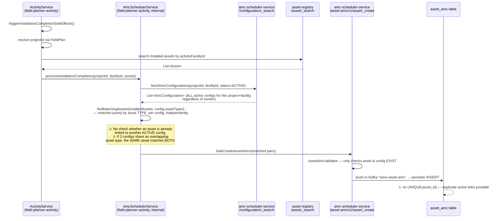
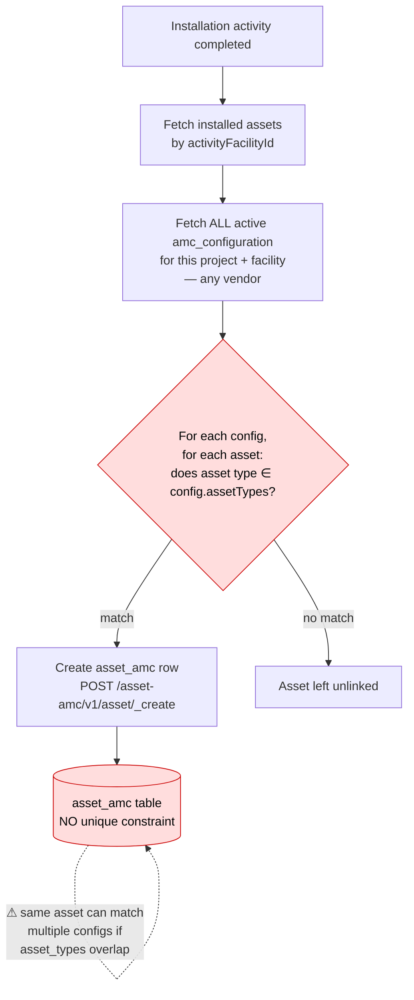
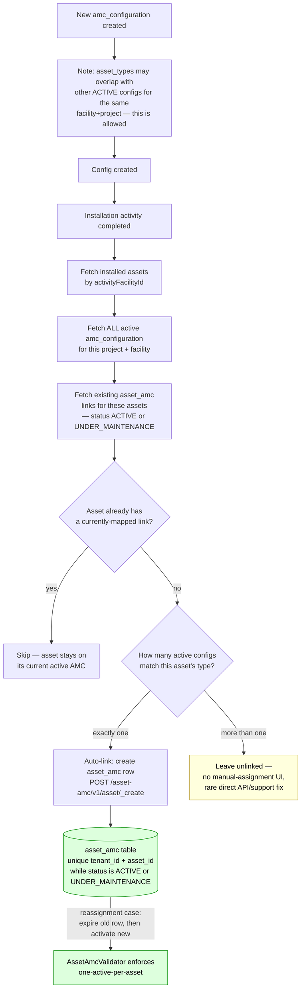
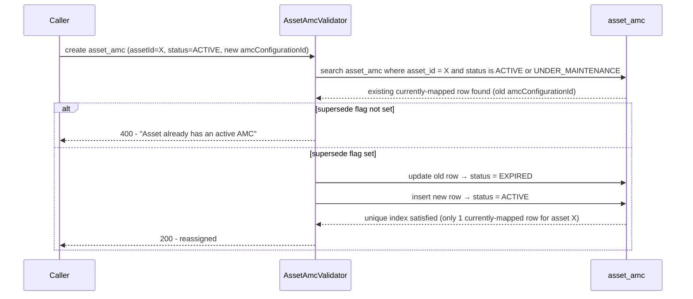
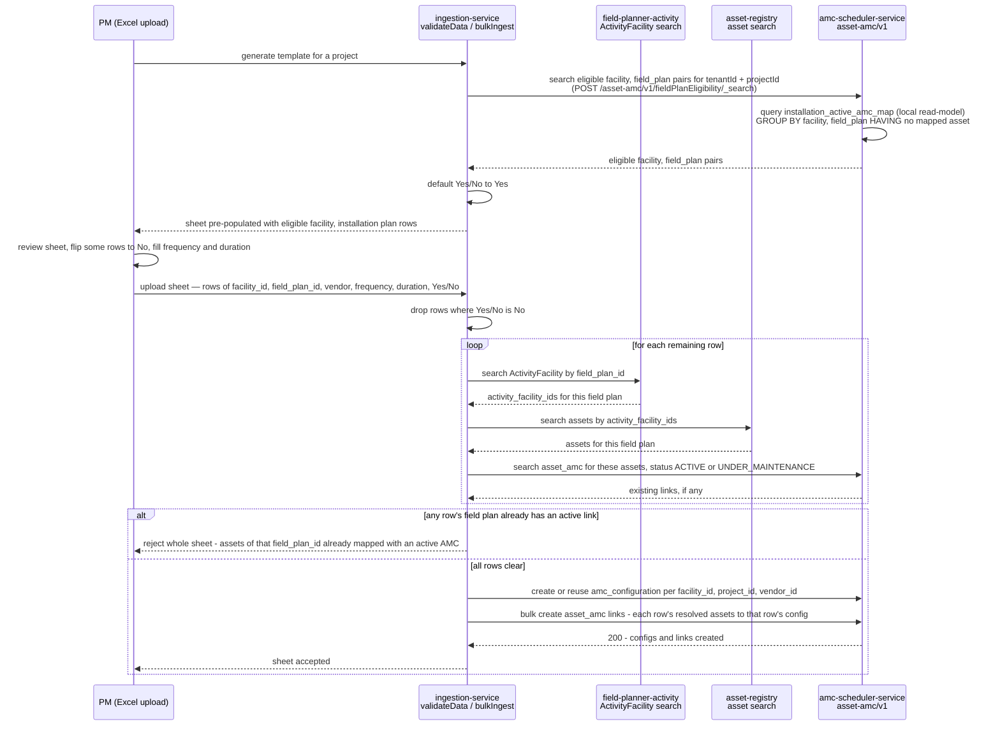
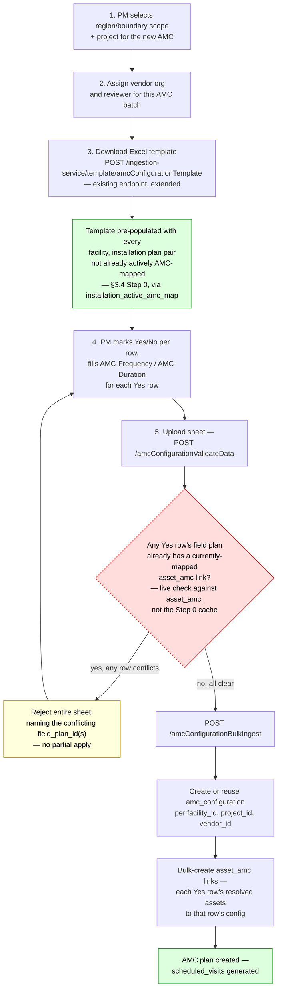

# LLD: Multiple AMCs per Facility (Project/Vendor Flexibility) + Single Active AMC per Asset

## 1. Requirement

1. A single health facility can have multiple AMCs.
2. These AMCs can belong to:
   - **2A.** the same or different **projects**, and
   - **2B.** the same or different **vendors**.
3. An asset can be mapped with **only one active AMC** at a time.
4. A facility's assets can come from **multiple installation batches** (field plans) — bulk AMC-to-facility mapping must identify which specific batch an AMC covers, not just which facility, since "map all of this facility's assets" is no longer unambiguous once a facility can have multiple AMCs and multiple installation batches.

---

## 2. Current Implementation

### 2.1 Domain model recap

| Business term              | Actual entity in code                                                                                                     |
| -------------------------- | ------------------------------------------------------------------------------------------------------------------------- |
| "Installation"             | An`Asset` row (`asset-registry` service, table `asset`)                                                             |
| "Facility"                 | A`Facility` row (`health-facility-registry` service, table `facility`)                                              |
| "AMC"                      | An`amc_configuration` row (`amc-scheduler-service`) — a facility+project+vendor maintenance contract                 |
| "Vendor"                   | An`Organisation` (`vendor-registry` service, table `eg_org`, `org_type='VENDOR'`) — referenced by id only, no FK |
| "Installation ↔ AMC link" | An`asset_amc` row (`amc-scheduler-service`) — join table                                                             |
| "Maintenance visit"        | A`scheduled_visits` row, hanging off one `amc_configuration_id`                                                       |

### 2.2 Entity relationships (current)

```mermaid
erDiagram
    FACILITY ||--o{ ASSET : "has (facility_id)"
    FACILITY ||--o{ AMC_CONFIGURATION : "has (facility_id)"
    PROJECT ||--o{ AMC_CONFIGURATION : "scopes (project_id)"
    VENDOR_ORG ||--o{ AMC_CONFIGURATION : "owns (vendor_id, no FK)"
    AMC_CONFIGURATION ||--o{ ASSET_AMC : "covers"
    ASSET ||--o{ ASSET_AMC : "linked via (asset_id) - NO UNIQUE CONSTRAINT TODAY"
    AMC_CONFIGURATION ||--o{ SCHEDULED_VISITS : "schedules"
    AMC_CONFIGURATION ||--o{ AMC_CONFIGURATION_ASSIGNMENTS : "assigns staff"
    SCHEDULED_VISITS ||--o{ SCHEDULED_VISIT_ASSIGNMENTS : "assigns visit staff"
    SCHEDULED_VISITS ||--o{ VISIT_TRANSACTION : "workflow instance"
    FACILITY ||..o{ INSTALLATION_ACTIVE_AMC_MAP : "synced (facility_id) - no FK, cross-service"
    ASSET ||..o{ INSTALLATION_ACTIVE_AMC_MAP : "synced (asset_id) - no FK, cross-service"
    PROJECT ||..o{ INSTALLATION_ACTIVE_AMC_MAP : "synced (project_id) - no FK, cross-service"
    AMC_CONFIGURATION ||..o{ INSTALLATION_ACTIVE_AMC_MAP : "mirrors (amc_configuration_id, nullable) - no FK"

    FACILITY {
        varchar id PK
    }
    ASSET {
        varchar asset_id PK
        varchar facility_id FK
        varchar activity_facility_id
        varchar asset_type_id
        varchar serial_number
    }
    AMC_CONFIGURATION {
        varchar id PK
        varchar tenant_id
        varchar facility_id FK
        varchar project_id FK
        varchar vendor_id "no FK - cross service"
        jsonb asset_types
        varchar status
    }
    ASSET_AMC {
        varchar id PK
        varchar asset_id FK
        varchar amc_configuration_id FK
        varchar status
    }
    SCHEDULED_VISITS {
        varchar id PK
        varchar amc_configuration_id FK
        int visit_number
        varchar status
    }
    INSTALLATION_ACTIVE_AMC_MAP {
        varchar id PK
        varchar field_plan_id
        varchar tenant_id
        varchar project_id
        varchar field_plan_name
        varchar facility_id
        varchar asset_id
        varchar amc_configuration_id "nullable, default null"
    }

    classDef newTable fill:#050d1f,stroke:#080,stroke-width:2px
    class INSTALLATION_ACTIVE_AMC_MAP newTable
```



### 2.3 Tables and constraints involved

| Table                             | Service                  | Key constraint today                                                                                                                                 |
| --------------------------------- | ------------------------ | ---------------------------------------------------------------------------------------------------------------------------------------------------- |
| `facility`                      | health-facility-registry | PK`id`                                                                                                                                             |
| `asset`                         | asset-registry           | PK`asset_id`; plain (non-unique) index on `(tenant_id, facility_id)`                                                                             |
| `amc_configuration`             | amc-scheduler-service    | PK`id`; **`UNIQUE (tenant_id, facility_id, project_id, vendor_id)`**; FK `facility_id → facility(id)`; FK `project_id → project(id)` |
| `amc_configuration_assignments` | amc-scheduler-service    | PK`id`; `UNIQUE (amc_configuration_id, assigned_user)`; FK → `amc_configuration`                                                              |
| `asset_amc`                     | amc-scheduler-service    | PK`id`; FK `asset_id → asset(asset_id)`; FK `amc_configuration_id → amc_configuration(id)`; **no uniqueness on `asset_id` at all**   |
| `scheduled_visits`              | amc-scheduler-service    | PK`id`; `UNIQUE (amc_configuration_id, visit_number)`; FK → `amc_configuration`, FK → `facility`                                           |
| `scheduled_visit_assignments`   | amc-scheduler-service    | PK`id`; FK → `scheduled_visits` (cascade delete)                                                                                                |
| `visit_transaction`             | amc-scheduler-service    | PK`id`; FK `visit_id → scheduled_visits(id)`                                                                                                    |

### 2.4 APIs involved today

| API                                                                                                                   | Service                | Purpose                                                                                                                                    |
| --------------------------------------------------------------------------------------------------------------------- | ---------------------- | ------------------------------------------------------------------------------------------------------------------------------------------ |
| `POST /asset-amc/v1/configuration/_create`                                                                          | amc-scheduler-service  | Create an`amc_configuration` (facility+project+vendor contract)                                                                          |
| `POST /asset-amc/v1/configuration/_search`                                                                          | amc-scheduler-service  | Search configs, e.g. by`facilityIds`/`projectIds`/`status`                                                                           |
| `POST /asset-amc/v1/asset/_create`                                                                                  | amc-scheduler-service  | Create`asset_amc` link(s) — **the API that maps an asset to an AMC**                                                              |
| `POST /asset-amc/v1/asset/_update`                                                                                  | amc-scheduler-service  | Update an existing`asset_amc` link (e.g. change status)                                                                                  |
| `POST /asset-amc/v1/asset/_search`                                                                                  | amc-scheduler-service  | Search asset-AMC links                                                                                                                     |
| `POST /asset-amc/v1/visit/_create`, `/configuration/_generate`, `/workflow/_update`, `/_search`, `/_update` | amc-scheduler-service  | Scheduled-visit lifecycle, always scoped by`amc_configuration_id`                                                                        |
| `POST /amcConfigurationValidateData`, `POST /amcConfigurationBulkIngest`                                          | ingestion-service      | Excel bulk-create of`amc_configuration` rows only (facility/vendor/frequency/duration columns) — **does not touch `asset_amc`** |
| *(internal, no public API)* `AmcSchedulerService.processInstallationCompletion`                                   | field-planner-activity | Triggered on installation completion; the only caller of`asset-amc/v1/asset/_create` today                                               |

### 2.5 Current end-to-end flow (installation → AMC link)



### 2.6 Worked example — how the gap manifests today

Setup: Facility `FAC-001`, Project `PRJ-SOLAR-A`. One installation activity (`activityFacilityId = ACT-FAC-777`) registers 3 assets:

| asset_id | asset_type_id | activity_facility_id |
| -------- | ------------- | -------------------- |
| AST-01   | INVERTER      | ACT-FAC-777          |
| AST-02   | PANEL         | ACT-FAC-777          |
| AST-03   | BATTERY       | ACT-FAC-777          |

Two active `amc_configuration` rows already exist for `(FAC-001, PRJ-SOLAR-A)`, from two **different vendors**, with **overlapping** `asset_types`:

- `CFG-A` → vendor `IN-0029`, `assetTypes = [INVERTER, PANEL]`
- `CFG-C` → vendor `IN-0050`, `assetTypes = [INVERTER]`

Step-by-step, per the actual code (`AmcSchedulerService.java`):

1. `fetchAmcConfigurations` (lines 95-131) filters only by `projectIds`/`facilityIds`/`status=ACTIVE` — vendor is not part of the filter — so it returns **both** `CFG-A` and `CFG-C` as candidates.
2. The loop at line 146 (`for (config : amcConfigurations)`) calls `findMatchingAssets(installedAssets, configAssetTypes, configId)` (line 155) **independently per config**, passing the **same, unmodified** `installedAssets` list each time — nothing removes an asset from consideration after it matches once.
   - Against `CFG-A` (`[INVERTER, PANEL]`): `AST-01` and `AST-02` match → queued for `asset_amc(AST-01, CFG-A)`, `asset_amc(AST-02, CFG-A)`.
   - Against `CFG-C` (`[INVERTER]`): the **same** `AST-01` is checked again → matches again → queued for `asset_amc(AST-01, CFG-C)`.
3. `bulkCreateAssetAmcs` (line 214) sends the whole accumulated list — including both `AST-01` entries — in one `POST /asset-amc/v1/asset/_create` call. `AssetAmcValidator` only checks that `assetId`/`amcConfigurationId` exist (no active-link check), so both inserts succeed.
4. **Result**: two `asset_amc` rows for `AST-01`, both `status = ACTIVE`, one under vendor `IN-0029`, one under vendor `IN-0050`.
5. **Downstream propagation**: back in `processInstallationCompletion` (line 82), `generateScheduledVisits` runs once per config present in `configToAssetMap` — since `AST-01` produced entries under **both** `CFG-A` and `CFG-C`, it fires for both. Because `scheduled_visits` is keyed by `(amc_configuration_id, visit_number)`, `AST-01` ends up with **two independent, parallel maintenance-visit schedules** — one per vendor — both legitimately scheduled against the same physical inverter, with no error or warning raised anywhere in the flow (only a `log.debug`).

Net effect: `AST-01` is simultaneously "actively maintained" by two vendors under two AMC contracts, and there is no field in the data that says which one is actually responsible. This is not a hypothetical — it is the default, reachable outcome any time two active configs for the same facility+project have overlapping `asset_types`, regardless of vendor.

**Consequence for the fix (ties back to §3.4):** fixing the `asset_amc` matching/validation layer (partial unique index + "already actively linked" exclusion before matching) also eliminates the duplicate-visit-schedule problem as a side effect — `generateScheduledVisits` only acts on whatever `configToAssetMap` the matching step produces, so once an asset can no longer match more than one config, it can no longer get a second parallel visit schedule either. No separate fix is needed in `generateScheduledVisits`/`scheduled_visits` itself.

### 2.7 What already works vs. today's gap

| Requirement                               | Supported today? | Evidence                                                                                                                                                                                                                                                                                                                                      |
| ----------------------------------------- | ---------------- | --------------------------------------------------------------------------------------------------------------------------------------------------------------------------------------------------------------------------------------------------------------------------------------------------------------------------------------------- |
| **1. Facility → multiple AMCs**    | ✅ Yes           | No constraint limits row count per`facility_id` in `amc_configuration`                                                                                                                                                                                                                                                                    |
| **2A. Same/different project**      | ✅ Yes           | Unique key includes`project_id`; two rows differing only in `project_id` are both valid                                                                                                                                                                                                                                                   |
| **2B. Same/different vendor**       | ✅ Yes           | Unique key includes`vendor_id`; two rows differing only in `vendor_id` (same facility+project) are both valid                                                                                                                                                                                                                             |
| **3. Asset → only ONE active AMC** | ❌**No**   | `asset_amc` has no uniqueness on `asset_id`; `AssetAmcValidator` doesn't check existing active links; `findMatchingAssets` can match one asset against multiple configs whose `asset_types` overlap — see worked example in §2.6, which also shows this cascades into duplicate `scheduled_visits` schedules for the same asset |

**Conclusion:** requirements 1 and 2 (2A/2B) already work with **zero changes** — the schema and validators already permit any combination of same/different project and same/different vendor for a facility. The only real gap is **requirement 3**.

### 2.8 Current bulk AMC-ingestion Excel template

The real-world flow for onboarding a facility onto an AMC goes through ingestion-service's bulk upload (`POST /amcConfigurationValidateData` then `POST /amcConfigurationBulkIngest`, `ingestion-service/app/api/endpoints/file_ingestion.py`), not the single `POST /asset-amc/v1/configuration/_create` API directly. The template itself is **not a static file** — it is already dynamically generated today by `POST /ingestion-service/template/amcConfigurationTemplate` (`ingestion-service/app/api/endpoints/template_generation.py:797-1114`, function `get_amc_configuration_template`), wired to the frontend's existing "Download Template" button (`pm/src/pages/employee/CreateAMC.js:130` → `PMService.downloadAMCFacilityDataTemplate` → `pm/src/services/Ingestion.js:103-119`). Given `tenantId`, `boundary_data`, and `project_id`, it already fetches real facilities for that boundary/project via `FacilityServiceClient.bulk_search_facility_with_boundary`, then calls amc-scheduler-service's config search **once per facility** to pre-fill `AMC-Frequency`/`AMC-Duration` for facilities that already have a config (locking those cells), plus a `BoundaryCodes` sheet with dropdown validation. Today's template (`amc-configurations` sheet) has one row per **facility**:

| Column               | Purpose                                   |
| -------------------- | ----------------------------------------- |
| Facility Id          | Target facility                           |
| NIN/HFR ID           | Facility identifier (display/cross-check) |
| BoundaryCode         | Facility's location boundary              |
| Health Facility Name | Display name                              |
| AMC-Frequency        | Visit frequency for this facility's AMC   |
| AMC-Duration         | Contract duration for this facility's AMC |

`vendor_id` and `project_id` are **not** per-row columns — they're supplied once for the **whole upload**: `project_id` is a request `Form` field (`file_ingestion.py:3004`), and the vendor is resolved once via `get_vendor_id_for_amc_field_staff` (`file_ingestion.py:3024`). The ingest handler dedupes `amc_configuration` creation by `config_key = (facility_id, project_id)` (`file_ingestion.py:3238`) — so today's upload model is: one project + one vendor per upload, many facility rows.

Critically, this handler **only creates `amc_configuration` rows** — it never calls the asset-linking API (`POST /asset-amc/v1/asset/_create`). The only code path anywhere that links an asset to an `asset_amc` row is `AmcSchedulerService.processInstallationCompletion` (§2.5), which fires at fresh-installation-completion time and matches purely by `asset_types`. That has worked so far only because a facility historically had at most one AMC to match against — which requirement 1 (multiple AMCs per facility) breaks.

---

## 3. Changes Required (for Requirement 3 only)

### 3.1 Database change

Add a **partial unique index** on `asset_amc` — enforces "at most one *currently-mapped* row per asset," while still allowing historical (`EXPIRED`/`INACTIVE`) rows for the same asset (needed for renewals / vendor reassignment).

`asset_amc.status` has four values: `ACTIVE`, `EXPIRED`, `UNDER_MAINTENANCE`, `INACTIVE`. A predicate of `status = 'ACTIVE'` alone is **not sufficient** — `UNDER_MAINTENANCE` is not a terminal/historical state, it means the asset is still on that AMC, just temporarily paused for servicing, so a row in that status is still a live, current mapping. With an `'ACTIVE'`-only predicate, an asset could hold one `ACTIVE` row under Config A **and** one `UNDER_MAINTENANCE` row under Config B at the same time — two "live" AMCs on the same asset — without ever tripping the constraint, because the `UNDER_MAINTENANCE` row falls outside the index's filtered scope entirely. The predicate must instead cover every non-terminal status:

```sql
CREATE UNIQUE INDEX ux_asset_amc_one_active_per_asset
    ON asset_amc (tenant_id, asset_id)
    WHERE status IN ('ACTIVE', 'UNDER_MAINTENANCE');
```

This is the hard, non-bypassable guarantee. Everything else below is about making the *application* behave correctly and give clear errors well before hitting this constraint.

### 3.2 `AssetAmcValidator` (amc-scheduler-service)

- Before creating a new `asset_amc` with `status = ACTIVE`, query for an existing row for the same `asset_id` with `status IN ('ACTIVE', 'UNDER_MAINTENANCE')` — both count as "currently mapped" per §3.1.
  - If found → reject with a clear validation error (`"Asset already has an active AMC"`), **or**
  - If the intent is reassignment/renewal → require the caller to pass an explicit "supersede" flag, and atomically transition the old row to `EXPIRED`/`INACTIVE` before activating the new one.
- Add this as an explicit check rather than relying solely on the DB constraint, so failures surface as a normal 4xx validation error instead of a raw DB unique-violation.

### 3.3 `AmcConfigurationValidator` (amc-scheduler-service)

- **Sibling AMCs (same facility+project) are allowed to have overlapping `asset_types`.** Two vendors can legitimately be capable of servicing the same asset type at the same facility+project — no validation forces non-overlap. `asset_types` is descriptive metadata (contract scope, used for the frontend label in §3.6) — it is **not** used to decide which asset goes to which config anymore; that's resolved unambiguously by the `field_plan_id`-scoped linking in §3.4.
- **Existing gap found — no duplicate-tuple check at the application layer.** `AmcConfigurationValidator.validateAmcConfigurationRequest` (`AmcConfigurationValidator.java:75-165`) validates project existence, facility existence, mandatory fields, and date ranges — but it never checks whether a config already exists for the same `(facilityId, projectId, vendorId)` tuple before inserting. The **only** thing preventing a true duplicate today is the DB-level unique index `ux_amc_configuration_unique_installation`, so a duplicate submission currently fails as a raw DB constraint-violation error rather than a clean 4xx validation error. Recommended addition: an explicit pre-check (query existing configs for that tuple, same pattern as the facility/project existence checks already in this method) so this fails gracefully with a clean 4xx instead.

### 3.4 Field-plan-scoped linking (new — primary mechanism) + `processInstallationCompletion` (legacy fallback)

**New primary mechanism — `field_plan_id`-scoped linking via the bulk-ingestion Excel.** The `amc-configurations` sheet gains three columns — **Installation Plan Name**, **Assets**, and **Yes/No** — and now has **one row per (facility, installation plan)** instead of one row per facility (matching the updated `amc_configuration_template_*.xlsx`). "Installation Plan Name" is the display form of `field_plan_id` (`field_plans.name`); "Assets" is an informational list of that plan's installed asset types; "Yes/No" is a per-row include flag the PM can flip before uploading. This directly states which installed batch of assets a given AMC covers — the exact ambiguity that asset-type matching (below) can't resolve once a facility can have multiple AMCs and multiple installation batches.

- **Step 0 — Pre-populate the sheet (extend the existing template endpoint, not a new one).** The existing `POST /ingestion-service/template/amcConfigurationTemplate` (§2.8) already dynamically generates this sheet per `(tenantId, boundary_data, project_id)` and already pre-fills `AMC-Frequency`/`AMC-Duration` from any existing config — that part is unchanged. What's missing is granularity: today it emits one row per **facility**; it needs to emit one row per **(facility, installation plan)**. This requires: (a) a new eligibility lookup (below) it calls in addition to its existing per-facility config search, to enumerate `(facility, field_plan)` pairs not already covered by an active AMC; (b) new `Installation Plan Name`/`Assets`/`Yes/No` columns, `Yes` pre-checked on every row (since each one already passed the exclusion filter). The PM's only job is to review, flip specific rows to `No` if they want to hold them back, and fill in `AMC-Frequency`/`AMC-Duration`.
  - **Why this can't be one live SQL query.** `facility_activities`/`field_plans` (field-planner-activity), `asset` (asset-registry), and `asset_amc` (amc-scheduler-service) each live in their own service's database — confirmed by their separate Flyway migration folders and datasource configs (`field-planner-activity` even runs on a distinct host/port from the other two). Postgres can't join across separate databases in one statement, so resolving eligibility live would mean three sequential cross-service calls per generation request: field-planner-activity (candidate facility/field-plan pairs) → asset-registry (their assets) → amc-scheduler-service (existing active links). Two of those three are genuinely batchable (amc-scheduler-service's `asset_amc` search already takes a list of `assetIds`; the facility service has a `POST /_bulk-search` for many `facilityIds` in one call), but asset-registry's asset search only accepts a single `activityFacilityId` per call — no batched variant — so a live per-request version doesn't scale cleanly with project size.
  - **Backing table (new) — `installation_active_amc_map`, owned by amc-scheduler-service.** Rather than resolving eligibility live on every generation request, a small read-model table pre-joins the identity data locally and is queried directly:

    | Column                   | Source                          | Notes                                                                                                                     |
    | ------------------------ | ------------------------------- | ------------------------------------------------------------------------------------------------------------------------- |
    | `id`                   | —                              | PK                                                                                                                        |
    | `tenant_id`            | field-planner-activity          |                                                                                                                           |
    | `project_id`           | field-planner-activity          | via`field_plans.project_id`                                                                                             |
    | `field_plan_id`        | field-planner-activity          |                                                                                                                           |
    | `field_plan_name`      | field-planner-activity          | denormalized`field_plans.name`, display only                                                                            |
    | `facility_id`          | field-planner-activity          | via`facility_activities.facility_id`                                                                                    |
    | `asset_id`             | asset-registry                  | via`facility_activities.id = asset.activity_facility_id`; one row per asset                                             |
    | `asset_details`        | asset-registry                  | denormalized asset metadata (e.g. asset code/type summary) for display and troubleshooting                                |
    | `amc_configuration_id` | amc-scheduler-service, nullable | set when the asset is currently mapped in`asset_amc` (`status IN ('ACTIVE','UNDER_MAINTENANCE')`); `NULL` otherwise |

    Owned by **amc-scheduler-service** specifically — it already has Flyway migrations and owns `asset_amc`/`amc_configuration` (ingestion-service, by contrast, has no ORM models or migration tooling today, and the column that most needs to stay fresh, `amc_configuration_id`, is amc-scheduler-service's own data). Indexes: unique on `asset_id` (one row per asset; upsert target for sync); composite `(tenant_id, project_id, field_plan_id)` for the read query below.
  - **Sync.** The identity columns (`field_plan_id`/`field_plan_name`/`facility_id`/`asset_id`/`tenant_id`/`project_id`) are static once an asset is installed, so a periodic job (or a listener on installation-completion) pulls new rows from field-planner-activity + asset-registry. `amc_configuration_id` is local data, so it's kept live in the same write path as `asset_amc` (e.g. alongside the existing Kafka "save-asset-amc" persister flow from §2.5) rather than on a sync delay — this is the one column where staleness would actually matter for correctness.
  - **Read query**, exposed to ingestion-service via a new search API on amc-scheduler-service (e.g. `POST /asset-amc/v1/fieldPlanEligibility/_search`):

    ```sql
    SELECT facility_id, field_plan_id, field_plan_name
    FROM installation_active_amc_map
    WHERE tenant_id = :tenantId AND project_id = :projectId
    GROUP BY facility_id, field_plan_id, field_plan_name
    HAVING COUNT(*) FILTER (WHERE amc_configuration_id IS NOT NULL) = 0
    ORDER BY facility_id, field_plan_name;
    ```

    A field plan is eligible only when none of its assets are currently mapped — this `GROUP BY … HAVING` is the local-table equivalent of the earlier anti-join. With the composite index above, this is a single indexed aggregate query bounded by one project's asset count (realistically thousands, not millions) — well within what a synchronous "Generate Template" click needs. This replaces the three sequential cross-service calls above with one local query plus a single HTTP call from ingestion-service.

    The remaining display columns are still filled from services this table doesn't cover: `NIN/HFR ID`/`BoundaryCode`/`Health Facility Name` from the facility service — via its `POST /_bulk-search` endpoint (one call for all distinct `facility_id`s, not one call per facility) — and `Assets` from MDMS, via its existing bulk-fetch-all-then-filter-locally pattern (not a call per `asset_type_id`).
  - **This table is a read-only optimization for Step 0 only.** The validation and ingest steps below still query `asset_amc` live, not this cache — they need to catch the race window between template generation and upload (see the `FP-101` worked example below), and any sync lag on this table would reopen exactly that race.
  - **Round-trip note:** since this row is machine-generated, don't rely on re-parsing `Installation Plan Name` text back to a `field_plan_id` at upload time (`field_plans.name` has no uniqueness constraint — two plans could share a display name). Recommended: carry `field_plan_id` in a hidden column on the generated sheet (the workbook already hides a sheet, `_DropdownValues`, for similar plumbing) so validation/ingest resolve it directly instead of re-deriving it from `(facility_id, installation_plan_name)`. Flagging as an implementation detail, not deciding it here.
- **Validation step** — extends `POST /amcConfigurationValidateData`. Skip rows where `Yes/No = No` entirely — not validated, not ingested. For every remaining row: resolve the field plan's installed assets via `asset.activity_facility_id → facility_activities.id` where `facility_activities.field_plan_id = row.field_plan_id` (the join path is `ActivityFacility.fieldPlanId`, confirmed live in `ActivityService.triggerInstallationCompletionSideEffects`), then check whether any of them already has a currently-mapped `asset_amc` row (`status IN ('ACTIVE','UNDER_MAINTENANCE')`, per §3.1/§3.2). If **any** row's field plan already has mapped assets, reject the **entire sheet** up front, naming the offending id(s) — e.g. `"assets of field_plan_id FP-101 is already mapped with an active AMC"` — so a conflict on a later row can't leave earlier rows partially applied. This should be rare given Step 0 already filtered for it — it catches the case where another upload claimed that field plan in the gap between generating the sheet and uploading it.
- **Ingest step** — extends `POST /amcConfigurationBulkIngest`. Same `Yes/No` skip as above. After creating/reusing the `amc_configuration` for `(facility_id, project_id, vendor_id)` — unchanged `config_key` logic from §2.8 — resolve each row's `field_plan_id` to its assets via the same join, and bulk-create `asset_amc` links from exactly those assets to that config. Two rows for the same facility with different `field_plan_id`s under the same project simply contribute two separate asset batches to the one shared `amc_configuration`.
- **Resolved for Step 0, still open for validation/ingest.** Step 0's resolution runs in amc-scheduler-service, against the `installation_active_amc_map` read-model above — decided. Still open: should the validation/ingest steps' field-plan → asset resolution and active-link check run in ingestion-service (Python — would need live calls into field-planner-activity and asset-registry), or should `field_plan_id` be passed through the existing `_create`/`_search` payloads and have amc-scheduler-service (Java) do the resolution + link there too, since that's where `asset_amc`/`AssetAmcValidator` already live? Not decided here.

**Worked example.** Facility `FAC-001` has two installation batches: `FP-101` (Project Solar-A → assets `AST-01` inverter, `AST-02` panel) and `FP-202` (Project Solar-B → asset `AST-03` battery).
0. PM generates the template for Project Solar-A: Step 0's query finds `AST-01`/`AST-02` have no active link → sheet comes back with one row, `facility=FAC-001, plan=FP-101, Yes/No=Yes`. (Solar-B's `FP-202` doesn't appear here — different project.)

1. Upload 1 (vendor `V1`, row `facility=FAC-001, field_plan_id=FP-101, Yes`): no existing active link for `AST-01`/`AST-02` → sheet accepted → `amc_configuration` created for `(FAC-001, Solar-A, V1)` → `AST-01`, `AST-02` linked to it. `AST-03` untouched.
2. Upload 2 (vendor `V2`, row `facility=FAC-001, field_plan_id=FP-202, Yes`, generated separately for Project Solar-B): no existing active link for `AST-03` → sheet accepted → second `amc_configuration` created for `(FAC-001, Solar-B, V2)` → `AST-03` linked to it. `FAC-001` now legitimately has two active AMCs, each owning a distinct, non-overlapping asset batch.
3. A later template generation for Solar-A would no longer offer `FP-101` at all (Step 0 excludes it). If someone bypassed generation and hand-crafted a row `facility=FAC-001, field_plan_id=FP-101, Yes` anyway: `AST-01`/`AST-02` are already actively linked → **entire sheet rejected**: `"assets of field_plan_id FP-101 is already mapped with an active AMC"`.

**Legacy fallback — `AmcSchedulerService.processInstallationCompletion` / `findMatchingAssets` (field-planner-activity).** This is today's *only* asset-linking mechanism (§2.5): it matches a newly-installed asset against active configs purely by `asset_types`, blind to field plan or vendor. Once the `field_plan_id`-scoped flow above is in place, this path is redundant for any facility onboarded via the bulk Excel — but it can't be deleted outright while the single (non-bulk) `POST /asset-amc/v1/configuration/_create` API still exists with no `field_plan_id` concept at all. Recommended: keep this path only as a fallback for that single-create case, with the same defensive tightening regardless of which path created the config:

- Before matching, **exclude assets that already have a currently-mapped `asset_amc` link** (search `/asset-amc/v1/asset/_search` filtered by `assetIds` + `status=ACTIVE,UNDER_MAINTENANCE`).
- Auto-link only when exactly one active config matches an asset's type; when zero match or more than one match, leave the asset unlinked rather than guessing — there is no manual-assignment UI (§7.6) to resolve this, so it's a rare, direct API/support fix if it ever comes up.
- **Bonus effect (see worked example in §2.6):** this same tightening also stops `generateScheduledVisits` from creating duplicate, parallel visit schedules for one asset across two configs — visit generation only runs against whatever `configToAssetMap` the (now de-duplicated) matching step produces, so no separate change is needed in `generateScheduledVisits`/`scheduled_visits`.

### 3.5 Ingestion-service (`bulk_ingest_amc_configurations`)

- **Required for requirement 3/4:** the new template-generation endpoint (Step 0), the `Installation Plan Name`/`Assets`/`Yes/No` columns, and the validation/ingest changes described in §3.4.
- **Optional/related** — not required for requirement 3 itself, but relevant if bulk AMC creation across multiple vendors/projects per facility is done concurrently: per-row vendor/project instead of one-per-request (removes today's hard error on >1 vendor per batch), and duplicate-check key updated to `(facility_id, project_id, vendor_id)`. Note `project_id` could in principle be derived per-row from `field_plan_id` (via `facility_activities.field_plan_id → field_plans.project_id`) instead of staying a whole-upload form field, but `vendor_id` has no equivalent derivation and would still need to be explicit per row.
- These changes make it easier to legitimately create the multiple sibling AMCs (different vendors/projects) that §3.4's `field_plan_id`-scoped linking then attaches to the correct installation batch.

### 3.6 Frontend

- `AMCTable` (fa module) already renders one row per config and will display multiple AMCs per facility with no change — but since two sibling AMCs can now share the same vendor name and project, add a distinguishing label (e.g., covered asset types, or a short config code/name) so a user can tell rows apart.
- AMC bulk-ingestion upload UI: the existing "Download Template" button (`CreateAMC.js`) already calls the dynamic template endpoint — no new button/action needed. Only the returned sheet's content changes (eligible `(facility, installation plan)` rows, `Yes` pre-checked, per §3.4 Step 0); the PM reviews, flips rows to `No` as needed, fills in frequency/duration, then uploads as today. Also surface the new §3.4 validation error — naming the conflicting `field_plan_id` — returned from `/amcConfigurationValidateData`.
- No change needed for asset-to-AMC linking screens beyond the above — that mapping remains fully backend/automatic; there is no manual UI for it today (confirmed) and none is being added — `field_plan_id`-scoped ingestion (§3.4) makes it unnecessary (see §7).

---

## 4. Flow Diagrams

### 4.1 Existing flow (current behaviour — gap highlighted)



### 4.2 Fallback flow — type-based auto-matching (legacy path, kept for non-bulk config creation)

Per §3.4, this path now only applies to configs created via the single, non-bulk `POST /asset-amc/v1/configuration/_create` API. The primary mechanism for bulk-ingested AMCs is §4.4 below.



### 4.3 Reassignment / renewal sub-flow (new)



### 4.4 Primary flow — sheet pre-population + field-plan-scoped bulk ingestion (new)



### 4.5 Proposed approach — end-to-end AMC creation workflow (PM/admin view)

The PM/admin-facing view of §4.4's flow: same underlying mechanism, presented as the five steps a person actually walks through, from picking a scope down to the plan being created.



---

## 5. Summary of Changes by Component

| Component                                                                                       | Change needed?   | What                                                                                                                                                                                                                                |
| ----------------------------------------------------------------------------------------------- | ---------------- | ----------------------------------------------------------------------------------------------------------------------------------------------------------------------------------------------------------------------------------- |
| `amc_configuration` schema                                                                    | No               | Already supports 1/2A/2B                                                                                                                                                                                                            |
| `asset_amc` schema                                                                            | **Yes**    | Add partial unique index`(tenant_id, asset_id) WHERE status IN ('ACTIVE','UNDER_MAINTENANCE')`                                                                                                                                    |
| `AssetAmcValidator`                                                                           | **Yes**    | Reject/handle-supersede when an active link already exists for the asset                                                                                                                                                            |
| `AmcConfigurationValidator`                                                                   | **Yes**    | Add pre-check for duplicate`(facilityId, projectId, vendorId)` tuple so it fails as a clean 4xx instead of a raw DB constraint error (no restriction on overlapping `asset_types` — that's allowed)                            |
| Ingestion-service — template pre-population (extend existing `amcConfigurationTemplate` endpoint) | **Yes**    | Existing endpoint (already dynamic, not static) additionally calls the new eligibility query (§3.4 Step 0) and returns the sheet pre-filled with`(facility, installation plan)` rows not already actively AMC-mapped, `Yes` pre-checked                           |
| Ingestion-service —`field_plan_id`-scoped linking (new, primary)                             | **Yes**    | `Installation Plan Name`/`Assets`/`Yes/No` columns + one-row-per-(facility, field_plan_id) semantics; validate and link exactly that batch's assets, skipping `No` rows (§3.4/§3.5)                                       |
| `AmcSchedulerService.processInstallationCompletion` (field-planner-activity, legacy fallback) | **Yes**    | Exclude assets already actively linked before matching; auto-link only when exactly one candidate config matches, else leave unlinked (no manual-assignment UI). Only exercised for configs created via the non-bulk`_create` API |
| `asset-amc/v1/asset/_create` API contract                                                     | No               | Payload shape unchanged; only server-side validation added                                                                                                                                                                          |
| Ingestion-service — multi-vendor/project per batch                                             | Optional/related | Needed only if bulk-creating many sibling AMCs (different vendors/projects) per facility concurrently                                                                                                                               |
| Frontend`AMCTable`                                                                            | Minor            | Add a label to distinguish sibling AMCs sharing vendor/project                                                                                                                                                                      |
| Frontend bulk-ingestion upload UI                                                               | Minor    | No new action needed — existing "Download Template" button already calls the (extended) dynamic endpoint; only need to surface the new field-plan-conflict rejection error from validation                                                                         |
| Frontend asset-AMC linking UI                                                                   | None             | No manual assignment screen —`field_plan_id`-scoped ingestion (§3.4) resolves linking; §7's screens are visibility-only                                                                                                        |

---

## 6. Related finding: how a vendor currently learns a maintenance visit is due

Separate from the multi-AMC gap above, this is worth flagging for planning purposes since it affects whether AMCs (however many exist per facility) actually get serviced on time.

**There is no proactive notification today — it is a pull model only.** A vendor's field staff must log in and browse a list; nothing alerts them that a visit is due.

- `scheduled_visits` rows are generated in `DRAFT` state with a `scheduled_date`, but no notification fires when that date approaches or passes.
- The frontend `amc` module's visit list (`VisitTable.js` / `useVisit.js`) is **project-scoped only** — there is no "My Visits" / "Due Today" view filtered by assigned user or date; a vendor must navigate into a project and manually scan/filter the list.
- SMS integration exists (`ScheduledVisitService.sendOtpSms`), but it is used only to send an OTP when **completing** a visit — not as a due-date reminder.
- An email topic also exists but is wired for user/account-creation emails, not visit reminders.
- There is no cron job or scheduled task anywhere in `amc-scheduler-service`/`field-planner-activity` that sweeps for upcoming/overdue visits. A method (`checkAndScheduleVisitIfNeeded`) whose comment claims "automatically scheduled by daily cron job" is actually only invoked synchronously as a side effect when someone else's API call happens to touch that visit — not on any real timer.

**Implication:** on-time servicing currently depends entirely on someone manually checking the visit list, regardless of how the multi-AMC changes above are implemented. If reliable maintenance turnaround matters, this would need its own separate initiative (e.g., a scheduled job + SMS/push reminder to the assigned vendor staff as a visit's due date approaches).

---

## 7. Proposed UI: Multi-Persona Visibility Screens

**No manual AMC-to-asset assignment screen is needed.** With `field_plan_id`-scoped bulk-ingestion linking (§3.4) as the primary mechanism, every asset's target AMC is identified exactly — by which installed batch it came from — with no ambiguity for a human to resolve. The screens below are therefore purely **visibility** screens (vendor/field-staff/facility-staff views into AMCs, assets, and visits that already exist), not assignment tooling.

For the legacy fallback path only (configs created via the single, non-bulk `_create` API, per §3.4) — where type-based auto-matching can still occasionally find more than one candidate config for an asset — there is no self-service UI to resolve that. The asset is simply left unlinked, same as the zero-match case today; resolving it (if it ever comes up) is a direct API/support action, not a screen a PM uses day-to-day.

### 7.1 Screen 1 — Vendor "My AMCs" view

- **Net new.** No such screen exists anywhere today — the only vendor-related screen is `VendorOrgTable.js` in the `org` module, a generic organisation admin table (name/status/contact) with no AMC or asset linkage at all.
- Shows: `amc_configuration` rows where `vendorId` = the logged-in vendor org, and the assets linked to each (via `asset_amc`).

### 7.2 Screen 2 — Field staff "my assigned AMCs/assets" (mobile)

- **No separate mobile app exists.** Confirmed: no `react-native` dependency anywhere in the repo; "mobile" today means the same responsive web `amc` module opened in a phone browser.
- Needs a view filtered to AMCs/visits where the logged-in user appears in `amc_configuration_assignments` / `scheduled_visit_assignments` — this filter does not exist today (`useVisit.js` only filters by `projectIds`/`tenantId`/`statuses`, no `assignedUser`).

### 7.3 Screen 3 — Vendor & field-staff maintenance calendars

- **Net new.** No calendar (month/week grid) view is used anywhere in the app's modules today — only tables (`VisitTable.js`). A generic, unused `EventCalendarView` component exists in the shared component library but isn't wired into any module.
- Vendor calendar: all `scheduled_visits` across that vendor's AMCs.
- Field staff calendar: `scheduled_visits` filtered to visits assigned to that user — needs the same `assignedUser` filter as §7.2.

### 7.4 Screen 4 — Facility staff calendar (assets + servicing vendor)

- **Net new.** The `fa`/`qc` modules today only show tables (`AMCTable`, and a single `mappedVendorName` string in `useFacilityDetails.js`) — no calendar view.
- Shows: `scheduled_visits` for that facility's assets, each annotated with the vendor from the asset's currently-linked `amc_configuration`.

### 7.5 Net-new vs. reuse summary

| Screen                                    | Status                                                                                                |
| ----------------------------------------- | ----------------------------------------------------------------------------------------------------- |
| Vendor: "my AMCs + assets under each"     | Net new — no vendor-facing AMC/asset screen exists at all                                            |
| Field staff "assigned AMCs/assets"        | Net new screen; no separate mobile app — same responsive web app; needs a new`assignedUser` filter |
| Vendor maintenance calendar               | Net new — no calendar view exists anywhere, only tables                                              |
| Field staff calendar (assigned only)      | Net new — same reason, plus needs the`assignedUser` filter from above                              |
| Facility staff calendar (assets + vendor) | Net new —`fa`/`qc` modules are table-only today                                                  |

### 7.6 Resolved decisions

1. `field_plan_id`-scoped linking via bulk Excel ingestion (§3.4) is the **primary** asset-to-AMC resolution mechanism, and identifies the exact installed batch an AMC covers with no ambiguity.
2. No manual AMC-to-asset assignment screen is built. Type-based auto-matching (§3.4 legacy path) still auto-links when unambiguous (exactly one candidate config); an ambiguous or zero match is simply left unlinked, with no dedicated UI to resolve it.
3. §7's screens are all visibility-only (vendor/field-staff/facility-staff views), not assignment tooling.
