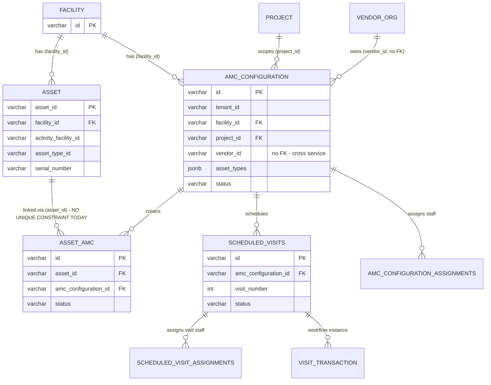
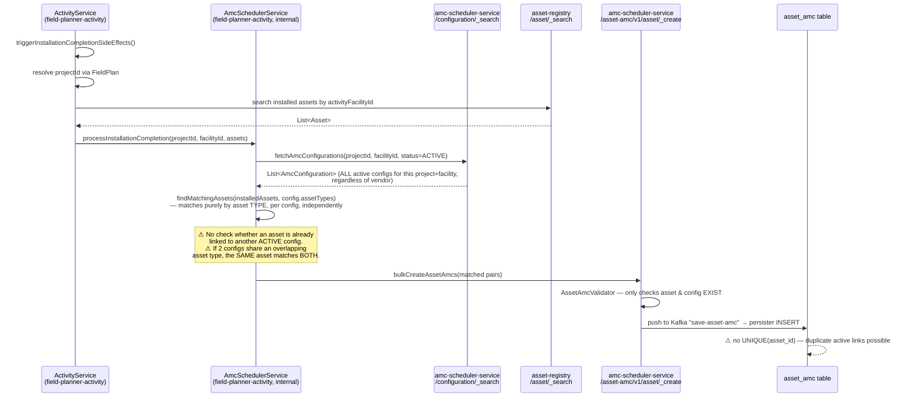
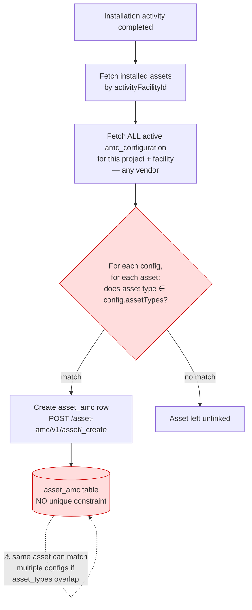
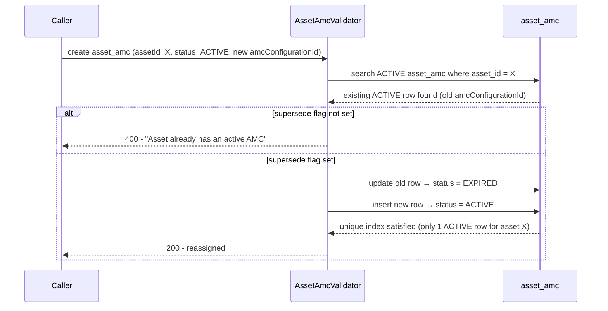

# LLD: Multiple AMCs per Facility (Project/Vendor Flexibility) + Single Active AMC per Asset

## 1. Requirement

1. A single health facility can have multiple AMCs.
2. These AMCs can belong to:
   - **2A.** the same or different **projects**, and
   - **2B.** the same or different **vendors**.
3. An asset can be mapped with **only one active AMC** at a time.

---

## 2. Current Implementation

### 2.1 Domain model recap

| Business term | Actual entity in code |
|---|---|
| "Installation" | An `Asset` row (`asset-registry` service, table `asset`) |
| "Facility" | A `Facility` row (`health-facility-registry` service, table `facility`) |
| "AMC" | An `amc_configuration` row (`amc-scheduler-service`) — a facility+project+vendor maintenance contract |
| "Vendor" | An `Organisation` (`vendor-registry` service, table `eg_org`, `org_type='VENDOR'`) — referenced by id only, no FK |
| "Installation ↔ AMC link" | An `asset_amc` row (`amc-scheduler-service`) — join table |
| "Maintenance visit" | A `scheduled_visits` row, hanging off one `amc_configuration_id` |

### 2.2 Entity relationships (current)



### 2.3 Tables and constraints involved

| Table | Service | Key constraint today |
|---|---|---|
| `facility` | health-facility-registry | PK `id` |
| `asset` | asset-registry | PK `asset_id`; plain (non-unique) index on `(tenant_id, facility_id)` |
| `amc_configuration` | amc-scheduler-service | PK `id`; **`UNIQUE (tenant_id, facility_id, project_id, vendor_id)`**; FK `facility_id → facility(id)`; FK `project_id → project(id)` |
| `amc_configuration_assignments` | amc-scheduler-service | PK `id`; `UNIQUE (amc_configuration_id, assigned_user)`; FK → `amc_configuration` |
| `asset_amc` | amc-scheduler-service | PK `id`; FK `asset_id → asset(asset_id)`; FK `amc_configuration_id → amc_configuration(id)`; **no uniqueness on `asset_id` at all** |
| `scheduled_visits` | amc-scheduler-service | PK `id`; `UNIQUE (amc_configuration_id, visit_number)`; FK → `amc_configuration`, FK → `facility` |
| `scheduled_visit_assignments` | amc-scheduler-service | PK `id`; FK → `scheduled_visits` (cascade delete) |
| `visit_transaction` | amc-scheduler-service | PK `id`; FK `visit_id → scheduled_visits(id)` |

### 2.4 APIs involved today

| API | Service | Purpose |
|---|---|---|
| `POST /asset-amc/v1/configuration/_create` | amc-scheduler-service | Create an `amc_configuration` (facility+project+vendor contract) |
| `POST /asset-amc/v1/configuration/_search` | amc-scheduler-service | Search configs, e.g. by `facilityIds`/`projectIds`/`status` |
| `POST /asset-amc/v1/asset/_create` | amc-scheduler-service | Create `asset_amc` link(s) — **the API that maps an asset to an AMC** |
| `POST /asset-amc/v1/asset/_update` | amc-scheduler-service | Update an existing `asset_amc` link (e.g. change status) |
| `POST /asset-amc/v1/asset/_search` | amc-scheduler-service | Search asset-AMC links |
| `POST /asset-amc/v1/visit/_create`, `/configuration/_generate`, `/workflow/_update`, `/_search`, `/_update` | amc-scheduler-service | Scheduled-visit lifecycle, always scoped by `amc_configuration_id` |
| `POST /amcConfigurationValidateData`, `POST /amcConfigurationBulkIngest` | ingestion-service | Excel bulk-create of `amc_configuration` rows only (facility/vendor/frequency/duration columns) — **does not touch `asset_amc`** |
| *(internal, no public API)* `AmcSchedulerService.processInstallationCompletion` | field-planner-activity | Triggered on installation completion; the only caller of `asset-amc/v1/asset/_create` today |

### 2.5 Current end-to-end flow (installation → AMC link)



### 2.6 Worked example — how the gap manifests today

Setup: Facility `FAC-001`, Project `PRJ-SOLAR-A`. One installation activity (`activityFacilityId = ACT-FAC-777`) registers 3 assets:

| asset_id | asset_type_id | activity_facility_id |
|---|---|---|
| AST-01 | INVERTER | ACT-FAC-777 |
| AST-02 | PANEL | ACT-FAC-777 |
| AST-03 | BATTERY | ACT-FAC-777 |

Two active `amc_configuration` rows already exist for `(FAC-001, PRJ-SOLAR-A)`, from two **different vendors**, with **overlapping** `asset_types`:

- `CFG-A` → vendor `IN-0029`, `assetTypes = [INVERTER, PANEL]`
- `CFG-C` → vendor `IN-0050`, `assetTypes = [INVERTER]`

Step-by-step, per the actual code (`AmcSchedulerService.java`):

1. `fetchAmcConfigurations` (lines 95-131) filters only by `projectIds`/`facilityIds`/`status=ACTIVE` — vendor is not part of the filter — so it returns **both** `CFG-A` and `CFG-C` as candidates.
2. The loop at line 146 (`for (config : amcConfigurations)`) calls `findMatchingAssets(installedAssets, configAssetTypes, configId)` (line 155) **independently per config**, passing the **same, unmodified** `installedAssets` list each time — nothing removes an asset from consideration after it matches once.
   - Against `CFG-A` (`[INVERTER, PANEL]`): `AST-01` and `AST-02` match → queued for `asset_amc(AST-01, CFG-A)`, `asset_amc(AST-02, CFG-A)`.
   - Against `CFG-C` (`[INVERTER]`): the **same** `AST-01` is checked again → matches again → queued for `asset_amc(AST-01, CFG-C)`.
3. `bulkCreateAssetAmcs` (line 214) sends the whole accumulated list — including both `AST-01` entries — in one `POST /asset-amc/v1/asset/_create` call. `AssetAmcValidator` only checks that `assetId`/`amcConfigurationId` exist (no active-link check), so both inserts succeed.
4. **Result**: two `asset_amc` rows for `AST-01`, both `status = ACTIVE`, one under vendor `IN-0029`, one under vendor `IN-0050`.
5. **Downstream propagation**: back in `processInstallationCompletion` (line 82), `generateScheduledVisits` runs once per config present in `configToAssetMap` — since `AST-01` produced entries under **both** `CFG-A` and `CFG-C`, it fires for both. Because `scheduled_visits` is keyed by `(amc_configuration_id, visit_number)`, `AST-01` ends up with **two independent, parallel maintenance-visit schedules** — one per vendor — both legitimately scheduled against the same physical inverter, with no error or warning raised anywhere in the flow (only a `log.debug`).

Net effect: `AST-01` is simultaneously "actively maintained" by two vendors under two AMC contracts, and there is no field in the data that says which one is actually responsible. This is not a hypothetical — it is the default, reachable outcome any time two active configs for the same facility+project have overlapping `asset_types`, regardless of vendor.

**Consequence for the fix (ties back to §3.4):** fixing the `asset_amc` matching/validation layer (partial unique index + "already actively linked" exclusion before matching) also eliminates the duplicate-visit-schedule problem as a side effect — `generateScheduledVisits` only acts on whatever `configToAssetMap` the matching step produces, so once an asset can no longer match more than one config, it can no longer get a second parallel visit schedule either. No separate fix is needed in `generateScheduledVisits`/`scheduled_visits` itself.

### 2.7 What already works vs. today's gap

| Requirement | Supported today? | Evidence |
|---|---|---|
| **1. Facility → multiple AMCs** | ✅ Yes | No constraint limits row count per `facility_id` in `amc_configuration` |
| **2A. Same/different project** | ✅ Yes | Unique key includes `project_id`; two rows differing only in `project_id` are both valid |
| **2B. Same/different vendor** | ✅ Yes | Unique key includes `vendor_id`; two rows differing only in `vendor_id` (same facility+project) are both valid |
| **3. Asset → only ONE active AMC** | ❌ **No** | `asset_amc` has no uniqueness on `asset_id`; `AssetAmcValidator` doesn't check existing active links; `findMatchingAssets` can match one asset against multiple configs whose `asset_types` overlap — see worked example in §2.6, which also shows this cascades into duplicate `scheduled_visits` schedules for the same asset |

**Conclusion:** requirements 1 and 2 (2A/2B) already work with **zero changes** — the schema and validators already permit any combination of same/different project and same/different vendor for a facility. The only real gap is **requirement 3**.

---

## 3. Changes Required (for Requirement 3 only)

### 3.1 Database change

Add a **partial unique index** on `asset_amc` — enforces "at most one ACTIVE row per asset," while still allowing historical (`EXPIRED`/`INACTIVE`) rows for the same asset (needed for renewals / vendor reassignment):

```sql
CREATE UNIQUE INDEX ux_asset_amc_one_active_per_asset
    ON asset_amc (tenant_id, asset_id)
    WHERE status = 'ACTIVE';
```

This is the hard, non-bypassable guarantee. Everything else below is about making the *application* behave correctly and give clear errors well before hitting this constraint.

### 3.2 `AssetAmcValidator` (amc-scheduler-service)

- Before creating a new `asset_amc` with `status = ACTIVE`, query for an existing `ACTIVE` row for the same `asset_id`.
  - If found → reject with a clear validation error (`"Asset already has an active AMC"`), **or**
  - If the intent is reassignment/renewal → require the caller to pass an explicit "supersede" flag, and atomically transition the old row to `EXPIRED`/`INACTIVE` before activating the new one.
- Add this as an explicit check rather than relying solely on the DB constraint, so failures surface as a normal 4xx validation error instead of a raw DB unique-violation.

### 3.3 `AmcConfigurationValidator` (amc-scheduler-service)

- When creating a new `amc_configuration` for a `(facility_id, project_id)` that already has other **active** configs (same or different vendor — this is exactly the 2A/2B scenario now made common by requirement 1), validate that its `asset_types` list does **not overlap** with the `asset_types` of any other active config for that same `(facility_id, project_id)`.
- This keeps the existing type-based auto-matching deterministic: since `fetchAmcConfigurations` fetches *all* active configs for a project+facility regardless of vendor, non-overlapping type lists guarantee each asset type routes to exactly one config.
- **Open question to confirm with business**: can two sibling AMCs (same facility+project) ever need to cover the *same* asset type (e.g., two different inverters from two separate installation batches)? If yes, type-partitioning alone isn't sufficient and a batch/instance-level routing key (e.g., tagging the config or the asset with the originating `activityFacilityId`) is additionally required. If no, 3.3 alone is sufficient. (Also see §7 — the manual assignment screen sidesteps this question entirely by letting a human pick the config per asset, so overlapping asset types across sibling AMCs become acceptable.)
- **Existing gap found — no duplicate-tuple check at the application layer.** `AmcConfigurationValidator.validateAmcConfigurationRequest` (`AmcConfigurationValidator.java:75-165`) validates project existence, facility existence, mandatory fields, and date ranges — but it never checks whether a config already exists for the same `(facilityId, projectId, vendorId)` tuple before inserting. The **only** thing preventing a true duplicate today is the DB-level unique index `ux_amc_configuration_unique_installation`, so a duplicate submission currently fails as a raw DB constraint-violation error rather than a clean 4xx validation error. Recommended addition: an explicit pre-check (query existing configs for that tuple, same pattern as the facility/project existence checks already in this method) so this fails gracefully — this pairs naturally with the asset-types overlap check above, since both are "does an equivalent/conflicting config already exist" checks on the same create path.

### 3.4 `AmcSchedulerService.processInstallationCompletion` / `findMatchingAssets` (field-planner-activity)

- Before matching a newly-installed asset against candidate configs, **exclude assets that already have an active `asset_amc` link** (new search call to `/asset-amc/v1/asset/_search` filtered by `assetIds` + `status=ACTIVE`).
- With 3.3 enforced, `findMatchingAssets` naturally produces at most one candidate config per asset type — no further disambiguation logic needed unless the "same asset type across siblings" case from 3.3 is confirmed to be real, in which case this method needs the batch-aware routing too.
- **Bonus effect (see worked example in §2.6):** this same fix also stops `generateScheduledVisits` from creating duplicate, parallel visit schedules for one asset across two configs — since visit generation only runs against whatever `configToAssetMap` the (now de-duplicated) matching step produces, no separate change is needed in `generateScheduledVisits`/`scheduled_visits`.

### 3.5 Ingestion-service (`bulk_ingest_amc_configurations`)

Not required for requirement 3 itself, but relevant if bulk AMC creation (multiple vendors/projects per facility, from the earlier Excel-ingestion discussion) is done concurrently:
- Per-row vendor/project instead of one-per-request (removes the current hard error on >1 vendor per batch).
- Duplicate-check key updated to `(facility_id, project_id, vendor_id)`.
- These changes make it easier to legitimately create the multiple sibling AMCs that 3.3's overlap validation then needs to police.

### 3.6 Frontend

- `AMCTable` (fa module) already renders one row per config and will display multiple AMCs per facility with no change — but since two sibling AMCs can now share the same vendor name and project, add a distinguishing label (e.g., covered asset types, or a short config code/name) so a user can tell rows apart.
- No change needed for asset-to-AMC linking screens — that mapping remains fully backend/automatic; there is no manual UI for it today (confirmed) and requirement 3 doesn't require adding one.

---

## 4. Flow Diagrams

### 4.1 Existing flow (current behaviour — gap highlighted)



### 4.2 Upcoming flow (after changes — requirement 3 enforced)

```mermaid
flowchart TD
    A2[New amc_configuration created] --> V1{Validator: does asset_types<br/>overlap with another ACTIVE config<br/>for same facility+project?}
    V1 -- overlap --> R1[Reject creation]
    V1 -- no overlap --> OK1[Config created]

    OK1 --> B2[Installation activity completed]
    B2 --> C2[Fetch installed assets<br/>by activityFacilityId]
    C2 --> D2[Fetch ALL active amc_configuration<br/>for this project + facility]
    D2 --> E2[Fetch existing ACTIVE asset_amc<br/>links for these assets]
    E2 --> F2{Asset already has<br/>an ACTIVE link?}
    F2 -- yes --> G2[Skip — asset stays on<br/>its current active AMC]
    F2 -- no --> H2{Asset type matches<br/>exactly one active config<br/>— guaranteed by non-overlap validation}
    H2 --> I2[Create asset_amc row<br/>POST /asset-amc/v1/asset/_create]
    I2 --> J2[(asset_amc table<br/>UNIQUE(tenant_id, asset_id)\nWHERE status='ACTIVE')]
    J2 -->|"reassignment case:\nexpire old row, then activate new"| K2[AssetAmcValidator enforces\none-active-per-asset]

    style J2 fill:#dfd,stroke:#080
    style V1 fill:#dfd,stroke:#080
    style K2 fill:#dfd,stroke:#080
```

### 4.3 Reassignment / renewal sub-flow (new)



---

## 5. Summary of Changes by Component

| Component | Change needed? | What |
|---|---|---|
| `amc_configuration` schema | No | Already supports 1/2A/2B |
| `asset_amc` schema | **Yes** | Add partial unique index `(tenant_id, asset_id) WHERE status='ACTIVE'` |
| `AssetAmcValidator` | **Yes** | Reject/handle-supersede when an active link already exists for the asset |
| `AmcConfigurationValidator` | **Yes** | Reject overlapping `asset_types` among active configs for the same facility+project |
| `AmcSchedulerService.processInstallationCompletion` (field-planner-activity) | **Yes** | Exclude assets already actively linked before matching |
| `asset-amc/v1/asset/_create` API contract | No | Payload shape unchanged; only server-side validation added |
| Ingestion-service bulk AMC creation | Optional/related | Needed only if bulk-creating many sibling AMCs per facility concurrently |
| Frontend `AMCTable` | Minor | Add a label to distinguish sibling AMCs sharing vendor/project |
| Frontend asset-AMC linking UI | None | Remains fully automatic/backend-only, as today |

---

## 6. Related finding: how a vendor currently learns a maintenance visit is due

Separate from the multi-AMC gap above, this is worth flagging for planning purposes since it affects whether AMCs (however many exist per facility) actually get serviced on time.

**There is no proactive notification today — it is a pull model only.** A vendor's field staff must log in and browse a list; nothing alerts them that a visit is due.

- `scheduled_visits` rows are generated in `DRAFT` state with a `scheduled_date`, but no notification fires when that date approaches or passes.
- The frontend `amc` module's visit list (`VisitTable.js` / `useVisit.js`) is **project-scoped only** — there is no "My Visits" / "Due Today" view filtered by assigned user or date; a vendor must navigate into a project and manually scan/filter the list.
- SMS integration exists (`ScheduledVisitService.sendOtpSms`), but it is used only to send an OTP when **completing** a visit — not as a due-date reminder.
- An email topic also exists but is wired for user/account-creation emails, not visit reminders.
- There is no cron job or scheduled task anywhere in `amc-scheduler-service`/`field-planner-activity` that sweeps for upcoming/overdue visits. A method (`checkAndScheduleVisitIfNeeded`) whose comment claims "automatically scheduled by daily cron job" is actually only invoked synchronously as a side effect when someone else's API call happens to touch that visit — not on any real timer.

**Implication:** on-time servicing currently depends entirely on someone manually checking the visit list, regardless of how the multi-AMC changes above are implemented. If reliable maintenance turnaround matters, this would need its own separate initiative (e.g., a scheduled job + SMS/push reminder to the assigned vendor staff as a visit's due date approaches).

---

## 7. Proposed UI: Manual AMC-to-Asset Assignment & Multi-Persona Visibility Screens

This is an alternative/complementary approach to §3.3's asset-type-overlap validation: instead of (or in addition to) forcing sibling AMCs to have non-overlapping `asset_types`, a human (the PM) explicitly assigns each asset to a specific AMC. This removes the dependency on type-partitioning entirely — two vendors *can* legitimately be capable of servicing the same asset type at the same facility+project, because a person decides which one actually gets which asset.

### 7.1 Vendor "capability" — how it's modeled

"Capability" means which asset types a vendor can maintain:

- **Derived from existing data (recommended, no schema change).** `amc_configuration.asset_types` already declares, per contract, what that vendor is covering at that facility+project. The PM screen's dropdown filter ("show me AMCs whose vendor can maintain an inverter") can be built directly as: *facility's `amc_configuration` rows where `asset_types` contains the asset's type*. No new vendor-level master data needed.

### 7.2 Screen 1 — PM manual asset-to-AMC assignment

- A table of assets in a facility (asset id, type, serial number, current AMC/vendor if already assigned).
- A dropdown per row, populated with the facility's active `amc_configuration` rows whose `asset_types` contains that row's asset type, labeled with the mapped vendor name (per §7.1, Option A).
- The PM selects one; this calls the existing `POST /asset-amc/v1/asset/_create` (first assignment) or `/_update` (reassignment) — today these APIs are **never called from any frontend** (confirmed earlier); this screen would be their first UI caller.
- **Backend implication for §3.4:** once manual assignment exists, `AmcSchedulerService.processInstallationCompletion`'s auto-matching should stop blindly auto-linking whenever more than one active config could match an asset's type — it should auto-link only when exactly one candidate config exists, and otherwise leave the asset unassigned for the PM to resolve here.

### 7.3 Screen 2 — Vendor "My AMCs" view

- **Net new.** No such screen exists anywhere today — the only vendor-related screen is `VendorOrgTable.js` in the `org` module, a generic organisation admin table (name/status/contact) with no AMC or asset linkage at all.
- Shows: `amc_configuration` rows where `vendorId` = the logged-in vendor org, and the assets linked to each (via `asset_amc`).

### 7.4 Screen 3 — Field staff "my assigned AMCs/assets" (mobile)

- **No separate mobile app exists.** Confirmed: no `react-native` dependency anywhere in the repo; "mobile" today means the same responsive web `amc` module opened in a phone browser.
- Needs a view filtered to AMCs/visits where the logged-in user appears in `amc_configuration_assignments` / `scheduled_visit_assignments` — this filter does not exist today (`useVisit.js` only filters by `projectIds`/`tenantId`/`statuses`, no `assignedUser`).

### 7.5 Screen 4 — Vendor & field-staff maintenance calendars

- **Net new.** No calendar (month/week grid) view is used anywhere in the app's modules today — only tables (`VisitTable.js`). A generic, unused `EventCalendarView` component exists in the shared component library but isn't wired into any module.
- Vendor calendar: all `scheduled_visits` across that vendor's AMCs.
- Field staff calendar: `scheduled_visits` filtered to visits assigned to that user — needs the same `assignedUser` filter as §7.4.

### 7.6 Screen 5 — Facility staff calendar (assets + servicing vendor)

- **Net new.** The `fa`/`qc` modules today only show tables (`AMCTable`, and a single `mappedVendorName` string in `useFacilityDetails.js`) — no calendar view.
- Shows: `scheduled_visits` for that facility's assets, each annotated with the vendor from the asset's currently-linked `amc_configuration`.

### 7.7 Net-new vs. reuse summary

| Screen | Status |
|---|---|
| PM: asset table + AMC dropdown (filtered by asset type) | Net new UI; reuses existing but never-called `POST /asset-amc/v1/asset/_create`/`_update` |
| Vendor: "my AMCs + assets under each" | Net new — no vendor-facing AMC/asset screen exists at all |
| Field staff "assigned AMCs/assets" | Net new screen; no separate mobile app — same responsive web app; needs a new `assignedUser` filter |
| Vendor maintenance calendar | Net new — no calendar view exists anywhere, only tables |
| Field staff calendar (assigned only) | Net new — same reason, plus needs the `assignedUser` filter from above |
| Facility staff calendar (assets + vendor) | Net new — `fa`/`qc` modules are table-only today |

### 7.8 Open decisions

1. Whether manual assignment **fully replaces** automatic type-based matching, or the two **coexist** (auto-link only when unambiguous — exactly one candidate config — otherwise leave for manual assignment via §7.2).
