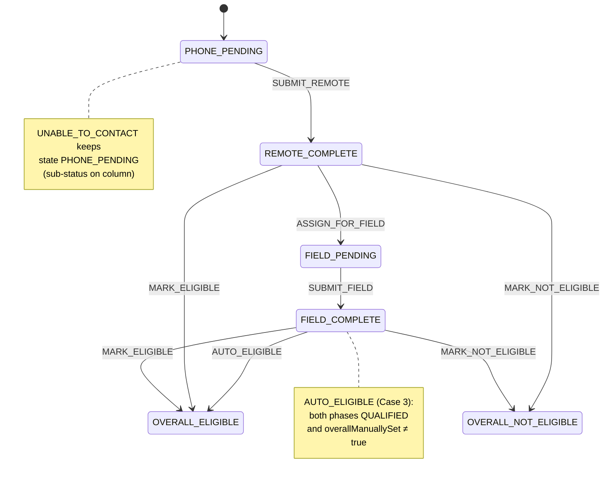
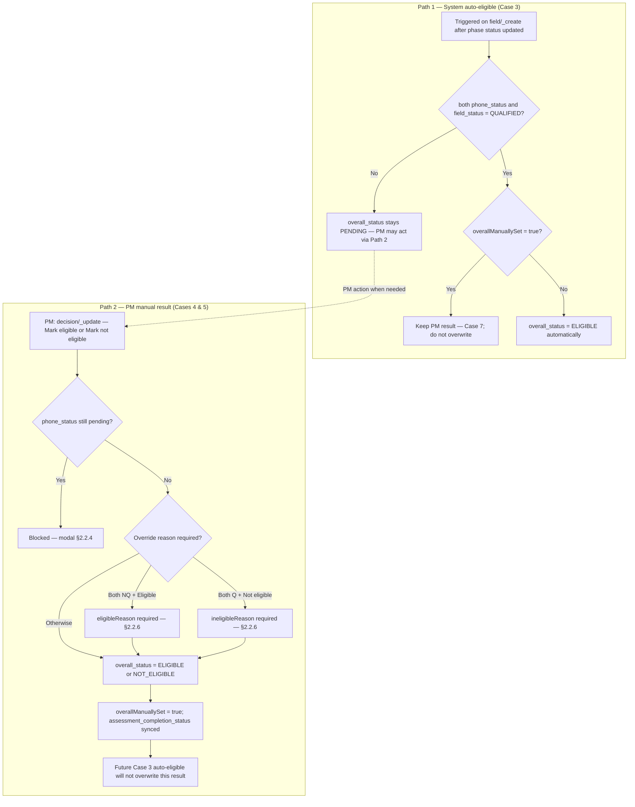

# Assessment Module — Business Service (`AssessmentPlanFacility`)

> **Purpose:** Workflow definition for the Assessment Plan facility lifecycle in `egov-workflow-v2`.
>
> **Important note (from LLD):** The Assessment V2 LLD primarily models status using **three columns** on `facility_activities` (`phone_status`, `field_status`, `overall_status`) plus `eg_assessment_submission` inserts, and does **not require** `egov-workflow-v2` to run the assessment flow.  
> If your platform standard requires every lifecycle to be represented as a Workflow v2 business service (for inbox/history/audit), use the state machine below as the closest canonical mapping to **ERS V3.2** and `ASSESSMENT_MODULE_LLD 1.md`.
>
> **Assessment result** has two distinct resolution paths (LLD §2.7.3 Diagram B):
> 1. **Path 1 — System auto-eligible (Case 3):** on `field/_create`, when both phases are `QUALIFIED` and `overallManuallySet` ≠ true → `overall_status = ELIGIBLE`.
> 2. **Path 2 — PM manual (Cases 4 & 5):** PM calls `decision/_update` → `overall_status = ELIGIBLE` or `NOT_ELIGIBLE`; sets `overallManuallySet = true`.

**Service owning the lifecycle**

- Backend domain owner: `field-planner-service` (Assessment APIs under `/assessment/v1` per LLD)
- Optional workflow engine: `egov-workflow-v2`

---

## Deploy (only if you decide to use workflow-v2)

1. Create a JSON payload containing only `BusinessServices[]` for `AssessmentPlanFacility`.
2. Call workflow create for target tenant:
  `POST /egov-workflow-v2/egov-wf/businessservice/_create?tenantId=<tenant>`
3. Persister topic `save-wf-businessservice` writes to:
  - `eg_wf_businessservice_v2`
  - `eg_wf_state_v2`
  - `eg_wf_action_v2`

---

## Business meaning (ERS V3.2)

Assessment happens inside an **Assessment Plan** (stored as `field_plans` with `plan_type=ASSESSMENT` — **no** separate `assessment_plans` table; optional DB view `assessment_plans`).  
Each facility included in the plan is tracked as a single “plan facility” row (`facility_activities` with `activity=ASSESSMENT`, linked via `assessment_plan_id`).

Core business events/actions:

- **Remote submit** (Remote Assessor / role `ENUMERATOR`) → OutcomeEngine sets `phone_status` to `QUALIFIED` or `NOT_QUALIFIED` via MDMS `AssessmentOutcomeRules` (ERS §5.3 — generic rules, not hard-coded Java).
- **Unable to contact** (Remote Assessor) → `phone_status` = `PENDING_WRONG_NUMBER` or `PENDING_NO_ANSWER` (no submission row).
- **Assign for on-site** (PM) → `field_status = PENDING` when remote is done and result is still `PENDING` (§2.2.2).
- **On-site submit** (Field POC) → OutcomeEngine sets `field_status` to `QUALIFIED` or `NOT_QUALIFIED`.
- **Auto-eligible** (System, Case 3) → on on-site submit only, when both phases `QUALIFIED` and PM has not manually set result.
- **Mark eligible / Mark not eligible** (PM, Cases 4 & 5) → `overall_status = ELIGIBLE` or `NOT_ELIGIBLE`; `eligibleReason` required when both phases `NOT_QUALIFIED` and PM marks Eligible (§2.2.6); `ineligibleReason` always required for not eligible (mandatory override when both phases `QUALIFIED`).

Phase qualification (`QUALIFIED` / `NOT_QUALIFIED`) and assessment result (`ELIGIBLE` / `NOT_ELIGIBLE`) are **separate**. `NOT_QUALIFIED` on a phase does **not** block PM from marking Eligible.

---

## State machine summary (workflow-v2 representation)

Workflow states approximate the **combined** view of the three LLD columns. Terminal states are `OVERALL_ELIGIBLE` and `OVERALL_NOT_ELIGIBLE`.

| State                 | Terminal? | Who acts here      | Meaning                                                                                      |
| --------------------- | --------- | ------------------ | -------------------------------------------------------------------------------------------- |
| `PHONE_PENDING`       | No        | Remote Assessor    | Included in plan; remote assessment pending (incl. Wrong Number / No Answer sub-statuses)    |
| `REMOTE_COMPLETE`     | No        | PM                 | Remote done (`QUALIFIED` or `NOT_QUALIFIED`); PM may assign on-site or set result (phone-only) |
| `FIELD_PENDING`       | No        | Field POC          | PM assigned for on-site; on-site assessment pending                                          |
| `FIELD_COMPLETE`      | No        | PM / System        | On-site done (`QUALIFIED` or `NOT_QUALIFIED`); result may auto-set or await PM                |
| `OVERALL_ELIGIBLE`    | Yes       | —                  | Eligible — **auto (Case 3)** or **PM Mark eligible (Case 4)**                                |
| `OVERALL_NOT_ELIGIBLE`| Yes       | —                  | Not Eligible — **PM Mark not eligible (Case 5)** + reason                                    |

### Process Flow

### Assessment result — two paths (LLD §2.7.3 Diagram B)

---

## Actions by role

Mapped from ERS V3.2 + LLD gating rules (§2.2).

| Action                          | Roles                            | From → To                                              | Validation / gating (from LLD)                                                                 |
| ------------------------------- | -------------------------------- | ------------------------------------------------------ | ---------------------------------------------------------------------------------------------- |
| `CREATE` *(or AUTO on include)* | `SYSTEM_USER`, `PROJECT_MANAGER` | start → `PHONE_PENDING`                                | Facility included in plan; sets `assessment_plan_id`; `overall_status = PENDING` on row |
| `SUBMIT_REMOTE`                 | `ENUMERATOR`                     | `PHONE_PENDING` → `REMOTE_COMPLETE`                    | One remote form submission; OutcomeEngine → `QUALIFIED` / `NOT_QUALIFIED` (MDMS rules)         |
| `UNABLE_TO_CONTACT`             | `ENUMERATOR`                     | `PHONE_PENDING` → `PHONE_PENDING`                      | `PENDING_WRONG_NUMBER` or `PENDING_NO_ANSWER`; no submission; on-site blocked (Case 1)           |
| `ASSIGN_FOR_FIELD`              | `PROJECT_MANAGER`                | `REMOTE_COMPLETE` → `FIELD_PENDING`                    | Remote = Qualified or Not Qualified; on-site = Not Initiated; result = Pending; not Case 6     |
| `SUBMIT_FIELD`                  | `FIELD_POC`                      | `FIELD_PENDING` → `FIELD_COMPLETE`                     | Only when PM assigned for on-site; OutcomeEngine → `QUALIFIED` / `NOT_QUALIFIED`               |
| `AUTO_ELIGIBLE`                 | `SYSTEM_USER`                    | `FIELD_COMPLETE` → `OVERALL_ELIGIBLE`                  | **Case 3 only:** both phases `QUALIFIED`; `overallManuallySet` ≠ true; runs on `field/_create` |
| `MARK_ELIGIBLE`                 | `PROJECT_MANAGER`                | `REMOTE_COMPLETE`/`FIELD_COMPLETE` → `OVERALL_ELIGIBLE` | Remote not pending; modals §2.2.4; `eligibleReason` if both outcomes NQ (§2.2.6); sets `overallManuallySet = true` (Case 4) |
| `MARK_NOT_ELIGIBLE`             | `PROJECT_MANAGER`                | `REMOTE_COMPLETE`/`FIELD_COMPLETE` → `OVERALL_NOT_ELIGIBLE` | Remote not pending (Case 1); same gating as Mark eligible + **ineligibleReason** required; override modal if both Q (§2.2.6); sets `overallManuallySet = true` (Case 5) |
| `INCLUDE_IN_PLAN`               | `PROJECT_MANAGER`                | — → `PHONE_PENDING` (new row)                          | §2.2.9 — source assessment plan(s) `CLOSED` (R0); R1 blocks same-project eligible; cross-project include does **not** expire source `ELIGIBLE` (Rule 8) |
| `INCLUDE_IN_CROSS_PROJECT_FP`   | `PROJECT_MANAGER` / `SYSTEM_USER`| — (installation row)                                   | §2.2.9 Rules 3, 6 — Proj_2 field plan using Proj_1 eligibility; allowed during ongoing Proj_1 installation; sets `field_plan_facilities.source_plan_facility_id` |
| `MARK_PLAN_COMPLETE`            | `PROJECT_MANAGER`                | `ACTIVE` → `CLOSED` on assessment plan                 | All facilities `ELIGIBLE` or `NOT_ELIGIBLE` (§2.2.8) |
| `HANDOFF_TO_FIELD_PLAN`         | `SYSTEM_USER`                    | `OVERALL_ELIGIBLE` → (terminal + handoff flag)         | Field-plan apply: `assessment_completion_status = MOVED_TO_FIELD_PLAN`; `installation_field_plan_id`; `field_plan_facilities.source_plan_facility_id` + `assessmentSource` JSON |

### Unable to contact (ERS §7.1)

Represent as `UNABLE_TO_CONTACT` action that keeps workflow instance in `PHONE_PENDING`:

- `PENDING_WRONG_NUMBER`
- `PENDING_NO_ANSWER`

Stored on `facility_activities.phone_status` only (matches LLD §2.3.1). No `eg_assessment_submission` row.

---

## How this maps to LLD’s stored statuses (if you keep LLD persistence)

The LLD’s persisted fields (ERS V3.2):

- `facility_activities.assessment_plan_id`: FK → assessment `field_plans.id` (`plan_type = ASSESSMENT`) — API `assessmentPlanId` / `planId`
- `facility_activities.phone_status`: `PENDING`, `PENDING_NO_ANSWER`, `PENDING_WRONG_NUMBER`, `QUALIFIED`, `NOT_QUALIFIED`
- `facility_activities.field_status`: `NULL` (Not Initiated), `PENDING`, `QUALIFIED`, `NOT_QUALIFIED`
- `facility_activities.overall_status`: `PENDING`, `ELIGIBLE`, `NOT_ELIGIBLE`
- `facility_activities.assessment_completion_status`: `ENROLLED`, `ELIGIBLE`, `NOT_ELIGIBLE`, `MOVED_TO_FIELD_PLAN`, `EXPIRED` (§2.2.7–§2.2.9)
- `facility_activities.installation_field_plan_id`: installation `field_plans.id` — set on same-project handoff from eligible pool
- `facility_activities.field_plan_facility_id`: optional FK → `field_plan_facilities.id` after apply
- `field_plan_facilities.source_plan_facility_id`: FK → source ASSESSMENT `facility_activities.id` (cross-project / trail)
- `field_plan_facilities.additional_details.assessmentSource`: `{ assessmentPlanId, planFacilityId }` — required on field-plan apply
- `additional_details.assessment.overallManuallySet`: boolean — set `true` on PM Cases 4 & 5; blocks Case 3 overwrite (Case 7)
- `additional_details.assessment.phoneOutcome` / `fieldOutcome`: mirror of phase qualification
- `additional_details.assessment.eligibleReason` / `eligibleRemarks`: PM override when both outcomes NQ → Eligible (§2.2.6)
- `additional_details.assessment.ineligibleReason`: required for not eligible; emphasized when both outcomes Q (§2.2.6)
- `eg_assessment_submission.outcome`: `QUALIFIED` / `NOT_QUALIFIED` from OutcomeEngine

Suggested mapping if workflow-v2 is enabled:

| Workflow state          | LLD column projection                                                                                    |
| ----------------------- | -------------------------------------------------------------------------------------------------------- |
| `PHONE_PENDING`         | `phone_status` ∈ {`PENDING`, `PENDING_NO_ANSWER`, `PENDING_WRONG_NUMBER`}; `field_status = NULL`; `overall_status = PENDING` |
| `REMOTE_COMPLETE`       | `phone_status` ∈ {`QUALIFIED`, `NOT_QUALIFIED`}; `field_status = NULL`; `overall_status = PENDING`      |
| `FIELD_PENDING`         | `phone_status` ∈ {`QUALIFIED`, `NOT_QUALIFIED`}; `field_status = PENDING`; `overall_status = PENDING`   |
| `FIELD_COMPLETE`        | `phone_status` ∈ {`QUALIFIED`, `NOT_QUALIFIED`}; `field_status` ∈ {`QUALIFIED`, `NOT_QUALIFIED`}; `overall_status = PENDING` |
| `OVERALL_ELIGIBLE`      | `overall_status = ELIGIBLE`                                                                              |
| `OVERALL_NOT_ELIGIBLE`  | `overall_status = NOT_ELIGIBLE` + `additional_details.assessment.ineligibleReason`                     |

### LLD Cases 1–9 (ERS §9.2 + handoff / re-enrollment) — workflow perspective

| Case | Condition | Behaviour |
| ---- | --------- | --------- |
| **1** | Remote pending variants | On-site must remain Not Initiated; assign blocked; PM cannot mark Eligible or Not Eligible |
| **2** | Remote `QUALIFIED` or `NOT_QUALIFIED` | On-site may be assigned |
| **3** | Both phases `QUALIFIED`; `overallManuallySet` ≠ true | **Path 1:** `AUTO_ELIGIBLE` on on-site submit; `assessment_completion_status` → `ELIGIBLE` |
| **4** | PM Mark eligible | **Path 2:** `overall_status = ELIGIBLE`; `assessment_completion_status` → `ELIGIBLE`; `eligibleReason` if both NQ (§2.2.6); `overallManuallySet = true` |
| **5** | PM Mark not eligible | **Path 2:** `overall_status = NOT_ELIGIBLE`; `assessment_completion_status` → `NOT_ELIGIBLE`; `ineligibleReason` required; `overallManuallySet = true` |
| **6** | Result already `ELIGIBLE` or `NOT_ELIGIBLE` | Assign for on-site disabled |
| **7** | PM set result while on-site in progress | On-site continues; **Path 1 does not overwrite** PM result |
| **8** | Field-plan handoff — same project (§2.2.7) | `assessment_completion_status` → `MOVED_TO_FIELD_PLAN`; `installation_field_plan_id` set; `source_plan_facility_id` on `field_plan_facilities`; partial handoff OK |
| **9** | Cross-project reuse (§2.2.9 Rules 3, 6, 8) | Eligible facility in Proj_1 **never** `EXPIRED` on Proj_2 link; may go to Proj_2 field plan during Proj_1 installation; PM may optionally start fresh assessment in Proj_2 |
| **10** | Proj_1 post-install reuse (§2.2.9 Rule 7) | New assessment / field plan in **Proj_1** only after installation complete + report reviewed; does **not** block Proj_2 field-plan include |

---

## Outcome engine (phase qualification only)

On `SUBMIT_REMOTE` / `SUBMIT_FIELD`, **OutcomeEngine** evaluates MDMS `AssessmentOutcomeRules` (ERS §5.3 critical questions as generic rules → `NOT_QUALIFIED`). This sets phase status only — **not** `overall_status` (except Path 1 Case 3 on on-site submit).

| Stored outcome   | UI label      |
| ---------------- | ------------- |
| `QUALIFIED`      | Qualified     |
| `NOT_QUALIFIED`  | Not Qualified |

---

## Roles to provision (HRMS / org roles)

Use names aligned with ERS V3.2 / LLD terminology:

| Role code         | Actor                                                         |
| ----------------- | ------------------------------------------------------------- |
| `PROJECT_MANAGER` | Program Manager (PM)                                          |
| `ENUMERATOR`      | Remote Assessor (one per plan)                                |
| `FIELD_POC`       | Field POC / on-site assessor (may span multiple plans)        |
| `SYSTEM_USER`     | Service account — `AUTO_ELIGIBLE` (Case 3) on `field/_create` |

---

## Proceed to field plan (ERS §9.3)

- **UI gate:** Proceed with Field Plan Creation disabled while **any** facility on **that assessment plan** has `overall_status = PENDING`.
- **Mark complete:** PM must mark assessment plan `CLOSED` before facilities reuse elsewhere (§2.2.8).
- **Facility reuse:** Full rules §2.2.9 (R0–R7; Rule 8 — eligible never expired cross-project).
- **Eligible pool (same-project handoff):** `assessment_completion_status = ELIGIBLE`, `installation_field_plan_id IS NULL`, parent assessment plan(s) **marked complete**.
- **Cross-project Proj_2 field plan:** Allowed per Rules 3, 6 — may reuse Proj_1 eligibility while Proj_1 installation ongoing; trace via `source_plan_facility_id`.
- **Handoff key:** `planFacilityId` (`facility_activities.id`).
- **Facility trail:** §5.5 LLD — query by `facility_id` across `facility_activities.assessment_plan_id` and `field_plan_facilities.source_plan_facility_id`.
