# Assessment Module — Low Level Design (LLD)

**Scope:** Implementation of the **assessment module**.


| Reference                                                                                                      | Use for                                                     |
| -------------------------------------------------------------------------------------------------------------- | ----------------------------------------------------------- |
| **EFH – Assessment Module Engineering Requirements V3.2**                                                      | **Approved** workflows, statuses, validation, UI behaviour  |
| `E4H_Assessment_Module_PRD_3.docx`                                                                             | Business rules (baseline)                                   |
| `Assessment module - Version 2.docx`                                                                           | UI / PM actions (superseded by ERS V3.2 where they differ)  |
| `Assessment forms - E4H (1) 1 (1).xlsx`                                                                        | Form definitions + HF types (Sheet2) → MDMS                 |
| MDMS `assessment.AssessmentFormSchema` + `AssessmentOutcomeRules`                                              | Form questions + outcome criteria one record per `formType` |
| [FigJam workflow](https://www.figma.com/board/CzHGE9rmLUiIqCLlmFwK7T/Assessment-module---workflow?node-id=0-1) | Process                                                     |
| [V2 prototype](https://assessment-plan-1068851155482.asia-southeast1.run.app/)                                 | UI reference                                                |


---

## Summary

### Already in the app (before assessment)

1. **Facilities onboarded** — Admin bulk-uploads facilities with **Category** (Health / Anganwadi).
2. **Create a project** — PM creates a project (state, dates, etc.).
3. **Attach facilities to project** — PM uses the existing Excel flow to link facilities to that project.

Facilities are on the **project**, not yet in an **assessment cycle**.

### Assessment module

- **One project → many assessment plans** (facilities split across plans; reuse rules in **§2.2.9**).
- **One installation field plan → many assessment plans** — eligible facilities from **multiple marked-complete** assessment plans in the same project may be combined into one field plan (§2.2.7, §2.2.8, §4.4).
- **Partial handoff** — not all eligible facilities from a plan must move to the same field plan; leftovers stay `ELIGIBLE` until handed off or reused per §2.2.9.
- **PM decisions on UI** (bulk select or facility detail) — not Excel upload for assign/eligible/include.
- **Download** on plan screen = **read-only export** of grid + response summaries.
- **Persistence:** reuses `field_plans`, `facility_activities` (ASSESSMENT rows), `activity_assignments`; new table `eg_assessment_submission` only (see §5). **No** separate `assessment_plans` or `eg_assessment_plan_facility` table.
- **Facility reuse:** when a facility may move to another assessment plan, field plan, or project — **§2.2.9** (developer reference with examples).

### Terminology (ERS UI ↔ backend)

Aligned with **ERS V3.2** status names. Three dimensions on each `facility_activities` row:


| ERS dimension             | UI labels (ERS §9.1)                                                           | Backend column / field                                                              |
| ------------------------- | ------------------------------------------------------------------------------ | ----------------------------------------------------------------------------------- |
| Remote Assessment         | Pending, Pending – Wrong Number, Pending – No Answer, Qualified, Not Qualified | `phone_status` (column)                                                             |
| On-site Assessment        | Not Initiated, Pending, Qualified, Not Qualified                               | `field_status` (column); `NULL` = Not Initiated                                     |
| Assessment Result         | Pending, Eligible, Not Eligible                                                | `overall_status` (column)                                                           |
| Phase outcome (audit/API) | Qualified / Not Qualified (same labels as above when phase complete)           | `additional_details.assessment.phoneOutcome` / `fieldOutcome`; `submission.outcome` |


| UI action / role              | Backend                                                                                                                                        |
| ----------------------------- | ---------------------------------------------------------------------------------------------------------------------------------------------- |
| Assign for on-site assessment | `field_status = PENDING` (requires §2.2.4 preconditions)                                                                                       |
| Mark eligible                 | `overall_status = ELIGIBLE` (Case 4); `eligibleReason` required when overriding Case 9 (both phases `NOT_QUALIFIED`) |
| Mark not eligible             | `overall_status = NOT_ELIGIBLE` (Case 5); `ineligibleReason` required; mandatory when overriding Case 8 (both phases `QUALIFIED`) |
| Field-plan handoff            | `assessment_completion_status = MOVED_TO_FIELD_PLAN`; `installation_field_plan_id` set (§2.2.7)                                                |
| Remote Assessor (mobile)      | `activity_assignments` (role `ENUMERATOR`) — **one per plan**                                                                                  |
| Field POC / On-site POC       | `activity_assignments` (role `FIELD_POC`) — may span **multiple plans**                                                                        |


### Mobile (Remote Assessor + Field POC)

- **Remote:** form submit → OutcomeEngine sets `phone_status` to `QUALIFIED` or `NOT_QUALIFIED` (§2.7). **Unable to contact** → `PENDING_WRONG_NUMBER` or `PENDING_NO_ANSWER` (§2.3.1).
- **Field POC:** site visit form → `field_status` to `QUALIFIED` or `NOT_QUALIFIED` — only facilities with `field_status = PENDING`.

---

## 2.0 UI flows

### 2.0.1 Create assessment plan

**UI:** Reuses the existing **field plan creation** wizard. PM selects the **Assessment** activity (`code = ASSESSMENT`); remaining steps follow the table below (grid include and Remote Assessor / Field POC roles — not installation roles).

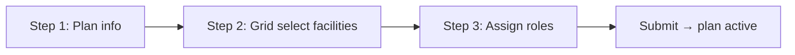


| Step | Screen             | User action                                                                        | API                                                                      |
| ---- | ------------------ | ---------------------------------------------------------------------------------- | ------------------------------------------------------------------------ |
| 1    | Plan info          | Name, **state**, start date, end date                                              | `POST /plan/_create` (`projectId`, metadata) → `planId`                  |
| 2    | Include facilities | Pre-populated **grid** of project-linked facilities → multi-select rows to include | `POST /plan/facility/_bulk-include` (`facilityId[]`) — validation §2.2.9 |
| 3    | Assign assessors   | Select **role + email** for Remote Assessor and Field POC                          | `POST /plan/_update` (assessor refs)                                     |
| 4    | Submit             | Finish wizard                                                                      | Plan status `ACTIVE`; navigate to plan facility list                     |


Grid source: **project-linked facilities only** (project-service) — not `facilityIngestionTemplateWithData`. Optional bulk path: ingestion `assessmentPlanInclude`* (§4.2) for offline Excel; **wizard uses UI grid only**.

### 2.0.2 Project screen — assessment plans list

A facility may appear in **more than one assessment plan** over time, but only according to **§2.2.9** (source plan must be marked complete; same-project eligible unassigned cannot join another assessment plan in the same project).


| UI                               | API                                                                                                                       |
| -------------------------------- | ------------------------------------------------------------------------------------------------------------------------- |
| List all plans for project       | `POST /plan/_search` (`projectId`)                                                                                        |
| Click one plan                   | Navigate to **plan facility screen** (§2.0.3)                                                                             |
| Mark assessment plan complete    | `POST /plan/_mark-complete` — when all facilities finalized (§2.2.8)                                                      |
| Create field plan (installation) | Project / field-plan flow — pick eligible facilities from **one or more marked-complete** assessment plans (§2.0.5, §4.4) |


### 2.0.3 Plan facility screen (main PM workspace)

**Top metric cards** (`POST /plan/_detail`):


| Card                    | Count                                                            |
| ----------------------- | ---------------------------------------------------------------- |
| Remote assessment done  | `phone_status` ∈ {`QUALIFIED`, `NOT_QUALIFIED`} / total in plan  |
| On-site assessment done | `field_status` ∈ {`QUALIFIED`, `NOT_QUALIFIED`} / total assigned |
| Eligible                | `overall_status = ELIGIBLE`                                      |
| Not eligible            | `overall_status = NOT_ELIGIBLE`                                  |


**Left filters** on `POST /plan/facility/_search`:


| Filter                    | Field                                                                      |
| ------------------------- | -------------------------------------------------------------------------- |
| District                  | `additional_details.assessment.district` (snapshot) or facility boundary   |
| Facility type             | `additional_details.assessment.facilityType` (snapshot) or facility master |
| Remote assessment status  | `phone_status`                                                             |
| On-site assessment status | `field_status`                                                             |
| Assessment result         | `overall_status`                                                           |


**Facility table columns:** HF name, type, category, district, block, remote assessment status, on-site assessment status, assessment result, completion status (handoff), last action.

**Download button** — read-only Excel via ingestion (`POST /ingestion-service/template/assessmentPlanFacilityExport`). Ingestion calls assessment `POST /plan/facility/_search` with the same filters as the grid plus `**exportAll=true`** and `**includeResponseSummary=true`** (no separate export API):


| Export column                            | Source                                                                                     |
| ---------------------------------------- | ------------------------------------------------------------------------------------------ |
| HF name, type, category, district, block | Facility master + `facility_activities` row (snapshots in `additional_details.assessment`) |
| Remote assessment status                 | `phone_status` (column)                                                                    |
| On-site assessment status                | `field_status` (column)                                                                    |
| Assessment result                        | `overall_status` (column) — Eligible / Not Eligible / Pending labels                       |
| Last action                              | `additional_details.assessment.overallStatusSetTime` or `last_modified_time` on row        |
| Phone response                           | Summary from `submission_data` (PHONE)                                                     |
| Field response                           | Summary from `submission_data` (FIELD)                                                     |


**No editable columns** in download — PM actions are on UI only.

**Row selection:** select all or individual rows.

**Bulk action buttons** (`POST /plan/facility/decision/_bulk-update`):


| Button                 | Effect                                   | Enabled when (per row) — see §2.2.4 / §2.2.5                                                |
| ---------------------- | ---------------------------------------- | ------------------------------------------------------------------------------------------- |
| **Assign for on-site** | `field_status = PENDING`                 | Remote = Qualified or Not Qualified; on-site = Not Initiated; result = Pending (§2.2.2; not Case 1 or 6) |
| **Mark eligible**      | `overall_status = ELIGIBLE`              | Remote not pending (Case 1); confirmation modals §2.2.4; `eligibleReason` if overriding Case 9 (§2.2.6) |
| **Mark not eligible**  | `overall_status = NOT_ELIGIBLE` + reason | Remote not pending (Case 1); same modals; **reason required**; override modal if both Q (Case 8)          |


### 2.0.4 Facility detail screen

Click one row → detail view (§2.0.4 / §2.7.6): facility summary, **remote assessment response** (expand), **on-site assessment response** (expand), ineligible reason when set, same **three action buttons** as bulk (single-facility via `decision/_update`).

### 2.0.5 After assessment — field plan (installation)

**Field plan creation** (existing field-planner) may combine **eligible** facilities from **multiple completed assessment plans** within the same project (§2.2.7, §4.4). Facilities from one assessment plan may be split across different installation field plans.

**Per assessment plan — proceed gate (ERS §9.3):** `canProceedToFieldPlan` on `plan/_detail` stays **false** while **any** facility in **that plan** has `overall_status = PENDING`. Enabled when all rows in that plan are `ELIGIBLE` or `NOT_ELIGIBLE`.

**Field-plan facility pick list** (project or field-plan wizard): rows where `assessment_completion_status = ELIGIBLE`, `installation_field_plan_id IS NULL`, parent assessment plan is **completed** (no row `PENDING`), and `planFacilityId` is used as the stable handoff key (not `facility_id` alone).

---

### End-to-end flow

**1. Project created (existing)**  
PM creates project. No assessment APIs.

**2. Facilities linked to project (existing)**  
Project Excel / UI: `facilityIngestionTemplateWithData` → `createFacilityAndUpdateProject`. Facilities exist on **project** only.

**3. Create assessment plan wizard** — name, state, dates → grid select facilities → assign Remote Assessor + Field POC → submit (§2.0.1).

**4. Project view** — list assessment plans → open one plan.

**5. Plan facility screen** — filters, table, metric cards, **Download** export, multi-select + 3 bulk actions (§2.0.3).

**6. Remote Assessor — remote assessment (mobile)** — `submission/phone/_create` or unable-to-contact (§2.3.1) → system sets `phone_status`.

**7. PM — Assign for on-site assessment** (bulk or detail) → `field_status = PENDING` (§2.2.4).

**8. Field POC — on-site assessment (mobile)** — `submission/field/_create` → `field_status` Qualified / Not Qualified.

**9. PM — Mark eligible / Mark not eligible** (bulk or detail) → Cases 4 & 5. **System** auto-sets Eligible (Cases 3 & 8) or Not Eligible (Case 9) on on-site submit when both phase outcomes align.

**10. Field plan (installation)** — Eligible, unassigned HFs from one or more completed assessment plans → extended field-plan ingestion (§4.4); partial handoff allowed (§2.2.7).


| Step                                        | Who sets what                                                                                                                                      |
| ------------------------------------------- | -------------------------------------------------------------------------------------------------------------------------------------------------- |
| Remote assessment status                    | **System** on remote submit or unable-to-contact                                                                                                   |
| On-site queue (Pending)                     | **PM** — Assign for on-site assessment                                                                                                             |
| On-site assessment status                   | **System** on on-site submit                                                                                                                       |
| Assessment result (Eligible / Not Eligible) | **System** — auto Eligible (Cases 3 & 8) or auto Not Eligible (Case 9) on on-site submit; **PM** — Cases 4 & 5; Case 7 preserves PM result when on-site still pending |


### One-line flow

```
Project → Wizard: plan + grid select facilities + assessors → Plan list → Plan facility screen
  → Remote (Remote Assessor) → PM assign on-site → On-site (Field POC)
  → PM Cases 4/5 or system Cases 3/8/9 → Field plan (Eligible, unassigned — multi-plan OK)
```

### Who does what


| Who             | Role                                                                           |
| --------------- | ------------------------------------------------------------------------------ |
| Admin           | Facility onboarding (existing)                                                 |
| PM              | Plan wizard, plan list, facility screen (bulk/detail actions), download export |
| Remote Assessor | Remote assessment — one per plan (ERS §12.2)                                   |
| Field POC       | On-site assessment — may cover multiple plans                                  |
| System          | Outcomes (MDMS), validations, audit / last action                              |


---

## 1. What we build


| Component                                         | Service                      | New?                                                              |
| ------------------------------------------------- | ---------------------------- | ----------------------------------------------------------------- |
| Assessment controller (`/assessment/v1`)          | field-planner-service        | Yes                                                               |
| Assessment plan CRUD                              | field-planner-service        | Yes — reuses `field_plans` (`plan_type = ASSESSMENT`)             |
| Plan facility + workflow status                   | field-planner-service        | Yes — reuses `facility_activities` (activity `ASSESSMENT`)        |
| Assessor assignment (Remote Assessor / Field POC) | field-planner-service        | Yes — reuses `activity_assignments`                               |
| Phone/field form submit + outcome engine          | field-planner-service        | Yes                                                               |
| `eg_assessment_submission` table                  | field-planner-service        | Yes (new table)                                                   |
| MDMS outcome rules (per form type)                | MDMS + field-planner-service | Yes (config)                                                      |
| Handoff Eligible HFs → field-planner              | assessment → field-planner   | Integrate only                                                    |
| Internal APIs for ingestion                       | field-planner-service        | Yes                                                               |
| `plan/facility/_search` export flags              | field-planner-service        | Extend                                                            |
| Include in plan (wizard grid + optional Excel)    | field-planner + ingestion    | `plan/facility/_bulk-include` (primary); §4.2 optional            |
| Plan facility export (download)                   | ingestion-service            | New — calls `_search` with `exportAll` + `includeResponseSummary` |
| Plan wizard + list + facility + detail UI         | Frontend                     | New                                                               |
| Bulk PM decisions API                             | field-planner-service        | New                                                               |


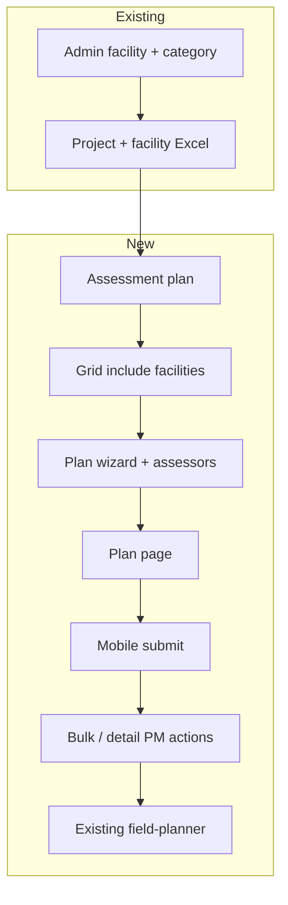


---

## 2. Assessment workflow

### 2.1 Implementation steps

Aligns with **End-to-end flow (canonical)** steps 1–10 above.


| Step | Owner           | Action                                                | API / mechanism                                                                                  |
| ---- | --------------- | ----------------------------------------------------- | ------------------------------------------------------------------------------------------------ |
| 1–2  | PM              | Project + link facilities (existing)                  | `facilityIngestionTemplateWithData` + `createFacilityAndUpdateProject`                           |
| 3    | PM              | Plan wizard: info + grid include + assessors          | `plan/_create` → `plan/facility/_bulk-include` → `plan/_update`                                  |
| 4    | PM              | Project screen: list plans                            | `plan/_search`                                                                                   |
| 5    | PM              | Plan facility screen: filters, download, bulk actions | `plan/_detail`, `plan/facility/_search`, `assessmentPlanFacilityExport`, `decision/_bulk-update` |
| 6    | Remote Assessor | Remote assessment                                     | `submission/phone/_create` or `_unable-to-contact`                                               |
| 7    | PM              | Assign for on-site assessment (bulk or detail)        | `decision/_bulk-update` or `decision/_update`                                                    |
| 8    | Field POC       | Site visit assessment                                 | `submission/field/_create`                                                                       |
| 9    | PM              | Mark eligible / not eligible (bulk or detail)         | `decision/_bulk-update` or `decision/_update` (+ reason)                                         |
| 10   | PM              | Field plan — installation (existing)                  | Field-planner + ingestion §4.4 (`overall_status = ELIGIBLE`)                                     |


### 2.2 Status model (`facility_activities` — assessment rows)

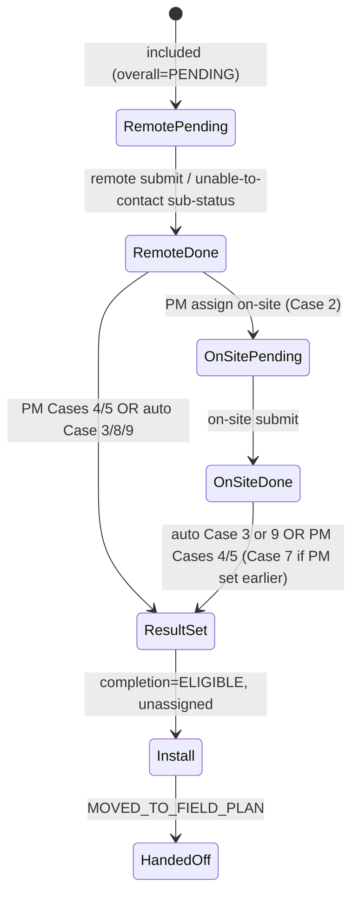


#### 2.2.0 Status reference (ERS §9.1)


| Category             | Stored value (`phone_status` / `field_status` / `overall_status`) | UI label (ERS)           | Description                                                                    |
| -------------------- | ----------------------------------------------------------------- | ------------------------ | ------------------------------------------------------------------------------ |
| Remote               | `PENDING`                                                         | Pending                  | Included; remote form not yet submitted                                        |
| Remote               | `PENDING_WRONG_NUMBER`                                            | Pending – Wrong Number   | Unable to contact — wrong number                                               |
| Remote               | `PENDING_NO_ANSWER`                                               | Pending – No Answer      | Unable to contact — no answer                                                  |
| Remote               | `QUALIFIED`                                                       | Qualified                | Remote form complete; meets criteria (OutcomeEngine default)                   |
| Remote               | `NOT_QUALIFIED`                                                   | Not Qualified            | Remote form complete; critical MDMS rule matched                               |
| On-site              | `NULL`                                                            | Not Initiated            | Not yet assigned for on-site                                                   |
| On-site              | `PENDING`                                                         | Pending                  | PM assigned; on-site form not submitted                                        |
| On-site              | `QUALIFIED`                                                       | Qualified                | On-site form complete; meets criteria                                          |
| On-site              | `NOT_QUALIFIED`                                                   | Not Qualified            | On-site form complete; critical MDMS rule matched                              |
| Assessment result    | `PENDING`                                                         | Pending                  | **Default on include**; PM has not finalised eligibility                       |
| Assessment result    | `ELIGIBLE`                                                        | Eligible                 | PM marked eligible (Case 4), or **auto-set** when both phases `QUALIFIED` (Cases 3 & 8) |
| Assessment result    | `NOT_ELIGIBLE`                                                    | Not Eligible             | PM marked not eligible (Case 5), or **auto-set** when both phases `NOT_QUALIFIED` (Case 9) |
| Enrollment lifecycle | `assessment_completion_status` (column) — see §2.2.7              | (internal / optional UI) | Handoff, cross-project expiry — §2.2.9                                         |


| Completion status (`assessment_completion_status`) | Meaning                                                                                                 |
| -------------------------------------------------- | ------------------------------------------------------------------------------------------------------- |
| `ENROLLED`                                         | Included in plan; assessment in progress or not yet final                                               |
| `ELIGIBLE`                                         | `overall_status = ELIGIBLE` and **not** yet on an installation field plan                               |
| `NOT_ELIGIBLE`                                     | `overall_status = NOT_ELIGIBLE` — terminal for this enrollment                                          |
| `MOVED_TO_FIELD_PLAN`                              | Handed off to an installation field plan (`installation_field_plan_id` set)                             |
| `EXPIRED`                                          | Prior enrollment no longer valid — e.g. eligible facility moved to **another project** (§2.2.9 Rule R8) |


| Field                          | Storage                                                     | Set by            | When                                                                                                        |
| ------------------------------ | ----------------------------------------------------------- | ----------------- | ----------------------------------------------------------------------------------------------------------- |
| `phone_status`                 | `facility_activities.phone_status` (column)                 | System            | Remote submit, unable-to-contact, or OutcomeEngine result                                                   |
| `phoneOutcome`                 | `additional_details.assessment.phoneOutcome`                | System            | Mirror of qualification on submit — `QUALIFIED` / `NOT_QUALIFIED`                                           |
| `field_status`                 | `facility_activities.field_status` (column)                 | PM then system    | PM assign → `PENDING`; on-site submit → `QUALIFIED` / `NOT_QUALIFIED`                                       |
| `fieldOutcome`                 | `additional_details.assessment.fieldOutcome`                | System            | Mirror of qualification on on-site submit                                                                   |
| `overall_status`               | `facility_activities.overall_status` (column)               | PM or system      | PM Cases 4 & 5; **auto** `ELIGIBLE` (Cases 3 & 8) or **auto** `NOT_ELIGIBLE` (Case 9) on on-site submit |
| `assessment_completion_status` | `facility_activities.assessment_completion_status` (column) | System            | Synced on include, PM result, handoff, cross-project expire — §2.2.7, §2.2.9                                |
| `installation_field_plan_id`   | `facility_activities.installation_field_plan_id` (column)   | System on handoff | Installation `field_plans.id` (`plan_type = FIELD_PLAN`); **not** the assessment plan id in `field_plan_id` |


Each included facility is one `facility_activities` row with `activity_id` = **ASSESSMENT** (see §5.2). Installation `status` on the same table is **not** used for assessment workflow.

#### 2.2.1 Status dependency rules (ERS §9.2)


| Case  | Condition | Behaviour |
| ----- | --------- | --------- |
| **1** | Remote assessment status is `PENDING`, `PENDING_WRONG_NUMBER`, or `PENDING_NO_ANSWER` | On-site assessment must remain **Not Initiated** (`field_status = NULL`). Assign for on-site **blocked**. PM **cannot** mark **Eligible** or **Not Eligible**. |
| **2** | Remote assessment status is `QUALIFIED` or `NOT_QUALIFIED` | On-site assessment **may** be initiated (PM assign for on-site). |
| **3** | Both remote and on-site assessment statuses are `QUALIFIED` | Assessment result (`overall_status`) → `ELIGIBLE` **automatically** on on-site submit. No PM action required. `assessment_completion_status` → `ELIGIBLE`. |
| **4** | PM marks the facility **Eligible** | Assessment result → `ELIGIBLE`; `assessment_completion_status` → `ELIGIBLE`; `overallManuallySet = true`. |
| **5** | PM marks the facility **Not Eligible** | Assessment result → `NOT_ELIGIBLE`; `assessment_completion_status` → `NOT_ELIGIBLE`; `ineligibleReason` required; `overallManuallySet = true`. |
| **6** | Assessment result is `ELIGIBLE` or `NOT_ELIGIBLE` | On-site assessment **cannot** be initiated (assign for on-site **disabled**). |
| **7** | On-site assessment is `PENDING` when PM manually sets Eligible or Not Eligible, and remote assessment is **not** pending | Final eligibility outcome is set by **PM** (Cases 4 & 5). On-site visit may still complete; phase statuses update on submit, but **Case 3 / Case 9 auto-logic does not overwrite** a PM-set result (`overallManuallySet = true`). |
| **8** | Both remote and on-site assessment are `QUALIFIED` | System automatically marks facility **Eligible** (same as Case 3). If PM wants **Not Eligible**, system prompts for **`ineligibleReason`** (override modal — §2.2.6). |
| **9** | Both remote and on-site assessment are `NOT_QUALIFIED` | System automatically marks facility **Not Eligible** on on-site submit (`overall_status` → `NOT_ELIGIBLE`; `assessment_completion_status` → `NOT_ELIGIBLE`). If PM wants **Eligible**, system prompts for **`eligibleReason`** (override modal — §2.2.6). |

> **Not in this case list:** installation field-plan handoff → §2.2.7; facility reuse across plans/projects → §2.2.9.

`overallManuallySet` stored in `additional_details.assessment.overallManuallySet` (boolean). Set `true` on PM Cases 4 & 5; blocks Case 3 / Case 9 auto-overwrite (Case 7).

**Assessment result — decision flow (Cases 1–9)**

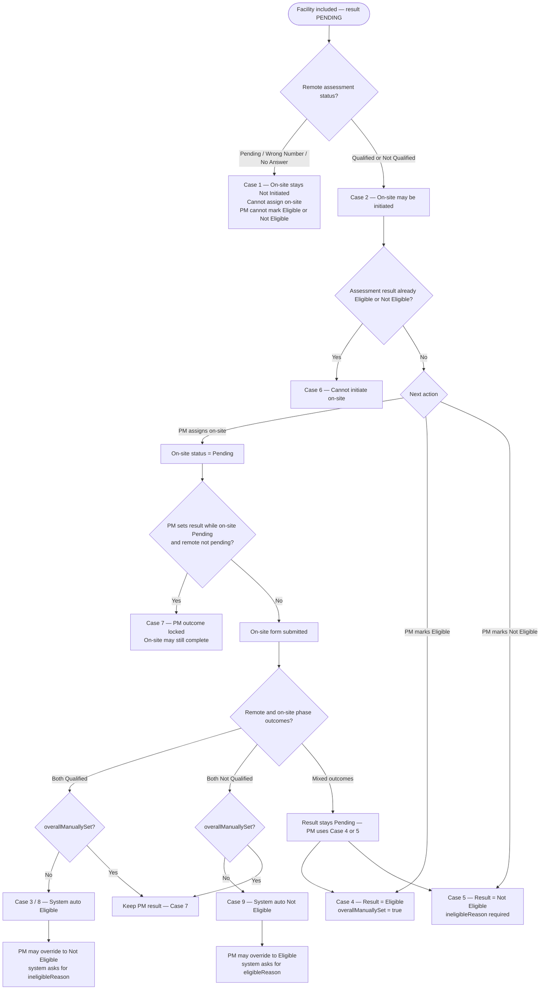

#### 2.2.2 Assign for on-site assessment — validation (ERS §5.2, §11)

Enabled **only** when **all three** are true (bulk and facility-level):


| Condition                 | Required value                           |
| ------------------------- | ---------------------------------------- |
| Remote assessment status  | `QUALIFIED` **or** `NOT_QUALIFIED`       |
| On-site assessment status | Not Initiated (`field_status` is `NULL`) |
| Assessment result         | `PENDING`                                |


Additionally **Case 6:** disabled if `overall_status` is already `ELIGIBLE` or `NOT_ELIGIBLE`.

API: `assignForField: true` on `decision/_update` / `decision/_bulk-update` → `field_status = PENDING`.

#### 2.2.3 Mark eligible / Mark not eligible — validation (ERS §10, §11)

**Hard block:** if any selected row has `phone_status` ∈ {`PENDING`, `PENDING_WRONG_NUMBER`, `PENDING_NO_ANSWER`} → show blocking modal (§2.2.4); **Mark eligible** and **Mark not eligible** both rejected (Case 1).

**Not hard-blocked** when remote is done but on-site is `PENDING` — show **confirmation** modal instead (ERS allows proceed).


| Remote status             | On-site status            | Mark eligible                         | Mark not eligible                       |
| ------------------------- | ------------------------- | ------------------------------------- | --------------------------------------- |
| Pending variants          | Any                       | **Blocked** (Case 1)                  | **Blocked** (Case 1)                    |
| Qualified / Not Qualified | `PENDING`                 | **Allowed** — confirmation modal      | **Allowed** — confirmation modal        |
| Qualified / Not Qualified | Not Initiated (`NULL`)    | **Allowed** — warning modal           | **Allowed** — warning modal             |
| Qualified / Not Qualified | Qualified / Not Qualified | **Allowed** (subject to §2.2.6 modals) | **Allowed** (subject to §2.2.6 modals) |


`NOT_QUALIFIED` on remote or on-site does **not** block PM from marking Eligible (PM may override — §2.2.6).

**Reason rules (§2.2.6):** `ineligibleReason` always required for Mark not eligible. `eligibleReason` additionally required when **both** `phoneOutcome` and `fieldOutcome` are `NOT_QUALIFIED` and PM marks Eligible.

#### 2.2.4 Modal messages (ERS §10)

Displayed on Mark eligible / Mark not eligible (bulk and detail):


| Selected facilities | Remote status                  | On-site status | Modal                                                                                                                         |
| ------------------- | ------------------------------ | -------------- | ----------------------------------------------------------------------------------------------------------------------------- |
| Any                 | Pending / Wrong No / No Answer | Any            | *Selected facilities have pending remote assessments. You can proceed once the remote assessments are completed.* — **block** |
| Any                 | Qualified / Not Qualified      | `PENDING`      | *Some selected facilities have pending on-site assessments. Are you sure you want to continue?* — confirm                     |
| Any                 | Qualified / Not Qualified      | Not Initiated  | *You won't be able to initiate an on-site assessment once confirmed.* — confirm                                               |


Mark not eligible uses the same gating modals, then a **reason** modal (mandatory). **Override modals (§2.2.6):** when both phase outcomes are `NOT_QUALIFIED` and PM marks Eligible → require `eligibleReason`; when both are `QUALIFIED` and PM marks Not eligible → require `ineligibleReason` with override messaging.

#### 2.2.5 Proceed with Field Plan Creation (ERS §9.3)

**Per assessment plan:** `plan/_detail` exposes `canProceedToFieldPlan: false` while **any** facility in **that plan** has `overall_status = PENDING`. Enabled when all rows in the plan are `ELIGIBLE` or `NOT_ELIGIBLE`.

**Field-plan facility source (project-level):** installation field plans may pull from **multiple completed** assessment plans in the same project (§4.4). Pick list criteria:


| Criterion                      | Rule                                                                                                         |
| ------------------------------ | ------------------------------------------------------------------------------------------------------------ |
| `assessment_completion_status` | `ELIGIBLE`                                                                                                   |
| `installation_field_plan_id`   | `NULL`                                                                                                       |
| Parent assessment plan         | **Marked complete** — `field_plans.status = CLOSED` and no facility with `overall_status = PENDING` (§2.2.8) |
| Handoff key                    | `planFacilityId` (= `facility_activities.id`) — required on Excel row / API for multi-plan disambiguation    |


**After overall is set:**


| `overall_status` / `assessment_completion_status` | Field plan ingestion (§4.4)                      |
| ------------------------------------------------- | ------------------------------------------------ |
| `ELIGIBLE` / `ELIGIBLE`, not yet handed off       | HF may appear in field-plan pick list            |
| `MOVED_TO_FIELD_PLAN`                             | Already on an installation field plan — excluded |
| `EXPIRED`                                         | Superseded — excluded                            |
| `NOT_ELIGIBLE` or `PENDING`                       | Excluded                                         |


**Partial handoff example:** Plan A has 50 `ELIGIBLE` rows; field plan X takes 45 → those 45 become `MOVED_TO_FIELD_PLAN`; 5 remain `ELIGIBLE` with `installation_field_plan_id NULL` until another field plan picks them, PM marks them not eligible, or PM marks Plan A complete and reuses them per §2.2.9 (cross-project only for eligible unassigned).

#### 2.2.6 PM outcome override reasons

When phase outcomes **conflict** with the PM’s assessment result, a **reason** is mandatory:


| Condition                                                                                    | PM action                    | Case | Required field                                                                           |
| -------------------------------------------------------------------------------------------- | ---------------------------- | ---- | ---------------------------------------------------------------------------------------- |
| `phoneOutcome = QUALIFIED` **and** `fieldOutcome = QUALIFIED` (both phases complete)         | Mark **Not eligible**        | **8** | `ineligibleReason` — system already auto Eligible; override modal                        |
| `phoneOutcome = NOT_QUALIFIED` **and** `fieldOutcome = NOT_QUALIFIED` (both phases complete) | Mark **Eligible**            | **9** | `eligibleReason` (+ optional `eligibleRemarks`) — system already auto Not Eligible       |
| `phoneOutcome = NOT_QUALIFIED` **and** `fieldOutcome = NOT_QUALIFIED` (mixed timing)         | Mark **Eligible**            | 4    | `eligibleReason` when both outcomes NQ before auto Case 9 fired                          |
| `phoneOutcome = QUALIFIED` **and** `fieldOutcome = QUALIFIED` (mixed timing)                 | Mark **Not eligible**        | 5    | `ineligibleReason` before auto Case 3 fired                                                |
| Any other combination                                                                        | Mark eligible / not eligible | 4/5  | Not eligible: `ineligibleReason` always; Mark eligible: no extra reason unless row above |


Stored in `additional_details.assessment.eligibleReason` / `eligibleRemarks`. Visible on facility detail with phase outcomes.

**API:** `decision/_update` and `decision/_bulk-update` accept `eligibleReason` when `overallStatus = ELIGIBLE`.

#### 2.2.7 Assessment completion status & installation handoff

`assessment_completion_status` tracks **enrollment lifecycle** on the ASSESSMENT `facility_activities` row (separate from `phone_status` / `field_status` / `overall_status`).

**Sync rules:**


| Event                                             | `assessment_completion_status`                       |
| ------------------------------------------------- | ---------------------------------------------------- |
| Include in plan                                   | `ENROLLED`                                           |
| Remote/on-site in progress                        | `ENROLLED` (or keep until result set)                |
| `overall_status = ELIGIBLE`                       | `ELIGIBLE`                                           |
| `overall_status = NOT_ELIGIBLE`                   | `NOT_ELIGIBLE`                                       |
| Picked into installation field plan               | `MOVED_TO_FIELD_PLAN` + `installation_field_plan_id` |
| Cross-project include — eligible (§2.2.9 Rule R8) | `EXPIRED`                                            |


**On field-plan apply** (ingestion `createFieldPlanFacility` or UI):

```text
UPDATE facility_activities
SET assessment_completion_status = MOVED_TO_FIELD_PLAN,
    installation_field_plan_id = :installationFieldPlanId,
    field_plan_facility_id = :fieldPlanFacilityId   -- optional
WHERE id = :planFacilityId
  AND assessment_completion_status = ELIGIBLE
  AND installation_field_plan_id IS NULL
```

`field_plan_facilities.additional_details` should store `{ assessmentSource: { assessmentPlanId, planFacilityId } }` for traceability.

**Naming:** On ASSESSMENT rows, `facility_activities.field_plan_id` = **assessment** plan id (API: `assessmentPlanId`). `installation_field_plan_id` = **installation** field plan id only.

#### 2.2.8 Marking assessment & installation plans complete

Before a facility from one plan can be included in **another assessment plan**, **another field plan**, or **another project**, every **source** plan that holds that facility must be **marked complete**.

**Marked complete** means `field_plans.status = CLOSED` (explicit PM or system action — not only “all facilities finalized”).

**Assessment plan — preconditions to mark complete**


| Check                    | Rule                                                                                     |
| ------------------------ | ---------------------------------------------------------------------------------------- |
| All facilities finalized | Every row in the plan has `overall_status` ∈ {`ELIGIBLE`, `NOT_ELIGIBLE`} — no `PENDING` |
| Plan status              | Set `field_plans.status` from `ACTIVE` → `CLOSED`                                        |


**API:** `POST /plan/_mark-complete` — body: `planId`, `tenantId`. Returns error `ASSESSMENT_PLAN_HAS_PENDING_FACILITIES` if any row still `PENDING`.

**UI:** “Mark assessment plan complete” on plan screen — enabled when `canProceedToFieldPlan = true` (same gate as §2.2.5: no pending results). After close, plan is read-only for new includes from its facilities (reuse only via §2.2.9).

**Installation field plan — preconditions to mark complete** (field-planner, existing flow extended)


| Check                        | Rule                                                                         |
| ---------------------------- | ---------------------------------------------------------------------------- |
| Installation finished        | All installation activities for the facility on that field plan are terminal |
| Installation report reviewed | Per installation module workflow (Rule R7 in §2.2.9)                         |
| Plan status                  | Installation `field_plans.status` → `CLOSED`                                 |


Reuse field-planner’s mark-complete / close API for installation plans. Assessment service checks installation plan `CLOSED` when validating cross-plan reuse.

**Derived vs marked complete**


| Concept              | Meaning                                     | Used for                                                                 |
| -------------------- | ------------------------------------------- | ------------------------------------------------------------------------ |
| **Derived complete** | All facilities `ELIGIBLE` or `NOT_ELIGIBLE` | Enables “Mark complete” button; `canProceedToFieldPlan`                  |
| **Marked complete**  | `field_plans.status = CLOSED`               | **Required** before facility reuse in another AP / FP / project (§2.2.9) |


#### 2.2.9 Facility reuse rules (developer reference)

Simple rules for when a facility may be included again. Apply on `**_bulk-include`**, **field-plan ingestion apply**, and **project facility link** (`createFacilityAndUpdateProject`).

**Principle:** Assessment result of a facility in **Proj_1** is valid for **Proj_2**. An eligible facility from **Proj_1 / AP_1** is **never** marked `EXPIRED` on cross-project reuse — eligibility carries forward to **Proj_2**.

##### Business rules


| #     | Rule                                                                                                                                                                                                                                                      |
| ----- | --------------------------------------------------------------------------------------------------------------------------------------------------------------------------------------------------------------------------------------------------------- |
| **1** | An eligible facility from **AP_1 / Proj_1** cannot be included in **AP_2 / Proj_1**.                                                                                                                                                                      |
| **2** | A non-eligible facility from **AP_1 / Proj_1** can be included in **AP_2 / Proj_1** (after AP_1 is closed).                                                                                                                                               |
| **3** | An eligible facility from **AP_1 / Proj_1** can be included in **Proj_2**. It may be added to any **Proj_2** installation field plan (**FP_1B**) using the existing Proj_1 eligibility — including while on an ongoing field plan in **Proj_1**. |
| **4** | A non-eligible facility from **AP_1 / Proj_1** can be included in **Proj_2** (after AP_1 is closed). |
| **5** | A facility cannot be added to **Proj_2** while under an ongoing assessment plan (`overall_status = PENDING`). |
| **6** | A facility **can** be added to **Proj_2** while on an ongoing field plan in **Proj_1**. |
| **7** | Facility that completed a prior installation cycle in **Proj_1** → new assessment or new field plan (**AP_2**, **FP_2**) in **Proj_1** | Available in **Proj_1** only after installation completes, report is reviewed, and installation field plan is closed. Does **not** block inclusion in **Proj_2** field plan while installation is ongoing in **Proj_1**. |
| **8** | Eligible facility from **Proj_1 / AP_1** linked to **Proj_2** is **never** marked `EXPIRED` in AP_1. Project manager **may optionally** include it in **Proj_2 / AP_2B** for a fresh assessment — optional; not required for Proj_2 field-plan inclusion. |
| **9** | If facility **F1** is moved from **Proj_1** to **Proj_2**, and **F1** still appears in **FP_1 / Proj_1** Excel, discard that row. Use Proj_2 field plan or assessment only. Second assessment within **Proj_1** is not allowed for eligible facility.     |


##### Rule table (implementation)


| ID      | Explanation                                                                                                                                                                                                                                | Implementation                                                                                                   |
| ------- | ------------------------------------------------------------------------------------------------------------------------------------------------------------------------------------------------------------------------------------------ | ---------------------------------------------------------------------------------------------------------------- |
| **R0**  | **Always first:** close every **assessment plan** that still holds this facility before reusing it elsewhere. Ongoing installation field plan in Proj_1 does **not** block cross-project inclusion in Proj_2 (Rules 3, 6). | Reject if any source assessment plan `status ≠ CLOSED`. Error: `ASSESSMENT_PLAN_NOT_COMPLETE`. For same-project paths, installation FP must also be `CLOSED` where applicable. |
| **R1**  | **Same project:** Eligible facility not yet on a field plan → cannot join a second assessment plan. Hand off to a field plan, mark Not Eligible, or move to another project. | Reject include. Error: `ASSESSMENT_FACILITY_ELIGIBLE_ACTIVE`. |
| **R2**  | **Same project:** Not Eligible facility → may join another assessment plan **after** the first plan is closed. | `INSERT` new `ENROLLED` row. Old `NOT_ELIGIBLE` row unchanged. |
| **R3**  | **Different project — eligible:** Facility may be linked to **Proj_2** and included in a **Proj_2** installation field plan using Proj_1 eligibility — even if still on an ongoing field plan in Proj_1 (Rules 3, 6). Source `ELIGIBLE` row in AP_1 **unchanged**. | Allow project link / field-plan include. No `EXPIRED` update. |
| **R3a** | **Different project — eligible, optional re-assessment:** PM may optionally include the facility in **Proj_2 / AP_2B** for a fresh assessment cycle. | `INSERT` new `ENROLLED` row on target AP. Source `ELIGIBLE` row in AP_1 **unchanged**. |
| **R4**  | **Different project:** Not Eligible facility → may join Project 2 **after** Plan A is closed. | `INSERT` new row. Old row unchanged. |
| **R5**  | Assessment still in progress (`overall_status = PENDING`) → cannot reuse anywhere. | Reject. Error: `ASSESSMENT_FACILITY_ONGOING`. |
| **R6**  | **Cross-project (Rule 6):** Facility on an ongoing installation field plan in Proj_1 → **may still** be added to Proj_2. | Allow. Proj_1 installation field plan may remain open. |
| **R7**  | **Proj_1 reuse after installation:** Facility that went through installation in Proj_1 → may start a new assessment or field plan in **Proj_1** only after install is done, report reviewed, and field plan closed. Cross-project **Proj_2** field-plan include is **not** gated by R7 (Rules 3, 6). | Require installation FP `CLOSED` for Proj_1 reuse; then re-check R0–R5. Allow Proj_2 field plan during ongoing Proj_1 installation. |


**Eligible row on cross-project reuse**


| Source row state                           | On reuse in Proj_2                                                                                                        |
| ------------------------------------------ | ------------------------------------------------------------------------------------------------------------------------- |
| `ELIGIBLE` (including on ongoing FP in Proj_1) | **Kept as `ELIGIBLE` in AP_1** — never `EXPIRED`. May go to Proj_2 field plan; PM may optionally start Proj_2 assessment. |
| `NOT_ELIGIBLE`                             | Kept as history                                                                                                           |
| `MOVED_TO_FIELD_PLAN`                      | Kept until installation cycle ends (R7)                                                                                   |
| Same-project `ELIGIBLE`, not on field plan | **Blocked** by R1 — no new row in Proj_1                                                                                  |


**Validation order on assessment include** (`PlanFacilityIncludeService`)

```
1. R5 — reject if any ASSESSMENT row for facility has overall_status = PENDING
2. R0 — reject if any source assessment plan is not CLOSED (ongoing Proj_1 installation FP does not block cross-project — Rules 3, 6)
3. R1 — if target AP.projectId = source project AND exists ELIGIBLE unassigned → REJECT
4. INSERT new facility_activities row (ENROLLED, overall_status=PENDING, phone_status=PENDING)
   — no EXPIRED update on source ELIGIBLE row (Rule 8)
```

**Proj_2 field-plan include:** Validate R0, R5 and Rules 3, 6 (eligible; may be on ongoing Proj_1 field plan or installation). Reuse Proj_1 `ELIGIBLE` outcome; do not expire source row. R7 does not apply to Proj_2 field-plan include.

**Examples**

*Example A — Same project, eligible blocked (R1)*  
PHC Khunti is `ELIGIBLE`, not handed off, on **Assessment Plan A** in **Project Jharkhand 2025**. PM creates **Assessment Plan B** in the same project and tries to include PHC Khunti.  
→ **Rejected** (`ASSESSMENT_FACILITY_ELIGIBLE_ACTIVE`). PM must add PHC Khunti to an installation field plan from Plan A, mark it not eligible, or move it to another project per R3.

*Example B — Same project, not eligible allowed (R2)*  
AWC Murhu is `NOT_ELIGIBLE` on **Plan A**. PM marks **Plan A complete**. PM includes AWC Murhu in **Plan B** (same project).  
→ **Allowed**. New `ENROLLED` row on Plan B; Plan A row stays `NOT_ELIGIBLE`.

*Example C — Cross project, eligible to Proj_2 field plan (R3, Rules 6 & 8)*  
PHC Khunti is `ELIGIBLE` on **Plan A** in **Project 1** (may be on **Field Plan X** in Proj_1). PM marks **Plan A complete**. Facility is linked to **Project 2** and included in **Field Plan B** there.  
→ **Allowed**. Plan A row stays `ELIGIBLE` (never `EXPIRED`). Proj_2 field plan uses Proj_1 eligibility. Ongoing Proj_1 field plan does not block.

*Example C2 — Cross project, optional fresh assessment (R3a, Rule 8)*  
Same as Example C. PM **chooses** to also include PHC Khunti in **Assessment Plan C** on Project 2.  
→ **Allowed**. New `ENROLLED` row on Plan C; Plan A row **still** `ELIGIBLE` — not expired.

*Example D — Handoff to field plan (same project)*  
50 facilities `ELIGIBLE` on Plan A; PM marks Plan A complete; 45 added to **Field Plan X**; 5 remain unassigned.  
→ 45 → `MOVED_TO_FIELD_PLAN`. 5 stay `ELIGIBLE` on Plan A. Those 5 **cannot** join Plan B in Project 1 (R1). They **can** go to Project 2 field plan or assessment after Plan A closed (R3 / R3a).

*Example E — Installation complete → new cycle (R7)*  
PHC Khunti was on **Field Plan X** in Project 1. Installation done; report reviewed; **Field Plan X marked complete**.  
→ Facility may be linked to **Project 2** and enrolled in a new assessment plan (subject to R0–R5, R7).

*Example F — Ongoing assessment blocks everything (R5)*  
Facility still `PENDING` on Plan A.  
→ Cannot include in Plan B, any field plan, or another project until result is `ELIGIBLE` or `NOT_ELIGIBLE` and Plan A is marked complete.

**API:** `POST /plan/facility/_bulk-include` — body: `planId`, `facilityIds[]`. Response: `created[]` and `errors[]` per facility. Source `ELIGIBLE` rows are not expired on cross-project include. Ingestion apply (§4.2) calls same logic via `internal/plan/facility/_bulk-create`.

**Wizard grid:** Show only facilities that pass R0–R5, R7 for the target plan/project. Disable rows with tooltip explaining which rule blocks (e.g. “Complete Assessment Plan A first”).

**Error codes (reuse)**


| Code                                     | When                                                 |
| ---------------------------------------- | ---------------------------------------------------- |
| `ASSESSMENT_PLAN_NOT_COMPLETE`           | Source assessment plan not `CLOSED` (R0)             |
| `FIELD_PLAN_NOT_COMPLETE`                | Source installation field plan not `CLOSED` (R0, same-project paths) |
| `ASSESSMENT_FACILITY_ELIGIBLE_ACTIVE`    | R1 — same-project eligible unassigned                |
| `ASSESSMENT_FACILITY_ONGOING`            | R5 — `overall_status = PENDING`                      |
| `ASSESSMENT_PLAN_HAS_PENDING_FACILITIES` | Cannot mark plan complete                            |
| `ASSESSMENT_FACILITY_ALREADY_ON_PLAN`    | Duplicate on same assessment plan                    |


### 2.3 What updates on remote (phone) submit


| Table                      | Operation  | Columns / fields changed / inserted                                                                 |
| -------------------------- | ---------- | --------------------------------------------------------------------------------------------------- |
| `eg_assessment_submission` | **INSERT** | Full submission row (`assessment_phase=PHONE`, answers JSON, outcome, etc.)                         |
| `facility_activities`      | **UPDATE** | `phone_status` → `QUALIFIED` or `NOT_QUALIFIED` (OutcomeEngine); merge `phoneOutcome`; audit fields |


### 2.3.1 Unable to contact (ERS §7.1)

Remote Assessor may mark **Unable to contact** without a full form submission.


| Reason selected | `phone_status` updated to |
| --------------- | ------------------------- |
| Wrong Number    | `PENDING_WRONG_NUMBER`    |
| No Answer       | `PENDING_NO_ANSWER`       |


API (suggested): `POST /submission/phone/_unable-to-contact` with `planFacilityId`, `reason` (`WRONG_NUMBER` / `NO_ANSWER`). No `eg_assessment_submission` row. Case 1 applies — on-site remains Not Initiated.

### 2.4 What updates on on-site (field) submit


| Table                      | Operation  | Columns / fields changed / inserted                                                                                                                                              |
| -------------------------- | ---------- | -------------------------------------------------------------------------------------------------------------------------------------------------------------------------------- |
| `eg_assessment_submission` | **INSERT** | `assessment_phase=FIELD`, answers JSON, outcome                                                                                                                                  |
| `facility_activities`      | **UPDATE** | `field_status` → `QUALIFIED` or `NOT_QUALIFIED`; merge `fieldOutcome`; audit fields. **Case 3/8:** both `QUALIFIED` → `overall_status = ELIGIBLE`. **Case 9:** both `NOT_QUALIFIED` → `overall_status = NOT_ELIGIBLE`. |


### 2.5 Forms (mobile)


| Category  | Phone form  | Field form  |
| --------- | ----------- | ----------- |
| HEALTH    | `HF_PHONE`  | `HF_FIELD`  |
| ANGANWADI | `AWC_PHONE` | `AWC_FIELD` |


`form_type` is derived on the server from `**facilityCategory` + `assessmentPhase`** (mobile sends both; server does not trust `formType` from client).

### 2.6 Assessor flow (Field Assist / iOS web — not PM web)


| Step         | API                                                 |
| ------------ | --------------------------------------------------- |
| Queue        | `POST /submission/queue/_search`                    |
| Resolve form | `POST /submission/form/_resolve`                    |
| Submit       | `POST /submission/phone/_create` or `field/_create` |


**Mobile request fields (resolve + create):** `planFacilityId`, `facilityCategory` (`HEALTH` / `ANGANWADI`), `assessmentPhase` (`PHONE` / `FIELD`). Queue returns these ids so assessor can pass them through.

### 2.7 Outcome engine (MDMS-driven)

**Purpose:** Auto-set phase qualification (`QUALIFIED` / `NOT_QUALIFIED`) from generic **MDMS** `AssessmentOutcomeRules` per `form_type`. Critical questions (ERS §5.3 — government ownership, existing solar, renovation, etc.) are **not** hard-coded; they are configured as MDMS rules that yield `NOT_QUALIFIED`.

**In scope:** `phone_status` / `field_status` qualification values on submit; `phoneOutcome` / `fieldOutcome` mirrors; `submission.outcome`. **Case 3 / Case 8 auto-eligible** when both phases `QUALIFIED`. **Case 9 auto-not-eligible** when both phases `NOT_QUALIFIED`.

**Not set by outcome engine alone:** `overall_status` (except Cases 3, 8, 9 on on-site submit); unable-to-contact sub-statuses (§2.3.1).

#### 2.7.1 When outcomes are set


| Event          | API                              | System writes                                                                                                                    |
| -------------- | -------------------------------- | -------------------------------------------------------------------------------------------------------------------------------- |
| Remote submit  | `POST /submission/phone/_create` | `phone_status` + `phoneOutcome` → `QUALIFIED` or `NOT_QUALIFIED`; `submission.outcome`                                           |
| On-site submit | `POST /submission/field/_create` | `field_status` + `fieldOutcome` → `QUALIFIED` or `NOT_QUALIFIED`; `submission.outcome`; **Case 3** → `overall_status=ELIGIBLE` when both `QUALIFIED`; **Case 9** → `overall_status=NOT_ELIGIBLE` when both `NOT_QUALIFIED` (if `overallManuallySet` ≠ true) |


If `phone_status` is still a Pending variant, there is **no** qualification outcome yet. Same for on-site before submit.

#### 2.7.2 Outcome values (ERS §5.3 via MDMS)


| Stored value    | UI label      | Meaning                                                              |
| --------------- | ------------- | -------------------------------------------------------------------- |
| `QUALIFIED`     | Qualified     | No MDMS not-qualified rule fired — `defaultOutcome` (typically this) |
| `NOT_QUALIFIED` | Not Qualified | At least one MDMS rule fired (critical / non-compliant response)     |


ERS §5.3 critical questions are authored in `AssessmentOutcomeRules` (e.g. government-owned = No → `NOT_QUALIFIED`). Product may add rules without code changes.

#### 2.7.3 MDMS configuration (Option A — no form versioning)

Assessment forms are **fixed at go-live** (questions do not change). MDMS holds **one active record per `formType`** — no `formVersion` field, no version history.

**MDMS masters (module `assessment`, tenant-scoped):**


| Master                   | Key        | Purpose                                               |
| ------------------------ | ---------- | ----------------------------------------------------- |
| `AssessmentFormSchema`   | `formType` | Questions, field codes, types, validations for mobile |
| `AssessmentOutcomeRules` | `formType` | Qualified / Not Qualified rules for OutcomeEngine     |


Four `formType` values: `HF_PHONE`, `HF_FIELD`, `AWC_PHONE`, `AWC_FIELD`.

**Source of truth for authoring:** `Assessment forms - E4H (1) 1.xlsx` → translated into MDMS by Admin/Product before go-live.

**Suggested `AssessmentFormSchema` record:**

```json
{
  "formType": "HF_PHONE",
  "fields": [
    { "fieldCode": "govtOwned", "label": "Is the health facility building owned by Government?", "type": "SELECT", "required": true, "options": ["YES", "NO"] }
  ]
}
```

**ERS §5.3 (example rules — configure in MDMS, not in Java):**


| Facility type | Critical question (fieldCode examples)  | Non-compliant → `NOT_QUALIFIED` |
| ------------- | --------------------------------------- | ------------------------------- |
| Anganwadi     | Government-owned building?              | No                              |
| Anganwadi     | Existing solar system?                  | Yes                             |
| Anganwadi     | Plan of expansion / ongoing renovation? | Yes                             |
| Health        | Government-owned building?              | No                              |
| Health        | Existing solar system?                  | Yes                             |
| Health        | Plan of expansion / ongoing renovation? | Yes                             |


**Suggested `AssessmentOutcomeRules` record:**

```json
{
  "formType": "HF_PHONE",
  "defaultOutcome": "QUALIFIED",
  "rules": [
    {
      "ruleId": "HF_PHONE_NOT_GOVT_OWNED",
      "description": "Health facility not government owned",
      "fieldCode": "govtOwned",
      "operator": "IN",
      "values": ["NO", "No"],
      "outcome": "NOT_QUALIFIED",
      "priority": 10
    },
    {
      "ruleId": "HF_PHONE_EXISTING_SOLAR",
      "fieldCode": "existingSolar",
      "operator": "IN",
      "values": ["YES", "Yes"],
      "outcome": "NOT_QUALIFIED",
      "priority": 20
    }
  ]
}
```

**Supported operators (field-planner-service):** `EQ`, `NE`, `IN`, `NOT_IN`, `GT`, `GTE`, `LT`, `LTE`, `IS_EMPTY`, `IS_NOT_EMPTY`, `BOOLEAN_TRUE`, `BOOLEAN_FALSE` (extend as needed).

**Evaluation policy:**

1. Load schema + rules for `(tenantId, formType)` from MDMS cache.
2. After schema validation of `submission_data`, evaluate rules in **priority** order (lowest number first).
3. If **any** rule matches → outcome = `NOT_QUALIFIED` (default: **any match → NOT_QUALIFIED**).
4. If no rule matches → outcome = `defaultOutcome` (typically `QUALIFIED`).

**Phase qualification** (remote or on-site submit) and **assessment result** (`overall_status`) are separate concerns. Diagram A covers OutcomeEngine on submit; Diagram B covers how `overall_status` becomes `ELIGIBLE` or `NOT_ELIGIBLE` per **Cases 3–9** (§2.2.1).

**Diagram A — Phase qualification on submit (OutcomeEngine only)**

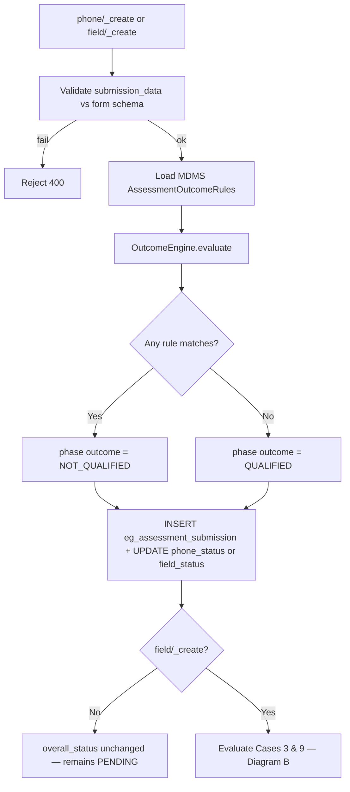

**Diagram B — Assessment result (`overall_status`) — Cases 3–9**

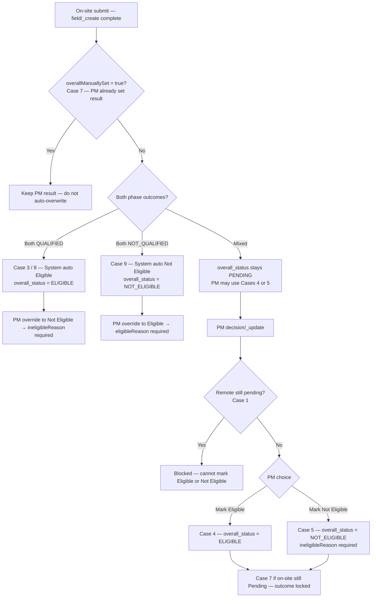

**Diagram C — Gates for assign on-site and PM manual result (Cases 1, 2, 4, 5, 6, 7)**

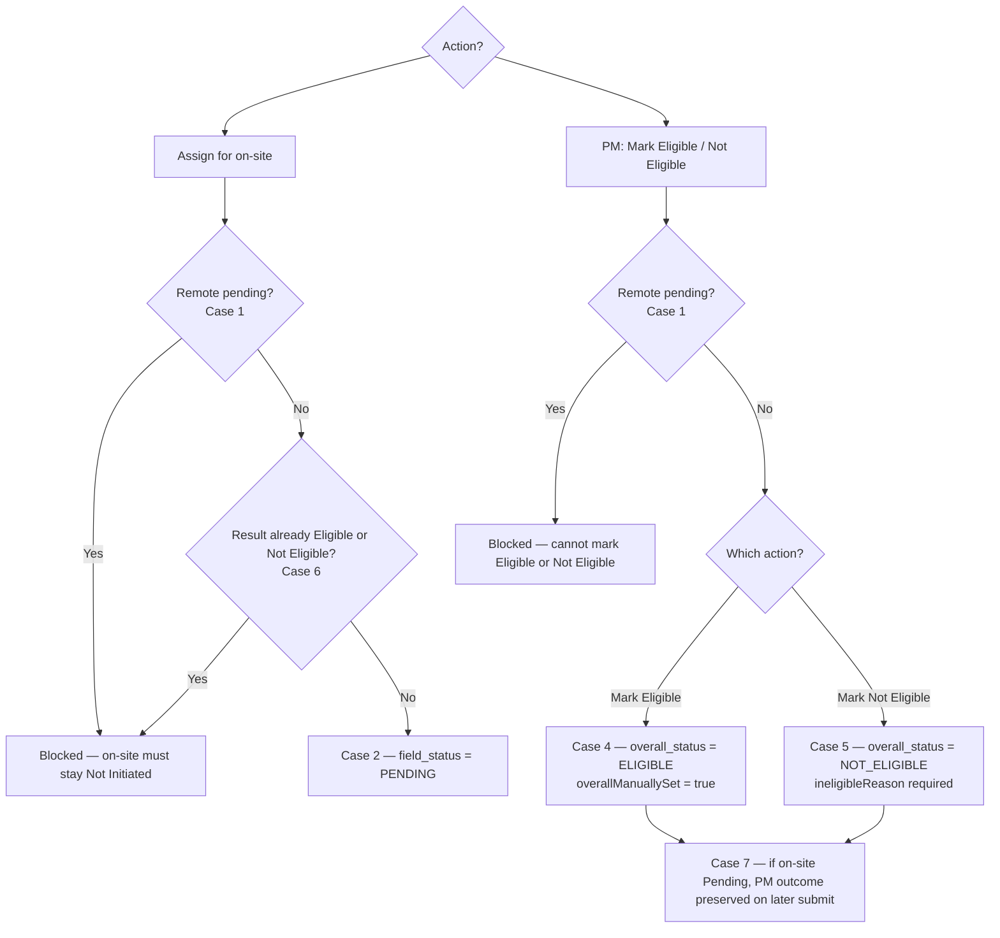

#### 2.7.4 field-planner-service components


| Component                     | Responsibility                                                                                                   |
| ----------------------------- | ---------------------------------------------------------------------------------------------------------------- |
| `MdmsFormSchemaClient`        | Fetch / cache `AssessmentFormSchema` by tenant + `formType`                                                      |
| `MdmsOutcomeRulesClient`      | Fetch / cache `AssessmentOutcomeRules` by tenant + `formType`                                                    |
| `OutcomeEngine`               | Apply operators to `submission_data`; return `QUALIFIED` or `NOT_QUALIFIED`; trigger Cases 3, 8, 9 on `field/_create` when applicable |
| `SubmissionService`           | Call engine inside `phone/_create` and `field/_create`; persist same value on submission + `facility_activities` |
| `PlanFacilityIncludeService`  | `_bulk-include` / `_bulk-create` — §2.2.9 reuse rules; R8 cross-project expire                                   |
| `PlanFacilityDecisionService` | `decision/_update` / `_bulk-update` — §2.2.2–§2.2.4, §2.2.6                                                      |


`POST /submission/form/_resolve` returns `formType` and full form **schema** from MDMS `AssessmentFormSchema`. Server maps `facilityCategory` + `assessmentPhase` → `formType` (§2.5) and validates they match the `planFacilityId` row.

#### 2.7.5 Outcomes vs workflow (ERS rules)


| Question                                          | Answer                                                                                                                                     |
| ------------------------------------------------- | ------------------------------------------------------------------------------------------------------------------------------------------ |
| Does `NOT_QUALIFIED` block remote/on-site submit? | No — submit already succeeded                                                                                                              |
| Does `NOT_QUALIFIED` block assign for on-site?    | No — Qualified **or** Not Qualified remote status allows assign (§2.2.2)                                                                   |
| Does `NOT_QUALIFIED` block Mark eligible?         | No — PM may still mark Eligible                                                                                                            |
| What gates assign for on-site?                    | §2.2.2 + Case 6                                                                                                                            |
| What gates field plan pick list?                  | `assessment_completion_status = ELIGIBLE`, `installation_field_plan_id IS NULL`, parent plan **marked complete** `CLOSED` (§2.2.5, §2.2.8) |
| What gates facility reuse?                        | §2.2.9 Rules R0–R8                                                                                                                         |
| Auto Eligible?                                    | Cases 3 & 8 when both phases `QUALIFIED` and PM has not manually set result (`overallManuallySet` ≠ true)                                   |
| Auto Not Eligible?                                | Case 9 when both phases `NOT_QUALIFIED` and PM has not manually set result                                                                  |


#### 2.7.6 Screen layout (reference: installation UI)


| Area                    | Assessment content                                                                                                                    |
| ----------------------- | ------------------------------------------------------------------------------------------------------------------------------------- |
| **Header**              | HF name (e.g. Bhadramal / PHC Khunti)                                                                                                 |
| **Summary box**         | District, block, category, plan name; **Phone / Field / Overall** status + outcome badges                                             |
| **Audit trail**         | Timeline: included in plan → phone submitted → ready for field set → field submitted → overall set (timestamps + actor)               |
| **Expandable sections** | **Phone assessment response** (+), **Field assessment response** (+) when exists — same UX as installation “Panel Summary” accordions |
| **Primary actions**     | Contextual buttons (see §2.7.7) — bottom or sticky footer                                                                             |


#### 2.7.7 Action buttons (same three as plan list bulk)


| Button (UI)            | Sets                            | Enabled when                                                                     | API                                                           |
| ---------------------- | ------------------------------- | -------------------------------------------------------------------------------- | ------------------------------------------------------------- |
| **Assign for on-site** | `field_status = PENDING`        | §2.2.2 (all three conditions + not Case 6)                                       | `decision/_update` `assignForField: true`                     |
| **Mark eligible**      | `overall_status = ELIGIBLE`     | §2.2.3 — not remote-pending (Case 1); modals §2.2.4; `eligibleReason` if overriding Case 9 (§2.2.6) | `overallStatus: ELIGIBLE`, `eligibleReason?`                  |
| **Mark not eligible**  | `overall_status = NOT_ELIGIBLE` | §2.2.3 — not remote-pending (Case 1); `ineligibleReason` required; mandatory override reason if both Q (Case 8) | `overallStatus: NOT_ELIGIBLE`, `ineligibleReason`, `remarks?` |


- Remote **Not Qualified** does **not** block assign for on-site (§2.2.2).
- **Mark not eligible** — reason required; stored reason visible on detail (ERS §6.2).

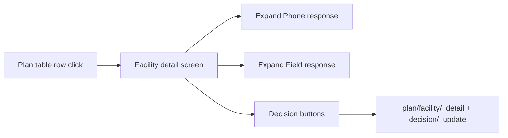


#### 2.7.8 Shared decision service

`PlanFacilityDecisionService` implements validation for:

- `POST /plan/facility/decision/_update` (one HF — detail screen)
- `POST /plan/facility/decision/_bulk-update` (many HFs — plan list)

**Download** export is read-only via **ingestion** (`assessmentPlanFacilityExport` → `plan/facility/_search` with `exportAll` + `includeResponseSummary`) — no upload path for PM decisions in accepted V2 UI.

---

## 3. APIs — field-planner-service (`AssessmentController`)

Base path: `/assessment/v1` — new controller in **field-planner-service** (separate from existing `/v1/field-plans`). API paths and request/response shapes below are unchanged; persistence maps to reused tables per §5.

### 3.1 Plans


| Method | Endpoint               | Purpose                       | What it does                                                                                                                                                                                                                                                                 |
| ------ | ---------------------- | ----------------------------- | ---------------------------------------------------------------------------------------------------------------------------------------------------------------------------------------------------------------------------------------------------------------------------- |
| POST   | `/plan/_create`        | Wizard step 1                 | `projectId`, name, **state**, start/end dates. Inserts `field_plans` with `plan_type = ASSESSMENT`, `geography_scope` from state, `selected_activities` = ASSESSMENT. Returns `planId` (= `field_plans.id`) for include template. Assessor assignment in `_update` (step 3). |
| POST   | `/plan/_search`        | Project → plan list           | All assessment plans for `projectId` (`field_plans` where `plan_type = ASSESSMENT`). Supports **multiple plans per project**.                                                                                                                                                |
| POST   | `/plan/_detail`        | Plan screen metric cards      | Counts from `facility_activities`; `canProceedToFieldPlan` per §2.2.5; plan metadata from `field_plans`.                                                                                                                                                                     |
| POST   | `/plan/_update`        | Wizard step 3                 | Remote Assessor + Field POC → `activity_assignments`. Name/dates on `field_plans`.                                                                                                                                                                                           |
| POST   | `/plan/_mark-complete` | Mark assessment plan complete | `planId`. Preconditions §2.2.8. Sets `field_plans.status = CLOSED`.                                                                                                                                                                                                          |


### 3.2 Plan facilities


| Method | Endpoint                                        | Purpose                                  | What it does                                                                                                                                     |
| ------ | ----------------------------------------------- | ---------------------------------------- | ------------------------------------------------------------------------------------------------------------------------------------------------ |
| POST   | `/plan/facility/_search`                        | Plan facility table + filters (+ export) | Paginated ASSESSMENT `facility_activities`. Returns `assessmentCompletionStatus`, `installationFieldPlanId`, `lastActionTime`, `allowedActions`. |
| POST   | `/plan/facility/_detail`                        | Facility detail screen                   | Submissions, audit trail, `allowedActions`; `ineligibleReason` / `eligibleReason` when set.                                                      |
| POST   | `/plan/facility/_bulk-include`                  | Wizard step 2 — grid include             | `planId`, `facilityIds[]`. Validates §2.2.9; cross-project eligible → `EXPIRED` (R8).                                                            |
| POST   | `/plan/facility/decision/_update`               | Detail screen — 3 actions                | `assignForField`, `overallStatus`, `eligibleReason`, `ineligibleReason`, `remarks`. Sets `overallManuallySet` on PM decisions.                   |
| POST   | `/plan/facility/decision/_bulk-update`          | List — bulk 3 actions                    | Same body per `planFacilityId[]`; partial success with per-row errors.                                                                           |
| POST   | `/internal/plan/facility/_bulk-create`          | Include apply (ingestion / internal)     | Same validation as `_bulk-include` (§2.2.9).                                                                                                     |
| POST   | `/internal/project/eligible-facilities/_search` | Field plan ingestion (multi-plan)        | `projectId`, optional `assessmentPlanIds[]`. Rows: `ELIGIBLE`, `installation_field_plan_id IS NULL`, parent plans **marked complete** (§2.2.8).  |
| POST   | `/internal/plan/passed-facilities/_search`      | Field plan ingestion (single plan)       | **Deprecated** — prefer `eligible-facilities/_search` with `assessmentPlanIds=[planId]`.                                                         |


`**PlanFacilityDecisionService` validation** (bulk + single) — see **§2.2.2–§2.2.4**:


| Action                 | Validation                                                                                                                           |
| ---------------------- | ------------------------------------------------------------------------------------------------------------------------------------ |
| **Assign for on-site** | §2.2.2 — remote Qualified or Not Qualified; on-site Not Initiated; result Pending; not Case 6                                        |
| **Mark eligible**      | §2.2.3 — block remote-pending; confirmation modals §2.2.4; `eligibleReason` if both outcomes `NOT_QUALIFIED` (§2.2.6)                |
| **Mark not eligible**  | Same as Mark eligible — block remote-pending (Case 1) + `ineligibleReason` required; override modal if both outcomes `QUALIFIED` (§2.2.6); sets `overallManuallySet` |


Updates `last_modified_time` / audit for **last action** column; PM decision also sets `additional_details.assessment.overallStatusSetTime`.

### 3.3 Submissions


| Method | Endpoint                               | Purpose                    | What it does                                                                                                                                                             |
| ------ | -------------------------------------- | -------------------------- | ------------------------------------------------------------------------------------------------------------------------------------------------------------------------ |
| POST   | `/submission/form/_resolve`            | Form type + schema         | Input: `planFacilityId`, `facilityCategory`, `assessmentPhase`. Server validates row + maps to `formType` (§2.5). Returns `formType` + full MDMS `AssessmentFormSchema`. |
| POST   | `/submission/queue/_search`            | Assessor queue             | Remote queue: `phone_status` ∈ {`PENDING`, `PENDING_NO_ANSWER`, `PENDING_WRONG_NUMBER`}. On-site queue: `field_status=PENDING`.                                          |
| POST   | `/submission/phone/_create`            | Remote submit (immutable)  | OutcomeEngine → `phone_status` + `phoneOutcome` = `QUALIFIED` or `NOT_QUALIFIED`. Rejects duplicate if already qualified.                                                |
| POST   | `/submission/phone/_unable-to-contact` | Unable to contact          | `reason` → `PENDING_WRONG_NUMBER` or `PENDING_NO_ANSWER` (§2.3.1).                                                                                                       |
| POST   | `/submission/field/_create`            | On-site submit (immutable) | Requires `field_status=PENDING`. OutcomeEngine → `QUALIFIED`/`NOT_QUALIFIED`; Case 3/8 → `overall_status=ELIGIBLE`; Case 9 → `overall_status=NOT_ELIGIBLE` when both phases align. |
| POST   | `/submission/_search`                  | PM read-only (optional)    | Prefer `**plan/facility/_detail`** for detail screen (submissions + audit + allowedActions). Legacy/search use: `planId` + `facilityId` or plan-wide export.             |


#### 3.3.1 Mobile request body (`form/_resolve`, `phone/_create`, `field/_create`)

**Resolve** sends `planFacilityId`, `facilityCategory`, `assessmentPhase` only.

**Create** adds `submissionData` (+ `submittedByName` on phone). Same id/category/phase on both calls.

```json
{
  "planFacilityId": "pf-uuid-123",
  "facilityCategory": "HEALTH",
  "assessmentPhase": "PHONE",
  "submissionData": {
    "solarViable": "NO",
    "connectedLoadKw": 8
  },
  "submittedByName": "Ramesh Kumar",
  "clientSubmissionTime": 1717000000000
}
```


| Field                  | Required     | Notes                                                                           |
| ---------------------- | ------------ | ------------------------------------------------------------------------------- |
| `planFacilityId`       | Yes          | PK of `facility_activities` (`activity_id` = ASSESSMENT) — from queue / resolve |
| `facilityCategory`     | Yes          | `HEALTH` or `ANGANWADI` — must match `facility_activities` row snapshot         |
| `assessmentPhase`      | Yes          | `PHONE` for `phone/_create`, `FIELD` for `field/_create`                        |
| `submissionData`       | Yes          | Answers keyed by MDMS `fieldCode`                                               |
| `submittedByName`      | Yes on phone | Assessor name (PRD)                                                             |
| `clientSubmissionTime` | No           | Device epoch ms                                                                 |


**Server-side (not sent by mobile):** `form_type` from §2.5 mapping; `plan_id` (= `field_plans.id`), `facility_id` from `planFacilityId` lookup on `facility_activities`.

### 3.4 After assessment — REUSE existing field plan (with ingestion changes)

**Field plan** (installation planning) **already exists**. PM: create installation field plan under project → pick facilities from **one or more marked-complete assessment plans** → assign users.

**Eligibility rule:** Field-plan pick list uses `assessment_completion_status = ELIGIBLE`, `installation_field_plan_id IS NULL`, and parent assessment plan(s) **marked complete** (`field_plans.status = CLOSED`, §2.2.8). Handoff keyed by `**planFacilityId`**.

**Facility entering another field plan from a prior installation cycle:** source installation field plan must be **marked complete** (§2.2.9 R0, R7).

**Multi-plan:** Same project may contribute eligibles from Assessment Plan A and Plan B into one installation field plan (§2.2.7).

**Proceed gate (per assessment plan):** See §2.2.5 — `canProceedToFieldPlan` on each plan’s `plan/_detail`.

**Today (without change):** `fieldplanFacilityIngestionTemplate` loads **all project-linked** facilities in geography — **wrong** for post-assessment flow.

**What assessment module adds:**


| Piece                  | Implementation                                                     | What it does                                                                                      |
| ---------------------- | ------------------------------------------------------------------ | ------------------------------------------------------------------------------------------------- |
| Eligible-facility list | `POST /assessment/v1/internal/project/eligible-facilities/_search` | Project-level pool; optional `assessmentPlanIds[]`; excludes handed off / expired / pending plans |
| Handoff on apply       | field-planner + assessment service                                 | Set `MOVED_TO_FIELD_PLAN`, `installation_field_plan_id` on `facility_activities` (§2.2.7)         |
| Ingestion download     | **Extend** `fieldplanFacilityIngestionTemplate`                    | `assessmentPlanIds[]` (or `projectId` + completed plans) → eligible-facilities API                |
| Ingestion validate     | **Extend** `fieldPlanfacilitiesValidateData`                       | Row must match `planFacilityId` still `ELIGIBLE` and unassigned; **Solution Design Type** ∈ MDMS  |
| Ingestion apply        | **Extend** `createFieldPlanFacility`                               | Handoff update + field-planner create                                                             |
| PRD fields             | Solution Design Type + System Type                                 | **Solution Design Type** editable dropdown (MDMS).                                                |


**UI:** Field-plan facility step passes `projectId`, `fieldplanId`, and `**assessmentPlanIds[]`** (one or more) into ingestion download payload.

---

## 4. APIs — ingestion-service

### 4.1 Existing project facility Excel (extended — reuse validation)

Used on **project** screen to link facilities to a project. **Not** used for “Include in Assessment Plan”.

**On validate/apply:** For each facility already on another project, call assessment reuse checks (**§2.2.9**): source assessment plans and installation field plans must be `CLOSED` (R0); no ongoing assessment (R5); no ongoing installation field plan (R6). Cross-project link alone does not expire assessment rows — expiry happens on assessment include in target project (R8).


| Flow               | Endpoint                                                             | Step     | What it does                                                         |
| ------------------ | -------------------------------------------------------------------- | -------- | -------------------------------------------------------------------- |
| Project facilities | `POST /ingestion-service/template/facilityIngestionTemplateWithData` | Download | Facilities by project **geography** + marks include-in-project.      |
| Project facilities | `POST /ingestion-service/ingest/facilitiesValidateData`              | Validate | Existing validation + **§2.2.9** reuse rules for cross-project link. |
| Project facilities | `POST /ingestion-service/ingest/createFacilityAndUpdateProject`      | Apply    | Links facility to **project** if reuse validation passes.            |


### 4.2 Assessment plan — include facilities (optional Excel; wizard uses grid)

**Primary (wizard):** `POST /plan/facility/_bulk-include` — grid multi-select (§2.0.1, §2.2.9).

**Optional bulk (offline):** ingestion Excel for large includes. Source of rows: project-service `project/facility` search for `projectId`.


| Flow            | Endpoint                                                           | Step     | What it does                                                                             |
| --------------- | ------------------------------------------------------------------ | -------- | ---------------------------------------------------------------------------------------- |
| Include in plan | `POST /ingestion-service/template/assessmentPlanIncludeTemplate`   | Download | Optional. `projectId`, `planId`. Project-linked facilities + **Include (Yes/No)**.       |
| Include in plan | `POST /ingestion-service/ingest/assessmentPlanIncludeValidateData` | Validate | Optional. Project membership; Yes/No valid.                                              |
| Include in plan | `POST /ingestion-service/ingest/assessmentPlanIncludeApply`        | Apply    | Calls `internal/plan/facility/_bulk-create` (same §2.2.9 validation as `_bulk-include`). |


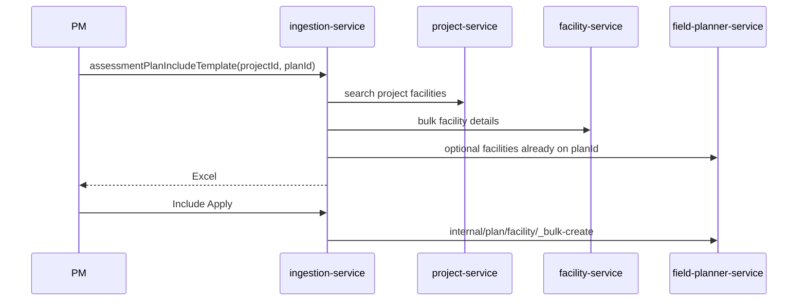


### 4.3 Plan facility export (download only — ingestion-service)

Same pattern as `assessmentPlanIncludeTemplate` and `fieldplanFacilityIngestionTemplate`: **PM Download → ingestion builds Excel**; assessment supplies data.

Accepted V2 UI: PM decisions via `**decision/_update`** / `**decision/_bulk-update`**, not Excel re-upload.


| Flow     | Endpoint                                                        | What it does                                                                                                                                                                                                                                                                                                               |
| -------- | --------------------------------------------------------------- | -------------------------------------------------------------------------------------------------------------------------------------------------------------------------------------------------------------------------------------------------------------------------------------------------------------------------- |
| Download | `POST /ingestion-service/template/assessmentPlanFacilityExport` | Request: `planId`, optional filters (category, HF type, district, phone status, site visit status, assessment decision). Calls assessment `POST /plan/facility/_search` with same filters + `exportAll=true` + `includeResponseSummary=true`. Builds read-only `.xlsx` per §2.0.3 columns. Excel job logging in ingestion. |


`**_search` request when called from ingestion export:**

```json
{
  "planId": "...",
  "filters": {
    "facilityCategory": "...",
    "facilityType": "...",
    "district": "...",
    "phoneStatus": "...",
    "fieldStatus": "...",
    "overallStatus": "..."
  },
  "exportAll": true,
  "includeResponseSummary": true
}
```

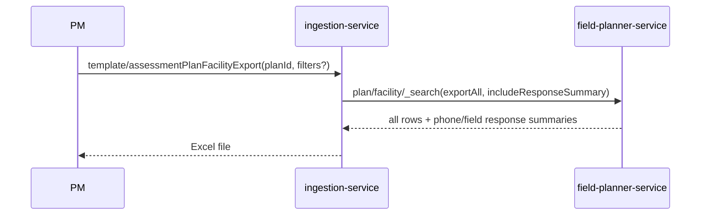


**Assessment** formats response summaries from `submission_data` + MDMS labels when `includeResponseSummary=true`. **Ingestion** only maps rows to Excel cells.

### 4.4 Field plan facility ingestion (extend existing — multi-plan eligible pool)

**Do not create a new template name** unless UI prefers it; **extend** existing field-plan ingestion with assessment gating and **multi-plan** support.

**Excel template change:** **Solution Design Type** column = editable dropdown (MDMS `solar_solution_design_type`). Include **Assessment Plan name** and `**planFacilityId`** (hidden or validation column) when sourcing from multiple assessment plans.


| Flow     | Endpoint (existing)                                                   | Change                                                                                                                                                                                                                                                                                                                                                |
| -------- | --------------------------------------------------------------------- | ----------------------------------------------------------------------------------------------------------------------------------------------------------------------------------------------------------------------------------------------------------------------------------------------------------------------------------------------------- |
| Download | `POST /ingestion-service/template/fieldplanFacilityIngestionTemplate` | `**assessmentPlanIds[]`** (or `projectId` + all completed plans): call `internal/project/eligible-facilities/_search` → rows only for `ELIGIBLE` + unassigned `planFacilityId`s. Pre-mark facilities already on installation field plan. **When no assessment context:** keep today’s project-geography behaviour. **Solution Design Type** dropdown. |
| Validate | `POST /ingestion-service/ingest/fieldPlanfacilitiesValidateData`      | Row must match live `planFacilityId` with `assessment_completion_status = ELIGIBLE` and `installation_field_plan_id IS NULL`. **Solution Design Type** ∈ MDMS.                                                                                                                                                                                        |
| Apply    | `POST /ingestion-service/ingest/createFieldPlanFacility`              | Create `field_plan_facilities` + **handoff** update on assessment row (`MOVED_TO_FIELD_PLAN`, §2.2.7).                                                                                                                                                                                                                                                |


**Download request payload (extended):**

```json
{
  "project_id": "...",
  "fieldplan_id": "...",
  "assessmentPlanIds": ["plan-A-uuid", "plan-B-uuid"],
  "boundary_data": { }
}
```

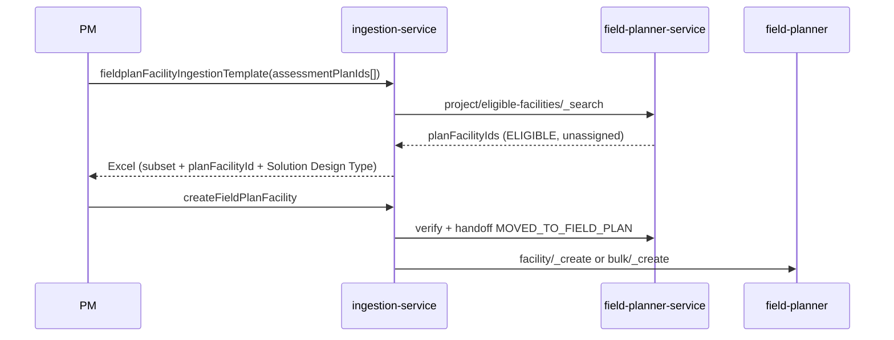


**Eligible pool examples:**


| HF         | Plan | assessment_completion_status      | installation_field_plan_id | In field-plan pick? |
| ---------- | ---- | --------------------------------- | -------------------------- | ------------------- |
| PHC Khunti | A    | ELIGIBLE                          | NULL                       | Yes                 |
| SC Murhu   | A    | MOVED_TO_FIELD_PLAN               | field-plan-X               | No                  |
| SC Tamar   | A    | EXPIRED (moved to Project 2 — R8) | NULL                       | No                  |
| AWC Ranchi | B    | ELIGIBLE                          | NULL                       | Yes (multi-plan OK) |


Excel job logging stays in **ingestion-service** (existing).

---

## 5. Data model — table definitions

No `eg_assessment_project` table. `project_id` references project service `project.id`.

**Reuse strategy:** Assessment reuses `field_plans` (`plan_type = ASSESSMENT`), ASSESSMENT rows on `facility_activities` (workflow + handoff + completion status), and `activity_assignments`. New table: `eg_assessment_submission` only. **No** separate `assessment_plans` or `eg_assessment_plan_facility` table.


| LLD concept                        | Physical table(s)                                                         |
| ---------------------------------- | ------------------------------------------------------------------------- |
| Assessment plan                    | `field_plans` (`plan_type = ASSESSMENT`)                                  |
| Plan–facility workflow + handoff   | `facility_activities` (activity `ASSESSMENT`) + `activities`              |
| Installation field plan ↔ facility | `field_plan_facilities` + `facility_activities` (installation activities) |
| Remote Assessor / Field POC        | `activity_assignments`                                                    |
| Form submissions                   | `eg_assessment_submission` (**new**)                                      |


**API id mapping:** `planId` = assessment `field_plans.id`; `planFacilityId` = ASSESSMENT `facility_activities.id`; `assessmentPlanIds[]` in ingestion = one or more assessment `field_plans.id`; `installationFieldPlanId` = installation `field_plans.id` on handoff column.

Assessment include creates ASSESSMENT `facility_activities` rows directly (not `field_plan_facilities`). Installation uses `field_plan_facilities` when facilities are added to an installation field plan.

---

### 5.1 Assessment plan → `field_plans`

One assessment cycle under a project. Stored as a `field_plans` row with `**plan_type = ASSESSMENT`** (new column) so assessment plans are not mixed with installation field plans in list/search.

**Existing columns used:**


| Column                                                                 | Assessment usage                                                |
| ---------------------------------------------------------------------- | --------------------------------------------------------------- |
| `id`                                                                   | PK — exposed as `planId`                                        |
| `tenant_id`                                                            | Tenant                                                          |
| `project_id`                                                           | FK → project.id (logical)                                       |
| `name`                                                                 | Plan name                                                       |
| `start_date` / `end_date`                                              | Wizard dates                                                    |
| `geography_scope`                                                      | JSONB — state from wizard step 1, e.g. `{"state": "Jharkhand"}` |
| `selected_activities`                                                  | JSONB — e.g. `[{"code": "ASSESSMENT"}]`                         |
| `health_facility_number`                                               | Set `0` on create; update count after include apply             |
| `status`                                                               | `ACTIVE` / `CLOSED`                                             |
| `created_by`, `last_modified_by`, `created_time`, `last_modified_time` | Audit                                                           |
| `additional_details`                                                   | Optional assessment-specific metadata if needed                 |


**New column (migration):**


| Column      | Type          | Nullable | Description                                                                  |
| ----------- | ------------- | -------- | ---------------------------------------------------------------------------- |
| `plan_type` | `VARCHAR(32)` | NO       | `ASSESSMENT` for assessment plans; `FIELD_PLAN` for installation field plans |


**Assessor assignment** is **not** stored on `field_plans`. Remote Assessor and Field POC are `activity_assignments` rows on the plan (§5.3).

**Constraints:** `UNIQUE (tenant_id, project_id, name)` (recommended)

**Indexes:** `(project_id)`, `(tenant_id, status)`, `(tenant_id, project_id, plan_type)`

---

### 5.2 Plan facility → `facility_activities` + `activities`

**Activity master:** seed one row in `activities` (migration), e.g. `code = ASSESSMENT`, `name = Assessment`, with `required_roles` listing `ENUMERATOR` and `FIELD_POC`.

One `**facility_activities`** row per facility per assessment plan (`activity_id` = ASSESSMENT, `field_plan_id` = assessment plan id). **Workflow** (`phone_status`, `field_status`, `overall_status`), **enrollment lifecycle** (`assessment_completion_status`), and **installation handoff** (`installation_field_plan_id`) live on this row. See §2.2.7–§2.2.9.

**Column naming:** `field_plan_id` on ASSESSMENT rows = **assessment** plan FK. `installation_field_plan_id` = **installation** field plan FK after handoff — do not conflate the two.

**Existing columns used:**


| Column                                                   | Assessment usage                                                             |
| -------------------------------------------------------- | ---------------------------------------------------------------------------- |
| `id`                                                     | PK — exposed as `planFacilityId`                                             |
| `tenant_id`                                              | Tenant                                                                       |
| `field_plan_id`                                          | FK → `field_plans.id` (assessment plan)                                      |
| `facility_id`                                            | Facility master id                                                           |
| `activity_id`                                            | FK → `activities.id` where `code = ASSESSMENT`                               |
| `created_time`, `last_modified_time`, `last_modified_by` | Audit                                                                        |
| `additional_details`                                     | Assessment workflow extras (see below) — **merge on update, do not replace** |
| `status`                                                 | Installation lifecycle only — **leave null/unused** for assessment rows      |


**New columns (migration) — workflow + handoff:**


| Column                         | Type          | Nullable | Default    | Description                                                                              |
| ------------------------------ | ------------- | -------- | ---------- | ---------------------------------------------------------------------------------------- |
| `phone_status`                 | `VARCHAR(32)` | YES      | `PENDING`  | `PENDING` / `PENDING_NO_ANSWER` / `PENDING_WRONG_NUMBER` / `QUALIFIED` / `NOT_QUALIFIED` |
| `field_status`                 | `VARCHAR(32)` | YES      | NULL       | `NULL` (Not Initiated) / `PENDING` / `QUALIFIED` / `NOT_QUALIFIED`                       |
| `overall_status`               | `VARCHAR(32)` | NO       | `PENDING`  | `PENDING` / `ELIGIBLE` / `NOT_ELIGIBLE` — default `PENDING` on include                   |
| `assessment_completion_status` | `VARCHAR(32)` | NO       | `ENROLLED` | `ENROLLED` / `ELIGIBLE` / `NOT_ELIGIBLE` / `MOVED_TO_FIELD_PLAN` / `EXPIRED` — §2.2.7    |
| `installation_field_plan_id`   | `VARCHAR(64)` | YES      | NULL       | FK → installation `field_plans.id` (`plan_type = FIELD_PLAN`); set on handoff            |
| `field_plan_facility_id`       | `VARCHAR(64)` | YES      | NULL       | FK → `field_plan_facilities.id` after apply (optional traceability)                      |


`**additional_details.assessment` JSON** (set at include / submit / PM decision):


| JSON key               | API field               | Description                                                                                     |
| ---------------------- | ----------------------- | ----------------------------------------------------------------------------------------------- |
| `phoneOutcome`         | —                       | `QUALIFIED` / `NOT_QUALIFIED` (mirror on submit)                                                |
| `fieldOutcome`         | —                       | `QUALIFIED` / `NOT_QUALIFIED` (mirror on submit)                                                |
| `overallManuallySet`   | —                       | `true` when PM sets Eligible / Not Eligible (Case 7)                                            |
| `eligibleReason`       | `eligible_reason`       | Required when PM marks Eligible and both outcomes `NOT_QUALIFIED` (§2.2.6)                      |
| `eligibleRemarks`      | `eligible_remarks`      | Optional PM remarks for eligible override                                                       |
| `ineligibleReason`     | `ineligible_reason`     | Required when PM marks not eligible; mandatory override when both outcomes `QUALIFIED` (§2.2.6) |
| `ineligibleRemarks`    | `ineligible_remarks`    | Optional PM remarks (V2)                                                                        |
| `overallStatusSetBy`   | `overall_status_set_by` | User id (PM)                                                                                    |
| `overallStatusSetTime` | —                       | Epoch ms — drives **last action** in UI when overall set                                        |
| `facilityCategory`     | `facility_category`     | `HEALTH` / `ANGANWADI` snapshot at include                                                      |
| `facilityType`         | `facility_type`         | HF type snapshot — filter + export                                                              |
| `district`             | `district`              | Snapshot for filter + export                                                                    |
| `block`                | `block`                 | Snapshot for export                                                                             |


Example:

```json
{
  "assessment": {
    "phoneOutcome": "QUALIFIED",
    "fieldOutcome": "NOT_QUALIFIED",
    "overallManuallySet": false,
    "eligibleReason": null,
    "eligibleRemarks": null,
    "ineligibleReason": null,
    "ineligibleRemarks": null,
    "overallStatusSetBy": "pm-user-uuid",
    "overallStatusSetTime": 1717000000000,
    "facilityCategory": "HEALTH",
    "facilityType": "PHC",
    "district": "Khunti",
    "block": "Murhu"
  }
}
```

`project_id` is not denormalized on `facility_activities` — join via `field_plans.project_id` when needed.

**Constraints:** existing unique index `(tenant_id, facility_id, activity_id, field_plan_id)` — one ASSESSMENT row per facility per assessment plan.

**Indexes (recommended, partial on assessment rows or filter by `activity_id`):** `(field_plan_id, phone_status)`, `(field_plan_id, field_status)`, `(field_plan_id, overall_status)`, `(field_plan_id, assessment_completion_status)`, `(facility_id)`, `(installation_field_plan_id)` WHERE NOT NULL

**Check constraints (recommended, app-enforced for JSON fields):**

- `phone_status IN ('PENDING','PENDING_NO_ANSWER','PENDING_WRONG_NUMBER','QUALIFIED','NOT_QUALIFIED')`
- `field_status IS NULL OR field_status IN ('PENDING','QUALIFIED','NOT_QUALIFIED')`
- `overall_status IN ('PENDING','ELIGIBLE','NOT_ELIGIBLE')`
- `assessment_completion_status IN ('ENROLLED','ELIGIBLE','NOT_ELIGIBLE','MOVED_TO_FIELD_PLAN','EXPIRED')`
- `phoneOutcome` / `fieldOutcome`: `QUALIFIED` / `NOT_QUALIFIED`
- Handoff: `MOVED_TO_FIELD_PLAN` ⇒ `installation_field_plan_id IS NOT NULL`; `ELIGIBLE` ⇒ `installation_field_plan_id IS NULL`

---

### 5.3 Assessor assignment → `activity_assignments`

Remote Assessor (phone) and Field POC (on-site) are plan-level assignments using the **existing** `activity_assignments` table (no new columns required).


| Role (in `role` JSONB) | Cardinality  | Maps to UI (ERS)        |
| ---------------------- | ------------ | ----------------------- |
| `ENUMERATOR`           | One per plan | Remote Assessor         |
| `FIELD_POC`            | One per plan | Field POC / On-site POC |


Written by `POST /plan/_update` (wizard step 3). Queue search (`submission/queue/_search`) resolves assessor scope from these rows.

Existing columns used: `field_plan_id`, `activity_id` (ASSESSMENT), `assigned_to`, `role`, `poc_number`, `start_date`, `end_date`, `status`, audit fields.

---

### 5.4 `eg_assessment_submission` (new table)

Immutable form submission (phone or field). **No UPDATE** after insert.


| Column                   | Type           | Nullable | Default | Description                                                                                                    |
| ------------------------ | -------------- | -------- | ------- | -------------------------------------------------------------------------------------------------------------- |
| `id`                     | `VARCHAR(64)`  | NO       | —       | PK                                                                                                             |
| `tenant_id`              | `VARCHAR(64)`  | NO       | —       | Tenant                                                                                                         |
| `plan_id`                | `VARCHAR(64)`  | NO       | —       | FK → `field_plans.id`                                                                                          |
| `plan_facility_id`       | `VARCHAR(64)`  | NO       | —       | FK → `facility_activities.id`                                                                                  |
| `facility_id`            | `VARCHAR(64)`  | NO       | —       | Facility id                                                                                                    |
| `assessment_phase`       | `VARCHAR(16)`  | NO       | —       | `PHONE` / `FIELD`                                                                                              |
| `form_type`              | `VARCHAR(64)`  | NO       | —       | `HF_PHONE`, `HF_FIELD`, `AWC_PHONE`, `AWC_FIELD` — set by server from category + phase                         |
| `submitted_by`           | `VARCHAR(64)`  | NO       | —       | User id                                                                                                        |
| `submitted_by_name`      | `VARCHAR(256)` | YES      | NULL    | Mandatory for phone (PRD)                                                                                      |
| `submission_data`        | `JSONB`        | NO       | —       | Answers + repeatable sections                                                                                  |
| `outcome`                | `VARCHAR(32)`  | NO       | —       | `QUALIFIED` / `NOT_QUALIFIED` — OutcomeEngine (§2.7); copied to phase status + `phoneOutcome` / `fieldOutcome` |
| `client_submission_time` | `BIGINT`       | YES      | NULL    | Device timestamp                                                                                               |
| `server_received_time`   | `BIGINT`       | NO       | —       | Server timestamp                                                                                               |
| `created_time`           | `BIGINT`       | NO       | —       | Insert time                                                                                                    |


**Constraints:** `UNIQUE (plan_facility_id, assessment_phase)` — one phone + one field per plan facility

**Indexes:** `(plan_id)`, `(plan_facility_id)`, `(facility_id, assessment_phase)`