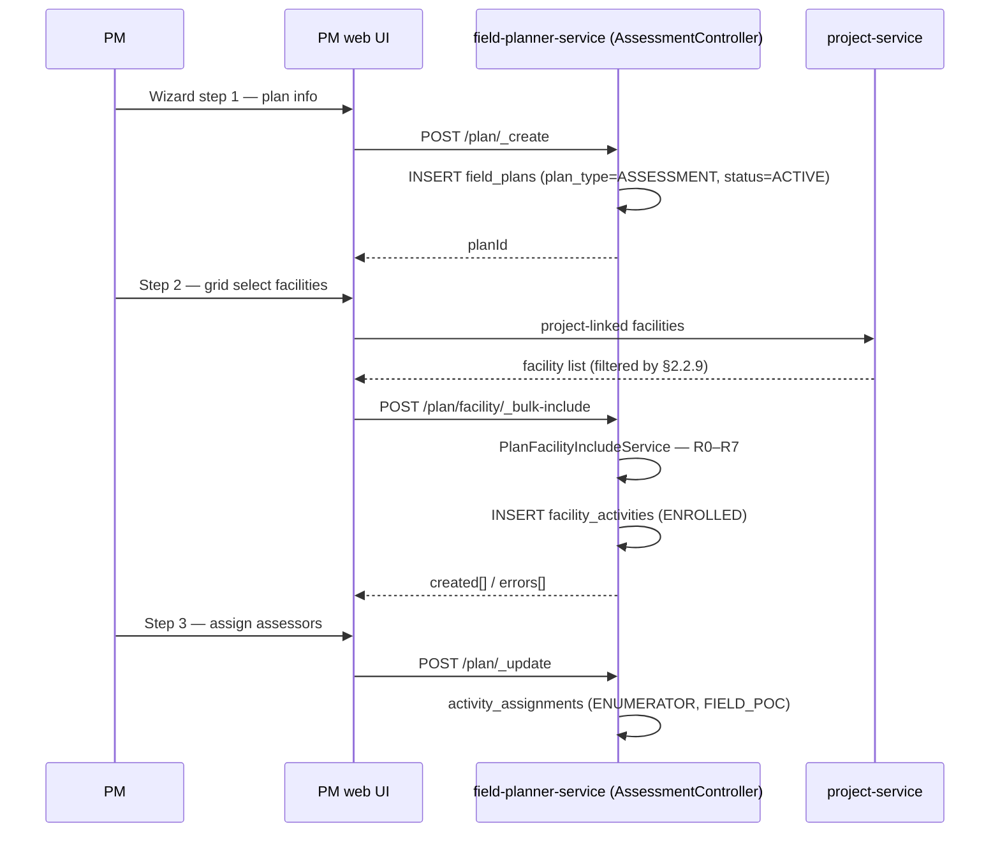
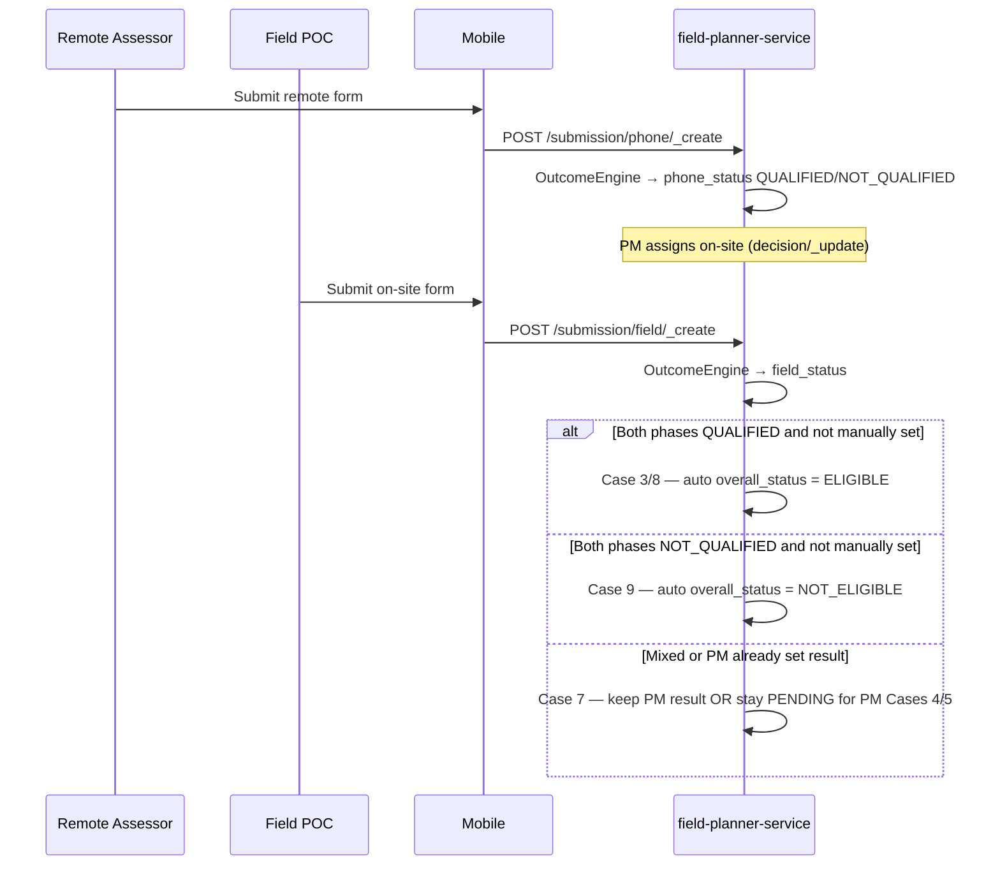
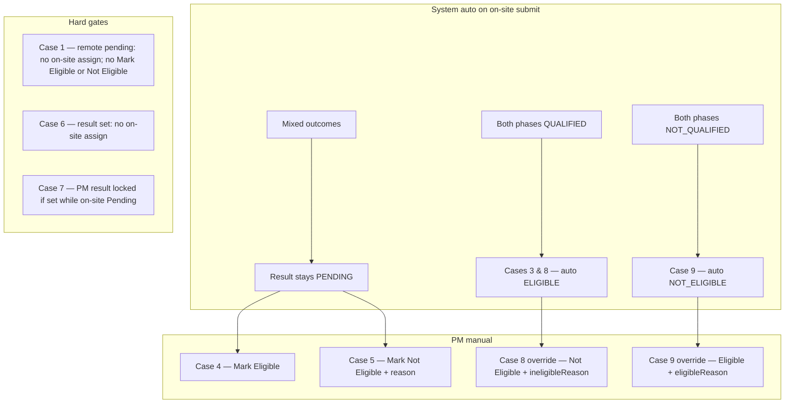
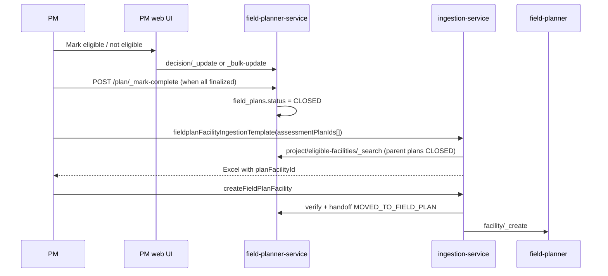
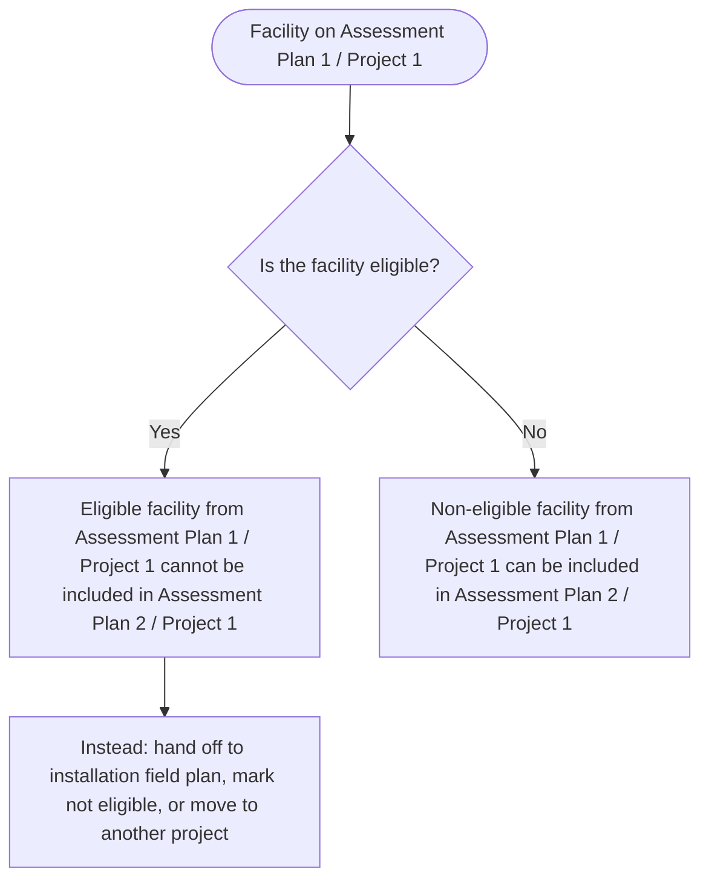
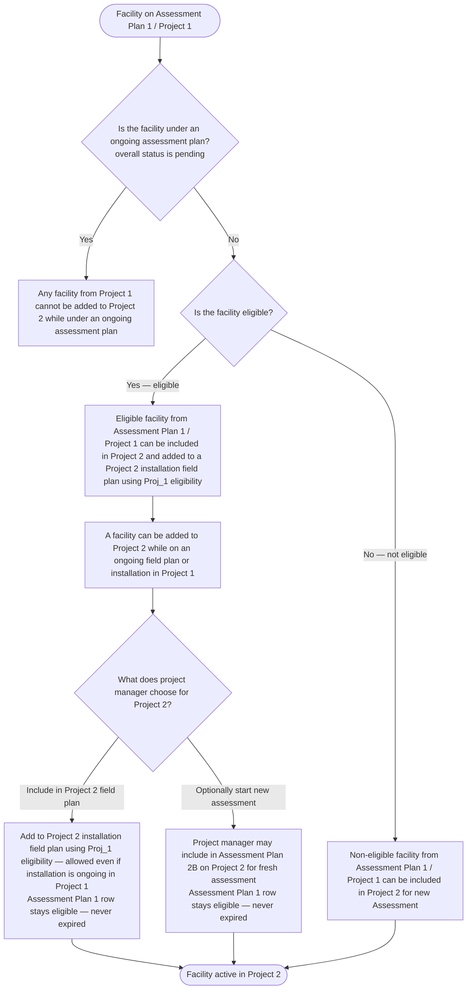
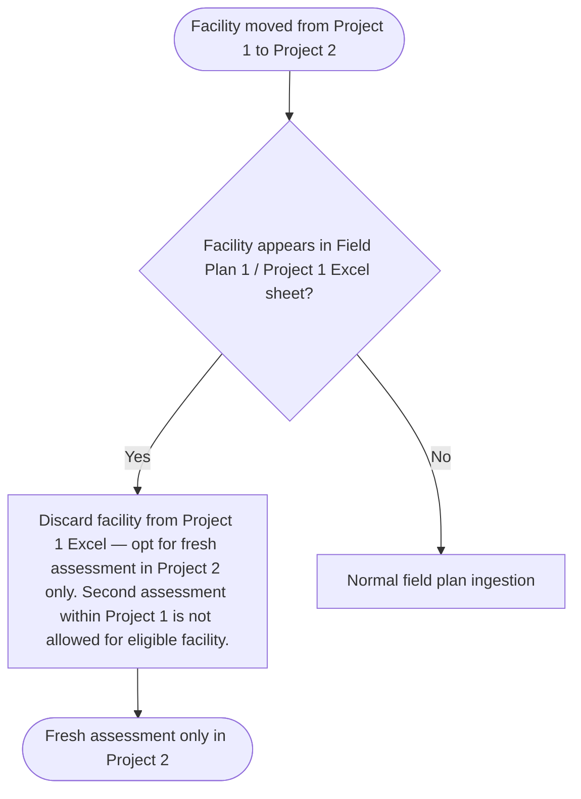

# Assessment Module — Sequence Diagrams

Companion to `ASSESSMENT_MODULE_LLD 1.md`. Persistence: `field_plans`, `facility_activities` (ASSESSMENT), `eg_assessment_submission`.

**Facility reuse rules (§2.2.9):** see **§8** — three flows for Rules 1–9 (same project AP, cross-project, Excel edge case); §§4–7 are worked examples.

---

## 1. Create assessment plan (wizard)




**Optional:** ingestion `assessmentPlanIncludeApply` → `internal/plan/facility/_bulk-create` (same §2.2.9 validation).

---

## 2. Remote + on-site assessment




---

## 2b. Assessment result — eligibility cases (§2.2.1)

Full decision logic: `ASSESSMENT_MODULE_LLD 1.md` §2.2.1 (Cases 1–9) and §2.7.3 Diagrams A–C.



---

## 3. PM decisions + field plan handoff (multi-plan)




---

## 4. Same project — eligible blocked from second assessment plan (R1)

```mermaid
sequenceDiagram
  participant PM
  participant Web as PM web UI
  participant Asm as field-planner-service

  Note over PM,Asm: Plan A: PHC Khunti is ELIGIBLE, not on any FP
  PM->>Web: Create Plan B (same project); include PHC Khunti
  Web->>Asm: POST /plan/facility/_bulk-include
  Asm->>Asm: R1 — same-project eligible unassigned
  Asm-->>Web: 400 ASSESSMENT_FACILITY_ELIGIBLE_ACTIVE
```


PM must hand off to installation field plan, mark not eligible, or (after marking Plan A complete) move facility to **another project** per §2.2.9 R3.

---

## 5. Same project — not eligible re-assessment (R2)

```mermaid
sequenceDiagram
  participant PM
  participant Web as PM web UI
  participant Asm as field-planner-service

  Note over PM,Asm: Plan A: AWC Murhu NOT_ELIGIBLE
  PM->>Asm: POST /plan/_mark-complete (Plan A)
  PM->>Web: Create Plan B; include AWC Murhu
  Web->>Asm: POST /plan/facility/_bulk-include
  Asm->>Asm: R0 pass (Plan A CLOSED); INSERT new ENROLLED row
  Asm-->>Web: created[] — Plan A row unchanged
```


---

## 6. Cross project — eligible carries forward (R3, Rule 8)

```mermaid
sequenceDiagram
  participant PM
  participant Web as PM web UI
  participant Asm as field-planner-service
  participant Ing as ingestion-service
  participant FP as field-planner
  participant Prj as project-service

  Note over PM,Asm: Plan A / Project 1: PHC Khunti ELIGIBLE (may be on Field Plan X in Proj_1)
  PM->>Asm: POST /plan/_mark-complete (Plan A)
  PM->>Prj: Link PHC Khunti to Project 2 (§2.2.9 validate)

  alt Include in Project 2 field plan (FP_1B)
    PM->>Ing: createFieldPlanFacility on Project 2
    Ing->>Asm: verify eligible — reuse Proj_1 eligibility
    Ing->>FP: facility/_create on Field Plan B
    Note over Asm: Plan A row stays ELIGIBLE — never EXPIRED
  else PM optionally starts fresh assessment (AP_2B)
    PM->>Web: Create Plan C on Project 2; include PHC Khunti
    Web->>Asm: POST /plan/facility/_bulk-include
    Asm->>Asm: INSERT Plan C row → ENROLLED
    Note over Asm: Plan A row still ELIGIBLE — not expired
    Asm-->>Web: created[]
  end
```


---

## 7. Post-installation — new project cycle (R7)

```mermaid
sequenceDiagram
  participant PM
  participant FP as field-planner
  participant Asm as field-planner-service
  participant Prj as project-service

  Note over PM,FP: Facility was MOVED_TO_FIELD_PLAN on FP X
  PM->>FP: Complete installation + report reviewed
  PM->>FP: Mark field plan complete (status=CLOSED)
  PM->>Prj: Link facility to new project (R0–R5, R7 pass)
  PM->>Asm: Include in new assessment plan on new project
  Asm->>Asm: INSERT fresh ENROLLED row; prior rows historical
```


---

## 8. Facility reuse — decision flow (§2.2.9)

Applies to `**_bulk-include**`, **field-plan ingestion apply**, and **project facility link** (`createFacilityAndUpdateProject`).

> Assessment result of a facility in **Proj_1** is valid for **Proj_2**. Eligible status in **Proj_1 / AP_1** is never marked expired on cross-project reuse.

### 8.1 Same project — include in Assessment Plan 2 / Project 1 (Rules 1 & 2)

Facility is on **Assessment Plan 1 / Project 1**. Project manager tries to include it in **Assessment Plan 2 / Project 1**.




### 8.2 Different project — add facility to Project 2 (Rules 3–8)

Facility is on **Assessment Plan 1 / Project 1**. Project manager tries to add it to **Project 2**.




### 8.3 Field-plan Excel — Project 1 sheet after cross-project move (Rule 9)

Facility was moved from **Project 1** to **Project 2**. Project manager uploads **Field Plan 1 / Project 1** Excel that still lists the facility.




### Rules 1–9 (from LLD)


| Rule  | Condition                                                                       | Outcome                                                                                                                                                            |
| ----- | ------------------------------------------------------------------------------- | ------------------------------------------------------------------------------------------------------------------------------------------------------------------ |
| **1** | Eligible facility from AP_1/Proj_1 → AP_2/Proj_1                                | **Reject**                                                                                                                                                         |
| **2** | Not-eligible facility from AP_1/Proj_1 → AP_2/Proj_1                            | **Allow**                                                                                                                                                          |
| **3** | Eligible facility from AP_1/Proj_1 → Proj_2                                     | **Allow** — may go to Proj_2 field plan using Proj_1 eligibility, including while on ongoing FP in Proj_1                                                          |
| **4** | Not-eligible facility from AP_1/Proj_1 → Proj_2                                 | **Allow**                                                                                                                                                          |
| **5** | Add to Proj_2 while `overall_status = PENDING` on an assessment plan            | **Reject**                                                                                                                                                         |
| **6** | Add to Proj_2 while on an ongoing field plan in Proj_1                          | **Allow**                                                                                                                                                          |
| **7** | New assessment or new field plan in **Proj_1** after a prior installation cycle | **Available** in Proj_1 only after installation completes and report is reviewed. Does **not** block inclusion in **Proj_2** field plan during Proj_1 installation |
| **8** | Eligible facility from Proj_1/AP_1 linked to Proj_2                             | **Never expired** in AP_1; PM may optionally start Proj_2 assessment                                                                                               |
| **9** | Facility in Proj_2, then listed in FP_1/Proj_1 Excel                            | **Discard** Proj_1 row; use Proj_2 only                                                                                                                            |


---

## Participants


| Participant                                  | Role                                                                           |
| -------------------------------------------- | ------------------------------------------------------------------------------ |
| PM                                           | Project manager (web)                                                          |
| PM web UI                                    | Assessment plan screens (reuses field plan creation wizard for §1)             |
| ingestion-service                            | Excel export / field-plan ingestion                                            |
| field-planner-service (AssessmentController) | `/assessment/v1` — plans, `facility_activities`, submissions, handoff          |
| MDMS                                         | `AssessmentFormSchema`, `AssessmentOutcomeRules`, `solar_solution_design_type` |
| Mobile                                       | Remote Assessor / Field POC (`ENUMERATOR`, `FIELD_POC`)                        |
| project-service                              | Project-linked facility list                                                   |
| facility-service                             | Facility master enrichment                                                     |
| field-planner                                | Installation field plan (`/v1/field-plans`)                                    |


