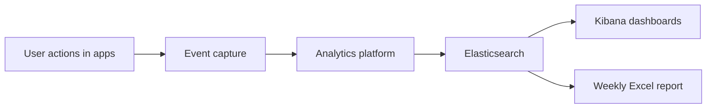

# E4H User Activity Analytics — Business Service

> **Service name:** E4H User Activity Analytics  
> **Purpose:** Measure adoption, engagement, and usage across E4H applications; identify Champion Users; deliver weekly leadership reporting.  
> **Related docs:** `E4H_User_Activity_Analytics_LLD.md`, `E4H_User_Activity_Analytics_Flow_Diagrams.md`  
> **Requirements source:** `Analytics & User Adoption Tracking Requirements – Requirement Summary.pdf`

---

## 1. What this service provides

A single analytics capability across the E4H platform that answers:

- Are intended users **logging in** and **using** the applications?
- How does usage vary by **application**, **state**, **role**, and **internal vs external** users?
- Who are the **most engaged users** within each role (Champions)?
- How is adoption changing **week on week**?

**Outputs:**

| Output | Audience | Frequency |
|---|---|---|
| Kibana dashboards | Leadership, program teams, ops | On demand |
| Weekly Excel report (`E4H_Leadership_Analytics_Template.xlsx`) | Leadership | Weekly |

Elasticsearch is the source of truth for Kibana and weekly reports. Google Analytics (where already integrated on web) remains separate and is not used for these deliverables.

---

## 2. Business objectives

1. Measure **platform adoption** across all in-scope applications  
2. Measure **user engagement** (sessions, page access, actions)  
3. Track **usage patterns** by state and role  
4. Identify **Champion Users** per role  
5. Provide **weekly user access insights** to leadership  
6. Support decisions to improve application usage across the organisation  

---

## 3. Applications in scope

| Application | Description |
|---|---|
| **Saura-eMitra** | Primary CRM for operational teams |
| **E4H Field Assist** | Installation and AMC modules for field personnel |
| **Kibana Dashboards** | Management and analytical dashboards (DSS module) |
| **E4H Management Hub** | Configuration and operational management |

All four applications feed the **same** analytics service and reporting model.

---

## 4. Users and roles in scope

### 4.1 Roles tracked

CRM, State SPOC, Vendor, HCR, Tech PoC, AMC Field Staff, AMC Reviewer, Field Staff, Field Supervisor, Installation Reviewer, Project Manager, Facility Admin, SPM, Central Program Team.

SPM and Central Program Team may require additional user mapping if not present as formal system roles today.

### 4.2 Internal vs external classification

| Internal users | External users |
|---|---|
| CRM, State SPOC, Tech PoC, AMC Reviewer, Installation Reviewer, Project Manager, Facility Admin, SPM, Central Program Team | Field Staff, Field Supervisor, AMC Field Staff, Vendor, HCR |

Reports must show adoption summaries for **internal** and **external** users separately where relevant.

### 4.3 Role-based benchmarking (business rule)

- Users are compared **only with others in the same role**  
- Champion Users are identified **per role** (top 5)  
- Active user and usage metrics are calculated **per role**  
- **Cross-role comparison is not allowed** (e.g. do not rank a Field Staff user against a CRM user)

---

## 5. Business capabilities

| Capability | Description |
|---|---|
| **Login tracking** | Record every successful login across all applications |
| **Logout tracking** | Record logout for session boundaries |
| **Page / module access** | Record pages, modules, and dashboards visited |
| **Session tracking** | Count sessions per user |
| **Access frequency** | How often each user accesses each application |
| **Business action tracking** | Record meaningful actions (ticket updated, facility added, report approved, etc.) |
| **Weekly Active Users (WAU)** | Users with at least one login in a week |
| **State-wise analytics** | Activity broken down by state |
| **Role-wise analytics** | Activity broken down by role |
| **Champion identification** | Top 5 engaged users per role per week |
| **Weekly leadership report** | Automated Excel report emailed to leadership |

---

## 6. Mandatory business events

Events that must be recorded to meet requirements.

### Saura-eMitra

| Event | Business meaning |
|---|---|
| Login | User started a session |
| Logout | User ended a session |
| Page Viewed | User opened a screen |
| Ticket Viewed | User opened a ticket |
| Ticket Updated | User updated a ticket |

### E4H Field Assist

| Event | Business meaning |
|---|---|
| Login | User started a session |
| Logout | User ended a session |
| Module Accessed | User opened Installation or AMC module |
| Page Viewed | User opened a screen |
| Report Submitted | User submitted a field report |
| Report Viewed | User opened a report |

### Kibana Dashboards

| Event | Business meaning |
|---|---|
| Login | User started a session |
| Logout | User ended a session |
| Dashboard Viewed | User opened a dashboard |
| Tables Downloaded | User exported/downloaded table data |

### E4H Management Hub

| Event | Business meaning |
|---|---|
| Login | User started a session |
| Logout | User ended a session |
| Facility Added | User created a facility |
| Boundary Added | User added a boundary |
| Project Created | User created a project |
| Field Plan Created | User created a field plan |
| AMC Scheduled | User scheduled AMC |
| Report Approved | User approved a report |

These events represent **meaningful user actions and business activities** used for engagement analysis and Champion scoring.

---

## 7. Business metrics

| Metric | Business definition |
|---|---|
| **Active User** | User who logged in at least once in the reporting period |
| **Weekly Active User (WAU)** | User who logged in at least once in a calendar week |
| **Usage Count** | Total successful logins in the period |
| **Page Access Count** | Total page or module visits in the period |
| **Session Count** | Number of distinct sessions per user in the period |
| **Application Actions Performed** | Count of business events (ticket updated, facility added, etc.) |
| **Week-on-week growth** | % change in WAU or logins vs previous week |

### Champion User

- **Definition:** Top users within a **single role** based on overall platform usage in the reporting week  
- **Count:** Top **5** per role  
- **Ranking factors:** Login count, session count, page access count, application actions performed  
- **Rule:** Never rank users across different roles  

**Engagement score (for ranking within a role):**

```
engagement_score =
  25% × login_count
+ 25% × session_count
+ 25% × page_access_count
+ 25% × action_count
```

---

## 8. Deliverables

### 8.1 Kibana dashboards

| Dashboard | Business questions answered |
|---|---|
| **Executive Overview** | How many users are active? How many logins? Is adoption growing week on week? |
| **Adoption** | Which states and roles are adopting? Internal vs external? |
| **Usage** | What pages and modules are used most? How often does each user visit? |
| **Champions** | Who are the top 5 engaged users in each role? |

Filters: Application, State, Role, User Category (Internal/External), Date range.

### 8.2 Weekly Excel report

| Item | Detail |
|---|---|
| **File name** | `E4H_Leadership_Analytics_Template.xlsx` |
| **Frequency** | Weekly (e.g. every Monday for the previous week) |
| **Distribution** | Email to leadership distribution list |

**Sections:**

1. **Executive Summary** — Active users and login count by application; week-on-week growth %  
2. **Adoption** — WAU by state, role, internal vs external  
3. **Usage Analytics** — User-wise frequency; top 10 pages and modules; average sessions per user  
4. **Champion Users** — Top 5 per role; top users per application  

---

## 9. Service boundaries

### In scope

- Unified event capture across four applications  
- Role-based and state-wise analytics  
- Champion user identification per role  
- Kibana visualisation and weekly Excel reporting  
- UI event batching and reliable delivery (queue, flush on logout, offline retry)  

### Out of scope

- Replacing Google Analytics on web  
- Cross-role leaderboards or comparisons  
- Real-time streaming analytics (weekly batch is sufficient)  
- Operational incident/facility dashboards (existing Kibana content — separate concern)  

---

## 10. Participating platform services

Services that **create or forward** user activity events (technical detail in LLD §6.3):

| Service | Role in this business service |
|---|---|
| `e4h-user-analytics-service` | Central ingest for UI events from all applications |
| `im-services` | Business event: ticket updated |
| `health-facility-registry` | Business event: facility added |
| `boundary-service` | Business event: boundary added |
| `project` | Business events: project created, report submitted |
| `field-planner-activity` | Business events: field plan created, report approved |
| `amc-scheduler-service` | Business event: AMC scheduled |
| `egov-indexer` | Indexes events into Elasticsearch |
| `egov-notification-email` | Sends weekly Excel report |

---

## 11. High-level service flow



---

## 12. Implementation phases (business view)

| Phase | Business outcome |
|---|---|
| **Phase 1** | Basic login and page tracking for Saura-eMitra; first WAU dashboard in Kibana |
| **Phase 2** | Management Hub and business-action events tracked |
| **Phase 3** | Field Assist mobile adoption visible |
| **Phase 4** | Champion users and weekly Excel report live |
| **Phase 5** | Full coverage including Kibana/DSS dashboard usage |

---

## 13. Success criteria

1. All mandatory events (Section 6) are captured for all four applications  
2. WAU, sessions, and page access are reportable by application, state, role, and internal/external  
3. Top 5 Champion Users are available per role each week  
4. Weekly Excel report is generated and distributed automatically  
5. Leadership can view adoption trends in Kibana without relying on Google Analytics  

---

## 14. Document map

| Document | Audience | Content |
|---|---|---|
| **This document** | Business, product, leadership | What the service does, metrics, rules, deliverables |
| `E4H_User_Activity_Analytics_LLD.md` | Engineering | APIs, indices, components, SDK flush rules |
| `E4H_User_Activity_Analytics_Flow_Diagrams.md` | Engineering, architects | Visual data flows |
