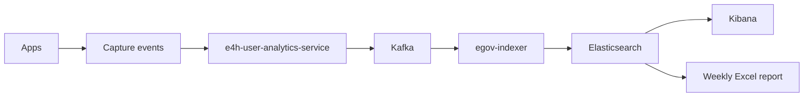
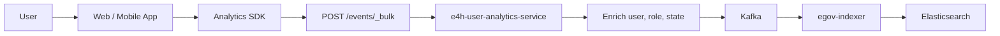
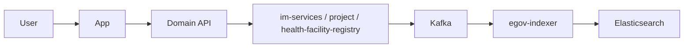
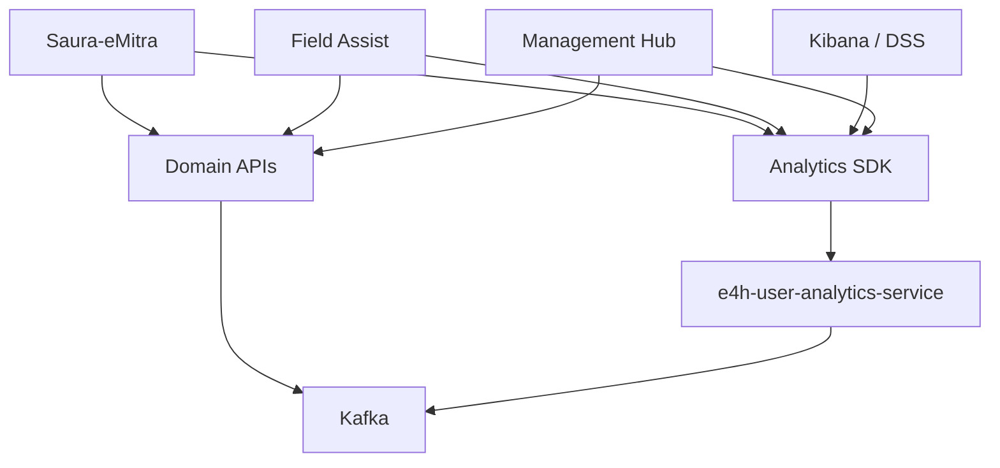
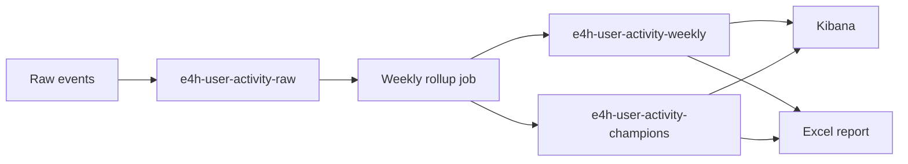
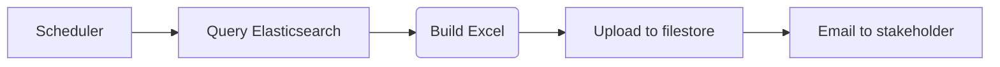
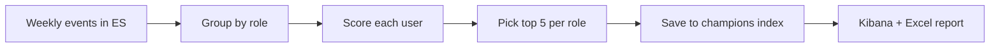
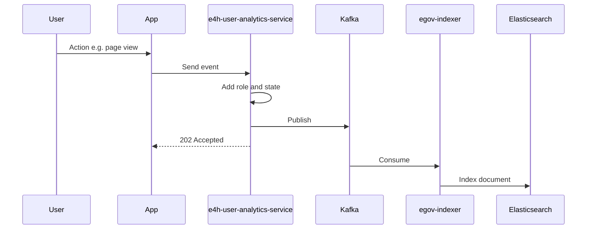

# E4H User Activity Analytics — Flow Diagrams

Visual flows for the user adoption analytics solution.  
For full design details, see `E4H_User_Activity_Analytics_LLD.md`.

---

## 1. End-to-end flow

How a user action becomes a Kibana chart or weekly report.

| Step | What happens |
|---|---|
| 1 | User logs in, opens a page, or performs an action |
| 2 | App records the event (SDK or server hook) |
| 3 | Analytics service enriches event with role and state |
| 4 | Event is published to Kafka |
| 5 | Indexer writes event to Elasticsearch |
| 6 | Kibana and the report job read from Elasticsearch |

---

## 2. UI event flow

Events captured in the browser or mobile app (login, page view, dashboard viewed, etc.).

**Example:** User opens the inbox page in Saura-eMitra → SDK sends `page_view` → service adds `user_uuid` and `CRM` role → event is indexed.

---

## 3. Business event flow

Events tied to a successful backend action (facility added, report approved, etc.).  
These can be sent directly to Kafka from the domain service.

**Example:** Admin creates a facility → `health-facility-registry` API succeeds → `facility_added` event published to Kafka → indexed in Elasticsearch.

---

## 4. Where events come from (by application)

| Application | Via SDK (UI) | Via domain API (business actions) |
|---|---|---|
| Saura-eMitra | Login, logout, page view, ticket viewed | Ticket updated |
| Field Assist | Login, logout, page view, module access, report viewed | Report submitted |
| Kibana / DSS | Login, logout, dashboard viewed, table downloaded | — |
| Management Hub | Login, logout, page view | Facility added, project created, report approved, etc. |

---

## 5. Data storage flow

| Index | Purpose |
|---|---|
| `e4h-user-activity-raw-*` | Every event as it happens |
| `e4h-user-activity-weekly` | WAU, sessions, access counts per week |
| `e4h-user-activity-champions` | Top 5 users per role per week |

---

## 6. Weekly report flow

Runs once a week (e.g. Monday morning) for the previous week.

---

## 7. Champion user flow

Scoring uses login count, session count, page access count, and application actions — **within the same role only**.

---

## 8. Single event journey (summary)

