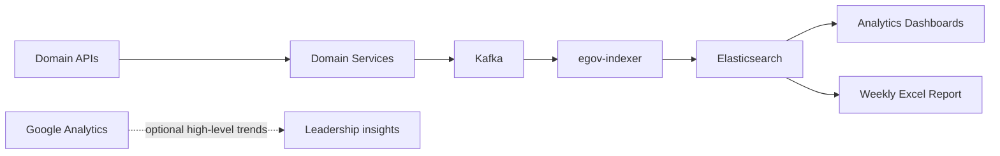
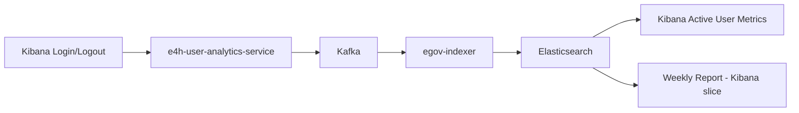

# E4H User Activity Analytics — Low Level Design (LLD)

**Source requirements:** `User Access Report Analytics PRD Update.docx.pdf`

This LLD is organized into two sections:


| Section       | Scope                                                                                                                                                |
| ------------- | ---------------------------------------------------------------------------------------------------------------------------------------------------- |
| **Section A** | System-level activity analytics for Saura-eMitra, E4H Field Assist, and E4H Management Hub (everything except Kibana-as-an-application requirements) |
| **Section B** | Kibana Dashboards application requirements only (login / logout tracking)                                                                            |


**Shared out of scope for this phase:** Detailed user-level UI interaction tracking (page visits, session duration, clickstream). High-level usage trends (e.g. page visits by region or role) may use **Google Analytics** where already available.

---

# Section A — System-Level Activity Analytics

*(Saura-eMitra · E4H Field Assist · E4H Management Hub)*

## A1. Purpose

Build a centralized, **role-based usage analytics** system based on **meaningful system-level (business) activities**. This section covers:

- Capture business activities (tickets, reports, projects, facilities, etc.) from domain services
- Identify **Champion Users** per role (configurable per application)
- Generate a **weekly leadership Excel report**
- Surface adoption / usage analytics on **Elasticsearch-backed dashboards** (viewed in the Kibana UI as the visualization layer)

Kibana-as-an-application tracking (login/logout of dashboard users) is **not** covered here — see **Section B**.

---

## A2. Applications in Scope


| Application        | Platform                         | Users                                     |
| ------------------ | -------------------------------- | ----------------------------------------- |
| Saura-eMitra       | Web (`micro-ui`)                 | CRM, vendors, reviewers, etc.             |
| E4H Field Assist   | Mobile + Web (`installation-ui`) | Field staff, AMC staff, supervisors       |
| E4H Management Hub | Web (`installation-ui`)          | Admins, project managers, facility admins |


---

## A3. Current State


| Area                    | Today                                                               | Gap                                        |
| ----------------------- | ------------------------------------------------------------------- | ------------------------------------------ |
| Saura-eMitra / web apps | Google Analytics via `Digit.Utils.analytics`                        | Optional for high-level trends only        |
| Domain services         | Business transactions exist; no unified activity analytics pipeline | Need activity events on API success        |
| Elasticsearch writes    | `egov-indexer` indexes domain events                                | No full system-activity analytics pipeline |


**Decision:**

- **Source of truth for Champion Users, WAU, and weekly reports:** application **transaction / system-level activity** data → Kafka → Elasticsearch.
- **Google Analytics:** optional for high-level application usage trends only; not used for Champion ranking or role-based activity metrics.
- **No custom UI Analytics SDK** for page views, sessions, or clickstream in this phase.

---

## A4. Solution Overview




**How it works:**

1. Domain services publish **system-level activity events** to Kafka when business APIs succeed (ticket created, report submitted, facility added, etc.)
2. **egov-indexer** writes events into **Elasticsearch**
3. **e4h-user-analytics-service** runs weekly rollups (WAU, activity summaries, champions) and generates the Excel report
4. Analytics dashboards read from Elasticsearch for leadership views
5. Optional high-level UI usage insights remain in **Google Analytics** (separate from this pipeline)

---

## A5. Components


| Component                      | Type                                                                  | Responsibility                                                 |
| ------------------------------ | --------------------------------------------------------------------- | -------------------------------------------------------------- |
| **Domain services**            | Existing (`im-services`, `project`, `health-facility-registry`, etc.) | Publish system-level activity events on successful API actions |
| **e4h-user-analytics-service** | New Spring Boot service                                               | Weekly rollup; champion logic; Excel report; enrichment        |
| **Kafka**                      | Existing                                                              | Transport activity events                                      |
| **egov-indexer**               | Existing (external)                                                   | Write raw activity events to Elasticsearch                     |
| **Elasticsearch**              | Existing                                                              | Store activity and aggregate data                              |
| **Analytics dashboards**       | Existing Kibana UI over ES indices                                    | Display adoption / usage dashboards for Section A data         |
| **Weekly report job**          | New (inside analytics service)                                        | Query ES, generate Excel, email via `egov-notification-email`  |
| **Google Analytics**           | Existing (web)                                                        | Optional high-level usage trends only                          |


---

## A6. System-Level Activities to Capture

Analytics are generated from **business activities**, not UI navigation. Events are published when the backend API completes successfully.

### A6.1 Activity catalog by application


| Application            | Activities to capture                                                                                                                                                                                                  |
| ---------------------- | ---------------------------------------------------------------------------------------------------------------------------------------------------------------------------------------------------------------------- |
| **Saura-eMitra**       | Ticket Creation, Ticket Assignment, Vendor Responses, Ticket Updation, Ticket Resolution, Escalation Raised, Approval Actions, Tech PoC Actions, State SPOC Actions                                                    |
| **E4H Field Assist**   | Installation Report Submitted, AMC Report Submitted, Installation Report Approved, Installation Report Rejected, Installation Reports Re-submitted, AMC Report Approved, AMC Reports Re-submitted, AMC Report Rejected |
| **E4H Management Hub** | Project Created, Field Plan Scheduled, Facility Added, PoC Details Edited, Boundary Added, AMC Scheduled                                                                                                               |


### A6.2 Suggested event_type values


| Application    | Event type (examples)                                                                                                                                                                                                              |
| -------------- | ---------------------------------------------------------------------------------------------------------------------------------------------------------------------------------------------------------------------------------- |
| Saura-eMitra   | `ticket_created`, `ticket_assigned`, `vendor_response`, `ticket_updated`, `ticket_resolved`, `escalation_raised`, `approval_action`, `tech_poc_action`, `state_spoc_action`                                                        |
| Field Assist   | `installation_report_submitted`, `amc_report_submitted`, `installation_report_approved`, `installation_report_rejected`, `installation_report_resubmitted`, `amc_report_approved`, `amc_report_resubmitted`, `amc_report_rejected` |
| Management Hub | `project_created`, `field_plan_scheduled`, `facility_added`, `poc_details_edited`, `boundary_added`, `amc_scheduled`                                                                                                               |


### A6.3 Services that publish activity events


| Service                    | How event is created                               | Events published                                                                                                        |
| -------------------------- | -------------------------------------------------- | ----------------------------------------------------------------------------------------------------------------------- |
| `im-services`              | Publishes to Kafka on successful ticket API action | Ticket Creation, Assignment, Vendor Responses, Updation, Resolution, Escalation, Approval, Tech PoC, State SPOC actions |
| `project`                  | Publishes to Kafka on successful API action        | Project Created; Installation/AMC report submit / re-submit (as applicable)                                             |
| `field-planner-activity`   | Publishes to Kafka on successful API action        | Field Plan Scheduled; Installation/AMC report Approved / Rejected (as applicable)                                       |
| `health-facility-registry` | Publishes to Kafka on successful API action        | Facility Added; PoC Details Edited                                                                                      |
| `boundary-service`         | Publishes to Kafka on successful API action        | Boundary Added                                                                                                          |
| `amc-scheduler-service`    | Publishes to Kafka on successful API action        | AMC Scheduled                                                                                                           |


Exact service ownership for Field Assist approve/reject/resubmit should be confirmed against the current Installation/AMC workflow services during implementation; the event catalog above is the requirement contract.

---

## A7. Event Data Model

Every activity event follows the same structure:


| Field           | Description                    | Example                                          |
| --------------- | ------------------------------ | ------------------------------------------------ |
| `event_id`      | Unique ID (UUID)               | `a1b2c3...`                                      |
| `event_type`    | Activity name                  | `ticket_created`, `facility_added`               |
| `event_time`    | UTC timestamp                  | `2026-06-30T10:15:00Z`                           |
| `application`   | Source app                     | `SAURA_EMITRA`, `FIELD_ASSIST`, `MANAGEMENT_HUB` |
| `user_uuid`     | Actor user identifier          | From auth context on the API                     |
| `primary_role`  | Main role for analytics        | `CRM`, `FIELD_STAFF`                             |
| `user_category` | Internal or External           | `INTERNAL`, `EXTERNAL`                           |
| `state`         | User / facility state          | `Assam`                                          |
| `module`        | Optional module                | `INSTALLATION`, `AMC`                            |
| `entity_id`     | Related business entity (opt.) | Ticket ID, project ID, facility ID               |
| `entity_type`   | Related entity type (opt.)     | `TICKET`, `PROJECT`, `FACILITY`, `REPORT`        |


**Note:** Do not store raw PII (name, phone) in Elasticsearch. Use `user_uuid` only.

Fields such as `page_name`, `session_id`, and `device_type` are **not required** for this phase (UI/session tracking is out of scope).

### Role mapping

Roles are mapped to **Internal** or **External** at ingest / enrichment time using an MDMS master or config table:


| Internal                                                                                                                   | External                                                    |
| -------------------------------------------------------------------------------------------------------------------------- | ----------------------------------------------------------- |
| CRM, State SPOC, Tech PoC, AMC Reviewer, Installation Reviewer, Project Manager, Facility Admin, SPM, Central Program Team | Vendor, HCR, AMC Field Staff, Field Staff, Field Supervisor |


SPM and Central Program Team may need manual mapping if not present as system roles today.

---

## A8. Data Storage (Elasticsearch)


| Index                         | Contents                                                            | Written by        |
| ----------------------------- | ------------------------------------------------------------------- | ----------------- |
| `e4h-user-activity-raw-`*     | Every system-level activity event (daily rollover)                  | `egov-indexer`    |
| `e4h-user-activity-weekly`    | Weekly aggregates (WAU, activity counts by app/role/state/category) | Weekly rollup job |
| `e4h-user-activity-champions` | Top 5 users per role per week                                       | Weekly rollup job |


Raw events are retained for 90–180 days (ILM policy). Weekly and champion indices are kept longer for trend analysis.

---

## A9. Kafka Topic


| Topic                      | Producer        | Consumer       |
| -------------------------- | --------------- | -------------- |
| `e4h.user-activity.events` | Domain services | `egov-indexer` |


Indexer YAML (deployed to config repo, same pattern as incident indexing) maps this topic to `e4h-user-activity-raw-*`.

---

## A10. Analytics Service Responsibilities (Section A)

Primary analytics data comes from **domain services publishing directly to Kafka**. For Section A, `e4h-user-analytics-service` is responsible for:

1. Optional enrichment of domain events (`primary_role`, `user_category`, `state`) when producers cannot resolve them
2. Weekly rollup and champion calculation
3. Weekly Excel report generation (and optional manual trigger)
4. Health / internal status

Domain-published events should carry enrichment fields where possible. Prefer enriching at the producer with RequestInfo user context.

---

## A11. Metrics


| Metric                       | Definition                                                                             |
| ---------------------------- | -------------------------------------------------------------------------------------- |
| **Active User**              | User who performs **at least one system-level activity** in the reporting period       |
| **Weekly Active User (WAU)** | User who performs **at least one system-level activity** in a calendar week            |
| **Activity Count**           | Total count of system-level activity events in the period (optionally by `event_type`) |
| **Champion User**            | Top 5 users within the **same role**, ranked by configurable business-activity score   |


Active User / WAU for Section A applications are based solely on business activities in the catalog above.

### Champion scoring

Computed weekly, **within each role only** (never across roles). Scoring is **configurable per application** and based on business activities, for example:

```
champion_score (Saura-eMitra, example) =
    w1 × tickets_created
  + w2 × tickets_assigned
  + w3 × tickets_resolved
  + w4 × escalations_raised
  + w5 × approval_actions
  + ...
```

```
champion_score (Field Assist, example) =
    w1 × installation_reports_submitted
  + w2 × amc_reports_submitted
  + w3 × reports_approved
  + w4 × reports_reviewed
  + ...
```

```
champion_score (Management Hub, example) =
    w1 × projects_created
  + w2 × field_plans_scheduled
  + w3 × facilities_added
  + w4 × amc_scheduled
  + ...
```

Weights (`w1`, `w2`, …) and included event types are stored in config/MDMS so Champion logic can be tuned per application without code changes.

**Removed from this phase:** login count, session count, and page access count as Champion ranking inputs.

---

## A12. Analytics Dashboards

Build on the Section A Elasticsearch indices. Suggested dashboards:


| Dashboard              | Key panels                                                   |
| ---------------------- | ------------------------------------------------------------ |
| **Executive Overview** | Active users by application, WoW active-user growth          |
| **Adoption**           | Active users / WAU by state, role, internal vs external      |
| **Usage Analytics**    | Application-wise activity summaries (counts by `event_type`) |
| **Champions**          | Top 5 users per role; top users per application              |


Global filters: Application, State, Role, User Category, Date Range.

These dashboards visualize Section A activity data. Tracking of users who log into the Kibana product itself is covered in **Section B**.

---

## A13. Weekly Excel Report


| Item             | Detail                                                                                                    |
| ---------------- | --------------------------------------------------------------------------------------------------------- |
| **Template**     | `E4H_Weekly_User_Activity_Report_Template.xlsx`                                                           |
| **Schedule**     | Every **Monday at 06:00** (covers previous calendar week)                                                 |
| **Recipient**    | `huda@selcofoundation.org` (via `egov-notification-email`)                                                |
| **Deliverables** | Role-wise Analytics Report; Champion User Report; Application-wise Usage Report; Weekly Executive Summary |
| **Flow**         | Scheduled job → query ES weekly/champion indices → fill Excel → upload to filestore → email               |


### Report contents

**Executive Summary**

- Total Active Users by Application (Saura-eMitra, Field Assist, Management Hub)
- Week-on-Week Active User Growth
- Active Users by Role
- Active Users by State
- Active Users by Internal vs External User Category

**Usage Analytics (application-wise activity summaries)**

*Saura-eMitra:* Ticket Creation, Ticket Assignment, Vendor Responses, Ticket Updation, Ticket Resolution, Escalation Raised, Approval Actions, Tech PoC Actions, State SPOC Actions

*Field Assist:* Installation/AMC Report Submitted, Approved, Rejected, Re-submitted

*Management Hub:* Project Created, Field Plan Scheduled, Facility Added, PoC Details Edited, Boundary Added, AMC Scheduled

**Champion Users**

- Top Champion Users by Role
- Top Champion Users by Application

**Adoption Insights (optional / external)**

- High-level usage insights such as page visits by region or role may be sourced from **Google Analytics** where required; they are not produced by this Elasticsearch pipeline.

---

## A14. Implementation Phases (Section A)


| Phase       | Scope                                                                                                   | Outcome                                  |
| ----------- | ------------------------------------------------------------------------------------------------------- | ---------------------------------------- |
| **Phase 1** | Kafka topic, indexer YAML, ES indices, analytics service skeleton, `im-services` ticket activity events | Saura-eMitra activity in ES + dashboards |
| **Phase 2** | Management Hub domain events (project, facility, boundary, field plan, AMC, PoC edit)                   | Full Management Hub activity catalog     |
| **Phase 3** | Field Assist Installation/AMC report workflow events (submit / approve / reject / re-submit)            | Full Field Assist activity catalog       |
| **Phase 4** | Weekly rollup job, configurable champion scoring, Excel report (Monday 06:00 email)                     | Full weekly leadership deliverables      |


---

## A15. Key Design Rules

1. **Role-based analytics only** — never compare users across different roles
2. **Champion users** — top 5 per role; scoring configurable per application; based on business activities
3. **System-level activities are the source of truth** for WAU, role analytics, and Champions (not UI clickstream)
4. **Elasticsearch** is the source of truth for analytics dashboards and the weekly Excel report
5. **egov-indexer writes raw events** — follows the existing E4H indexing pattern
6. **No PII in Elasticsearch** — use `user_uuid`  and `user_name` only (user_name to be desplayed in the report , so it is needed)
7. **Server-side capture** for business actions on successful API completion
8. **Google Analytics** may supplement high-level usage trends only; it does not drive Champion or WAU metrics

---

## A16. Domain Event Publishing Pattern

Domain services publish activity events after a successful business transaction (same reliability preference as other E4H Kafka domain events).

### A16.1 Publish rules


| Rule        | Detail                                                                                                                                                                                 |
| ----------- | -------------------------------------------------------------------------------------------------------------------------------------------------------------------------------------- |
| When        | After successful commit / successful API response path for the business action                                                                                                         |
| Where       | Prefer publishing from the domain service that owns the transaction                                                                                                                    |
| Idempotency | Each event has a unique `event_id` (UUID); retries must not create conflicting analytics for the same action if a natural key is available (`entity_id` + `event_type` + `event_time`) |
| Failure     | Logging + retry / dead-letter per existing Kafka producer patterns; analytics failure must not break the primary business API                                                          |


### A16.2 Minimal publish payload example

```json
{
  "event_id": "uuid",
  "event_type": "ticket_created",
  "event_time": "2026-06-30T10:15:00Z",
  "application": "SAURA_EMITRA",
  "user_uuid": "user-uuid",
  "primary_role": "CRM",
  "user_category": "INTERNAL",
  "state": "Assam",
  "entity_id": "IM-2026-000123",
  "entity_type": "TICKET"
}
```

### A16.3 Enrichment

If the producer cannot resolve `primary_role`, `user_category`, or `state` at publish time, `e4h-user-analytics-service` (or an enrichment step before indexing) resolves them from HRMS / user service / MDMS using `user_uuid`.

---

# Section B — Kibana Dashboards Requirements

*(Kibana Dashboards application only)*

## B1. Purpose

Capture and report **login / logout** activity for users of the **Kibana Dashboards** application (leadership and monitoring teams). This is the only PRD activity catalog for Kibana.

This section does **not** redefine Section A business-activity analytics. It only covers Kibana-as-an-application access tracking.

---

## B2. Application in Scope


| Application       | Platform                    | Users                        |
| ----------------- | --------------------------- | ---------------------------- |
| Kibana Dashboards | Web (`micro-ui` DSS module) | Leadership, monitoring teams |


---

## B3. Current State


| Area   | Today                                          | Gap                                             |
| ------ | ---------------------------------------------- | ----------------------------------------------- |
| Kibana | Shows operational data (incidents, facilities) | No login/logout user-access tracking for Kibana |


---

## B4. Solution Overview(not finalised)




**How it works:**

1. On Kibana login / logout, an auth or DSS hook sends the event to **e4h-user-analytics-service**
2. The service enriches the event (`user_uuid`, `primary_role`, `user_category`, `state`) and publishes to Kafka
3. **egov-indexer** writes into the same Elasticsearch activity indices used by Section A
4. Weekly rollups and the Excel report include a **Kibana application** slice based on these login/logout events

---

## B5. Activities to Capture


| Application           | Activities to capture |
| --------------------- | --------------------- |
| **Kibana Dashboards** | Login, Logout         |


### Suggested event_type values


| Application | Event type        |
| ----------- | ----------------- |
| Kibana      | `login`, `logout` |


### Publisher


| Service                      | How event is created                                            | Events published            |
| ---------------------------- | --------------------------------------------------------------- | --------------------------- |
| `e4h-user-analytics-service` | Receives Kibana login/logout (auth / DSS hook), enriches, Kafka | Login, Logout (Kibana only) |


---

## B6. Event Data Model (Kibana)

Same shared event schema as Section A, with Kibana-specific values:


| Field           | Description             | Example                |
| --------------- | ----------------------- | ---------------------- |
| `event_id`      | Unique ID (UUID)        | `a1b2c3...`            |
| `event_type`    | `login` or `logout`     | `login`                |
| `event_time`    | UTC timestamp           | `2026-06-30T10:15:00Z` |
| `application`   | Always Kibana           | `KIBANA`               |
| `user_uuid`     | Actor user identifier   | From auth token        |
| `primary_role`  | Main role for analytics | From enrichment        |
| `user_category` | Internal or External    | `INTERNAL`, `EXTERNAL` |
| `state`         | User state              | From enrichment        |


`entity_id` / `entity_type` / `module` are typically not required for Kibana login/logout events.

Role mapping (Internal vs External) follows the same table as **Section A7**.

---

## B7. Storage and Kafka

Kibana login/logout events use the **same** pipeline as Section A:


| Item     | Value                                                              |
| -------- | ------------------------------------------------------------------ |
| Topic    | `e4h.user-activity.events`                                         |
| Producer | `e4h-user-analytics-service`                                       |
| Consumer | `egov-indexer`                                                     |
| Index    | `e4h-user-activity-raw-`* (and weekly aggregates where applicable) |


---

## B8. API — Kibana Login/Logout Ingest

```
POST /user-analytics/v1/events/_bulk
Authorization: Bearer <user JWT>
```

**Request body (simplified):**

```json
{
  "events": [
    {
      "event_id": "uuid",
      "event_type": "login",
      "event_time": "2026-06-30T10:15:00Z",
      "application": "KIBANA"
    }
  ]
}
```

**Response:** `202 Accepted`

The service enriches each event with `user_uuid`, `primary_role`, `user_category`, and `state` from the auth token and user service, then publishes to Kafka.

---

## B9. Metrics (Kibana)


| Metric                       | Definition for Kibana                                               |
| ---------------------------- | ------------------------------------------------------------------- |
| **Active User**              | User with at least one Kibana `login` (or activity event) in period |
| **Weekly Active User (WAU)** | User with at least one Kibana `login` in a calendar week            |


Login/logout counts toward Active User / WAU **for the Kibana application only**.

**Champion Users:** Not driven by Kibana login/logout in this design. Champions remain based on Section A business activities (configurable per application). If leadership later wants Kibana-specific champions, that would be a separate configurable rule.

---

## B10. Weekly Report — Kibana Slice

The weekly Excel report (same schedule and recipient as Section A13) includes Kibana where applicable:

- Active Users by Application — include **Kibana**
- Week-on-Week Active User Growth — include **Kibana**
- No Kibana business-activity usage summary (login/logout only; no ticket/report/project actions)

---

## B11. Implementation Phase (Section B)


| Phase       | Scope                                                                          | Outcome                                         |
| ----------- | ------------------------------------------------------------------------------ | ----------------------------------------------- |
| **Phase 5** | Kibana login/logout capture via auth/DSS hook → analytics service → Kafka → ES | Kibana Active User / WAU in dashboards & report |


Depends on Section A Phase 1 infrastructure (topic, indexer, ES indices, analytics service).

---

## B12. Key Design Rules (Kibana)

1. Only **Login** and **Logout** are in scope for the Kibana Dashboards application
2. Events flow through the **same** Kafka / Elasticsearch pipeline as Section A
3. Kibana login/logout is **not** used as a primary Champion ranking input for other applications
4. Dashboard **viewed** / table **downloaded** UI events remain out of scope (per updated PRD)

---

## B13. Out of Scope (Section B)

- Dashboard Viewed / Tables Downloaded tracking
- Session duration or clickstream inside Kibana
- Replacing operational incident/facility Kibana content (separate from user-access analytics)

