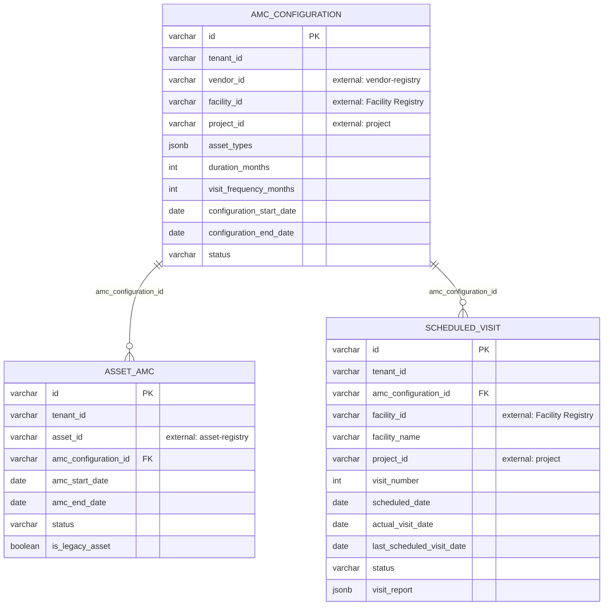

# amc-scheduler-service — Entity-Relationship Diagram

Tables owned by this service, reconciled from its Flyway migrations (`src/main/resources/db/migration`) to their current shape. For how this service's data relates to the rest of the platform, see the root [ERD.md](../../../ERD.md).

## External references (not drawn as full entities)

- `AMC_CONFIGURATION.vendor_id` → `VENDOR_ORG` (vendor-registry)
- `AMC_CONFIGURATION.facility_id` / `SCHEDULED_VISIT.facility_id` → `FACILITY` (health-facility-registry)
- `AMC_CONFIGURATION.project_id` / `SCHEDULED_VISIT.project_id` → `PROJECT` (project)
- `ASSET_AMC.asset_id` → `ASSET` (asset-registry)

## Not detailed here

`amc_configuration_assignments`, `scheduled_visit_assignments` (user-assignment join tables) and `visit_transaction` (workflow/process-instance audit log) exist in this service's schema but are omitted from the diagram above as plumbing rather than core domain entities.
