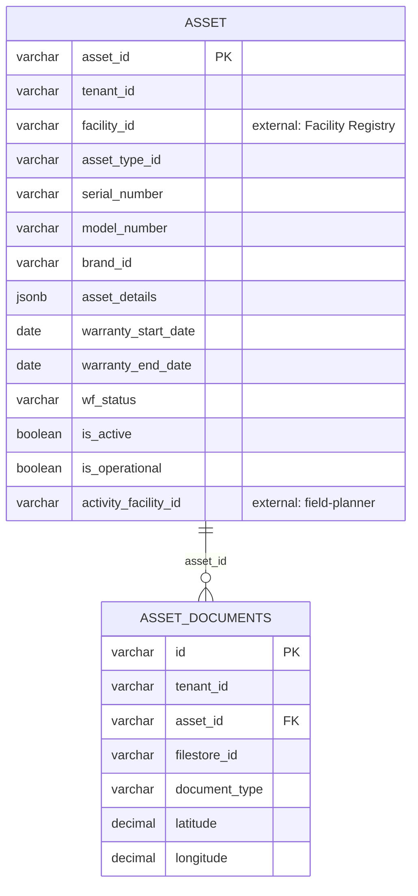

# asset-registry — Entity-Relationship Diagram

Tables owned by this service, reconciled from its Flyway migrations (`src/main/resources/db/migration`) to their current shape. For how this service's data relates to the rest of the platform, see the root [ERD.md](../../../ERD.md).

## External references (not drawn as full entities)

- `ASSET.facility_id` → `FACILITY` (health-facility-registry)
- `ASSET.activity_facility_id` → `FACILITY_ACTIVITY` (field-planner) — links an asset to the field-plan activity that installed/serviced it
- Consumed by `amc-scheduler-service`'s `ASSET_AMC.asset_id`
