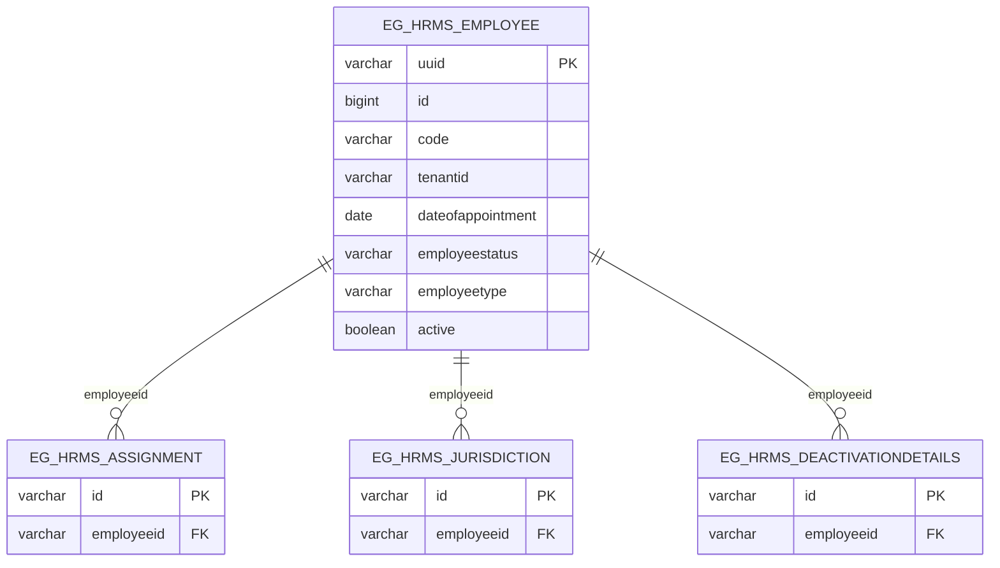

# egov-hrms — Entity-Relationship Diagram

Tables owned by this service, reconciled from its Flyway migrations (`src/main/resources/db/migration`) to their current shape. For how this service's data relates to the rest of the platform, see the root [ERD.md](../../../ERD.md).

## External references (not drawn as full entities)

None of `eg_hrms_employee`'s 108 migrations add a literal `facilityId`/`orgId`/`vendorId`/`assetId` column — this service has no direct FK-style cross-service columns. Other services reference an employee only implicitly, by matching `uuid`/`tenantid` against their own `staffId`, `assigned_to`, `assign_user`, or `userid` columns (see `project.PROJECT_STAFF`, `field-planner.ACTIVITY_ASSIGNMENT`, `field-planner-activity.BOM`, `vendor-registry.EG_ORG_USER` in the root [ERD.md](../../../ERD.md)).

## Not detailed here

`eg_hrms_educationaldetails`, `eg_hrms_departmentaltests`, `eg_hrms_empdocuments`, and `eg_hrms_servicehistory` all also FK to `eg_hrms_employee.uuid` via `employeeid`, but are omitted above as employee-detail child tables rather than core structure. Note: `phone`/`name` columns on the employee table itself were dropped in an early migration (`V20190219163221`) and are not present in the current schema.
