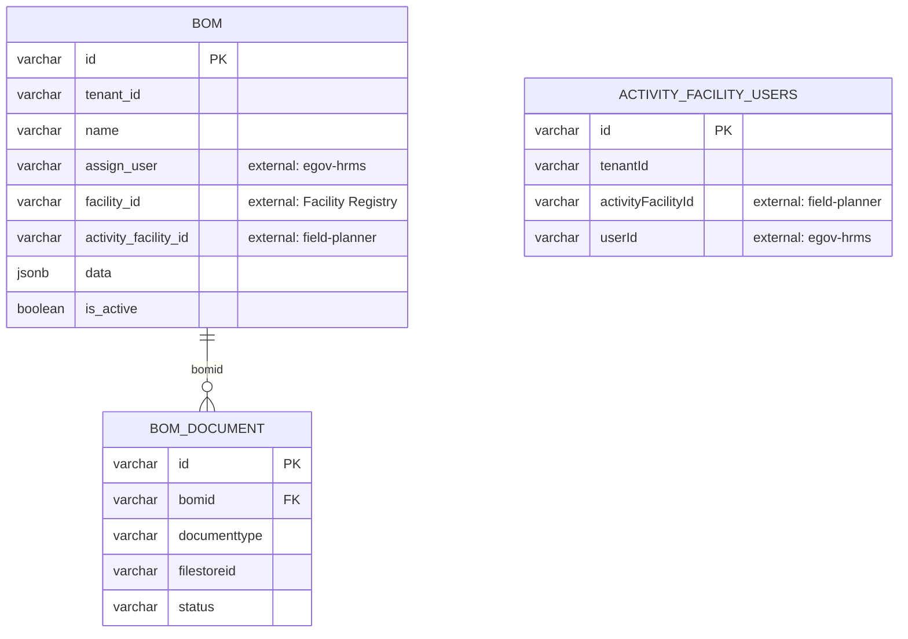

# field-planner-activity — Entity-Relationship Diagram

Tables owned by this service, reconciled from its Flyway migrations (`src/main/resources/db/migration`) to their current shape. For how this service's data relates to the rest of the platform, see the root [ERD.md](../../../ERD.md).

Despite the name, this is a **separate service** from `field-planner` with its own database — it owns bill-of-materials (BOM) execution artifacts that reference `field-planner`'s `facility_activities` table across the service boundary.

## External references (not drawn as full entities)

- `BOM.activity_facility_id` / `ACTIVITY_FACILITY_USERS.activityFacilityId` → `FACILITY_ACTIVITY` (field-planner)
- `BOM.facility_id` → `FACILITY` (health-facility-registry)
- `BOM.assign_user` / `ACTIVITY_FACILITY_USERS.userId` → `EMPLOYEE` (egov-hrms)

## Not detailed here

`activity_facility_transaction` and `activity_facility_comment` (both keyed by `activity_facility_id`, workflow/process audit) exist in this service's schema but are omitted above as audit tables.
