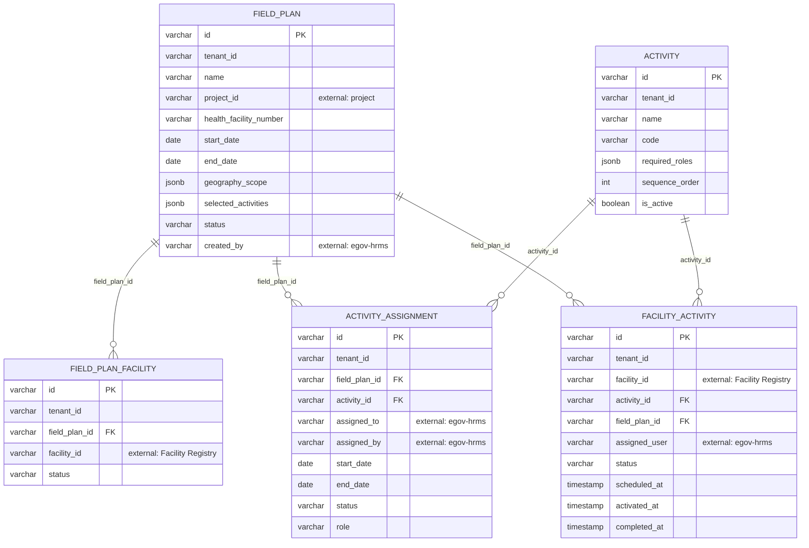

# field-planner — Entity-Relationship Diagram

Tables owned by this service, reconciled from its Flyway migrations (`src/main/resources/db/migration`) to their current shape. For how this service's data relates to the rest of the platform, see the root [ERD.md](../../../ERD.md).

## External references (not drawn as full entities)

- `FIELD_PLAN.project_id` → `PROJECT` (project)
- `FIELD_PLAN_FACILITY.facility_id` / `FACILITY_ACTIVITY.facility_id` → `FACILITY` (health-facility-registry)
- `FIELD_PLAN.created_by`, `ACTIVITY_ASSIGNMENT.assigned_to`/`assigned_by`, `FACILITY_ACTIVITY.assigned_user` → `EMPLOYEE` (egov-hrms)
- `FACILITY_ACTIVITY.id` is referenced externally (as `activity_facility_id`) by `field-planner-activity.BOM` and `field-planner-activity.ACTIVITY_FACILITY_USERS`, and by `asset-registry.ASSET.activity_facility_id` — despite the similar name, `field-planner-activity` is a **separate service** with its own database.
