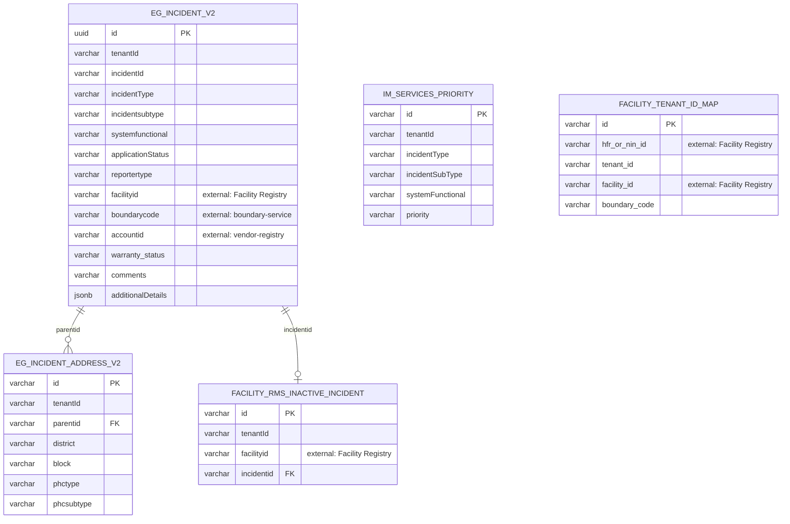

# im-services — Entity-Relationship Diagram

Tables owned by this service, reconciled from its Flyway migrations (`src/main/resources/db/migration`) to their current shape. For how this service's data relates to the rest of the platform, see the root [ERD.md](../../../ERD.md).

`IM_SERVICES_PRIORITY` and `FACILITY_TENANT_ID_MAP` are lookup tables joined by matching columns (`incidentType`/`incidentSubType`/`systemFunctional`, and `facility_id`/`hfr_or_nin_id` respectively) rather than a declared foreign key, so no relationship line is drawn to them above.

## External references (not drawn as full entities)

- `EG_INCIDENT_V2.facilityid` → `FACILITY` (health-facility-registry)
- `EG_INCIDENT_V2.accountid` → `VENDOR_ORG` (vendor-registry)
- `EG_INCIDENT_V2.id` is referenced externally as `ticket_id` by `rms-service.RMS_ALERT` — RMS creates the ticket that shows up here
- **No comments/attachments/history child table lives in this service.** Those are handled by shared workflow-v2 tables (`eg_wf_document_v2`, `eg_wf_processinstance_v2`, `eg_wf_assignee_v2`) and egov-filestore's `eg_filestoremap`, referenced only by ID, with no DB-level FK across the service boundary. Note also that `assignee`/`assigner` columns existed on `eg_incident_v2` at creation but were dropped in a later migration — assignment is handled entirely via workflow-v2, not stored here.
