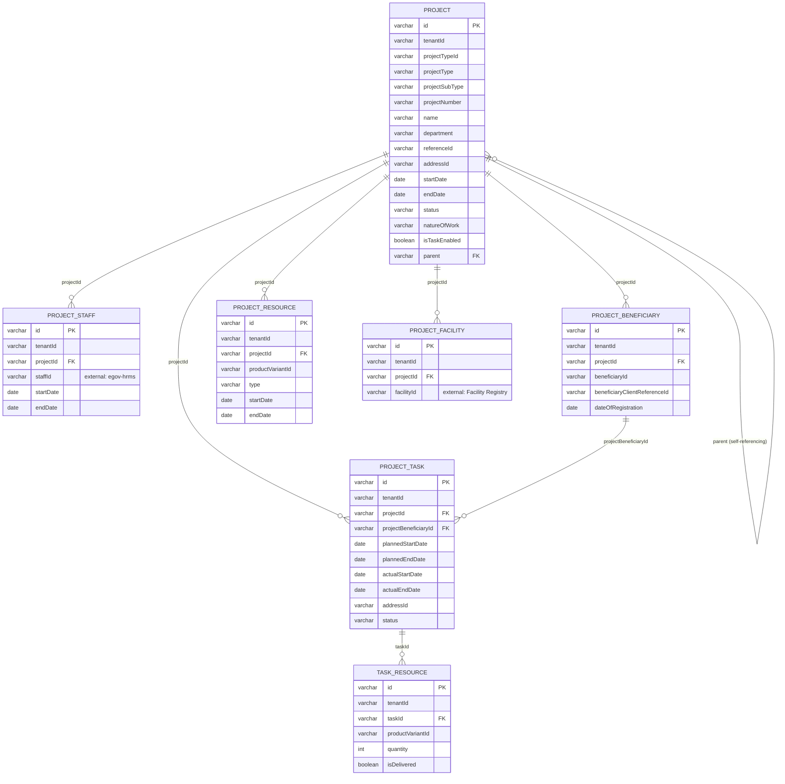

# project — Entity-Relationship Diagram

Tables owned by this service, reconciled from its Flyway migrations (`src/main/resources/db/migration`) to their current shape. For how this service's data relates to the rest of the platform, see the root [ERD.md](../../../ERD.md).

## External references (not drawn as full entities)

- `PROJECT_STAFF.staffId` → `EMPLOYEE` (egov-hrms)
- `PROJECT_FACILITY.facilityId` → `FACILITY` (health-facility-registry)
- `PROJECT.id` is referenced externally as `project_id` by `field-planner.FIELD_PLAN` and `amc-scheduler-service.AMC_CONFIGURATION` / `SCHEDULED_VISIT`

## Not detailed here

`project_target` (`projectId` FK) and `project_transaction`/`project_comment` (`project_id` FK, workflow audit) exist in this service's schema but are omitted above as supporting/audit tables.
