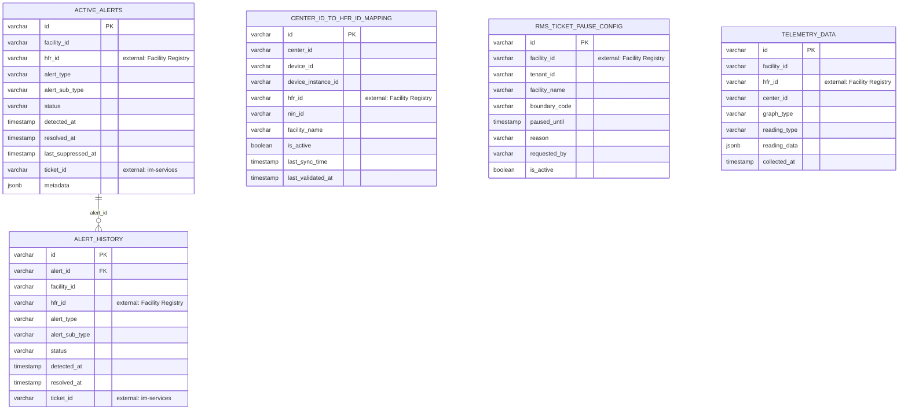

# rms-service — Entity-Relationship Diagram

Tables owned by this service, reconciled from its Flyway migrations (`src/main/resources/db/migration`) to their current shape. For how this service's data relates to the rest of the platform, see the root [ERD.md](../../../ERD.md).

`CENTER_ID_TO_HFR_ID_MAPPING`, `RMS_TICKET_PAUSE_CONFIG`, and `TELEMETRY_DATA` are not linked with FK lines above because they carry no declared foreign key to `ACTIVE_ALERTS` — they're all independently keyed by `facility_id`/`hfr_id`/`center_id`.

## External references (not drawn as full entities)

- `ACTIVE_ALERTS.hfr_id`, `ALERT_HISTORY.hfr_id`, `TELEMETRY_DATA.hfr_id`, `RMS_TICKET_PAUSE_CONFIG.facility_id` → `FACILITY` (health-facility-registry). `CENTER_ID_TO_HFR_ID_MAPPING` is the resolver table that translates RMS's native `center_id`/`device_id` into an `hfr_id`, since raw RMS telemetry APIs return center IDs, not Facility Registry IDs.
- `ACTIVE_ALERTS.ticket_id` / `ALERT_HISTORY.ticket_id` → `INCIDENT` (`eg_incident_v2` in im-services) — the ticket RMS auto-creates when an alert fires.
- There is no DB-level foreign key across any of these service boundaries (each service has its own database) — all links above are logical, via shared ID values.

## Not detailed here

A handful of CO2-dashboard reference tables (tenant/state-scoped, not tied to a facility) also live in this service's migrations but are omitted above as out of scope for a facility-centric ERD.
