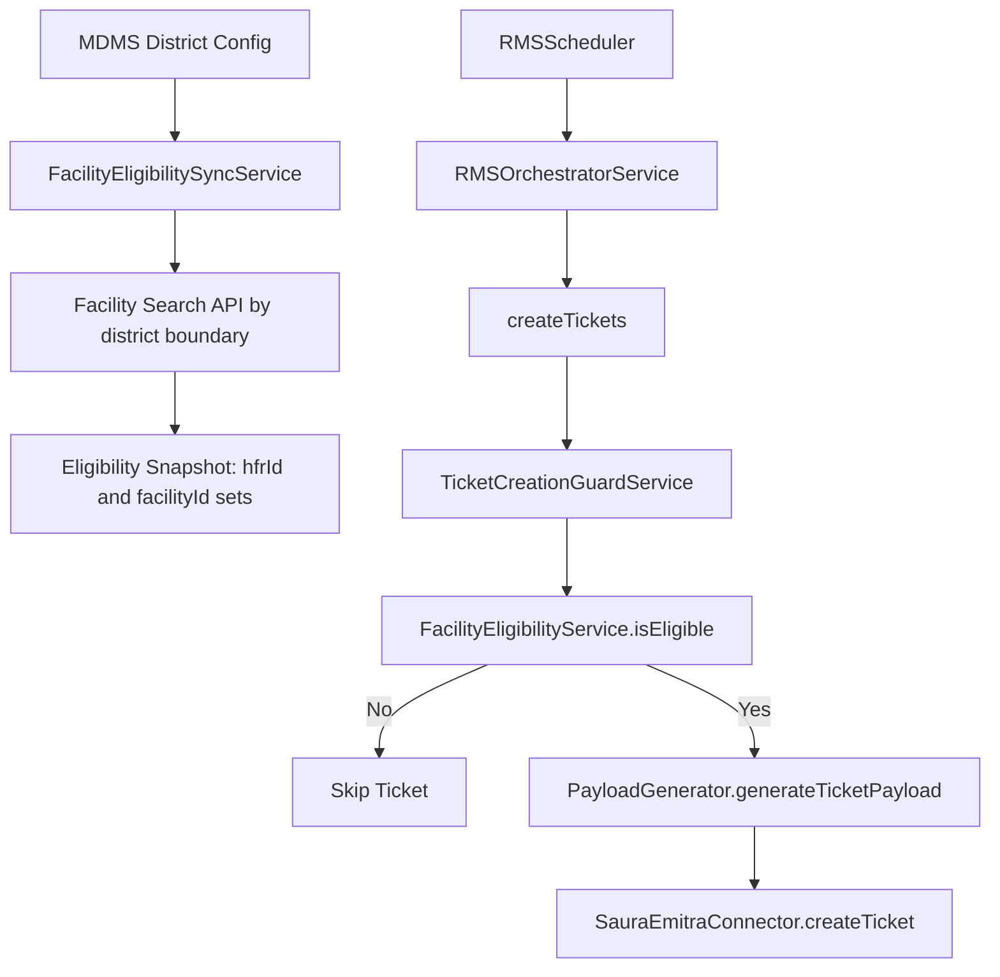

# Technical LLD: MDMS district-gated RMS ticket creation (`rms-service`)

## 1. Objective

Implement district-level control for RMS auto ticket creation using:

1. MDMS-configured district boundary list.
2. Facility search by district boundary to resolve eligible facilities.
3. Exact ID-based filtering (`hfrId` / `facilityId`) during ticket creation.

---

---

## 2. End-to-end functional flow

1. MDMS stores list of allowed district boundaries (example: `India_Karnataka_Raichur`).
2. RMS sync job reads allowed district list from MDMS.
3. For each district boundary, RMS calls facility search API:
  - `GET /facility-service/v2/facility/search?tenant_id=in&boundaryCode=<district>&limit=<n>&offset=<m>`
4. RMS paginates through all facilities and builds an eligible facility cache.
5. At ticket creation time, RMS checks if alert belongs to eligible facility set.
6. If eligible, continue payload creation and IM ticket creation; else skip.

---

## 3. Decision key (production-safe)

### 3.1 Keys used for eligibility

- Primary key: `hfrId` from alert (`Alert.hfrId`).
- Secondary fallback key: `facilityId` from alert (`Alert.facilityId`).
- `facility_name` must **not** be used for decisioning.

### 3.2 Matching rule

Eligibility shall be evaluated strictly by exact identifier equality with precedence: if `alert.hfrId` is present, only `allowedHfrIds.contains(alert.hfrId)` shall be evaluated; `allowedFacilityIds.contains(alert.facilityId)` shall be evaluated only when `alert.hfrId` is null/blank.

---

## 4. MDMS contract

### 4.1 Module / master

- `moduleName`: `rms-service`
- `masterName`: `DistrictTicketCreationAllowlist`

### 4.2 Master schema

```json
{
  "code": "KA_RAICHUR",
  "stateCode": "KA",
  "districtBoundaryCode": "India_Karnataka_Raichur",
  "districtName": "Raichur",
  "active": true,
  "tenantId": "in"
}
```

### 4.3 Rule for empty district list

If MDMS district list is empty, RMS treats it as "state-wide district gating disabled" and allows all districts in the state scope.

---

## 5. Facility search contract usage

Facility search response provides the required fields for building eligibility map:

- `hfr_id`
- `facility_id`
- `boundary.district` (district boundary code)
- `boundary.code` / `boundaryCode` (facility boundary code)
- `facility_status`
- `rms_inactive`

Extraction contract (strict):

- `hfrId`: read top-level `hfr_id`; if absent, read `facility_details.hfr_id`.
- `facilityId`: read top-level `facility_id` only.
- `districtBoundaryCode`: read `boundary.district`; if absent, treat row as invalid for district-scoped sync.
- `facilityStatus`: read `facility_status`.
- `rmsInactive`: read `rms_inactive` (default `false` when absent).

### 5.1 Inclusion criteria while building cache

Include facility only when:

- `hfr_id` or `facility_id` is present
- `facility_status != UNINSTALLED`
- `rms_inactive != true`

### 5.2 Pagination

Use `limit` + `offset` until all rows are fetched (`totalCount` exhausted).

---

## 6. Service design changes

### 6.1 New services

- `MDMSDistrictConfigService`
  - fetch active district boundary list from MDMS
  - fetch fallback universe when list is empty
- `FacilityEligibilitySyncService`
  - resolves eligible facility IDs by querying facility search per district
  - builds in-memory snapshot sets
- `FacilityEligibilityService`
  - `boolean isEligible(Alert alert)` runtime check using snapshot

### 6.2 Suggested methods

- `Set<String> getAllowedDistrictBoundaries(String tenantId)`
- `EligibilitySnapshot syncEligibleFacilities(String tenantId)`
- `boolean isEligibleByHfrOrFacilityId(String hfrId, String facilityId)`

Where `EligibilitySnapshot` contains:

- `Set<String> allowedHfrIds`
- `Set<String> allowedFacilityIds`
- `Instant generatedAt`
- `int districtCount`
- `int facilityCount`

## 7. Technical sequence




