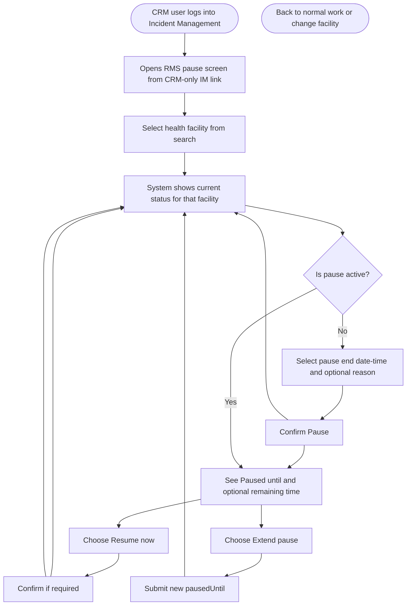
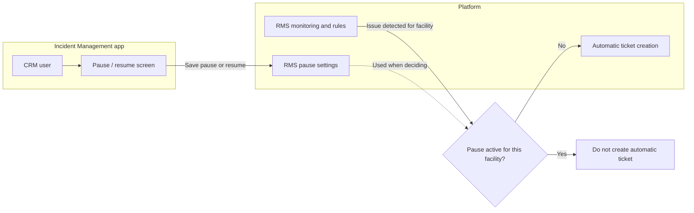

# RMS auto ticket pause

---

## 1. What this feature does

Remote Monitoring (RMS) can **automatically create** service tickets in the Incident Management system when it detects facility issues.

Sometimes operations need to **temporarily stop** that automatic creation for **one health facility** (for example during planned maintenance). **CRM users** can do that from the Incident Management app: they choose the facility, set **how long** the pause should last, and can **resume early** if needed.

---

## 2. Who is involved


| Role                 | Role in this flow                                                                                                            |
| -------------------- | ---------------------------------------------------------------------------------------------------------------------------- |
| **CRM user**         | Only this role sees the feature. Opens one screen, selects facility, pauses or resumes.                                      |
| **Other IM users**   | Do not see this screen; their work is unchanged.                                                                             |
| **RMS (background)** | Keeps monitoring. Before creating an automatic ticket for a facility, it checks whether a pause is active for that facility. |


---

## 3. Where and how it appears in the UI

### Which application

- The feature lives in the **employee Incident Management (IM)** application — the same DIGIT employee module staff use for **Inbox**, ticket lists, and related screens (URL pattern similar to `/digit-ui/employee/im/...`).
- It is **not** a separate product; it is **one new screen** inside that module.

### Where we add the entry (CRM users only)

- **Visibility:** Only users with the **CRM role** see the entry. Other roles (field staff, generic agents, etc.) **do not** see the link, menu item, or route.
- **Placement**:
  - **Option A (recommended):** A **new item in the IM left sidebar** or a **text link in the IM header/top bar** next to areas like Inbox / Home — label examples: *“Pause RMS auto tickets”*, *“RMS auto ticket control”*.
  - **Option B:** An entry under the **employee app menu / module list** (e.g. grouped with Incident Management tools), still **CRM-only**.
- **Explicitly out of scope for entry:** We do **not** rely on a button on **each row** of the Inbox table. The user opens **one shared screen**, then **searches and selects** the facility there.

### What opens when they click

- Clicking the entry opens a **dedicated full page** (full route inside IM — not a small popup).
- The page includes two views (tabs/segmented control):
  - **Manage Facility Pause** (single facility pause/resume/update)
  - **Paused Facilities List** (active paused facilities visible to that CRM user/scope)
- **Layout on that page (top to bottom):**
  1. **Page title** and **one line of help** (what “pause” does for automatic RMS tickets).
  2. **View switcher** — Manage / List.
  3. **Manage view:** **Health facility** — search / dropdown; user must select a facility before acting.
  4. **Status block** (Manage view) — after selection, the page loads pause state and shows either:
    - **Not paused:** pause end **date + time** picker, optional reason, primary button **Pause**; or  
    - **Paused:** “Paused until …”, optional remaining time, primary button **Resume**, and secondary button **Extend pause**.
- **Leaving the screen:** User uses the app’s normal **Back** or **breadcrumb** to return to Inbox or the previous IM view.

---

## 4. Business rules

- Pause applies to **one facility at a time** on the screen (pick facility → act).
- While paused, pause applies to **all** RMS-driven automatic ticket types for that facility (not per issue category).
- User selects pause end **date + time** from UI date-time picker.
- For `action=PAUSE`, UI sends exact `pausedUntil` timestamp to backend.
- If a facility is already paused and the user chooses **Extend pause**, the same pause API is called with `action=PAUSE` and a new `pausedUntil`; RMS updates `paused_until` accordingly.
- When the pause **ends** (time expires), automatic ticket creation **returns to normal** without someone having to click “resume.”
- If the user **resumes early**, automatic creation starts again **from that moment onward**.
- **No backlog:** If RMS would have raised tickets during the pause, those are **not** created later in bulk when the pause ends. Only **new** situations after the pause can create tickets (per agreed product behavior).

---

## 5. User flow (CRM — one screen)

**Single screen** handles both **pause** and **resume**.




**Step-by-step**

1. CRM user opens the **dedicated screen** via the **IM entry point** described in §3 (only visible to CRM).
2. User **searches and selects** the health facility.
3. The screen **loads status** for that facility:
  - If **not paused:** user selects pause end **date + time**, optional **reason**, and confirms **Pause**.
  - If **already paused:** user sees **paused until** (and time remaining if shown), optional saved reason, and can tap **Resume now** or **Extend pause**.
4. After **Pause**, **Resume**, or **Extend pause**, the user sees **confirmation** and the status area **updates** on the same screen.
5. To work on **another facility**, user changes the facility selection and repeats.

---

## 6. What the user sees (two states)


| State          | What it means for the user                                                                                                                                                 |
| -------------- | -------------------------------------------------------------------------------------------------------------------------------------------------------------------------- |
| **Not paused** | Automatic RMS tickets **can** be created for this facility when RMS detects issues. User can start a pause by selecting pause end **date + time** and optional reason.     |
| **Paused**     | Automatic RMS tickets **will not** be created for this facility until the pause ends or the user resumes. User sees **until when** and can **resume** or **extend pause**. |


---

## 6.1 Paused Facilities list view

This view helps CRM users quickly see and manage all currently paused facilities.

**Default behavior**

- Show only active pauses in a table.

**Table columns (recommended)**

- Facility Name
- Facility ID
- Paused Until
- Reason
- Updated At
- Paused By
- Actions: **Resume now**, **Edit pause end time**

**Filters and controls**

- Search by facility name / facility id
- Required/primary filter: `boundaryCodes[]` (parent boundaries selected in UI)
- Pagination (`offset`, `limit`)
- Sort by `pausedUntil` ascending (expiring soonest first)

**Actions from list**

- **Resume now**: calls manage API with `action=RESUME`.
- **Edit pause end time**: opens date-time picker and calls manage API with `action=PAUSE` and new `pausedUntil`.

**Boundary behavior**

- UI sends selected parent boundaries (e.g. district/block boundary codes) as `boundaryCodes`.
- `boundaryCodes` can be provided at **state level**, **district level**, or **block level**.
- List API returns paused **child facilities** whose boundary falls under any of the provided boundary codes.

---

## 7. End-to-end system flow (conceptual)

This is **not** a technical diagram — it shows how information moves for discussion with the client.




**In words**

1. CRM user sets or clears a pause for a facility; the platform **stores** that decision with **until when** it applies.
2. RMS continues to **monitor** facilities as today.
3. When RMS would **automatically create** a ticket for a facility, it **first checks** whether that facility is under pause.
4. If paused → **no automatic ticket** for that detection. If not paused → behavior is **as today** (including any existing business rules for duplicates, etc.).

---

## 8. Automatic expiry vs manual resume


| Event                            | Result                                                                                                                                                  |
| -------------------------------- | ------------------------------------------------------------------------------------------------------------------------------------------------------- |
| **Paused-until time is reached** | Pause **ends by itself.** Next eligible detections can create automatic tickets again (subject to normal rules). User does not need to open the screen. |
| **User taps Resume**             | Pause **ends immediately.** Same outcome as expiry, but user-driven.                                                                                    |


---

## 9. New RMS APIs (endpoints + summary)

The Incident Management frontend will call **three RMS HTTP endpoints** (using the same secure “logged-in user” context as other IM actions, for audit).

**Base URL note:** RMS is deployed with a service context path (e.g. `/rms-service`). Full paths below include that prefix as used in integration.


| #   | HTTP method | Endpoint (full path)                     | Purpose (plain)                                                                                                                                                                                                  |
| --- | ----------- | ---------------------------------------- | ---------------------------------------------------------------------------------------------------------------------------------------------------------------------------------------------------------------- |
| 1   | `POST`      | `/rms-service/v1/ticket/pause`           | **Manage pause or resume** — save a new pause (`pausedUntil` + optional reason), update an existing pause, or **resume** (clear pause). Request body includes `action`: `PAUSE` or `RESUME` (see technical LLD). |
| 2   | `POST`      | `/rms-service/v1/ticket/pause/_search`   | **Get pause status** — read whether a facility is paused and **until when**, for the Manage view.                                                                                                                |
| 3   | `POST`      | `/rms-service/v1/ticket/paused_facility` | **Get paused facilities list** — list currently paused facilities for user/scope with filters and pagination.                                                                                                    |


### Payload and response (what the APIs look like)

Below are **example** JSON bodies. `requestInfo` is the same **logged-in user / tenant** object the Incident Management app already sends on other API calls (standard platform pattern).

---

**1) Manage — pause (`POST /rms-service/v1/ticket/pause`)**

*Request*

```json
{
  "requestInfo": {},
  "action": "PAUSE",
  "facilityId": "FAC-1001",
  "pausedUntil": "2026-04-22T12:30:00Z",
  "reason": "Planned maintenance"
}
```

*Response (success — paused)*

```json
{
  "success": true,
  "facilityId": "FAC-1001",
  "isPaused": true,
  "pausedUntil": "2026-04-22T12:30:00Z",
  "message": "Auto ticket creation paused successfully"
}
```

---

**1) Manage — extend pause (`POST /rms-service/v1/ticket/pause`)**

*How UI calls it:* User clicks **Extend pause**, selects a new later date-time, and the app calls the same endpoint with `action: "PAUSE"`.

*Request (example: update to a later paused-until timestamp)*

```json
{
  "requestInfo": {},
  "action": "PAUSE",
  "facilityId": "FAC-1001",
  "pausedUntil": "2026-04-24T15:00:00Z",
  "reason": "Maintenance extended"
}
```

*Response (success — pause window updated)*

```json
{
  "success": true,
  "facilityId": "FAC-1001",
  "isPaused": true,
  "pausedUntil": "2026-04-24T15:00:00Z",
  "message": "Auto ticket creation pause updated successfully"
}
```

---

**1) Manage — resume (`POST /rms-service/v1/ticket/pause`)**

*Request*

```json
{
  "requestInfo": {},
  "action": "RESUME",
  "facilityId": "FAC-1001"
}
```

*Response (success — resumed)*

```json
{
  "success": true,
  "facilityId": "FAC-1001",
  "isPaused": false,
  "pausedUntil": null,
  "message": "Auto ticket creation resumed successfully"
}
```

---

**2) Search status (`POST /rms-service/v1/ticket/pause/_search`)**

*Request*

```json
{
  "requestInfo": {},
  "facilityId": "FAC-1001"
}
```

*Response (success — facility is paused)*

```json
{
  "success": true,
  "facilityId": "FAC-1001",
  "isPaused": true,
  "pausedUntil": "2026-04-22T12:30:00Z",
  "remainingMinutes": 3400,
  "reason": "Planned maintenance"
}
```

*Response (success — facility is not paused)*

```json
{
  "success": true,
  "facilityId": "FAC-1001",
  "isPaused": false,
  "pausedUntil": null,
  "remainingMinutes": 0,
  "reason": null
}
```

*Response (error — example)*

```json
{
  "success": false,
  "error": {
    "code": "VALIDATION_ERROR",
    "message": "pausedUntil is required and must be a future timestamp when action is PAUSE"
  }
}
```

---

**3) Search paused facilities list (`POST /rms-service/v1/ticket/paused_facility`)**

*Request*

```json
{
  "requestInfo": {},
  "boundaryCodes": [
    "India_Karnataka",
    "India_Karanataka_Raichur_Raichur",
    "India_Karnataka_Racichur_Balakot"
  ]
}
```

*Response (success)*

```json
{
  "success": true,
  "totalCount": 2,
  "pausedFacilities": [
    {
      "facilityId": "FAC-1001",
      "facilityName": "Bagalkot CHC",
      "boundaryCode": "India_Karnataka_Raichur_Raichur_BagalkotWard1",
      "pausedUntil": "2026-04-24T15:00:00Z",
      "reason": "Maintenance extended",
      "pausedBy": "crm.user1",
      "updatedAt": "2026-04-22T09:30:00Z"
    },
    {
      "facilityId": "FAC-2042",
      "facilityName": "Hosur PHC",
      "boundaryCode": "India_Karnataka_Racichur_Balakot_HosurWard2",
      "pausedUntil": "2026-04-23T11:00:00Z",
      "reason": "Power work",
      "pausedBy": "crm.user1",
      "updatedAt": "2026-04-22T08:10:00Z"
    }
  ]
}
```

---

## 10. New database table (name and fields)

RMS stores pause settings in a **new** database table. **Ticket text is not stored here** — only data needed to know *whether* and *until when* automatic ticket creation is paused for a facility.

**Table name:** `rms_ticket_pause_config`


| Column (field) | Type (summary)     | Purpose (plain)                                                                                        |
| -------------- | ------------------ | ------------------------------------------------------------------------------------------------------ |
| `id`           | Text (primary key) | Unique id for this row.                                                                                |
| `facility_id`  | Text, required     | Which health facility the pause applies to (same identifier RMS uses for that facility in monitoring). |
| `paused_until` | Date/time          | When the pause ends (automatic resume after this moment).                                              |
| `reason`       | Text, optional     | Why the pause was set (for audit / display).                                                           |
| `requested_by` | Text, optional     | Who requested the pause (from logged-in user context).                                                 |
| `is_active`    | Yes/No (boolean)   | Whether this pause row is currently in effect (`false` after **Resume** or when superseded).           |
| `created_at`   | Date/time          | When the row was first created.                                                                        |
| `updated_at`   | Date/time          | Last update time.                                                                                      |


---

