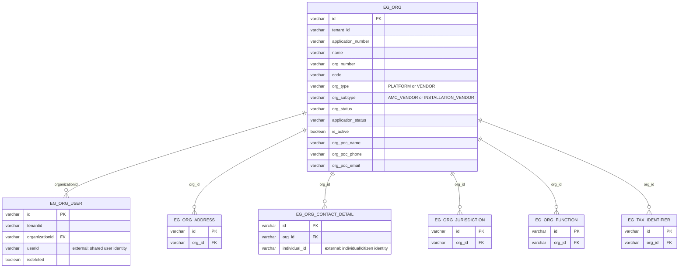

# vendor-registry — Entity-Relationship Diagram

Tables owned by this service, reconciled from its Flyway migrations (`src/main/resources/db/migration`) to their current shape. For how this service's data relates to the rest of the platform, see the root [ERD.md](../../../ERD.md).

## External references (not drawn as full entities)

- `EG_ORG_USER.userid` → `EMPLOYEE` (egov-hrms) — same identity space as the platform user/HRMS employee `uuid`
- `EG_ORG_CONTACT_DETAIL.individual_id` → an individual/citizen identity, not an HRMS employee
- `EG_ORG.id` is referenced externally as `vendor_id`/`accountid` by `amc-scheduler-service.AMC_CONFIGURATION` and `im-services.INCIDENT`

## Not detailed here

`eg_org_address_geo_location` (child of `eg_org_address`) and `eg_org_document` (child of `eg_org_function`) exist but are omitted as attachment/detail tables.
