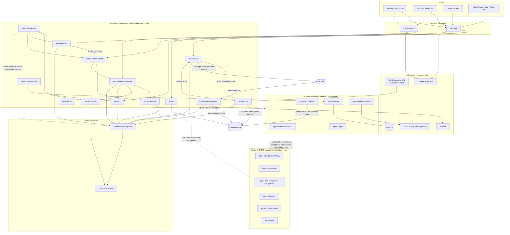

# E4H Platform Architecture

This is the platform-level system map for the E4H Digital Platform: every backend service, how they talk to each other (REST, Kafka, shared Elasticsearch indices), and everything the platform depends on outside this repo. It complements — it doesn't replace — the existing Low-Level Design docs (`docs/assessment-module`, `docs/rms-service`, `docs/facility-registry`, `docs/asset-registry`, `docs/project-service`) and the [root ERD](../ERD.md), which cover data model and per-feature detail this doc deliberately leaves out.

Everything below is grounded in the actual `application.properties`, `*-persister.yml`, and Java `@KafkaListener`/service source of each service — not inferred from names. Where something is legacy, unused, or removed, that's called out explicitly rather than silently omitted.

## System diagram

**Reading this diagram:** the dotted edges from `Domain`/`Utilities` to platform utilities and the external DIGIT backbone represent dependencies shared by *nearly every* service (MDMS lookups, ID generation, workflow transitions, user/auth, localization) — drawn once here rather than fanned out from all 13 domain services individually. The solid edges are the specific, interesting business flows. Full detail for both is in the tables below.

## Service inventory

| Service | Type | Role |
|---|---|---|
| [boundary-service](../backend/core-services/boundary-service) | Core | Administrative boundary hierarchy (state/district/block) |
| [egov-idgen](../backend/core-services/egov-idgen) | Core | Sequential/formatted ID generation |
| [egov-filestore](../backend/core-services/egov-filestore) | Core | File upload/storage (backed by AWS S3) |
| [egov-mdms-service-v2](../backend/core-services/egov-mdms-service-v2) | Core | Master data (MDMS) config service |
| [egov-notification-sms](../backend/core-services/egov-notification-sms) | Core | SMS dispatch via SMSCountry |
| [egov-workflow-v2](../backend/core-services/egov-workflow-v2) | Core | Generic workflow/state-machine engine |
| [health-facility-registry](../backend/core-services/health-facility-registry) | Core | Facility registry — the hub nearly everything else joins against |
| zuul | Core (**inactive**) | API gateway — source was deleted in commit `08376294a`; only an empty Eclipse project stub remains. Not a buildable/live module today. |
| [asset-registry](../backend/e4h-services/asset-registry) | E4H | Installed solar asset tracking |
| [amc-scheduler-service](../backend/e4h-services/amc-scheduler-service) | E4H | AMC configuration and scheduled visits |
| [vendor-registry](../backend/e4h-services/vendor-registry) | E4H | Vendor/organisation registry |
| [egov-hrms](../backend/e4h-services/egov-hrms) | E4H | Employee/HR records |
| [project](../backend/e4h-services/project) | E4H | Project registry (staff, beneficiaries, tasks, resources, facilities) |
| [field-planner](../backend/e4h-services/field-planner) | E4H | Field plans linking facilities to installation/maintenance work |
| [field-planner-activity](../backend/e4h-services/field-planner-activity) | E4H | Per-facility activity execution, staff assignment, BOM |
| [im-services](../backend/e4h-services/im-services) | E4H | Incident management ("Saura eMitra") ticketing |
| [im-services-analytics](../backend/e4h-services/im-services-analytics) | E4H | Escalation reporting, SLA/CO2 dashboards |
| [inbox](../backend/e4h-services/inbox) | E4H | Unified task inbox (pure REST/ES, no Kafka) |
| [ingestion-service](../backend/e4h-services/ingestion-service) | E4H | Bulk data ingestion (Python; the only service with **direct Postgres access**, bypassing REST) |
| [processor-services](../backend/e4h-services/processor-services) | E4H | Video/image processing (FFmpeg) |
| [rms-service](../backend/e4h-services/rms-service) | E4H | Remote Monitoring System — telemetry polling, anomaly detection, auto-ticketing |
| [micro-ui](../frontend/micro-ui) | Frontend | Main employee/implementation-team web app |
| [installation-ui](../frontend/installation-ui) | Frontend | Installation-focused web app |

## Kafka topics

Grouped by owning service. "(dead)" marks a listener/topic confirmed defined but not actually wired to active code.

| Service | Produces | Consumes |
|---|---|---|
| boundary-service | `create-boundary-entity`, `update-boundary-entity`, `save-boundary-hierarchy-definition`, `update-boundary-hierarchy-definition`, `save-boundary-relationship`, `update-boundary-relationship` (all self-consumed via `boundary-persister.yml`), `egov.core.notification.sms` | `service-consumer-topic` (dead — listener is commented out) |
| egov-mdms-service-v2 | `save-mdms-schema-definition`, `save-mdms-data`, `update-mdms-data` (self-consumed via `mdms-persister.yml`) | — |
| egov-notification-sms | `notification-sms-deadletter`, `egov.core.notification.sms.bounce`, `egov.core.sms.expiry`, `egov.core.sms.error` | `egov.core.notification.sms` (the shared inbound SMS-request topic every other service publishes to), `egov.core.notification.sms.bounce` |
| egov-workflow-v2 | `save-wf-transitions`, `save-wf-businessservice`, `update-wf-businessservice`, `update-wf-processinstance`, `add-wf-assignee` (self-consumed via `wf-persister.yml`), `update-im-request-processinstance-indexer` | — |
| health-facility-registry | `save-phc-master-list-indexer`, `dss-collection` | `facility-service-consumer` |
| asset-registry | `dss-collection` | `service-consumer-topic` |
| amc-scheduler-service | `visit-transaction-create`, `egov.core.notification.sms`, `egov.core.notification.email` | `project-consumer-topic` |
| vendor-registry | `save-org`, `update-org`, `save-org-users`, `update-org-users`, `delete-org-users`, `organisation.contact.details.update`, `dss-collection`, `egov.core.notification.sms` | — |
| egov-hrms | `save-hrms-employee`, `update-hrms-employee`, `egov-hrms-update`, `update-hrms-username`, `egov.core.notification.sms` | — |
| project | ~40 CRUD/bulk topics for project/staff/beneficiary/task/resource/facility entities plus indexer topics (see [project's own README](../backend/e4h-services/project/README.md) for the full list) | `project-consumer-topic` |
| field-planner | `save-field-plan`, create/update/delete + bulk for `fieldplan-facility`, `update-fieldplan`, `save/update-field-plan-template-topic`, `save-icc-template`, `egov.core.notification.email` | `project-consumer-topic` |
| field-planner-activity | create/update/unassign + bulk for `activity-assignment`, `activity-facility`, `save/update-bom`, `save-activity-topic`, `save/update-facility-user`, `facility-transaction-create`, `facility-comment-create`, `egov.core.notification.email` | `process-audit-records` (**active** — drives automatic `SCHEDULED`→`ASSIGN_FIELD_STAFF` workflow transitions), `project-consumer-topic` (likely vestigial) |
| im-services | `save-im-request`, `update-im-request`, `update-im-request-migration`, `save-login-report`, `save-im-request-indexer`, `update-im-request-indexer`, `save-im-audit-request-indexer`, `save-user-login-report-indexer`, `process-im-video-request`, `im-migration`, `save-im-request-batch`, `egov.core.notification.sms` | — |
| im-services-analytics | `save-co2-monthly-facility-indexer`, `save-co2-monthly-projection-facility-indexer`, `escalation-notification-email-status`, `egov.core.notification.email`, `save-phc-master-list-indexer`, `health-facility-index-v0001`, `carbon-emission-calculate` | `save-im-request-indexer`, `update-im-request-indexer`, `process-audit-records`, `carbon-emission-calculate`, `save-hrms-employee` |
| inbox | — | — (pure REST/Elasticsearch, no Kafka involvement at all) |
| ingestion-service | `egov.core.notification.sms` (this Python service can trigger SMS directly) | — |
| processor-services | — | `process-im-video-request` |
| rms-service | `save-rms-ticket-pause-indexer` | — (driven by internal cron polling the external RMS API, not Kafka) |

## Elasticsearch indices

| Index | Populated by | Queried by | Notes |
|---|---|---|---|
| `computed-sla-im-services-write` | egov-workflow-v2 | im-services-analytics (`ElasticsearchEscalationService`) | SLA computation for incident escalation reporting |
| `health-facility-index-v0001` | health-facility-registry (via `save-phc-master-list-indexer`) | im-services-analytics, Kibana dashboards | Facility-level Kibana reporting index |
| `co2-monthly-facility-index-write` | im-services-analytics | im-services-analytics, Kibana | CO2 emissions dashboard, actuals |
| `co2-monthly-projection-facility-index-write` | im-services-analytics | im-services-analytics, Kibana | CO2 emissions dashboard, projections |
| MDMS-driven dynamic indices (via `ElasticSearchQueries` master data) | egov-indexer (external to this repo's Java services) | inbox | Generic per-business-service search index, resolved through MDMS config rather than hardcoded |
| `water-services`, `sewerage-services` | — | inbox (config present) | Legacy/unused — inherited from the upstream municipal-services template this repo was forked from; not part of any real E4H flow |

## External dependencies

### DIGIT backbone services — referenced everywhere, **not present in this repo**

These are called by `*.host` config across nearly every service in this platform but have no corresponding directory anywhere in the repo. They're either a separately-deployed DIGIT core instance, or (in several services' default config) the public eGovernments Foundation demo environment:

| Service | Used for | Referenced by |
|---|---|---|
| `egov-user` | Authentication/user identity | Nearly all services (`egov.user.host`) — several default to the public `dev.digit.org` |
| `egov-localization` | UI/message localization | Most services (`egov.localization.host`) |
| `egov-enc-service` | PII encryption/decryption (facility POC phone, org POC phone, HRMS employee data) | health-facility-registry, vendor-registry, egov-hrms, amc-scheduler-service |
| `egov-searcher` | Generic search backend | inbox |
| `egov-url-shortening` | Short-link generation | boundary-service, im-services |
| `pdf-service` | PDF generation (BOM documents) | field-planner-activity |

### Third-party / infrastructure

| System | Used by | Purpose |
|---|---|---|
| RMS telemetry API (`selco.theiox.com`) | rms-service | Source of solar device telemetry (panel/inverter/battery/grid readings) |
| SMSCountry (`restapi.smscountry.com`) | egov-notification-sms | SMS delivery gateway |
| AWS S3 (`s3.amazonaws.com`, bucket `selco-dev`) | egov-filestore | Primary file storage backend |
| Azure Blob Storage | egov-filestore | Alternate storage backend, currently disabled (`isAzureStorageEnabled=false`) |
| Google Maps API | frontend (`micro-ui`, `installation-ui`) | Maps/geocoding in the UI |
| Kibana | im-services-analytics | Dashboards over the Elasticsearch indices above |
| Jaeger (OpenTelemetry collector) | im-services, rms-service, egov-hrms, and others | Distributed tracing |
| ffmpeg / ffprobe | processor-services | Video transcoding/HLS — external OS binaries, not a Java library |
| `saura-emitra-uat.selcofoundation.org` | ingestion-service (`template_generation.py`) | Hardcoded external URL used for facility QR auto-login generation — flagged separately as worth a security/hygiene review, not just an architecture note |

## Known gaps and irregularities

- **zuul** is listed in `backend/core-services` but has no real source left — treat it as removed, not as an active gateway in front of the platform today.
- **ingestion-service** talks to the Facility Registry's Postgres database directly (via `psycopg2`/`sqlalchemy`), bypassing REST entirely — the only service in the platform that does this.
- Several dead/vestigial Kafka topics exist (`service-consumer-topic` in boundary-service, `water-services`/`sewerage-services` indices in inbox) — inherited from the upstream municipal-services/DIGIT templates this platform was built from, and not part of any live E4H flow.
- Several services default their DIGIT-backbone host config (`egov.user.host`, etc.) to the **public** `dev.digit.org`/`unified-dev.digit.org`/`works-dev.digit.org` demo environments rather than a private instance — worth confirming this is intentional per-environment override and not accidentally live in production.

## Keeping this up to date

This doc is accurate as of the commit that introduced it. When adding a new service, a new Kafka topic that crosses a service boundary, or a new external dependency, update the relevant table above — this is meant to be the one place a new engineer reads to understand how the whole platform fits together, without having to read all 22 services' READMEs first.
