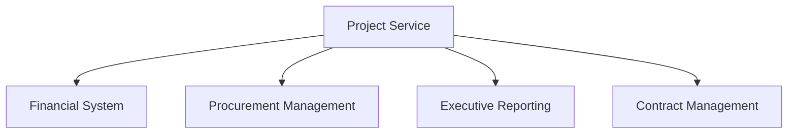
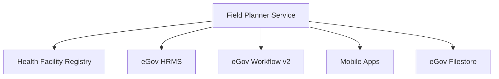
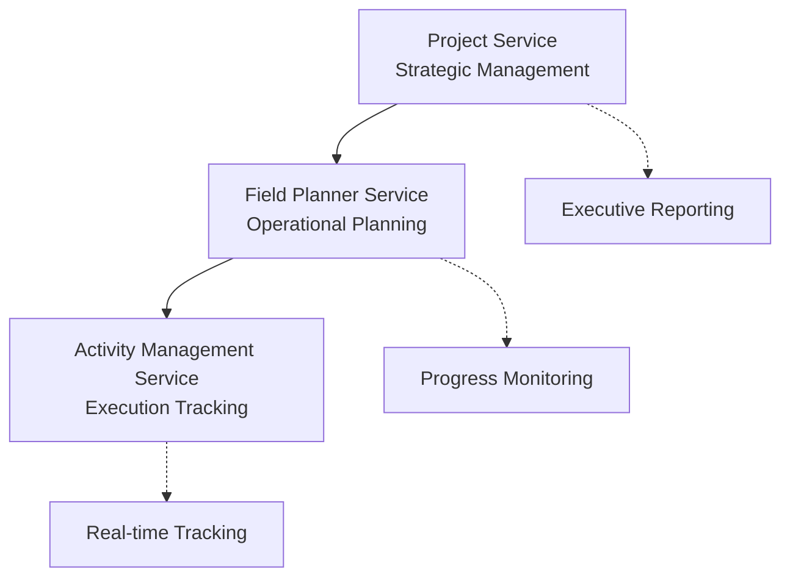

# Architectural Justification: Why Field Plans and Activities Need Separate Services

## Executive Summary

This document explains why Field Plans and Activities require dedicated services and database tables rather than extending the existing Project service. The decision is based on **service boundaries, data models, scalability, and operational requirements** that are fundamentally different between strategic project management and tactical field execution.

---

## 🎯 **Core Problem Statement**

**Question**: Can we use the existing Project service to manage Field Plans and Activities instead of creating new tables and APIs?

**Answer**: No, and here's why this would create significant architectural, operational, and scalability issues.

---

## 📊 **Service Boundary Analysis**

### **Existing Project Service Scope**
```
PROJECT SERVICE (Strategic Level)
├── Project Lifecycle Management
├── State-level MoU Management  
├── High-level Resource Allocation
├── Procurement & Contract Management
├── Executive Reporting & Dashboards
└── Integration with Financial Systems
```

### **Proposed Field Planner Scope**
```
FIELD PLANNER SERVICE (Operational Level)
├── Multiple Field Plans per Project
├── Facility-level Planning & Assignment
├── Team Coordination & Management
├── Activity Scheduling & Conditional Activation
├── Mobile App Synchronization
└── Day-to-day Execution Tracking
```

### **Why They Must Be Separate**

| **Aspect** | **Project Service** | **Field Planner Service** |
|------------|-------------------|--------------------------|
| **Scope** | Strategic (State-level) | Operational (Facility-level) |
| **Timeline** | 12-36 months | 4-12 weeks |
| **Users** | Senior Stakeholders | Project Managers, SPOCs, Field Staff |
| **Data Volume** | Low (dozens of projects) | High (thousands of activities) |
| **Update Frequency** | Monthly/Quarterly | Daily/Real-time |
| **Integration** | Financial, Procurement | Mobile, HRMS, Facility Registry |

---

## 🏗️ **Data Model Complexity**

### **Current Project Data Model**
```sql
-- Simple, strategic project information
PROJECT (
  id, name, state, start_date, end_date, 
  project_type, mou_reference, budget_allocated,
  status, created_by, tenant_id
)

PROJECT_FACILITY (
  project_id, facility_id, status
)
```

### **Field Plan Data Requirements**
```sql
-- Operational planning with complex relationships
FIELD_PLANS (
  id, project_id, name, geography_filter,
  start_date, end_date, status, activation_conditions,
  created_by, tenant_id
)

FIELD_PLAN_FACILITIES (
  field_plan_id, facility_id, inclusion_criteria,
  priority, notes
)

ACTIVITIES (
  id, field_plan_id, activity_type, required_role,
  activation_conditions, deadline, dependencies
)

ACTIVITY_ASSIGNMENTS (
  id, activity_id, spoc_id, reviewer_id,
  assigned_date, due_date, status
)

FACILITY_ACTIVITIES (
  id, field_plan_id, activity_id, facility_id,
  assigned_user_id, status, activated_at,
  scheduled_date, completion_date
)

ACTIVITY_REPORTS (
  id, facility_activity_id, submitted_by,
  submission_date, report_data, attachments,
  review_status, reviewer_comments
)
```

### **Scalability Impact**

**If we put everything in Project Service:**

```
Single Project → 50 Field Plans → 500 Activities → 25,000 Facility Activities → 100,000+ Reports
```

This creates a **massive, unwieldy monolithic service** that violates microservices principles.

---

## ⚡ **Performance and Scalability Concerns**

### **Data Volume Projections (Per State)**

| **Entity** | **Volume** | **Growth Rate** | **Access Pattern** |
|------------|------------|-----------------|-------------------|
| Projects | 10-20 | Stable | Read-heavy |
| Field Plans | 500-1,000 | Moderate | Read/Write balanced |
| Activities | 5,000-10,000 | High | Write-heavy |
| Facility Activities | 50,000-100,000 | Very High | Real-time writes |
| Activity Reports | 200,000+ | Exponential | Continuous writes |

### **Service Performance Requirements**

| **Service** | **Response Time** | **Throughput** | **Availability** |
|-------------|------------------|----------------|------------------|
| Project Service | 500ms (Strategic queries) | 100 req/min | 99.5% |
| Field Planner Service | 200ms (Planning ops) | 1,000 req/min | 99.9% |
| Activity Management | 100ms (Field execution) | 10,000 req/min | 99.95% |

**Mixing these in one service would create performance bottlenecks.**

---

## 👥 **User Access Patterns**

### **Project Service Users**
- **Senior Management**: Strategic oversight, budget tracking
- **Project Directors**: Cross-project reporting, resource allocation
- **Procurement Teams**: Contract management, vendor coordination

### **Field Planner Service Users**
- **Project Managers**: Operational planning, team coordination
- **Activity SPOCs**: Task assignment, progress monitoring
- **Field Supervisors**: Real-time execution tracking

### **Why Separation Matters**
- **Different Security Requirements**: Strategic vs operational data access
- **Different UI/UX Needs**: Executive dashboards vs operational interfaces  
- **Different Integration Points**: Financial systems vs mobile apps
- **Different Audit Requirements**: Compliance vs operational tracking

---

## 🔄 **Integration Complexity**

### **Project Service Integrations**


### **Field Planner Service Integrations**


**Different integration patterns require different service architectures.**

---

## 🛡️ **Security and Compliance**

### **Project-Level Security**
- **Strategic Data**: Budget information, contract details
- **Access Control**: Senior management, procurement teams
- **Audit Requirements**: Financial compliance, contract tracking

### **Field Plan Security**  
- **Operational Data**: Team assignments, facility details
- **Access Control**: Project managers, field teams, SPOCs
- **Audit Requirements**: Operational tracking, performance monitoring

### **Data Isolation Benefits**
- **Principle of Least Privilege**: Users only access relevant data
- **Reduced Attack Surface**: Operational breaches don't expose strategic data
- **Compliance Separation**: Different audit and regulatory requirements

---

## 🏃‍♂️ **Development and Deployment Agility**

### **Separate Services Enable**
- **Independent Development**: Teams can work on different aspects simultaneously
- **Independent Deployment**: Field execution updates don't affect strategic reporting
- **Independent Scaling**: Scale operational services differently from strategic ones
- **Technology Choices**: Use different tech stacks optimized for different use cases

### **Monolithic Risks**
- **Deployment Coupling**: All changes require full system deployment
- **Performance Impact**: Heavy field operations slow down strategic queries
- **Team Dependencies**: Development teams block each other
- **Technology Lock-in**: Forced to use same tech for different requirements

---

## 📈 **Real-World Usage Scenarios**

### **Scenario 1: High Field Activity**
```
- 200 field staff submitting reports simultaneously
- Mobile sync operations every 15 minutes  
- Real-time status updates for 1,000 activities
```
**Impact on Monolithic Project Service**: Strategic project queries become slow, executive dashboards timeout.

### **Scenario 2: Strategic Reporting Period**
```
- Month-end financial reporting
- Executive dashboard queries across multiple projects
- Budget reconciliation and procurement analysis
```
**Impact with Separate Services**: Field operations continue uninterrupted while strategic queries are optimized.

---

## 💡 **Recommended Architecture**

### **Service Relationships**


### **Data Flow**
1. **Project Created** → Enables field plan creation
2. **Field Plan Created** → Enables activity planning  
3. **Activities Assigned** → Enables field execution
4. **Reports Submitted** → Rolls up to progress monitoring
5. **Progress Aggregated** → Feeds into strategic reporting

---

## ✅ **Decision Summary**

### **Why Field Plans and Activities MUST Be Separate Services:**

1. **🎯 Different Business Purpose**
   - Projects: Strategic planning and resource allocation
   - Field Plans: Operational execution and team coordination

2. **📊 Different Data Characteristics**  
   - Projects: Low volume, high value, strategic
   - Field Plans/Activities: High volume, operational, real-time

3. **👥 Different User Communities**
   - Projects: Senior management, procurement, finance
   - Field Plans: Project managers, SPOCs, field staff

4. **⚡ Different Performance Requirements**
   - Projects: Consistency and reporting accuracy
   - Field Plans: Low latency and high throughput

5. **🔄 Different Integration Needs**
   - Projects: Financial systems, contracts, compliance
   - Field Plans: Mobile apps, facility registry, HRMS

6. **🛡️ Different Security Models**
   - Projects: Strategic data protection
   - Field Plans: Operational data access patterns

### **Conclusion**
Field Plans and Activities represent a **fundamentally different domain** from strategic project management. Forcing them into the existing Project service would:
- Create a monolithic anti-pattern
- Degrade performance for both use cases  
- Increase complexity and maintenance burden
- Reduce development agility
- Compromise security isolation

The **microservices approach with clear boundaries** is the architecturally sound decision that enables scalability, maintainability, and operational excellence. 