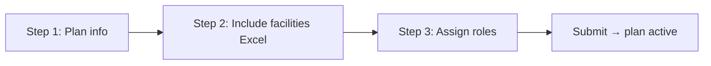
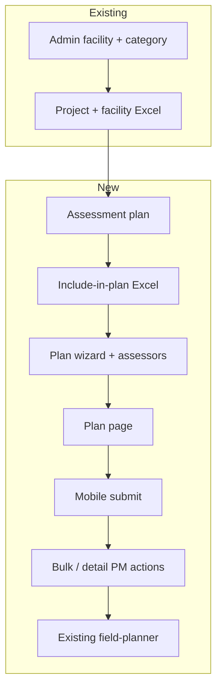
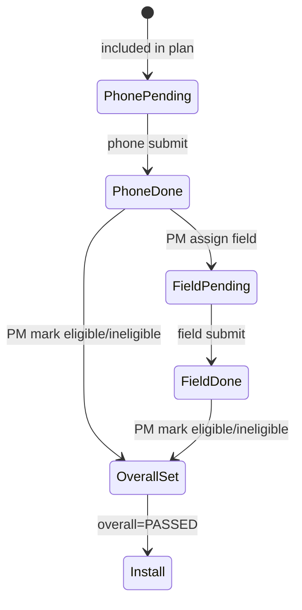
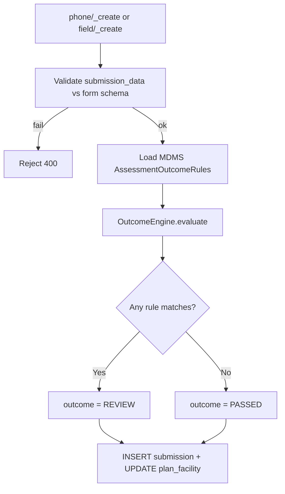
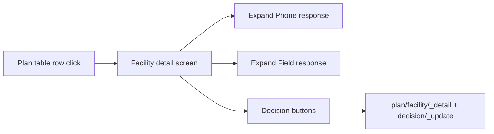
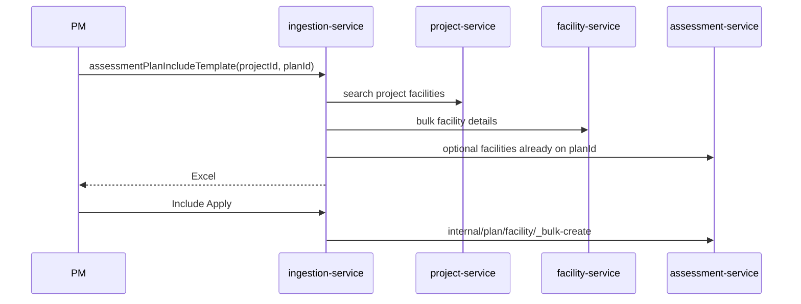
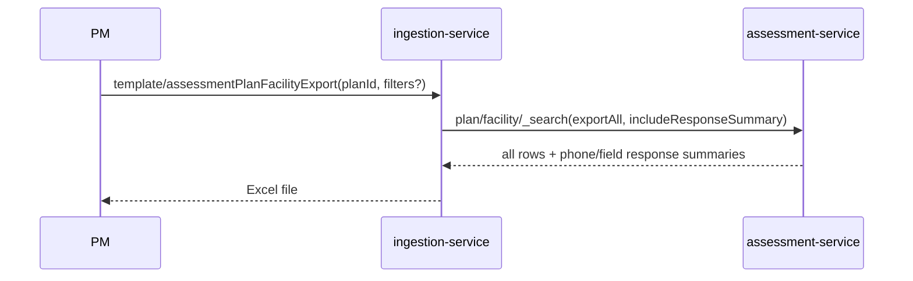
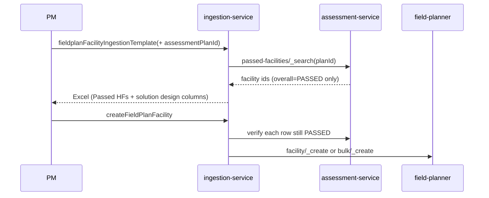

# Assessment Module — Low Level Design (LLD)

**Scope:** Implementation of the **assessment module**.


| Reference                                                                                                      | Use for                                                      |
| -------------------------------------------------------------------------------------------------------------- | ------------------------------------------------------------ |
| `E4H_Assessment_Module_PRD_3.docx`                                                                             | Business rules (baseline)                                    |
| `Assessment module - Version 2.docx`                                                                           | **Accepted** UI / PM actions (V2)                            |
| `Assessment forms - E4H (1) 1 (1).xlsx`                                                                        | Form definitions + HF types (Sheet2) → MDMS                  |
| MDMS `assessment.AssessmentFormSchema` + `AssessmentOutcomeRules`                                              | Form questions + outcome criteria one record per `formType`) |
| [FigJam workflow](https://www.figma.com/board/CzHGE9rmLUiIqCLlmFwK7T/Assessment-module---workflow?node-id=0-1) | Process                                                      |
| [V2 prototype](https://assessment-plan-1068851155482.asia-southeast1.run.app/)                                 | UI reference                                                 |


---

## Summary

### Already in the app (before assessment)

1. **Facilities onboarded** — Admin bulk-uploads facilities with **Category** (Health / Anganwadi).
2. **Create a project** — PM creates a project (state, dates, etc.).
3. **Attach facilities to project** — PM uses the existing Excel flow to link facilities to that project.

Facilities are on the **project**, not yet in an **assessment cycle**.

### Assessment module

- **One project → many assessment plans** (facilities split across plans).
- **PM decisions on UI** (bulk select or facility detail) — not Excel upload for assign/eligible.
- **Download** on plan screen = **read-only export** of grid + response summaries.

### Terminology (UI ↔ backend)


| UI label (V2)                    | Backend field / action                                                |
| -------------------------------- | --------------------------------------------------------------------- |
| Phone assessment status / result | `phone_status` / `phone_outcome`                                      |
| Site visit status / result       | `field_status` / `field_outcome`                                      |
| Assessment decision              | `overall_status` — **Eligible** = `PASSED`, **Ineligible** = `REVIEW` |
| Assign for field assessment      | `field_status = PENDING` (after phone submitted)                      |
| Mark eligible                    | `overall_status = PASSED`                                             |
| Mark not eligible                | `overall_status = REVIEW` + `ineligible_reason` (+ optional remarks)  |
| Enumerator (phone)               | Plan phone assessor — **one per plan** (V2)                           |
| Field POC                        | Plan field assessor — may span **multiple plans**                     |


### Mobile (Enumerator + Field POC)

- **Phone:** form submit → `phone_status` / `phone_outcome` (MDMS §2.7). Optional **Unable to contact** sub-statuses (V2).
- **Field POC:** site visit form → `field_status` / `field_outcome` — only HFs assigned for field assessment.

---

## 2.0 UI flows

### 2.0.1 Create assessment plan




| Step | Screen             | User action                                                                   | API                                                            |
| ---- | ------------------ | ----------------------------------------------------------------------------- | -------------------------------------------------------------- |
| 1    | Plan info          | Name, **state**, start date, end date                                         | `POST /plan/_create` (`projectId`, metadata) → `planId`        |
| 2    | Include facilities | **Download** template → mark **Yes** for facilities in this plan → **Upload** | `assessmentPlanIncludeTemplate` → `assessmentPlanIncludeApply` |
| 3    | Assign assessors   | Select **role + email** for phone (Enumerator) and field (Field POC)          | `POST /plan/_update` (assessor refs)                           |
| 4    | Submit             | Finish wizard                                                                 | Plan status `ACTIVE`; navigate to plan facility list           |


Include template: **project-linked facilities only** — not `facilityIngestionTemplateWithData`.

### 2.0.2 Project screen — assessment plans list


| UI                         | API                                           |
| -------------------------- | --------------------------------------------- |
| List all plans for project | `POST /plan/_search` (`projectId`)            |
| Click one plan             | Navigate to **plan facility screen** (§2.0.3) |


### 2.0.3 Plan facility screen (main PM workspace)

**Top metric cards** (`POST /plan/_detail`):


| Card                  | Count                                                 |
| --------------------- | ----------------------------------------------------- |
| Phone assessment done | `phone_status = SUBMITTED` / total in plan            |
| Field assessment done | `field_status = SUBMITTED` / total assigned for field |
| Passed (eligible)     | `overall_status = PASSED`                             |
| Ineligible            | `overall_status = REVIEW`                             |


**Left filters** on `POST /plan/facility/_search`:


| Filter                  | Field                                           |
| ----------------------- | ----------------------------------------------- |
| Category                | `facility_category`                             |
| HF type                 | `facility_type` (from facility master / Sheet2) |
| District                | facility boundary                               |
| Phone assessment status | `phone_status`                                  |
| Site visit status       | `field_status`                                  |
| Assessment decision     | `overall_status`                                |


**Facility table columns:** HF name, type, category, district, block, phone status, phone result, site visit status, site visit result, assessment decision, last action.

**Download button** — read-only Excel via ingestion (`POST /ingestion-service/template/assessmentPlanFacilityExport`). Ingestion calls assessment `POST /plan/facility/_search` with the same filters as the grid plus `**exportAll=true`** and `**includeResponseSummary=true**` (no separate export API):


| Export column                            | Source                                          |
| ---------------------------------------- | ----------------------------------------------- |
| HF name, type, category, district, block | Facility master + plan row                      |
| Phone assessment status / result         | `phone_status` / `phone_outcome`                |
| Site visit status / result               | `field_status` / `field_outcome`                |
| Assessment decision                      | `overall_status` (Eligible / Ineligible labels) |
| Last action                              | Latest audit timestamp on plan facility         |
| Phone response                           | Summary from `submission_data` (PHONE)          |
| Field response                           | Summary from `submission_data` (FIELD)          |


**No editable columns** in download — PM actions are on UI only.

**Row selection:** select all or individual rows.

**Bulk action buttons** (`POST /plan/facility/decision/_bulk-update`):


| Button                          | Effect                                   | Enabled when (per row)                                   |
| ------------------------------- | ---------------------------------------- | -------------------------------------------------------- |
| **Assign for field assessment** | `field_status = PENDING`                 | Phone submitted; site visit not Pending / not Submitted  |
| **Mark eligible**               | `overall_status = PASSED`                | Phone submitted; if site visit required, field submitted |
| **Mark not eligible**           | `overall_status = REVIEW` + reason modal | Same gating; **reason required** (V2)                    |


### 2.0.4 Facility detail screen

Click one row → detail view (§2.8): facility summary, **phone assessment response** (expand), **field assessment response** (expand), same **three action buttons** as bulk (single-facility via `decision/_update`).

### 2.0.5 After assessment — field plan (installation)

**Proceed with Field Plan Creation** (existing field-planner). Field-plan ingestion filtered to `overall_status = PASSED` for this `assessmentPlanId` (§4.4).

---

### End-to-end flow

**1. Project created (existing)**  
PM creates project. No assessment APIs.

**2. Facilities linked to project (existing)**  
Project Excel / UI: `facilityIngestionTemplateWithData` → `createFacilityAndUpdateProject`. Facilities exist on **project** only.

**3. Create assessment plan wizard** — name, state, dates → include Excel (Yes) → assign Enumerator + Field POC email → submit (§2.0.1).

**4. Project view** — list assessment plans → open one plan.

**5. Plan facility screen** — filters, table, metric cards, **Download** export, multi-select + 3 bulk actions (§2.0.3).

**6. Enumerator — phone assessment (mobile)** — `submission/phone/_create` → system sets phone status/result.

**7. PM — Assign for field assessment** (bulk or detail) → `field_status = PENDING`.

**8. Field POC — site visit (mobile)** — `submission/field/_create` → site visit status/result.

**9. PM — Mark eligible / Mark not eligible** (bulk or detail) → `overall_status`; not eligible requires reason (V2).

**10. Field plan (installation)** — Passed HFs only → extended field-plan ingestion (§4.4).


| Step                                        | Who sets what                         |
| ------------------------------------------- | ------------------------------------- |
| Phone status / result                       | **System** on phone submit            |
| Site visit queue (Pending)                  | **PM** — Assign for field assessment  |
| Site visit status / result                  | **System** on field submit            |
| Assessment decision (eligible / ineligible) | **PM** — Mark eligible / not eligible |


### One-line flow

```
Project → Wizard: plan + include Excel + assessors → Plan list → Plan facility screen
  → Phone (Enumerator) → PM assign field → Site visit (Field POC)
  → PM eligible/ineligible → Field plan (Passed only)
```

### Who does what


| Who        | Role                                                                           |
| ---------- | ------------------------------------------------------------------------------ |
| Admin      | Facility onboarding (existing)                                                 |
| PM         | Plan wizard, plan list, facility screen (bulk/detail actions), download export |
| Enumerator | Phone assessment — one per plan (V2)                                           |
| Field POC  | Site visit assessment — may cover multiple plans                               |
| System     | Outcomes (MDMS), validations, audit / last action                              |


---

## 1. What we build


| Component                                 | Service                    | New?                                                              |
| ----------------------------------------- | -------------------------- | ----------------------------------------------------------------- |
| Assessment plan CRUD                      | assessment-service         | Yes                                                               |
| Plan facility + 5 status fields           | assessment-service         | Yes                                                               |
| Phone/field form submit + outcome engine  | assessment-service         | Yes                                                               |
| MDMS outcome rules (per form type)        | MDMS + assessment-service  | Yes (config)                                                      |
| Handoff Passed HFs → field-planner        | assessment → field-planner | Integrate only                                                    |
| Internal APIs for ingestion               | assessment-service         | Yes                                                               |
| `plan/facility/_search` export flags      | assessment-service         | Extend                                                            |
| Excel: Include in plan (project HFs only) | ingestion-service          | New                                                               |
| Plan facility export (download)           | ingestion-service          | New — calls `_search` with `exportAll` + `includeResponseSummary` |
| Plan wizard + list + facility + detail UI | Frontend                   | New                                                               |
| Bulk PM decisions API                     | assessment-service         | New                                                               |





---

## 2. Assessment workflow

### 2.1 Implementation steps

Aligns with **End-to-end flow (canonical)** steps 1–10 above.


| Step | Owner      | Action                                                | API / mechanism                                                                                  |
| ---- | ---------- | ----------------------------------------------------- | ------------------------------------------------------------------------------------------------ |
| 1–2  | PM         | Project + link facilities (existing)                  | `facilityIngestionTemplateWithData` + `createFacilityAndUpdateProject`                           |
| 3    | PM         | Plan wizard: info + include Excel + assessors         | `plan/_create` → `assessmentPlanInclude`* → `plan/_update`                                       |
| 4    | PM         | Project screen: list plans                            | `plan/_search`                                                                                   |
| 5    | PM         | Plan facility screen: filters, download, bulk actions | `plan/_detail`, `plan/facility/_search`, `assessmentPlanFacilityExport`, `decision/_bulk-update` |
| 6    | Enumerator | Phone assessment                                      | `submission/phone/_create`                                                                       |
| 7    | PM         | Assign for field assessment (bulk or detail)          | `decision/_bulk-update` or `decision/_update`                                                    |
| 8    | Field POC  | Site visit assessment                                 | `submission/field/_create`                                                                       |
| 9    | PM         | Mark eligible / not eligible (bulk or detail)         | `decision/_bulk-update` or `decision/_update` (+ reason)                                         |
| 10   | PM         | Field plan — installation (existing)                  | Field-planner + ingestion §4.4 (`overall_status = PASSED`)                                       |


### 2.2 Status model (`eg_assessment_plan_facility`)




| Column           | Set by         | When                                                            |
| ---------------- | -------------- | --------------------------------------------------------------- |
| `phone_status`   | System         | Phone submit                                                    |
| `phone_outcome`  | System         | Phone submit — **OutcomeEngine + MDMS** (§2.7)                  |
| `field_status`   | PM then system | PM **Assign for field** → PENDING; Field POC submit → SUBMITTED |
| `field_outcome`  | System         | Site visit submit — **OutcomeEngine + MDMS** (§2.7)             |
| `overall_status` | PM             | **Mark eligible / not eligible** (UI)                           |


#### 2.2.1 When `overall_status` = PASSED or REVIEW is allowed

`overall_status` is set **only** by PM via `**decision/_update`** or `**decision/_bulk-update**` — never by OutcomeEngine or mobile submit.

**Preconditions for Mark eligible / Mark not eligible** (same gating for both; not eligible also requires `ineligibleReason`):


| Rule                     | Validation                                                                                    |
| ------------------------ | --------------------------------------------------------------------------------------------- |
| Phone done               | `phone_status = SUBMITTED`                                                                    |
| Field done (if required) | If `field_status` was ever set (`PENDING` or `SUBMITTED`), require `field_status = SUBMITTED` |
| Outcomes do not gate     | `phone_outcome` / `field_outcome` may be `REVIEW` — PM may still mark eligible (§2.7.5)       |


**Scenario matrix** — can PM set `overall_status`?


| #   | `phone_status`                                           | `field_status`                            | Mark eligible (`PASSED`)?      | Mark not eligible (`REVIEW`)? |
| --- | -------------------------------------------------------- | ----------------------------------------- | ------------------------------ | ----------------------------- |
| 1   | `PENDING` / `PENDING_NO_ANSWER` / `PENDING_WRONG_NUMBER` | `NULL`                                    | **No**                         | **No**                        |
| 2   | `SUBMITTED`                                              | `NULL` (field never assigned)             | **Yes** — phone-only path      | **Yes**                       |
| 3   | `SUBMITTED`                                              | `PENDING` (assigned, site visit not done) | **No**                         | **No**                        |
| 4   | `SUBMITTED`                                              | `SUBMITTED`                               | **Yes**                        | **Yes**                       |
| 5   | `SUBMITTED` + `phone_outcome = REVIEW`                   | `NULL` or `SUBMITTED`                     | **Yes** (if rows 2 or 4 apply) | **Yes**                       |


**Blocked paths (API enforcement):**

- **Field without phone** — cannot happen: `field/_create` requires `field_status = PENDING`; PM can only assign field when `phone_status = SUBMITTED`.
- **Overall PASSED without phone** — rejected by `PlanFacilityDecisionService` (§3.2).

**After overall is set:**


| `overall_status`   | Field plan ingestion (§4.4)       |
| ------------------ | --------------------------------- |
| `PASSED`           | HF may appear in field-plan Excel |
| `REVIEW` or `NULL` | Excluded / rejected on apply      |


### 2.3 What updates on phone submit


| Table                         | Operation  | Columns changed / inserted                                                         |
| ----------------------------- | ---------- | ---------------------------------------------------------------------------------- |
| `eg_assessment_submission`    | **INSERT** | Full submission row (`assessment_phase=PHONE`, answers JSON, outcome, etc.)        |
| `eg_assessment_plan_facility` | **UPDATE** | `phone_status` → `SUBMITTED`, `phone_outcome` → `PASSED` or `REVIEW`, audit fields |


### 2.4 What updates on field submit


| Table                         | Operation  | Columns changed / inserted                                           |
| ----------------------------- | ---------- | -------------------------------------------------------------------- |
| `eg_assessment_submission`    | **INSERT** | `assessment_phase=FIELD`, answers JSON, outcome                      |
| `eg_assessment_plan_facility` | **UPDATE** | `field_status` → `SUBMITTED`, `field_outcome` → `PASSED` or `REVIEW` |


### 2.5 Forms (mobile)


| Category  | Phone form  | Field form  |
| --------- | ----------- | ----------- |
| HEALTH    | `HF_PHONE`  | `HF_FIELD`  |
| ANGANWADI | `AWC_PHONE` | `AWC_FIELD` |


`form_type` is derived on the server from `**facilityCategory` + `assessmentPhase`** (mobile sends both; server does not trust `formType` from client).

### 2.6 Assessor flow (Field Assist / iOS web — not PM web)


| Step         | API                                                 |
| ------------ | --------------------------------------------------- |
| Queue        | `POST /submission/queue/_search`                    |
| Resolve form | `POST /submission/form/_resolve`                    |
| Submit       | `POST /submission/phone/_create` or `field/_create` |


**Mobile request fields (resolve + create):** `planFacilityId`, `facilityCategory` (`HEALTH` / `ANGANWADI`), `assessmentPhase` (`PHONE` / `FIELD`). Queue returns these ids so assessor can pass them through.

### 2.7 Outcome engine (MDMS-driven)

**Purpose:** Auto-set `phone_outcome` and `field_outcome` (and `eg_assessment_submission.outcome`) on mobile submit. Criteria are **not** hard-coded in Java — they are loaded from **MDMS** per `form_type`.

**Not in scope for outcome engine:** `phone_status`, `field_status`, `overall_status` (see §2.2).

#### 2.7.1 When outcomes are set


| Event        | API                              | System writes                                                   |
| ------------ | -------------------------------- | --------------------------------------------------------------- |
| Phone submit | `POST /submission/phone/_create` | `phone_status=SUBMITTED`, `phone_outcome`, `submission.outcome` |
| Field submit | `POST /submission/field/_create` | `field_status=SUBMITTED`, `field_outcome`, `submission.outcome` |


If `phone_status=PENDING`, there is **no** `phone_outcome`. Same for field before submit.

#### 2.7.2 Outcome values and meaning (PRD)


| Stored value | UI label | Meaning                                                                               |
| ------------ | -------- | ------------------------------------------------------------------------------------- |
| `PASSED`     | Passed   | No MDMS review rule fired for this phase — response treated as clean for that form    |
| `REVIEW`     | Review   | At least one MDMS review rule fired — PM should look; does **not** auto-stop workflow |


Forms workbook Sheet1 uses **Passed / Non eligible / Need review** as business language. In DB and APIs only `**PASSED`** and `**REVIEW**` are stored. “Non eligible” conditions are modeled as rules that set `**REVIEW**` unless product defines a separate code later.

`**overall_status**` is **not** computed by this engine — PM sets it via UI decision APIs (§2.2.1).

#### 2.7.3 MDMS configuration (Option A — no form versioning)

Assessment forms are **fixed at go-live** (questions do not change). MDMS holds **one active record per `formType`** — no `formVersion` field, no version history.

**MDMS masters (module `assessment`, tenant-scoped):**


| Master                   | Key        | Purpose                                               |
| ------------------------ | ---------- | ----------------------------------------------------- |
| `AssessmentFormSchema`   | `formType` | Questions, field codes, types, validations for mobile |
| `AssessmentOutcomeRules` | `formType` | PASSED / REVIEW rules for OutcomeEngine               |


Four `formType` values: `HF_PHONE`, `HF_FIELD`, `AWC_PHONE`, `AWC_FIELD`.

**Source of truth for authoring:** `Assessment forms - E4H (1) 1.xlsx` → translated into MDMS by Admin/Product before go-live.

**Suggested `AssessmentFormSchema` record:**

```json
{
  "formType": "HF_PHONE",
  "fields": [
    { "fieldCode": "solarViable", "label": "Is solar viable?", "type": "SELECT", "required": true, "options": ["YES", "NO"] }
  ]
}
```

**Suggested `AssessmentOutcomeRules` record:**

```json
{
  "formType": "HF_PHONE",
  "defaultOutcome": "PASSED",
  "rules": [
    {
      "ruleId": "HF_PHONE_SOLAR_NOT_VIABLE",
      "description": "Solar not viable",
      "fieldCode": "solarViable",
      "operator": "IN",
      "values": ["NO", "No"],
      "outcome": "REVIEW",
      "priority": 10
    },
    {
      "ruleId": "HF_PHONE_LOAD_ABOVE_LIMIT",
      "fieldCode": "connectedLoadKw",
      "operator": "GT",
      "values": ["10"],
      "outcome": "REVIEW",
      "priority": 20
    }
  ]
}
```

**Supported operators (assessment-service):** `EQ`, `NE`, `IN`, `NOT_IN`, `GT`, `GTE`, `LT`, `LTE`, `IS_EMPTY`, `IS_NOT_EMPTY`, `BOOLEAN_TRUE`, `BOOLEAN_FALSE` (extend as needed).

**Evaluation policy:**

1. Load schema + rules for `(tenantId, formType)` from MDMS cache.
2. After schema validation of `submission_data`, evaluate rules in **priority** order (lowest number first).
3. If **any** rule matches → outcome = `REVIEW` (unless product configures “first match wins” only — default: **any match → REVIEW**).
4. If no rule matches → outcome = `defaultOutcome` (typically `PASSED`).




#### 2.7.4 assessment-service components


| Component                | Responsibility                                                                                           |
| ------------------------ | -------------------------------------------------------------------------------------------------------- |
| `MdmsFormSchemaClient`   | Fetch / cache `AssessmentFormSchema` by tenant + `formType`                                              |
| `MdmsOutcomeRulesClient` | Fetch / cache `AssessmentOutcomeRules` by tenant + `formType`                                            |
| `OutcomeEngine`          | Apply operators to `submission_data`; return `PASSED` or `REVIEW`                                        |
| `SubmissionService`      | Call engine inside `phone/_create` and `field/_create`; persist same value on submission + plan facility |


`POST /submission/form/_resolve` returns `formType` and full form **schema** from MDMS `AssessmentFormSchema`. Server maps `facilityCategory` + `assessmentPhase` → `formType` (§2.5) and validates they match the `planFacilityId` row.

#### 2.7.5 Outcomes vs workflow (PRD rules)


| Question                                | Answer                                                               |
| --------------------------------------- | -------------------------------------------------------------------- |
| Does `REVIEW` block phone/field submit? | No — submit already succeeded                                        |
| Does outcome gate “ready for field”?    | No — PM uses **Assign for field assessment** (UI)                    |
| Does outcome gate `overall_status`?     | No — PM sets eligible/ineligible via `**decision/_update`** (§2.2.1) |
| What gates field plan?                  | Only `overall_status = PASSED`                                       |


Phone/field outcomes are **flags for PM** on the plan facility screen. PM may set **overall = PASSED** even when phone/field outcome is `REVIEW` (`PlanFacilityDecisionService` validation in §3.2).

#### 2.7.6 Screen layout (reference: installation UI)


| Area                    | Assessment content                                                                                                                    |
| ----------------------- | ------------------------------------------------------------------------------------------------------------------------------------- |
| **Header**              | HF name (e.g. Bhadramal / PHC Khunti)                                                                                                 |
| **Summary box**         | District, block, category, plan name; **Phone / Field / Overall** status + outcome badges                                             |
| **Audit trail**         | Timeline: included in plan → phone submitted → ready for field set → field submitted → overall set (timestamps + actor)               |
| **Expandable sections** | **Phone assessment response** (+), **Field assessment response** (+) when exists — same UX as installation “Panel Summary” accordions |
| **Primary actions**     | Contextual buttons (see §2.8.3) — bottom or sticky footer                                                                             |


#### 2.7.7 Action buttons (same three as plan list bulk)


| Button (UI)                     | Sets                               | Enabled when                                             | API                                                     |
| ------------------------------- | ---------------------------------- | -------------------------------------------------------- | ------------------------------------------------------- |
| **Assign for field assessment** | `field_status = PENDING`           | Phone submitted; site visit not Pending / Submitted      | `decision/_update` `assignForField: true`               |
| **Mark eligible**               | `overall_status = PASSED`          | Phone submitted; if site visit required, field submitted | `overallStatus: PASSED`                                 |
| **Mark not eligible**           | `overall_status = REVIEW` + reason | Same gating                                              | `overallStatus: REVIEW`, `ineligibleReason`, `remarks?` |


- Phone result **Review** does **not** block assign for field (§2.7.5).  
- **Mark not eligible** opens modal — reason required (V2 §2.3).




#### 2.7.8 Shared decision service

`PlanFacilityDecisionService` implements validation for:

- `POST /plan/facility/decision/_update` (one HF — detail screen)
- `POST /plan/facility/decision/_bulk-update` (many HFs — plan list)

**Download** export is read-only via **ingestion** (`assessmentPlanFacilityExport` → `plan/facility/_search` with `exportAll` + `includeResponseSummary`) — no upload path for PM decisions in accepted V2 UI.

---

## 3. APIs — assessment-service

Base path: `/assessment/v1`

### 3.1 Plans


| Method | Endpoint        | Purpose                  | What it does                                                                                                                     |
| ------ | --------------- | ------------------------ | -------------------------------------------------------------------------------------------------------------------------------- |
| POST   | `/plan/_create` | Wizard step 1            | `projectId`, name, **state**, start/end dates. Returns `planId` for include template. Assessor assignment in `_update` (step 3). |
| POST   | `/plan/_search` | Project → plan list      | All assessment plans for `projectId` (supports **multiple plans per project**).                                                  |
| POST   | `/plan/_detail` | Plan screen metric cards | Counts: phone assessment done, field assessment done, **passed (eligible)**, **ineligible**; plus plan metadata.                 |
| POST   | `/plan/_update` | Wizard step 3            | Enumerator + Field POC: role, email (and resolved user id). Name/dates if edited.                                                |


### 3.2 Plan facilities


| Method | Endpoint                                   | Purpose                                  | What it does                                                                                                                                                                                                                                                                                                                                                                                                                                                                               |
| ------ | ------------------------------------------ | ---------------------------------------- | ------------------------------------------------------------------------------------------------------------------------------------------------------------------------------------------------------------------------------------------------------------------------------------------------------------------------------------------------------------------------------------------------------------------------------------------------------------------------------------------ |
| POST   | `/plan/facility/_search`                   | Plan facility table + filters (+ export) | **UI grid (default):** paginated plan facilities. Filters: category, **HF type**, district, phone status, site visit status, assessment decision. Returns `lastActionTime` per row. **Ingestion export:** `exportAll=true` — return all matching rows (ignore page size); `includeResponseSummary=true` — add `phoneResponseSummary` and `fieldResponseSummary` per row (formatted from `submission_data` + MDMS labels). Both flags used together by `assessmentPlanFacilityExport` only. |
| POST   | `/plan/facility/_detail`                   | Facility detail screen                   | Full submissions (expand phone / site visit), audit trail, `allowedActions` (§2.8).                                                                                                                                                                                                                                                                                                                                                                                                        |
| POST   | `/plan/facility/decision/_update`          | Detail screen — 3 actions                | `assignForField`, `overallStatus` (`PASSED`/`REVIEW`), `ineligibleReason`, `remarks` (required when not eligible).                                                                                                                                                                                                                                                                                                                                                                         |
| POST   | `/plan/facility/decision/_bulk-update`     | List — bulk 3 actions                    | Same body per `planFacilityId[]`; partial success with per-row errors.                                                                                                                                                                                                                                                                                                                                                                                                                     |
| POST   | `/internal/plan/facility/_bulk-create`     | Include-in-plan apply                    | Wizard step 2 — Yes rows → `phone_status=PENDING`.                                                                                                                                                                                                                                                                                                                                                                                                                                         |
| POST   | `/internal/plan/passed-facilities/_search` | Field plan ingestion                     | `overall_status = PASSED` only (§4.4).                                                                                                                                                                                                                                                                                                                                                                                                                                                     |


`**PlanFacilityDecisionService` validation** (bulk + single) — see scenario matrix **§2.2.1**:


| Action                          | Validation                                                                                     |
| ------------------------------- | ---------------------------------------------------------------------------------------------- |
| **Assign for field assessment** | `phone_status = SUBMITTED`; `field_status` not already `PENDING` or `SUBMITTED`                |
| **Mark eligible**               | `phone_status = SUBMITTED`; if `field_status` was ever set, require `field_status = SUBMITTED` |
| **Mark not eligible**           | Same as Mark eligible + `**ineligibleReason` required**                                        |


Updates `last_modified_time` / audit for **last action** column.

### 3.3 Submissions


| Method | Endpoint                    | Purpose                  | What it does                                                                                                                                                                                                                                                                                                                           |
| ------ | --------------------------- | ------------------------ | -------------------------------------------------------------------------------------------------------------------------------------------------------------------------------------------------------------------------------------------------------------------------------------------------------------------------------------- |
| POST   | `/submission/form/_resolve` | Form type + schema       | Input: `planFacilityId`, `facilityCategory`, `assessmentPhase`. Server validates row + maps to `formType` (§2.5). Returns `formType` + full MDMS `AssessmentFormSchema`.                                                                                                                                                               |
| POST   | `/submission/queue/_search` | Assessor queue           | Returns facilities the logged-in assessor may work on for assigned plan(s). Phone queue: `phone_status=PENDING`. Field queue: `field_status=PENDING` only. Each row: `planFacilityId`, `facilityId`, `planId`, `facilityCategory`, name.                                                                                               |
| POST   | `/submission/phone/_create` | Phone submit (immutable) | Request: `planFacilityId`, `facilityCategory`, `assessmentPhase=PHONE`, `submissionData`, `submittedByName`, optional `clientSubmissionTime`. Server validates category/phase vs plan row; maps to `formType`; validates schema; OutcomeEngine (§2.7). Sets `phone_status=SUBMITTED`, `phone_outcome`. Rejects duplicate phone submit. |
| POST   | `/submission/field/_create` | Field submit (immutable) | Same request shape with `assessmentPhase=FIELD`. Requires `field_status=PENDING` on plan row. Sets `field_status=SUBMITTED`, `field_outcome`. Rejects duplicate field submit.                                                                                                                                                          |
| POST   | `/submission/_search`       | PM read-only (optional)  | Prefer `**plan/facility/_detail`** for detail screen (submissions + audit + allowedActions). Legacy/search use: `planId` + `facilityId` or plan-wide export.                                                                                                                                                                           |


#### 3.3.1 Mobile request body (`form/_resolve`, `phone/_create`, `field/_create`)

**Resolve** sends `planFacilityId`, `facilityCategory`, `assessmentPhase` only.

**Create** adds `submissionData` (+ `submittedByName` on phone). Same id/category/phase on both calls.

```json
{
  "planFacilityId": "pf-uuid-123",
  "facilityCategory": "HEALTH",
  "assessmentPhase": "PHONE",
  "submissionData": {
    "solarViable": "NO",
    "connectedLoadKw": 8
  },
  "submittedByName": "Ramesh Kumar",
  "clientSubmissionTime": 1717000000000
}
```


| Field                  | Required     | Notes                                                      |
| ---------------------- | ------------ | ---------------------------------------------------------- |
| `planFacilityId`       | Yes          | PK of `eg_assessment_plan_facility` — from queue / resolve |
| `facilityCategory`     | Yes          | `HEALTH` or `ANGANWADI` — must match plan facility row     |
| `assessmentPhase`      | Yes          | `PHONE` for `phone/_create`, `FIELD` for `field/_create`   |
| `submissionData`       | Yes          | Answers keyed by MDMS `fieldCode`                          |
| `submittedByName`      | Yes on phone | Assessor name (PRD)                                        |
| `clientSubmissionTime` | No           | Device epoch ms                                            |


**Server-side (not sent by mobile):** `form_type` from §2.5 mapping; `plan_id`, `facility_id` from `planFacilityId` lookup.

### 3.4 After assessment — REUSE existing field plan (with ingestion changes)

**Field plan** (installation planning) **already exists**. PM: create field plan under project → assign facilities (Excel) → assign users.

**Eligibility rule:** Only facilities with `**overall_status = PASSED`** on the linked **assessment plan** may appear in field-plan facility download / upload. Review or blank overall → **excluded** and **rejected** on apply.

**Today (without change):** `fieldplanFacilityIngestionTemplate` loads **all project-linked** facilities in geography — **wrong** for post-assessment flow.

**What assessment module adds:**


| Piece                            | Implementation                                                | What it does                                                                                                             |
| -------------------------------- | ------------------------------------------------------------- | ------------------------------------------------------------------------------------------------------------------------ |
| Passed-facility list             | `POST /assessment/v1/internal/plan/passed-facilities/_search` | Input: `planId`. Returns facility ids + metadata where `overall_status = PASSED`. Used by ingestion template + validate. |
| Ingestion download               | **Extend** `fieldplanFacilityIngestionTemplate`               | Request adds `**assessmentPlanId`** (or `planId`). Row source = passed-facilities API, not all project facilities.       |
| Ingestion validate               | **Extend** `fieldPlanfacilitiesValidateData`                  | Reject row if facility not in passed list for `planId`.                                                                  |
| Ingestion apply                  | **Extend** `createFieldPlanFacility`                          | Same check before `field-planner` `facility/_create` or `bulk/_create`.                                                  |
| Field-planner (defence in depth) | Optional check in field-planner                               | Reject assign if assessment client reports not PASSED (when `assessmentPlanId` in context).                              |
| PRD fields                       | Solution Design Type + System Type                            | Existing `FieldPlanFacilityIngestionSchema` columns unchanged; row set is smaller (Passed only).                         |


**UI:** **Proceed with Field Plan Creation** on assessment plan page passes `projectId`, `fieldplanId`, and `**assessmentPlanId`** into ingestion download payload.

---

## 4. APIs — ingestion-service

### 4.1 Existing project facility Excel (unchanged — not assessment plan)

Used on **project** screen only to link facilities to a project. **Not** used for “Include in Assessment Plan”.


| Flow               | Endpoint                                                             | Step     | What it does                                                      |
| ------------------ | -------------------------------------------------------------------- | -------- | ----------------------------------------------------------------- |
| Project facilities | `POST /ingestion-service/template/facilityIngestionTemplateWithData` | Download | Facilities by project **geography** + marks include-in-project.   |
| Project facilities | `POST /ingestion-service/ingest/facilitiesValidateData`              | Validate | Existing validation.                                              |
| Project facilities | `POST /ingestion-service/ingest/createFacilityAndUpdateProject`      | Apply    | Creates/updates facilities and links to **project**. No `planId`. |


### 4.2 Assessment plan — include facilities (new)

Plan setup screen after `plan/_create`. Source of rows: **only** facilities returned by project-service `project/facility` search for `projectId` (not boundary-wide dump).


| Flow            | Endpoint                                                           | Step     | What it does                                                                                                                                                                                                                                                          |
| --------------- | ------------------------------------------------------------------ | -------- | --------------------------------------------------------------------------------------------------------------------------------------------------------------------------------------------------------------------------------------------------------------------- |
| Include in plan | `POST /ingestion-service/template/assessmentPlanIncludeTemplate`   | Download | Request: `projectId`, `planId`. Fetches project-linked facility ids → facility master (name, category, district/block). Adds **Include in Assessment Plan (Yes/No)**; pre-fill **Yes** if facility already on plan. Narrower row set than project geography template. |
| Include in plan | `POST /ingestion-service/ingest/assessmentPlanIncludeValidateData` | Validate | Every row must be a facility on the project; Yes/No valid; optional reject duplicate Yes already on plan.                                                                                                                                                             |
| Include in plan | `POST /ingestion-service/ingest/assessmentPlanIncludeApply`        | Apply    | Calls assessment `internal/plan/facility/_bulk-create` for **Yes** rows only. No facility creation, no `createFacilityAndUpdateProject`.                                                                                                                              |





### 4.3 Plan facility export (download only — ingestion-service)

Same pattern as `assessmentPlanIncludeTemplate` and `fieldplanFacilityIngestionTemplate`: **PM Download → ingestion builds Excel**; assessment supplies data.

Accepted V2 UI: PM decisions via `**decision/_update`** / `**decision/_bulk-update**`, not Excel re-upload.


| Flow     | Endpoint                                                        | What it does                                                                                                                                                                                                                                                                                                               |
| -------- | --------------------------------------------------------------- | -------------------------------------------------------------------------------------------------------------------------------------------------------------------------------------------------------------------------------------------------------------------------------------------------------------------------- |
| Download | `POST /ingestion-service/template/assessmentPlanFacilityExport` | Request: `planId`, optional filters (category, HF type, district, phone status, site visit status, assessment decision). Calls assessment `POST /plan/facility/_search` with same filters + `exportAll=true` + `includeResponseSummary=true`. Builds read-only `.xlsx` per §2.0.3 columns. Excel job logging in ingestion. |


`**_search` request when called from ingestion export:**

```json
{
  "planId": "...",
  "filters": {
    "facilityCategory": "...",
    "facilityType": "...",
    "district": "...",
    "phoneStatus": "...",
    "fieldStatus": "...",
    "overallStatus": "..."
  },
  "exportAll": true,
  "includeResponseSummary": true
}
```




**Assessment** formats response summaries from `submission_data` + MDMS labels when `includeResponseSummary=true`. **Ingestion** only maps rows to Excel cells.

### 4.4 Field plan facility ingestion (extend existing — Passed HFs only)

**Do not create a new template name** unless UI prefers it; **extend** existing field-plan ingestion with assessment gating.


| Flow     | Endpoint (existing)                                                   | Change                                                                                                                                                                                                                                                                                                                                                                                     |
| -------- | --------------------------------------------------------------------- | ------------------------------------------------------------------------------------------------------------------------------------------------------------------------------------------------------------------------------------------------------------------------------------------------------------------------------------------------------------------------------------------ |
| Download | `POST /ingestion-service/template/fieldplanFacilityIngestionTemplate` | **When `assessmentPlanId` present:** call assessment `internal/plan/passed-facilities/_search` → build Excel rows **only** for those facility ids (still enrich from facility-service). Pre-mark facilities already on field plan if `fieldplan_id` provided (existing behaviour). **When `assessmentPlanId` absent:** keep today’s project-geography behaviour (non-assessment projects). |
| Validate | `POST /ingestion-service/ingest/fieldPlanfacilitiesValidateData`      | If `assessmentPlanId` in job context: error per row — “Facility not Overall Passed in assessment plan”.                                                                                                                                                                                                                                                                                    |
| Apply    | `POST /ingestion-service/ingest/createFieldPlanFacility`              | Same eligibility check before field-planner create.                                                                                                                                                                                                                                                                                                                                        |


**Download request payload (extended):**

```json
{
  "project_id": "...",
  "fieldplan_id": "...",
  "assessmentPlanId": "...",
  "boundary_data": { }
}
```




**Passed-only examples:**


| HF         | overall_status       | In field-plan Excel? |
| ---------- | -------------------- | -------------------- |
| PHC Khunti | PASSED               | Yes                  |
| SC Murhu   | REVIEW               | No                   |
| SC Tamar   | null                 | No                   |
| SC Silli   | null (phone pending) | No                   |


Excel job logging stays in **ingestion-service** (existing).

---

## 5. Data model — table definitions

No `eg_assessment_project` table. `project_id` references project service `project.id`.

---

### 5.1 `eg_assessment_plan`

One assessment cycle under a project.


| Column                     | Type           | Nullable | Default  | Description               |
| -------------------------- | -------------- | -------- | -------- | ------------------------- |
| `id`                       | `VARCHAR(64)`  | NO       | —        | PK (idgen)                |
| `tenant_id`                | `VARCHAR(64)`  | NO       | —        | Tenant                    |
| `project_id`               | `VARCHAR(64)`  | NO       | —        | FK → project.id (logical) |
| `name`                     | `VARCHAR(256)` | NO       | —        | Plan name                 |
| `state`                    | `VARCHAR(64)`  | NO       | —        | State (wizard step 1)     |
| `start_date`               | `BIGINT`       | NO       | —        | Epoch ms                  |
| `end_date`                 | `BIGINT`       | NO       | —        | Epoch ms                  |
| `phone_assessor_user_id`   | `VARCHAR(64)`  | YES      | NULL     | Individual user (if used) |
| `phone_assessor_login_ref` | `VARCHAR(128)` | YES      | NULL     | Shared state login ref    |
| `field_assessor_user_id`   | `VARCHAR(64)`  | YES      | NULL     | Field POC user            |
| `phone_assessor_email`     | `VARCHAR(256)` | YES      | NULL     | Enumerator email (wizard) |
| `field_assessor_email`     | `VARCHAR(256)` | YES      | NULL     | Field POC email (wizard)  |
| `status`                   | `VARCHAR(32)`  | NO       | `ACTIVE` | `ACTIVE` / `CLOSED`       |
| `created_by`               | `VARCHAR(64)`  | NO       | —        | Audit                     |
| `last_modified_by`         | `VARCHAR(64)`  | NO       | —        | Audit                     |
| `created_time`             | `BIGINT`       | NO       | —        | Epoch ms                  |
| `last_modified_time`       | `BIGINT`       | NO       | —        | Epoch ms                  |


**Constraints:** `UNIQUE (tenant_id, project_id, name)`

**Indexes:** `(project_id)`, `(tenant_id, status)`

---

### 5.2 `eg_assessment_plan_facility`

One row per facility included in a plan. **Workflow status lives here.**


| Column                    | Type           | Nullable | Default   | Description                                                                 |
| ------------------------- | -------------- | -------- | --------- | --------------------------------------------------------------------------- |
| `id`                      | `VARCHAR(64)`  | NO       | —         | PK                                                                          |
| `tenant_id`               | `VARCHAR(64)`  | NO       | —         | Tenant                                                                      |
| `plan_id`                 | `VARCHAR(64)`  | NO       | —         | FK → `eg_assessment_plan.id`                                                |
| `project_id`              | `VARCHAR(64)`  | NO       | —         | Denormalized for queries                                                    |
| `facility_id`             | `VARCHAR(64)`  | NO       | —         | Facility master id                                                          |
| `facility_category`       | `VARCHAR(32)`  | NO       | —         | `HEALTH` / `ANGANWADI` (snapshot at include)                                |
| `facility_type`           | `VARCHAR(128)` | YES      | NULL      | HF type snapshot (Sheet2 / facility master) — filter + export               |
| `district`                | `VARCHAR(128)` | YES      | NULL      | Snapshot for filter + export                                                |
| `block`                   | `VARCHAR(128)` | YES      | NULL      | Snapshot for export                                                         |
| `phone_status`            | `VARCHAR(32)`  | NO       | `PENDING` | `PENDING` / `PENDING_NO_ANSWER` / `PENDING_WRONG_NUMBER` / `SUBMITTED` (V2) |
| `phone_outcome`           | `VARCHAR(32)`  | YES      | NULL      | `PASSED` / `REVIEW` (after phone submit)                                    |
| `field_status`            | `VARCHAR(32)`  | YES      | NULL      | `NULL` / `PENDING` / `SUBMITTED`                                            |
| `field_outcome`           | `VARCHAR(32)`  | YES      | NULL      | `PASSED` / `REVIEW` (after field submit)                                    |
| `overall_status`          | `VARCHAR(32)`  | YES      | NULL      | Assessment decision: `PASSED` (eligible) / `REVIEW` (ineligible)            |
| `ineligible_reason`       | `VARCHAR(512)` | YES      | NULL      | Required when PM marks not eligible (V2)                                    |
| `ineligible_remarks`      | `TEXT`         | YES      | NULL      | Optional PM remarks (V2)                                                    |
| `overall_status_set_by`   | `VARCHAR(64)`  | YES      | NULL      | User id (PM)                                                                |
| `overall_status_set_time` | `BIGINT`       | YES      | NULL      | Epoch ms — drives **last action** in UI                                     |
| `created_by`              | `VARCHAR(64)`  | NO       | —         | Audit                                                                       |
| `last_modified_by`        | `VARCHAR(64)`  | NO       | —         | Audit                                                                       |
| `created_time`            | `BIGINT`       | NO       | —         | Epoch ms                                                                    |
| `last_modified_time`      | `BIGINT`       | NO       | —         | Epoch ms                                                                    |


**Constraints:** `UNIQUE (plan_id, facility_id)`

**Indexes:** `(plan_id)`, `(plan_id, phone_status)`, `(plan_id, field_status)`, `(plan_id, overall_status)`, `(facility_id)`

**Check constraints (recommended):**

- `phone_status IN ('PENDING','PENDING_NO_ANSWER','PENDING_WRONG_NUMBER','SUBMITTED')`
- `phone_outcome IN ('PASSED','REVIEW')` or NULL
- `field_status IN ('PENDING','SUBMITTED')` or NULL
- `field_outcome IN ('PASSED','REVIEW')` or NULL
- `overall_status IN ('PASSED','REVIEW')` or NULL

---

### 5.3 `eg_assessment_submission`

Immutable form submission (phone or field). **No UPDATE** after insert.


| Column                   | Type           | Nullable | Default | Description                                                                                                     |
| ------------------------ | -------------- | -------- | ------- | --------------------------------------------------------------------------------------------------------------- |
| `id`                     | `VARCHAR(64)`  | NO       | —       | PK                                                                                                              |
| `tenant_id`              | `VARCHAR(64)`  | NO       | —       | Tenant                                                                                                          |
| `plan_id`                | `VARCHAR(64)`  | NO       | —       | FK → plan                                                                                                       |
| `plan_facility_id`       | `VARCHAR(64)`  | NO       | —       | FK → `eg_assessment_plan_facility.id`                                                                           |
| `facility_id`            | `VARCHAR(64)`  | NO       | —       | Facility id                                                                                                     |
| `assessment_phase`       | `VARCHAR(16)`  | NO       | —       | `PHONE` / `FIELD`                                                                                               |
| `form_type`              | `VARCHAR(64)`  | NO       | —       | `HF_PHONE`, `HF_FIELD`, `AWC_PHONE`, `AWC_FIELD` — set by server from category + phase                          |
| `submitted_by`           | `VARCHAR(64)`  | NO       | —       | User id                                                                                                         |
| `submitted_by_name`      | `VARCHAR(256)` | YES      | NULL    | Mandatory for phone (PRD)                                                                                       |
| `submission_data`        | `JSONB`        | NO       | —       | Answers + repeatable sections                                                                                   |
| `outcome`                | `VARCHAR(32)`  | NO       | —       | `PASSED` / `REVIEW` — set by OutcomeEngine (§2.7), copied to `phone_outcome` / `field_outcome` on plan facility |
| `client_submission_time` | `BIGINT`       | YES      | NULL    | Device timestamp                                                                                                |
| `server_received_time`   | `BIGINT`       | NO       | —       | Server timestamp                                                                                                |
| `created_time`           | `BIGINT`       | NO       | —       | Insert time                                                                                                     |


**Constraints:** `UNIQUE (plan_facility_id, assessment_phase)` — one phone + one field per plan facility

**Indexes:** `(plan_id)`, `(plan_facility_id)`, `(facility_id, assessment_phase)`