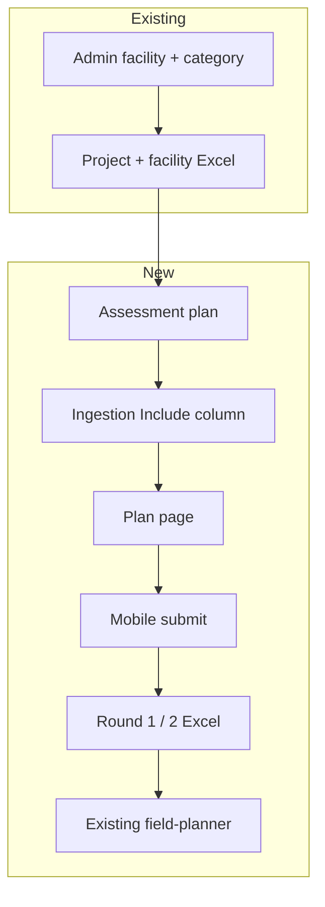
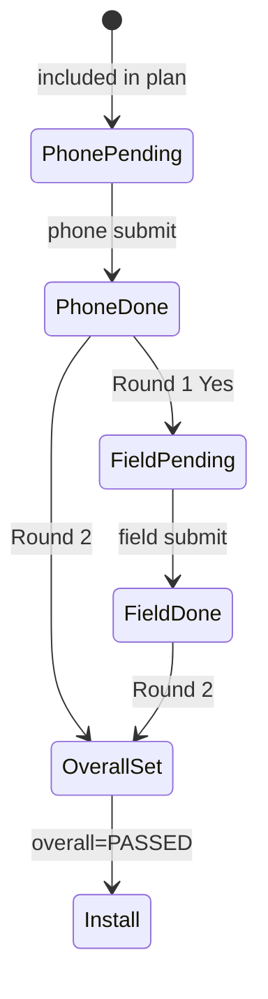

# Assessment Module — Low Level Design (LLD)

**Scope:** Implementation of the **assessment module**.


| Reference                                                                                                      | Use for          |
| -------------------------------------------------------------------------------------------------------------- | ---------------- |
| `E4H_Assessment_Module_PRD_3.docx`                                                                             | Business rules   |
| `Assessment forms - E4H (1) 1.xlsx`                                                                            | Form definitions |
| [FigJam workflow](https://www.figma.com/board/CzHGE9rmLUiIqCLlmFwK7T/Assessment-module---workflow?node-id=0-1) | Process          |


---

## Summary

### Already in the app (before assessment)

1. **Facilities onboarded** — Admin bulk-uploads facilities with **Category** (Health / Anganwadi).
2. **Create a project** — PM creates a project (state, dates, etc.).
3. **Attach facilities to project** — PM uses the existing Excel flow to link facilities to that project.

Facilities are on the **project**, not yet in an **assessment cycle**.

### Assessment module (new)

1. **Create an assessment plan** for that project (name, dates, phone/field assessors).
2. **Which facilities are in this assessment?** — Same project-facility Excel, column **Include in Assessment Plan = Yes / No**.
  - **Yes** → facility is in this assessment plan.
  - **No** → on project only, not in this plan.

### Mobile (phone / field assessor)

- **Phone:** sees plan facilities → fills phone form → submit → updates `eg_assessment_plan_facility` + inserts `eg_assessment_submission`.
- **Field:** sees only field-required facilities → field form → submit → updates `field_status`, `field_outcome` + new submission row.

### Project Manager — after phone submissions


| Step           | PM action                                                               | Purpose                                                                |
| -------------- | ----------------------------------------------------------------------- | ---------------------------------------------------------------------- |
| Round 1 Excel  | Field assessment required (Yes/No)                                      | Who needs site visit                                                   |
| Field assessor | Field form (Field Assist / iOS web)                                     | On-site assessment                                                     |
| Round 2 Excel  | Overall status (Passed / Review)                                        | Final decision                                                         |
| Field plan     | **Existing:** create plan → assign facilities + users (`field-planner`) | After Round 2 Passed; optional solution design / system type on assign |


### One-line flow

```
Facilities onboarded → Project → Facilities on project (Excel)
  → Assessment plan → Excel: Include in plan = Yes
  → Phone assessments → PM Round 1 → Field assessments → PM Round 2 → Existing field plan (facilities + users) → Installation
```

### Who does what


| Who            | Role                                                                |
| -------------- | ------------------------------------------------------------------- |
| Admin          | Facility onboarding (existing)                                      |
| PM             | Assessment plan, Excel Round 1 & 2; then existing **field plan** UI |
| Phone assessor | Phone form for every facility in plan (mobile / iOS web)            |
| Field assessor | Field form for Round 1 Yes facilities (mobile / iOS web)            |
| System         | Statuses, outcomes, validations                                     |


---

## 1. What we build


| Component                          | Service                    | New?           |
| ---------------------------------- | -------------------------- | -------------- |
| Assessment plan CRUD               | assessment-service         | Yes            |
| Plan facility + 5 status fields    | assessment-service         | Yes            |
| Phone/field form submit + outcome  | assessment-service         | Yes            |
| Handoff Passed HFs → field-planner | assessment → field-planner | Integrate only |
| Internal APIs for ingestion        | assessment-service         | Yes            |
| Excel: Include in plan column      | ingestion-service          | Extend         |
| Excel: Round 1 / Round 2           | ingestion-service          | New            |
| Plan page + Assessment tab         | Frontend                   | New            |





---

## 2. Assessment workflow

### 2.1 Implementation steps


| Step | Owner          | Action                             | API / mechanism                                                                                          |
| ---- | -------------- | ---------------------------------- | -------------------------------------------------------------------------------------------------------- |
| 1    | PM             | Create assessment plan             | `POST /assessment/v1/plan/_create`                                                                       |
| 2    | PM             | Include facilities in plan (Excel) | ingestion `createFacilityAndUpdateProject` + `planId` + **Include in Assessment Plan**                   |
| 3    | Phone assessor | Phone assessment                   | `POST /submission/phone/_create`                                                                         |
| 4    | PM             | Round 1 — field required           | ingestion Round 1 → `internal/plan/round1-apply`                                                         |
| 5    | Field assessor | Field assessment                   | `POST /submission/field/_create`                                                                         |
| 6    | PM             | Round 2 — overall status           | ingestion Round 2 → `internal/plan/round2-apply`                                                         |
| 7    | PM             | Create **field plan** (existing)   | **REUSE** `field-planner` + ingestion `createFieldPlanFacility`; assign users via existing activity APIs |


### 2.2 Status model (`eg_assessment_plan_facility`)




| Column           | Set by | When                          |
| ---------------- | ------ | ----------------------------- |
| `phone_status`   | System | Phone submit                  |
| `phone_outcome`  | System | Phone submit (outcome engine) |
| `field_status`   | System | Round 1 Excel upload          |
| `field_outcome`  | System | Field submit                  |
| `overall_status` | PM     | Round 2 Excel upload          |


### 2.3 What updates on phone submit


| Table                         | Operation  | Columns changed / inserted                                                         |
| ----------------------------- | ---------- | ---------------------------------------------------------------------------------- |
| `eg_assessment_submission`    | **INSERT** | Full submission row (`assessment_phase=PHONE`, answers JSON, outcome, etc.)        |
| `eg_assessment_plan_facility` | **UPDATE** | `phone_status` → `SUBMITTED`, `phone_outcome` → `PASSED` or `REVIEW`, audit fields |


### 2.4 What updates on field submit


| Table                         | Operation  | Columns changed / inserted                                           |
| ----------------------------- | ---------- | -------------------------------------------------------------------- |
| `eg_assessment_submission`    | **INSERT** | `assessment_phase=FIELD`, answers JSON, outcome                      |
| `eg_assessment_plan_facility` | **UPDATE** | `field_status` → `SUBMITTED`, `field_outcome` → `PASSED` or `REVIEW` |


### 2.5 Forms (mobile)


| Category  | Phone form  | Field form  |
| --------- | ----------- | ----------- |
| HEALTH    | `HF_PHONE`  | `HF_FIELD`  |
| ANGANWADI | `AWC_PHONE` | `AWC_FIELD` |


`POST /submission/form/_resolve` — routing by facility category + phase.

### 2.6 Assessor flow (Field Assist / iOS web — not PM web)


| Step         | API                                                 |
| ------------ | --------------------------------------------------- |
| Queue        | `POST /submission/queue/_search`                    |
| Resolve form | `POST /submission/form/_resolve`                    |
| Submit       | `POST /submission/phone/_create` or `field/_create` |


---

## 3. APIs — assessment-service

Base path: `/assessment/v1`

### 3.1 Plans


| Method | Endpoint        | Purpose                       | What it does                                                                                                                                                                   |
| ------ | --------------- | ----------------------------- | ------------------------------------------------------------------------------------------------------------------------------------------------------------------------------ |
| POST   | `/plan/_create` | Create plan under `projectId` | Validates `projectId` exists. Inserts one row in `eg_assessment_plan` (name, dates, phone/field assessor refs). Returns `planId` for Excel and mobile flows.                   |
| POST   | `/plan/_search` | List plans by `projectId`     | Returns all assessment plans for the given project (id, name, dates, status, assessors). Used on project Assessment tab.                                                       |
| POST   | `/plan/_detail` | Metrics + summary counts      | Returns plan metadata plus aggregated counts (e.g. total HFs in plan, phone pending/submitted, field pending/submitted, overall passed/review). Powers plan page metric cards. |
| POST   | `/plan/_update` | Update name, dates, assessors | Updates mutable fields on `eg_assessment_plan` only. Does not add/remove facilities or change workflow statuses.                                                               |


### 3.2 Plan facilities


| Method | Endpoint                               | Purpose                  | What it does                                                                                                                                                                                                                                        |
| ------ | -------------------------------------- | ------------------------ | --------------------------------------------------------------------------------------------------------------------------------------------------------------------------------------------------------------------------------------------------- |
| POST   | `/plan/facility/_search`               | Plan page list + filters | Returns paginated rows from `eg_assessment_plan_facility` for a `planId`, with facility name/category and all 5 status fields. Supports filters (phone_status, field_status, overall_status, etc.).                                                 |
| POST   | `/internal/plan/facility/_bulk-create` | Ingestion: Include = Yes | Called by ingestion after project-facility Excel upload. For each row with **Include in Assessment Plan = Yes**, inserts `eg_assessment_plan_facility` with `phone_status=PENDING`, `facility_category` snapshot. Skips duplicates already on plan. |
| POST   | `/internal/plan/round1-apply`          | Ingestion: Round 1       | Called after Round 1 Excel upload. For each row with **Field Assessment Required = Yes**, sets `field_status=PENDING` only if `phone_status=SUBMITTED`. Returns row errors for invalid rows.                                                        |
| POST   | `/internal/plan/round2-apply`          | Ingestion: Round 2       | Called after Round 2 Excel upload. Sets `overall_status` (Passed/Review) per row; validates phone submitted and field submitted when field was required. Updates `overall_status_set_by` / `overall_status_set_time`.                               |


### 3.3 Submissions


| Method | Endpoint                    | Purpose                  | What it does                                                                                                                                                                                                                                                          |
| ------ | --------------------------- | ------------------------ | --------------------------------------------------------------------------------------------------------------------------------------------------------------------------------------------------------------------------------------------------------------------- |
| POST   | `/submission/form/_resolve` | Form type + schema       | Input: `planId`, `facilityId`, phase (`PHONE`/`FIELD`). Reads facility category from master/plan row. Returns `formType` (`HF_PHONE`, `AWC_FIELD`, etc.) and MDMS schema reference for the mobile UI to render the form.                                              |
| POST   | `/submission/queue/_search` | Assessor queue           | Returns facilities the logged-in assessor may work on for assigned plan(s). Phone queue: `phone_status=PENDING`. Field queue: `field_status=PENDING` only. Includes facility id, name, category.                                                                      |
| POST   | `/submission/phone/_create` | Phone submit (immutable) | Validates answers and mandatory phone assessor name. Inserts `eg_assessment_submission` (`assessment_phase=PHONE`). Updates plan facility: `phone_status=SUBMITTED`, `phone_outcome=PASSED/REVIEW` via outcome engine. Rejects second phone submit for same facility. |
| POST   | `/submission/field/_create` | Field submit (immutable) | Same as phone for field phase. Requires `field_status=PENDING`. Inserts submission; sets `field_status=SUBMITTED`, `field_outcome=PASSED/REVIEW`. Rejects if field not enabled by Round 1.                                                                            |
| POST   | `/submission/_search`       | PM read-only view        | Returns stored submission JSON and metadata for a facility/plan (phone and/or field). No update — view only for PM on plan page.                                                                                                                                      |


### 3.4 After assessment — REUSE existing field plan

**Field plan** (installation planning) **already exists**. PM already: create field plan for a project → assign facilities → assign users. 

**What assessment module adds:**


| Piece        | Implementation                                                | What it does                                                                                                                                                                            |
| ------------ | ------------------------------------------------------------- | --------------------------------------------------------------------------------------------------------------------------------------------------------------------------------------- |
| Eligibility  | Only `overall_status = PASSED`                                | Field-planner / ingestion must reject facilities not Passed in assessment plan when PM builds install field plan.                                                                       |
| PRD fields   | Solution Design Type + System Type                            | Extend existing field-plan facility Excel or assign API payload (or `additionalDetails`) so PM sets design/system type per facility at assign time.                                     |
| Optional API | `POST /assessment/v1/internal/plan/passed-facilities/_search` | Returns list of facilities for a `planId` where `overall_status=PASSED` (facility id, name, category, assessment statuses). PM uses this when picking HFs for existing field-plan flow. |


---

## 4. APIs — ingestion-service


| Flow                      | Endpoint                                                             | Step     | What it does                                                                                                                                                           |
| ------------------------- | -------------------------------------------------------------------- | -------- | ---------------------------------------------------------------------------------------------------------------------------------------------------------------------- |
| Project + include in plan | `POST /ingestion-service/template/facilityIngestionTemplateWithData` | Download | Builds pre-filled Excel for project geography. When `planId` in request, adds column **Include in Assessment Plan** (Yes/No). PM downloads from existing project UI.   |
| Project + include in plan | `POST /ingestion-service/ingest/facilitiesValidateData`              | Validate | Parses uploaded file; validates columns, facility rules, Category, and Include Yes/No. Returns error file if rows invalid.                                             |
| Project + include in plan | `POST /ingestion-service/ingest/createFacilityAndUpdateProject`      | Apply    | Creates/updates facilities and links to **project** (existing). If `planId` present, calls assessment `internal/plan/facility/_bulk-create` for rows with Include=Yes. |
| Round 1                   | `POST /ingestion-service/template/assessmentPlanRound1Template`      | Download | Fetches from assessment plan facilities where `phone_status=SUBMITTED`. Excel has facility data + editable **Field Assessment Required** (Yes/No).                     |
| Round 1                   | `POST /ingestion-service/ingest/assessmentPlanRound1ValidateData`    | Validate | Checks planId, facility ids, Yes/No values, and phone-submitted rule per row.                                                                                          |
| Round 1                   | `POST /ingestion-service/ingest/assessmentPlanRound1Apply`           | Apply    | Calls assessment `internal/plan/round1-apply` to set `field_status=PENDING` for Yes rows.                                                                              |
| Round 2                   | `POST /ingestion-service/template/assessmentPlanRound2Template`      | Download | Pre-filled all plan facilities with current phone/field statuses and outcomes. PM edits **Overall Status** (Passed/Review).                                            |
| Round 2                   | `POST /ingestion-service/ingest/assessmentPlanRound2ValidateData`    | Validate | Validates overall status values and gating rules (phone done; field done if required).                                                                                 |
| Round 2                   | `POST /ingestion-service/ingest/assessmentPlanRound2Apply`           | Apply    | Calls assessment `internal/plan/round2-apply` to persist `overall_status` on each row.                                                                                 |


Excel job logging stays in **ingestion-service** (existing).

---

## 5. Data model — table definitions

No `eg_assessment_project` table. `project_id` references project service `project.id`.

---

### 5.1 `eg_assessment_plan`

One assessment cycle under a project.


| Column                     | Type           | Nullable | Default  | Description               |
| -------------------------- | -------------- | -------- | -------- | ------------------------- |
| `id`                       | `VARCHAR(64)`  | NO       | —        | PK (idgen)                |
| `tenant_id`                | `VARCHAR(64)`  | NO       | —        | Tenant                    |
| `project_id`               | `VARCHAR(64)`  | NO       | —        | FK → project.id (logical) |
| `name`                     | `VARCHAR(256)` | NO       | —        | Plan name                 |
| `start_date`               | `BIGINT`       | NO       | —        | Epoch ms                  |
| `end_date`                 | `BIGINT`       | NO       | —        | Epoch ms                  |
| `phone_assessor_user_id`   | `VARCHAR(64)`  | YES      | NULL     | Individual user (if used) |
| `phone_assessor_login_ref` | `VARCHAR(128)` | YES      | NULL     | Shared state login ref    |
| `field_assessor_user_id`   | `VARCHAR(64)`  | YES      | NULL     | Field assessor user       |
| `status`                   | `VARCHAR(32)`  | NO       | `ACTIVE` | `ACTIVE` / `CLOSED`       |
| `created_by`               | `VARCHAR(64)`  | NO       | —        | Audit                     |
| `last_modified_by`         | `VARCHAR(64)`  | NO       | —        | Audit                     |
| `created_time`             | `BIGINT`       | NO       | —        | Epoch ms                  |
| `last_modified_time`       | `BIGINT`       | NO       | —        | Epoch ms                  |


**Constraints:** `UNIQUE (tenant_id, project_id, name)`

**Indexes:** `(project_id)`, `(tenant_id, status)`

---

### 5.2 `eg_assessment_plan_facility`

One row per facility included in a plan. **Workflow status lives here.**


| Column                    | Type          | Nullable | Default   | Description                                  |
| ------------------------- | ------------- | -------- | --------- | -------------------------------------------- |
| `id`                      | `VARCHAR(64)` | NO       | —         | PK                                           |
| `tenant_id`               | `VARCHAR(64)` | NO       | —         | Tenant                                       |
| `plan_id`                 | `VARCHAR(64)` | NO       | —         | FK → `eg_assessment_plan.id`                 |
| `project_id`              | `VARCHAR(64)` | NO       | —         | Denormalized for queries                     |
| `facility_id`             | `VARCHAR(64)` | NO       | —         | Facility master id                           |
| `facility_category`       | `VARCHAR(32)` | NO       | —         | `HEALTH` / `ANGANWADI` (snapshot at include) |
| `phone_status`            | `VARCHAR(32)` | NO       | `PENDING` | `PENDING` / `SUBMITTED`                      |
| `phone_outcome`           | `VARCHAR(32)` | YES      | NULL      | `PASSED` / `REVIEW` (after phone submit)     |
| `field_status`            | `VARCHAR(32)` | YES      | NULL      | `NULL` / `PENDING` / `SUBMITTED`             |
| `field_outcome`           | `VARCHAR(32)` | YES      | NULL      | `PASSED` / `REVIEW` (after field submit)     |
| `overall_status`          | `VARCHAR(32)` | YES      | NULL      | `PASSED` / `REVIEW` (Round 2)                |
| `overall_status_set_by`   | `VARCHAR(64)` | YES      | NULL      | User id (PM)                                 |
| `overall_status_set_time` | `BIGINT`      | YES      | NULL      | Epoch ms                                     |
| `created_by`              | `VARCHAR(64)` | NO       | —         | Audit                                        |
| `last_modified_by`        | `VARCHAR(64)` | NO       | —         | Audit                                        |
| `created_time`            | `BIGINT`      | NO       | —         | Epoch ms                                     |
| `last_modified_time`      | `BIGINT`      | NO       | —         | Epoch ms                                     |


**Constraints:** `UNIQUE (plan_id, facility_id)`

**Indexes:** `(plan_id)`, `(plan_id, phone_status)`, `(plan_id, field_status)`, `(plan_id, overall_status)`, `(facility_id)`

**Check constraints (recommended):**

- `phone_status IN ('PENDING','SUBMITTED')`
- `phone_outcome IN ('PASSED','REVIEW')` or NULL
- `field_status IN ('PENDING','SUBMITTED')` or NULL
- `field_outcome IN ('PASSED','REVIEW')` or NULL
- `overall_status IN ('PASSED','REVIEW')` or NULL

---

### 5.3 `eg_assessment_submission`

Immutable form submission (phone or field). **No UPDATE** after insert.


| Column                   | Type           | Nullable | Default | Description                                      |
| ------------------------ | -------------- | -------- | ------- | ------------------------------------------------ |
| `id`                     | `VARCHAR(64)`  | NO       | —       | PK                                               |
| `tenant_id`              | `VARCHAR(64)`  | NO       | —       | Tenant                                           |
| `plan_id`                | `VARCHAR(64)`  | NO       | —       | FK → plan                                        |
| `plan_facility_id`       | `VARCHAR(64)`  | NO       | —       | FK → `eg_assessment_plan_facility.id`            |
| `facility_id`            | `VARCHAR(64)`  | NO       | —       | Facility id                                      |
| `assessment_phase`       | `VARCHAR(16)`  | NO       | —       | `PHONE` / `FIELD`                                |
| `form_type`              | `VARCHAR(64)`  | NO       | —       | `HF_PHONE`, `HF_FIELD`, `AWC_PHONE`, `AWC_FIELD` |
| `form_version`           | `VARCHAR(32)`  | YES      | NULL    | MDMS schema version                              |
| `submitted_by`           | `VARCHAR(64)`  | NO       | —       | User id                                          |
| `submitted_by_name`      | `VARCHAR(256)` | YES      | NULL    | Mandatory for phone (PRD)                        |
| `submission_data`        | `JSONB`        | NO       | —       | Answers + repeatable sections                    |
| `outcome`                | `VARCHAR(32)`  | NO       | —       | `PASSED` / `REVIEW`                              |
| `client_submission_time` | `BIGINT`       | YES      | NULL    | Device timestamp                                 |
| `server_received_time`   | `BIGINT`       | NO       | —       | Server timestamp                                 |
| `created_time`           | `BIGINT`       | NO       | —       | Insert time                                      |


**Constraints:** `UNIQUE (plan_facility_id, assessment_phase)` — one phone + one field per plan facility

**Indexes:** `(plan_id)`, `(plan_facility_id)`, `(facility_id, assessment_phase)`