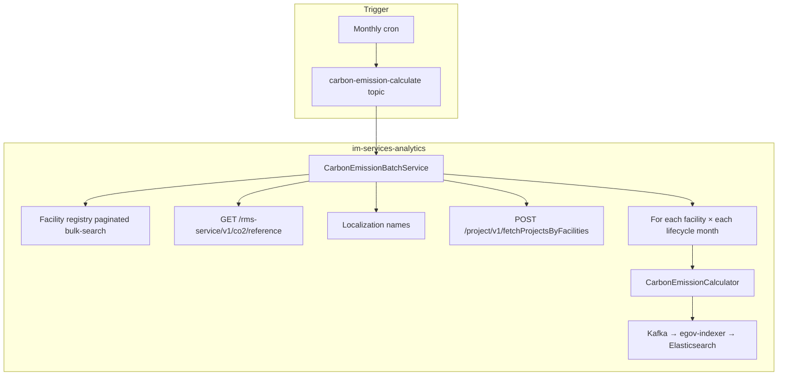
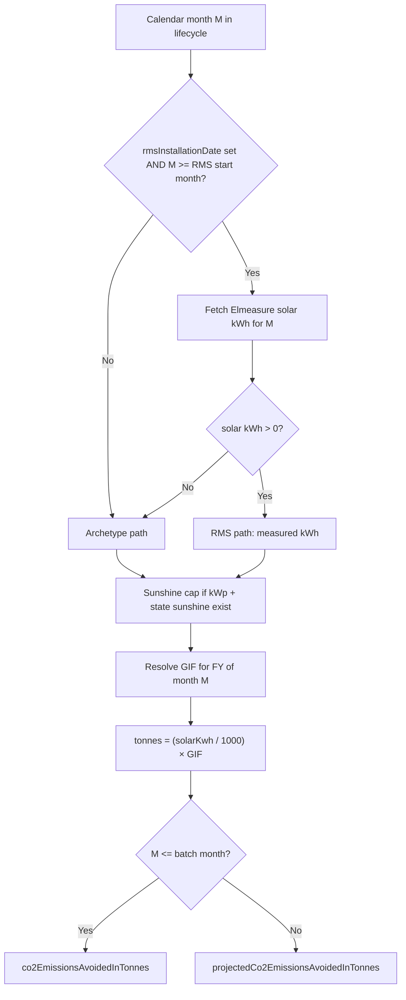

# CO₂ Dashboard — Calculation Flow (With RMS vs Without RMS)

---

## 1. High-level batch flow




| Step | Service                  | What happens                                                              |
| ---- | ------------------------ | ------------------------------------------------------------------------- |
| 1    | health-facility-registry | Paginated active facilities (`created_at` ASC); skip if no solar date/kWp |
| 2    | rms-service              | GIF, archetypes, sunshine hours (reference API)                           |
| 3    | project                  | `projectName` per facility (optional)                                     |
| 4    | rms-service              | Monthly solar kWh from Elmeasure (RMS facilities only, up to batch month) |
| 5    | im-services-analytics    | Compute tonnes per month → publish to actual or projection index          |


**Important:** Calculations run on **calendar months** (Jan–Dec). Only **GIF** uses the **Indian financial year** (Apr–Mar).

---

## 2. How we classify a facility: “with RMS” vs “without RMS”


| Status          | Condition in data                 | Meaning                                                                                                      |
| --------------- | --------------------------------- | ------------------------------------------------------------------------------------------------------------ |
| **Without RMS** | `rmsInstallationDate` is **null** | No meter path; **all months** use the **archetype estimate**                                                 |
| **With RMS**    | `rmsInstallationDate` is **set**  | From **RMS start month** onward, use **measured solar kWh** when available; otherwise archetype **fallback** |


There is no separate “RMS flag” in MDMS. RMS status is inferred from `**rmsInstallationDate`** on the facility record.

---

## 3. Timeline rules (both paths)

These apply before any formula runs.

### 3.1 Lifecycle window


| Rule                | Logic                                                                                           |
| ------------------- | ----------------------------------------------------------------------------------------------- |
| **Lifecycle start** | From `solarInstallationDate`: install day **< 15** → same calendar month; **≥ 15** → next month |
| **Lifecycle end**   | Start + **20 years** − 1 month (`co2.lifecycle.years`)                                          |
| **RMS data start**  | If `rmsInstallationDate` set → **month after** install (first month Elmeasure may be used)      |


### 3.2 Batch “as-of” month

The cron/message provides **batch month (M, Y)** (typically last completed calendar month).


| Month in lifecycle loop | Elasticsearch field                    | Index                                                  |
| ----------------------- | -------------------------------------- | ------------------------------------------------------ |
| ≤ (M, Y)                | `co2EmissionsAvoidedInTonnes`          | `co2-monthly-facility-index-`* (actual)                |
| > (M, Y)                | `projectedCo2EmissionsAvoidedInTonnes` | `co2-monthly-projection-facility-index-`* (projection) |


**Same tonnes formula** for both; only the time split and index differ.

---

## 4. Per-month decision (core logic)

For **every calendar month** from lifecycle start to lifecycle end:




**Code:** `CarbonEmissionBatchService.resolveMonthlyTonnes()` → `CarbonEmissionCalculator`.

---

## 5. Flow A — Facility **without RMS**

**When:** `rmsInstallationDate` is missing.

### 5.1 Every month in the 20-year lifecycle


| Step | What                                               |
| ---- | -------------------------------------------------- |
| 1    | Lookup archetype from `(state, facilityType)`      |
| 2    | Read **α** and **CY₁** for that archetype          |
| 3    | Estimate monthly solar kWh (calendar year growth): |


```
growth = (1.05)^(t − t₀)     // t₀ = solar install year, t = calendar year of month M
solarKwh = α × (CY₁ / 12) × growth
```

| 4 | Apply sunshine cap (if `solarSystemCapacityKwp` and state sunshine hours exist): |

```
maxSolarKwh = kWp × sunshine_hours_per_day × days_in_month(M)
solarKwh = min(solarKwh, maxSolarKwh)
```

| 5 | Resolve **GIF** for Indian FY that contains month M |
| 6 | `tonnes = (solarKwh / 1000) × GIF` |
| 7 | Store as actual or projection depending on M vs batch month |

### 5.2 Diagram (no RMS)

```
Solar install ─────────────────────────────────────────► Lifecycle end (20 yr)
     │                                                                 │
     │  ALL months: archetype estimate (+ cap) × GIF                   │
     │  ≤ batch month → actual index                                     │
     │  > batch month → projection index                                 │
     └─────────────────────────────────────────────────────────────────┘
```

**No call** to Elmeasure / `POST /rms-service/v1/co2/consumption/monthly/batch` for consumption (RMS month list is empty).

---

## 6. Flow B — Facility **with RMS**

**When:** `rmsInstallationDate` is set.

### 6.1 Three time bands (conceptual)


| Band                  | Calendar months                          | Solar kWh source                                                  | CO₂ field (if ≤ / > batch month) |
| --------------------- | ---------------------------------------- | ----------------------------------------------------------------- | -------------------------------- |
| **Pre-RMS**           | Lifecycle start → month before RMS start | **Archetype** (same as Flow A)                                    | Actual                           |
| **RMS actuals**       | RMS start → batch month                  | **Elmeasure** monthly solar kWh when > 0; else archetype fallback | Actual                           |
| **Future projection** | Month after batch → lifecycle end        | **Archetype** (no future meter data)                              | Projection                       |


### 6.2 Pre-RMS months

Identical to **Flow A** (archetype + growth + cap + GIF).

### 6.3 RMS months (meter data)


| Step | What                                                                                         |
| ---- | -------------------------------------------------------------------------------------------- |
| 1    | Batch loads solar kWh from rms-service for months from **RMS start** through **batch month** |
| 2    | For month M, if `solarKwh > 0`:                                                              |


```
tonnes = (measured_solarKwh / 1000) × GIF(FY of M)
```

(after sunshine cap on measured kWh)

| 3 | If missing or zero → **fallback** to archetype for that month |

### 6.4 Future months (after batch month)

Elmeasure is **not** fetched for future months. Loop still runs through lifecycle end using **archetype** only → `projectedCo2EmissionsAvoidedInTonnes`.

### 6.5 Diagram (with RMS)

```
Solar install          RMS install (+1 month)              Batch month (M,Y)        Lifecycle end
     │                        │                                  │                        │
     │◄── Pre-RMS ────────────►│◄──── RMS actuals (meter) ───────►│◄── Projections ───────►│
     │     archetype           │     Elmeasure kWh × GIF          │     archetype × GIF    │
     │                         │     (fallback: archetype)        │                        │
     │                         │                                  │                        │
     └─ actual index ──────────┴──────── actual index ────────────┴─ projection index ─────┘
```

---

## 7. Shared steps (both flows)

### 7.1 Sunshine cap (PRD)

Applied to **both** archetype and RMS solar kWh when:

- `solarSystemCapacityKwp` > 0, and  
- `state_sunshine_hours` has a row for facility `state`

If cap applies and raw kWh exceeds max → use max; batch logs a warning.

### 7.2 GIF (financial year only)

For calendar month `month`, `year`:


| Calendar month | Indian FY key                               |
| -------------- | ------------------------------------------- |
| April–December | `{year}-{year+1}` e.g. Jun 2026 → `2026-27` |
| January–March  | `{year-1}-{year}` e.g. Mar 2026 → `2025-26` |


Use published `grid_intensity_factor` if present; else `projected_grid_intensity_factor` (seeded per PRD −1.5%/year from last published 0.961).

### 7.3 Final tonnes

```
CO₂ avoided (tonnes) = (solarKwh / 1000) × GIF
```

- **solarKwh** — archetype estimate or measured (after cap)  
- **GIF** — tCO₂/MWh for that month’s FY  
- **÷ 1000** — kWh → MWh scale used in indexes

---

## 8. Worked comparison (same facility type, different RMS status)

Assume batch month = **May 2026**, archetype A4, Odisha Sub Center, GIF for FY 2026-27 = 0.933.

### 8.1 Without RMS (solar Mar 2023, no `rmsInstallationDate`)


| Month               | Path                   | Typical source of solar kWh |
| ------------------- | ---------------------- | --------------------------- |
| Mar 2023 – May 2026 | Archetype              | α, CY₁, growth              |
| Jun 2026 – Feb 2043 | Archetype (projection) | Same formula                |


### 8.2 With RMS (solar Mar 2023, RMS May 2025 → data from Jun 2025)


| Month               | Path                            | Typical source of solar kWh |
| ------------------- | ------------------------------- | --------------------------- |
| Mar 2023 – May 2025 | Archetype                       | Pre-RMS                     |
| Jun 2025 – May 2026 | RMS (or archetype if meter gap) | Elmeasure                   |
| Jun 2026 – Feb 2043 | Archetype (projection)          | No future meter             |


---

## 9. Example

Template columns: Facility Id, name, Elmeasure name, solar date, kWp, RMS date, RMS status.  
Assume batch month = **May 2026**; registry provides state/type for archetype lookup.

### 9.1 Example A — **Without RMS**: Kadamguda (`FAC/2025/3201`)


| Field         | Value                                                                          |
| ------------- | ------------------------------------------------------------------------------ |
| Solar install | **2026-01-28**                                                                 |
| kWp           | **2.3**                                                                        |
| RMS           | **None** (template: Without RMS)                                               |
| Registry      | `India_Odisha`, **Sub Center** → archetype **A6** (α ≈ 0.793, CY₁ ≈ 1,378 kWh) |


**Timeline:** install day ≥ 15 → lifecycle **Feb 2026** → Feb 2046. **All months = archetype** (no Elmeasure).

**Feb 2026 (matches UAT Kibana `co2EmissionsAvoidedInTonnes` = 0.086221)**

1. `solarKwh = 0.793 × (1378.25/12) × (1.05)^(2026−2026) ≈ 91.1` kWh
2. Cap = `2.3 × 5.0 × 28 = 322` kWh → no cap
3. FY **2025-26** → GIF **0.947**
4. `tonnes = (91.1/1000) × 0.947 = **0.086221`** → actual index


| Months         | Path      | Stored as                              |
| -------------- | --------- | -------------------------------------- |
| Feb–May 2026   | Archetype | `co2EmissionsAvoidedInTonnes`          |
| Jun 2026 → end | Archetype | `projectedCo2EmissionsAvoidedInTonnes` |


---

### 9.2 Example B — **With RMS**: Santipur-Mahamaya (`FAC/2025/0198`)


| Field         | Value          |
| ------------- | -------------- |
| Solar install | **2025-04-27** |
| RMS install   | **2025-11-15** |
| kWp           | **6.6**        |
| Elmeasure     | Santipur MPHC  |


**Timeline:** lifecycle **May 2025**; RMS data from **Dec 2025**; batch **May 2026**.


| Period      | Months            | Solar kWh                            |
| ----------- | ----------------- | ------------------------------------ |
| Pre-RMS     | May–Nov 2025      | Archetype                            |
| RMS actuals | Dec 2025–May 2026 | Elmeasure if kWh > 0, else archetype |
| Projection  | Jun 2026 → end    | Archetype                            |


**Mar 2025 (pre-RMS, archetype):** ≈ 148 kWh → FY 2024-25, GIF 0.961 → **≈ 0.142 t**  
**May 2026 (RMS):** e.g. 172 kWh meter → `(172/1000) × 0.933 ≈ 0.160 t` actual  

---

