# Admin Functionality Low Level Design (LLD)

## Executive Summary

This document outlines the Low Level Design (LLD) for Admin functionality in the E4H Digital Platform. The admin functionality is divided into two main parts: **Facility Management** and **Organization Management**. This design enhances existing microservices (health-facility-registry, vendor-registry, hrms, ingestion-service) without creating new microservices, following the platform's architecture principles.

## Background & Context

### Current System Architecture

The platform already implements:

- **Health Facility Registry** (`backend/core-services/health-facility-registry`): Manages facility registry with basic CRUD operations
- **Vendor Registry** (`backend/e4h-services/vendor-registry`): Manages organization/vendor registry
- **HRMS Service** (`backend/e4h-services/egov-hrms`): Manages employee/user creation and management
- **Ingestion Service** (`backend/e4h-services/ingestion-service`): Handles bulk data ingestion via Excel
- **Boundary Service** (`backend/core-services/boundary-service`): Manages geographical boundaries
- **Field Planner Activity Service** (`backend/e4h-services/field-planner-activity`): Tracks activities by facility
- **Asset Registry** (`backend/e4h-services/asset-registry`): Manages assets at facilities
- **AMC Scheduler Service** (`backend/e4h-services/amc-scheduler-service`): Manages AMC configurations

### Problem Statement

The current system lacks comprehensive admin functionality for:

1. **Facility Management**:
   - Bulk facility operations with Excel ingestion
   - Facility POC management and HRMS integration
   - Search capabilities for activities, assets, and AMC configurations by facility
   - Boundary management for facilities

2. **Organization Management**:
   - Organization type differentiation (platform vs vendor)
   - User-organization associations
   - Organization-specific user management with role-based access

## Solution Architecture

### Core Data Model

#### 1. Facility Entity Extensions

The existing `facility` table needs the following additional fields:

```
facility:
  - facility_poc_name (VARCHAR 256)
  - facility_poc_phone (VARCHAR 64) - Encrypted using encryption service
  - facility_poc_email (VARCHAR 256)
  - hfr_id (VARCHAR 128)
  - nin_id (VARCHAR 128)
  - facility_status (VARCHAR 64) - ACTIVE, INACTIVE, UNDER_MAINTENANCE
  - is_onm_ready (BOOLEAN) - Default FALSE
  - user_id (VARCHAR 128) - Reference to user when ONM ready
```

**Key Characteristics:**

- POC phone numbers are encrypted using encryption service (similar to vendor-registry contact details encryption)
- Encryption key: Use encryption service endpoint `/egov-enc-service/crypto/v1/_encrypt` with appropriate key

**Key Characteristics:**

- POC details are stored at facility level
- When `is_onm_ready` is set to true, HRMS user is created automatically
- Facility boundary is stored as `boundary_code` (existing field)
- Boundary hierarchy: Country → State → District → Block → Facility

#### 2. Organization Entity Extensions

The existing `organisation` table needs the following additional fields:

```
organisation:
  - org_type (VARCHAR 64) - PLATFORM or VENDOR
  - org_sub_type (VARCHAR 256) - NULL or AMC_VENDOR or INSTALLATION_VENDOR
  - org_poc_name (VARCHAR 256)
  - org_poc_phone (VARCHAR 64) - Encrypted using encryption service
  - org_poc_email (VARCHAR 256)
  - org_poc_username (VARCHAR 128)
  - org_status (VARCHAR 64) - ACTIVE, INACTIVE, SUSPENDED
```

**Key Characteristics:**

- Organization type differentiates platform vs vendor organizations
- Org POC phone number is encrypted using encryption service (similar to vendor-registry contact details encryption)
- Org POC username is used for authorization (only POC can edit their org)
- Org status tracks organization lifecycle

#### 3. Organization User Association Entity

```
organisation_user:
  - id (PK)
  - tenant_id
  - organisation_id (FK to organisation)
  - user_uuid (FK to egov_user)
  - created_by, created_time
  - last_modified_by, last_modified_time
```

**Key Characteristics:**

- Simple mapping table linking users to organizations
- One user can belong to only one organization (enforced by unique constraint on user_uuid)
- All user details (name, phone, email, roles, jurisdiction) are stored in HRMS
- When querying org users, fetch user details from HRMS service

### Database Schema Extensions

Building on existing tables:

- `facility` (existing) - Enhanced with POC fields and ONM ready flag
- `organisation` (existing) - Enhanced with org type and POC fields
- `organisation_user` (new) - Simple mapping table linking users to organizations

## API Specifications

### Facility Registry API Enhancements

**Note:** The following APIs already exist and are being enhanced with new fields:

- `POST /facility-service/v2/facility/create` - Existing, enhanced with POC fields
- `POST /facility-service/v2/facility/update` - Existing, enhanced with POC fields and HRMS integration
- `GET /facility-service/v2/facility/search` - Existing, enhanced to support boundary-based search

**Note:** Facility search API (`GET /facility-service/v2/facility/search`) already exists and will be enhanced to support the new facility fields (POC details, hfr_id, nin_id, facility_status, is_onm_ready, boundary_code filtering).

**Enhancement Required for Facility Search:**

The existing `GET /facility-service/v2/facility/search` endpoint needs to be enhanced to support:

- Search by `boundaryCode` (facility boundary)
- Filter by `facilityStatus`
- Filter by `isOnmReady`
- Filter by `hfrId` or `ninId`
- Return all new POC fields (encrypted phone numbers will be decrypted before returning)

```yaml
openapi: 3.1.0
info:
  title: Health Facility Registry API
  version: "2.1.0"
  description: >
    Enhanced facility search API specification.

tags:
  - name: Facilities
    description: Facility management endpoints

paths:
  /facility-service/v2/facility/search:
    get:
      tags:
        - Facilities
      summary: Search facilities (Enhanced)
      operationId: searchFacilities
      parameters:
        - name: tenantId
          in: query
          required: true
          schema:
            type: string
        - name: facilityId
          in: query
          schema:
            type: string
        - name: boundaryCode
          in: query
          schema:
            type: string
          description: Search by facility boundary code
        - name: facilityStatus
          in: query
          schema:
            type: string
            enum: [ACTIVE, INACTIVE, UNDER_MAINTENANCE]
        - name: isOnmReady
          in: query
          schema:
            type: boolean
        - name: hfrId
          in: query
          schema:
            type: string
        - name: ninId
          in: query
          schema:
            type: string
        - name: facilityName
          in: query
          schema:
            type: string
        - name: facilityType
          in: query
          schema:
            type: string
      responses:
        "200":
          description: Search results with enhanced facility fields
          content:
            application/json:
              schema:
                $ref: "#/components/schemas/FacilitySearchResponse"
        "400":
          description: Invalid search criteria

components:
  schemas:
    FacilityCreateRequest:
      type: object
      required:
        - RequestInfo
        - Facilities
      properties:
        RequestInfo:
          $ref: "https://raw.githubusercontent.com/egovernments/DIGIT-Specs/common-contract-update/Common%20Services/common-contract.yaml#/components/schemas/RequestInfo"
        Facilities:
          type: array
          items:
            $ref: "#/components/schemas/FacilityCreate"

    FacilityCreate:
      type: object
      required:
        - tenantId
        - facilityName
        - facilityType
        - boundaryCode
      properties:
        tenantId:
          type: string
        facilityName:
          type: string
        facilityType:
          type: string
        facilityCategory:
          type: string
        facilityPocName:
          type: string
          description: Name of Point of Contact
        facilityPocPhone:
          type: string
          description: Phone number of POC
        facilityPocEmail:
          type: string
          format: email
          description: Email of POC
        hfrId:
          type: string
          description: Health Facility Registry ID
        ninId:
          type: string
          description: National Identification Number
        facilityStatus:
          type: string
          enum: [ACTIVE, INACTIVE, UNDER_MAINTENANCE]
          description: Status of the facility
        isOnmReady:
          type: boolean
          default: false
          description: Whether facility is ONM ready
        boundaryCode:
          type: string
          description: Boundary code (Country.State.District.Block.Facility)
        address:
          $ref: "#/components/schemas/FacilityAddress"

    FacilityUpdateRequest:
      type: object
      required:
        - RequestInfo
        - Facilities
      properties:
        RequestInfo:
          $ref: "https://raw.githubusercontent.com/egovernments/DIGIT-Specs/common-contract-update/Common%20Services/common-contract.yaml#/components/schemas/RequestInfo"
        Facilities:
          type: array
          items:
            $ref: "#/components/schemas/FacilityUpdate"

    FacilityUpdate:
      type: object
      required:
        - facilityId
        - tenantId
      properties:
        facilityId:
          type: string
        tenantId:
          type: string
        facilityName:
          type: string
        facilityPocName:
          type: string
        facilityPocPhone:
          type: string
        facilityPocEmail:
          type: string
          format: email
        facilityStatus:
          type: string
          enum: [ACTIVE, INACTIVE, UNDER_MAINTENANCE]
        isOnmReady:
          type: boolean

    FacilitySearchRequest:
      type: object
      required:
        - RequestInfo
        - criteria
      properties:
        RequestInfo:
          $ref: "https://raw.githubusercontent.com/egovernments/DIGIT-Specs/common-contract-update/Common%20Services/common-contract.yaml#/components/schemas/RequestInfo"
        criteria:
          $ref: "#/components/schemas/FacilitySearchCriteria"
        limit:
          type: integer
          default: 100
        offset:
          type: integer
          default: 0

    FacilitySearchCriteria:
      type: object
      properties:
        tenantId:
          type: string
          required: true
        facilityId:
          type: string
        facilityIds:
          type: array
          items:
            type: string
        boundaryCode:
          type: string
        facilityStatus:
          type: string
        isOnmReady:
          type: boolean
        facilityName:
          type: string
        facilityType:
          type: string

    Facility:
      type: object
      properties:
        facilityId:
          type: string
        tenantId:
          type: string
        facilityName:
          type: string
        facilityType:
          type: string
        facilityCategory:
          type: string
        facilityPocName:
          type: string
        facilityPocPhone:
          type: string
        facilityPocEmail:
          type: string
        hfrId:
          type: string
        ninId:
          type: string
        facilityStatus:
          type: string
        isOnmReady:
          type: boolean
        hrmsUserUuid:
          type: string
          description: HRMS user UUID when facility is ONM ready
        boundaryCode:
          type: string
        address:
          $ref: "#/components/schemas/FacilityAddress"
        createdBy:
          type: string
        createdAt:
          type: integer
          format: int64
        updatedBy:
          type: string
        updatedAt:
          type: integer
          format: int64

    FacilityAddress:
      type: object
      properties:
        doorNo:
          type: string
        buildingName:
          type: string
        street:
          type: string
        localityCode:
          type: string
        city:
          type: string
        pincode:
          type: string
        latitude:
          type: number
          format: double
        longitude:
          type: number
          format: double

    FacilityCreateResponse:
      type: object
      properties:
        ResponseInfo:
          $ref: "https://raw.githubusercontent.com/egovernments/DIGIT-Specs/common-contract-update/Common%20Services/common-contract.yaml#/components/schemas/ResponseInfo"
        Facilities:
          type: array
          items:
            $ref: "#/components/schemas/Facility"

    FacilityUpdateResponse:
      type: object
      properties:
        ResponseInfo:
          $ref: "https://raw.githubusercontent.com/egovernments/DIGIT-Specs/common-contract-update/Common%20Services/common-contract.yaml#/components/schemas/ResponseInfo"
        Facilities:
          type: array
          items:
            $ref: "#/components/schemas/Facility"

    FacilitySearchResponse:
      type: object
      properties:
        ResponseInfo:
          $ref: "https://raw.githubusercontent.com/egovernments/DIGIT-Specs/common-contract-update/Common%20Services/common-contract.yaml#/components/schemas/ResponseInfo"
        Facilities:
          type: array
          items:
            $ref: "#/components/schemas/Facility"
        totalCount:
          type: integer
```

### Ingestion Service API Enhancements

**Note:** The following ingestion APIs already exist:

- `POST /ingestion-service/ingest/facilities` - Existing facility bulk ingestion endpoint
- `GET /ingestion-service/template/facilityIngestion` - Existing facility template download endpoint
- `POST /ingestion-service/ingest/boundaries` - Existing boundary bulk ingestion endpoint

**Enhancement Required:**

- The existing facility bulk ingestion endpoint (`POST /ingestion-service/ingest/facilities`) needs to be enhanced to support the `are_facilities_onm_ready` query parameter to indicate if all facilities in the batch are ONM ready. This parameter should trigger HRMS user creation for all POCs after facility creation.

### Vendor Registry API Enhancements

**Note:** The following APIs already exist and are being enhanced with new fields:

- `POST /org-services/organisation/v1/_create` - Existing, enhanced with org type and POC fields
- `POST /org-services/organisation/v1/_update` - Existing, enhanced with org type and POC fields
- `POST /org-services/organisation/v1/_search` - Existing, enhanced to support org type and org name search
- `POST /org-services/organisation/v1/user/_create` - Existing, enhanced for vendor/admin org user creation
- `POST /org-services/organisation/v1/user/_search` - Existing, enhanced to support filtering by username, phone, role

**Note:** Organisation search API (`POST /org-services/organisation/v1/_search`) already exists and will be enhanced to support org type and org name filtering. Use search API with `id` in criteria instead of creating a separate `_get` endpoint.

**New APIs Required:**

```yaml
openapi: 3.1.0
info:
  title: Organisation Service API
  version: "1.1.0"
  description: >
    New API endpoints for organization user management with HRMS integration.

tags:
  - name: OrganisationUser
    description: Organization user management endpoints

paths:
  /org-services/organisation/v1/users/_create:
    post:
      tags:
        - OrganisationUser
      summary: Create user and add to organization
      operationId: createUserAndAddToOrganisation
      description: >
        Creates a new user via HRMS service and adds them to the organization.
        If a user with the same phone number already exists:
        - If user has no organization: Adds user to this organization
        - If user already belongs to another organization: Returns 400 Bad Request
      requestBody:
        description: Organization ID and user creation data
        required: true
        content:
          application/json:
            schema:
              $ref: "#/components/schemas/OrgUserCreateRequest"
      responses:
        "201":
          description: User created and added to organization successfully
          content:
            application/json:
              schema:
                $ref: "#/components/schemas/OrgUserResponse"
        "400":
          description: Invalid input data or user already belongs to another organization
        "409":
          description: User already belongs to another organization

  /org-services/organisation/v1/users/_update:
    post:
      tags:
        - OrganisationUser
      summary: Update organization user
      operationId: updateOrgUser
      description: >
        Updates user details via HRMS service and updates organization user record.
        If phone number is updated and a user with the new phone number exists:
        - If user has no organization: Updates user and adds to this organization
        - If user belongs to a different organization: Returns 400 Bad Request
      requestBody:
        description: Organization ID, org user ID, and updated user data
        required: true
        content:
          application/json:
            schema:
              $ref: "#/components/schemas/OrgUserUpdateRequest"
      responses:
        "200":
          description: User updated successfully
          content:
            application/json:
              schema:
                $ref: "#/components/schemas/OrgUserResponse"
        "400":
          description: Invalid input data or user with phone number belongs to another organization

  /org-services/organisation/v1/users/_delete:
    post:
      tags:
        - OrganisationUser
      summary: Remove user from organization
      operationId: removeUserFromOrganisation
      description: >
        Removes a user from the organization. This operation is blocked if the user has any active activity assignments
        in the field-planner service. Only users without activity assignments can be removed from an organization.
      requestBody:
        description: Organization ID, org user ID, and request info
        required: true
        content:
          application/json:
            schema:
              $ref: "#/components/schemas/OrgUserDeleteRequest"
      responses:
        "200":
          description: User removed successfully
          content:
            application/json:
              schema:
                $ref: "https://raw.githubusercontent.com/egovernments/DIGIT-Specs/common-contract-update/Common%20Services/common-contract.yaml#/components/schemas/ResponseInfo"
        "409":
          description: User cannot be removed as they have active activity assignments
          content:
            application/json:
              schema:
                $ref: "#/components/schemas/OrgUserDeleteErrorResponse"

components:
  schemas:
    OrganisationCreateRequest:
      type: object
      required:
        - RequestInfo
        - Organisation
      properties:
        RequestInfo:
          $ref: "https://raw.githubusercontent.com/egovernments/DIGIT-Specs/common-contract-update/Common%20Services/common-contract.yaml#/components/schemas/RequestInfo"
        Organisation:
          $ref: "#/components/schemas/OrganisationCreate"

    OrganisationCreate:
      type: object
      required:
        - tenantId
        - name
        - orgType
      properties:
        tenantId:
          type: string
        name:
          type: string
        orgType:
          type: string
          enum: [PLATFORM, VENDOR]
          description: Type of organization (PLATFORM for platform/admin orgs, VENDOR for vendor orgs)
        orgSubType:
		  type: string
		  description: Sub Type of organization
        orgPocName:
          type: string
          description: Name of organization POC
        orgPocPhone:
          type: string
          description: Phone number of POC
        orgPocEmail:
          type: string
          format: email
          description: Email of POC
        orgPocUsername:
          type: string
          description: Username for POC
        orgStatus:
          type: string
          enum: [ACTIVE, INACTIVE, SUSPENDED]
          default: ACTIVE
        contactDetails:
          type: array
          items:
            $ref: "#/components/schemas/ContactDetails"
        orgAddress:
          type: array
          items:
            $ref: "#/components/schemas/Address"

    OrganisationUpdateRequest:
      type: object
      required:
        - RequestInfo
        - Organisation
      properties:
        RequestInfo:
          $ref: "https://raw.githubusercontent.com/egovernments/DIGIT-Specs/common-contract-update/Common%20Services/common-contract.yaml#/components/schemas/RequestInfo"
        Organisation:
          $ref: "#/components/schemas/OrganisationUpdate"

    OrganisationUpdate:
      type: object
      required:
        - id
        - tenantId
      properties:
        id:
          type: string
        tenantId:
          type: string
        name:
          type: string
        orgPocName:
          type: string
        orgPocPhone:
          type: string
        orgPocEmail:
          type: string
          format: email
        orgStatus:
          type: string
          enum: [ACTIVE, INACTIVE, SUSPENDED]

    OrganisationSearchRequest:
      type: object
      required:
        - RequestInfo
        - criteria
      properties:
        RequestInfo:
          $ref: "https://raw.githubusercontent.com/egovernments/DIGIT-Specs/common-contract-update/Common%20Services/common-contract.yaml#/components/schemas/RequestInfo"
        criteria:
          $ref: "#/components/schemas/OrganisationSearchCriteria"
        limit:
          type: integer
          default: 100
        offset:
          type: integer
          default: 0

    OrganisationSearchCriteria:
      type: object
      required:
        - tenantId
      properties:
        tenantId:
          type: string
        id:
          type: string
        ids:
          type: array
          items:
            type: string
        orgType:
          type: string
          enum: [PLATFORM, VENDOR]
        name:
          type: string
        orgStatus:
          type: string
          enum: [ACTIVE, INACTIVE, SUSPENDED]

    Organisation:
      type: object
      properties:
        id:
          type: string
        tenantId:
          type: string
        name:
          type: string
        orgNumber:
          type: string
        orgType:
          type: string
          enum: [PLATFORM, VENDOR]
        orgPocName:
          type: string
        orgPocPhone:
          type: string
        orgPocEmail:
          type: string
        orgPocUsername:
          type: string
        orgStatus:
          type: string
        applicationStatus:
          type: string
        contactDetails:
          type: array
          items:
            $ref: "#/components/schemas/ContactDetails"
        orgAddress:
          type: array
          items:
            $ref: "#/components/schemas/Address"

    ContactDetails:
      type: object
      properties:
        contactMobileNumber:
          type: string
        contactEmail:
          type: string
          format: email

    Address:
      type: object
      properties:
        doorNo:
          type: string
        buildingName:
          type: string
        street:
          type: string
        city:
          type: string
        pincode:
          type: string

    OrganisationResponse:
      type: object
      properties:
        ResponseInfo:
          $ref: "https://raw.githubusercontent.com/egovernments/DIGIT-Specs/common-contract-update/Common%20Services/common-contract.yaml#/components/schemas/ResponseInfo"
        Organisation:
          $ref: "#/components/schemas/Organisation"

    OrganisationSearchResponse:
      type: object
      properties:
        ResponseInfo:
          $ref: "https://raw.githubusercontent.com/egovernments/DIGIT-Specs/common-contract-update/Common%20Services/common-contract.yaml#/components/schemas/ResponseInfo"
        Organisation:
          type: array
          items:
            $ref: "#/components/schemas/Organisation"
        totalCount:
          type: integer

    OrgUserCreateRequest:
      type: object
      required:
        - RequestInfo
        - organisationId
        - User
      properties:
        RequestInfo:
          $ref: "https://raw.githubusercontent.com/egovernments/DIGIT-Specs/common-contract-update/Common%20Services/common-contract.yaml#/components/schemas/RequestInfo"
        organisationId:
          type: string
          description: Organization ID
        User:
          $ref: "#/components/schemas/OrgUserCreate"

    OrgUserCreate:
      type: object
      required:
        - tenantId
        - name
        - phoneNumber
        - email
        - username
        - roles
      properties:
        tenantId:
          type: string
        name:
          type: string
        username:
          type: string
        phoneNumber:
          type: string
          description: Phone number to check for existing users
        email:
          type: string
          format: email
        roles:
          type: array
          items:
            type: string
          description: Array of role codes from MDMS (VendorOrgRoles or PlatformOrgRoles)
        jurisdiction:
          type: array
          items:
            type: string
          description: Array of boundary codes (for platform org users only)

    OrgUserUpdateRequest:
      type: object
      required:
        - RequestInfo
        - organisationId
        - orgUserId
        - User
      properties:
        RequestInfo:
          $ref: "https://raw.githubusercontent.com/egovernments/DIGIT-Specs/common-contract-update/Common%20Services/common-contract.yaml#/components/schemas/RequestInfo"
        organisationId:
          type: string
          description: Organization ID
        orgUserId:
          type: string
          description: Organization user ID
        User:
          $ref: "#/components/schemas/OrgUserUpdate"

    OrgUserUpdate:
      type: object
      required:
        - tenantId
      properties:
        tenantId:
          type: string
        name:
          type: string
        phoneNumber:
          type: string
        email:
          type: string
          format: email
        roles:
          type: array
          items:
            type: string
        jurisdiction:
          type: array
          items:
            type: string

    OrgUserSearchRequest:
      type: object
      required:
        - RequestInfo
        - organisationId
        - criteria
      properties:
        RequestInfo:
          $ref: "https://raw.githubusercontent.com/egovernments/DIGIT-Specs/common-contract-update/Common%20Services/common-contract.yaml#/components/schemas/RequestInfo"
        organisationId:
          type: string
          description: Organization ID
        criteria:
          $ref: "#/components/schemas/OrgUserSearchCriteria"
        limit:
          type: integer
          default: 100
        offset:
          type: integer
          default: 0

    OrgUserSearchCriteria:
      type: object
      required:
        - tenantId
      properties:
        tenantId:
          type: string
        username:
          type: string
        phoneNumber:
          type: string
        roles:
          type: array
          items:
            type: string

    OrgUser:
      type: object
      properties:
        id:
          type: string
        organisationId:
          type: string
        userUuid:
          type: string
          description: HRMS user UUID
        userDetails:
          $ref: "#/components/schemas/UserDetails"
          description: User details fetched from HRMS

    UserDetails:
      type: object
      properties:
        name:
          type: string
        email:
          type: string
        mobileNumber:
          type: string
        username:
          type: string
        roles:
          type: array
          items:
            type: object
            properties:
              code:
                type: string
              name:
                type: string
        jurisdiction:
          type: array
          items:
            type: string

    OrgUserResponse:
      type: object
      properties:
        ResponseInfo:
          $ref: "https://raw.githubusercontent.com/egovernments/DIGIT-Specs/common-contract-update/Common%20Services/common-contract.yaml#/components/schemas/ResponseInfo"
        OrgUser:
          $ref: "#/components/schemas/OrgUser"

    OrgUserSearchResponse:
      type: object
      properties:
        ResponseInfo:
          $ref: "https://raw.githubusercontent.com/egovernments/DIGIT-Specs/common-contract-update/Common%20Services/common-contract.yaml#/components/schemas/ResponseInfo"
        OrgUsers:
          type: array
          items:
            $ref: "#/components/schemas/OrgUser"
        totalCount:
          type: integer

    OrgUserDeleteRequest:
      type: object
      required:
        - RequestInfo
        - organisationId
        - orgUserId
      properties:
        RequestInfo:
          $ref: "https://raw.githubusercontent.com/egovernments/DIGIT-Specs/common-contract-update/Common%20Services/common-contract.yaml#/components/schemas/RequestInfo"
        organisationId:
          type: string
          description: Organization ID
        orgUserId:
          type: string
          description: Organization user ID

    OrgUserDeleteErrorResponse:
      type: object
      properties:
        ResponseInfo:
          $ref: "https://raw.githubusercontent.com/egovernments/DIGIT-Specs/common-contract-update/Common%20Services/common-contract.yaml#/components/schemas/ResponseInfo"
        ActivityAssignments:
          type: array
          description: List of active activity assignments blocking user removal
          items:
            $ref: "#/components/schemas/ActivityAssignment"

    ActivityAssignment:
      type: object
      description: Simplified activity assignment information returned when user deletion is blocked
      properties:
        id:
          type: string
          description: Activity assignment ID
        activityId:
          type: string
          description: Activity ID
        activityCode:
          type: string
          description: Activity code
        fieldPlanId:
          type: string
          description: Field plan ID
        startDate:
          type: integer
          format: int64
          description: Assignment start date (epoch timestamp)
        endDate:
          type: integer
          format: int64
          description: Assignment end date (epoch timestamp)
        status:
          type: string
          description: Assignment status
```

### Other Service APIs

**Boundary Service** - Boundary management:

- `POST /boundary-service/boundary/_create` - Existing, no changes needed
- `POST /boundary-service/boundary/_search` - Existing, no changes needed
- `POST /boundary-service/boundary/_update` - Existing, no changes needed

**Field Planner Activity Service** - Activity search by facility ID:

- Endpoint: `POST /field-planner-activity/activity/v1/activities/_search`
- Criteria: `facilityIds` array
- Note: Existing API, no changes needed

**Asset Registry Service** - Asset search by facility ID:

- Endpoint: `POST /asset-registry/v1/asset/_search`
- Criteria: `facilityID`, optional filters: `assetType`, `assetStatus`, `serialNumbers` (array)
- Note: Existing API, may need to enhance response to include asset specs metadata

**AMC Scheduler Service** - AMC configuration search by facility ID:

- Endpoint: `POST /asset-amc/v1/configuration/_search`
- Criteria: `facilityIds` array
- Response enhancement: Calculate `totalVisits` and `completedVisits`, fetch linked asset IDs and vendor details
- Note: Existing API, needs enhancement for enriched response

## Technical Implementation Details

### Integration Points

**1. With Existing Services:**

- **HRMS Service:** User creation/updates when facilities become ONM ready or users are added to organizations. All user management (create, update) is done via HRMS API calls from facility/org services.
- **Encryption Service:** POC phone numbers are encrypted before storing in database. Use encryption service endpoint `/egov-enc-service/crypto/v1/_encrypt` with appropriate encryption key (similar to vendor-registry contact details encryption).
- **Boundary Service:** Boundary validation and hierarchy management
- **MDMS:** Master data for facility status, org types, and roles
- **Field Planner Activity Service:** Activity search by facility (existing API). Also used to validate activity assignments when removing users from organizations.
- **Asset Registry:** Asset search by facility (existing API)
- **AMC Scheduler Service:** AMC configuration search (enhanced)

**2. Service Enhancements:**

No new microservices. Enhance existing services:

- **health-facility-registry:** Add POC fields, bulk operations, HRMS integration
- **vendor-registry:** Add org type, user associations, admin features
- **ingestion-service:** Add facility bulk ingestion endpoints

### Database Schema Changes

#### Facility Table Extensions

```sql
-- Add new columns to facility table
ALTER TABLE facility ADD COLUMN IF NOT EXISTS facility_poc_name VARCHAR(256);
ALTER TABLE facility ADD COLUMN IF NOT EXISTS facility_poc_phone VARCHAR(64); -- Encrypted using encryption service
ALTER TABLE facility ADD COLUMN IF NOT EXISTS facility_poc_email VARCHAR(256);
ALTER TABLE facility ADD COLUMN IF NOT EXISTS hfr_id VARCHAR(128);
ALTER TABLE facility ADD COLUMN IF NOT EXISTS nin_id VARCHAR(128);
ALTER TABLE facility ADD COLUMN IF NOT EXISTS facility_status VARCHAR(64);
ALTER TABLE facility ADD COLUMN IF NOT EXISTS is_onm_ready BOOLEAN DEFAULT FALSE;
ALTER TABLE facility ADD COLUMN IF NOT EXISTS hrms_user_uuid VARCHAR(128);

-- Create indexes for new search fields
CREATE INDEX IF NOT EXISTS idx_facility_poc_phone ON facility(facility_poc_phone);
CREATE INDEX IF NOT EXISTS idx_facility_hfr_id ON facility(hfr_id);
CREATE INDEX IF NOT EXISTS idx_facility_nin_id ON facility(nin_id);
CREATE INDEX IF NOT EXISTS idx_facility_status ON facility(tenant_id, facility_status);
CREATE INDEX IF NOT EXISTS idx_facility_onm_ready ON facility(tenant_id, is_onm_ready);
CREATE INDEX IF NOT EXISTS idx_facility_hrms_user ON facility(hrms_user_uuid);
```

#### Organisation Table Extensions

```sql
-- Add new columns to organisation table
ALTER TABLE organisation ADD COLUMN IF NOT EXISTS org_type VARCHAR(64); -- PLATFORM or VENDOR
ALTER TABLE organisation ADD COLUMN IF NOT EXISTS org_sub_type VARCHAR(256); -- AMC_VENDOR or INSTALLATION_VENDOR
ALTER TABLE organisation ADD COLUMN IF NOT EXISTS org_poc_name VARCHAR(256);
ALTER TABLE organisation ADD COLUMN IF NOT EXISTS org_poc_phone VARCHAR(64); -- Encrypted using encryption service
ALTER TABLE organisation ADD COLUMN IF NOT EXISTS org_poc_email VARCHAR(256);
ALTER TABLE organisation ADD COLUMN IF NOT EXISTS org_poc_username VARCHAR(128);
ALTER TABLE organisation ADD COLUMN IF NOT EXISTS org_status VARCHAR(64);

-- Create indexes
CREATE INDEX IF NOT EXISTS idx_org_type ON organisation(tenant_id, org_type);
-- create one for sub type as well
CREATE INDEX IF NOT EXISTS idx_org_status ON organisation(tenant_id, org_status);
CREATE INDEX IF NOT EXISTS idx_org_poc_username ON organisation(org_poc_username);
```

#### Organisation User Table (New)

```sql
-- Create organisation_user table for user-organization associations
CREATE TABLE IF NOT EXISTS organisation_user (
    id VARCHAR PRIMARY KEY,
    tenant_id VARCHAR(128) NOT NULL,
    organisation_id VARCHAR NOT NULL,
    user_uuid VARCHAR(128) NOT NULL,
    created_by VARCHAR(128),
    created_time BIGINT,
    last_modified_by VARCHAR(128),
    last_modified_time BIGINT,
    CONSTRAINT fk_org_user_org FOREIGN KEY (organisation_id)
        REFERENCES organisation(id) ON DELETE CASCADE,
    CONSTRAINT fk_org_user_hrms FOREIGN KEY (user_uuid)
        REFERENCES employee(uuid) ON DELETE CASCADE,
    CONSTRAINT ux_org_user_unique UNIQUE (user_uuid)
);

-- Create indexes for organisation_user table
CREATE INDEX IF NOT EXISTS idx_org_user_org_id ON organisation_user(organisation_id);
CREATE INDEX IF NOT EXISTS idx_org_user_user_uuid ON organisation_user(user_uuid);
CREATE INDEX IF NOT EXISTS idx_org_user_tenant ON organisation_user(tenant_id);
```

### MDMS Master Data

#### Facility Status Master Data

```json
{
  "moduleName": "Facility",
  "masterName": "FacilityStatus",
  "data": [
    {
      "code": "ACTIVE",
      "name": "Active",
      "description": "Facility is active and operational"
    },
    {
      "code": "INACTIVE",
      "name": "Inactive",
      "description": "Facility is inactive"
    },
    {
      "code": "UNDER_MAINTENANCE",
      "name": "Under Maintenance",
      "description": "Facility is currently under maintenance"
    }
  ]
}
```

#### Organisation Master Data

```json
{
  "moduleName": "Organisation",
  "masterName": "OrgType",
  "data": [
    {
      "code": "PLATFORM",
      "name": "Platform Organization",
      "description": "Platform/administrative organization"
    },
    {
      "code": "VENDOR",
      "name": "Vendor Organization",
      "description": "Vendor/contractor organization"
    }
  ]
}
```

```json
{
  "moduleName": "Organisation",
  "masterName": "OrgSubType",
  "data": [
    {
      "code": "INSTALLATION_VENDOR",
      "orgType": "VENDOR",
      "name": "Installation Vendor Organization",
      "description": "Installation Vendor Organization"
    },
    {
      "code": "AMC_VENDOR",
      "orgType": "VENDOR",
      "name": "AMC Vendor Organization",
      "description": "AMC Vendor organization"
    }
  ]
}
```

```json
{
  "moduleName": "Organisation",
  "masterName": "OrgStatus",
  "data": [
    {
      "code": "ACTIVE",
      "name": "Active",
      "description": "Organization is active"
    },
    {
      "code": "INACTIVE",
      "name": "Inactive",
      "description": "Organization is inactive"
    },
    {
      "code": "SUSPENDED",
      "name": "Suspended",
      "description": "Organization is suspended"
    }
  ]
}
```

```json
{
  "moduleName": "Organisation",
  "masterName": "OrgRoles",
  "data": [
    {
      "code": "VENDOR_ADMIN",
      "orgType": "VENDOR",
      "orgSubType": "INSTALLATION_VENDOR",
      "name": "Vendor Administrator",
      "description": "Administrator for vendor organization"
    },
    {
      "code": "VENDOR_ADMIN",
      "orgType": "VENDOR",
      "orgSubType": "AMC_VENDOR",
      "name": "Vendor Administrator",
      "description": "Administrator for vendor organization"
    },
    {
      "code": "FIELD_STAFF",
      "orgType": "VENDOR",
      "orgSubType": "INSTALLATION_VENDOR",
      "name": "Field Staff",
      "description": "Field staff member of vendor organization"
    },
    {
      "code": "AMC_FIELD_STAFF",
      "orgType": "VENDOR",
      "orgSubType": "AMC_VENDOR",
      "name": "AMC Field Staff",
      "description": "Field staff for AMC operations"
    },
    {
      "code": "FIELD_SUPERVISOR",
      "orgType": "VENDOR",
      "orgSubType": "INSTALLATION_VENDOR",
      "name": "Field Supervisor",
      "description": "Supervisor for field operations"
    },
    {
      "code": "FACILITY_ADMIN",
      "orgType": "PLATFORM",
      "orgSubType": null,
      "name": "Facility Administrator",
      "description": "Administrator with facility management permissions"
    },
    {
      "code": "ORG_PLATFORM_ADMIN",
      "orgType": "PLATFORM",
      "orgSubType": null,
      "name": "Organization Platform Administrator",
      "description": "Platform administrator with organization management permissions"
    },
    {
      "code": "PROJECT_MANAGER",
      "orgType": "PLATFORM",
      "orgSubType": null,
      "name": "Project Manager",
      "description": "Manager with project management permissions"
    },
    {
      "code": "AMC_REVIEWER",
      "orgType": "PLATFORM",
      "orgSubType": null,
      "name": "AMC Reviewer",
      "description": "Reviewer for AMC visit reports"
    },
    {
      "code": "INSTALLATION_REVIEWER",
      "orgType": "PLATFORM",
      "orgSubType": null,
      "name": "Installation Reviewer",
      "description": "Reviewer for installation operations"
    }
  ]
}
```

## Business Logic

### Facility Management

**Add Facility (Existing API Enhancement):**

- Existing endpoint: `POST /facility-service/v2/facility/create`
- Enhancements needed:
  - Add validation for POC fields (facility_poc_name, facility_poc_phone, facility_poc_email)
  - Encrypt `facility_poc_phone` using encryption service before storing
  - Add support for hfr_id, nin_id, facility_status, is_onm_ready fields
  - Validate boundary code exists in boundary-service
  - Set `isOnmReady` to false by default
  - Do NOT create HRMS user at this stage

**Bulk Add Facilities (Existing API Enhancement):**

- Existing endpoint: `POST /ingestion-service/ingest/facilities`
- Enhancements needed:
  - Add support for `are_facilities_onm_ready` query parameter
  - Encrypt POC phone numbers before storing
  - If `are_facilities_onm_ready=true`, after facility creation:
    - This will check for existing user, create HRMS user if needed, and link to organisation
    - Update facility records with hrms_user_uuid after user creation

**Edit Facility (Existing API Enhancement):**

- Existing endpoint: `POST /facility-service/v2/facility/update`
- Enhancements needed:
  - Add role-based access control: Only `FACILITY_ADMIN` role can edit facilities
  - Encrypt `facility_poc_phone` if updated using encryption service
  - If POC details are updated AND facility is `isOnmReady=true`:
    - Call HRMS update employee API from facility service: `POST /egov-hrms/employees/_update` with hrms_user_uuid
    - Update HRMS user with new POC details (name, phone, email)
  - Update facility record with new POC fields

**Activity Search by Facility:**

- Query field-planner-activity service with facility ID
- Returns activity ID, activity type, project ID, field plan ID, activity start date, activity end date

**Asset Search by Facility:**

- Query asset-registry service with facility ID
- Optional filters: asset type, asset status, asset serial numbers (multiselect)
- Returns asset type, asset ID, asset serial number, asset installation date, asset status, asset specs (metadata)

**AMC Configuration Search by Facility:**

- Query amc-scheduler-service with facility ID
- Calculate `totalVisits` = duration_months / visit_frequency_months
- Calculate `completedVisits` = count of scheduled_visits with status = "APPROVED"
- Fetch linked assets from `asset_amc` table
- Fetch vendor details from vendor-registry
- Returns project ID, AMC start and end dates, AMC vendor, AMC frequency, AMC duration, total visits, completed visits, AMC status, linked asset IDs

### Organization Management

**Add Organization (Existing API Enhancement):**

- Existing endpoint: `POST /org-services/organisation/v1/_create`
- Enhancements needed:
  - Add validation for org_type field (must be "PLATFORM" or "VENDOR")
  - Add validation for org_sub_type field
  - Add support for org_poc_name, org_poc_phone, org_poc_email, org_poc_username fields
  - Encrypt `org_poc_phone` using encryption service before storing
  - Add support for org_status field (default: ACTIVE)
  - create HRMS user for POC at this stage

**Search Organizations (Existing API Enhancement):**

- Existing endpoint: `POST /org-services/organisation/v1/_search`
- Enhancements needed:
  - Add support for filtering by org_type (PLATFORM or VENDOR)
  - Add support for filtering by org_name (partial match)
  - Decrypt org_poc_phone before returning results

**Create User and Add to Organization (New API):**

- New endpoint: `POST /org-services/organisation/v1/users/_create`
- Implementation:
  1. Check if user exists with same phone number:
     - Call HRMS search: `POST /egov-hrms/employees/_search` with phoneNumber
     - If user found:
       - Check if user has organisation_user record
       - If user has no org: Add user to this organization (skip HRMS create)
       - If user belongs to another org: Return 400 Bad Request
  2. If user doesn't exist:
     - Get organisation to determine org type
     - Fetch roles from MDMS based on org type:
       - Vendor org: `VendorOrgRoles` (VENDOR_ADMIN, FIELD_STAFF, AMC_FIELD_STAFF, FIELD_SUPERVISOR)
       - Platform org: `PlatformOrgRoles` (FACILITY_ADMIN, ORG_PLATFORM_ADMIN, PROJECT_MANAGER, AMC_REVIEWER, INSTALLATION_REVIEWER)
     - Encrypt phone number using encryption service
     - Call HRMS create employee API: `POST /egov-hrms/employees/_create` with user details, roles, encrypted phone
     - For platform org users: Include jurisdiction
  3. Create `organisation_user` record linking user_uuid to organisation_id
  4. Return created org user (with user details fetched from HRMS)

**Get Users by Organization (Existing API Enhancement):**

- Existing endpoint: `POST /org-services/organisation/v1/user/_search`
- Enhancements needed:
  - Query `organisation_user` table filtered by `organisation_id`
  - Optionally filter by username, phone number, roles (from HRMS)
  - Enrich with user details from HRMS service: Call `POST /egov-hrms/employees/_search` with user UUIDs
  - Return list of users with user details

**Edit Organization User (New API):**

- New endpoint: `POST /org-services/organisation/v1/users/_update`
- Implementation:
  1. Get user_uuid from `organisation_user` table using orgUserId
  2. If phone number is being updated:
     - Call HRMS search: `POST /egov-hrms/employees/_search` with new phoneNumber
     - If user found with new phone number:
       - Check if user has organisation_user record
       - If user has no org: Update existing user and add to this organization
       - If user belongs to a different org: Return 400 Bad Request
  3. Encrypt phone number if updated using encryption service
  4. Get organisation to determine org type
  5. Fetch roles from MDMS based on org type (if roles updated)
  6. Call HRMS update employee API from org service: `POST /egov-hrms/employees/_update` with user_uuid
  7. Update user details (name, phone, email) in HRMS
  8. Update roles in HRMS (if changed)
  9. For platform org users, update jurisdiction
  10. Return updated org user (with user details fetched from HRMS)

**Edit Organization POC User:**

- When org POC details are updated via `POST /org-services/organisation/v1/_update`:
  - If org has a POC user (check if org_poc_username exists and has associated HRMS user):
    - Call HRMS update employee API from org service: `POST /egov-hrms/employees/_update`
    - Update POC user details (name, phone, email) in HRMS
    - Encrypt org_poc_phone before storing in organisation table

**Remove User from Organization (New API):**

- New endpoint: `POST /org-services/organisation/v1/users/_delete`
- Implementation:
  1. Get `user_uuid` from `organisation_user` table using orgUserId
  2. Check if user has any activity assignments:
     - Query `activity_assignments` table in field-planner service database
     - Filter by `assigned_to = user_uuid` and `isdeleted = false` (or `isdeleted IS NULL`)
     - If any active assignments exist:
       - Fetch activity details (activity_code, etc.) from `activities` table using `activity_id`
       - Return 409 Conflict error with `OrgUserDeleteErrorResponse` containing the list of blocking activity assignments (id, activityId, activityCode, fieldPlanId, startDate, endDate, status)
  3. If no active assignments:
     - Delete `organisation_user` record
     - Do NOT delete HRMS user (user may be referenced elsewhere)
  4. Return success response

**Note:** The activity assignments check directly queries the `activity_assignments` table in the field-planner service database. The table structure includes:

- `assigned_to` (VARCHAR) - References `eg_hrms_employee.uuid` (the user UUID)
- `isdeleted` (BOOLEAN) - Marks soft-deleted records (check for `isdeleted = false` or `isdeleted IS NULL`)

## Appendix: Process Flow Diagrams

### Facility Creation Flow

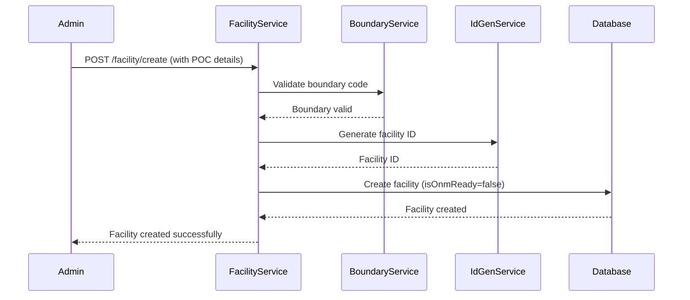

### Facility ONM Ready Flow

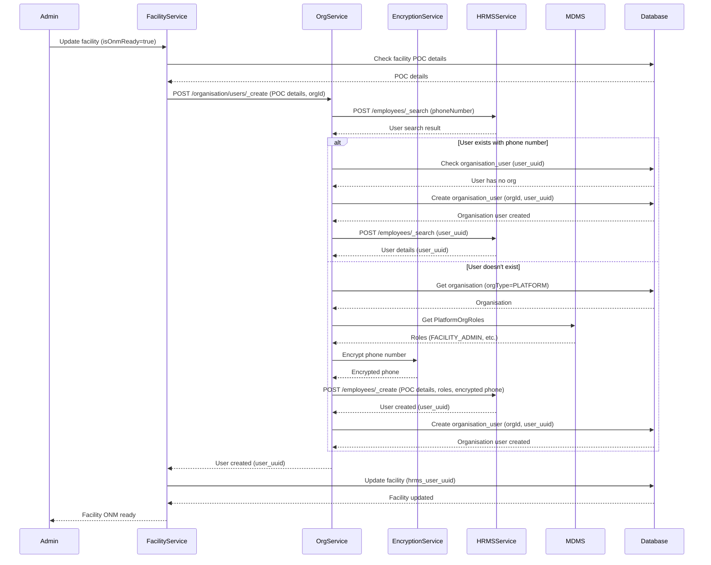

### Facility POC Update Flow

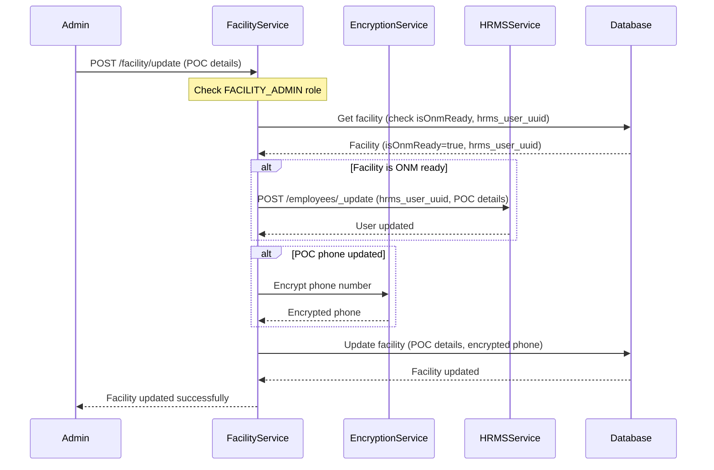

### Bulk Facility Ingestion Flow

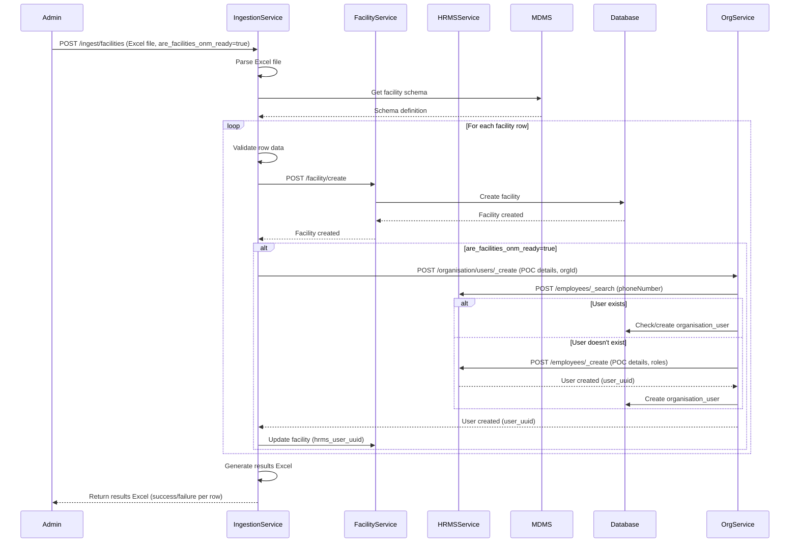

### Organization Creation Flow

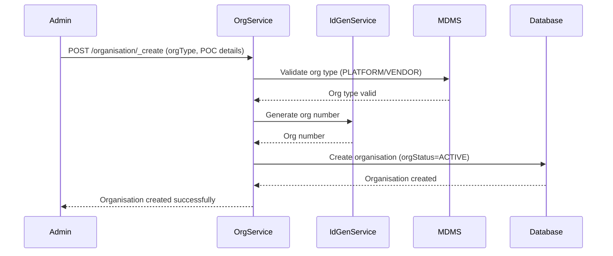

### Create User and Add to Organization Flow

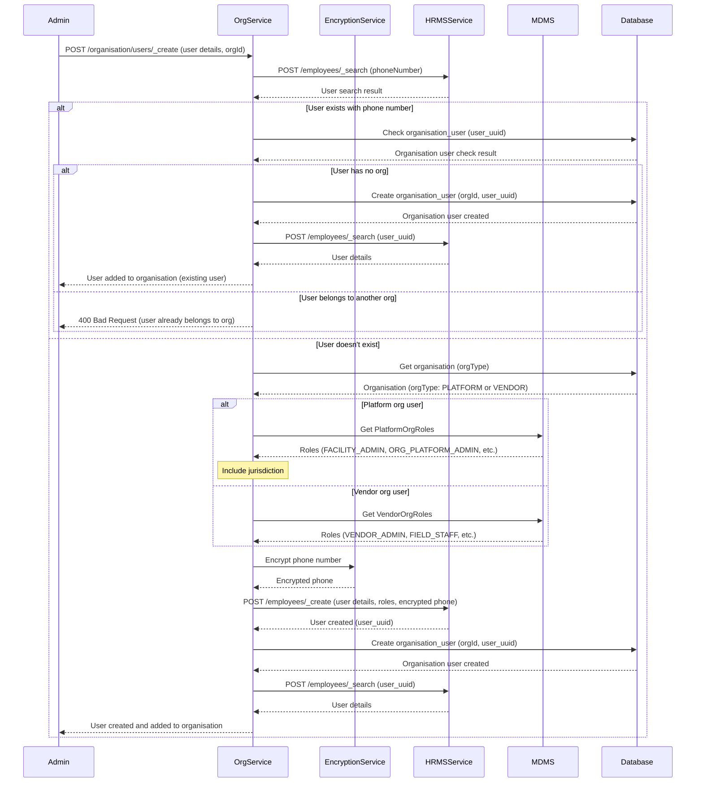

### Activity Search by Facility Flow

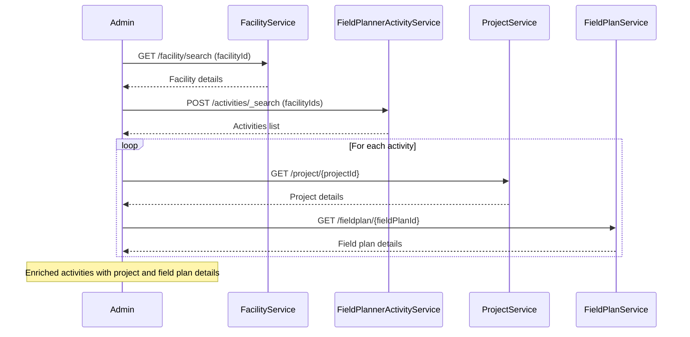

### Asset Search by Facility Flow

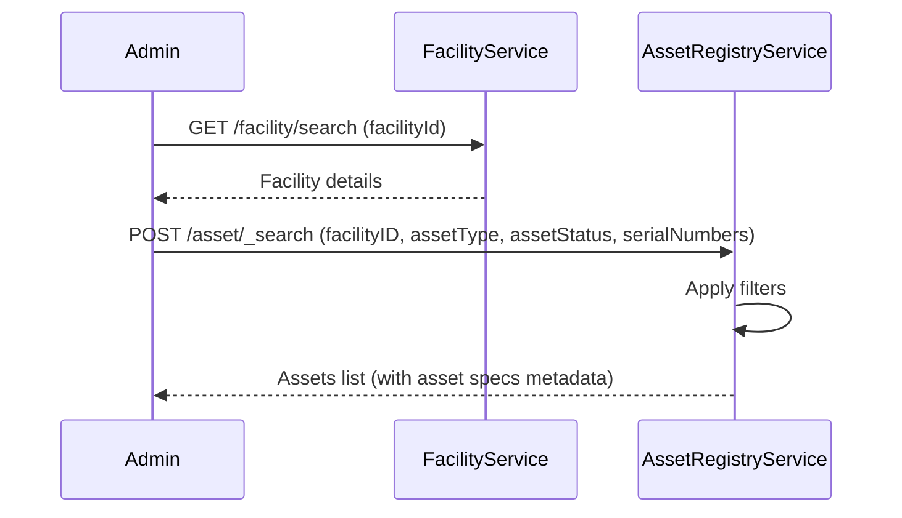

### AMC Configuration Search by Facility Flow

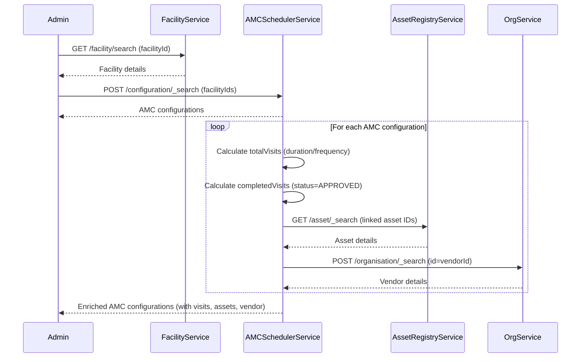

### Update Organization User Flow

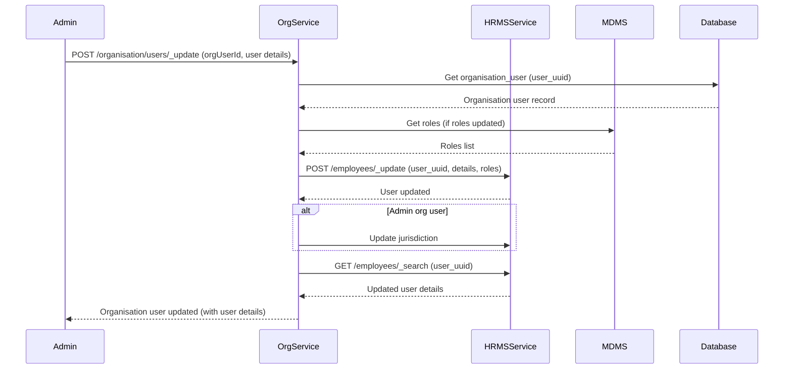

### Remove User from Organization Flow

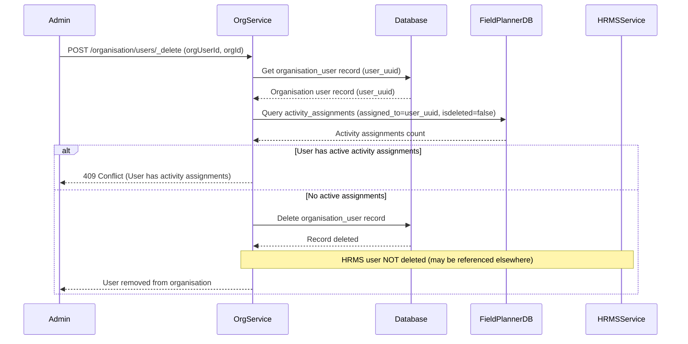
