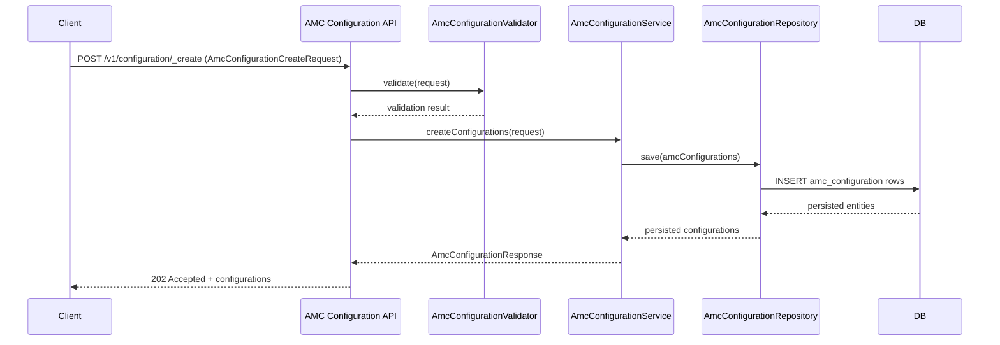
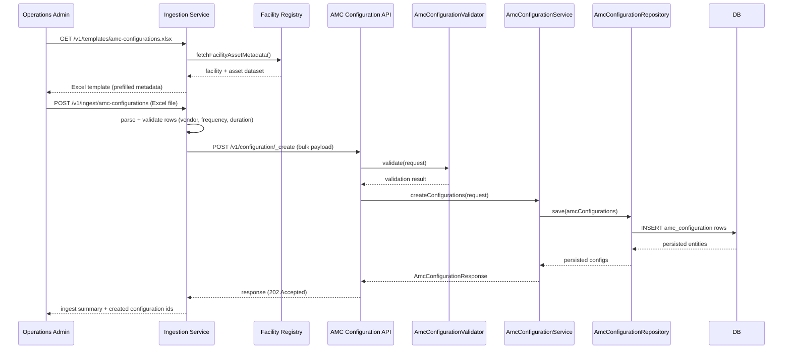
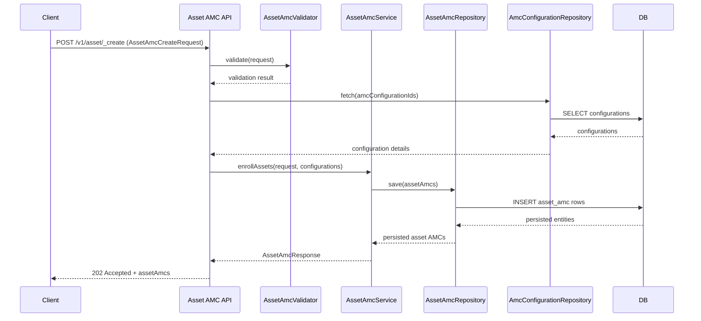
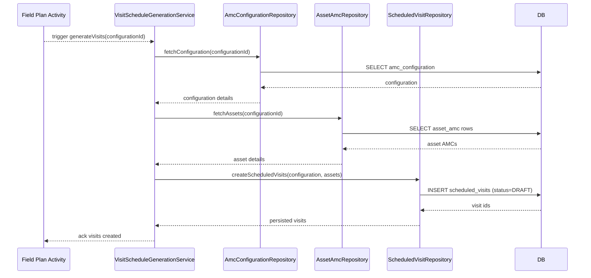
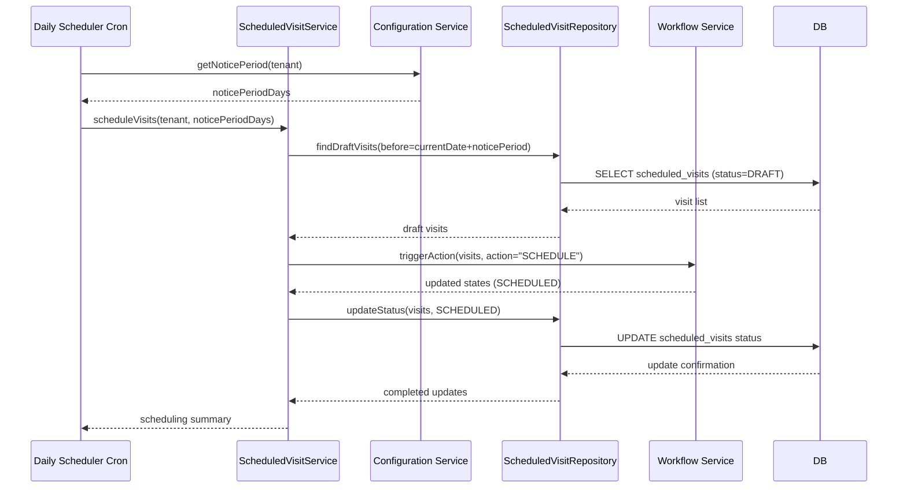
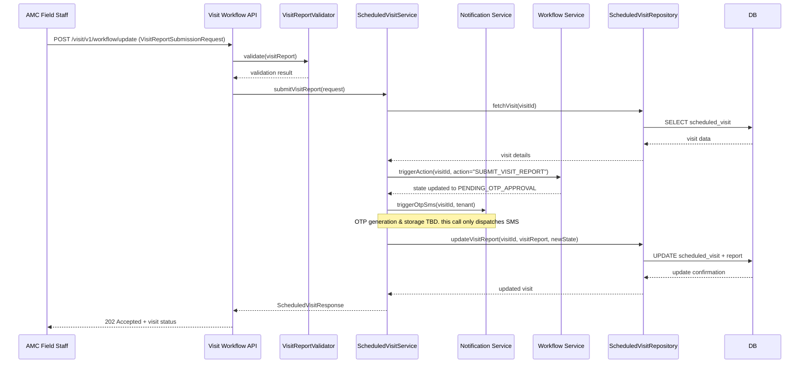

# Annual Maintenance Contract Implementation

## Executive Summary

This plan outlines the design and implementation of an AMC (Annual Maintenance Contract) scheduling system for managing maintenance of solar panel installation assets at healthcare facilities. The system will enable configuration of AMC parameters per vendor-facility-project combination and automate visit scheduling while handling legacy asset integration.

The ingestion workflow supports bulk onboarding by generating pre-filled facility asset templates and ingesting completed templates to create AMC configurations at scale.

## Solution Architecture

### Core Models

#### 1. AMC Configuration Entity

Central Entity Linking an AMC Vendor to asset types in an installation ( each installation is a unique combination of facility and project )

```
amc_configuration:
  - id (PK)
  - tenant_id
  - vendor_id (FK to vendor_registry)
  - facility_id (FK to facility)
  - asset_types (Inverter, Panel, RMS Device, etc) TEXT[] or JSONB
  - project_id (FK to project)
  - duration_months (e.g., 36 for 3 years)
  - visit_frequency_months (numeric: 1, 3, 6, 12)
  - configuration_start_date
  - configuration_end_date
  - status (ACTIVE, EXPIRED, CANCELLED)
  - additional_details (JSONB)
  - created_by, created_time
  - last_modified_by, last_modified_time

amc_configuration_assignments:
  - id (PK)
  - amc_configuration_id (FK to amc_configuration.id)
  - assigned_user (FK to hrms employee)
```

##### Key Characteristics

- Visit Delay is not categorized in the system, only recorded. Categorization happens in dashboards.
- Unique entry per installation
- Acts as a template for generating visits from date of installation completion.

#### 2. Asset AMC Record

Links individual assets to their AMC configuration:

```
asset_amc:
  - id (PK)
  - tenant_id
  - asset_id (FK to asset)
  - amc_configuration_id (FK to amc_configuration)
  - amc_start_date (installation/commissioning date or manual for legacy)
  - amc_end_date (calculated: start_date + duration_months)
  - status (ACTIVE, EXPIRED, UNDER_MAINTENANCE, INACTIVE)
  - is_legacy_asset (boolean flag)
  - additional_details (JSONB)
  - created_by, created_time
  - last_modified_by, last_modified_time
```

##### Key Characteristics

- Inherits duration, frequency, start date and end date from amc_configuration

#### 3. Scheduled Visit Entity

Generated maintenance visits based on AMC configuration:

```
scheduled_visits:
  - id (PK)
  - tenant_id
  - project_id (FK to project)
  - amc_configuration_id (FK)
  - facility_id (FK to facility)
  - visit_number (sequence within AMC period)
  - scheduled_date (calculated from earliest asset start + frequency)
  - last_scheduled_visit_date
  - actual_visit_date
  - workflow_status
  - visit_report (JSONB) (json schema validation according to solution design of the facility)
  - created_by, created_time
  - last_modified_by, last_modified_time

scheduled_visit_assignments:
  - id (PK)
  - scheduled_visit_id (FK to scheduled_visits.id)
  - assigned_user (FK to hrms employee)
```

##### Key Characteristics

- All future visits of an AMC Contract are created at the time of installation completion in a project with workflow. Initial workflow state is DRAFT
- One Visit covers all asset types in an installation under a singular vendor.
- Visit Status will be tracked by Workflow
- each visit can have multiple users assigned

#### 4. Visit Report

Captures AMC report submission and approval:

A visit_report will be defined as json schema driven by form engine. These will be input by a support engineer, same as for asset installation report

All workflow transitions that mutate visit state or report content must invoke `/visit/v1/workflow/update`. The API accepts only the workflow object and the visit report JSON (validated against the stored schema), preventing standalone visit report updates outside the workflow pipeline.

### Master Data

#### `amc.AMCReportMap`

```json
{
  "module": "amc",
  "tenantId": "in",
  "AMCReportMap": [
    {
      "id": 1,
      "status": "active",
      "solar_solution_design_type": "", // fk on facility.SolarSolutionDesignType
      "amc_report": "" // fk on common-masters.SolutionDesignTypeBOMForms
    }
  ]
}
```

#### `amc.AMCThresholds`

```json
{
  "module": "amc",
  "tenantId": "in",
  "AMCThresholds": [
    {
      "id": 1,
      "status": "active",
      "amc_visit_notice_period_in_days": 30
    }
  ]
}
```

### Services

#### `e4h-services/amc-scheduler-service` microservice

**Structure (following existing patterns):**

```
amc-scheduler-service/
├── src/main/java/org/egov/amc/
│   ├── config/
│   │   └── AmcSchedulerConfiguration.java
│   ├── repository/
│   │   ├── AmcConfigurationRepository.java
│   │   ├── AssetAmcRepository.java
│   │   └── ScheduledVisitRepository.java
│   ├── service/
│   │   ├── AmcConfigurationService.java
│   │   ├── AssetAmcService.java
│   │   ├── VisitScheduleGenerationService.java
│   │   └── ScheduledVisitService.java
│   ├── validator/
│   │   ├── AmcConfigurationValidator.java
│   │   ├── AssetAmcValidator.java
│   │   └── VisitReportValidator.java
│   ├── web/
│   │   ├── controllers/
│   │   │   ├── AssetAmcController.java
│   │   │   ├── AmcConfigurationController.java
│   │   │   └── ScheduledVisitController.java
│   │   └── models/
├── src/main/resources/
│   ├── db/migration/main/
│   │   └── V1__amc_scheduler_ddl.sql
│   ├── amc-configuration-persister.yml
│   ├── asset-amc-persister.yml
│   ├── scheduled-visit-persister.yml
│   └── application.properties
└── pom.xml (following existing service patterns)
```

#### `e4h-services/ingestion-service` enhancements

- Template generation endpoint produces an Excel workbook containing a sheet titled `amc-configurations`. The sheet includes the columns `facilityId`, `facilityName`, `country`, `state`, `district`, `block`, `vendor`, `amc-frequency`, and `amc-duration`.
- Facility metadata columns (`facilityId` through `assetType`) are auto-populated using facility, asset, and project master data, yielding curated facility–asset rows that require AMC coverage.
- Columns `vendor`, `amc-frequency`, and `amc-duration` remain blank for stakeholders to fill in offline prior to upload.
- Bulk ingest endpoint validates the completed sheet, converts rows into AMC configuration payloads, and invokes the AMC Scheduler Service to create configurations in batch (one per unique vendor–facility–project combination).
- Validation logic mirrors the scheduler service validators (duplicate detection, duration/frequency constraints) to ensure parity between manual API usage and bulk ingestion.

### CRON Jobs

#### Daily AMC Visit Scheduler

Simple Daily cron job that queries all DRAFT Visits that have a `scheduled_visit.scheduled_date` less than `current_date` + `amc.AMCThresholds.amc_visit_notice_period_in_days` and applies `SCHEDULE` action on all those visits.

### Business Services

#### AMC Visit Business Service

```json
{
  "BusinessServices": [
    {
      "businessService": "amc-visit",
      "business": "amc-registry",
      "businessServiceSla": null,
      "states": [
        {
          "state": "DRAFT",
          "sla": null,
          "applicationStatus": null,
          "isStartState": true,
          "isTerminateState": false,
          "isStateUpdatable": true,
          "actions": [
            {
              "action": "SCHEDULE",
              "nextState": "SCHEDULED",
              "roles": ["SYSTEM_USER"]
            },
            {
              "action": "EXPIRE",
              "nextState": "EXPIRED",
              "roles": ["SYSTEM_USER"]
            }
          ]
        },
        {
          "state": "SCHEDULED",
          "sla": null,
          "applicationStatus": null,
          "isStartState": false,
          "isTerminateState": false,
          "isStateUpdatable": true,
          "actions": [
            {
              "action": "RESCHEDULE",
              "nextState": "SCHEDULED",
              "roles": ["AMC_SPOC"]
            },
            {
              "action": "SUBMIT_VISIT_REPORT",
              "nextState": "PENDING_OTP_APPROVAL",
              "roles": ["AMC_FIELD_STAFF"] // triggers OTP SMS on submission (OTP generation & storage TBD)
            },
            {
              "action": "EXPIRE",
              "nextState": "EXPIRED",
              "roles": ["SYSTEM_USER"]
            }
          ]
        },
        {
          "state": "PENDING_OTP_APPROVAL",
          "sla": null,
          "applicationStatus": null,
          "isStartState": false,
          "isTerminateState": false,
          "isStateUpdatable": true,
          "actions": [
            {
              "action": "SUBMIT_OTP",
              "nextState": "PENDING_APPROVAL",
              "roles": ["AMC_FIELD_STAFF"]
            },
            {
              "action": "EXPIRE",
              "nextState": "EXPIRED",
              "roles": ["AMC_REVIEWER"]
            }
          ]
        },
        {
          "state": "PENDING_APPROVAL",
          "sla": null,
          "applicationStatus": null,
          "isStartState": false,
          "isTerminateState": false,
          "isStateUpdatable": true,
          "actions": [
            {
              "action": "APPROVE",
              "nextState": "APPROVED",
              "roles": ["AMC_REVIEWER"]
            },
            {
              "action": "REJECT",
              "nextState": "SCHEDULED",
              "roles": ["AMC_REVIEWER"]
            },
            {
              "action": "EXPIRE",
              "nextState": "EXPIRED",
              "roles": ["SYSTEM_USER"]
            }
          ]
        },
        {
          "state": "APPROVED",
          "sla": null,
          "applicationStatus": null,
          "isStartState": false,
          "isTerminateState": true,
          "isStateUpdatable": false,
          "actions": []
        },
        {
          "state": "EXPIRED",
          "sla": null,
          "applicationStatus": null,
          "isStartState": false,
          "isTerminateState": true,
          "isStateUpdatable": false,
          "actions": []
        }
      ]
    }
  ]
}
```

## API Spec

```yaml
openapi: 3.0.0
info:
  title: AMC Scheduler Service API
  description: |-
    API specification for the AMC Scheduler Service responsible for configuring Annual Maintenance
    Contracts (AMC), linking assets to AMC templates, generating scheduled maintenance visits,
    managing visit assignments, and capturing visit reports.
  version: 1.0.0
  contact:
    name: SELCO Foundation
    email: info@selcofoundation.org
servers:
  - url: /asset-amc
    description: AMC Scheduler Service context path
tags:
  - name: AMC Configuration
    description: Manage AMC configuration templates for vendor-facility-project installations.
  - name: Asset AMC
    description: Manage asset-level AMC enrollment and lifecycle events.
  - name: Scheduled Visit
    description: Manage scheduled maintenance visits, assignments, and workflow transitions.
  - name: Visit Report
    description: Submit and retrieve AMC visit reports linked to scheduled visits.
paths:
  /v1/configuration/_create:
    post:
      tags:
        - AMC Configuration
      summary: Create AMC configurations
      description: Creates one or more AMC configuration templates for vendor-facility-project installations.
      operationId: createAmcConfiguration
      requestBody:
        required: true
        content:
          application/json:
            schema:
              $ref: "#/components/schemas/AmcConfigurationCreateRequest"
      responses:
        "202":
          description: AMC configuration creation request accepted
          content:
            application/json:
              schema:
                $ref: "#/components/schemas/AmcConfigurationResponse"
        "400":
          description: Invalid request payload
          content:
            application/json:
              schema:
                $ref: "#/components/schemas/ErrorResponse"
        "409":
          description: Duplicate AMC configuration detected for the same installation
          content:
            application/json:
              schema:
                $ref: "#/components/schemas/ErrorResponse"
  /v1/configuration/_update:
    post:
      tags:
        - AMC Configuration
      summary: Update AMC configurations
      description: Updates one or more AMC configuration templates, including status transitions and duration changes.
      operationId: updateAmcConfiguration
      requestBody:
        required: true
        content:
          application/json:
            schema:
              $ref: "#/components/schemas/AmcConfigurationUpdateRequest"
      responses:
        "202":
          description: AMC configuration update request accepted
          content:
            application/json:
              schema:
                $ref: "#/components/schemas/AmcConfigurationResponse"
        "400":
          description: Invalid request payload
          content:
            application/json:
              schema:
                $ref: "#/components/schemas/ErrorResponse"
        "404":
          description: AMC configuration not found
          content:
            application/json:
              schema:
                $ref: "#/components/schemas/ErrorResponse"
  /v1/configuration/_search:
    post:
      tags:
        - AMC Configuration
      summary: Search AMC configurations
      description: Searches for AMC configuration templates using filters such as vendor, facility, project, or status.
      operationId: searchAmcConfiguration
      parameters:
        - name: offset
          in: query
          description: Pagination offset for the search results
          required: false
          schema:
            type: integer
            minimum: 0
            default: 0
        - name: limit
          in: query
          description: Maximum number of records to return
          required: false
          schema:
            type: integer
            minimum: 1
            maximum: 200
            default: 50
        - name: sortBy
          in: query
          description: Field to sort the results by (e.g., configurationStartDate)
          required: false
          schema:
            type: string
        - name: sortOrder
          in: query
          description: Sort order for the results
          required: false
          schema:
            $ref: "#/components/schemas/SortOrder"
      requestBody:
        required: true
        content:
          application/json:
            schema:
              $ref: "#/components/schemas/AmcConfigurationSearchRequest"
      responses:
        "200":
          description: AMC configurations matching search criteria
          content:
            application/json:
              schema:
                $ref: "#/components/schemas/AmcConfigurationResponse"
        "400":
          description: Invalid search criteria
          content:
            application/json:
              schema:
                $ref: "#/components/schemas/ErrorResponse"
  /v1/configuration/{configurationId}/visit/_generate:
    post:
      tags:
        - Scheduled Visit
      summary: Generate scheduled visits for an AMC configuration
      description: Triggers visit generation for the specified AMC configuration within the provided scheduling window.
      operationId: generateVisitsForConfiguration
      parameters:
        - name: configurationId
          in: path
          description: Unique identifier of the AMC configuration
          required: true
          schema:
            type: string
      requestBody:
        required: true
        content:
          application/json:
            schema:
              $ref: "#/components/schemas/VisitGenerationRequest"
      responses:
        "202":
          description: Visit generation request accepted
          content:
            application/json:
              schema:
                $ref: "#/components/schemas/ScheduledVisitResponse"
        "400":
          description: Invalid visit generation request
          content:
            application/json:
              schema:
                $ref: "#/components/schemas/ErrorResponse"
        "404":
          description: AMC configuration not found for visit generation
          content:
            application/json:
              schema:
                $ref: "#/components/schemas/ErrorResponse"
  /v1/asset/_create:
    post:
      tags:
        - Asset AMC
      summary: Create asset AMC records
      description: Creates AMC enrollment records for assets, linking them to AMC configurations and capturing legacy details.
      operationId: createAssetAmc
      requestBody:
        required: true
        content:
          application/json:
            schema:
              $ref: "#/components/schemas/AssetAmcCreateRequest"
      responses:
        "202":
          description: Asset AMC creation request accepted
          content:
            application/json:
              schema:
                $ref: "#/components/schemas/AssetAmcResponse"
        "400":
          description: Invalid asset AMC payload
          content:
            application/json:
              schema:
                $ref: "#/components/schemas/ErrorResponse"
        "409":
          description: Duplicate asset AMC enrollment detected
          content:
            application/json:
              schema:
                $ref: "#/components/schemas/ErrorResponse"
  /v1/asset/_update:
    post:
      tags:
        - Asset AMC
      summary: Update asset AMC records
      description: Updates asset AMC enrollments, including lifecycle status changes and legacy asset flags.
      operationId: updateAssetAmc
      requestBody:
        required: true
        content:
          application/json:
            schema:
              $ref: "#/components/schemas/AssetAmcUpdateRequest"
      responses:
        "202":
          description: Asset AMC update request accepted
          content:
            application/json:
              schema:
                $ref: "#/components/schemas/AssetAmcResponse"
        "400":
          description: Invalid asset AMC payload
          content:
            application/json:
              schema:
                $ref: "#/components/schemas/ErrorResponse"
        "404":
          description: Asset AMC record not found
          content:
            application/json:
              schema:
                $ref: "#/components/schemas/ErrorResponse"
  /v1/asset/_search:
    post:
      tags:
        - Asset AMC
      summary: Search asset AMC records
      description: Searches for asset AMC enrollments using asset, configuration, or status filters.
      operationId: searchAssetAmc
      parameters:
        - name: offset
          in: query
          description: Pagination offset for the search results
          required: false
          schema:
            type: integer
            minimum: 0
            default: 0
        - name: limit
          in: query
          description: Maximum number of records to return
          required: false
          schema:
            type: integer
            minimum: 1
            maximum: 200
            default: 50
      requestBody:
        required: true
        content:
          application/json:
            schema:
              $ref: "#/components/schemas/AssetAmcSearchRequest"
      responses:
        "200":
          description: Asset AMC records matching search criteria
          content:
            application/json:
              schema:
                $ref: "#/components/schemas/AssetAmcResponse"
        "400":
          description: Invalid search criteria
          content:
            application/json:
              schema:
                $ref: "#/components/schemas/ErrorResponse"
  /v1/visit/_create:
    post:
      tags:
        - Scheduled Visit
      summary: Create scheduled visits
      description: Creates scheduled visits manually, typically for legacy integrations or ad-hoc visit requirements.
      operationId: createScheduledVisit
      requestBody:
        required: true
        content:
          application/json:
            schema:
              $ref: "#/components/schemas/ScheduledVisitCreateRequest"
      responses:
        "202":
          description: Scheduled visit creation request accepted
          content:
            application/json:
              schema:
                $ref: "#/components/schemas/ScheduledVisitResponse"
        "400":
          description: Invalid scheduled visit payload
          content:
            application/json:
              schema:
                $ref: "#/components/schemas/ErrorResponse"
  /visit/v1/workflow/update:
    post:
      tags:
        - Scheduled Visit
      summary: Transition scheduled visit workflow and persist visit report
      description: Applies workflow actions to a scheduled visit while accepting a visit report JSON payload that is validated against the registered schema. The `SUBMIT_VISIT_REPORT` action triggers an OTP SMS (OTP generation and storage TBD).
      operationId: workflowUpdateScheduledVisit
      requestBody:
        required: true
        content:
          application/json:
            schema:
              $ref: "#/components/schemas/VisitReportSubmissionRequest"
      responses:
        "202":
          description: Scheduled visit workflow update accepted
          content:
            application/json:
              schema:
                $ref: "#/components/schemas/ScheduledVisitResponse"
        "400":
          description: Invalid workflow update payload
          content:
            application/json:
              schema:
                $ref: "#/components/schemas/ErrorResponse"
        "404":
          description: Scheduled visit not found
          content:
            application/json:
              schema:
                $ref: "#/components/schemas/ErrorResponse"
  /v1/visit/_search:
    post:
      tags:
        - Scheduled Visit
      summary: Search scheduled visits
      description: Searches for scheduled visits using configuration, facility, status, or assignment filters.
      operationId: searchScheduledVisit
      parameters:
        - name: offset
          in: query
          description: Pagination offset for the search results
          required: false
          schema:
            type: integer
            minimum: 0
            default: 0
        - name: limit
          in: query
          description: Maximum number of records to return
          required: false
          schema:
            type: integer
            minimum: 1
            maximum: 200
            default: 50
        - name: includeAssignments
          in: query
          description: When true, includes visit assignment details in the response
          required: false
          schema:
            type: boolean
            default: false
      requestBody:
        required: true
        content:
          application/json:
            schema:
              $ref: "#/components/schemas/ScheduledVisitSearchRequest"
      responses:
        "200":
          description: Scheduled visits matching search criteria
          content:
            application/json:
              schema:
                $ref: "#/components/schemas/ScheduledVisitResponse"
        "400":
          description: Invalid search criteria
          content:
            application/json:
              schema:
                $ref: "#/components/schemas/ErrorResponse"
components:
  schemas:
    SortOrder:
      type: string
      description: Sorting order for list endpoints
      enum:
        - ASC
        - DESC
    RequestInfo:
      type: object
      description: Request information metadata
      properties:
        apiId:
          type: string
        ver:
          type: string
        ts:
          type: integer
          format: int64
        action:
          type: string
        did:
          type: string
        key:
          type: string
        msgId:
          type: string
        authToken:
          type: string
        userInfo:
          $ref: "#/components/schemas/UserInfo"
      required:
        - apiId
        - ver
        - ts
        - action
    ResponseInfo:
      type: object
      description: Response information metadata
      properties:
        apiId:
          type: string
        ver:
          type: string
        ts:
          type: integer
          format: int64
        resMsgId:
          type: string
        msgId:
          type: string
        status:
          type: string
          enum:
            - successful
            - failed
    UserInfo:
      type: object
      description: User information details
      properties:
        id:
          type: integer
          format: int64
        userName:
          type: string
        name:
          type: string
        type:
          type: string
        mobileNumber:
          type: string
        emailId:
          type: string
        roles:
          type: array
          items:
            $ref: "#/components/schemas/Role"
        tenantId:
          type: string
        uuid:
          type: string
    Role:
      type: object
      description: User role information
      properties:
        id:
          type: integer
          format: int64
        name:
          type: string
        code:
          type: string
        tenantId:
          type: string
    AuditDetails:
      type: object
      description: Audit metadata for entities
      properties:
        createdBy:
          type: string
        createdTime:
          type: integer
          format: int64
        lastModifiedBy:
          type: string
        lastModifiedTime:
          type: integer
          format: int64
    AmcConfigurationBase:
      type: object
      description: Base properties for an AMC configuration
      properties:
        tenantId:
          type: string
        vendorId:
          type: string
        facilityId:
          type: string
        projectId:
          type: string
        assetTypes:
          type: array
          description: List of asset types covered under the AMC
          items:
            type: string
        durationMonths:
          type: integer
          format: int32
          minimum: 1
        visitFrequencyMonths:
          type: integer
          format: int32
          enum:
            - 1
            - 3
            - 6
            - 12
        configurationStartDate:
          type: string
          format: date
        configurationEndDate:
          type: string
          format: date
        status:
          type: string
          enum:
            - ACTIVE
            - EXPIRED
            - CANCELLED
          default: ACTIVE
        additionalDetails:
          type: object
          additionalProperties: true
      required:
        - tenantId
        - vendorId
        - facilityId
        - projectId
        - assetTypes
        - durationMonths
        - visitFrequencyMonths
        - configurationStartDate
    AmcConfigurationCreate:
      allOf:
        - $ref: "#/components/schemas/AmcConfigurationBase"
    AmcConfigurationUpdate:
      allOf:
        - $ref: "#/components/schemas/AmcConfigurationBase"
        - type: object
          properties:
            id:
              type: string
            auditDetails:
              $ref: "#/components/schemas/AuditDetails"
          required:
            - id
    AmcConfiguration:
      allOf:
        - $ref: "#/components/schemas/AmcConfigurationBase"
        - type: object
          properties:
            id:
              type: string
            auditDetails:
              $ref: "#/components/schemas/AuditDetails"
    AmcConfigurationCreateRequest:
      type: object
      properties:
        RequestInfo:
          $ref: "#/components/schemas/RequestInfo"
        amcConfigurations:
          type: array
          items:
            $ref: "#/components/schemas/AmcConfigurationCreate"
          minItems: 1
      required:
        - RequestInfo
        - amcConfigurations
    AmcConfigurationUpdateRequest:
      type: object
      properties:
        RequestInfo:
          $ref: "#/components/schemas/RequestInfo"
        amcConfigurations:
          type: array
          items:
            $ref: "#/components/schemas/AmcConfigurationUpdate"
          minItems: 1
      required:
        - RequestInfo
        - amcConfigurations
    AmcConfigurationResponse:
      type: object
      properties:
        ResponseInfo:
          $ref: "#/components/schemas/ResponseInfo"
        amcConfigurations:
          type: array
          items:
            $ref: "#/components/schemas/AmcConfiguration"
        totalCount:
          type: integer
          description: Total number of records matching the criteria
      required:
        - ResponseInfo
        - amcConfigurations
    AmcConfigurationSearchCriteria:
      type: object
      properties:
        tenantId:
          type: string
        ids:
          type: array
          items:
            type: string
        vendorIds:
          type: array
          items:
            type: string
        facilityIds:
          type: array
          items:
            type: string
        projectIds:
          type: array
          items:
            type: string
        statuses:
          type: array
          items:
            type: string
            enum:
              - ACTIVE
              - EXPIRED
              - CANCELLED
        activeOnDate:
          type: string
          format: date
          description: Date on which the AMC configuration must be active
        configurationStartDateFrom:
          type: string
          format: date
        configurationStartDateTo:
          type: string
          format: date
        createdBy:
          type: string
        includeExpired:
          type: boolean
          default: false
      required:
        - tenantId
    AmcConfigurationSearchRequest:
      type: object
      properties:
        RequestInfo:
          $ref: "#/components/schemas/RequestInfo"
        searchCriteria:
          $ref: "#/components/schemas/AmcConfigurationSearchCriteria"
      required:
        - RequestInfo
        - searchCriteria
    AssetAmcBase:
      type: object
      description: Base properties for an asset AMC enrollment
      properties:
        tenantId:
          type: string
        assetId:
          type: string
        amcConfigurationId:
          type: string
        amcStartDate:
          type: string
          format: date
        amcEndDate:
          type: string
          format: date
        status:
          type: string
          enum:
            - ACTIVE
            - EXPIRED
            - UNDER_MAINTENANCE
            - INACTIVE
          default: ACTIVE
        isLegacyAsset:
          type: boolean
          default: false
        additionalDetails:
          type: object
          additionalProperties: true
      required:
        - tenantId
        - assetId
        - amcConfigurationId
        - amcStartDate
    AssetAmcCreate:
      allOf:
        - $ref: "#/components/schemas/AssetAmcBase"
    AssetAmcUpdate:
      allOf:
        - $ref: "#/components/schemas/AssetAmcBase"
        - type: object
          properties:
            id:
              type: string
            auditDetails:
              $ref: "#/components/schemas/AuditDetails"
          required:
            - id
    AssetAmc:
      allOf:
        - $ref: "#/components/schemas/AssetAmcBase"
        - type: object
          properties:
            id:
              type: string
            auditDetails:
              $ref: "#/components/schemas/AuditDetails"
    AssetAmcCreateRequest:
      type: object
      properties:
        RequestInfo:
          $ref: "#/components/schemas/RequestInfo"
        assetAmcs:
          type: array
          items:
            $ref: "#/components/schemas/AssetAmcCreate"
          minItems: 1
      required:
        - RequestInfo
        - assetAmcs
    AssetAmcUpdateRequest:
      type: object
      properties:
        RequestInfo:
          $ref: "#/components/schemas/RequestInfo"
        assetAmcs:
          type: array
          items:
            $ref: "#/components/schemas/AssetAmcUpdate"
          minItems: 1
      required:
        - RequestInfo
        - assetAmcs
    AssetAmcResponse:
      type: object
      properties:
        ResponseInfo:
          $ref: "#/components/schemas/ResponseInfo"
        assetAmcs:
          type: array
          items:
            $ref: "#/components/schemas/AssetAmc"
        totalCount:
          type: integer
      required:
        - ResponseInfo
        - assetAmcs
    AssetAmcSearchCriteria:
      type: object
      properties:
        tenantId:
          type: string
        ids:
          type: array
          items:
            type: string
        assetIds:
          type: array
          items:
            type: string
        amcConfigurationIds:
          type: array
          items:
            type: string
        statuses:
          type: array
          items:
            type: string
            enum:
              - ACTIVE
              - EXPIRED
              - UNDER_MAINTENANCE
              - INACTIVE
        includeLegacy:
          type: boolean
          default: false
        startDateFrom:
          type: string
          format: date
        startDateTo:
          type: string
          format: date
        endDateFrom:
          type: string
          format: date
        endDateTo:
          type: string
          format: date
      required:
        - tenantId
    AssetAmcSearchRequest:
      type: object
      properties:
        RequestInfo:
          $ref: "#/components/schemas/RequestInfo"
        searchCriteria:
          $ref: "#/components/schemas/AssetAmcSearchCriteria"
      required:
        - RequestInfo
        - searchCriteria
    ScheduledVisitBase:
      type: object
      description: Base properties for a scheduled AMC visit
      properties:
        tenantId:
          type: string
        amcConfigurationId:
          type: string
        facilityId:
          type: string
        visitNumber:
          type: integer
          format: int32
          minimum: 1
        scheduledDate:
          type: string
          format: date
        actualVisitDate:
          type: string
          format: date
        status:
          type: string
          enum:
            - DRAFT
            - SCHEDULED
            - PENDING_OTP_APPROVAL
            - PENDING_APPROVAL
            - APPROVED
            - EXPIRED
          default: DRAFT
        visitReport:
          $ref: "#/components/schemas/VisitReport"
        workflow:
          $ref: "#/components/schemas/Workflow"
        assignments:
          type: array
          items:
            $ref: "#/components/schemas/ScheduledVisitAssignment"
        additionalDetails:
          type: object
          additionalProperties: true
      required:
        - tenantId
        - amcConfigurationId
        - facilityId
        - visitNumber
        - scheduledDate
    ScheduledVisitCreate:
      allOf:
        - $ref: "#/components/schemas/ScheduledVisitBase"
    ScheduledVisit:
      allOf:
        - $ref: "#/components/schemas/ScheduledVisitBase"
        - type: object
          properties:
            id:
              type: string
            auditDetails:
              $ref: "#/components/schemas/AuditDetails"
    ScheduledVisitAssignment:
      type: object
      description: Assignment details for a scheduled visit
      properties:
        id:
          type: string
        tenantId:
          type: string
        scheduledVisitId:
          type: string
        assignedUser:
          type: string
          description: UUID of the assigned field staff user
        additionalDetails:
          type: object
          additionalProperties: true
        auditDetails:
          $ref: "#/components/schemas/AuditDetails"
      required:
        - assignedUser
    ScheduledVisitCreateRequest:
      type: object
      properties:
        RequestInfo:
          $ref: "#/components/schemas/RequestInfo"
        scheduledVisits:
          type: array
          items:
            $ref: "#/components/schemas/ScheduledVisitCreate"
          minItems: 1
      required:
        - RequestInfo
        - scheduledVisits
    ScheduledVisitResponse:
      type: object
      properties:
        ResponseInfo:
          $ref: "#/components/schemas/ResponseInfo"
        scheduledVisits:
          type: array
          items:
            $ref: "#/components/schemas/ScheduledVisit"
        totalCount:
          type: integer
      required:
        - ResponseInfo
        - scheduledVisits
    ScheduledVisitSearchCriteria:
      type: object
      properties:
        tenantId:
          type: string
        ids:
          type: array
          items:
            type: string
        amcConfigurationIds:
          type: array
          items:
            type: string
        facilityIds:
          type: array
          items:
            type: string
        statuses:
          type: array
          items:
            type: string
            enum:
              - DRAFT
              - SCHEDULED
              - PENDING_OTP_APPROVAL
              - PENDING_APPROVAL
              - APPROVED
              - EXPIRED
        scheduledDateFrom:
          type: string
          format: date
        scheduledDateTo:
          type: string
          format: date
        actualDateFrom:
          type: string
          format: date
        actualDateTo:
          type: string
          format: date
        visitNumbers:
          type: array
          items:
            type: integer
            format: int32
        assignedUsers:
          type: array
          items:
            type: string
        includeExpired:
          type: boolean
          default: false
      required:
        - tenantId
    ScheduledVisitSearchRequest:
      type: object
      properties:
        RequestInfo:
          $ref: "#/components/schemas/RequestInfo"
        searchCriteria:
          $ref: "#/components/schemas/ScheduledVisitSearchCriteria"
      required:
        - RequestInfo
        - searchCriteria
    VisitGenerationRequest:
      type: object
      properties:
        RequestInfo:
          $ref: "#/components/schemas/RequestInfo"
        generationStartDate:
          type: string
          format: date
          description: Beginning of the scheduling horizon (defaults to configuration start date if not provided)
        generationEndDate:
          type: string
          format: date
          description: End of the scheduling horizon (defaults to configuration end date if not provided)
        regenerateExisting:
          type: boolean
          default: false
          description: When true, existing future visits are regenerated
      required:
        - RequestInfo
    VisitReport:
      type: object
      description: Visit report payload captured through the AMC visit form
      properties:
        schemaCode:
          type: string
        version:
          type: string
        submittedBy:
          type: string
        submittedAt:
          type: integer
          format: int64
        otpReference:
          type: string
        otpVerifiedAt:
          type: integer
          format: int64
        responses:
          type: object
          additionalProperties: true
        documents:
          type: array
          items:
            $ref: "#/components/schemas/VisitReportDocument"
        additionalDetails:
          type: object
          additionalProperties: true
    VisitReportDocument:
      type: object
      properties:
        documentType:
          type: string
        fileStoreId:
          type: string
        fileName:
          type: string
        additionalDetails:
          type: object
          additionalProperties: true
      required:
        - documentType
        - fileStoreId
    VisitReportSubmissionRequest:
      type: object
      description: Payload for `/visit/v1/workflow/update`, combining the required workflow action and visit report JSON (validated against the registered schema). The `SUBMIT_VISIT_REPORT` action additionally triggers an OTP SMS; OTP generation and storage remain TBD.
      properties:
        RequestInfo:
          $ref: "#/components/schemas/RequestInfo"
        visitId:
          type: string
        visitReport:
          $ref: "#/components/schemas/VisitReport"
        workflow:
          $ref: "#/components/schemas/Workflow"
      required:
        - RequestInfo
        - visitId
        - visitReport
    Workflow:
      type: object
      description: Workflow action details for transitioning an entity
      properties:
        action:
          type: string
        comment:
          type: string
        assignees:
          type: array
          items:
            type: string
        documents:
          type: array
          items:
            $ref: "#/components/schemas/WorkflowDocument"
        additionalDetails:
          type: object
          additionalProperties: true
      required:
        - action
    WorkflowDocument:
      type: object
      properties:
        documentType:
          type: string
        fileStoreId:
          type: string
        fileName:
          type: string
      required:
        - documentType
        - fileStoreId
    ErrorResponse:
      type: object
      properties:
        ResponseInfo:
          $ref: "#/components/schemas/ResponseInfo"
        Errors:
          type: array
          items:
            $ref: "#/components/schemas/Error"
    Error:
      type: object
      properties:
        code:
          type: string
        message:
          type: string
        description:
          type: string
        params:
          type: array
          items:
            type: string
```

## Sequence Diagrams

### AMC Configuration Creation



### Bulk AMC Configuration Ingestion



### Asset AMC Enrollment



### Visit Generation on Installation Completion



### Daily Visit Scheduling Cron



### Visit Report Submission and Approval



## TODO

- Build `amc-scheduler-service` skeleton with configuration, repository, service, validator, web, and migration modules aligned to `e4h-services` conventions.
- Design and provision PostgreSQL schema (`amc_configuration`, `asset_amc`, `scheduled_visits`, `scheduled_visit_assignments`) with Liquibase migrations and persister YAMLs.
- Implement AMC configuration CRUD APIs, including validation rules, workflow triggers, and OpenAPI contract alignment.
- Implement asset AMC enrollment APIs with legacy asset handling, configuration lookups, and lifecycle transitions.
- Implement scheduled visit generation, manual visit management, workflow integrations, and visit assignment handling.
- Implement visit report submission pipeline with JSON schema validation, OTP workflow, and document handling.
- Integrate ingestion service template generation and bulk ingestion flows for AMC configurations, including validation parity and service-to-service calls.
- Configure daily scheduling cron job, reading threshold master data, and invoking workflow actions for due visits.
- Set up business service definitions, role-action mappings, and RBAC updates for AMC visit workflows across services.
- Create automated and manual testing suites (unit, integration, end-to-end) plus migration/backfill scripts for onboarding legacy assets.
