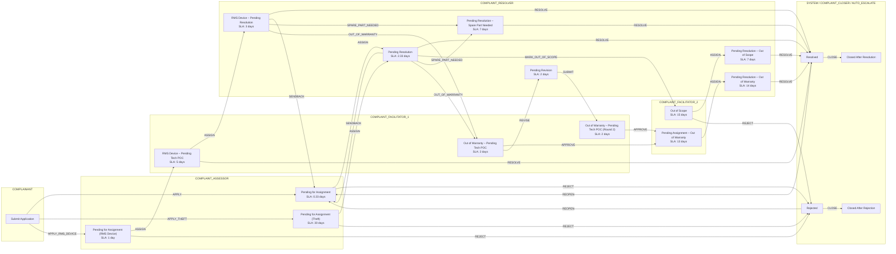

# Saura eMitra v3 Solution

## Core Models

### Facility Table

*add:*
```
is_system_installed BOOLEAN DEFAULT TRUE
```
## Master Data

New Issue Type and SubType
New entries in priority table for above new issue types and changed issue types
#TBD
## Business Service

### Incident

#question no send back for vendor after approved out of warranty workflow ? this is correct
#question do we not need different SLAs for different priorities w.r.t out of warranty new states ? current changes will apply same SLA to Low and High

- [x] **add `STATUS_UPDATE` action to all `COMPLAINT_FACILITATOR_2` actionable states.** ✅ 2026-01-28

```json
{
  "businessService": "Incident_Medium",
  "business": "im-services",
  "businessServiceSla": 0,
  "states": [
    {
      "sla": null,
      "state": null,
      "applicationStatus": null,
      "actions": [
        {
          "action": "APPLY",
          "nextState": "PENDINGFORASSIGNMENT",
          "roles": [
            "COMPLAINANT"
          ],
          "active": true
        },
        {
          "action": "APPLY_THEFT",
          "nextState": "PENDINGFORASSIGNMENT_THEFT",
          "roles": [
            "COMPLAINANT"
          ],
          "active": true
        },
        {
          "action": "APPLY_RMS_DEVICE",
          "nextState": "PENDINGFORASSIGNMENT_RMS_DEVICE",
          "roles": [
            "COMPLAINANT"
          ],
          "active": true
        }
      ]
    },
    {
      "sla": 86400000,
      "state": "PENDINGFORASSIGNMENT_RMS_DEVICE",
      "applicationStatus": "PENDINGFORASSIGNMENT_RMS_DEVICE",
      "actions": [
        {
          "action": "ASSIGN",
          "nextState": "RMS_DEVICE_PENDING_TECH_POC",
          "roles": [
            "COMPLAINT_ASSESSOR"
          ],
          "active": true
        },
        {
          "action": "REJECT",
          "nextState": "REJECTED",
          "roles": [
            "COMPLAINT_ASSESSOR"
          ],
          "active": true
        }
      ]
    },
    {
      "sla": 432000000,
      "state": "RMS_DEVICE_PENDING_TECH_POC",
      "applicationStatus": "RMS_DEVICE_PENDING_TECH_POC",
      "actions": [
        {
          "action": "ASSIGN",
          "nextState": "RMS_DEVICE_PENDINGRESOLUTION",
          "roles": [
            "COMPLAINT_FACILITATOR_1"
          ],
          "active": true
        },
        {
          "action": "RESOLVE",
          "nextState": "RESOLVED",
          "roles": [
            "COMPLAINT_FACILITATOR_1"
          ],
          "active": true
        }
      ]
    },
    {
      "sla": 2592000000,
      "state": "PENDINGFORASSIGNMENT_THEFT",
      "applicationStatus": "PENDINGFORASSIGNMENT_THEFT",
      "actions": [
        {
          "action": "ASSIGN",
          "nextState": "PENDINGRESOLUTION",
          "roles": [
            "COMPLAINT_ASSESSOR"
          ],
          "active": true
        },
        {
          "action": "REJECT",
          "nextState": "REJECTED",
          "roles": [
            "COMPLAINT_ASSESSOR"
          ],
          "active": true
        }
      ]
    },
    {
      "sla": 28800000,
      "state": "PENDINGFORASSIGNMENT",
      "applicationStatus": "PENDINGFORASSIGNMENT",
      "actions": [
        {
          "action": "ASSIGN",
          "nextState": "PENDINGRESOLUTION",
          "roles": [
            "COMPLAINT_ASSESSOR"
          ],
          "active": true
        },
        {
          "action": "REJECT",
          "nextState": "REJECTED",
          "roles": [
            "COMPLAINT_ASSESSOR"
          ],
          "active": true
        }
      ]
    },
    {
      "sla": null,
      "state": "REJECTED",
      "applicationStatus": "REJECTED",
      "actions": [
        {
          "action": "CLOSE",
          "nextState": "CLOSEDAFTERREJECTION",
          "roles": [
            "AUTO_ESCALATE",
            "COMPLAINT_CLOSER",
            "SYSTEM"
          ],
          "active": true
        },
        {
          "action": "REOPEN",
          "nextState": "PENDINGFORASSIGNMENT",
          "roles": [
            "COMPLAINANT"
          ],
          "active": true
        }
      ]
    },
    {
      "sla": null,
      "state": "CLOSEDAFTERRESOLUTION",
      "applicationStatus": "CLOSEDAFTERRESOLUTION",
      "actions": [
        {
          "action": "RATE",
          "nextState": "CLOSEDAFTERRESOLUTION",
          "roles": [
            "COMPLAINANT"
          ],
          "active": true
        }
      ]
    },
    {
      "sla": 259200000,
      "state": "RMS_DEVICE_PENDINGRESOLUTION",
      "applicationStatus": "RMS_DEVICE_PENDINGRESOLUTION",
      "actions": [
        {
          "action": "RESOLVE",
          "nextState": "RESOLVED",
          "roles": [
            "COMPLAINT_RESOLVER"
          ],
          "active": true
        },
        {
          "action": "SENDBACK",
          "nextState": "PENDINGFORASSIGNMENT",
          "roles": [
            "COMPLAINT_RESOLVER"
          ],
          "active": true
        },
        {
          "action": "SPARE_PART_NEEDED",
          "nextState": "PENDING_RESOLUTION_SPARE_PART_NEEDED",
          "roles": [
            "COMPLAINT_RESOLVER"
          ],
          "active": true
        },
        {
          "action": "OUT_OF_WARRANTY",
          "nextState": "OUT_OF_WARRANTY_PENDING_TECH_POC",
          "roles": [
            "COMPLAINT_FACILITATOR_1"
          ],
          "active": true
        }
      ]
    },
    {
      "sla": 201600000,
      "state": "PENDINGRESOLUTION",
      "applicationStatus": "PENDINGRESOLUTION",
      "actions": [
        {
          "action": "RESOLVE",
          "nextState": "RESOLVED",
          "roles": [
            "COMPLAINT_RESOLVER"
          ],
          "active": true
        },
        {
          "action": "SENDBACK",
          "nextState": "PENDINGFORASSIGNMENT",
          "roles": [
            "COMPLAINT_RESOLVER"
          ],
          "active": true
        },
        {
          "action": "MARK_OUT_OF_SCOPE",
          "nextState": "OUT_OF_SCOPE",
          "roles": [
            "COMPLAINT_RESOLVER"
          ],
          "active": true
        },
        {
          "action": "SPARE_PART_NEEDED",
          "nextState": "PENDING_RESOLUTION_SPARE_PART_NEEDED",
          "roles": [
            "COMPLAINT_RESOLVER"
          ],
          "active": true
        },
        {
          "action": "OUT_OF_WARRANTY",
          "nextState": "OUT_OF_WARRANTY_PENDING_TECH_POC",
          "roles": [
            "COMPLAINT_FACILITATOR_1"
          ],
          "active": true
        }
      ]
    },
    {
      "sla": 1296000000,
      "state": "OUT_OF_SCOPE",
      "applicationStatus": "OUT_OF_SCOPE",
      "actions": [
		{
          "action": "STATUS_UPDATE",
          "nextState": "OUT_OF_SCOPE",
          "roles": [
            "COMPLAINT_FACILITATOR_2"
          ],
          "active": true
        },
        {
          "action": "ASSIGN",
          "nextState": "PENDING_RESOLUTION_OUT_OF_SCOPE",
          "roles": [
            "COMPLAINT_FACILITATOR_2"
          ],
          "active": true
        },
        {
          "action": "REJECT",
          "nextState": "REJECTED",
          "roles": [
            "COMPLAINT_FACILITATOR_2"
          ],
          "active": true
        }
      ]
    },
    {
      "sla": 172800000,
      "state": "OUT_OF_WARRANTY_PENDING_TECH_POC",
      "applicationStatus": "OUT_OF_WARRANTY_PENDING_TECH_POC",
      "actions": [
        {
          "action": "APPROVE",
          "nextState": "PENDING_ASSIGNMENT_OUT_OF_WARRANTY",
          "roles": [
            "COMPLAINT_FACILITATOR_1"
          ],
          "active": true
        },
        {
          "action": "REVISE",
          "nextState": "PENDING_REVISION",
          "roles": [
            "COMPLAINT_FACILITATOR_1"
          ],
          "active": true
        }
      ]
    },
    {
      "sla": 172800000,
      "state": "PENDING_REVISION",
      "applicationStatus": "PENDING_REVISION",
      "actions": [
        {
          "action": "SUBMIT",
          "nextState": "OUT_OF_WARRANTY_PENDING_TECH_POC_ROUND_2",
          "roles": [
            "COMPLAINT_RESOLVER"
          ],
          "active": true
        }
      ]
    },
    {
      "sla": 172800000,
      "state": "OUT_OF_WARRANTY_PENDING_TECH_POC_ROUND_2",
      "applicationStatus": "OUT_OF_WARRANTY_PENDING_TECH_POC_ROUND_2",
      "actions": [
        {
          "action": "APPROVE",
          "nextState": "PENDING_ASSIGNMENT_OUT_OF_WARRANTY",
          "roles": [
            "COMPLAINT_FACILITATOR_1"
          ],
          "active": true
        }
      ]
    },
    {
      "sla": 1123200000,
      "state": "PENDING_ASSIGNMENT_OUT_OF_WARRANTY",
      "applicationStatus": "PENDING_ASSIGNMENT_OUT_OF_WARRANTY",
      "actions": [
        {
          "action": "STATUS_UPDATE",
          "nextState": "PENDING_ASSIGNMENT_OUT_OF_WARRANTY",
          "roles": [
            "COMPLAINT_FACILITATOR_2"
          ],
          "active": true
        },
        {
          "action": "ASSIGN",
          "nextState": "PENDING_RESOLUTION_OUT_OF_WARRANTY",
          "roles": [
            "COMPLAINT_FACILITATOR_2"
          ],
          "active": true
        }
      ]
    },
    {
      "sla": 1209600000,
      "state": "PENDING_RESOLUTION_OUT_OF_WARRANTY",
      "applicationStatus": "PENDING_RESOLUTION_OUT_OF_WARRANTY",
      "actions": [
        {
          "action": "RESOLVE",
          "nextState": "RESOLVED",
          "roles": [
            "COMPLAINT_RESOLVER"
          ],
          "active": true
        }
      ]
    },
    {
      "sla": 604800000,
      "state": "PENDING_RESOLUTION_OUT_OF_SCOPE",
      "applicationStatus": "PENDING_RESOLUTION_OUT_OF_SCOPE",
      "actions": [
        {
          "action": "RESOLVE",
          "nextState": "RESOLVED",
          "roles": [
            "COMPLAINT_RESOLVER"
          ],
          "active": true
        }
      ]
    },
    {
      "sla": 604800000,
      "state": "PENDING_RESOLUTION_SPARE_PART_NEEDED",
      "applicationStatus": "PENDING_RESOLUTION_SPARE_PART_NEEDED",
      "actions": [
        {
          "action": "RESOLVE",
          "nextState": "RESOLVED",
          "roles": [
            "COMPLAINT_RESOLVER"
          ],
          "active": true
        }
      ]
    },
    {
      "sla": null,
      "state": "RESOLVED",
      "applicationStatus": "RESOLVED",
      "actions": [
        {
          "action": "CLOSE",
          "nextState": "CLOSEDAFTERRESOLUTION",
          "roles": [
            "AUTO_ESCALATE",
            "COMPLAINT_CLOSER",
            "SYSTEM"
          ],
          "active": true
        },
        {
          "action": "REOPEN",
          "nextState": "PENDINGFORASSIGNMENT",
          "roles": [
            "COMPLAINANT"
          ],
          "active": true
        }
      ]
    },
    {
      "sla": null,
      "state": "CLOSEDAFTERREJECTION",
      "applicationStatus": "CLOSEDAFTERREJECTION",
      "actions": null
    }
  ]
}
```

### Incident - flow diagram


## Micro Service

### theft-escalation in im-services-analytics

#TBD
## CRON jobs

### trigger email for theft tickets on 29th day if open.

#TBD
## API Spec

#TBD
## Sequence Diagrams

#TBD
## Access Control

No changes needed as Complaint Facilitator 1 will be tech spoc

## Data Migration / Creation

### Business service states to update for existing incidents

1. `PENDING_ASSIGNMENT_OUT_OF_WARRANTY` -> `OUT_OF_WARRANTY_PENDING_TECH_POC` // not needed as we will assume that existing tickets are ALL pending fund approval from govt.
2. `PENDINGFORASSIGNMENT` and Issue Type == `THEFT` -> `PENDINGFORASSIGNMENT_THEFT`
3. `PENDING_ASSIGNMENT_SPARE_PART_NEEDED` -> `PENDING_RESOLUTION_SPARE_PART_NEEDED`

Update required SLA metrics in the elastic indexes as per new states.

### Users to be created

`TECH_POC` for several states.
CRMs will be removed from `COMPLAINT_FACILITATOR_1`