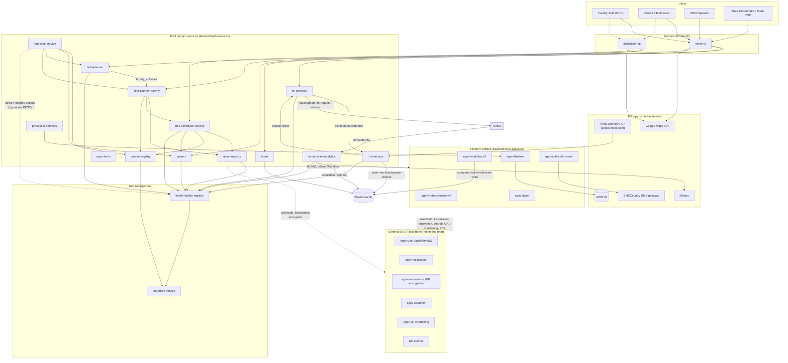

# Architecture

The repository is organized as a multi-application platform with backend services, web frontends, a Flutter mobile app, and shared data/API assets.

See the [README.md](../../README.md) for a non-technical overview, the full module list, and quick-start links; [User roles and permissions](user-roles-and-permissions.md) for who can do what; the [CHANGELOG.md](../../CHANGELOG.md) for repository-wide release history; and the [Platform Architecture doc](../../docs/PLATFORM_ARCHITECTURE.md) for the full system diagram — every service, Kafka topic, Elasticsearch index, and external dependency in one place.

## Platform-wide system diagram

This is the full system map: every backend service, how they talk to each other (REST, Kafka, shared Elasticsearch indices), and everything the platform depends on outside this repo. For the complete Kafka topic list, Elasticsearch index list, and external-dependency tables behind this diagram, see [Platform Architecture](../../docs/PLATFORM_ARCHITECTURE.md).

## High-level structure

- **Users and field teams**
  - → [Frontend React applications](../../frontend)
  - → Flutter mobile application (no `mobile/` directory currently exists in this repository, despite the Mobile layer section below describing one)
  - → Backend: [core services](../../backend/core-services), [E4H services](../../backend/e4h-services)
  - → Registries, workflows, MDMS/master data, [ingestion](../../backend/e4h-services/ingestion-service), and operational jobs

## Backend layer

Backend services are Java/Maven services grouped into:

- [`backend/core-services`](../../backend/core-services): shared platform services such as boundary, filestore, ID generation, MDMS, SMS notification, workflow, facility registry, and gateway support.
- [`backend/e4h-services`](../../backend/e4h-services): E4H domain services such as asset registry, RMS, ingestion, project, field planning, HRMS, inbox, analytics, vendor registry, AMC scheduling, and processor services.

Many services include their own `README.md` (with a Local Setup section) and `CHANGELOG.md`.

## Frontend layer

The frontend is based on DIGIT UI patterns and React/Yarn projects under [`frontend`](../../frontend).

- [`frontend/micro-ui`](../../frontend/micro-ui) contains the main micro UI implementation.
- [`frontend/installation-ui`](../../frontend/installation-ui) contains installation-related web UI.
- [`frontend/build`](../../frontend/build) contains frontend build configuration.

## Mobile layer

The mobile app is a Flutter project under `mobile`. Its code is grouped around BLoCs, repositories, models, pages, routing, utilities, and widgets.

The app includes modules for auth, localization, asset submission, scheduled visits, installation images, summaries, MDMS-backed data, and local cache flows.

## Data layer

For a consolidated, cross-service view of the underlying data model, see the [Entity-Relationship Diagram](../../ERD.md) at the repository root.
